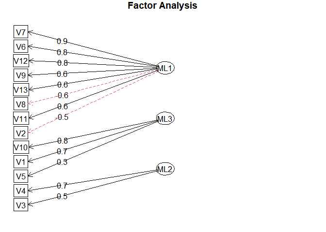

Multivariate Project
================
2022-12-16

``` r
rm(list=ls())
library(MASS)
library(HDclassif)
```

    ## Warning: package 'HDclassif' was built under R version 4.2.2

``` r
data("wine")
str(wine)
```

    ## 'data.frame':    178 obs. of  14 variables:
    ##  $ class: int  1 1 1 1 1 1 1 1 1 1 ...
    ##  $ V1   : num  14.2 13.2 13.2 14.4 13.2 ...
    ##  $ V2   : num  1.71 1.78 2.36 1.95 2.59 1.76 1.87 2.15 1.64 1.35 ...
    ##  $ V3   : num  2.43 2.14 2.67 2.5 2.87 2.45 2.45 2.61 2.17 2.27 ...
    ##  $ V4   : num  15.6 11.2 18.6 16.8 21 15.2 14.6 17.6 14 16 ...
    ##  $ V5   : int  127 100 101 113 118 112 96 121 97 98 ...
    ##  $ V6   : num  2.8 2.65 2.8 3.85 2.8 3.27 2.5 2.6 2.8 2.98 ...
    ##  $ V7   : num  3.06 2.76 3.24 3.49 2.69 3.39 2.52 2.51 2.98 3.15 ...
    ##  $ V8   : num  0.28 0.26 0.3 0.24 0.39 0.34 0.3 0.31 0.29 0.22 ...
    ##  $ V9   : num  2.29 1.28 2.81 2.18 1.82 1.97 1.98 1.25 1.98 1.85 ...
    ##  $ V10  : num  5.64 4.38 5.68 7.8 4.32 6.75 5.25 5.05 5.2 7.22 ...
    ##  $ V11  : num  1.04 1.05 1.03 0.86 1.04 1.05 1.02 1.06 1.08 1.01 ...
    ##  $ V12  : num  3.92 3.4 3.17 3.45 2.93 2.85 3.58 3.58 2.85 3.55 ...
    ##  $ V13  : int  1065 1050 1185 1480 735 1450 1290 1295 1045 1045 ...

``` r
data = wine[-c(1)]
head(data)
```

    ##      V1   V2   V3   V4  V5   V6   V7   V8   V9  V10  V11  V12  V13
    ## 1 14.23 1.71 2.43 15.6 127 2.80 3.06 0.28 2.29 5.64 1.04 3.92 1065
    ## 2 13.20 1.78 2.14 11.2 100 2.65 2.76 0.26 1.28 4.38 1.05 3.40 1050
    ## 3 13.16 2.36 2.67 18.6 101 2.80 3.24 0.30 2.81 5.68 1.03 3.17 1185
    ## 4 14.37 1.95 2.50 16.8 113 3.85 3.49 0.24 2.18 7.80 0.86 3.45 1480
    ## 5 13.24 2.59 2.87 21.0 118 2.80 2.69 0.39 1.82 4.32 1.04 2.93  735
    ## 6 14.20 1.76 2.45 15.2 112 3.27 3.39 0.34 1.97 6.75 1.05 2.85 1450

``` r
dim(data)
```

    ## [1] 178  13

``` r
data_pca = prcomp(data,scale=TRUE)
summary(data_pca)
```

    ## Importance of components:
    ##                          PC1    PC2    PC3     PC4     PC5     PC6     PC7
    ## Standard deviation     2.169 1.5802 1.2025 0.95863 0.92370 0.80103 0.74231
    ## Proportion of Variance 0.362 0.1921 0.1112 0.07069 0.06563 0.04936 0.04239
    ## Cumulative Proportion  0.362 0.5541 0.6653 0.73599 0.80162 0.85098 0.89337
    ##                            PC8     PC9   PC10    PC11    PC12    PC13
    ## Standard deviation     0.59034 0.53748 0.5009 0.47517 0.41082 0.32152
    ## Proportion of Variance 0.02681 0.02222 0.0193 0.01737 0.01298 0.00795
    ## Cumulative Proportion  0.92018 0.94240 0.9617 0.97907 0.99205 1.00000

``` r
screeplot(data_pca,type="lines")
```

<!-- -->

From the screeplot, we see that the first 3 Principal components are
enough to explain the variations among the variables. So, almost 67%
variance will be explained by these 3 principal components.

``` r
library(ggplot2)
```

    ## Warning: package 'ggplot2' was built under R version 4.2.2

``` r
library(factoextra)
```

    ## Warning: package 'factoextra' was built under R version 4.2.2

    ## Welcome! Want to learn more? See two factoextra-related books at https://goo.gl/ve3WBa

``` r
fviz_pca_var(data_pca)
```

<!-- -->

From the loading vectors plot and biplot, we see that Ash(V3), Color
intensity(V10), Alchohol(V1), Magnesium(V5) and Proline(V13) are highly
correlated and they are forming the first principal component that
explains around 37% of variation of the whole dataset.

On the other hand Alcalinity of Ash(V4), Nonflavanoids Phenols(V8),
Total Phenols(V6), Flavanoids(V7), Proanthocyanins(V9), Hue(V11) and
OD280/OD315 of Diluted Wines(V12) variables are highly correlated with
each other and forming the second principal component that explains
around 20% of the total variation of the dataset.

``` r
fviz_pca_ind(data_pca)
```

<!-- -->

``` r
fviz_pca(data_pca)
```

<!-- -->

## Canonical Correlation

To conduct canonical correlation, we need two sets of variable. From the
Proncipal Component Ananlysis, I have taken 4 variables from each
principal components which are mostly correlated to each other and
trying to see the canonical correlation among them.

``` r
library(CCA)
```

    ## Warning: package 'CCA' was built under R version 4.2.2

    ## Loading required package: fda

    ## Warning: package 'fda' was built under R version 4.2.2

    ## Loading required package: splines

    ## Loading required package: fds

    ## Warning: package 'fds' was built under R version 4.2.2

    ## Loading required package: rainbow

    ## Warning: package 'rainbow' was built under R version 4.2.2

    ## Loading required package: pcaPP

    ## Warning: package 'pcaPP' was built under R version 4.2.2

    ## Loading required package: RCurl

    ## Warning: package 'RCurl' was built under R version 4.2.2

    ## Loading required package: deSolve

    ## Warning: package 'deSolve' was built under R version 4.2.2

    ## 
    ## Attaching package: 'fda'

    ## The following object is masked from 'package:graphics':
    ## 
    ##     matplot

    ## Loading required package: fields

    ## Warning: package 'fields' was built under R version 4.2.2

    ## Loading required package: spam

    ## Warning: package 'spam' was built under R version 4.2.2

    ## Spam version 2.9-1 (2022-08-07) is loaded.
    ## Type 'help( Spam)' or 'demo( spam)' for a short introduction 
    ## and overview of this package.
    ## Help for individual functions is also obtained by adding the
    ## suffix '.spam' to the function name, e.g. 'help( chol.spam)'.

    ## 
    ## Attaching package: 'spam'

    ## The following objects are masked from 'package:base':
    ## 
    ##     backsolve, forwardsolve

    ## Loading required package: viridis

    ## Loading required package: viridisLite

    ## 
    ## Try help(fields) to get started.

``` r
library(tidyverse)
```

    ## Warning: package 'tidyverse' was built under R version 4.2.2

    ## ── Attaching packages
    ## ───────────────────────────────────────
    ## tidyverse 1.3.2 ──

    ## ✔ tibble  3.1.8      ✔ dplyr   1.0.10
    ## ✔ tidyr   1.2.1      ✔ stringr 1.5.0 
    ## ✔ readr   2.1.3      ✔ forcats 0.5.2 
    ## ✔ purrr   1.0.0

    ## Warning: package 'readr' was built under R version 4.2.2

    ## Warning: package 'stringr' was built under R version 4.2.2

    ## Warning: package 'forcats' was built under R version 4.2.2

    ## ── Conflicts ────────────────────────────────────────── tidyverse_conflicts() ──
    ## ✖ tidyr::complete() masks RCurl::complete()
    ## ✖ dplyr::filter()   masks stats::filter()
    ## ✖ dplyr::lag()      masks stats::lag()
    ## ✖ dplyr::select()   masks MASS::select()

``` r
X = cbind(data$V3, data$V10, data$V1, data$V5)
Y = cbind(data$V4, data$V8, data$V7, data$V9)
?cc
```

    ## starting httpd help server ... done

``` r
cc_results = cc(X,Y)
cc_results
```

    ## $cor
    ## [1] 0.68744483 0.48619581 0.27343023 0.09646641
    ## 
    ## $names
    ## $names$Xnames
    ## NULL
    ## 
    ## $names$Ynames
    ## NULL
    ## 
    ## $names$ind.names
    ## NULL
    ## 
    ## 
    ## $xcoef
    ##             [,1]       [,2]        [,3]       [,4]
    ## [1,] -3.55668244  1.3971462 -0.11205984 0.76463886
    ## [2,] -0.02234168 -0.4451036  0.02158392 0.27329792
    ## [3,]  0.60383137  1.0846119 -0.73553165 0.41444447
    ## [4,]  0.02384282  0.0108288  0.06945790 0.01081738
    ## 
    ## $ycoef
    ##            [,1]        [,2]       [,3]        [,4]
    ## [1,] -0.2699437  0.02503639  0.1713116 -0.06994836
    ## [2,] -3.2911351 -0.26028609 -6.7028409  6.30177956
    ## [3,] -0.5930777  1.23144396 -0.5840112 -0.04117452
    ## [4,]  0.4572694 -0.72369315  1.2964775  1.70920550
    ## 
    ## $scores
    ## $scores$xscores
    ##                [,1]         [,2]         [,3]         [,4]
    ##   [1,]  1.153466923  1.458263278  0.994509713  1.011951869
    ##   [2,]  0.947352931  0.204393677 -0.117954391 -0.273095861
    ##   [3,] -0.967043382  0.333690765 -0.050407840  0.481689628
    ##   [4,]  0.606978052  0.594882214 -0.042098243  1.562378985
    ##   [5,] -1.194360756  1.489319412  1.019767837  0.479983264
    ##   [6,]  0.681776787  0.797170886 -0.003575889  1.155911288
    ##   [7,]  0.448532168  1.497641855 -1.287029195  0.651630771
    ##   [8,]  0.280737431  1.723003927  0.669897406  0.852981248
    ##   [9,]  1.735048956  1.616754148 -1.510907662  0.617039942
    ##  [10,]  0.772376907 -0.183885327 -0.695590522  0.854371864
    ##  [11,]  1.010337965  0.848439818 -0.421002975  0.650751430
    ##  [12,]  0.729609017  1.123614740 -1.148721752  0.361185852
    ##  [13,]  0.029628070  0.516016535 -1.290457476  0.375733361
    ##  [14,]  0.756747062  1.683363856 -1.889148914  0.741860233
    ##  [15,]  0.784249756  0.452485125 -0.806518462  1.273786203
    ##  [16,] -0.563865628  0.283421640  0.399533349  1.261151509
    ##  [17,] -0.015113860  1.614298908  0.436406837  1.340033419
    ##  [18,] -0.071397126  0.732631255  0.454656762  1.124012895
    ##  [19,]  0.430100448 -0.083028096 -0.235325322  1.664367424
    ##  [20,]  0.084631200  1.121210448  0.638213384  0.600260619
    ##  [21,]  1.560251720  1.049027490  1.067117008  0.818716078
    ##  [22,] -0.984584946  0.592338169  0.164994510  0.059400462
    ##  [23,]  0.509637787  1.333906819 -0.460789471 -0.041204043
    ##  [24,] -0.724687712  0.501847705 -0.260103319 -0.304659626
    ##  [25,] -0.619295834  1.525909897 -0.687675785 -0.067687987
    ##  [26,] -2.394337813  2.166593766  1.521073209  0.531526241
    ##  [27,] -0.821409916  0.818355022 -0.788634183  0.211738701
    ##  [28,]  0.874286078  0.439276654 -0.617536046 -0.414073803
    ##  [29,] -0.831271731  1.875589288 -0.195924715  0.617760997
    ##  [30,]  1.091006271  1.005827350 -0.999859280  0.164459136
    ##  [31,] -0.730006808  0.984931877 -0.472590997  0.746328101
    ##  [32,]  0.481094592 -0.132769985  0.049029304  0.806228622
    ##  [33,]  0.562157635  1.316050704 -0.229486463 -0.010253318
    ##  [34,]  0.033938018  1.486693990  1.652062794  1.012110863
    ##  [35,] -0.436917698  1.441574540  0.287574180  0.304327926
    ##  [36,]  0.140035446  0.564839879 -0.338618985  0.246175583
    ##  [37,] -1.260505248  1.279530123  0.444088659  0.463606248
    ##  [38,] -0.646242793  0.650737704 -0.195290888 -0.078924090
    ##  [39,]  0.978628856  0.288521152 -0.171445751 -0.565036542
    ##  [40,]  0.898801341  1.810373606  1.050702825  0.932215038
    ##  [41,]  0.926326187  0.237527010  0.816760216  0.668259581
    ##  [42,]  0.909097148  0.340441664 -0.966912239 -0.336858899
    ##  [43,] -0.242164781  1.114115564 -0.576421822  0.650594060
    ##  [44,]  0.509979110  0.498738542  0.043757391 -0.114836070
    ##  [45,]  1.151199745 -0.232150781  0.497308443 -0.109749796
    ##  [46,]  0.733275044  1.455323219 -0.111860230  0.728912109
    ##  [47,]  1.198006369  1.470039927 -0.851430675  0.486747734
    ##  [48,]  1.426583666  0.180929667 -0.524003103  0.482612289
    ##  [49,]  0.596930327  0.766200215 -0.561411995  0.828564617
    ##  [50,]  1.021577581 -0.736602502 -0.023593060  1.454841729
    ##  [51,]  0.958700380 -1.439835314 -0.491215204  0.272434661
    ##  [52,] -0.478620990  0.922387244 -1.023301875  0.608257205
    ##  [53,]  0.528476016  0.198744084  0.216305209  1.046655218
    ##  [54,] -0.314325450  0.884914397  0.485589895  1.063035183
    ##  [55,]  1.278515269  0.484386196  0.754502511  0.631275219
    ##  [56,]  0.366300001  0.382857708  0.733083410  0.804933780
    ##  [57,]  1.378679114  0.838952311  0.407283805  1.013288404
    ##  [58,] -0.907418647  0.357057414 -0.070782797  0.641486512
    ##  [59,]  0.117615248  0.280844105  0.067123905  0.965605258
    ##  [60,]  2.988561654 -0.833951994 -0.306000185 -2.007425590
    ##  [61,] -0.027273818 -0.038724417  0.551769515 -0.819156418
    ##  [62,]  1.005401154 -1.180438509  0.336960487 -0.222523283
    ##  [63,]  1.883525073  0.599976450 -0.868267181 -0.469944585
    ##  [64,]  0.063518684 -0.839822898 -0.411146150 -0.723287091
    ##  [65,] -0.934379652  0.311943768  0.842906467 -0.749311009
    ##  [66,] -1.100234537 -0.228613213  0.311304409 -0.257445671
    ##  [67,]  1.912852022 -1.155694558 -1.510666818 -0.633385255
    ##  [68,]  0.697398514 -1.374970978 -1.004408592 -0.941298323
    ##  [69,]  0.514880807  1.310474850  0.422880474 -0.269369758
    ##  [70,]  2.986832552 -0.180982019  4.163254808 -0.848064439
    ##  [71,]  0.250141505 -0.060328738  0.723202308 -0.927749697
    ##  [72,] -0.850617839  1.954225512 -1.656791524 -0.019045161
    ##  [73,]  0.471137816  0.802737730 -1.259230971 -0.391979695
    ##  [74,]  0.137356284  1.500092184  2.671586413  0.131985670
    ##  [75,] -0.320484573 -0.385381689  0.820379994 -0.973605970
    ##  [76,]  0.741352476 -1.547607140  0.818525139 -1.270525830
    ##  [77,]  2.035360414 -0.830289148 -0.912390425 -0.763663920
    ##  [78,]  0.130805781 -0.244960572  1.668437891 -1.110919672
    ##  [79,]  1.978025624 -0.178638279  3.022581691 -0.657350187
    ##  [80,] -0.215018927  0.841812076  0.251066879 -0.765363842
    ##  [81,]  0.428893726 -0.607549432 -0.232616414 -1.542722081
    ##  [82,]  0.121037471 -0.170344678 -0.754393679 -0.708777206
    ##  [83,] -1.520747854  0.238664799 -0.910747844 -1.288129126
    ##  [84,] -0.150450400 -0.056187256 -1.060598675 -0.245103123
    ##  [85,] -1.552140482 -0.128919179  0.387608306 -0.928689758
    ##  [86,]  0.287132600  0.541817555  0.153225797 -0.908109259
    ##  [87,] -0.480576452  0.064674159 -0.108287621 -1.209768292
    ##  [88,] -1.942138896 -0.143785742  0.096416758 -1.164737000
    ##  [89,] -1.478947630 -0.510511158 -0.151813169 -1.279833602
    ##  [90,] -0.954309919  0.063381401 -1.452807087 -1.660959374
    ##  [91,] -0.777918070 -0.083327314 -0.676765989 -1.346298784
    ##  [92,] -1.089488747 -0.510362019 -0.255939231 -0.920946051
    ##  [93,] -0.234544900  0.194311041 -1.174145057 -0.972539722
    ##  [94,] -0.122960088  0.191804048 -0.339212328 -1.328332145
    ##  [95,] -0.527075713 -0.832383201  0.865191607 -1.151330093
    ##  [96,]  1.811178038  0.960125526  4.680230578 -0.345554680
    ##  [97,] -1.173323939  0.740044675  3.158189547 -0.536399499
    ##  [98,]  0.642358981 -0.509825141 -0.504503728 -1.339324176
    ##  [99,]  0.299645365 -0.935078054 -0.333885463 -0.744683146
    ## [100,] -0.090744515  0.111067043 -0.334854142 -1.294983846
    ## [101,]  1.788602628 -1.176890479  0.523463049 -1.401328660
    ## [102,]  1.195663513 -0.052584121 -0.524892816 -1.362549419
    ## [103,] -0.722466209  0.400320332  0.305725283 -0.838279141
    ## [104,]  0.756836311 -0.774591527 -0.096270462 -1.829329833
    ## [105,]  0.774308215 -0.289014662 -0.665457334 -1.237214475
    ## [106,] -0.186898418  0.179511507 -0.289647477 -1.064273805
    ## [107,] -0.010114749 -0.634304942 -0.827268381 -1.166290459
    ## [108,] -0.197777753  0.186831599 -0.915224621 -0.833219609
    ## [109,]  0.913726150 -0.476811529  0.033354401 -1.377858761
    ## [110,] -2.108886917 -0.032680931  0.534699837 -1.041574489
    ## [111,]  1.234790146 -1.395362926  1.651990929 -1.567672928
    ## [112,]  0.197106501  0.438173026 -0.506019205 -1.312236547
    ## [113,] -2.611889912  0.022973015  1.049659540 -0.399538239
    ## [114,] -1.670980539 -0.785399886  0.296751817 -1.224777336
    ## [115,] -1.357763293 -0.021906425 -0.477771097 -1.039562688
    ## [116,] -0.878597001 -1.123960387  0.376029066 -1.966601577
    ## [117,]  0.368058828 -0.571944048 -0.110971276 -1.775282329
    ## [118,]  0.541105590  0.547524454  0.955745810 -1.105642727
    ## [119,]  0.801813104 -0.265907206 -1.194056462 -1.057828775
    ## [120,]  0.479993395 -0.053694216 -0.189490898 -1.865328159
    ## [121,] -1.175348225 -0.842824354  0.835627809 -1.136370974
    ## [122,] -3.502894339 -0.566801293  2.320838358  0.528944422
    ## [123,] -1.523006673  1.228108548  0.478917773 -0.752176068
    ## [124,]  0.598313779  0.668411735 -1.017334034 -0.980822543
    ## [125,] -1.138784282 -0.380508239 -0.452057062 -1.259670855
    ## [126,] -0.163125749 -0.420667483 -0.366999883 -1.323482284
    ## [127,] -0.375068712 -0.376943126 -0.550311529 -0.749216689
    ## [128,] -2.340237091  0.096877052  0.261977924 -0.831783866
    ## [129,] -0.358517923  0.403697806 -0.407667165 -1.242204416
    ## [130,] -1.043783426 -0.142732540 -0.719209429 -1.273156028
    ## [131,]  0.632645109  0.449974456  1.633985914 -0.114913027
    ## [132,] -0.098027781 -0.190114644  0.388127382  0.115121409
    ## [133,] -0.290055393 -0.464541340  0.029342371  0.103195387
    ## [134,] -0.007827820 -0.241531598  0.655287705 -0.077748555
    ## [135,] -0.242073662 -1.028995286 -0.641537846 -0.344784212
    ## [136,]  0.167826879 -1.638199338 -0.041398126  0.202581837
    ## [137,] -1.299389761 -0.150341013 -0.239499642 -0.624801649
    ## [138,] -1.344778423 -0.143002651  0.054372326 -0.042279042
    ## [139,]  0.629025063 -0.128693885 -1.141865591  0.116269660
    ## [140,] -0.929888797  0.241064930  0.175282098  0.095482649
    ## [141,] -1.307710149  0.552712341 -0.255197493  0.060057912
    ## [142,]  0.007534782  0.009189112 -0.996876542  0.168221685
    ## [143,] -0.993155050  1.342681005 -0.627340444  0.262365829
    ## [144,]  0.262869411  0.857798948 -1.005641776 -0.019528110
    ## [145,]  0.360857371 -2.316960212  1.490238315  0.555599812
    ## [146,]  0.943808328  0.365777630  0.041060188 -0.364245698
    ## [147,]  0.549382794  0.619643147 -2.006135671  0.003311179
    ## [148,] -0.868040208 -1.285590544 -0.815160474  0.592355533
    ## [149,] -0.114794029 -1.214986810 -0.701576710  0.977735339
    ## [150,]  0.290224437 -1.712033437  0.956960239  1.357972843
    ## [151,] -0.124602290 -0.428867563  1.296213256  1.620381099
    ## [152,] -0.366809724 -2.492887222  1.117576827  1.701340312
    ## [153,] -0.955852451 -0.078383346  1.049921634  1.072482266
    ## [154,]  0.282668774 -2.322061337 -0.162099238  1.502801360
    ## [155,]  0.714833024 -1.924698846  0.620431556  0.351834446
    ## [156,]  0.043492704 -1.219224691 -0.526289111  0.738392801
    ## [157,]  0.114488235 -0.946086132 -1.279692356  1.322040093
    ## [158,] -1.425096315 -1.331701867  0.236632563  0.618627573
    ## [159,] -0.596292397 -1.635197683 -0.972076376  2.961761878
    ## [160,] -1.088844697 -2.192872346 -0.984896573  2.120482479
    ## [161,] -0.772640325 -1.956799655 -0.289917547  0.326159728
    ## [162,] -0.046055463  0.702858132 -0.004607648  0.721506014
    ## [163,] -0.712681425 -0.029627749  0.532823468  0.311151457
    ## [164,]  0.178479490 -0.098132973  0.471213573  0.098884036
    ## [165,]  0.373901009 -1.365814812 -1.144834934  1.402599509
    ## [166,]  0.504422475 -0.180082123 -1.306380168  0.520695136
    ## [167,] -0.416244730 -1.566802168  0.546630786  2.023017196
    ## [168,] -0.268655087 -2.731370319 -0.562963283  1.168940639
    ## [169,] -0.755774789 -0.465922916 -0.019420640  1.528746398
    ## [170,] -1.298626050 -0.276620061  0.576676761  1.616128998
    ## [171,] -0.417075235 -1.170563179  0.343748879 -0.287081194
    ## [172,] -0.267355617 -2.674963681 -0.670631539  1.012903353
    ## [173,] -0.015684093 -0.744759605 -1.372459761  1.741336534
    ## [174,] -0.040653100 -0.341226929 -0.803444964  1.028571046
    ## [175,] -0.158704894 -0.381699222 -0.101220212  0.889434924
    ## [176,]  0.909647028 -1.925953118  1.331887650  1.654613405
    ## [177,]  0.478136335 -1.480134969  1.373688703  1.451311107
    ## [178,] -0.828151533 -0.137344164 -1.043031827  1.845147249
    ## 
    ## $scores$yscores
    ##               [,1]        [,2]         [,3]         [,4]
    ##   [1,]  1.02918231  0.68714206  0.185815772  0.909087159
    ##   [2,]  1.99883840  0.94368456 -1.568137327 -0.623120841
    ##   [3,]  0.28455467  0.60238497  1.134740004  1.706653113
    ##   [4,]  0.53157225  1.33672431  0.265765967  0.367360295
    ##   [5,] -0.78601638  0.67820861 -0.019674501  0.436469746
    ##   [6,]  0.59764983  1.29946865 -0.892475817  0.754639926
    ##   [7,]  1.41181170  0.21626509 -0.206094627  0.597451647
    ##   [8,]  0.24119336  0.80475296 -0.699776789 -0.796683912
    ##   [9,]  1.33387354  0.77031033 -0.510498309  0.557462590
    ##  [10,]  0.86409739  1.14202872  0.033499732 -0.252755086
    ##  [11,]  0.46573961  1.01788960  0.963974090  0.506227438
    ##  [12,]  0.81547750  0.46764082 -0.040090301 -0.505574479
    ##  [13,]  0.84672744  0.67249328 -0.259793871  0.136059326
    ##  [14,]  1.53341673  0.94243556 -1.232877720  3.010984125
    ##  [15,]  1.93045373  0.82377127  0.031979143  2.345205521
    ##  [16,]  0.24087771  1.13794328 -0.662617201 -0.489259015
    ##  [17,] -0.51689912  1.11438519  0.142850972  0.366163625
    ##  [18,] -1.01579612  1.59726388 -0.802310182  0.369281444
    ##  [19,] -0.05801584  2.08180766 -0.993692511  0.327424620
    ##  [20,]  1.22889722  1.12474234  0.055343121 -0.831693478
    ##  [21,]  0.90073049  0.98052859  0.211882077  0.299758390
    ##  [22,]  0.56183223  0.19396611  0.878534968  0.007098420
    ##  [23,]  0.62454228  0.92733729 -0.248608752 -0.241990885
    ##  [24,]  0.53081883  0.49839682  0.023649420 -0.761064975
    ##  [25,] -0.17976474  0.69907908  0.385610904 -0.456956563
    ##  [26,] -2.07742423  0.67284752  0.264832414  0.832150960
    ##  [27,]  0.38380534  1.14417206 -1.149658685 -0.178571926
    ##  [28,]  0.77031677  0.33371119 -0.217918770 -0.822689682
    ##  [29,] -0.48178169  1.03158200 -0.401027995  0.308270338
    ##  [30,]  1.27822069  0.02775312  0.412817345  0.255275917
    ##  [31,] -0.93787101  1.02613225  1.306558121  0.635466597
    ##  [32,]  0.04927579  1.19652997  0.670852938 -0.300321437
    ##  [33,]  0.20962600  0.46670777 -0.677272102  1.147707731
    ##  [34,] -0.98769623  1.01373053 -1.652499373  0.429202729
    ##  [35,]  0.04984148  0.65976749  0.038414504 -0.525801105
    ##  [36,] -0.37689872  1.02769863  0.648534884 -0.291359807
    ##  [37,]  0.65881750  0.87410718 -1.217285706 -0.279726029
    ##  [38,]  0.33336599  0.58395602 -0.204143712 -0.622655841
    ##  [39,]  0.88458140  0.83322966 -0.778790029 -0.639093767
    ##  [40,]  1.85617294  0.77522429  0.050315190  0.214711197
    ##  [41,]  0.55620360  0.93359418 -0.183066428  1.321215052
    ##  [42,]  0.05325511  0.88810411 -0.027181323 -0.746575531
    ##  [43,]  0.98684558  1.74345263 -0.236586018 -0.771158080
    ##  [44,]  0.35158753  0.65070554 -0.322461906 -0.030837967
    ##  [45,]  0.56795574  0.83646658  0.123608494  0.369236494
    ##  [46,] -0.15985296  1.01230528 -0.491804891 -0.956399010
    ##  [47,]  0.84315069  0.90758762  0.127479829  0.642640272
    ##  [48,]  0.88727824  1.23030712  0.336343945  0.170014829
    ##  [49,]  0.15790222  0.51931252  0.664343737  1.096916512
    ##  [50,]  0.03093440  1.46486477 -0.326522670  0.656554367
    ##  [51,]  2.41398772  0.44557056  1.056104941  1.490786926
    ##  [52,]  0.83625594  0.65661637  0.902965536  0.421945223
    ##  [53,]  0.73410084  1.77800540 -1.298044562  0.527210737
    ##  [54,]  0.14343852  0.80502813 -0.927697638  0.465862134
    ##  [55,]  0.83212870  1.01323457  0.016865734 -0.726575862
    ##  [56,]  0.20897388  0.37004804  1.932429323  0.347199568
    ##  [57,]  0.82273903  0.82414683  0.137747205  0.292164756
    ##  [58,]  0.21761287  1.37464930 -0.725758311 -0.069596621
    ##  [59,]  0.55235167  1.67021193  0.297147985 -0.187434030
    ##  [60,]  3.00057026 -1.15102914 -1.640967295 -1.834860767
    ##  [61,]  0.07800399 -0.45934498 -3.378529662 -0.045461878
    ##  [62,]  0.09740427 -0.17120076 -2.485819603 -0.385841214
    ##  [63,]  0.28954034  0.30184544 -0.951960838 -1.620786668
    ##  [64,]  0.19179964  1.14890041  0.803649810 -0.615410721
    ##  [65,] -0.24734697  0.02667894 -1.239714864 -0.357095055
    ##  [66,]  0.20525618  0.37339082 -0.021976658  0.959324814
    ##  [67,]  1.18122921  0.83233615  0.134039524  0.802987588
    ##  [68,]  0.03939440  0.38917632 -0.063454575 -1.526585968
    ##  [69,] -0.04862251 -0.16211941 -2.780668383 -0.611107198
    ##  [70,]  2.31771359 -1.59032003  2.641587577  0.375123785
    ##  [71,]  0.26759522 -1.12758937  0.520162124 -0.194149363
    ##  [72,] -1.35134656  0.99836648  1.837625156 -0.899183415
    ##  [73,] -1.05803810  0.30954234  0.770793391 -1.844862891
    ##  [74,] -2.67770309  1.09535936  2.793345701 -1.096331963
    ##  [75,]  0.31813564  0.19161665  1.823869097 -1.469911890
    ##  [76,]  1.08613527 -0.32830185 -0.755637789 -0.627929649
    ##  [77,]  1.28418658  0.03984610  0.047909195 -0.747194179
    ##  [78,]  0.30686126 -0.46477718 -1.129563023 -0.532213682
    ##  [79,]  1.94729840 -1.18129005  0.895565618  2.259318170
    ##  [80,] -1.31507327  0.45138768  0.305138669  0.776605353
    ##  [81,]  0.12676146  0.40428101 -0.013543416 -0.639678794
    ##  [82,]  0.30773624  0.49611937  0.503427250 -0.307747554
    ##  [83,] -1.16249577 -0.31223675  0.530963673 -0.382520138
    ##  [84,] -1.35405010 -0.55134947 -0.854215337  1.421389577
    ##  [85,]  1.11033773 -0.32730240  1.573332173  0.500654989
    ##  [86,]  0.60020808 -0.03652824  0.040922908 -0.505278422
    ##  [87,] -0.92937283 -0.33042107  0.267499726  0.159414966
    ##  [88,] -1.74761165 -0.18179906  0.778277845 -0.626204426
    ##  [89,] -0.86602374 -0.22150348 -0.545476498  0.199508823
    ##  [90,] -1.13541716 -0.30066873  0.296612560 -0.263101057
    ##  [91,]  0.08444919 -0.75337310 -0.857715421  1.171912680
    ##  [92,] -0.65083430 -0.96116407  0.008969947  0.794259398
    ##  [93,] -0.69231731 -0.74869410 -0.885569502  1.363595929
    ##  [94,]  0.82326357 -0.02532368  0.882154584  0.072747415
    ##  [95,]  0.78797115  0.47097726  0.582796117 -1.525698216
    ##  [96,]  0.90095645 -0.92744261  2.245043108  2.647975228
    ##  [97,]  0.79113749 -1.14949618  2.397426356 -1.548346074
    ##  [98,]  0.98263685  0.38126558 -0.159810066  0.078396481
    ##  [99,] -0.18670419  1.86591103  0.106962911 -0.155374560
    ## [100,]  0.10112004  0.24045924  0.172529717  2.704182693
    ## [101,]  0.70298130  0.28801870  0.011269530 -0.834397893
    ## [102,]  0.79183299 -0.65603843  0.389721062 -0.767401782
    ## [103,] -0.51068201  0.34606893 -0.007009519 -0.726432817
    ## [104,]  0.12454561 -0.35767915 -0.047964332 -0.225092259
    ## [105,] -0.11946690 -0.01824573  0.372754815 -0.519106134
    ## [106,] -1.62335831 -0.12428235 -1.680311475  1.419318006
    ## [107,]  0.12424376 -0.04190976 -0.089124198  0.152757015
    ## [108,] -1.02245305 -0.31540374 -0.069163147  0.612250621
    ## [109,]  0.25826153 -0.36046296  0.354393766  1.047523336
    ## [110,] -0.01699652  0.47755852  1.213615389  1.011937697
    ## [111,]  0.98260217 -0.72946185  3.074825966  2.608856231
    ## [112,] -0.38343788  0.62905523  0.319092985 -1.390991600
    ## [113,] -1.16787727  0.34300286 -2.211422997  0.540878762
    ## [114,] -0.65522002  0.10802153 -0.316293592  0.004023715
    ## [115,] -1.44201643  0.77725483 -0.808468777 -0.733092097
    ## [116,] -0.95355421 -0.12096295 -0.255371480  1.566886703
    ## [117,]  0.07802101 -0.43577582  0.809912562 -0.567490112
    ## [118,] -0.76655516  0.14188669  0.650581338 -0.317770219
    ## [119,]  0.83339174 -0.51420786 -1.586882705 -0.594539403
    ## [120,]  0.46528871 -0.69585926  0.449794772  0.579024397
    ## [121,] -0.34042831  0.78729971  0.232776438  0.078268141
    ## [122,] -4.46847699  3.75212504 -0.602027764  0.403052575
    ## [123,] -2.12052823  0.19549494  0.838859285  0.138870065
    ## [124,] -0.51418177  0.52739309  0.938928149  0.160731430
    ## [125,]  0.10316522  0.35492551  2.401433579  1.151184084
    ## [126,] -0.91138721  0.97429235 -0.471601681 -0.491245450
    ## [127,] -1.21666742  1.29337568 -0.267487731  0.297095011
    ## [128,] -3.19646094  0.30579898  0.176638960  1.025171354
    ## [129,] -1.58481046  0.40979111  0.756768507  0.401286600
    ## [130,] -0.81211777 -0.12198512 -0.109822083 -0.209047767
    ## [131,]  1.06785371 -0.48647838  0.372977980 -1.932815024
    ## [132,]  0.39672497 -0.40155126  0.389423720 -2.070435730
    ## [133,] -0.70468375 -0.46930200  0.949506267 -2.155823102
    ## [134,]  0.23862313 -0.37764246  1.140234952 -2.598567296
    ## [135,]  0.45839844 -1.64992048 -1.533590228  1.117293818
    ## [136,] -0.09947904 -1.30983228 -2.011992807  0.703251177
    ## [137,] -0.39655773 -1.35387001 -0.983974499 -0.333263295
    ## [138,] -1.74536526 -1.33677329 -0.655990458  0.524530178
    ## [139,] -0.12554817 -1.45001991 -1.478205823  0.223072921
    ## [140,] -1.27891620 -1.12591006 -0.532996437 -0.531369012
    ## [141,] -0.43721353 -1.28074203 -1.066318712 -0.419958805
    ## [142,]  0.30901213 -1.18452640 -0.307788279 -1.546307779
    ## [143,] -1.11665415 -1.04097497 -0.707930267 -1.126547686
    ## [144,] -0.02426229 -1.11612522 -0.660614256 -0.278984088
    ## [145,]  1.03979145 -1.21830037  0.456187262 -1.102453716
    ## [146,]  0.11374429 -1.59117246  0.287827466 -0.112132462
    ## [147,]  0.32346128 -1.41831374 -0.363572615 -1.282298249
    ## [148,] -0.41337928 -1.14749633 -0.523481616 -0.651203332
    ## [149,] -0.23446004 -1.28907210  0.051960214 -0.115177976
    ## [150,] -0.29637375 -0.40502469  0.278733139 -1.022326279
    ## [151,] -0.63275110 -0.16914572  1.548843513 -1.772809539
    ## [152,] -0.02956742 -0.49026438  1.207770658 -1.481138520
    ## [153,] -0.85556599 -0.72346621  2.108968528 -1.083866583
    ## [154,]  0.29078104 -1.76831572 -0.771493776  2.159777033
    ## [155,]  0.08250908 -1.67766346 -0.441640784  0.757679170
    ## [156,] -0.68173257 -1.69539534 -0.469973823  1.376246911
    ## [157,]  0.30693138 -1.48509726 -0.130720918  0.740743623
    ## [158,] -2.25510031 -1.34027712 -0.249827973  0.453825166
    ## [159,] -1.10570578 -1.59432852  1.674009760  2.599847114
    ## [160,] -0.46086937 -1.61620567  0.903845774  2.019572616
    ## [161,] -0.45496396 -0.96559800 -0.734539694 -0.130635895
    ## [162,] -0.08125698 -1.26026786 -1.006761859 -0.456074027
    ## [163,] -0.90081786 -1.30275684 -1.150346828  0.306033106
    ## [164,]  0.63375891 -1.20070872 -0.493699850 -0.747805103
    ## [165,] -0.29093955 -1.20544548  0.167225475 -0.774954587
    ## [166,] -0.60851761 -1.56700517 -0.206211580  0.097018293
    ## [167,] -0.57241872 -1.20125632  0.621802897  0.006209123
    ## [168,]  0.40125641 -1.24664089 -0.260133496 -0.764830319
    ## [169,] -0.76166108 -1.30970126  1.297323001 -0.210754200
    ## [170,] -0.76949190 -0.80698741  1.559753013 -1.741841236
    ## [171,]  0.52730679 -1.29481820 -0.557661996 -1.133065790
    ## [172,]  0.07602834 -1.21336163 -1.136596679 -0.818549591
    ## [173,]  0.23437881 -1.39067353 -0.115902852 -0.087894813
    ## [174,] -0.19281535 -1.37954341 -0.747279285  0.077322088
    ## [175,] -0.49445899 -1.37441714  0.656260920 -0.072251484
    ## [176,]  0.32352058 -1.47999135  0.099578198  0.037511742
    ## [177,]  0.05063749 -1.59794065 -0.422253250  0.856114048
    ## [178,] -1.36058902 -1.31496372 -0.041769789  0.539093242
    ## 
    ## $scores$corr.X.xscores
    ##             [,1]       [,2]        [,3]      [,4]
    ## [1,] -0.78787023  0.3467514  0.14019577 0.4892536
    ## [2,]  0.03151628 -0.4206388 -0.08581182 0.9026107
    ## [3,]  0.34770831  0.4397028 -0.30764849 0.7688386
    ## [4,]  0.18328712  0.2966289  0.83152569 0.4324144
    ## 
    ## $scores$corr.Y.xscores
    ##             [,1]       [,2]        [,3]        [,4]
    ## [1,] -0.61404478 -0.1354428  0.08988674 -0.01238047
    ## [2,] -0.35263219 -0.2490454 -0.15990966  0.03510969
    ## [3,]  0.07940045  0.4607832  0.04065244  0.02485008
    ## [4,]  0.13941629  0.1866876  0.15137069  0.06854963
    ## 
    ## $scores$corr.X.yscores
    ##            [,1]       [,2]        [,3]       [,4]
    ## [1,] -0.5416173  0.1685891  0.03833376 0.04719654
    ## [2,]  0.0216657 -0.2045128 -0.02346355 0.08707162
    ## [3,]  0.2390303  0.2137817 -0.08412040 0.07416710
    ## [4,]  0.1259998  0.1442197  0.22736426 0.04171346
    ## 
    ## $scores$corr.Y.yscores
    ##            [,1]       [,2]       [,3]       [,4]
    ## [1,] -0.8932277 -0.2785766  0.3287374 -0.1283397
    ## [2,] -0.5129607 -0.5122327 -0.5848280  0.3639576
    ## [3,]  0.1155008  0.9477318  0.1486758  0.2576034
    ## [4,]  0.2028036  0.3839762  0.5535990  0.7106062

``` r
cc_results$cor
```

    ## [1] 0.68744483 0.48619581 0.27343023 0.09646641

``` r
barplot(cc_results$cor, main = "Canonical correlations ", col = "gray")
```

<!-- -->

``` r
?plt.cc
```

Here is the graph showing canonical correlation among the 4 variables
belonging to each of the 2 groups.

``` r
plt.cc(cc_results, type = "b")
```

<!-- -->

``` r
str(cc_results)
```

    ## List of 5
    ##  $ cor   : num [1:4] 0.6874 0.4862 0.2734 0.0965
    ##  $ names :List of 3
    ##   ..$ Xnames   : NULL
    ##   ..$ Ynames   : NULL
    ##   ..$ ind.names: NULL
    ##  $ xcoef : num [1:4, 1:4] -3.5567 -0.0223 0.6038 0.0238 1.3971 ...
    ##  $ ycoef : num [1:4, 1:4] -0.27 -3.291 -0.593 0.457 0.025 ...
    ##  $ scores:List of 6
    ##   ..$ xscores       : num [1:178, 1:4] 1.153 0.947 -0.967 0.607 -1.194 ...
    ##   ..$ yscores       : num [1:178, 1:4] 1.029 1.999 0.285 0.532 -0.786 ...
    ##   ..$ corr.X.xscores: num [1:4, 1:4] -0.7879 0.0315 0.3477 0.1833 0.3468 ...
    ##   ..$ corr.Y.xscores: num [1:4, 1:4] -0.614 -0.3526 0.0794 0.1394 -0.1354 ...
    ##   ..$ corr.X.yscores: num [1:4, 1:4] -0.5416 0.0217 0.239 0.126 0.1686 ...
    ##   ..$ corr.Y.yscores: num [1:4, 1:4] -0.893 -0.513 0.116 0.203 -0.279 ...

``` r
cc_results$xcoef
```

    ##             [,1]       [,2]        [,3]       [,4]
    ## [1,] -3.55668244  1.3971462 -0.11205984 0.76463886
    ## [2,] -0.02234168 -0.4451036  0.02158392 0.27329792
    ## [3,]  0.60383137  1.0846119 -0.73553165 0.41444447
    ## [4,]  0.02384282  0.0108288  0.06945790 0.01081738

``` r
cc_results$ycoef
```

    ##            [,1]        [,2]       [,3]        [,4]
    ## [1,] -0.2699437  0.02503639  0.1713116 -0.06994836
    ## [2,] -3.2911351 -0.26028609 -6.7028409  6.30177956
    ## [3,] -0.5930777  1.23144396 -0.5840112 -0.04117452
    ## [4,]  0.4572694 -0.72369315  1.2964775  1.70920550

``` r
cc_results$cor
```

    ## [1] 0.68744483 0.48619581 0.27343023 0.09646641

``` r
?corrplot
```

    ## No documentation for 'corrplot' in specified packages and libraries:
    ## you could try '??corrplot'

``` r
library(CCA)
library(ggplot2)
library(corrplot)
```

    ## corrplot 0.92 loaded

``` r
library(ggcorrplot)
colnames(data)
```

    ##  [1] "V1"  "V2"  "V3"  "V4"  "V5"  "V6"  "V7"  "V8"  "V9"  "V10" "V11" "V12"
    ## [13] "V13"

``` r
pairs(data)
```

<!-- -->

``` r
library(psych)
```

    ## Warning: package 'psych' was built under R version 4.2.2

    ## 
    ## Attaching package: 'psych'

    ## The following object is masked from 'package:fields':
    ## 
    ##     describe

    ## The following objects are masked from 'package:ggplot2':
    ## 
    ##     %+%, alpha

``` r
corPlot(cor(data), method="circle", type = "full")
```

    ## Warning in axis(2, at = at2, labels = lab2, las = ylas, ...): "method" is not a
    ## graphical parameter

    ## Warning in axis(2, at = at2, labels = lab2, las = ylas, ...): graphical
    ## parameter "type" is obsolete

    ## Warning in axis(xaxis, at = at1, labels = lab1, las = xlas, line = line, :
    ## "method" is not a graphical parameter

    ## Warning in axis(xaxis, at = at1, labels = lab1, las = xlas, line = line, :
    ## graphical parameter "type" is obsolete

    ## Warning in text.default(rx, ry, rv, cex = pval * cex, ...): "method" is not a
    ## graphical parameter

    ## Warning in text.default(rx, ry, rv, cex = pval * cex, ...): graphical parameter
    ## "type" is obsolete

    ## Warning in axis(4, at = at2, labels = labels, las = 2, ...): "method" is not a
    ## graphical parameter

    ## Warning in axis(4, at = at2, labels = labels, las = 2, ...): graphical parameter
    ## "type" is obsolete

<!-- -->

``` r
library(nFactors)
```

    ## Warning: package 'nFactors' was built under R version 4.2.2

    ## Loading required package: lattice

    ## 
    ## Attaching package: 'lattice'

    ## The following object is masked from 'package:fda':
    ## 
    ##     melanoma

    ## 
    ## Attaching package: 'nFactors'

    ## The following object is masked from 'package:lattice':
    ## 
    ##     parallel

``` r
ev = eigen(cor(data))
nS = nScree(x=ev$values)
plotnScree(nS, legend = F)
```

<!-- -->

``` r
FA = fa(cor(data), nfactors = 3, fm = "mle", scores = "regression", rotate = "oblimin")
```

    ## Loading required namespace: GPArotation

    ## Warning in fac(r = r, nfactors = nfactors, n.obs = n.obs, rotate = rotate, : I
    ## am sorry, to do these rotations requires the GPArotation package to be installed

``` r
FA
```

    ## Factor Analysis using method =  ml
    ## Call: fa(r = cor(data), nfactors = 3, rotate = "oblimin", scores = "regression", 
    ##     fm = "mle")
    ## Standardized loadings (pattern matrix) based upon correlation matrix
    ##       ML1   ML3   ML2   h2    u2 com
    ## V1   0.32  0.68 -0.23 0.61 0.388 1.7
    ## V2  -0.45  0.26 -0.02 0.27 0.727 1.6
    ## V3  -0.06  0.48  0.49 0.48 0.522 2.0
    ## V4  -0.63  0.08  0.73 0.93 0.073 2.0
    ## V5   0.21  0.34  0.03 0.16 0.837 1.7
    ## V6   0.84  0.15  0.27 0.80 0.199 1.3
    ## V7   0.91  0.04  0.30 0.93 0.069 1.2
    ## V8  -0.58  0.06  0.00 0.34 0.658 1.0
    ## V9   0.61  0.10  0.24 0.44 0.555 1.4
    ## V10 -0.17  0.82 -0.22 0.75 0.246 1.2
    ## V11  0.57 -0.39  0.15 0.50 0.503 1.9
    ## V12  0.77 -0.23  0.31 0.75 0.252 1.5
    ## V13  0.59  0.50 -0.16 0.62 0.384 2.1
    ## 
    ##                        ML1  ML3  ML2
    ## SS loadings           4.30 2.05 1.24
    ## Proportion Var        0.33 0.16 0.10
    ## Cumulative Var        0.33 0.49 0.58
    ## Proportion Explained  0.57 0.27 0.16
    ## Cumulative Proportion 0.57 0.84 1.00
    ## 
    ## Mean item complexity =  1.6
    ## Test of the hypothesis that 3 factors are sufficient.
    ## 
    ## The degrees of freedom for the null model are  78  and the objective function was  7.67
    ## The degrees of freedom for the model are 42  and the objective function was  0.93 
    ## 
    ## The root mean square of the residuals (RMSR) is  0.05 
    ## The df corrected root mean square of the residuals is  0.07 
    ## 
    ## Fit based upon off diagonal values = 0.98
    ## Measures of factor score adequacy             
    ##                                                    ML1  ML3  ML2
    ## Correlation of (regression) scores with factors   0.98 0.93 0.95
    ## Multiple R square of scores with factors          0.96 0.86 0.91
    ## Minimum correlation of possible factor scores     0.93 0.72 0.82

``` r
FA$loadings
```

    ## 
    ## Loadings:
    ##     ML1    ML3    ML2   
    ## V1   0.318  0.675 -0.235
    ## V2  -0.454  0.260       
    ## V3          0.480  0.493
    ## V4  -0.628         0.725
    ## V5   0.212  0.342       
    ## V6   0.840  0.150  0.270
    ## V7   0.915         0.305
    ## V8  -0.582              
    ## V9   0.614         0.242
    ## V10 -0.165  0.825 -0.215
    ## V11  0.568 -0.389  0.154
    ## V12  0.773 -0.231  0.311
    ## V13  0.586  0.498 -0.156
    ## 
    ##                  ML1   ML3   ML2
    ## SS loadings    4.300 2.048 1.241
    ## Proportion Var 0.331 0.158 0.095
    ## Cumulative Var 0.331 0.488 0.584

``` r
summary(FA)
```

    ## 
    ## Factor analysis with Call: fa(r = cor(data), nfactors = 3, rotate = "oblimin", scores = "regression", 
    ##     fm = "mle")
    ## 
    ## Test of the hypothesis that 3 factors are sufficient.
    ## The degrees of freedom for the model is 42  and the objective function was  0.93 
    ## 
    ## The root mean square of the residuals (RMSA) is  0.05 
    ## The df corrected root mean square of the residuals is  0.07

To group the variables, I will take 3 factors based on the criteria that
the eigen values are greater than 1. The green triangles in the above
graph is showing the line where eigen value is 1.

``` r
fa.diagram(FA)
```

<!-- -->

``` r
print(ev$values)
```

    ##  [1] 4.7058503 2.4969737 1.4460720 0.9189739 0.8532282 0.6416570 0.5510283
    ##  [8] 0.3484974 0.2888799 0.2509025 0.2257886 0.1687702 0.1033779

``` r
?factanal
model = factanal(data, 3, rotation = "varimax")
model
```

    ## 
    ## Call:
    ## factanal(x = data, factors = 3, rotation = "varimax")
    ## 
    ## Uniquenesses:
    ##    V1    V2    V3    V4    V5    V6    V7    V8    V9   V10   V11   V12   V13 
    ## 0.387 0.727 0.522 0.073 0.837 0.199 0.069 0.658 0.555 0.246 0.503 0.252 0.384 
    ## 
    ## Loadings:
    ##     Factor1 Factor2 Factor3
    ## V1           0.779         
    ## V2  -0.470           0.213 
    ## V3           0.285   0.629 
    ## V4  -0.300  -0.322   0.856 
    ## V5   0.126   0.373         
    ## V6   0.824   0.347         
    ## V7   0.928   0.265         
    ## V8  -0.533  -0.144   0.193 
    ## V9   0.622   0.230         
    ## V10 -0.413   0.748   0.157 
    ## V11  0.654  -0.202  -0.172 
    ## V12  0.864                 
    ## V13  0.355   0.688  -0.129 
    ## 
    ##                Factor1 Factor2 Factor3
    ## SS loadings      4.009   2.277   1.302
    ## Proportion Var   0.308   0.175   0.100
    ## Cumulative Var   0.308   0.484   0.584
    ## 
    ## Test of the hypothesis that 3 factors are sufficient.
    ## The chi square statistic is 158.55 on 42 degrees of freedom.
    ## The p-value is 1.96e-15

``` r
print(model, digits=2, cutoff=0.3, sort=T)
```

    ## 
    ## Call:
    ## factanal(x = data, factors = 3, rotation = "varimax")
    ## 
    ## Uniquenesses:
    ##   V1   V2   V3   V4   V5   V6   V7   V8   V9  V10  V11  V12  V13 
    ## 0.39 0.73 0.52 0.07 0.84 0.20 0.07 0.66 0.56 0.25 0.50 0.25 0.38 
    ## 
    ## Loadings:
    ##     Factor1 Factor2 Factor3
    ## V6   0.82    0.35          
    ## V7   0.93                  
    ## V8  -0.53                  
    ## V9   0.62                  
    ## V11  0.65                  
    ## V12  0.86                  
    ## V1           0.78          
    ## V10 -0.41    0.75          
    ## V13  0.35    0.69          
    ## V3                   0.63  
    ## V4          -0.32    0.86  
    ## V2  -0.47                  
    ## V5           0.37          
    ## 
    ##                Factor1 Factor2 Factor3
    ## SS loadings       4.01    2.28    1.30
    ## Proportion Var    0.31    0.18    0.10
    ## Cumulative Var    0.31    0.48    0.58
    ## 
    ## Test of the hypothesis that 3 factors are sufficient.
    ## The chi square statistic is 158.55 on 42 degrees of freedom.
    ## The p-value is 1.96e-15

``` r
summary(model$loadings)
```

    ##     Factor1           Factor2            Factor3        
    ##  Min.   :-0.5333   Min.   :-0.32188   Min.   :-0.17153  
    ##  1st Qu.:-0.2999   1st Qu.:-0.03125   1st Qu.:-0.03549  
    ##  Median : 0.1261   Median : 0.26536   Median : 0.06917  
    ##  Mean   : 0.2100   Mean   : 0.23878   Mean   : 0.14419  
    ##  3rd Qu.: 0.6536   3rd Qu.: 0.37300   3rd Qu.: 0.19285  
    ##  Max.   : 0.9276   Max.   : 0.77925   Max.   : 0.85648

``` r
data_matrix = as.matrix(data)
data_matrix
```

    ##           V1   V2   V3   V4  V5   V6   V7   V8   V9       V10   V11  V12  V13
    ##   [1,] 14.23 1.71 2.43 15.6 127 2.80 3.06 0.28 2.29  5.640000 1.040 3.92 1065
    ##   [2,] 13.20 1.78 2.14 11.2 100 2.65 2.76 0.26 1.28  4.380000 1.050 3.40 1050
    ##   [3,] 13.16 2.36 2.67 18.6 101 2.80 3.24 0.30 2.81  5.680000 1.030 3.17 1185
    ##   [4,] 14.37 1.95 2.50 16.8 113 3.85 3.49 0.24 2.18  7.800000 0.860 3.45 1480
    ##   [5,] 13.24 2.59 2.87 21.0 118 2.80 2.69 0.39 1.82  4.320000 1.040 2.93  735
    ##   [6,] 14.20 1.76 2.45 15.2 112 3.27 3.39 0.34 1.97  6.750000 1.050 2.85 1450
    ##   [7,] 14.39 1.87 2.45 14.6  96 2.50 2.52 0.30 1.98  5.250000 1.020 3.58 1290
    ##   [8,] 14.06 2.15 2.61 17.6 121 2.60 2.51 0.31 1.25  5.050000 1.060 3.58 1295
    ##   [9,] 14.83 1.64 2.17 14.0  97 2.80 2.98 0.29 1.98  5.200000 1.080 2.85 1045
    ##  [10,] 13.86 1.35 2.27 16.0  98 2.98 3.15 0.22 1.85  7.220000 1.010 3.55 1045
    ##  [11,] 14.10 2.16 2.30 18.0 105 2.95 3.32 0.22 2.38  5.750000 1.250 3.17 1510
    ##  [12,] 14.12 1.48 2.32 16.8  95 2.20 2.43 0.26 1.57  5.000000 1.170 2.82 1280
    ##  [13,] 13.75 1.73 2.41 16.0  89 2.60 2.76 0.29 1.81  5.600000 1.150 2.90 1320
    ##  [14,] 14.75 1.73 2.39 11.4  91 3.10 3.69 0.43 2.81  5.400000 1.250 2.73 1150
    ##  [15,] 14.38 1.87 2.38 12.0 102 3.30 3.64 0.29 2.96  7.500000 1.200 3.00 1547
    ##  [16,] 13.63 1.81 2.70 17.2 112 2.85 2.91 0.30 1.46  7.300000 1.280 2.88 1310
    ##  [17,] 14.30 1.92 2.72 20.0 120 2.80 3.14 0.33 1.97  6.200000 1.070 2.65 1280
    ##  [18,] 13.83 1.57 2.62 20.0 115 2.95 3.40 0.40 1.72  6.600000 1.130 2.57 1130
    ##  [19,] 14.19 1.59 2.48 16.5 108 3.30 3.93 0.32 1.86  8.700000 1.230 2.82 1680
    ##  [20,] 13.64 3.10 2.56 15.2 116 2.70 3.03 0.17 1.66  5.100000 0.960 3.36  845
    ##  [21,] 14.06 1.63 2.28 16.0 126 3.00 3.17 0.24 2.10  5.650000 1.090 3.71  780
    ##  [22,] 12.93 3.80 2.65 18.6 102 2.41 2.41 0.25 1.98  4.500000 1.030 3.52  770
    ##  [23,] 13.71 1.86 2.36 16.6 101 2.61 2.88 0.27 1.69  3.800000 1.110 4.00 1035
    ##  [24,] 12.85 1.60 2.52 17.8  95 2.48 2.37 0.26 1.46  3.930000 1.090 3.63 1015
    ##  [25,] 13.50 1.81 2.61 20.0  96 2.53 2.61 0.28 1.66  3.520000 1.120 3.82  845
    ##  [26,] 13.05 2.05 3.22 25.0 124 2.63 2.68 0.47 1.92  3.580000 1.130 3.20  830
    ##  [27,] 13.39 1.77 2.62 16.1  93 2.85 2.94 0.34 1.45  4.800000 0.920 3.22 1195
    ##  [28,] 13.30 1.72 2.14 17.0  94 2.40 2.19 0.27 1.35  3.950000 1.020 2.77 1285
    ##  [29,] 13.87 1.90 2.80 19.4 107 2.95 2.97 0.37 1.76  4.500000 1.250 3.40  915
    ##  [30,] 14.02 1.68 2.21 16.0  96 2.65 2.33 0.26 1.98  4.700000 1.040 3.59 1035
    ##  [31,] 13.73 1.50 2.70 22.5 101 3.00 3.25 0.29 2.38  5.700000 1.190 2.71 1285
    ##  [32,] 13.58 1.66 2.36 19.1 106 2.86 3.19 0.22 1.95  6.900000 1.090 2.88 1515
    ##  [33,] 13.68 1.83 2.36 17.2 104 2.42 2.69 0.42 1.97  3.840000 1.230 2.87  990
    ##  [34,] 13.76 1.53 2.70 19.5 132 2.95 2.74 0.50 1.35  5.400000 1.250 3.00 1235
    ##  [35,] 13.51 1.80 2.65 19.0 110 2.35 2.53 0.29 1.54  4.200000 1.100 2.87 1095
    ##  [36,] 13.48 1.81 2.41 20.5 100 2.70 2.98 0.26 1.86  5.100000 1.040 3.47  920
    ##  [37,] 13.28 1.64 2.84 15.5 110 2.60 2.68 0.34 1.36  4.600000 1.090 2.78  880
    ##  [38,] 13.05 1.65 2.55 18.0  98 2.45 2.43 0.29 1.44  4.250000 1.120 2.51 1105
    ##  [39,] 13.07 1.50 2.10 15.5  98 2.40 2.64 0.28 1.37  3.700000 1.180 2.69 1020
    ##  [40,] 14.22 3.99 2.51 13.2 128 3.00 3.04 0.20 2.08  5.100000 0.890 3.53  760
    ##  [41,] 13.56 1.71 2.31 16.2 117 3.15 3.29 0.34 2.34  6.130000 0.950 3.38  795
    ##  [42,] 13.41 3.84 2.12 18.8  90 2.45 2.68 0.27 1.48  4.280000 0.910 3.00 1035
    ##  [43,] 13.88 1.89 2.59 15.0 101 3.25 3.56 0.17 1.70  5.430000 0.880 3.56 1095
    ##  [44,] 13.24 3.98 2.29 17.5 103 2.64 2.63 0.32 1.66  4.360000 0.820 3.00  680
    ##  [45,] 13.05 1.77 2.10 17.0 107 3.00 3.00 0.28 2.03  5.040000 0.880 3.35  885
    ##  [46,] 14.21 4.04 2.44 18.9 111 2.85 2.65 0.30 1.25  5.240000 0.870 3.33 1080
    ##  [47,] 14.38 3.59 2.28 16.0 102 3.25 3.17 0.27 2.19  4.900000 1.040 3.44 1065
    ##  [48,] 13.90 1.68 2.12 16.0 101 3.10 3.39 0.21 2.14  6.100000 0.910 3.33  985
    ##  [49,] 14.10 2.02 2.40 18.8 103 2.75 2.92 0.32 2.38  6.200000 1.070 2.75 1060
    ##  [50,] 13.94 1.73 2.27 17.4 108 2.88 3.54 0.32 2.08  8.900000 1.120 3.10 1260
    ##  [51,] 13.05 1.73 2.04 12.4  92 2.72 3.27 0.17 2.91  7.200000 1.120 2.91 1150
    ##  [52,] 13.83 1.65 2.60 17.2  94 2.45 2.99 0.22 2.29  5.600000 1.240 3.37 1265
    ##  [53,] 13.82 1.75 2.42 14.0 111 3.88 3.74 0.32 1.87  7.050000 1.010 3.26 1190
    ##  [54,] 13.77 1.90 2.68 17.1 115 3.00 2.79 0.39 1.68  6.300000 1.130 2.93 1375
    ##  [55,] 13.74 1.67 2.25 16.4 118 2.60 2.90 0.21 1.62  5.850000 0.920 3.20 1060
    ##  [56,] 13.56 1.73 2.46 20.5 116 2.96 2.78 0.20 2.45  6.250000 0.980 3.03 1120
    ##  [57,] 14.22 1.70 2.30 16.3 118 3.20 3.00 0.26 2.03  6.380000 0.940 3.31  970
    ##  [58,] 13.29 1.97 2.68 16.8 102 3.00 3.23 0.31 1.66  6.000000 1.070 2.84 1270
    ##  [59,] 13.72 1.43 2.50 16.7 108 3.40 3.67 0.19 2.04  6.800000 0.890 2.87 1285
    ##  [60,] 12.37 0.94 1.36 10.6  88 1.98 0.57 0.28 0.42  1.950000 1.050 1.82  520
    ##  [61,] 12.33 1.10 2.28 16.0 101 2.05 1.09 0.63 0.41  3.270000 1.250 1.67  680
    ##  [62,] 12.64 1.36 2.02 16.8 100 2.02 1.41 0.53 0.62  5.750000 0.980 1.59  450
    ##  [63,] 13.67 1.25 1.92 18.0  94 2.10 1.79 0.32 0.73  3.800000 1.230 2.46  630
    ##  [64,] 12.37 1.13 2.16 19.0  87 3.50 3.10 0.19 1.87  4.450000 1.220 2.87  420
    ##  [65,] 12.17 1.45 2.53 19.0 104 1.89 1.75 0.45 1.03  2.950000 1.450 2.23  355
    ##  [66,] 12.37 1.21 2.56 18.1  98 2.42 2.65 0.37 2.08  4.600000 1.190 2.30  678
    ##  [67,] 13.11 1.01 1.70 15.0  78 2.98 3.18 0.26 2.28  5.300000 1.120 3.18  502
    ##  [68,] 12.37 1.17 1.92 19.6  78 2.11 2.00 0.27 1.04  4.680000 1.120 3.48  510
    ##  [69,] 13.34 0.94 2.36 17.0 110 2.53 1.30 0.55 0.42  3.170000 1.020 1.93  750
    ##  [70,] 12.21 1.19 1.75 16.8 151 1.85 1.28 0.14 2.50  2.850000 1.280 3.07  718
    ##  [71,] 12.29 1.61 2.21 20.4 103 1.10 1.02 0.37 1.46  3.050000 0.906 1.82  870
    ##  [72,] 13.86 1.51 2.67 25.0  86 2.95 2.86 0.21 1.87  3.380000 1.360 3.16  410
    ##  [73,] 13.49 1.66 2.24 24.0  87 1.88 1.84 0.27 1.03  3.740000 0.980 2.78  472
    ##  [74,] 12.99 1.67 2.60 30.0 139 3.30 2.89 0.21 1.96  3.350000 1.310 3.50  985
    ##  [75,] 11.96 1.09 2.30 21.0 101 3.38 2.14 0.13 1.65  3.210000 0.990 3.13  886
    ##  [76,] 11.66 1.88 1.92 16.0  97 1.61 1.57 0.34 1.15  3.800000 1.230 2.14  428
    ##  [77,] 13.03 0.90 1.71 16.0  86 1.95 2.03 0.24 1.46  4.600000 1.190 2.48  392
    ##  [78,] 11.84 2.89 2.23 18.0 112 1.72 1.32 0.43 0.95  2.650000 0.960 2.52  500
    ##  [79,] 12.33 0.99 1.95 14.8 136 1.90 1.85 0.35 2.76  3.400000 1.060 2.31  750
    ##  [80,] 12.70 3.87 2.40 23.0 101 2.83 2.55 0.43 1.95  2.570000 1.190 3.13  463
    ##  [81,] 12.00 0.92 2.00 19.0  86 2.42 2.26 0.30 1.43  2.500000 1.380 3.12  278
    ##  [82,] 12.72 1.81 2.20 18.8  86 2.20 2.53 0.26 1.77  3.900000 1.160 3.14  714
    ##  [83,] 12.08 1.13 2.51 24.0  78 2.00 1.58 0.40 1.40  2.200000 1.310 2.72  630
    ##  [84,] 13.05 3.86 2.32 22.5  85 1.65 1.59 0.61 1.62  4.800000 0.840 2.01  515
    ##  [85,] 11.84 0.89 2.58 18.0  94 2.20 2.21 0.22 2.35  3.050000 0.790 3.08  520
    ##  [86,] 12.67 0.98 2.24 18.0  99 2.20 1.94 0.30 1.46  2.620000 1.230 3.16  450
    ##  [87,] 12.16 1.61 2.31 22.8  90 1.78 1.69 0.43 1.56  2.450000 1.330 2.26  495
    ##  [88,] 11.65 1.67 2.62 26.0  88 1.92 1.61 0.40 1.34  2.600000 1.360 3.21  562
    ##  [89,] 11.64 2.06 2.46 21.6  84 1.95 1.69 0.48 1.35  2.800000 1.000 2.75  680
    ##  [90,] 12.08 1.33 2.30 23.6  70 2.20 1.59 0.42 1.38  1.740000 1.070 3.21  625
    ##  [91,] 12.08 1.83 2.32 18.5  81 1.60 1.50 0.52 1.64  2.400000 1.080 2.27  480
    ##  [92,] 12.00 1.51 2.42 22.0  86 1.45 1.25 0.50 1.63  3.600000 1.050 2.65  450
    ##  [93,] 12.69 1.53 2.26 20.7  80 1.38 1.46 0.58 1.62  3.050000 0.960 2.06  495
    ##  [94,] 12.29 2.83 2.22 18.0  88 2.45 2.25 0.25 1.99  2.150000 1.150 3.30  290
    ##  [95,] 11.62 1.99 2.28 18.0  98 3.02 2.26 0.17 1.35  3.250000 1.160 2.96  345
    ##  [96,] 12.47 1.52 2.20 19.0 162 2.50 2.27 0.32 3.28  2.600000 1.160 2.63  937
    ##  [97,] 11.81 2.12 2.74 21.5 134 1.60 0.99 0.14 1.56  2.500000 0.950 2.26  625
    ##  [98,] 12.29 1.41 1.98 16.0  85 2.55 2.50 0.29 1.77  2.900000 1.230 2.74  428
    ##  [99,] 12.37 1.07 2.10 18.5  88 3.52 3.75 0.24 1.95  4.500000 1.040 2.77  660
    ## [100,] 12.29 3.17 2.21 18.0  88 2.85 2.99 0.45 2.81  2.300000 1.420 2.83  406
    ## [101,] 12.08 2.08 1.70 17.5  97 2.23 2.17 0.26 1.40  3.300000 1.270 2.96  710
    ## [102,] 12.60 1.34 1.90 18.5  88 1.45 1.36 0.29 1.35  2.450000 1.040 2.77  562
    ## [103,] 12.34 2.45 2.46 21.0  98 2.56 2.11 0.34 1.31  2.800000 0.800 3.38  438
    ## [104,] 11.82 1.72 1.88 19.5  86 2.50 1.64 0.37 1.42  2.060000 0.940 2.44  415
    ## [105,] 12.51 1.73 1.98 20.5  85 2.20 1.92 0.32 1.48  2.940000 1.040 3.57  672
    ## [106,] 12.42 2.55 2.27 22.0  90 1.68 1.84 0.66 1.42  2.700000 0.860 3.30  315
    ## [107,] 12.25 1.73 2.12 19.0  80 1.65 2.03 0.37 1.63  3.400000 1.000 3.17  510
    ## [108,] 12.72 1.75 2.28 22.5  84 1.38 1.76 0.48 1.63  3.300000 0.880 2.42  488
    ## [109,] 12.22 1.29 1.94 19.0  92 2.36 2.04 0.39 2.08  2.700000 0.860 3.02  312
    ## [110,] 11.61 1.35 2.70 20.0  94 2.74 2.92 0.29 2.49  2.650000 0.960 3.26  680
    ## [111,] 11.46 3.74 1.82 19.5 107 3.18 2.58 0.24 3.58  2.900000 0.750 2.81  562
    ## [112,] 12.52 2.43 2.17 21.0  88 2.55 2.27 0.26 1.22  2.000000 0.900 2.78  325
    ## [113,] 11.76 2.68 2.92 20.0 103 1.75 2.03 0.60 1.05  3.800000 1.230 2.50  607
    ## [114,] 11.41 0.74 2.50 21.0  88 2.48 2.01 0.42 1.44  3.080000 1.100 2.31  434
    ## [115,] 12.08 1.39 2.50 22.5  84 2.56 2.29 0.43 1.04  2.900000 0.930 3.19  385
    ## [116,] 11.03 1.51 2.20 21.5  85 2.46 2.17 0.52 2.01  1.900000 1.710 2.87  407
    ## [117,] 11.82 1.47 1.99 20.8  86 1.98 1.60 0.30 1.53  1.950000 0.950 3.33  495
    ## [118,] 12.42 1.61 2.19 22.5 108 2.00 2.09 0.34 1.61  2.060000 1.060 2.96  345
    ## [119,] 12.77 3.43 1.98 16.0  80 1.63 1.25 0.43 0.83  3.400000 0.700 2.12  372
    ## [120,] 12.00 3.43 2.00 19.0  87 2.00 1.64 0.37 1.87  1.280000 0.930 3.05  564
    ## [121,] 11.45 2.40 2.42 20.0  96 2.90 2.79 0.32 1.83  3.250000 0.800 3.39  625
    ## [122,] 11.56 2.05 3.23 28.5 119 3.18 5.08 0.47 1.87  6.000000 0.930 3.69  465
    ## [123,] 12.42 4.43 2.73 26.5 102 2.20 2.13 0.43 1.71  2.080000 0.920 3.12  365
    ## [124,] 13.05 5.80 2.13 21.5  86 2.62 2.65 0.30 2.01  2.600000 0.730 3.10  380
    ## [125,] 11.87 4.31 2.39 21.0  82 2.86 3.03 0.21 2.91  2.800000 0.750 3.64  380
    ## [126,] 12.07 2.16 2.17 21.0  85 2.60 2.65 0.37 1.35  2.760000 0.860 3.28  378
    ## [127,] 12.43 1.53 2.29 21.5  86 2.74 3.15 0.39 1.77  3.940000 0.690 2.84  352
    ## [128,] 11.79 2.13 2.78 28.5  92 2.13 2.24 0.58 1.76  3.000000 0.970 2.44  466
    ## [129,] 12.37 1.63 2.30 24.5  88 2.22 2.45 0.40 1.90  2.120000 0.890 2.78  342
    ## [130,] 12.04 4.30 2.38 22.0  80 2.10 1.75 0.42 1.35  2.600000 0.790 2.57  580
    ## [131,] 12.86 1.35 2.32 18.0 122 1.51 1.25 0.21 0.94  4.100000 0.760 1.29  630
    ## [132,] 12.88 2.99 2.40 20.0 104 1.30 1.22 0.24 0.83  5.400000 0.740 1.42  530
    ## [133,] 12.81 2.31 2.40 24.0  98 1.15 1.09 0.27 0.83  5.700000 0.660 1.36  560
    ## [134,] 12.70 3.55 2.36 21.5 106 1.70 1.20 0.17 0.84  5.000000 0.780 1.29  600
    ## [135,] 12.51 1.24 2.25 17.5  85 2.00 0.58 0.60 1.25  5.450000 0.750 1.51  650
    ## [136,] 12.60 2.46 2.20 18.5  94 1.62 0.66 0.63 0.94  7.100000 0.730 1.58  695
    ## [137,] 12.25 4.72 2.54 21.0  89 1.38 0.47 0.53 0.80  3.850000 0.750 1.27  720
    ## [138,] 12.53 5.51 2.64 25.0  96 1.79 0.60 0.63 1.10  5.000000 0.820 1.69  515
    ## [139,] 13.49 3.59 2.19 19.5  88 1.62 0.48 0.58 0.88  5.700000 0.810 1.82  580
    ## [140,] 12.84 2.96 2.61 24.0 101 2.32 0.60 0.53 0.81  4.920000 0.890 2.15  590
    ## [141,] 12.93 2.81 2.70 21.0  96 1.54 0.50 0.53 0.75  4.600000 0.770 2.31  600
    ## [142,] 13.36 2.56 2.35 20.0  89 1.40 0.50 0.37 0.64  5.600000 0.700 2.47  780
    ## [143,] 13.52 3.17 2.72 23.5  97 1.55 0.52 0.50 0.55  4.350000 0.890 2.06  520
    ## [144,] 13.62 4.95 2.35 20.0  92 2.00 0.80 0.47 1.02  4.400000 0.910 2.05  550
    ## [145,] 12.25 3.88 2.20 18.5 112 1.38 0.78 0.29 1.14  8.210000 0.650 2.00  855
    ## [146,] 13.16 3.57 2.15 21.0 102 1.50 0.55 0.43 1.30  4.000000 0.600 1.68  830
    ## [147,] 13.88 5.04 2.23 20.0  80 0.98 0.34 0.40 0.68  4.900000 0.580 1.33  415
    ## [148,] 12.87 4.61 2.48 21.5  86 1.70 0.65 0.47 0.86  7.650000 0.540 1.86  625
    ## [149,] 13.32 3.24 2.38 21.5  92 1.93 0.76 0.45 1.25  8.420000 0.550 1.62  650
    ## [150,] 13.08 3.90 2.36 21.5 113 1.41 1.39 0.34 1.14  9.400000 0.570 1.33  550
    ## [151,] 13.50 3.12 2.62 24.0 123 1.40 1.57 0.22 1.25  8.600000 0.590 1.30  500
    ## [152,] 12.79 2.67 2.48 22.0 112 1.48 1.36 0.24 1.26 10.800000 0.480 1.47  480
    ## [153,] 13.11 1.90 2.75 25.5 116 2.20 1.28 0.26 1.56  7.100000 0.610 1.33  425
    ## [154,] 13.23 3.30 2.28 18.5  98 1.80 0.83 0.61 1.87 10.520000 0.560 1.51  675
    ## [155,] 12.58 1.29 2.10 20.0 103 1.48 0.58 0.53 1.40  7.600000 0.580 1.55  640
    ## [156,] 13.17 5.19 2.32 22.0  93 1.74 0.63 0.61 1.55  7.900000 0.600 1.48  725
    ## [157,] 13.84 4.12 2.38 19.5  89 1.80 0.83 0.48 1.56  9.010000 0.570 1.64  480
    ## [158,] 12.45 3.03 2.64 27.0  97 1.90 0.58 0.63 1.14  7.500000 0.670 1.73  880
    ## [159,] 14.34 1.68 2.70 25.0  98 2.80 1.31 0.53 2.70 13.000000 0.570 1.96  660
    ## [160,] 13.48 1.67 2.64 22.5  89 2.60 1.10 0.52 2.29 11.750000 0.570 1.78  620
    ## [161,] 12.36 3.83 2.38 21.0  88 2.30 0.92 0.50 1.04  7.650000 0.560 1.58  520
    ## [162,] 13.69 3.26 2.54 20.0 107 1.83 0.56 0.50 0.80  5.880000 0.960 1.82  680
    ## [163,] 12.85 3.27 2.58 22.0 106 1.65 0.60 0.60 0.96  5.580000 0.870 2.11  570
    ## [164,] 12.96 3.45 2.35 18.5 106 1.39 0.70 0.40 0.94  5.280000 0.680 1.75  675
    ## [165,] 13.78 2.76 2.30 22.0  90 1.35 0.68 0.41 1.03  9.580000 0.700 1.68  615
    ## [166,] 13.73 4.36 2.26 22.5  88 1.28 0.47 0.52 1.15  6.620000 0.780 1.75  520
    ## [167,] 13.45 3.70 2.60 23.0 111 1.70 0.92 0.43 1.46 10.680000 0.850 1.56  695
    ## [168,] 12.82 3.37 2.30 19.5  88 1.48 0.66 0.40 0.97 10.260000 0.720 1.75  685
    ## [169,] 13.58 2.58 2.69 24.5 105 1.55 0.84 0.39 1.54  8.660000 0.740 1.80  750
    ## [170,] 13.40 4.60 2.86 25.0 112 1.98 0.96 0.27 1.11  8.500000 0.670 1.92  630
    ## [171,] 12.20 3.03 2.32 19.0  96 1.25 0.49 0.40 0.73  5.500000 0.660 1.83  510
    ## [172,] 12.77 2.39 2.28 19.5  86 1.39 0.51 0.48 0.64  9.899999 0.570 1.63  470
    ## [173,] 14.16 2.51 2.48 20.0  91 1.68 0.70 0.44 1.24  9.700000 0.620 1.71  660
    ## [174,] 13.71 5.65 2.45 20.5  95 1.68 0.61 0.52 1.06  7.700000 0.640 1.74  740
    ## [175,] 13.40 3.91 2.48 23.0 102 1.80 0.75 0.43 1.41  7.300000 0.700 1.56  750
    ## [176,] 13.27 4.28 2.26 20.0 120 1.59 0.69 0.43 1.35 10.200000 0.590 1.56  835
    ## [177,] 13.17 2.59 2.37 20.0 120 1.65 0.68 0.53 1.46  9.300000 0.600 1.62  840
    ## [178,] 14.13 4.10 2.74 24.5  96 2.05 0.76 0.56 1.35  9.200000 0.610 1.60  560

``` r
dist(data_matrix, diag = TRUE, upper = TRUE)
```

    ##               1           2           3           4           5           6
    ## 1      0.000000   31.265012  122.831154  415.245400  330.174500  385.295960
    ## 2     31.265012    0.000000  135.224693  430.251561  315.668800  400.210294
    ## 3    122.831154  135.224693    0.000000  295.262711  450.331053  265.256948
    ## 4    415.245400  430.251561  295.262711    0.000000  745.039443   30.091969
    ## 5    330.174500  315.668800  450.331053  745.039443    0.000000  715.054595
    ## "Harman74.cor"    385.295960  400.210294  265.256948   30.091969  715.054595    0.000000
    ## 7    227.129474  240.063413  105.211462  190.796230  555.475848  160.812137
    ## 8    230.091599  245.984974  111.827681  185.204752  560.020404  155.296886
    ## 9     36.116966    6.786383  140.149239  435.313485  310.797076  405.283512
    ## 10    35.274977    7.832918  140.074677  435.261604  310.702995  405.244172
    ## 11   445.551026  460.082389  325.027220   31.159418  775.117512   60.485244
    ## 12   217.378539  230.127051   95.232444  200.840403  545.504306  170.871216
    ## 13   257.819328  270.271069  135.565249  161.816385  585.742194  132.030504
    ## 14    92.418667  100.441396   37.154720  330.788196  415.996072  300.763124
    ## 15   482.666943  497.020156  362.069296   68.076464  812.216512   97.575319
    ## 16   245.474259  260.364064  125.511709  170.012873  575.052483  140.019337
    ## 17   215.163965  231.048759   96.905700  200.159475  545.009575  170.257966
    ## 18    66.270697   81.911220   56.802272  350.025760  395.021928  320.050805
    ## 19   615.303691  630.090775  495.066674  200.067991  945.075834  230.047518
    ## 20   220.282747  205.669318  340.351467  635.017745  110.177836  605.017927
    ## 21   285.002376  271.297799  405.782089  700.125318   46.029265  670.148345
    ## 22   296.086538  280.114035  415.007439  710.101375   38.587885  680.091607
    ## 23    39.763341   16.011218  150.034327  445.183130  300.517716  415.161445
    ## 24    59.456228   35.976794  170.127297  465.372051  280.965284  435.354001
    ## 25   222.229877  205.231222  340.050394  635.252973  112.193133  605.241433
    ## 26   235.222466  221.740499  355.810280  650.162072   95.279191  620.204120
    ## 27   134.383524  145.253606   13.167619  285.722591  460.706306  255.718792
    ## 28   222.481210  235.150226  100.293659  195.977448  550.539827  166.022833
    ## 29   151.382550  135.434744  270.074192  565.049043  180.346445  535.045437
    ## 30    43.161300   16.295423  150.119458  445.339654  300.851536  415.316748
    ## 31   221.642847  235.283179  100.083656  195.468747  550.268443  165.532612
    ## 32   450.506927  465.113878  330.042938   35.809622  780.099873   65.397709
    ## 33    78.496266   60.443740  195.041765  490.102628  255.415170  460.084778
    ## 34   170.125075  187.936088   58.868154  245.768432  500.201106  215.978283
    ## 35    34.718304   46.762419   90.477629  385.040988  360.095937  355.038359
    ## 36   147.578043  130.336307  265.012246  560.171865  185.879370  530.166230
    ## 37   185.791609  170.350997  305.155618  600.021443  145.328981  570.009699
    ## 38    49.531192   55.465636   80.093912  375.327140  370.554388  345.309184
    ## 39    53.609584   30.391704  165.080132  460.271350  285.758462  430.242472
    ## 40   305.020527  291.368267  425.896789  720.173853   28.109555  690.194476
    ## 41   270.187980  255.624524  390.337127  685.014947   60.245104  655.020815
    ## 42    47.834939   19.680554  150.425412  445.621297  301.315897  415.613503
    ## 43    39.718415   45.204629   90.086052  385.199586  360.456176  355.174021
    ## 44   385.764053  370.072874  505.011407  800.075278   57.136968  770.064299
    ## 45   181.119537  165.253969  300.067352  595.039150  150.463331  565.029309
    ## 46    22.340748   32.974827  105.508752  400.027436  345.084063  370.031993
    ## 47    25.094663   16.073472  120.050771  415.160552  330.431276  385.140134
    ## 48    84.125910   65.221659  200.022145  495.150038  250.638956  465.131801
    ## 49    24.760232   13.140765  125.023401  420.129460  325.361441  390.121792
    ## 50   195.961575  210.297021   75.416287  220.063641  525.129853  190.067930
    ## 51    92.009195  100.382281   36.710573  330.703711  415.916224  300.683840
    ## 52   202.712179  215.174965   80.327269  215.855889  530.560156  185.891769
    ## 53   126.047456  140.496544   12.296992  290.022371  455.119856  260.006442
    ## 54   310.239393  325.406907  190.527723  105.040769  640.022657   75.090627
    ## 55    10.392805   21.300559  126.180231  420.037845  325.038806  390.050609
    ## 56    56.318416   72.441923   66.745298  360.037998  385.012292  330.068941
    ## 57    95.434105   82.195044  215.690360  510.027551  235.061444  480.039336
    ## 58   206.528974  220.088901   85.035197  210.301975  535.259057  180.289333
    ## 59   220.829859  235.218852  100.281261  195.069980  550.116159  165.056787
    ## 60   546.447246  530.151628  665.200426  960.375863  217.377339  930.343212
    ## 61   385.906709  370.045385  505.028068  800.116053   57.881765  770.096384
    ## 62   615.605300  600.033124  735.011730 1030.092443  285.616501 1000.079633
    ## 63   436.268996  420.101883  555.056225  850.228754  107.777101  820.211568
    ## 64   646.253554  630.184463  765.131754 1060.329048  316.534589 1030.314883
    ## 65   710.393766  695.060020  830.015506 1125.055343  380.272842 1095.047094
    ## 66   388.103169  372.073642  507.013992  802.153159   60.505200  772.138784
    ## 67   565.131272  548.457309  683.399003  978.633029  236.496115  948.612039
    ## 68   557.180667  540.515215  675.399033  970.646247  228.544633  940.631794
    ## 69   315.490335  300.234923  435.118551  730.030579   17.728680  700.021204
    ## 70   347.856223  335.953384  469.689584  762.972886   37.490918  733.058276
    ## 71   196.587758  180.289386  315.043127  610.128598  135.872478  580.118201
    ## 72   656.354040  640.303704  775.176515 1070.382127  326.600239 1040.376963
    ## 73   594.414823  578.289935  713.165365 1008.373760  264.845038  978.366645
    ## 74    82.212008   78.113703  203.914662  495.880986  251.047132  466.033103
    ## 75   180.996852  164.309451  299.030057  594.161385  151.974417  564.154645
    ## 76   637.720615  622.031307  757.024703 1052.138752  307.770946 1022.121503
    ## 77   674.253977  658.168670  793.151632 1088.344942  344.534264 1058.325062
    ## 78   565.225462  550.181953  685.103287  980.024484  235.115344  950.020735
    ## 79   315.152517  302.185564  436.435803  730.387518   24.398904  700.426218
    ## 80   602.621140  587.126774  722.022754 1017.107419  272.547821  987.104869
    ## 81   788.085961  772.170375  907.133548 1202.321655  458.133209 1172.305730
    ## 82   353.410731  336.378954  471.245043  766.492688   38.364145  736.476317
    ## 83   437.856722  420.781161  555.521062  850.777619  112.446729  820.770577
    ## 84   551.657568  535.338053  670.209898  965.436113  222.479076  935.426989
    ## 85   546.017154  530.083640  665.046534  960.206783  216.373594  930.190674
    ## 86   615.653962  600.043555  735.013582 1030.113605  285.661256 1000.100259
    ## 87   571.263195  555.218706  690.113545  985.308703  241.652271  955.298470
    ## 88   504.636994  488.379836  623.193965  918.409750  175.677965  888.406449
    ## 89   387.465857  370.501530  505.310998  800.565183   64.719896  770.553214
    ## 90   443.775695  426.249757  560.900199  856.136519  120.093790  826.132091
    ## 91   586.831862  570.371515  705.297126 1000.535944  257.700417  970.516444
    ## 92   616.411656  600.266026  735.170390 1030.384065  286.805592 1000.372500
    ## 93   571.972667  555.448180  690.334210  985.579739  243.005905  955.564450
    ## 94   775.996307  760.130235  895.103240 1190.280296  446.027583 1160.263780
    ## 95   720.598297  705.038781  840.012586 1135.113642  390.530403 1105.101627
    ## 96   132.801967  129.160689  255.416542  545.244032  206.764727  515.468137
    ## 97   440.123655  426.495803  560.997623  855.298750  111.205945  825.337382
    ## 98   638.393921  622.202545  757.181313 1052.388246  308.817562 1022.366789
    ## 99   406.893256  390.257713  525.166352  820.392856   80.849549  790.377194
    ## 100  660.171567  644.155465  779.117298 1074.309535  330.389143 1044.292357
    ## 101  356.289576  340.076720  475.030127  770.187006   32.910597  740.169111
    ## 102  504.537986  488.210435  623.151698  918.365864  175.628892  888.346917
    ## 103  627.705042  612.085229  747.018381 1042.132600  297.679735 1012.124548
    ## 104  651.321893  635.216097  770.160290 1065.367563  321.615786 1035.350963
    ## 105  395.284582  378.416501  513.265472  808.513957   71.159694  778.500320
    ## 106  750.950512  735.151477  870.084769 1165.255111  420.940658 1135.244926
    ## 107  557.008066  540.429855  675.334784  970.579866  228.206009  940.562741
    ## 108  578.653478  562.345873  697.227229  992.457085  249.344793  962.445837
    ## 109  753.830745  738.088303  873.054310 1168.206215  423.811213 1138.192415
    ## 110  386.458112  370.163458  505.063150  800.254636   60.080305  770.241352
    ## 111  503.435438  488.136348  623.041283  918.045257  173.387528  888.041382
    ## 112  741.060099  725.170498  860.112010 1155.296322  411.104700 1125.283485
    ## 113  458.667509  443.104527  578.015452  873.081754  128.898671  843.074132
    ## 114  632.242955  616.201248  751.127477 1046.325546  302.507097 1016.312474
    ## 115  681.404159  665.291508  800.198847 1095.414337  351.659062 1065.403428
    ## 116  659.385870  643.267228  778.184220 1073.399357  329.676352 1043.385835
    ## 117  571.516801  555.268369  690.182465  985.402828  242.148349  955.388227
    ## 118  720.296980  705.141044  840.048870 1135.044250  390.141642 1105.044338
    ## 119  694.606813  678.318691  813.286056 1108.508737  365.028438 1078.486972
    ## 120  502.636345  486.252821  621.179179  916.403039  173.839045  886.384754
    ## 121  441.129132  425.116072  560.033149  855.193081  112.204643  825.181879
    ## 122  600.202405  585.574947  720.298414 1015.092487  270.129175  985.120666
    ## 123  700.549417  685.184112  820.051242 1115.117821  370.399896 1085.121087
    ## 124  686.272038  670.240391  805.159083 1100.362314  356.459394 1070.351249
    ## 125  686.513010  670.323573  805.236589 1100.462287  356.833720 1070.449947
    ## 126  688.314559  672.241897  807.169951 1102.379013  358.528793 1072.366047
    ## 127  714.207655  698.217604  833.143523 1128.342108  384.338209 1098.331147
    ## 128  600.174408  584.316281  719.133020 1014.302491  270.366882  984.304782
    ## 129  724.118278  708.231480  843.130327 1138.318491  394.168161 1108.311030
    ## 130  487.340438  470.563143  605.390306  900.645122  159.622524  870.633781
    ## 131  435.056218  420.641041  555.412302  850.067944  105.163422  820.078116
    ## 132  535.528700  520.100498  655.019074  950.062064  205.502945  920.056607
    ## 133  505.919335  490.183270  625.042429  920.164716  176.196694  890.163042
    ## 134  465.532727  450.171044  585.041419  880.057179  135.566891  850.056050
    ## 135  417.144728  400.344312  535.254322  830.488230   91.311710  800.469317
    ## 136  371.507043  355.150183  490.067183  785.245852   46.894751  755.232521
    ## 137  347.177866  330.361642  465.190277  760.423162   32.904275  730.410646
    ## 138  550.981647  535.214899  670.067161  965.205767  221.172096  935.205434
    ## 139  486.600394  470.241503  605.153986  900.365902  157.921374  870.352267
    ## 140  475.801740  460.188582  595.035727  890.124627  146.047915  860.125391
    ## 141  466.082026  450.134975  585.039641  880.191710  136.811028  850.182498
    ## 142  287.581831  270.386179  405.198629  700.436158   53.641404  670.424197
    ## 143  545.899593  530.161580  665.043553  960.173849  216.058705  930.169909
    ## 144  516.229294  500.157903  635.080874  930.261471  186.851922  900.249402
    ## 145  210.620685  195.575941  330.216808  625.023234  120.281458  595.028015
    ## 146  236.433366  220.256185  355.035132  650.134961   96.389239  620.128113
    ## 147  651.736447  635.395420  770.305991 1065.536259  322.281033 1035.521664
    ## 148  441.977041  425.387145  560.228685  855.454588  114.662125  825.447669
    ## 149  416.543392  400.245661  535.102605  830.290159   89.025252  800.285233
    ## 150  515.256293  500.312706  635.142082  930.024822  185.161892  900.035690
    ## 151  565.097523  550.654490  685.389131  980.086664  235.125832  950.112723
    ## 152  585.262842  570.272138  705.120500 1000.027560  255.167874  970.038931
    ## 153  640.182387  625.380071  760.186934 1055.047099  310.060741 1025.064284
    ## 154  391.138175  375.141374  510.043371  805.157639   63.657675  775.151777
    ## 155  425.725011  410.130816  545.023062  840.078892   96.296331  810.074751
    ## 156  341.802788  325.306227  460.110074  755.302015   27.453022  725.299037
    ## 157  586.270837  570.197485  705.120911 1000.302374  256.709188  970.293202
    ## 158  187.820960  170.819068  305.170138  600.317833  146.698132  570.334515
    ## 159  406.221579  390.354821  525.105574  820.199919   78.244933  790.213471
    ## 160  446.725072  430.360370  565.180251  860.369235  118.864465  830.370433
    ## 161  546.442440  530.247937  665.145157  960.345882  217.128297  930.337525
    ## 162  385.565817  370.188581  505.052610  800.043381   56.195753  770.041467
    ## 163  495.503657  480.171007  615.041020  910.055841  165.467404  880.056705
    ## 164  390.600076  375.135731  510.039789  805.050199   61.322954  775.042990
    ## 165  451.598616  435.292068  570.142629  865.334565  123.376490  835.330987
    ## 166  546.458621  530.276966  665.153706  960.356662  217.130029  930.349826
    ## 167  370.476539  355.438694  490.160485  785.044589   41.245434  755.061038
    ## 168  382.068561  365.354470  500.205923  795.415505   58.708807  765.407936
    ## 169  315.927567  300.381312  435.081395  730.096273   20.776525  700.107920
    ## 170  435.392211  420.435462  555.167072  850.053083  105.374945  820.071521
    ## 171  555.895155  540.084013  675.031791  970.167815  226.110051  940.155762
    ## 172  596.455105  580.264085  715.182277 1010.378276  267.007579  980.368410
    ## 173  406.657723  390.251934  525.125384  820.313787   79.951032  790.306965
    ## 174  326.660049  310.236117  445.076785  740.249375   24.149259  710.243537
    ## 175  316.110527  300.274500  435.042939  730.123558   22.421559  700.126878
    ## 176  230.240023  216.221232  350.571188  645.068999  100.252529  615.096394
    ## 177  225.215184  211.213539  345.562652  640.062584  105.178310  610.087927
    ## 178  506.059368  490.235268  625.070178  920.201042  176.506783  890.204837
    ##               7           8           9          10          11          12
    ## 1    227.129474  230.091599   36.116966   35.274977  445.551026  217.378539
    ## 2    240.063413  245.984974    6.786383    7.832918  460.082389  230.127051
    ## 3    105.211462  111.827681  140.149239  140.074677  325.027220   95.232444
    ## 4    190.796230  185.204752  435.313485  435.261604   31.159418  200.840403
    ## 5    555.475848  560.020404  310.797076  310.702995  775.117512  545.504306
    ## 6    160.812137  155.296886  405.283512  405.244172   60.485244  170.871216
    ## 7      0.000000   25.686526  245.005154  245.022603  220.214056   10.344675
    ## 8     25.686526    0.000000  251.179929  251.073674  215.601520   30.050626
    ## 9    245.005154  251.179929    0.000000    3.270076  465.087687  235.028238
    ## 10   245.022603  251.073674    3.270076    0.000000  465.060629  235.034935
    ## 11   220.214056  215.601520  465.087687  465.060629    0.000000  230.227294
    ## 12    10.344675   30.050626  235.028238  235.034935  230.227294    0.000000
    ## 13    30.855943   40.657373  275.126365  275.153676  190.686105   40.466550
    ## 14   140.137880  148.219811  105.210307  105.363300  360.334400  130.191255
    ## 15   257.099302  252.799612  502.036127  502.034411   37.654070  267.155673
    ## 16    25.859404   17.673036  265.455681  265.374548  200.134110   34.577821
    ## 17    26.598662   15.330551  236.202729  236.067012  230.499489   25.261312
    ## 18   161.228105  165.141517   87.112151   86.785043  380.139573  151.375664
    ## 19   390.208786  385.243254  635.111171  635.081848  170.062388  400.232900
    ## 20   445.452513  450.035966  200.914294  200.829528  665.098649  435.514000
    ## 21   510.884554  515.028776  266.592649  266.480166  730.305220  500.963429
    ## 22   520.056233  525.349303  275.101956  275.069195  740.011186  510.058937
    ## 23   255.062707  260.774505   11.292161   11.036190  475.024741  245.080752
    ## 24   275.028606  281.210158   30.421238   30.417661  495.108559  265.008620
    ## 25   445.037250  450.703645  200.107643  200.086895  665.069315  435.017425
    ## 26   460.974621  465.073087  216.984661  216.789866  680.306895  451.013410
    ## 27    95.069514  103.862137  150.077690  150.105758  315.238665   85.036245
    ## 28     6.239351   28.850738  240.048125  240.063074  225.286384    5.298679
    ## 29   375.194003  380.263518  130.504578  130.386678  595.007122  365.209152
    ## 30   255.005007  261.206117   10.339458   10.549445  475.092412  245.005679
    ## 31    10.722700   22.972390  240.188083  240.114179  225.082679    9.811157
    ## 32   225.277077  220.528285  470.118659  470.079117    5.419972  235.279397
    ## 33   300.123075  305.478414   55.567551   55.454718  520.006301  290.143294
    ## 34    65.929391   61.039405  193.280367  193.061252  276.330508   58.331209
    ## 35   195.558197  200.311663   51.938404   51.613396  415.037119  185.623558
    ## 36   370.070191  375.600216  125.214138  125.116891  590.027775  360.055971
    ## 37   410.243508  415.153245  165.529403  165.463225  630.028231  400.285064
    ## 38   185.053698  191.395631   60.183463   60.130786  405.067967  175.035448
    ## 39   270.019312  275.976039   25.185422   25.296539  490.064295  260.026293
    ## 40   530.971816  535.068180  286.693600  286.608743  750.370775  521.066382
    ## 41   495.450563  500.021812  250.814654  250.724520  715.103538  485.503457
    ## 42   255.117931  261.853044   13.426079   13.706291  475.244935  245.073184
    ## 43   195.069813  201.019364   50.193327   50.138623  415.031576  185.115530
    ## 44   610.052877  615.267574  365.078506  365.059587  830.006957  600.060268
    ## 45   405.159583  410.242464  160.351329  160.273921  625.005759  395.185856
    ## 46   210.591996  215.245280   38.107057   37.608765  430.049472  200.668804
    ## 47   225.093580  230.797813   20.826423   20.660951  445.018106  215.131604
    ## 48   305.048017  310.654246   60.184952   60.088285  525.019668  295.068407
    ## 49   230.149356  235.698922   16.909976   16.138281  450.005879  220.161204
    ## 50    32.662710   37.566357  215.342646  215.244914  250.039335   24.222025
    ## 51   140.102025  147.996634  105.169998  105.244684  360.283556  130.143291
    ## 52    25.232626   40.387926  220.047960  220.047380  245.249857   15.096851
    ## 53   101.155563  105.573929  145.696421  145.600363  320.086438   91.504463
    ## 54    87.147268   80.242265  330.509389  330.442312  135.378387   97.097996
    ## 55   231.059622  235.025542   25.955893   25.050840  450.192102  221.202759
    ## 56   171.281443  175.106432   77.662054   77.273737  390.164570  161.425545
    ## 57   320.763232  325.021663   77.932471   77.628706  540.160085  310.858557
    ## 58    21.073256   31.457382  225.080932  225.043472  240.025035   12.343403
    ## 59    13.383822   16.633571  240.277176  240.211794  225.029267   14.167893
    ## 60   770.069236  775.748947  525.114555  525.164592  990.190778  760.070302
    ## 61   610.036284  615.338723  365.052619  365.051980  830.025596  600.039676
    ## 62   840.019002  845.266867  595.024048  595.014918 1060.018663  830.018948
    ## 63   660.016970  665.552014  415.038750  415.044564  880.075145  650.004275
    ## 64   870.061847  875.665179  625.105928  625.112577 1090.152038  860.043366
    ## 65   935.052222  940.160924  690.065283  690.052155 1155.008878  925.051459
    ## 66   612.018714  617.433879  367.034253  367.021569  832.033592  602.012195
    ## 67   788.208114  794.172319  543.336783  543.373744 1008.367450  778.190056
    ## 68   780.227853  786.182542  535.375274  535.396621 1000.370522  770.195542
    ## 69   540.198824  545.120976  295.323744  295.288422  760.029291  530.219669
    ## 70   574.654582  577.791951  331.466106  331.309917  793.347382  564.792952
    ## 71   420.118568  425.408114  175.274460  175.215680  640.025124  410.107830
    ## 72   880.120870  885.725075  635.194262  635.189178 1100.189401  870.087379
    ## 73   818.106919  823.729350  573.180597  573.175836 1038.178237  808.073414
    ## 74   308.411524  310.778446   75.018226   74.116259  526.244163  298.565591
    ## 75   404.096421  409.515226  159.247541  159.173376  624.031541  394.080310
    ## 76   862.010034  867.340423  617.016816  617.020141 1082.039475  852.008326
    ## 77   898.060007  903.682535  653.100609  653.119219 1118.166979  888.047323
    ## 78   790.181096  795.060356  545.241354  545.214813 1010.035823  780.195595
    ## 79   541.490318  545.224868  297.589637  297.477473  760.648136  531.595019
    ## 80   827.066479  832.264946  582.097738  582.075580 1047.027148  817.054319
    ## 81  1012.066429 1017.609470  767.106234  767.117726 1232.154590 1002.048518
    ## 82   576.106471  582.057969  331.227882  331.250011  796.231542  566.078127
    ## 83   660.325566  666.430875  415.579062  415.598260  880.447566  650.272128
    ## 84   775.124955  780.851196  530.215785  530.217760  995.217098  765.092306
    ## 85   770.018514  775.478219  525.038594  525.041701  990.069242  760.008373
    ## 86   840.019160  845.292397  595.028229  595.025332 1060.024791  830.015564
    ## 87   795.075078  800.626044  550.131314  550.128547 1015.132293  785.046147
    ## 88   728.144488  733.799780  483.253926  483.238532  948.197437  718.102109
    ## 89   610.171051  616.135355  365.336547  365.351222  830.285357  600.130092
    ## 90   665.583533  671.977542  421.003095  421.044395  885.723907  655.524204
    ## 91   810.158886  815.990730  565.261750  565.290446 1030.290383  800.132203
    ## 92   840.099440  845.742341  595.168607  595.170985 1060.185812  830.070217
    ## 93   795.192424  801.063115  550.316537  550.338715 1015.320104  785.158203
    ## 94  1000.045363 1005.548132  755.076180  755.089767 1220.125922  990.032447
    ## 95   945.015043  950.283721  700.023027  700.019003 1165.027327  935.011118
    ## 96   359.162817  360.362535  126.208893  125.683089  575.842360  349.505963
    ## 97   666.135178  670.149970  421.720500  421.618160  885.495963  656.188290
    ## 98   862.077793  867.754152  617.129810  617.155198 1082.192893  852.063787
    ## 99   630.069702  635.863925  385.141849  385.152239  850.174060  620.047634
    ## 100  884.052146  889.620983  639.090007  639.106166 1104.138446  874.037939
    ## 101  580.017358  585.499387  335.037615  335.036991  800.048465  570.010888
    ## 102  728.064790  733.752120  483.122966  483.141943  948.163796  718.043644
    ## 103  852.032988  857.320224  607.052984  607.040962 1072.034016  842.021594
    ## 104  875.082017  880.707329  630.137012  630.151792 1095.176713  865.059779
    ## 105  618.133984  624.052401  373.266713  373.283925  838.250862  608.099955
    ## 106  975.052983  980.505182  730.088455  730.087538 1195.108098  965.032380
    ## 107  780.182510  786.076223  535.304932  535.330356 1000.319531  770.153640
    ## 108  802.134899  807.868021  557.227265  557.234222 1022.232632  792.100898
    ## 109  978.024425  983.434484  733.043936  733.047907 1198.077628  968.012144
    ## 110  610.039806  615.608649  365.085861  365.080462  830.085501  600.020700
    ## 111  728.114487  733.150468  483.159815  483.132032  948.013971  718.120695
    ## 112  965.062542  970.573663  720.102342  720.109147 1185.133973  955.041606
    ## 113  683.066632  688.246512  438.100605  438.073054  903.012956  673.062333
    ## 114  856.071267  861.647486  611.121717  611.124268 1076.147780  846.046578
    ## 115  905.120776  910.770235  660.193796  660.198370 1125.212087  895.090920
    ## 116  883.108978  888.750007  638.177734  638.186407 1103.198994  873.081299
    ## 117  795.099172  800.782168  550.172655  550.184179 1015.193969  785.071812
    ## 118  945.117221  950.108499  700.150343  700.123939 1165.021075  935.114032
    ## 119  918.148465  923.917725  673.230351  673.262095 1138.284624  908.130467
    ## 120  726.086634  731.806825  481.160186  481.183606  946.187729  716.064211
    ## 121  665.031898  670.478575  420.063455  420.051080  885.056039  655.017893
    ## 122  825.447454  830.082970  580.613642  580.525016 1045.151897  815.448054
    ## 123  925.107413  930.246040  680.151574  680.122303 1145.046052  915.089432
    ## 124  910.094678  915.689206  665.153977  665.162961 1130.176327  900.071878
    ## 125  910.140983  915.846786  665.223503  665.236425 1130.246500  900.115547
    ## 126  912.095526  917.717888  667.155624  667.163791 1132.187218  902.070907
    ## 127  938.082338  943.660414  693.133366  693.135474 1158.164327  928.058280
    ## 128  824.135215  829.585517  579.216931  579.188341 1044.141439  814.096012
    ## 129  948.093204  953.602991  703.147553  703.143847 1168.149620  938.063899
    ## 130  710.233379  716.199735  465.405461  465.427121  930.357250  700.193427
    ## 131  660.530472  665.009355  415.787781  415.725277  880.173917  650.567161
    ## 132  760.069681  765.199535  515.096642  515.069099  980.010290  750.066791
    ## 133  730.072259  735.395404  485.119414  485.084431  950.053125  720.048317
    ## 134  690.117642  695.181358  445.172694  445.131437  910.016425  680.113365
    ## 135  640.111253  646.013220  395.216137  395.238557  860.242148  630.086439
    ## 136  595.030046  600.620595  350.068870  350.054416  815.085460  585.014803
    ## 137  570.102571  575.919455  325.220654  325.226976  790.187119  560.068535
    ## 138  775.086223  780.449520  530.142920  530.114407  995.079038  765.060380
    ## 139  710.071415  715.771653  465.136721  465.142777  930.165529  700.048208
    ## 140  700.088771  705.318484  455.142639  455.101229  920.036162  690.069779
    ## 141  690.038190  695.464336  445.073383  445.057348  910.058755  680.020187
    ## 142  510.086517  516.006788  265.213878  265.214277  730.188284  500.053927
    ## 143  770.060293  775.400266  525.100653  525.078168  990.056732  760.038495
    ## 144  740.042218  745.577635  495.081920  495.083297  960.100711  730.024380
    ## 145  435.340413  440.119746  190.720881  190.587109  655.056395  425.371589
    ## 146  460.100165  465.414429  215.212988  215.162179  680.027636  450.087446
    ## 147  875.176930  880.970074  630.279383  630.299462 1095.300228  865.148673
    ## 148  665.129159  670.941227  420.244225  420.235761  885.224656  655.096773
    ## 149  640.066189  645.679478  395.132307  395.104707  860.117420  630.040754
    ## 150  740.248684  745.073959  495.349205  495.281056  960.054759  730.258082
    ## 151  790.530835  795.041866  545.732398  545.646297 1010.188191  780.548586
    ## 152  810.217511  815.087537  565.294464  565.228412 1030.050121  800.223062
    ## 153  865.306881  870.057259  620.408076  620.342356 1085.087331  855.307744
    ## 154  615.047440  620.459767  370.084697  370.044093  835.051032  605.042550
    ## 155  650.074554  655.266247  405.114535  405.069320  870.016280  640.069887
    ## 156  565.081700  570.728198  320.174501  320.139454  785.119410  555.053882
    ## 157  810.061750  815.646900  565.109281  565.101679 1030.137786  800.044338
    ## 158  410.211471  415.820435  165.577538  165.420365  630.130449  400.156040
    ## 159  630.140679  635.514567  385.243793  385.158267  850.092464  620.116551
    ## 160  670.119525  675.814369  425.219150  425.178917  890.180057  660.089810
    ## 161  770.082088  775.722266  525.146883  525.136983  990.160842  760.057119
    ## 162  610.132618  615.171980  365.205192  365.157161  830.013738  600.136438
    ## 163  720.115921  725.175342  475.169028  475.125029  940.017244  710.111255
    ## 164  615.104758  620.191235  370.159036  370.124276  835.010888  605.111268
    ## 165  675.088906  680.742343  430.167852  430.140238  895.150849  665.060441
    ## 166  770.094016  775.728674  525.166198  525.157721  990.166520  760.064993
    ## 167  595.283039  600.142610  350.458020  350.352058  815.060828  585.287467
    ## 168  605.104798  610.926431  360.212993  360.193331  825.198914  595.079489
    ## 169  540.184255  545.297457  295.332866  295.229966  760.040985  530.168386
    ## 170  660.295134  665.120199  415.451219  415.359939  880.069511  650.294176
    ## 171  780.023095  785.408101  535.043321  535.033621 1000.051112  770.012214
    ## 172  820.097349  825.765627  575.165044  575.157032 1040.191595  810.075295
    ## 173  630.065580  635.736084  385.132556  385.109440  850.134175  620.043835
    ## 174  550.059368  555.641007  305.129660  305.098827  770.088056  540.040657
    ## 175  540.114851  545.373047  295.213194  295.141088  760.034074  530.098127
    ## 176  455.708917  460.051328  211.443705  211.258675  675.197665  445.759181
    ## 177  450.701703  455.037650  206.444162  206.260421  670.190334  440.750589
    ## 178  730.086700  735.476864  485.146226  485.101981  950.079220  720.062305
    ##              13          14          15          16          17          18
    ## 1    257.819328   92.418667  482.666943  245.474259  215.163965   66.270697
    ## 2    270.271069  100.441396  497.020156  260.364064  231.048759   81.911220
    ## 3    135.565249   37.154720  362.069296  125.511709   96.905700   56.802272
    ## 4    161.816385  330.788196   68.076464  170.012873  200.159475  350.025760
    ## 5    585.742194  415.996072  812.216512  575.052483  545.009575  395.021928
    ## 6    132.030504  300.763124   97.575319  140.019337  170.257966  320.050805
    ## 7     30.855943  140.137880  257.099302   25.859404   26.598662  161.228105
    ## 8     40.657373  148.219811  252.799612   17.673036   15.330551  165.141517
    ## 9    275.126365  105.210307  502.036127  265.455681  236.202729   87.112151
    ## 10   275.153676  105.363300  502.034411  265.374548  236.067012   86.785043
    ## 11   190.686105  360.334400   37.654070  200.134110  230.499489  380.139573
    ## 12    40.466550  130.191255  267.155673   34.577821   25.261312  151.375664
    ## 13     0.000000  170.083432  227.421694   25.172600   50.774750  191.816938
    ## 14   170.083432    0.000000  397.158767  161.499661  133.480689   32.460137
    ## 15   227.421694  397.158767    0.000000  237.275694  267.732022  417.283093
    ## 16    25.172600  161.499661  237.275694    0.000000   31.207768  180.049661
    ## 17    50.774750  133.480689  267.732022   31.207768    0.000000  150.085579
    ## 18   191.816938   32.460137  417.283093  180.049661  150.085579    0.000000
    ## 19   360.517618  530.308648  133.222156  370.027391  400.204472  550.060280
    ## 20   475.770080  306.055770  702.154340  465.028978  435.049151  285.051889
    ## 21   541.267217  371.683370  767.389185  530.190329  500.053825  350.199374
    ## 22   550.165950  380.243111  777.039913  540.106879  510.329027  360.254671
    ## 23   285.261042  115.583338  512.039036  275.245581  245.775937   96.140601
    ## 24   305.071622  135.250059  532.096573  295.512149  266.203229  116.792270
    ## 25   475.074029  305.177248  702.085959  465.300221  435.672664  285.653696
    ## 26   491.336413  321.998795  717.469444  480.228914  450.055844  300.195573
    ## 27   125.068811   45.345185  352.155150  116.592339   89.289927   68.763714
    ## 28    35.420456  135.183502  262.206864   31.008172   26.793774  156.475330
    ## 29   405.416330  235.688093  632.072288  395.048270  365.237092  215.162273
    ## 30   285.088812  115.220534  512.062016  275.482884  246.213757   96.995860
    ## 31    37.578719  135.830414  262.220927   27.888666   19.830318  155.655315
    ## 32   195.769296  365.395750   33.059070  205.098200  235.421086  385.106834
    ## 33   330.347759  160.649984  557.042745  320.119666  290.465765  140.490438
    ## 34    95.324775   94.741019  313.542395   77.679480   46.594901  106.378967
    ## 35   226.002814   58.740044  452.142569  215.040230  185.287490   35.470671
    ## 36   400.177433  230.364292  627.067841  390.205627  360.559241  210.544106
    ## 37   440.503000  270.710602  667.067590  430.016888  400.155700  250.100831
    ## 38   215.203996   46.106143  442.078220  205.503967  176.406910   30.420837
    ## 39   300.142907  130.289503  527.046541  290.366923  260.985363  111.443020
    ## 40   561.369052  391.764624  787.437837  550.257199  520.112172  370.303648
    ## 41   525.747567  355.987219  752.163519  515.028063  485.025808  335.029817
    ## 42   285.027086  115.289898  512.204468  275.908593  246.851556   98.302990
    ## 43   225.325767   56.044164  452.018369  215.303733  186.046039   38.061611
    ## 44   640.160359  470.204819  867.028927  630.075513  600.253908  450.180533
    ## 45   435.375060  265.550567  662.044937  425.037154  395.230195  245.157697
    ## 46   241.036802   73.253019  467.152848  230.030417  200.222318   50.267145
    ## 47   255.341737   85.861922  482.027763  245.228954  215.802130   66.472056
    ## 48   335.216891  165.373852  562.018032  325.192880  295.640443  145.733929
    ## 49   260.393567   91.109011  487.051608  250.172027  220.659968   71.039934
    ## 50    63.045279  111.528876  287.119006   50.197052   23.638989  130.236906
    ## 51   170.078355    2.949610  397.129272  161.326132  133.213451   31.460211
    ## 52    55.245168  115.196413  282.171555   48.508443   30.171427  136.661166
    ## 53   131.881994   44.857483  357.122068  120.056471   90.664127   60.446463
    ## 54    60.852209  226.357077  172.578630   65.078080   95.178964  245.018616
    ## 55   261.613182   94.116493  487.288936  250.078598  220.041448   70.167921
    ## 56   201.867047   40.139091  427.318012  190.076808  160.054549   10.133514
    ## 57   351.201668  182.087386  577.240205  340.057251  310.029989  160.074769
    ## 58    51.677422  120.641603  277.051564   41.257754   20.868275  140.642009
    ## 59    39.870145  136.184078  262.114868   25.358890   13.476687  155.195185
    ## 60   800.034626  630.036891 1027.123528  790.418126  760.754447  610.699862
    ## 61   640.123854  470.156089  867.032383  630.117196  600.332086  450.260386
    ## 62   870.073883  700.091103 1097.021741  860.089332  830.253333  680.179989
    ## 63   690.025561  520.063226  917.068110  680.250206  650.531443  500.457572
    ## 64   900.009775  730.056306 1127.128425  890.359111  860.638320  710.558032
    ## 65   965.127613  795.156087 1192.037227  955.047841  925.149358  775.092022
    ## 66   642.069383  472.108846  869.039788  632.163787  602.410956  452.331654
    ## 67   818.075879  648.143856 1045.283919  808.722220  779.151791  629.112171
    ## 68   810.085806  640.195698 1037.315518  800.732895  771.151563  621.111585
    ## 69   570.397926  400.515171  797.077450  560.023984  530.119442  380.069981
    ## 70   605.196331  436.204634  830.481877  593.306890  562.882940  413.611510
    ## 71   450.256239  280.447005  677.082171  440.135526  410.380117  260.324935
    ## 72   910.052367  740.146472 1137.195425  900.418027  870.683517  720.608858
    ## 73   848.043382  678.138121 1075.182809  838.409529  808.689962  658.617177
    ## 74   339.009736  172.870921  563.522913  326.396581  295.798956  147.355530
    ## 75   434.206702  264.396108  661.083909  424.184772  394.480667  244.439165
    ## 76   892.042201  722.054941 1119.032824  882.140105  852.330458  702.255511
    ## 77   928.006980  758.037540 1155.125777  918.375007  888.664447  738.586419
    ## 78   820.335612  650.394550 1047.085605  810.019239  780.059865  630.032477
    ## 79   571.944609  402.557082  797.747150  560.539015  530.282409  380.638906
    ## 80   857.121376  687.184565 1084.071766  847.107826  817.238794  667.171615
    ## 81  1042.015367  872.059710 1269.134657 1032.342431 1002.588164  852.507481
    ## 82   606.017421  436.102758  833.193178  596.580208  567.029571  417.023816
    ## 83   690.146151  520.339464  917.415617  680.906515  651.387030  501.410012
    ## 84   805.041752  635.138291 1032.204537  795.485561  765.812043  615.748204
    ## 85   800.025503  630.056253 1027.063806  790.220702  760.459532  610.380873
    ## 86   870.066473  700.090063 1097.035973  860.113253  830.279431  680.206445
    ## 87   825.037609  655.117488 1052.142481  815.333847  785.592316  635.517431
    ## 88   758.076919  588.210668  985.219413  748.455858  718.754457  568.695555
    ## 89   640.055172  470.188372  867.261873  630.658488  601.099434  451.095531
    ## 90   695.315363  525.588299  922.653409  686.342484  656.937392  507.044544
    ## 91   840.051408  670.130746 1067.245692  830.598152  800.966420  650.910636
    ## 92   870.032104  700.113085 1097.176876  860.418762  830.709244  680.635215
    ## 93   825.069584  655.173424 1052.282157  815.650422  786.030376  635.980411
    ## 94  1030.010076  860.042992 1257.107246 1020.297653  990.530601  840.451737
    ## 95   975.049127  805.069171 1202.034233  965.112839  935.270239  785.198093
    ## 96   389.923341  224.685349  613.008623  376.377379  345.591248  198.698144
    ## 97   696.490167  526.882184  922.628068  685.390194  655.171438  505.388276
    ## 98   892.014469  722.050242 1119.149341  882.426569  852.737524  702.664586
    ## 99   660.009677  490.068776  887.142700  650.453298  620.834025  470.785393
    ## 100  914.011682  744.047659 1141.116505  904.335888  874.600465  724.523368
    ## 101  610.061987  440.102812  837.050437  600.204556  570.483467  420.413646
    ## 102  758.014796  588.070978  985.141474  748.406025  718.730550  568.666128
    ## 103  882.066539  712.112296 1109.058390  872.134193  842.298587  692.224106
    ## 104  905.021804  735.079784 1132.157263  895.399216  865.683540  715.608074
    ## 105  648.035867  478.142783  875.224217  638.597382  609.021019  459.002885
    ## 106 1005.024923  835.080635 1232.113605  995.268001  965.478745  815.399958
    ## 107  810.060951  640.152789 1037.270742  800.654175  771.048887  621.001582
    ## 108  832.045959  662.142783 1059.219115  822.506544  792.831336  642.766500
    ## 109 1008.014843  838.045875 1235.073512  998.214817  968.415294  818.336695
    ## 110  640.043111  470.108320  867.092698  630.284915  600.580446  450.514118
    ## 111  758.235349  588.293441  985.059141  748.042686  718.136139  568.082140
    ## 112  995.020949  825.074683 1222.129565  985.315249  955.548431  805.469194
    ## 113  713.155984  543.219478  940.050792  703.076654  673.226657  523.154153
    ## 114  886.022514  716.086568 1113.140508  876.351345  846.618162  696.539482
    ## 115  935.041935  765.125098 1162.200985  925.451214  895.737330  745.661667
    ## 116  913.037352  743.112900 1140.186868  903.434550  873.720449  723.646072
    ## 117  825.031130  655.108237 1052.180226  815.444215  785.754608  635.686673
    ## 118  975.214580  805.269617 1202.077255  965.038748  935.092653  785.051481
    ## 119  948.050045  778.106579 1175.228096  938.559590  908.900257  758.833169
    ## 120  756.026110  586.092009  983.166766  746.450877  716.785446  566.728144
    ## 121  695.055189  525.111781  922.070172  685.208776  655.453216  505.375890
    ## 122  855.624572  685.796327 1082.266171  845.111707  815.052829  665.074103
    ## 123  955.157835  785.240461 1182.107994  945.118175  915.215690  765.159711
    ## 124  940.034921  770.101778 1167.167131  930.394505  900.660185  750.585903
    ## 125  940.050050  770.127587 1167.221286  930.509064  900.816453  750.745449
    ## 126  942.027913  772.094856 1169.172012  932.411589  902.689467  752.611981
    ## 127  968.022831  798.085462 1195.152758  958.369443  928.628784  778.547861
    ## 128  854.103606  684.228452 1081.187151  844.326418  814.536836  664.467309
    ## 129  978.044799  808.123953 1205.161467  968.340269  938.567927  788.490411
    ## 130  740.092742  570.230025  967.324333  730.739510  701.163852  551.143731
    ## 131  690.798936  520.983984  917.254199  680.087830  650.017866  500.069440
    ## 132  790.158698  620.212317 1017.045731  780.054855  750.179158  600.112635
    ## 133  760.101766  590.193768  987.093482  750.170052  720.356013  570.279332
    ## 134  720.229793  550.317262  947.070889  710.050149  680.156781  530.094393
    ## 135  670.020664  500.093564  897.191652  660.562440  630.987232  480.957321
    ## 136  625.034848  455.092290  852.075170  615.273444  585.591552  435.525039
    ## 137  600.041579  430.155244  827.179945  590.488964  560.885156  410.865836
    ## 138  805.095463  635.192801 1032.118669  795.217178  765.410197  615.338336
    ## 139  740.017044  570.085126  967.143753  730.408430  700.741537  550.677891
    ## 140  730.148803  560.248902  957.089322  720.126125  690.282706  540.210191
    ## 141  720.058906  550.126935  947.077641  710.202708  680.435537  530.358282
    ## 142  540.023291  370.133451  767.167854  530.518219  500.972713  350.984969
    ## 143  800.082846  630.162955 1027.092180  790.179947  760.366817  610.291676
    ## 144  770.027576  600.084121  997.099400  760.284457  730.550781  580.477267
    ## 145  465.597354  295.889071  692.121264  455.018603  425.102905  275.058329
    ## 146  490.212735  320.370592  717.080433  480.144028  450.382289  300.321336
    ## 147  905.066879  735.156182 1132.260455  895.593060  865.939747  715.877959
    ## 148  695.043291  525.152527  922.202661  685.519136  655.899579  505.855965
    ## 149  670.042129  500.130548  897.116796  660.325408  630.636410  480.569601
    ## 150  770.410537  600.518838  997.118251  760.023737  730.051166  580.024786
    ## 151  820.753975  650.929251 1047.287778  810.109616  780.025550  630.074933
    ## 152  840.356986  670.447556 1067.106991  830.026346  800.062012  650.031648
    ## 153  895.462017  725.579167 1122.174691  885.051498  855.031826  705.027698
    ## 154  645.093760  475.150673  872.048631  635.172184  605.426411  455.350994
    ## 155  680.166184  510.239084  907.047584  670.074835  640.238089  490.161695
    ## 156  595.065015  425.178670  822.127669  585.346169  555.681823  405.634070
    ## 157  840.021420  670.076315 1067.115867  830.331385  800.613584  650.536514
    ## 158  440.226588  270.566239  667.203705  430.386108  400.741188  250.775214
    ## 159  660.167711  490.304822  887.125511  650.227156  620.451406  470.384196
    ## 160  700.060591  530.167722  927.165874  690.422138  660.760275  510.701082
    ## 161  800.026717  630.102844 1027.145802  790.381582  760.685288  610.611807
    ## 162  640.273488  470.372240  867.064510  630.035914  600.150813  450.086845
    ## 163  750.223500  580.309435  977.072151  740.049073  710.150356  560.089564
    ## 164  645.237909  475.313829  872.049258  635.042490  605.176288  455.110496
    ## 165  705.044053  535.139738  932.143648  695.375812  665.696401  515.631470
    ## 166  800.037602  630.126415 1027.162041  790.393161  760.689134  610.619097
    ## 167  625.455064  455.638056  852.135434  615.046263  585.103940  435.063453
    ## 168  635.036551  465.130181  862.163857  625.481480  595.885923  445.850961
    ## 169  570.302282  400.491802  797.114431  560.100154  530.245348  380.177422
    ## 170  690.458020  520.632755  917.159440  680.055968  650.083966  500.054948
    ## 171  810.044227  640.086022 1037.055867  800.172859  770.386332  620.307339
    ## 172  850.030019  680.098999 1077.158772  840.416543  810.730955  660.656649
    ## 173  660.033882  490.110471  887.116428  650.356475  620.695186  470.634419
    ## 174  580.072168  410.166402  807.095039  570.283650  540.602781  390.549518
    ## 175  570.204023  400.349495  797.088778  560.130358  530.327633  380.254937
    ## 176  486.042756  316.523184  712.294201  475.100450  445.036090  295.095562
    ## 177  481.039622  311.525370  707.289388  470.090720  440.023197  290.076171
    ## 178  760.096473  590.195473  987.108978  750.217185  720.429046  570.353985
    ##              19          20          21          22          23          24
    ## 1    615.303691  220.282747  285.002376  296.086538   39.763341   59.456228
    ## 2    630.090775  205.669318  271.297799  280.114035   16.011218   35.976794
    ## 3    495.066674  340.351467  405.782089  415.007439  150.034327  170.127297
    ## 4    200.067991  635.017745  700.125318  710.101375  445.183130  465.372051
    ## 5    945.075834  110.177836   46.029265   38.587885  300.517716  280.965284
    ## 6    230.047518  605.017927  670.148345  680.091607  415.161445  435.354001
    ## 7    390.208786  445.452513  510.884554  520.056233  255.062707  275.028606
    ## 8    385.243254  450.035966  515.028776  525.349303  260.774505  281.210158
    ## 9    635.111171  200.914294  266.592649  275.101956   11.292161   30.421238
    ## 10   635.081848  200.829528  266.480166  275.069195   11.036190   30.417661
    ## 11   170.062388  665.098649  730.305220  740.011186  475.024741  495.108559
    ## 12   400.232900  435.514000  500.963429  510.058937  245.080752  265.008620
    ## 13   360.517618  475.770080  541.267217  550.165950  285.261042  305.071622
    ## 14   530.308648  306.055770  371.683370  380.243111  115.583338  135.250059
    ## 15   133.222156  702.154340  767.389185  777.039913  512.039036  532.096573
    ## 16   370.027391  465.028978  530.190329  540.106879  275.245581  295.512149
    ## 17   400.204472  435.049151  500.053825  510.329027  245.775937  266.203229
    ## 18   550.060280  285.051889  350.199374  360.254671   96.140601  116.792270
    ## 19     0.000000  835.049601  900.186178  910.037473  645.059187  665.149747
    ## 20   835.049601    0.000000   65.793660   76.384095  190.606154  171.326082
    ## 21   900.186178   65.793660    0.000000   26.290399  256.231251  237.054947
    ## 22   910.037473   76.384095   26.290399    0.000000  265.019864  245.112466
    ## 23   645.059187  190.606154  256.231251  265.019864    0.000000   20.946527
    ## 24   665.149747  171.326082  237.054947  245.112466   20.946527    0.000000
    ## 25   835.111976   20.680358   71.740745   75.289194  190.096976  170.019470
    ## 26   850.210983   19.737682   50.912562   64.261138  206.462087  187.401323
    ## 27   485.250110  350.758977  416.312495  425.108855  160.206730  180.024006
    ## 28   395.283296  440.558750  506.020027  515.070475  250.103130  270.005180
    ## 29   765.018787   70.715997  136.380199  145.106467  120.187641  100.741527
    ## 30   645.127111  191.059534  256.762091  265.091956    5.184814   20.164556
    ## 31   395.120368  440.320774  505.661598  515.024737  250.082190  270.119952
    ## 32   165.045975  670.090257  735.280315  745.019008  480.044165  500.133676
    ## 33   690.030998  145.522877  211.164032  220.026119   45.120148   26.610607
    ## 34   445.671393  390.355792  455.054872  465.976011  202.419170  223.104833
    ## 35   585.029077  250.107229  315.427368  325.106486   60.733333   81.410275
    ## 36   760.062657   76.882191  142.468180  150.042382  115.079498   95.182565
    ## 37   800.015684   35.556776  101.292138  110.360758  155.273811  135.856090
    ## 38   575.110093  260.645826  326.218918  335.033420   70.101280   90.058020
    ## 39   660.098585  175.940280  241.642930  250.065990   15.419209    6.368454
    ## 40   920.234305   85.874514   20.442160   28.425640  276.356063  257.187238
    ## 41   885.050388   50.058204   17.514585   29.407196  240.547154  221.120145
    ## 42   645.276835  191.809244  257.560699  265.273842   11.458102   20.787989
    ## 43   585.053843  250.454193  315.993181  325.033100   60.053544   80.307930
    ## 44  1000.026926  165.533018  102.665999   90.016725  355.015485  335.105582
    ## 45   795.011013   41.070897  106.717634  115.143564  150.129832  130.565051
    ## 46   600.029449  235.085715  300.400809  310.135819   46.240501   67.023392
    ## 47   615.045428  220.449931  286.016876  295.017860   30.117775   50.609722
    ## 48   695.041018  140.817054  206.519960  215.040811   50.069664   30.777100
    ## 49   620.030937  215.430994  280.959859  290.016663   25.334625   45.813823
    ## 50   420.001719  415.103500  480.350995  490.065247  225.171493  245.402378
    ## 51   530.262661  305.969923  371.582885  380.200590  115.492882  135.194814
    ## 52   415.250950  420.584037  486.056692  495.073840  230.116340  250.012568
    ## 53   490.019136  345.049406  410.283340  420.140125  155.387565  175.813252
    ## 54   305.093234  530.007482  595.104111  605.148549  340.299761  360.566322
    ## 55   620.088909  215.019094  280.116151  290.462627   30.314628   50.606852
    ## 56   560.078857  275.058485  340.178857  350.297439   86.446138  107.149201
    ## 57   710.075136  125.038439  190.170740  200.678968   67.245958   50.651287
    ## 58   410.054899  425.236659  490.590043  500.010560  235.016585  255.110404
    ## 59   395.005243  440.083206  505.323835  515.052600  250.121804  270.338174
    ## 60  1160.216144  326.279482  262.878730  250.570460  515.217591  495.115766
    ## 61  1000.047811  165.736791  103.181212   90.138848  355.019526  335.070416
    ## 62  1230.035205  395.342551  331.043269  320.034443  585.013589  565.031636
    ## 63  1050.109702  216.162048  153.421082  140.269899  405.069482  385.005997
    ## 64  1260.186370  426.013513  362.126488  350.335530  615.168042  595.057671
    ## 65  1325.025380  490.175717  425.600416  415.019477  680.017325  660.065852
    ## 66  1002.062657  168.013275  105.826488   92.135150  357.024223  337.018071
    ## 67  1178.389116  345.107259  282.118877  269.116054  533.503117  513.293860
    ## 68  1170.399862  337.188563  274.270738  261.124391  525.516848  505.291056
    ## 69   930.024980   95.286478   34.263113   21.978603  285.159652  265.437614
    ## 70   962.985752  131.805347   66.984232   71.562847  320.932575  302.243888
    ## 71   810.055795   28.956212   93.115644  100.092858  165.096034  145.272135
    ## 72  1270.230733  436.150116  372.272598  360.423459  625.237473  605.111658
    ## 73  1208.219162  374.238320  310.576917  298.439035  563.225907  543.096242
    ## 74   695.844743  142.668093  205.904882  218.474092   64.227855   54.648586
    ## 75   794.068064   44.175244  109.079888  116.078088  149.084875  129.189918
    ## 76  1252.064476  417.448582  353.217021  342.061499  607.022440  587.010946
    ## 77  1288.197652  454.002488  390.065835  378.362006  643.179862  623.070298
    ## 78  1180.030694  345.055644  280.398593  270.203141  535.126031  515.287944
    ## 79   930.444231   97.154401   31.864948   39.787601  287.161634  268.179597
    ## 80  1217.056899  382.384947  318.088331  307.040082  572.042436  552.064093
    ## 81  1402.191865  567.819453  503.616717  492.274671  757.157001  737.058548
    ## 82   966.268030  134.456866   77.267235   58.282679  321.361008  301.137194
    ## 83  1050.481133  218.550708  157.763107  142.197944  405.731899  385.432226
    ## 84  1165.255696  331.542714  268.258468  255.603702  520.291252  500.132149
    ## 85  1160.103821  325.777033  261.997018  250.153146  515.056320  495.004679
    ## 86  1230.052195  395.392382  331.130526  320.034045  585.009443  565.016599
    ## 87  1185.174948  351.068828  287.379989  275.316452  540.156416  520.053494
    ## 88  1118.242223  284.613530  221.557563  208.629009  473.281166  453.133135
    ## 89  1000.325311  168.235744  108.694061   91.882487  355.454527  335.208864
    ## 90  1055.736476  224.957736  165.051497  148.626265  411.241731  390.851693
    ## 91  1200.327636  366.711277  303.402187  290.780622  555.373039  535.189684
    ## 92  1230.225921  396.212166  332.493583  320.433677  585.224859  565.091013
    ## 93  1185.357089  351.909046  288.756595  275.907980  540.432186  520.229690
    ## 94  1390.163361  555.723294  491.493804  480.211941  745.119228  725.037608
    ## 95  1335.053157  500.341528  435.920642  425.028446  690.012620  670.008957
    ## 96   744.994600  102.997681  161.150486  177.484969  115.493173  102.862984
    ## 97  1055.358944  220.865082  155.382827  148.559584  411.371123  391.972875
    ## 98  1252.227378  418.164181  354.397456  342.446510  607.215193  587.090174
    ## 99  1020.208558  187.157233  125.921761  110.939940  375.238269  355.076712
    ## 100 1274.177158  439.914250  375.955075  364.280232  629.142898  609.047371
    ## 101  970.082955  136.381949   75.867714   60.274631  325.033907  305.010770
    ## 102 1118.204059  284.429857  221.345838  208.504006  473.191754  453.060737
    ## 103 1242.065974  407.449501  343.201005  332.041411  597.027487  577.018849
    ## 104 1265.217132  431.087378  367.232936  355.381511  620.197029  600.075710
    ## 105 1008.291259  175.863110  115.662059   99.521332  363.378421  343.158834
    ## 106 1365.147251  530.690722  466.447864  455.178189  720.108493  700.033247
    ## 107 1170.354141  336.963668  273.928885  260.943251  525.429810  505.226012
    ## 108 1192.273518  358.520041  295.100291  282.616215  547.301949  527.139215
    ## 109 1368.112276  533.565669  469.258519  458.121333  723.064070  703.009767
    ## 110 1000.126798  166.571224  105.146381   90.431372  355.095617  335.015965
    ## 111 1118.027362  283.202243  218.905762  208.084088  473.063042  453.177415
    ## 112 1355.174370  520.797703  456.632275  445.237540  710.137667  690.046894
    ## 113 1073.035133  238.421564  174.613294  163.026973  428.028730  408.090186
    ## 114 1246.186626  412.014063  348.142948  336.323397  601.165666  581.055655
    ## 115 1295.252594  461.181678  397.297449  385.453493  650.253031  630.115248
    ## 116 1273.241300  439.165395  375.321172  363.432587  628.233459  608.100819
    ## 117 1185.236914  351.354771  287.872984  275.500504  540.233709  520.092528
    ## 118 1335.033143  500.131935  435.442093  425.074301  690.065710  670.146005
    ## 119 1308.317166  474.380024  410.609241  398.625086  663.341615  643.184268
    ## 120 1116.231964  282.553973  219.582629  206.576792  471.229791  451.086588
    ## 121 1055.092930  220.979510  157.970266  145.152360  410.052250  390.012240
    ## 122 1215.116121  380.259457  315.343485  305.658890  570.421977  550.640737
    ## 123 1315.074430  480.351211  415.856963  405.085583  670.083533  650.105274
    ## 124 1300.218369  466.024864  402.068293  390.349428  655.204222  635.090626
    ## 125 1300.287226  466.289897  402.469787  390.527397  655.299615  635.150879
    ## 126 1302.227395  468.073630  404.133459  392.385064  657.213068  637.088648
    ## 127 1328.201800  493.957951  429.908080  418.324700  683.184759  663.072769
    ## 128 1214.182501  380.006165  316.108218  304.338299  569.202407  549.116189
    ## 129 1338.192111  503.878190  439.747274  428.282913  693.171710  673.073172
    ## 130 1100.395454  267.545010  205.371207  191.317021  455.531739  435.292034
    ## 131 1050.111932  215.134837  150.123752  141.474100  405.562491  385.956246
    ## 132 1150.024971  315.281600  251.031852  240.033239  505.036724  485.101090
    ## 133 1120.082089  285.725556  221.957455  210.138888  475.085920  455.066188
    ## 134 1080.028882  245.306267  181.243843  170.097528  435.076042  415.177826
    ## 135 1030.271260  197.500778  136.379475  121.269507  385.355243  365.151917
    ## 136  985.112770  151.694579   90.964543   75.542327  340.114274  320.032571
    ## 137  960.227991  128.091127   70.907612   51.845343  315.300601  295.114139
    ## 138 1165.113117  330.776606  266.903207  255.173013  520.118796  500.077096
    ## 139 1100.199756  266.531591  203.653682  190.545075  455.215800  435.077702
    ## 140 1090.062849  255.610064  191.844177  180.104635  445.075993  425.097827
    ## 141 1080.092957  245.905146  182.598406  170.147820  435.065925  415.024089
    ## 142  900.223181   70.623899   37.415096   16.783090  255.333434  235.109942
    ## 143 1160.090108  325.677994  261.755906  250.116678  515.075385  495.047774
    ## 144 1130.137727  296.033238  232.584195  220.249323  485.114941  465.033727
    ## 145  825.026947   12.176518   76.514880   85.710706  180.445928  160.997395
    ## 146  850.058890   21.615018   55.879017   60.122532  205.088156  185.193760
    ## 147 1265.333973  431.553569  367.952825  355.706027  620.388172  600.213552
    ## 148 1055.254331  222.168613  160.258985  145.972331  410.345646  390.160219
    ## 149 1030.145031  196.624146  134.571364  120.547423  385.181220  365.072714
    ## 150 1130.031093  295.130648  230.503785  220.366282  485.221925  465.409233
    ## 151 1180.125577  345.213103  280.171827  270.915374  535.536587  515.828967
    ## 152 1200.027689  365.142285  300.454554  290.274984  555.190281  535.338290
    ## 153 1255.063674  420.142144  355.287134  345.377319  610.266940  590.438266
    ## 154 1005.062340  171.096532  108.879158   95.315258  360.099414  340.093972
    ## 155 1040.027938  205.521313  142.005842  130.107675  395.056542  375.122009
    ## 156  955.149524  122.467456   64.670097   46.254696  310.215920  290.101706
    ## 157 1200.162669  366.057041  302.341890  290.341174  555.176062  535.073985
    ## 158  800.158182   41.740782  104.800729  110.513239  155.491021  135.411116
    ## 159 1020.097965  186.323020  123.800470  110.635885  375.230312  355.212978
    ## 160 1060.196717  226.849052  164.491587  150.820332  415.302289  395.159127
    ## 161 1160.190709  326.281749  262.854145  250.438104  515.213022  495.086016
    ## 162 1000.019996  165.347376  101.948231   90.210057  355.092227  335.244074
    ## 163 1110.028804  275.284174  211.075137  200.090102  465.075796  445.169295
    ## 164 1005.020431  170.358264  107.004617   95.132307  360.063826  340.198097
    ## 165 1065.175214  231.631610  169.080366  155.617583  420.234244  400.106381
    ## 166 1160.200932  326.309459  262.887657  250.451208  515.224345  495.096586
    ## 167  985.037415  150.420032   86.838578   75.965363  340.297773  320.531529
    ## 168  995.217424  162.604466  102.571727   86.391586  350.334373  330.156018
    ## 169  930.047524   96.198326   37.884683   21.667679  285.198129  265.330898
    ## 170 1050.052556  215.309710  151.013249  140.583069  405.284398  385.488786
    ## 171 1170.079131  335.639150  271.717335  260.092300  525.048295  505.016274
    ## 172 1210.213141  376.271468  312.648377  300.496927  565.252998  545.119123
    ## 173 1020.155948  186.827144  125.184147  110.728004  375.211064  355.090264
    ## 174  940.116246  107.319502   51.140040   31.223927  295.156904  275.084332
    ## 175  930.054118   96.420155   39.318948   20.854194  285.122678  265.189729
    ## 176  845.107876   13.301038   55.847642   67.764618  201.076557  181.892193
    ## 177  840.103558    9.599422   60.664395   72.514235  196.062340  176.897371
    ## 178 1120.101970  285.899661  222.268369  210.241875  475.139902  455.097605
    ##              25          26          27          28          29          30
    ## 1    222.229877  235.222466  134.383524  222.481210  151.382550   43.161300
    ## 2    205.231222  221.740499  145.253606  235.150226  135.434744   16.295423
    ## 3    340.050394  355.810280   13.167619  100.293659  270.074192  150.119458
    ## 4    635.252973  650.162072  285.722591  195.977448  565.049043  445.339654
    ## 5    112.193133   95.279191  460.706306  550.539827  180.346445  300.851536
    ## 6    605.241433  620.204120  255.718792  166.022833  535.045437  415.316748
    ## 7    445.037250  460.974621   95.069514    6.239351  375.194003  255.005007
    ## 8    450.703645  465.073087  103.862137   28.850738  380.263518  261.206117
    ## 9    200.107643  216.984661  150.077690  240.048125  130.504578   10.339458
    ## 10   200.086895  216.789866  150.105758  240.063074  130.386678   10.549445
    ## 11   665.069315  680.306895  315.238665  225.286384  595.007122  475.092412
    ## 12   435.017425  451.013410   85.036245    5.298679  365.209152  245.005679
    ## 13   475.074029  491.336413  125.068811   35.420456  405.416330  285.088812
    ## 14   305.177248  321.998795   45.345185  135.183502  235.688093  115.220534
    ## 15   702.085959  717.469444  352.155150  262.206864  632.072288  512.062016
    ## 16   465.300221  480.228914  116.592339   31.008172  395.048270  275.482884
    ## 17   435.672664  450.055844   89.289927   26.793774  365.237092  246.213757
    ## 18   285.653696  300.195573   68.763714  156.475330  215.162273   96.995860
    ## 19   835.111976  850.210983  485.250110  395.283296  765.018787  645.127111
    ## 20    20.680358   19.737682  350.758977  440.558750   70.715997  191.059534
    ## 21    71.740745   50.912562  416.312495  506.020027  136.380199  256.762091
    ## 22    75.289194   64.261138  425.108855  515.070475  145.106467  265.091956
    ## 23   190.096976  206.462087  160.206730  250.103130  120.187641    5.184814
    ## 24   170.019470  187.401323  180.024006  270.005180  100.741527   20.164556
    ## 25     0.000000   32.173575  350.037885  440.016881   70.873259  190.047611
    ## 26    32.173575    0.000000  366.425505  456.060664   86.875510  207.107902
    ## 27   350.037885  366.425505    0.000000   90.020919  280.370307  160.032634
    ## 28   440.016881  456.060664   90.020919    0.000000  370.239644  250.014478
    ## 29    70.873259   86.875510  280.370307  370.239644    0.000000  120.555627
    ## 30   190.047611  207.107902  160.032634  250.014478  120.555627    0.000000
    ## 31   440.043800  455.594918   90.594061    9.243203  370.065117  250.141027
    ## 32   670.084878  685.271104  320.285806  230.345033  600.006330  480.120776
    ## 33   145.251804  161.438101  205.302289  295.171083   75.101248   45.739511
    ## 34   391.664353  405.122319   55.976458   62.878275  320.977222  203.249047
    ## 35   250.396526  265.439957  101.480884  190.684410  180.028675   61.697363
    ## 36    75.127371   93.272089  275.125025  365.070063    8.718716  115.161679
    ## 37    37.996480   52.803079  315.459725  405.320194   35.361205  155.638621
    ## 38   260.020322  276.318461   90.166591  180.048526  190.224287   70.076923
    ## 39   175.074858  192.011660  175.079030  265.035187  105.471421   15.249843
    ## 40    91.124875   71.159810  436.422588  526.122717  156.555613  276.881080
    ## 41    54.441629   36.878814  400.723020  490.548289  120.473397  240.924609
    ## 42   190.113511  207.905815  160.066791  250.048356  121.221055    7.059731
    ## 43   250.110694  266.195461  100.332524  190.155552  180.158023   60.238915
    ## 44   165.186594  151.666453  515.104273  605.071892  235.053573  355.081488
    ## 45    41.636078   58.153563  310.318608  400.215054   30.123989  150.411882
    ## 46   235.499999  250.430612  116.460429  205.733652  165.067105   47.593420
    ## 47   220.134550  236.215092  130.331333  220.166808  150.134863   30.674988
    ## 48   140.176768  156.985114  210.159436  300.096431   70.364203   50.283409
    ## 49   215.139217  231.059716  135.410428  225.203956  145.070195   26.181602
    ## 50   415.218863  430.400650   66.856108   29.134109  345.036543  225.367233
    ## 51   305.148670  321.867783   45.258436  135.146354  235.604184  115.166890
    ## 52   420.020320  436.109438   70.029035   20.129503  350.250923  230.015436
    ## 53   345.401323  360.424878   18.989081   96.633668  275.097040  155.766614
    ## 54   530.356750  545.139365  181.349506   92.455170  460.079158  340.537790
    ## 55   216.166870  230.254045  137.301028  226.287414  145.456235   33.334496
    ## 56   275.743039  290.160030   78.591447  166.519236  205.210292   87.457243
    ## 57   127.013885  140.436461  226.393043  315.927719   56.212183   68.649859
    ## 58   425.063565  440.633768   75.553306   17.179738  355.049004  235.086726
    ## 59   440.191824  455.371763   91.273919   14.432685  370.020442  250.303903
    ## 60   325.259016  312.442383  675.056371  765.057260  395.583403  515.110501
    ## 61   165.157227  152.052379  515.073566  605.045797  235.130990  355.054182
    ## 62   395.051060  380.862608  745.038857  835.025513  465.072799  585.023038
    ## 63   215.029027  202.373002  565.008430  655.001684  285.309918  405.015647
    ## 64   425.102285  411.715096  775.030357  865.032848  495.407974  615.077209
    ## 65   490.072894  475.464253  840.082269  930.057830  560.017221  680.061402
    ## 66   167.038706  154.373405  517.030931  607.016424  237.183859  357.018697
    ## 67   343.517264  331.371243  693.165041  783.169149  414.044650  533.307597
    ## 68   335.490263  323.343351  685.175792  775.171103  406.044121  525.324975
    ## 69    96.113871   81.657943  445.335600  535.242678  165.075535  285.362440
    ## 70   138.459458  115.531087  480.525575  569.862702  201.900027  321.751683
    ## 71    26.167000   45.513788  325.202500  415.118542   45.353730  165.247185
    ## 72   435.144831  421.717381  785.083387  875.074429  505.468993  625.146928
    ## 73   373.133651  359.913366  723.070695  813.060632  443.480186  563.131955
    ## 74   146.799909  155.808440  215.434898  303.639528   77.709445   67.445204
    ## 75    41.370777   60.705520  309.152334  399.086418   29.780233  149.193595
    ## 76   417.031139  403.015775  767.016474  857.008332  487.126704  607.009882
    ## 77   453.134131  439.744602  803.033021  893.037349  523.437966  643.080830
    ## 78   345.390193  330.304596  695.271668  785.211226  415.050072  535.256523
    ## 79   103.242454   81.572459  447.084428  536.654661  167.621221  287.809969
    ## 80   382.053022  367.732505  732.083335  822.056454  452.064599  572.074695
    ## 81   567.093643  553.344009  917.036319 1007.036105  637.354102  757.078754
    ## 82   131.392362  122.229406  481.060797  571.059611  202.102090  321.172369
    ## 83   215.805239  205.239715  565.264795  655.237113  286.530561  405.494238
    ## 84   330.210020  317.429650  680.084089  770.076859  400.629774  520.166609
    ## 85   325.020352  311.533760  675.009383  765.003932  395.227879  515.016421
    ## 86   395.020722  380.891265  745.031659  835.017386  465.079424  585.017510
    ## 87   350.072606  336.736823  700.046330  790.034361  420.371702  540.087032
    ## 88   283.187583  270.419060  633.105624  723.084830  353.589196  473.185928
    ## 89   165.463293  155.295593  515.117512  605.104085  236.157040  355.263133
    ## 90   221.576382  212.014910  570.525113  660.474625  292.405060  410.910814
    ## 91   365.322001  352.700784  715.113251  805.109745  435.792365  555.219827
    ## 92   395.140256  381.914736  745.062082  835.055608  465.492436  585.123947
    ## 93   350.376123  337.913560  700.142617  790.134908  420.881577  540.266189
    ## 94   555.065807  541.248106  905.021614  995.021715  625.298358  745.052992
    ## 95   500.012960  485.750803  850.020567  940.011096  570.079628  690.012262
    ## 96   113.257758  113.727749  267.102343  354.596021   59.319818  118.230681
    ## 97   223.285111  205.293109  571.510650  661.231804  291.288398  411.812232
    ## 98   417.168561  403.991711  767.045686  857.049348  487.515489  607.105593
    ## 99   185.196569  173.907899  535.031992  625.035112  255.717943  375.102444
    ## 100  439.086131  425.589766  789.025642  879.026177  509.366990  629.064302
    ## 101  135.041955  123.245253  485.024788  575.010100  205.270530  325.015972
    ## 102  283.128706  270.498911  633.033408  723.029587  353.529640  473.085607
    ## 103  407.009790  392.885111  757.036613  847.020861  477.094862  597.030737
    ## 104  430.126364  416.781657  780.047118  870.043978  500.454943  620.101868
    ## 105  173.357024  162.814971  523.085659  613.078048  244.010273  363.202846
    ## 106  530.041845  516.133995  880.029877  970.023271  600.254161  720.056311
    ## 107  335.388402  323.071942  685.133733  775.130468  405.907861  525.258257
    ## 108  357.217193  344.346591  707.091240  797.083132  427.639709  547.176766
    ## 109  533.019962  519.026299  883.009838  973.005968  603.193871  723.022833
    ## 110  165.029443  153.065863  515.024547  605.013379  235.380314  355.043789
    ## 111  283.239145  268.615849  633.177225  723.131198  353.023875  473.159630
    ## 112  520.067581  506.302244  870.033929  960.029675  590.316670  710.070680
    ## 113  238.117897  224.052829  588.104298  678.069825  308.041581  428.088223
    ## 114  411.089321  397.661504  761.038654  851.033904  481.390197  601.084432
    ## 115  460.167125  446.804857  810.079088  900.074120  530.514851  650.149611
    ## 116  438.152785  424.819055  788.069300  878.063575  508.497006  628.134664
    ## 117  350.154303  337.186118  700.060524  790.054170  420.544262  540.126649
    ## 118  500.155041  485.275316  850.162441  940.122806  570.018467  690.142598
    ## 119  473.298010  460.206626  823.109662  913.111072  543.693391  663.202234
    ## 120  281.167507  268.649100  631.051100  721.045485  351.597660  471.116875
    ## 121  220.011697  206.972684  570.027215  660.014188  290.223049  410.031301
    ## 122  380.812635  365.070776  730.575186  820.472975  450.265829  570.615537
    ## 123  480.092973  465.532367  830.123937  920.090509  550.082936  670.122442
    ## 124  465.129286  451.633335  815.061408  905.057275  535.435328  655.116802
    ## 125  465.224135  451.983803  815.098268  905.096305  535.599751  655.181402
    ## 126  467.134251  453.700522  817.057791  907.055495  537.459628  657.117524
    ## 127  493.106740  479.523184  843.047654  933.046305  563.398525  683.098683
    ## 128  379.123858  365.425038  729.111437  819.085747  449.352522  569.160256
    ## 129  503.088405  489.330489  853.061511  943.051395  573.345956  693.105723
    ## 130  265.512603  253.879370  615.178320  705.164182  336.120421  455.339860
    ## 131  216.600982  200.156736  565.755536  655.602388  285.419157  405.851876
    ## 132  315.125999  300.729711  665.110814  755.077667  385.030318  505.091792
    ## 133  285.064360  271.278169  635.078047  725.050949  355.165047  475.085387
    ## 134  245.240797  230.758447  595.176787  685.126337  315.032062  435.165999
    ## 135  195.365183  184.366235  545.070571  635.069995  265.945201  385.175066
    ## 136  150.102992  138.527695  500.023107  590.015221  220.432040  340.040938
    ## 137  125.293607  115.589265  475.066809  565.051294  195.900679  315.157437
    ## 138  330.077980  316.277886  680.082447  770.057536  400.222486  520.102361
    ## 139  265.155628  252.672379  615.041296  705.038044  335.562662  455.099067
    ## 140  255.102781  241.122082  605.111966  695.074964  325.104892  445.111086
    ## 141  245.024947  231.754477  595.036466  685.019240  315.215553  435.040910
    ## 142   65.480932   61.350020  415.050445  505.041620  136.243875  255.147269
    ## 143  325.039321  311.195494  675.061240  765.038314  395.164451  515.067039
    ## 144  295.057445  281.895861  645.025954  735.018063  365.332786  485.050595
    ## 145   19.867984   29.072322  340.577161  430.411399   60.468593  180.803609
    ## 146   16.612098   22.637025  365.163255  455.097063   85.253038  205.181942
    ## 147  430.329697  417.386981  780.134505  870.129554  500.755832  620.239573
    ## 148  220.311019  208.598182  570.090838  660.083929  290.816815  410.191661
    ## 149  195.137220  182.946245  545.049388  635.039724  265.484275  385.091826
    ## 150  295.575626  280.319235  645.359038  735.285487  365.108529  485.366497
    ## 151  346.131022  330.054641  695.709360  785.584238  415.367450  535.764728
    ## 152  365.442222  350.304292  715.308098  805.248860  435.094989  555.305693
    ## 153  420.537269  405.102423  770.408740  860.331196  490.136425  610.412936
    ## 154  170.197403  157.483988  520.071936  610.056006  240.272159  360.076436
    ## 155  205.189720  191.293609  555.121245  645.084660  275.073437  395.107405
    ## 156  120.225677  109.693832  470.070246  560.052281  190.622703  310.124114
    ## 157  365.128335  351.848459  715.041448  805.041452  435.412414  555.083833
    ## 158   36.095893   57.078653  315.243567  405.158624   37.489609  155.458600
    ## 159  185.340956  172.253235  535.166642  625.133572  255.374456  375.211626
    ## 160  225.289164  213.081279  575.097090  665.090018  295.666049  415.176595
    ## 161  325.147909  312.153562  675.051769  765.048680  395.491609  515.109146
    ## 162  165.418316  151.095828  515.217243  605.155891  235.031478  355.210503
    ## 163  275.216628  260.665339  625.172312  715.124650  345.031448  465.159302
    ## 164  170.347748  156.222896  520.180451  610.127653  240.035745  360.166244
    ## 165  230.191415  217.799938  580.067110  670.058825  300.556423  420.126347
    ## 166  325.149809  312.134168  675.064511  765.056182  395.498223  515.123045
    ## 167  150.988835  135.862506  500.417910  590.320321  220.181773  340.472708
    ## 168  160.382387  149.689996  510.077317  600.074598  230.887043  350.171606
    ## 169   95.716351   82.430055  445.267690  535.190779  165.173363  285.310533
    ## 170  215.744750  200.451710  565.414465  655.320622  285.154019  405.452564
    ## 171  335.028904  321.304215  685.023414  775.012250  405.172027  525.023768
    ## 172  375.205039  362.113150  725.068147  815.068890  445.544877  565.134646
    ## 173  185.198298  173.381695  535.049709  625.045282  255.576315  375.099547
    ## 174  105.205678   94.871039  455.061762  545.043474  175.514909  295.092461
    ## 175   95.383892   83.147568  445.166454  535.112300  165.182410  285.184150
    ## 176   27.147298   11.140767  361.094651  450.816162   81.358508  201.589031
    ## 177   25.394793   13.516649  356.089159  445.806988   76.349143  196.590632
    ## 178  285.117846  271.530145  635.089035  725.067800  355.258440  475.111678
    ##              31          32          33          34          35          36
    ## 1    221.642847  450.506927   78.496266  170.125075   34.718304  147.578043
    ## 2    235.283179  465.113878   60.443740  187.936088   46.762419  130.336307
    ## 3    100.083656  330.042938  195.041765   58.868154   90.477629  265.012246
    ## 4    195.468747   35.809622  490.102628  245.768432  385.040988  560.171865
    ## 5    550.268443  780.099873  255.415170  500.201106  360.095937  185.879370
    ## 6    165.532612   65.397709  460.084778  215.978283  355.038359  530.166230
    ## 7     10.722700  225.277077  300.123075   65.929391  195.558197  370.070191
    ## 8     22.972390  220.528285  305.478414   61.039405  200.311663  375.600216
    ## 9    240.188083  470.118659   55.567551  193.280367   51.938404  125.214138
    ## 10   240.114179  470.079117   55.454718  193.061252   51.613396  125.116891
    ## 11   225.082679    5.419972  520.006301  276.330508  415.037119  590.027775
    ## 12     9.811157  235.279397  290.143294   58.331209  185.623558  360.055971
    ## 13    37.578719  195.769296  330.347759   95.324775  226.002814  400.177433
    ## 14   135.830414  365.395750  160.649984   94.741019   58.740044  230.364292
    ## 15   262.220927   33.059070  557.042745  313.542395  452.142569  627.067841
    ## 16    27.888666  205.098200  320.119666   77.679480  215.040230  390.205627
    ## 17    19.830318  235.421086  290.465765   46.594901  185.287490  360.559241
    ## 18   155.655315  385.106834  140.490438  106.378967   35.470671  210.544106
    ## 19   395.120368  165.045975  690.030998  445.671393  585.029077  760.062657
    ## 20   440.320774  670.090257  145.522877  390.355792  250.107229   76.882191
    ## 21   505.661598  735.280315  211.164032  455.054872  315.427368  142.468180
    ## 22   515.024737  745.019008  220.026119  465.976011  325.106486  150.042382
    ## 23   250.082190  480.044165   45.120148  202.419170   60.733333  115.079498
    ## 24   270.119952  500.133676   26.610607  223.104833   81.410275   95.182565
    ## 25   440.043800  670.084878  145.251804  391.664353  250.396526   75.127371
    ## 26   455.594918  685.271104  161.438101  405.122319  265.439957   93.272089
    ## 27    90.594061  320.285806  205.302289   55.976458  101.480884  275.125025
    ## 28     9.243203  230.345033  295.171083   62.878275  190.684410  365.070063
    ## 29   370.065117  600.006330   75.101248  320.977222  180.028675    8.718716
    ## 30   250.141027  480.120776   45.739511  203.249047   61.697363  115.161679
    ## 31     0.000000  230.083497  295.070566   58.919836  190.255936  365.009092
    ## 32   230.083497    0.000000  525.016682  281.210355  420.028901  595.035012
    ## 33   295.070566  525.016682    0.000000  246.612301  105.189033   70.207669
    ## 34    58.919836  281.210355  246.612301    0.000000  141.726326  316.624436
    ## 35   190.255936  420.028901  105.189033  141.726326    0.000000  175.296636
    ## 36   365.009092  595.035012   70.207669  316.624436  175.296636    0.000000
    ## 37   405.164157  635.027772  110.183178  355.705114  215.029423   41.549233
    ## 38   180.093763  410.089866  115.164150  134.390360   15.665459  185.034248
    ## 39   265.121761  495.089337   30.657391  217.718142   76.040571  100.161841
    ## 40   525.783445  755.349874  231.299887  475.066527  335.544679  162.612336
    ## 41   490.302595  720.090646  195.452424  440.270633  300.104705  126.230459
    ## 42   250.288276  480.279597   47.204948  204.381942   63.281817  115.469940
    ## 43   190.152475  420.053600  105.088745  143.467248   10.054695  175.092159
    ## 44   605.031907  835.014406  310.010523  555.767887  415.067989  240.049511
    ## 45   400.085331  630.007588  105.055969  350.903322  210.036623   35.870544
    ## 46   205.297510  435.040116   90.333172  156.439372   15.272734  160.404613
    ## 47   220.112512  450.038343   75.076686  172.680559   31.297906  145.099048
    ## 48   300.072265  530.033753    6.481936  251.943438  110.435382   65.176475
    ## 49   225.041386  455.011295   70.069420  177.394578   35.770559  140.051162
    ## 50    26.662301  255.022022  270.079156   34.916392  165.092795  340.130606
    ## 51   135.689461  365.331795  160.562216   94.247180   58.350033  230.295166
    ## 52    21.862381  250.299833  275.188469   48.484748  170.769980  345.069012
    ## 53    95.920967  325.080931  200.182487   50.013956   95.201623  270.313134
    ## 54    91.249359  140.306242  385.165707  141.052659  280.060034  455.262166
    ## 55   225.726922  455.167906   71.422472  175.588977   36.042555  141.214904
    ## 56   165.694972  395.130182  130.619291  116.121641   25.861299  200.643949
    ## 57   315.521776  545.140250   24.588312  265.392998  125.311941   53.330714
    ## 58    16.110413  245.045910  280.017611   46.189801  175.208696  350.027467
    ## 59     9.190898  230.022680  295.046246   55.566516  190.049887  365.113580
    ## 60   765.223175  995.218490  470.334865  716.424583  575.495147  400.332546
    ## 61   605.050495  835.035188  310.031840  555.887934  415.117938  240.074906
    ## 62   835.026324 1065.023998  540.024592  785.661114  645.087211  470.024732
    ## 63   655.060504  885.090064  360.144138  606.198679  465.278920  290.083854
    ## 64   865.122916 1095.168590  570.259814  816.244052  675.394575  500.174451
    ## 65   930.019842 1160.011267  635.007081  880.451962  740.027792  565.025957
    ## 66   607.026757  837.043528  312.063889  558.042101  417.176553  242.027403
    ## 67   783.374927 1013.397091  488.701533  735.002122  593.879921  418.616718
    ## 68   775.352027 1005.395070  480.714733  727.011587  585.877787  410.595733
    ## 69   535.118494  765.027409  240.088917  485.515374  345.014015  170.364711
    ## 70   569.243621  798.287675  276.043108  517.370286  379.239190  208.399711
    ## 71   415.033814  645.028238  120.082757  366.172993  225.131064   50.239653
    ## 72   875.135591 1105.202548  580.332446  826.302456  685.447748  510.215433
    ## 73   813.127604 1043.191100  518.325496  764.342553  623.445571  448.207867
    ## 74   302.501901  531.151141   37.628464  250.329642  114.300780   76.420303
    ## 75   399.017622  629.037139  104.138765  350.390491  209.216012   34.132244
    ## 76   857.042878 1087.050393  562.051457  807.773434  667.138138  492.040638
    ## 77   893.153281 1123.186443  598.274878  844.263974  703.417844  528.208906
    ## 78   785.104321 1015.032422  490.075693  735.285372  595.011703  420.197124
    ## 79   536.209714  765.611935  242.145818  485.050932  346.011980  173.889814
    ## 80   822.010775 1052.030963  527.047089  772.639880  632.083186  457.020656
    ## 81  1007.125977 1237.171379  712.234085  958.111793  817.356469  642.162894
    ## 82   571.214507  801.256423  276.593074  523.031565  381.756610  206.488585
    ## 83   655.420606  885.472413  361.012139  607.434648  466.134784  290.878684
    ## 84   770.174563 1000.233571  475.418115  721.546037  580.555306  405.294796
    ## 85   765.053760  995.083106  470.113053  716.018870  575.228538  400.064141
    ## 86   835.023202 1065.033885  540.027643  785.701573  645.098071  470.017446
    ## 87   790.088044 1020.144876  495.235917  741.208058  600.350691  425.139133
    ## 88   723.138611  953.208717  428.398340  674.479038  533.506611  358.260880
    ## 89   605.254186  835.308042  310.686888  557.088171  415.829632  240.559776
    ## 90   660.746154  890.757379  366.648239  613.171425  471.731560  296.564679
    ## 91   805.270572 1035.315359  510.527095  756.731830  615.689606  440.430717
    ## 92   835.143559 1065.200831  540.326978  786.357665  645.457457  470.221351
    ## 93   790.290772 1020.343233  495.599058  741.833843  600.756158  425.483460
    ## 94   995.104382 1225.143689  700.187734  946.033274  805.305791  630.128636
    ## 95   940.022468 1170.035792  645.032765  890.656047  750.100148  575.015952
    ## 96   353.342223  580.725925   78.621465  299.530182  166.358355   64.388915
    ## 97   660.842141  890.460330  366.269396  610.021523  470.628826  296.982324
    ## 98   857.180745 1087.215770  562.325265  808.380913  667.478020  492.256724
    ## 99   625.151636  855.194577  330.398092  576.686382  435.562299  260.292143
    ## 100  879.117330 1109.158366  584.225796  830.178424  689.358668  514.158449
    ## 101  575.046614  805.062831  280.094817  526.178145  385.227579  210.059940
    ## 102  723.141457  953.184218  428.308764  674.448678  533.460536  358.225091
    ## 103  847.015226 1077.041135  552.049775  797.732946  657.115982  482.012866
    ## 104  870.146840 1100.195423  575.293702  821.299867  680.430254  505.210252
    ## 105  613.223172  843.274388  318.590083  564.967986  423.745424  248.467965
    ## 106  970.071389 1200.120042  675.166206  920.968651  780.265637  605.092931
    ## 107  775.300101 1005.344776  480.606737  726.868824  585.771600  410.498362
    ## 108  797.189214 1027.250181  502.429803  748.553067  607.569463  432.310419
    ## 109  973.055153 1203.090397  678.111892  923.872871  783.210253  608.061994
    ## 110  605.057529  835.100299  310.184710  556.311998  415.318668  240.096853
    ## 111  723.045581  953.015490  428.032113  673.480960  533.023054  358.093371
    ## 112  960.099030 1190.149106  665.207836  911.072481  770.321171  595.131629
    ## 113  678.017805  908.015299  383.020188  628.677561  488.056523  313.029502
    ## 114  851.109858 1081.161847  556.250353  802.216982  661.374658  486.160785
    ## 115  900.168230 1130.228205  605.357732  851.365213  710.487634  535.250663
    ## 116  878.159965 1108.216580  583.335168  829.348047  688.467693  513.237751
    ## 117  790.158866 1020.212904  495.349511  741.442092  600.490582  425.248893
    ## 118  940.035775 1170.018141  645.038474  890.336832  750.015066  575.069618
    ## 119  913.275201 1143.310150  618.473934  864.580634  723.633676  548.395495
    ## 120  721.165748  951.211112  426.358675  672.527268  531.511973  356.271402
    ## 121  660.033695  890.067273  365.107128  611.070918  470.216306  295.041160
    ## 122  820.225630 1050.127413  525.351996  770.170195  630.148177  455.477740
    ## 123  920.023375 1150.045606  625.082123  870.558109  730.091215  555.052585
    ## 124  905.141366 1135.194812  610.295501  856.255088  715.420708  540.203486
    ## 125  905.212420 1135.267813  610.418716  856.474562  715.560707  540.314379
    ## 126  907.150146 1137.204586  612.310435  858.295480  717.441881  542.215228
    ## 127  933.124152 1163.178879  638.270166  884.202357  743.393203  568.176131
    ## 128  819.079864 1049.145357  524.264097  770.099666  629.333172  454.151468
    ## 129  943.100434 1173.161335  648.242420  894.105121  753.345369  578.148068
    ## 130  705.330402  935.382531  410.744473  657.081372  515.893355  340.616802
    ## 131  655.362675  885.155302  360.461282  605.093081  465.162409  290.864131
    ## 132  755.019639  985.009718  460.021033  705.563869  565.040594  390.036542
    ## 133  725.017542  955.053168  430.110205  675.878883  535.166847  360.040194
    ## 134  685.030899  915.012503  390.044268  635.545378  495.032309  320.079186
    ## 135  635.231420  865.264222  340.547604  586.896848  445.714442  270.455315
    ## 136  590.069232  820.095709  295.206176  541.349164  400.340396  225.125390
    ## 137  565.156997  795.205503  270.481147  516.819406  375.617786  200.367097
    ## 138  770.039403 1000.082325  475.156033  720.938050  580.218220  405.075708
    ## 139  705.138663  935.182186  410.336361  656.486372  515.481676  340.234965
    ## 140  695.011655  925.034701  400.081018  645.767374  505.112060  330.036064
    ## 141  685.031796  915.066502  390.113128  636.030102  495.209451  320.043913
    ## 142  505.163436  735.206627  210.581627  457.038464  315.714760  140.472549
    ## 143  765.022952  995.060738  470.105479  715.875961  575.171765  400.039583
    ## 144  735.075082  965.115012  440.190095  686.180649  545.311096  370.111670
    ## 145  430.188870  660.041231  135.360957  380.558410  240.065761   66.316881
    ## 146  455.025480  685.031280  160.092148  406.131881  265.147000   90.110003
    ## 147  870.274895 1100.321910  575.527914  821.663187  680.677874  505.422641
    ## 148  660.191033  890.239257  365.510350  611.754334  470.646654  295.376090
    ## 149  635.081051  865.124746  340.282373  586.386143  445.399287  270.162332
    ## 150  735.118905  965.038840  440.160495  685.288049  545.047674  370.273599
    ## 151  785.322454 1015.160627  490.446113  735.082497  595.184628  420.671159
    ## 152  805.098591 1035.033511  510.139888  755.294495  615.050742  440.214433
    ## 153  860.141815 1090.068026  565.202606  810.186057  670.067935  495.296129
    ## 154  610.050321  840.053149  315.144206  561.065730  420.228750  245.100598
    ## 155  645.021520  875.012942  350.046260  595.719969  455.076518  280.050187
    ## 156  560.084162  790.127433  265.338128  511.523303  370.445237  195.208696
    ## 157  805.112085 1035.149000  510.262926  756.241480  615.386036  440.172575
    ## 158  405.067520  635.123656  110.763422  356.822656  215.585926   40.863578
    ## 159  625.059081  855.083053  330.280452  576.085761  435.301446  260.179897
    ## 160  665.140429  895.184502  370.432313  616.546082  475.541231  300.293471
    ## 161  765.125410  995.172203  470.315671  716.367216  575.443536  400.206227
    ## 162  605.047434  835.009565  310.049213  555.572938  415.025136  240.130267
    ## 163  715.028395  945.012309  420.047139  665.521240  525.033126  350.072291
    ## 164  610.047585  840.010376  315.029436  560.615844  420.031671  245.109903
    ## 165  670.112319  900.157709  375.347348  621.448594  480.463666  305.220361
    ## 166  765.125194  995.178355  470.326056  716.372429  575.448356  400.210959
    ## 167  590.118125  820.041046  295.235169  540.456352  400.084273  225.379929
    ## 168  600.179506  830.210616  305.512914  551.790299  410.645865  235.393819
    ## 169  535.037015  765.028063  240.174840  485.796337  345.116701  170.185943
    ## 170  655.117262  885.050761  360.221767  605.376051  465.075543  290.329991
    ## 171  775.036506 1005.058925  480.086222  725.903679  585.178044  410.041434
    ## 172  815.164550 1045.202524  520.362105  766.402894  625.493756  450.259767
    ## 173  625.107507  855.142946  330.331115  576.483963  435.458025  260.217787
    ## 174  545.067001  775.096754  250.257324  496.412654  355.366444  180.158480
    ## 175  535.018681  765.029925  240.125987  485.957168  345.144153  170.086123
    ## 176  450.451927  680.165370  156.021374  400.229750  260.287063   87.567364
    ## 177  445.441004  675.158153  151.001172  395.214264  255.261860   82.636781
    ## 178  725.039983  955.078403  430.183429  675.998733  535.244913  360.088834
    ##              37          38          39          40          41          42
    ## 1    185.791609   49.531192   53.609584  305.020527  270.187980   47.834939
    ## 2    170.350997   55.465636   30.391704  291.368267  255.624524   19.680554
    ## 3    305.155618   80.093912  165.080132  425.896789  390.337127  150.425412
    ## 4    600.021443  375.327140  460.271350  720.173853  685.014947  445.621297
    ## 5    145.328981  370.554388  285.758462   28.109555   60.245104  301.315897
    ## 6    570.009699  345.309184  430.242472  690.194476  655.020815  415.613503
    ## 7    410.243508  185.053698  270.019312  530.971816  495.450563  255.117931
    ## 8    415.153245  191.395631  275.976039  535.068180  500.021812  261.853044
    ## 9    165.529403   60.183463   25.185422  286.693600  250.814654   13.426079
    ## 10   165.463225   60.130786   25.296539  286.608743  250.724520   13.706291
    ## 11   630.028231  405.067967  490.064295  750.370775  715.103538  475.244935
    ## 12   400.285064  175.035448  260.026293  521.066382  485.503457  245.073184
    ## 13   440.503000  215.203996  300.142907  561.369052  525.747567  285.027086
    ## 14   270.710602   46.106143  130.289503  391.764624  355.987219  115.289898
    ## 15   667.067590  442.078220  527.046541  787.437837  752.163519  512.204468
    ## 16   430.016888  205.503967  290.366923  550.257199  515.028063  275.908593
    ## 17   400.155700  176.406910  260.985363  520.112172  485.025808  246.851556
    ## 18   250.100831   30.420837  111.443020  370.303648  335.029817   98.302990
    ## 19   800.015684  575.110093  660.098585  920.234305  885.050388  645.276835
    ## 20    35.556776  260.645826  175.940280   85.874514   50.058204  191.809244
    ## 21   101.292138  326.218918  241.642930   20.442160   17.514585  257.560699
    ## 22   110.360758  335.033420  250.065990   28.425640   29.407196  265.273842
    ## 23   155.273811   70.101280   15.419209  276.356063  240.547154   11.458102
    ## 24   135.856090   90.058020    6.368454  257.187238  221.120145   20.787989
    ## 25    37.996480  260.020322  175.074858   91.124875   54.441629  190.113511
    ## 26    52.803079  276.318461  192.011660   71.159810   36.878814  207.905815
    ## 27   315.459725   90.166591  175.079030  436.422588  400.723020  160.066791
    ## 28   405.320194  180.048526  265.035187  526.122717  490.548289  250.048356
    ## 29    35.361205  190.224287  105.471421  156.555613  120.473397  121.221055
    ## 30   155.638621   70.076923   15.249843  276.881080  240.924609    7.059731
    ## 31   405.164157  180.093763  265.121761  525.783445  490.302595  250.288276
    ## 32   635.027772  410.089866  495.089337  755.349874  720.090646  480.279597
    ## 33   110.183178  115.164150   30.657391  231.299887  195.452424   47.204948
    ## 34   355.705114  134.390360  217.718142  475.066527  440.270633  204.381942
    ## 35   215.029423   15.665459   76.040571  335.544679  300.104705   63.281817
    ## 36    41.549233  185.034248  100.161841  162.612336  126.230459  115.469940
    ## 37     0.000000  225.334590  140.518621  121.398044   85.318285  156.337744
    ## 38   225.334590    0.000000   85.040376  346.349237  310.597688   70.498938
    ## 39   140.518621   85.040376    0.000000  261.757065  225.821128   17.492950
    ## 40   121.398044  346.349237  261.757065    0.000000   36.904379  277.674164
    ## 41    85.318285  310.597688  225.821128   36.904379    0.000000  241.548195
    ## 42   156.337744   70.498938   17.492950  277.674164  241.548195    0.000000
    ## 43   215.196231   11.104031   75.105446  336.098736  300.430860   61.178379
    ## 44   200.147578  425.036763  340.052967   83.939388  115.898224  355.240560
    ## 45     6.176156  220.192143  135.320249  126.834349   90.566815  150.990276
    ## 46   200.050450   28.352062   61.575332  320.503402  285.090597   49.679364
    ## 47   185.193036   40.356532   45.288681  306.119659  270.427114   32.478425
    ## 48   105.409291  120.082837   35.254283  226.646437  190.673194   51.366651
    ## 49   180.179307   45.353931   40.556129  301.101809  265.384383   28.330222
    ## 50   380.037246  155.402815  240.277353  500.437649  465.097377  225.783970
    ## 51   270.636071   45.874206  130.233835  391.674617  355.902665  115.263188
    ## 52   385.339615  160.065200  245.050589  506.165372  470.564685  230.057614
    ## 53   310.020954   86.156725  170.549716  430.348740  395.054101  156.539898
    ## 54   495.031397  270.546274  355.422083  615.155205  580.005174  340.934890
    ## 55   180.186768   49.310088   44.793253  300.194910  265.004112   37.711985
    ## 56   240.136160   23.690196  101.772230  360.284086  325.030735   88.958321
    ## 57    90.389205  136.512892   53.952502  210.277519  175.004864   70.894235
    ## 58   390.087608  165.065993  250.048822  510.681385  475.238308  235.330562
    ## 59   405.015785  180.309969  265.215520  525.402644  490.084097  250.685119
    ## 60   360.728690  585.143260  500.134543  243.400047  276.645341  515.091202
    ## 61   200.223878  425.022010  340.021748   84.637072  116.206620  355.203332
    ## 62   430.125719  655.008431  570.011961  311.314416  345.436779  585.100429
    ## 63   250.530641  475.019153  390.030760  134.515271  166.643075  405.031554
    ## 64   460.591052  685.091097  600.113453  342.531209  376.215593  615.015485
    ## 65   525.051673  750.027107  665.038564  405.778242  440.222967  680.152575
    ## 66   202.377480  427.001526  342.013188   87.530187  118.574510  357.103241
    ## 67   379.357185  603.342554  518.390694  262.827486  295.589772  533.158516
    ## 68   371.408148  595.340437  510.411238  255.060532  287.690809  525.146738
    ## 69   130.033009  355.210541  270.278331   21.470161   45.762734  285.731018
    ## 70   167.141468  390.622740  306.626766   48.253953   84.288348  322.843868
    ## 71    13.518963  235.079208  150.183979  113.143934   76.565825  165.560530
    ## 72   470.710920  695.140672  610.193544  352.722187  386.357272  625.049478
    ## 73   408.739213  633.125172  548.177478  291.125225  324.501713  563.037646
    ## 74   109.906473  127.389339   55.844035  225.917043  191.789121   70.949498
    ## 75    12.356347  219.050373  134.158381  129.167674   92.593038  149.462071
    ## 76   452.194763  677.006843  592.004688  333.485995  367.568527  607.055111
    ## 77   488.592982  713.105048  628.116392  370.420565  404.200888  643.026377
    ## 78   380.027559  605.168336  520.201207  260.574264  295.090348  535.461108
    ## 79   132.602443  357.048603  272.668994   13.673478   49.015746  288.739029
    ## 80   417.176740  642.033273  557.065630  298.401352  332.483469  572.124681
    ## 81   602.494761  827.090968  742.107509  483.885109  517.954483  757.019916
    ## 82   167.763594  391.186145  306.254100   62.618873   86.812290  321.032707
    ## 83   252.201202  475.465492  390.611190  139.793690  169.795614  405.229942
    ## 84   365.933297  590.166331  505.224943  248.934970  281.918360  520.040459
    ## 85   360.373295  585.017829  500.026280  242.487395  275.993893  515.029704
    ## 86   430.154881  655.003881  570.008446  311.422900  345.498940  585.080231
    ## 87   385.598855  610.075625  525.115501  267.924563  301.321298  540.026023
    ## 88   318.946430  543.156709  458.235076  202.460395  235.048469  473.072328
    ## 89   201.794182  425.251855  340.349364   91.795374  119.847734  355.075779
    ## 90   258.267608  480.857616  396.081993  147.389160  176.607278  410.534951
    ## 91   401.072749  625.236306  540.280560  284.006888  317.095862  555.083992
    ## 92   430.725627  655.125224  570.167060  312.987981  346.463058  585.032026
    ## 93   386.210793  610.274847  525.337667  269.454171  302.338103  540.106130
    ## 94   590.423509  815.065918  730.076679  471.739287  505.855418  745.008090
    ## 95   535.145479  760.002509  675.006994  416.129566  450.420564  690.052857
    ## 96    77.293094  179.798857  104.893427  180.381068  149.041909  121.658322
    ## 97   256.218730  481.368914  396.691918  135.477160  171.006660  412.379088
    ## 98   452.696520  677.129952  592.144178  334.809917  368.411569  607.034777
    ## 99   221.126802  445.117443  360.157140  107.897915  138.118455  375.020632
    ## 100  474.528864  699.078232  614.092928  356.304306  390.108446  629.010030
    ## 101  170.522998  395.005499  310.011239   59.109212   87.410914  325.087895
    ## 102  318.788533  543.098000  458.123800  202.127429  234.857482  473.018206
    ## 103  442.203513  667.009931  582.028830  323.508485  357.559801  597.062602
    ## 104  465.647662  690.111356  605.136753  347.639334  381.308987  620.024121
    ## 105  209.569738  433.206699  348.281961   98.293240  127.225947  363.049517
    ## 106  565.397855  790.054085  705.078424  446.723018  480.813517  720.011771
    ## 107  371.236901  595.275437  510.331597  254.662299  287.429008  525.102603
    ## 108  392.929931  617.177508  532.232527  275.722372  308.858108  547.052937
    ## 109  568.301869  793.026166  708.036109  449.502749  483.671488  723.010569
    ## 110  200.710112  425.031482  340.061301   87.306336  117.409451  355.043808
    ## 111  318.066116  543.090109  458.121190  199.250395  233.284186  473.317349
    ## 112  555.470875  780.073908  695.096814  436.924468  470.941334  710.012053
    ## 113  273.136770  498.033106  413.060624  155.225146  188.601575  428.206652
    ## 114  446.584460  671.085035  586.114926  328.576781  362.220945  601.020815
    ## 115  495.736791  720.152618  635.194761  377.711103  411.393406  650.046098
    ## 116  473.712894  698.137464  613.174051  355.746843  389.388168  628.040058
    ## 117  385.799040  610.131632  525.169948  268.463281  301.674834  540.032492
    ## 118  535.057397  760.082976  675.113134  415.610677  450.157820  690.252977
    ## 119  508.894642  733.228531  648.255786  390.986122  424.640548  663.085361
    ## 120  316.884240  541.126362  456.159617  200.384629  233.028382  471.022993
    ## 121  255.436793  480.014064  395.036846  138.957003  171.374649  410.054886
    ## 122  415.316103  640.442313  555.564632  295.561492  330.248101  570.835238
    ## 123  515.194744  740.068763  655.114280  396.096351  430.417342  670.156913
    ## 124  500.634118  725.122248  640.156645  382.419209  416.226500  655.023234
    ## 125  500.829586  725.192875  640.234572  382.868789  416.526533  655.058372
    ## 126  502.658059  727.125389  642.157359  384.510520  418.272101  657.028083
    ## 127  528.581164  753.104792  668.135701  410.253906  444.122810  683.022114
    ## 128  414.601961  639.117388  554.188207  296.618906  330.203025  569.093578
    ## 129  538.532081  763.096793  678.136048  420.084751  454.024805  693.034272
    ## 130  301.589672  525.334671  440.428777  186.538313  218.298572  455.127943
    ## 131  250.313376  475.610504  390.752576  130.309837  165.139980  406.278704
    ## 132  350.093060  575.041445  490.068171  231.381457  265.377024  505.204096
    ## 133  320.352058  545.040375  460.090599  202.571905  235.930594  475.108649
    ## 134  280.110676  505.083790  420.132210  161.762388  195.429376  435.310886
    ## 135  231.381507  455.193512  370.246626  118.280037  148.546082  385.055406
    ## 136  185.754314  410.037264  325.067660   73.695541  102.719606  340.049774
    ## 137  161.528845  385.139395  300.217996   56.603189   80.411769  315.028410
    ## 138  365.422200  590.062301  505.117275  247.397225  280.978482  520.082255
    ## 139  300.853066  525.108466  440.148896  184.536767  217.014995  455.015349
    ## 140  290.276629  515.049721  430.104758  172.507072  205.808876  445.174541
    ## 141  280.418203  505.019558  420.051466  163.401794  196.232662  435.056602
    ## 142  102.324498  325.143720  240.234322   44.526104   32.235277  255.025041
    ## 143  360.336625  585.033649  500.075211  242.243480  275.860415  515.076881
    ## 144  330.545298  555.049188  470.077860  213.198129  246.351351  485.012035
    ## 145   25.757941  250.443817  165.716616   96.611456   60.447691  181.402390
    ## 146   51.049330  275.062459  190.150460   75.180434   38.672398  205.381086
    ## 147  466.013477  690.253221  605.304800  348.417685  381.859478  620.092484
    ## 148  256.245522  480.188991  395.267383  141.698536  172.956854  410.051467
    ## 149  230.831459  455.079671  370.138876  116.138539  147.302697  385.045376
    ## 150  330.119553  555.245732  470.323440  210.771930  245.147377  485.585672
    ## 151  380.348099  605.566610  520.700281  260.318364  295.197744  536.065165
    ## 152  400.114016  625.207667  540.272828  280.677638  315.148459  555.489776
    ## 153  455.161349  680.287830  595.369839  335.468147  370.133406  610.604619
    ## 154  205.480917  430.054618  345.093585   90.524588  121.655320  360.152513
    ## 155  240.180943  465.049902  380.088881  122.884448  155.734775  395.248391
    ## 156  156.163396  380.094871  295.177882   50.497425   74.421292  310.066925
    ## 157  400.610554  625.093396  540.127687  282.818853  316.300095  555.027075
    ## 158   17.850277  225.221172  140.558022  124.791386   88.089908  155.435146
    ## 159  220.704885  445.147029  360.254647  105.418832  136.812893  375.252046
    ## 160  261.047635  485.166050  400.249681  145.824876  177.449230  415.096756
    ## 161  360.741518  585.110676  500.156582  243.476718  276.602127  515.026089
    ## 162  200.100315  425.112333  340.169822   83.071293  115.568166  355.422819
    ## 163  310.109777  535.083145  450.131784  191.507906  225.379747  465.295518
    ## 164  205.087480  430.085746  345.123876   88.043438  120.602242  360.367126
    ## 165  265.896380  490.117901  405.184258  150.270284  182.182379  420.055811
    ## 166  360.767068  585.119473  500.173250  243.521972  276.637972  515.030642
    ## 167  185.280917  410.296902  325.436737   68.208252  100.592361  340.742740
    ## 168  196.385386  420.174355  335.251651   85.476010  113.958529  350.068206
    ## 169  130.495539  355.163160  270.298660   27.965681   47.507243  285.498333
    ## 170  250.245005  475.289412  390.414531  131.593769  165.385195  405.673408
    ## 171  370.297901  595.013139  510.029426  252.145213  285.822255  525.045651
    ## 172  410.767002  635.145995  550.188132  293.165999  326.541166  565.052375
    ## 173  220.941345  445.100233  360.157189  107.004492  137.630667  375.054163
    ## 174  141.005549  365.066465  280.131651   39.549033   59.660040  295.084460
    ## 175  130.532957  355.084331  270.179079   29.810444   48.114711  285.310691
    ## 176   46.804304  270.989723  186.508446   75.989252   40.747027  202.345342
    ## 177   41.833118  265.977924  181.501617   80.886215   45.524847  197.382956
    ## 178  320.484952  545.075294  460.139970  202.926439  236.140764  475.104898
    ##              43          44          45          46          47          48
    ## 1     39.718415  385.764053  181.119537   22.340748   25.094663   84.125910
    ## 2     45.204629  370.072874  165.253969   32.974827   16.073472   65.221659
    ## 3     90.086052  505.011407  300.067352  105.508752  120.050771  200.022145
    ## 4    385.199586  800.075278  595.039150  400.027436  415.160552  495.150038
    ## 5    360.456176   57.136968  150.463331  345.084063  330.431276  250.638956
    ## 6    355.174021  770.064299  565.029309  370.031993  385.140134  465.131801
    ## 7    195.069813  610.052877  405.159583  210.591996  225.093580  305.048017
    ## 8    201.019364  615.267574  410.242464  215.245280  230.797813  310.654246
    ## 9     50.193327  365.078506  160.351329   38.107057   20.826423   60.184952
    ## 10    50.138623  365.059587  160.273921   37.608765   20.660951   60.088285
    ## 11   415.031576  830.006957  625.005759  430.049472  445.018106  525.019668
    ## 12   185.115530  600.060268  395.185856  200.668804  215.131604  295.068407
    ## 13   225.325767  640.160359  435.375060  241.036802  255.341737  335.216891
    ## 14    56.044164  470.204819  265.550567   73.253019   85.861922  165.373852
    ## 15   452.018369  867.028927  662.044937  467.152848  482.027763  562.018032
    ## 16   215.303733  630.075513  425.037154  230.030417  245.228954  325.192880
    ## 17   186.046039  600.253908  395.230195  200.222318  215.802130  295.640443
    ## 18    38.061611  450.180533  245.157697   50.267145   66.472056  145.733929
    ## 19   585.053843 1000.026926  795.011013  600.029449  615.045428  695.041018
    ## 20   250.454193  165.533018   41.070897  235.085715  220.449931  140.817054
    ## 21   315.993181  102.665999  106.717634  300.400809  286.016876  206.519960
    ## 22   325.033100   90.016725  115.143564  310.135819  295.017860  215.040811
    ## 23    60.053544  355.015485  150.129832   46.240501   30.117775   50.069664
    ## 24    80.307930  335.105582  130.565051   67.023392   50.609722   30.777100
    ## 25   250.110694  165.186594   41.636078  235.499999  220.134550  140.176768
    ## 26   266.195461  151.666453   58.153563  250.430612  236.215092  156.985114
    ## 27   100.332524  515.104273  310.318608  116.460429  130.331333  210.159436
    ## 28   190.155552  605.071892  400.215054  205.733652  220.166808  300.096431
    ## 29   180.158023  235.053573   30.123989  165.067105  150.134863   70.364203
    ## 30    60.238915  355.081488  150.411882   47.593420   30.674988   50.283409
    ## 31   190.152475  605.031907  400.085331  205.297510  220.112512  300.072265
    ## 32   420.053600  835.014406  630.007588  435.040116  450.038343  530.033753
    ## 33   105.088745  310.010523  105.055969   90.333172   75.076686    6.481936
    ## 34   143.467248  555.767887  350.903322  156.439372  172.680559  251.943438
    ## 35    10.054695  415.067989  210.036623   15.272734   31.297906  110.435382
    ## 36   175.092159  240.049511   35.870544  160.404613  145.099048   65.176475
    ## 37   215.196231  200.147578    6.176156  200.050450  185.193036  105.409291
    ## 38    11.104031  425.036763  220.192143   28.352062   40.356532  120.082837
    ## 39    75.105446  340.052967  135.320249   61.575332   45.288681   35.254283
    ## 40   336.098736   83.939388  126.834349  320.503402  306.119659  226.646437
    ## 41   300.430860  115.898224   90.566815  285.090597  270.427114  190.673194
    ## 42    61.178379  355.240560  150.990276   49.679364   32.478425   51.366651
    ## 43     0.000000  415.021495  210.099112   18.608076   30.099156  110.009157
    ## 44   415.021495    0.000000  205.054139  400.085023  385.008029  305.026525
    ## 45   210.099112  205.054139    0.000000  195.069266  180.086879  100.194985
    ## 46    18.608076  400.085023  195.069266    0.000000   17.780284   95.610301
    ## 47    30.099156  385.008029  180.086879   17.780284    0.000000   80.040303
    ## 48   110.009157  305.026525  100.194985   95.610301   80.040303    0.000000
    ## 49    35.298314  380.013695  175.064073   21.697057    6.238253   75.085678
    ## 50   165.204437  580.045116  375.023082  180.087982  195.148722  275.107270
    ## 51    55.849970  470.172666  265.475083   72.920134   85.730057  165.293301
    ## 52   170.162893  585.076394  380.224579  185.807437  200.176992  280.092202
    ## 53    95.547183  510.089923  305.050996  110.160524  125.376239  205.257971
    ## 54   280.361108  695.110023  490.068247  295.043483  310.284237  390.254342
    ## 55    38.952757  380.307975  175.350768   21.489193   16.942706   76.909314
    ## 56    29.708822  440.213080  235.202999   40.446510   56.988747  135.908385
    ## 57   126.163891  290.408989   85.730654  110.287874   96.368888   22.682187
    ## 58   175.016212  590.007586  385.034911  190.241908  205.015931  285.005196
    ## 59   190.143732  605.033233  400.007200  205.062236  220.104290  300.084338
    ## 60   575.191643  160.925278  365.581884  560.563075  545.238390  465.250812
    ## 61   415.026401    4.784642  205.125302  400.164070  385.034155  305.038143
    ## 62   645.013805  230.051585  435.067275  630.112061  615.019512  535.013079
    ## 63   465.073447   50.908350  255.347029  450.336196  435.093871  355.091520
    ## 64   675.160646  260.515552  465.436208  660.446759  645.189772  565.186688
    ## 65   740.028390  325.023971  530.022483  725.047227  710.023383  630.030223
    ## 66   417.030487    6.226949  207.205355  402.228170  387.042099  307.033539
    ## 67   593.448347  179.795017  384.102839  578.965109  563.520116  483.550449
    ## 68   585.476910  171.871136  376.133741  570.966546  555.543008  475.579446
    ## 69   345.146983   70.459059  135.078308  330.036251  315.135860  235.215312
    ## 70   380.330225   61.345805  172.730311  364.240884  350.473154  271.679571
    ## 71   225.123911  190.060669   16.350547  210.211180  195.114085  115.206999
    ## 72   685.241092  270.653584  475.535617  670.502022  655.262949  575.273273
    ## 73   623.229569  208.733699  413.550300  608.503446  593.253146  513.264246
    ## 74   117.366418  307.383897  105.813227   99.719145   89.293546   40.609511
    ## 75   209.113781  206.069000    7.690956  194.317009  179.118538   99.198942
    ## 76   667.025602  252.097123  457.121270  652.170364  637.035104  557.030911
    ## 77   703.166781  288.524634  493.452456  688.470531  673.200521  593.196611
    ## 78   595.127798  180.251642  385.052974  580.016654  565.109888  485.155578
    ## 79   346.792850   77.524164  138.126258  331.003284  316.861066  237.627815
    ## 80   632.062605  217.087684  422.098482  617.102835  602.049090  522.065855
    ## 81   817.157464  402.380742  607.374542  802.403890  787.181647  707.179382
    ## 82   381.322326   38.108313  172.301223  366.866304  351.388052  271.444070
    ## 83   465.677757   56.421066  256.765640  451.264587  435.762559  355.868766
    ## 84   580.281255  166.064364  370.708253  565.614786  550.309627  470.332834
    ## 85   575.062966  160.297915  365.243590  560.278562  545.080268  465.074946
    ## 86   645.021236  230.064141  435.084925  630.130605  615.025365  535.023964
    ## 87   600.167871  185.566632  390.429313  585.408109  570.185358  490.193808
    ## 88   533.289919  119.307686  323.702074  518.579600  503.315649  423.345032
    ## 89   415.422214   19.700132  206.363938  400.942510  385.486392  305.559931
    ## 90   471.123679   64.559374  262.731327  456.895910  441.255566  361.449787
    ## 91   615.352374  201.240677  405.853223  600.767771  585.400834  505.426192
    ## 92   645.225235  230.696797  435.546253  630.518187  615.253295  535.260784
    ## 93   600.409149  186.483755  390.965200  585.839647  570.460661  490.492207
    ## 94   805.121043  390.298421  595.313372  790.345182  775.138098  695.139793
    ## 95   750.020180  335.050121  540.082015  735.125932  720.024126  640.022305
    ## 96   169.460836  263.713910   75.778007  151.892651  141.454809   77.793351
    ## 97   471.227374   63.368326  261.467407  455.613208  441.223613  361.589068
    ## 98   667.201588  252.666299  457.537229  652.537785  637.238458  557.242867
    ## 99   435.213894   25.248788  225.811197  420.647744  405.263802  325.278645
    ## 100  689.141297  274.424781  479.389486  674.404978  659.161160  579.167074
    ## 101  385.044722   30.709645  175.303902  370.285816  355.057269  275.059631
    ## 102  533.188910  119.014313  323.581987  518.531672  503.222912  423.234251
    ## 103  657.043695  242.089669  447.117019  642.144670  627.042537  547.046326
    ## 104  680.196302  265.578557  470.490176  665.487681  650.223840  570.230407
    ## 105  423.352824   20.144759  214.177852  408.848851  393.411142  313.465601
    ## 106  780.119178  365.269125  570.284242  765.303665  750.129851  670.131833
    ## 107  585.400834  171.579859  375.984454  570.855228  555.457046  475.488471
    ## 108  607.295962  193.026107  397.714277  592.639158  577.330806  497.349264
    ## 109  783.071247  368.183398  573.206660  768.247772  753.083804  673.079543
    ## 110  415.106721   10.039278  205.454672  400.390581  385.127747  305.136164
    ## 111  533.072797  118.125384  323.031327  518.034462  503.052460  423.084874
    ## 112  770.144197  355.346513  560.346928  755.364130  740.160066  660.163607
    ## 113  488.044392   73.088040  278.061348  473.082349  458.035140  378.049353
    ## 114  661.168428  246.515318  451.429397  646.432131  631.194192  551.194383
    ## 115  710.251984  295.671771  500.566482  695.546042  680.281634  600.289772
    ## 116  688.234749  273.655368  478.543859  673.529073  658.263092  578.272449
    ## 117  600.234195  185.851404  390.601919  585.558620  570.266086  490.280012
    ## 118  750.082082  335.093051  540.039585  735.028968  720.067626  640.088376
    ## 119  723.318732  308.870856  513.724133  708.692167  693.359937  613.377259
    ## 120  531.226935  117.162756  321.661284  516.580444  501.256474  421.284190
    ## 121  470.065672   55.565044  260.262112  455.264588  440.074087  360.078127
    ## 122  630.408476  215.914264  420.339489  615.142182  600.384507  520.471169
    ## 123  730.107174  315.140841  520.128308  715.107093  700.089644  620.113063
    ## 124  715.204879  300.518907  505.478781  700.459829  685.218307  605.236388
    ## 125  715.290693  300.765485  505.647947  700.613969  685.318946  605.337842
    ## 126  717.212065  302.568482  507.499827  702.494717  687.238270  607.244753
    ## 127  743.183576  328.475532  533.434536  728.442005  713.207650  633.207528
    ## 128  629.220985  214.584344  419.436437  614.382312  599.227298  519.245886
    ## 129  753.183001  338.422256  543.393564  738.393174  723.197759  643.203328
    ## 130  515.497836  102.738776  306.261202  500.983374  485.552434  405.622474
    ## 131  465.502185   53.619206  255.466002  450.155769  435.488175  355.651462
    ## 132  565.045030  150.054774  355.043633  550.055816  535.034111  455.045786
    ## 133  535.100548  120.332995  325.220531  520.201501  505.098817  425.105374
    ## 134  495.086367   80.202494  285.061786  480.043877  465.066551  385.096197
    ## 135  445.314176   35.218089  236.052924  430.809928  415.377714  335.409009
    ## 136  400.102429   18.022098  190.494168  385.397880  370.126663  290.125679
    ## 137  375.283107   42.663040  166.105076  360.702208  345.316613  265.384353
    ## 138  580.133674  165.349921  370.284380  565.243700  550.124907  470.146235
    ## 139  515.202427  101.186717  305.627572  500.538786  485.230948  405.246720
    ## 140  505.095064   90.297197  295.162579  490.138049  475.083157  395.101318
    ## 141  495.079129   80.436549  285.262731  480.250695  465.083349  385.089190
    ## 142  315.293476  101.060550  106.633265  300.825749  285.353494  205.428017
    ## 143  575.093048  160.252029  365.215618  560.203208  545.089207  465.099884
    ## 144  545.117935  130.512228  335.378140  530.348910  515.125440  435.139739
    ## 145  240.336821  175.297265   30.864565  225.047535  210.319688  130.582864
    ## 146  265.110434  150.070424   55.515866  250.194729  235.087965  155.157110
    ## 147  680.366086  266.033628  470.814806  665.733979  650.401782  570.429501
    ## 148  470.314024   57.863965  260.935352  455.710943  440.352678  360.389927
    ## 149  445.166380   32.560851  235.571408  430.449504  415.187808  335.196449
    ## 150  545.202027  130.566501  335.134238  530.035030  515.180189  435.233026
    ## 151  595.495161  181.292377  385.427649  580.163905  565.470116  485.585164
    ## 152  615.173427  200.375297  405.115401  600.043811  585.158691  505.190654
    ## 153  670.261167  255.489579  460.180301  655.064401  640.238618  560.291897
    ## 154  420.075883    9.786199  210.298496  405.255322  390.085878  310.080307
    ## 155  455.057537   40.401427  245.089700  440.102947  425.055489  345.055927
    ## 156  370.197317   46.545854  160.785752  355.495567  340.210696  260.249163
    ## 157  615.158954  200.568949  405.446255  600.421693  585.179634  505.180530
    ## 158  215.423427  200.360951   15.618588  200.695749  185.458221  105.741598
    ## 159  435.201819   23.803477  225.479111  420.330825  405.213323  325.222946
    ## 160  475.263729   62.333447  265.765342  460.599194  445.303891  365.310485
    ## 161  575.198649  160.793096  365.544375  560.490166  545.223570  465.230786
    ## 162  415.094070    5.698140  205.057943  400.033058  385.072795  305.112355
    ## 163  525.086797  110.172332  315.062184  510.043618  495.068258  415.094006
    ## 164  420.066895    6.603302  210.042579  405.044014  390.049434  310.080921
    ## 165  480.212506   66.715117  270.643876  465.516091  450.241424  370.249604
    ## 166  575.217384  160.822487  365.566278  560.494433  545.236153  465.251738
    ## 167  400.260567   19.114008  190.256441  385.070944  370.237737  290.320853
    ## 168  410.282107   17.223243  201.019056  395.715056  380.333221  300.360825
    ## 169  345.189424   70.566164  135.311056  330.134917  315.172574  235.229055
    ## 170  465.268242   51.573665  255.230911  450.061824  435.237162  355.320072
    ## 171  585.053553  170.186110  375.187947  570.210446  555.059902  475.058188
    ## 172  625.227648  210.797303  415.584147  610.542376  595.263606  515.262112
    ## 173  435.181717   24.255935  225.663641  420.513168  405.214710  325.219418
    ## 174  355.141744   60.780038  145.653839  340.405126  325.146458  245.180187
    ## 175  345.126068   70.330383  135.300037  330.167601  315.108086  235.147210
    ## 176  260.826020  156.081864   52.173719  245.237543  230.831481  151.375244
    ## 177  255.816151  161.023031   47.250089  240.229677  225.831129  146.378602
    ## 178  535.138207  120.533968  325.324694  520.268673  505.137489  425.147036
    ##              49          50          51          52          53          54
    ## 1     24.760232  195.961575   92.009195  202.712179  126.047456  310.239393
    ## 2     13.140765  210.297021  100.382281  215.174965  140.496544  325.406907
    ## 3    125.023401   75.416287   36.710573   80.327269   12.296992  190.527723
    ## 4    420.129460  220.063641  330.703711  215.855889  290.022371  105.040769
    ## 5    325.361441  525.129853  415.916224  530.560156  455.119856  640.022657
    ## 6    390.121792  190.067930  300.683840  185.891769  260.006442   75.090627
    ## 7    230.149356   32.662710  140.102025   25.232626  101.155563   87.147268
    ## 8    235.698922   37.566357  147.996634   40.387926  105.573929   80.242265
    ## 9     16.909976  215.342646  105.169998  220.047960  145.696421  330.509389
    ## 10    16.138281  215.244914  105.244684  220.047380  145.600363  330.442312
    ## 11   450.005879  250.039335  360.283556  245.249857  320.086438  135.378387
    ## 12   220.161204   24.222025  130.143291   15.096851   91.504463   97.097996
    ## 13   260.393567   63.045279  170.078355   55.245168  131.881994   60.852209
    ## 14    91.109011  111.528876    2.949610  115.196413   44.857483  226.357077
    ## 15   487.051608  287.119006  397.129272  282.171555  357.122068  172.578630
    ## 16   250.172027   50.197052  161.326132   48.508443  120.056471   65.078080
    ## 17   220.659968   23.638989  133.213451   30.171427   90.664127   95.178964
    ## 18    71.039934  130.236906   31.460211  136.661166   60.446463  245.018616
    ## 19   620.030937  420.001719  530.262661  415.250950  490.019136  305.093234
    ## 20   215.430994  415.103500  305.969923  420.584037  345.049406  530.007482
    ## 21   280.959859  480.350995  371.582885  486.056692  410.283340  595.104111
    ## 22   290.016663  490.065247  380.200590  495.073840  420.140125  605.148549
    ## 23    25.334625  225.171493  115.492882  230.116340  155.387565  340.299761
    ## 24    45.813823  245.402378  135.194814  250.012568  175.813252  360.566322
    ## 25   215.139217  415.218863  305.148670  420.020320  345.401323  530.356750
    ## 26   231.059716  430.400650  321.867783  436.109438  360.424878  545.139365
    ## 27   135.410428   66.856108   45.258436   70.029035   18.989081  181.349506
    ## 28   225.203956   29.134109  135.146354   20.129503   96.633668   92.455170
    ## 29   145.070195  345.036543  235.604184  350.250923  275.097040  460.079158
    ## 30    26.181602  225.367233  115.166890  230.015436  155.766614  340.537790
    ## 31   225.041386   26.662301  135.689461   21.862381   95.920967   91.249359
    ## 32   455.011295  255.022022  365.331795  250.299833  325.080931  140.306242
    ## 33    70.069420  270.079156  160.562216  275.188469  200.182487  385.165707
    ## 34   177.394578   34.916392   94.247180   48.484748   50.013956  141.052659
    ## 35    35.770559  165.092795   58.350033  170.769980   95.201623  280.060034
    ## 36   140.051162  340.130606  230.295166  345.069012  270.313134  455.262166
    ## 37   180.179307  380.037246  270.636071  385.339615  310.020954  495.031397
    ## 38    45.353931  155.402815   45.874206  160.065200   86.156725  270.546274
    ## 39    40.556129  240.277353  130.233835  245.050589  170.549716  355.422083
    ## 40   301.101809  500.437649  391.674617  506.165372  430.348740  615.155205
    ## 41   265.384383  465.097377  355.902665  470.564685  395.054101  580.005174
    ## 42    28.330222  225.783970  115.263188  230.057614  156.539898  340.934890
    ## 43    35.298314  165.204437   55.849970  170.162893   95.547183  280.361108
    ## 44   380.013695  580.045116  470.172666  585.076394  510.089923  695.110023
    ## 45   175.064073  375.023082  265.475083  380.224579  305.050996  490.068247
    ## 46    21.697057  180.087982   72.920134  185.807437  110.160524  295.043483
    ## 47     6.238253  195.148722   85.730057  200.176992  125.376239  310.284237
    ## 48    75.085678  275.107270  165.293301  280.092202  205.257971  390.254342
    ## 49     0.000000  200.087463   90.910566  205.206472  130.347180  315.234376
    ## 50   200.087463    0.000000  111.290525   15.254055   70.179353  115.246895
    ## 51    90.910566  111.290525    0.000000  115.135974   44.352287  226.229369
    ## 52   205.206472   15.254055  115.135974    0.000000   77.001583  111.993400
    ## 53   130.347180   70.179353   44.352287   77.001583    0.000000  185.075947
    ## 54   315.234376  115.246895  226.229369  111.993400  185.075947    0.000000
    ## 55    15.231372  200.277578   93.788525  206.403596  130.225466  315.016279
    ## 56    61.420203  140.291029   39.287316  146.700119   70.499165  255.026169
    ## 57    91.280199  290.186349  181.919207  295.978696  220.127151  405.012885
    ## 58   210.015386   12.073744  120.511387    9.528657   80.570454  105.804666
    ## 59   225.069849   25.109817  136.021449   24.485941   95.089005   90.281953
    ## 60   540.302107  740.346197  630.050470  745.073199  670.438879  855.469814
    ## 61   380.043989  580.083860  470.131466  585.058874  510.133449  695.155615
    ## 62   610.019035  810.053038  700.069177  815.028724  740.098317  925.126058
    ## 63   430.108056  630.181490  520.052991  635.007372  560.290143  745.303306
    ## 64   640.206103  840.277872  730.053895  845.034142  770.396704  955.415768
    ## 65   705.014207  905.035033  795.134516  910.064777  835.061993 1020.069581
    ## 66   382.042165  582.106047  472.082444  587.018285  512.193856  697.212491
    ## 67   558.575923  758.606909  648.160135  763.172351  688.796012  873.788413
    ## 68   550.577411  750.619572  640.203716  755.177541  680.834472  865.799104
    ## 69   310.113542  510.046383  400.466532  515.263367  440.042776  625.032865
    ## 70   345.386159  543.746192  436.061121  549.975188  473.733623  658.000893
    ## 71   190.063242  390.105823  280.381716  395.138199  320.219841  505.174249
    ## 72   650.258680  850.337010  740.143147  855.076193  780.487908  965.472567
    ## 73   588.249417  788.327667  678.131331  793.064687  718.484276  903.465623
    ## 74    84.006363  277.087349  172.512818  283.893416  207.558773  390.963359
    ## 75   174.071708  374.135157  264.332957  379.099166  304.280409  489.230549
    ## 76   632.048128  832.097113  722.041095  837.014608  762.149053  947.179934
    ## 77   668.227991  868.293848  758.040201  873.040715  798.403606  983.432024
    ## 78   560.094527  760.045462  650.356670  765.225417  690.038801  875.018612
    ## 79   311.800325  510.812255  402.443016  516.725947  440.739347  625.369319
    ## 80   597.034085  797.080034  687.160972  802.061484  727.144006  912.137068
    ## 81   782.198306  982.272036  872.061259  987.041769  912.372486 1097.393909
    ## 82   346.429313  546.470535  436.103395  551.064854  476.696509  661.643989
    ## 83   430.785687  630.791243  520.348788  635.252378  561.092463  745.965493
    ## 84   545.319526  745.391863  635.132347  750.080337  675.569908  860.546422
    ## 85   540.091644  740.160940  630.045151  745.008484  670.247096  855.268215
    ## 86   610.028616  810.078019  700.075936  815.023527  740.126923  925.148142
    ## 87   565.182668  765.263753  655.107883  770.041631  695.397160  880.385330
    ## 88   498.300875  698.375465  588.195955  703.092706  628.562128  813.509838
    ## 89   380.512419  580.552554  470.187125  585.115815  510.801484  695.719476
    ## 90   436.308138  636.213098  525.614886  640.498290  566.601514  751.394452
    ## 91   580.436741  780.501541  670.140891  785.120242  710.673069  895.659110
    ## 92   610.258760  810.336236  700.107084  815.061063  740.484194  925.475838
    ## 93   565.486447  765.547959  655.181641  770.144169  695.745113  880.712905
    ## 94   770.160381  970.232838  860.044651  975.027232  900.320422 1085.346095
    ## 95   715.029477  915.076482  805.055079  920.015860  845.122886 1030.147729
    ## 96   136.481737  327.555918  224.355552  334.999002  258.192175  440.540056
    ## 97   436.140294  635.588592  526.787251  641.279190  565.552053  750.269586
    ## 98   632.274600  832.343257  722.057553  837.055832  762.461480  947.483531
    ## 99   400.291693  600.353306  490.064511  605.036244  530.526911  715.516252
    ## 100  654.187917  854.263271  744.049951  859.030949  784.366522  969.387575
    ## 101  350.075071  550.144603  440.080859  555.018127  480.241124  665.254163
    ## 102  498.248233  698.323953  588.071324  703.038873  628.465129  813.462767
    ## 103  622.037775  822.095010  712.094658  827.026067  752.161895  937.170722
    ## 104  645.244083  845.322130  735.081347  850.052907  775.446091  960.453606
    ## 105  388.441877  588.492935  478.143969  593.086884  518.717106  703.658877
    ## 106  745.133079  945.207158  835.073852  950.028090  875.305854 1060.314754
    ## 107  550.493609  750.548936  640.161768  755.138352  680.742127  865.717708
    ## 108  572.339975  772.415060  662.141597  777.089388  702.589153  887.566033
    ## 109  748.092713  948.159723  838.040072  953.010523  878.235307 1063.258720
    ## 110  380.134275  580.213930  470.091032  585.018628  510.344827  695.337033
    ## 111  498.039654  698.039606  588.256581  703.138743  628.062416  813.058208
    ## 112  735.171435  935.249005  825.073782  940.036195  865.352712 1050.364499
    ## 113  453.018884  653.052766  543.184098  658.077031  583.106987  768.108158
    ## 114  626.200006  826.277079  716.080334  831.039922  756.401120  941.405252
    ## 115  675.290694  875.368174  765.124456  880.079972  805.513000  990.507865
    ## 116  653.276169  853.355044  743.112114  858.071391  783.492722  968.489418
    ## 117  565.283239  765.361654  655.107753  770.063341  695.510480  880.500287
    ## 118  715.042483  915.042758  805.241268  920.130681  845.067808 1030.048439
    ## 119  688.403664  888.467259  778.118779  893.120197  818.608693 1003.620080
    ## 120  496.291626  696.368308  586.095515  701.057203  626.517838  811.506106
    ## 121  435.077159  635.149719  525.089802  640.018968  565.250745  750.256470
    ## 122  595.305222  795.164902  685.728585  800.477294  725.195633  910.086367
    ## 123  695.062983  895.099310  785.214206  900.096640  825.167661 1010.140858
    ## 124  680.239060  880.317496  770.102560  885.062204  810.444959  995.447412
    ## 125  680.344640  880.419511  770.131313  885.100621  810.568486  995.566790
    ## 126  682.253876  882.331489  772.095145  887.061015  812.461580  997.467014
    ## 127  708.215378  908.290844  798.082375  913.048360  838.414492 1023.424360
    ## 128  594.195446  794.265663  684.206320  799.090663  724.412944  909.371322
    ## 129  718.193611  918.272657  808.118074  923.056673  848.395166 1033.389211
    ## 130  480.587781  680.631929  570.237210  685.176431  610.870206  795.800722
    ## 131  430.437780  630.184538  520.915934  635.628264  560.145902  745.042890
    ## 132  530.013951  730.034350  620.177121  735.082484  660.081584  845.083316
    ## 133  500.064448  700.120868  590.158878  705.053598  630.231266  815.213391
    ## 134  460.033372  660.039921  550.272239  665.133975  590.089969  775.073418
    ## 135  410.412530  610.455704  500.091432  615.076485  540.656941  725.628255
    ## 136  365.129323  565.191581  455.061553  570.015650  495.332968  680.334140
    ## 137  340.337784  540.396313  430.140740  545.063197  470.613111  655.548774
    ## 138  545.103483  745.165317  635.163427  750.061679  675.283992  860.260402
    ## 139  480.249000  680.317949  570.076226  685.041635  610.478105  795.470016
    ## 140  470.046447  670.091642  560.209871  675.080014  600.184726  785.161900
    ## 141  460.074764  660.144998  550.102426  665.024395  590.254376  775.251190
    ## 142  280.373975  480.409995  370.115089  485.046493  410.660272  595.583659
    ## 143  540.068851  740.132260  630.138457  745.043307  670.234857  855.222075
    ## 144  510.139140  710.214096  600.072874  715.022938  640.334838  825.337312
    ## 145  205.245673  405.046112  295.771382  410.426257  335.070005  520.028010
    ## 146  230.051630  430.105487  320.313814  435.110887  360.224882  545.185472
    ## 147  645.431073  845.495099  735.161994  850.136675  775.669252  960.655708
    ## 148  435.363390  635.413240  525.134430  640.083827  565.626396  750.585650
    ## 149  410.174956  610.235667  500.098504  615.035117  540.405018  725.387792
    ## 150  510.127481  710.041280  600.453723  715.286098  640.067982  825.027396
    ## 151  560.394221  760.184970  650.853482  765.592854  690.191056  875.071812
    ## 152  580.105024  780.034280  670.385457  785.245225  710.067786  895.034615
    ## 153  635.174553  835.085645  725.521863  840.335542  765.111591  950.041274
    ## 154  385.069571  585.101089  475.102238  590.046117  515.213747  700.227740
    ## 155  420.019174  620.039873  510.188850  625.084928  550.110238  735.112729
    ## 156  335.198331  535.254850  425.138804  540.049193  465.450065  650.408015
    ## 157  580.186448  780.245088  670.059529  785.036431  710.379789  895.391763
    ## 158  180.326821  380.305072  270.469052  385.159806  310.621567  495.438761
    ## 159  400.141923  600.151587  490.240481  605.113640  530.316362  715.280517
    ## 160  440.279038  640.315270  530.131182  645.075731  570.517063  755.489935
    ## 161  540.227643  740.292091  630.084559  745.047796  670.446877  855.443389
    ## 162  380.038274  580.028167  470.320544  585.162885  510.071807  695.059603
    ## 163  490.032569  690.037948  580.264122  695.129927  620.089928  805.072160
    ## 164  385.030250  585.030638  475.267089  590.136435  515.068655  700.068761
    ## 165  445.226251  645.279423  535.109664  650.051938  575.461995  760.440660
    ## 166  540.236336  740.306016  630.111394  745.056739  670.468959  855.452889
    ## 167  365.153969  565.052083  455.549617  570.317282  495.115087  680.059215
    ## 168  375.340222  575.368299  465.099189  580.067335  505.585423  690.552360
    ## 169  310.081760  510.070275  400.411717  515.187663  440.188390  625.134531
    ## 170  430.161582  630.073648  520.557200  635.323043  560.130721  745.060179
    ## 171  550.060056  750.118959  640.063289  755.016393  680.204108  865.219514
    ## 172  590.268850  790.320934  680.081501  795.064836  720.476180  905.481642
    ## 173  400.208210  600.257868  490.080894  605.036892  530.434508  715.422665
    ## 174  320.143624  520.200622  410.126970  525.041155  450.368378  635.343365
    ## 175  310.051667  510.085255  400.286087  515.112282  440.208342  625.173388
    ## 176  225.712858  425.202758  316.377776  430.839880  355.213382  540.058689
    ## 177  220.703096  420.196197  311.382486  425.833460  350.200799  535.048299
    ## 178  500.102731  700.151335  590.156754  705.061007  630.286495  815.267652
    ##              55          56          57          58          59          60
    ## 1     10.392805   56.318416   95.434105  206.528974  220.829859  546.447246
    ## 2     21.300559   72.441923   82.195044  220.088901  235.218852  530.151628
    ## 3    126.180231   66.745298  215.690360   85.035197  100.281261  665.200426
    ## 4    420.037845  360.037998  510.027551  210.301975  195.069980  960.375863
    ## 5    325.038806  385.012292  235.061444  535.259057  550.116159  217.377339
    ## 6    390.050609  330.068941  480.039336  180.289333  165.056787  930.343212
    ## 7    231.059622  171.281443  320.763232   21.073256   13.383822  770.069236
    ## 8    235.025542  175.106432  325.021663   31.457382   16.633571  775.748947
    ## 9     25.955893   77.662054   77.932471  225.080932  240.277176  525.114555
    ## 10    25.050840   77.273737   77.628706  225.043472  240.211794  525.164592
    ## 11   450.192102  390.164570  540.160085  240.025035  225.029267  990.190778
    ## 12   221.202759  161.425545  310.858557   12.343403   14.167893  760.070302
    ## 13   261.613182  201.867047  351.201668   51.677422   39.870145  800.034626
    ## 14    94.116493   40.139091  182.087386  120.641603  136.184078  630.036891
    ## 15   487.288936  427.318012  577.240205  277.051564  262.114868 1027.123528
    ## 16   250.078598  190.076808  340.057251   41.257754   25.358890  790.418126
    ## 17   220.041448  160.054549  310.029989   20.868275   13.476687  760.754447
    ## 18    70.167921   10.133514  160.074769  140.642009  155.195185  610.699862
    ## 19   620.088909  560.078857  710.075136  410.054899  395.005243 1160.216144
    ## 20   215.019094  275.058485  125.038439  425.236659  440.083206  326.279482
    ## 21   280.116151  340.178857  190.170740  490.590043  505.323835  262.878730
    ## 22   290.462627  350.297439  200.678968  500.010560  515.052600  250.570460
    ## 23    30.314628   86.446138   67.245958  235.016585  250.121804  515.217591
    ## 24    50.606852  107.149201   50.651287  255.110404  270.338174  495.115766
    ## 25   216.166870  275.743039  127.013885  425.063565  440.191824  325.259016
    ## 26   230.254045  290.160030  140.436461  440.633768  455.371763  312.442383
    ## 27   137.301028   78.591447  226.393043   75.553306   91.273919  675.056371
    ## 28   226.287414  166.519236  315.927719   17.179738   14.432685  765.057260
    ## 29   145.456235  205.210292   56.212183  355.049004  370.020442  395.583403
    ## 30    33.334496   87.457243   68.649859  235.086726  250.303903  515.110501
    ## 31   225.726922  165.694972  315.521776   16.110413    9.190898  765.223175
    ## 32   455.167906  395.130182  545.140250  245.045910  230.022680  995.218490
    ## 33    71.422472  130.619291   24.588312  280.017611  295.046246  470.334865
    ## 34   175.588977  116.121641  265.392998   46.189801   55.566516  716.424583
    ## 35    36.042555   25.861299  125.311941  175.208696  190.049887  575.495147
    ## 36   141.214904  200.643949   53.330714  350.027467  365.113580  400.332546
    ## 37   180.186768  240.136160   90.389205  390.087608  405.015785  360.728690
    ## 38    49.310088   23.690196  136.512892  165.065993  180.309969  585.143260
    ## 39    44.793253  101.772230   53.952502  250.048822  265.215520  500.134543
    ## 40   300.194910  360.284086  210.277519  510.681385  525.402644  243.400047
    ## 41   265.004112  325.030735  175.004864  475.238308  490.084097  276.645341
    ## 42    37.711985   88.958321   70.894235  235.330562  250.685119  515.091202
    ## 43    38.952757   29.708822  126.163891  175.016212  190.143732  575.191643
    ## 44   380.307975  440.213080  290.408989  590.007586  605.033233  160.925278
    ## 45   175.350768  235.202999   85.730654  385.034911  400.007200  365.581884
    ## 46    21.489193   40.446510  110.287874  190.241908  205.062236  560.563075
    ## 47    16.942706   56.988747   96.368888  205.015931  220.104290  545.238390
    ## 48    76.909314  135.908385   22.682187  285.005196  300.084338  465.250812
    ## 49    15.231372   61.420203   91.280199  210.015386  225.069849  540.302107
    ## 50   200.277578  140.291029  290.186349   12.073744   25.109817  740.346197
    ## 51    93.788525   39.287316  181.919207  120.511387  136.021449  630.050470
    ## 52   206.403596  146.700119  295.978696    9.528657   24.485941  745.073199
    ## 53   130.225466   70.499165  220.127151   80.570454   95.089005  670.438879
    ## 54   315.016279  255.026169  405.012885  105.804666   90.281953  855.469814
    ## 55     0.000000   60.182353   90.005988  210.611235  225.227957  540.889297
    ## 56    60.182353    0.000000  150.074931  150.701081  165.242390  600.762175
    ## 57    90.005988  150.074931    0.000000  300.429604  315.160894  451.075622
    ## 58   210.611235  150.701081  300.429604    0.000000   16.208165  750.176771
    ## 59   225.227957  165.242390  315.160894   16.208165    0.000000  765.313323
    ## 60   540.889297  600.762175  451.075622  750.176771  765.313323    0.000000
    ## 61   380.402155  440.302198  290.539519  590.016508  605.063583  160.627633
    ## 62   610.271893  670.208482  520.323245  820.007479  835.046289   71.403308
    ## 63   430.680836  490.511841  340.868553  640.058934  655.163569  110.446026
    ## 64   640.759712  700.606287  550.886726  850.137879  865.262569  100.451179
    ## 65   705.154037  765.107379  615.182992  915.013139  930.024889  166.001080
    ## 66   382.533465  442.379057  292.704572  592.018790  607.091529  158.544376
    ## 67   559.435518  619.193577  469.711738  768.378912  783.578941   21.642024
    ## 68   551.466548  611.189694  461.758441  760.388552  775.593976   17.147192
    ## 69   310.125766  370.089515  220.190998  520.076520  535.025887  231.147811
    ## 70   343.611836  403.559720  254.195797  554.187260  568.651944  207.891733
    ## 71   190.679542  250.379663  101.328815  400.042020  415.082760  350.464713
    ## 72   650.849183  710.654046  560.989574  860.192433  875.323274  111.030852
    ## 73   588.871334  648.666125  499.035238  798.179099  813.313918   49.932283
    ## 74    79.112217  137.308797   29.405394  287.708616  301.913218  468.208464
    ## 75   174.922383  234.509547   85.927800  384.039799  399.108013  366.392552
    ## 76   632.359113  692.286810  542.425371  842.023270  857.084214   92.634184
    ## 77   668.769698  728.636683  578.893119  878.150035  893.277720  128.173371
    ## 78   560.051900  620.036934  470.070974  770.079044  785.032082   32.210587
    ## 79   310.546013  370.601626  220.780201  521.127414  535.754652  235.013745
    ## 80   597.292787  657.190644  507.350870  807.034652  822.070185   59.922131
    ## 81   782.668729  842.546969  692.760939  992.140022 1007.255620  242.167873
    ## 82   347.492458  407.119568  258.023329  556.239367  571.438551  194.216618
    ## 83   431.945328  491.506780  342.470537  640.506322  655.750875  111.283144
    ## 84   546.041931  605.806874  456.253605  755.219859  770.377511   14.015038
    ## 85   540.547803  600.420786  450.664156  750.053146  765.143325   10.092745
    ## 86   610.308796  670.232932  520.368628  820.015789  835.063780   71.287518
    ## 87   565.744875  625.561242  475.895139  775.128012  790.246818   27.970949
    ## 88   499.012687  558.747840  409.247284  708.211201  723.356614   44.812895
    ## 89   381.574619  441.185316  292.075032  590.308115  605.518245  160.448582
    ## 90   437.724350  497.168536  348.442247  645.847476  661.155319  107.345826
    ## 91   581.198800  640.976502  491.426910  790.293481  805.473833   41.426670
    ## 92   610.874744  670.684195  521.033576  820.181163  835.320476   71.001497
    ## 93   566.305088  626.049623  476.559899  775.332248  790.522071   28.217518
    ## 94   770.597395  830.488289  680.681248  980.110099  995.216345  230.145232
    ## 95   715.289937  775.222314  625.336512  925.015692  940.064761  175.471045
    ## 96   130.719232  188.741198   55.251996  338.393785  352.205970  423.614264
    ## 97   435.348069  495.352197  345.452183  645.827317  660.554875  115.176241
    ## 98   632.870132  692.718761  543.019578  842.179219  857.320432   92.251967
    ## 99   401.136348  460.862909  311.469432  610.167000  625.328478  140.303977
    ## 100  654.704092  714.567060  564.820908  864.124607  879.243882  114.324519
    ## 101  350.646317  410.467652  260.881714  560.033086  575.123315  190.359825
    ## 102  498.924317  558.724810  409.137771  708.154627  723.299690   42.776595
    ## 103  622.348665  682.249399  532.414106  832.028243  847.083466   83.320906
    ## 104  645.816569  705.655632  555.956221  855.166471  870.301052  105.414531
    ## 105  389.436992  449.087805  299.880061  598.264266  613.461091  152.378072
    ## 106  745.556856  805.432643  655.639528  955.098059  970.195339  205.348531
    ## 107  551.326306  611.073812  461.592486  760.329161  775.521953   15.601804
    ## 108  573.051683  632.823918  483.255660  782.236116  797.395902   34.477915
    ## 109  748.465304  808.367619  658.533877  958.062613  973.146180  208.226206
    ## 110  380.794998  440.569342  291.051767  590.076022  605.190035  160.436461
    ## 111  498.154035  558.092779  408.193858  708.037690  723.026687   47.228483
    ## 112  735.638358  795.506745  645.733388  945.122774  960.233017  195.296853
    ## 113  453.275958  513.179400  363.354651  663.017030  678.042243   88.852656
    ## 114  626.747873  686.584538  536.880560  836.137158  851.259956   86.667897
    ## 115  675.892423  735.709861  586.036009  885.208761  900.350661  135.612284
    ## 116  653.871943  713.693153  564.018992  863.194325  878.334389  113.607010
    ## 117  565.941227  625.739719  476.128643  775.190466  790.338531   27.177266
    ## 118  715.107988  775.057467  625.130347  925.047273  940.033312  176.558185
    ## 119  689.060102  748.892389  599.225031  898.279159  913.444762  148.347548
    ## 120  497.003914  556.787280  407.236671  706.184123  721.339826   44.939278
    ## 121  435.585508  495.418729  345.746826  645.044997  660.132530  105.799071
    ## 122  595.133387  655.064076  505.160953  805.269184  820.164179   65.997179
    ## 123  695.275218  755.171943  605.323329  905.065321  920.091899  156.504830
    ## 124  680.792471  740.629232  590.918002  890.171593  905.301664  140.559285
    ## 125  680.983788  740.795774  591.138129  890.245938  905.400072  140.619998
    ## 126  682.822755  742.658321  592.953632  892.179217  907.313911  142.449297
    ## 127  708.745169  768.591235  618.857680  918.154484  933.277449  168.410882
    ## 128  594.703473  654.501266  504.837836  804.155561  819.255182   57.117153
    ## 129  718.683548  778.526543  628.788039  928.146955  943.258500  178.564673
    ## 130  481.557732  541.224353  391.926176  690.386081  705.600318   61.723114
    ## 131  430.035523  490.058493  340.054823  640.324071  655.167086  115.403795
    ## 132  530.207511  590.133452  440.256688  740.017321  755.030465   21.520163
    ## 133  500.468320  560.311617  410.579218  710.055917  725.118359   43.569092
    ## 134  460.199238  520.111881  370.256264  670.038078  685.035601   82.831462
    ## 135  411.340472  471.043259  321.723079  620.242908  635.430716  130.271791
    ## 136  365.811667  425.589197  276.083148  575.069457  590.183918  175.367306
    ## 137  341.305858  400.948235  251.789687  550.194078  565.371322  200.323325
    ## 138  545.535267  605.369428  455.648407  755.084454  770.161479   18.135686
    ## 139  480.960292  540.740259  391.187076  690.157620  705.304768   60.850104
    ## 140  470.380122  530.235623  380.477928  680.046949  695.087541   72.551432
    ## 141  460.562089  520.399241  370.707513  670.050198  685.135399   81.150952
    ## 142  281.538161  341.089054  192.273185  490.195056  505.386977  260.208013
    ## 143  540.467830  600.322828  450.569056  750.056973  765.125922   16.175627
    ## 144  510.694004  570.524304  420.848510  720.090194  735.202055   32.085933
    ## 145  205.148285  265.074779  115.276477  415.147581  430.050635  336.025410
    ## 146  230.637887  290.371144  141.069572  440.040499  455.090975  310.512121
    ## 147  646.148551  705.939290  556.339871  855.304827  870.478568  105.865506
    ## 148  436.229482  495.930458  346.553638  645.231162  660.403832  105.810441
    ## 149  410.876051  470.630290  321.124077  620.111960  635.234692  130.709411
    ## 150  510.075089  570.029824  420.092794  720.116127  735.050199   41.371101
    ## 151  560.088997  620.062269  470.108406  770.330490  785.188537   43.115082
    ## 152  580.086856  640.038075  490.102931  790.100663  805.046119   48.895142
    ## 153  635.075158  695.023516  545.090673  845.165599  860.088381  100.315602
    ## 154  385.567465  445.400919  295.737589  595.042533  610.109542  155.790430
    ## 155  420.300084  480.190533  330.387027  630.020996  645.041555  121.439547
    ## 156  336.016965  395.702858  246.393282  545.121714  560.252802  205.515819
    ## 157  580.753117  640.586866  490.891055  790.126125  805.244400   41.774031
    ## 158  181.571614  240.868050   93.127904  390.183442  405.303494  360.537897
    ## 159  400.663378  460.428227  310.845921  610.114176  625.172159  141.571245
    ## 160  441.043267  500.767514  351.305457  650.185506  665.321715  101.225023
    ## 161  540.867980  600.666562  451.044363  750.152565  765.286533   12.288124
    ## 162  380.191145  440.107070  290.257358  590.040189  605.025591  161.473049
    ## 163  490.190641  550.104805  400.240450  700.039282  715.036452   54.542689
    ## 164  385.209663  445.133813  295.282877  595.027458  610.024298  156.303931
    ## 165  445.942488  505.694015  356.181961  655.149586  670.281504   96.043225
    ## 166  540.883653  600.671917  451.064522  750.164721  765.300083   13.376965
    ## 167  365.174911  425.074165  275.230928  575.133145  590.069101  177.188338
    ## 168  376.253465  435.935734  286.648046  585.200370  600.366258  165.471889
    ## 169  310.404463  370.205038  220.573660  520.081578  535.081832  231.159636
    ## 170  430.153656  490.058299  340.197122  640.146823  655.083387  113.770610
    ## 171  550.459364  610.343412  460.556180  760.036948  775.111935   15.914870
    ## 172  590.899543  650.713850  501.062496  800.182405  815.319589   51.480365
    ## 173  400.956246  460.703245  311.231945  610.127720  625.258795  140.589288
    ## 174  320.895347  380.616149  231.248467  530.084670  545.198855  220.467625
    ## 175  310.507555  370.293088  220.721275  520.051332  535.089232  230.847950
    ## 176  225.114948  285.084724  135.190412  435.422567  450.210316  316.890409
    ## 177  220.087723  280.063921  130.150952  430.413461  445.198727  321.826464
    ## 178  500.574533  560.391963  410.700718  710.084282  725.158982   43.886062
    ##              61          62          63          64          65          66
    ## 1    385.906709  615.605300  436.268996  646.253554  710.393766  388.103169
    ## 2    370.045385  600.033124  420.101883  630.184463  695.060020  372.073642
    ## 3    505.028068  735.011730  555.056225  765.131754  830.015506  507.013992
    ## 4    800.116053 1030.092443  850.228754 1060.329048 1125.055343  802.153159
    ## 5     57.881765  285.616501  107.777101  316.534589  380.272842   60.505200
    ## 6    770.096384 1000.079633  820.211568 1030.314883 1095.047094  772.138784
    ## 7    610.036284  840.019002  660.016970  870.061847  935.052222  612.018714
    ## 8    615.338723  845.266867  665.552014  875.665179  940.160924  617.433879
    ## 9    365.052619  595.024048  415.038750  625.105928  690.065283  367.034253
    ## 10   365.051980  595.014918  415.044564  625.112577  690.052155  367.021569
    ## 11   830.025596 1060.018663  880.075145 1090.152038 1155.008878  832.033592
    ## 12   600.039676  830.018948  650.004275  860.043366  925.051459  602.012195
    ## 13   640.123854  870.073883  690.025561  900.009775  965.127613  642.069383
    ## 14   470.156089  700.091103  520.063226  730.056306  795.156087  472.108846
    ## 15   867.032383 1097.021741  917.068110 1127.128425 1192.037227  869.039788
    ## 16   630.117196  860.089332  680.250206  890.359111  955.047841  632.163787
    ## 17   600.332086  830.253333  650.531443  860.638320  925.149358  602.410956
    ## 18   450.260386  680.179989  500.457572  710.558032  775.092022  452.331654
    ## 19  1000.047811 1230.035205 1050.109702 1260.186370 1325.025380 1002.062657
    ## 20   165.736791  395.342551  216.162048  426.013513  490.175717  168.013275
    ## 21   103.181212  331.043269  153.421082  362.126488  425.600416  105.826488
    ## 22    90.138848  320.034443  140.269899  350.335530  415.019477   92.135150
    ## 23   355.019526  585.013589  405.069482  615.168042  680.017325  357.024223
    ## 24   335.070416  565.031636  385.005997  595.057671  660.065852  337.018071
    ## 25   165.157227  395.051060  215.029027  425.102285  490.072894  167.038706
    ## 26   152.052379  380.862608  202.373002  411.715096  475.464253  154.373405
    ## 27   515.073566  745.038857  565.008430  775.030357  840.082269  517.030931
    ## 28   605.045797  835.025513  655.001684  865.032848  930.057830  607.016424
    ## 29   235.130990  465.072799  285.309918  495.407974  560.017221  237.183859
    ## 30   355.054182  585.023038  405.015647  615.077209  680.061402  357.018697
    ## 31   605.050495  835.026324  655.060504  865.122916  930.019842  607.026757
    ## 32   835.035188 1065.023998  885.090064 1095.168590 1160.011267  837.043528
    ## 33   310.031840  540.024592  360.144138  570.259814  635.007081  312.063889
    ## 34   555.887934  785.661114  606.198679  816.244052  880.451962  558.042101
    ## 35   415.117938  645.087211  465.278920  675.394575  740.027792  417.176553
    ## 36   240.074906  470.024732  290.083854  500.174451  565.025957  242.027403
    ## 37   200.223878  430.125719  250.530641  460.591052  525.051673  202.377480
    ## 38   425.022010  655.008431  475.019153  685.091097  750.027107  427.001526
    ## 39   340.021748  570.011961  390.030760  600.113453  665.038564  342.013188
    ## 40    84.637072  311.314416  134.515271  342.531209  405.778242   87.530187
    ## 41   116.206620  345.436779  166.643075  376.215593  440.222967  118.574510
    ## 42   355.203332  585.100429  405.031554  615.015485  680.152575  357.103241
    ## 43   415.026401  645.013805  465.073447  675.160646  740.028390  417.030487
    ## 44     4.784642  230.051585   50.908350  260.515552  325.023971    6.226949
    ## 45   205.125302  435.067275  255.347029  465.436208  530.022483  207.205355
    ## 46   400.164070  630.112061  450.336196  660.446759  725.047227  402.228170
    ## 47   385.034155  615.019512  435.093871  645.189772  710.023383  387.042099
    ## 48   305.038143  535.013079  355.091520  565.186688  630.030223  307.033539
    ## 49   380.043989  610.019035  430.108056  640.206103  705.014207  382.042165
    ## 50   580.083860  810.053038  630.181490  840.277872  905.035033  582.106047
    ## 51   470.131466  700.069177  520.052991  730.053895  795.134516  472.082444
    ## 52   585.058874  815.028724  635.007372  845.034142  910.064777  587.018285
    ## 53   510.133449  740.098317  560.290143  770.396704  835.061993  512.193856
    ## 54   695.155615  925.126058  745.303306  955.415768 1020.069581  697.212491
    ## 55   380.402155  610.271893  430.680836  640.759712  705.154037  382.533465
    ## 56   440.302198  670.208482  490.511841  700.606287  765.107379  442.379057
    ## 57   290.539519  520.323245  340.868553  550.886726  615.182992  292.704572
    ## 58   590.016508  820.007479  640.058934  850.137879  915.013139  592.018790
    ## 59   605.063583  835.046289  655.163569  865.262569  930.024889  607.091529
    ## 60   160.627633   71.403308  110.446026  100.451179  166.001080  158.544376
    ## 61     0.000000  230.017952   50.562279  260.415664  325.030067    5.009840
    ## 62   230.017952    0.000000  180.120382   32.925613   95.158324  228.025881
    ## 63    50.562279  180.120382    0.000000  210.136492  275.190186   48.222872
    ## 64   260.415664   32.925613  210.136492    0.000000   67.247153  258.239753
    ## 65   325.030067   95.158324  275.190186   67.247153    0.000000  323.064859
    ## 66     5.009840  228.025881   48.222872  258.239753  323.064859    0.000000
    ## 67   179.527818   56.580200  129.063212   82.601768  149.379154  177.168996
    ## 68   171.606338   64.010123  121.087679   90.474812  157.183518  169.203059
    ## 69    70.593651  300.179793  121.073096  330.821692  395.054395   73.055439
    ## 70    62.863065  272.836415  104.887412  304.818102  366.041994   66.464026
    ## 71   190.068128  420.037212  240.191764  450.301729  515.004781  192.099131
    ## 72   270.586689   43.336265  220.266948   11.884179   58.241361  268.366510
    ## 73   208.634350   26.675781  158.270701   52.307127  118.347196  206.389059
    ## 74   307.695634  536.596719  358.051067  567.496764  631.072681  309.961444
    ## 75   206.077653  436.036329  256.126125  466.217584  531.016172  208.052266
    ## 76   252.037189   22.350817  202.044561   13.473441   73.407993  250.020255
    ## 77   288.399778   59.702910  238.146672   28.259237   41.314381  286.263346
    ## 78   180.361113   51.567018  131.270558   83.905031  145.233974  178.579577
    ## 79    78.314907  302.177274  127.202519  333.654143  396.321319   81.499339
    ## 80   217.148799   15.203644  167.259111   45.531224  108.159820  215.105157
    ## 81   402.297884  172.627050  352.100648  142.025261   79.090541  400.188759
    ## 82    37.365105  264.395123   84.404115  294.006863  359.456095   37.979858
    ## 83    55.647488  181.524350   17.263661  210.276307  276.273621   52.408381
    ## 84   165.939407   67.016955  115.481946   95.163748  161.196081  163.606647
    ## 85   160.189984   70.369895  110.035791  100.276704  165.316956  158.062968
    ## 86   230.027674    4.003723  180.079492   32.430970   95.146817  228.015041
    ## 87   185.459840   46.624757  135.163929   75.221150  140.751826  183.252846
    ## 88   119.155112  113.081178   68.783788  142.209777  207.739108  116.729948
    ## 89    18.014328  230.632588   51.182107  260.047646  325.627124   14.787884
    ## 90    63.638653  177.738572   25.305199  205.783986  272.176504   60.283519
    ## 91   201.022109   35.741214  150.583848   60.396718  127.103939  198.747956
    ## 92   230.573842   15.190609  180.235323   30.313815   96.745075  228.358750
    ## 93   186.254508   49.489644  135.763496   75.413823  142.057129  183.916615
    ## 94   390.235910  160.519538  340.067423  130.047002   66.988171  388.141654
    ## 95   335.028915  105.083249  285.040192   75.835183   11.835599  333.006912
    ## 96   264.178933  490.955246  314.458198  522.418741  584.888273  266.802828
    ## 97    64.409460  178.373977   40.565485  210.367032  271.676949   64.233594
    ## 98   252.518659   26.872350  202.221688    8.989950   75.506296  250.353789
    ## 99    24.286047  210.379634   30.756785  240.003612  305.437439   20.666359
    ## 100  274.345857   45.896582  224.112569   14.429844   53.548914  272.202947
    ## 101   30.390632  260.037864   80.085147  290.185260  355.075339   32.090709
    ## 102  118.755562  112.712512   68.296053  142.045653  207.622319  116.467487
    ## 103  242.085516   13.429240  192.081188   21.358654   83.261457  240.032127
    ## 104  265.455835   38.005272  215.171253    6.026682   62.661846  263.294475
    ## 105   18.614099  222.566264   43.074665  252.025229  317.576848   14.721454
    ## 106  365.224541  135.524040  315.060626  105.136727   42.522277  363.120551
    ## 107  171.334054   63.361860  120.834914   90.306557  156.853575  168.975446
    ## 108  192.870251   41.724959  142.433357   68.219085  134.546682  190.577389
    ## 109  368.130831  138.300590  318.016859  108.142584   44.674624  366.057149
    ## 110    8.776155  230.144554   50.156579  260.106481  325.164562    5.417896
    ## 111  118.302885  112.377092   69.407683  143.450104  207.060935  116.417051
    ## 112  355.283295  125.716985  305.085079   95.078096   34.110089  353.167185
    ## 113   73.175031  157.088851   24.920985  187.709775  252.009519   71.238342
    ## 114  246.401357   20.704722  196.132529   14.382646   80.640022  244.230833
    ## 115  295.569166   67.275347  245.255248   35.375027   36.251870  293.375978
    ## 116  273.540764   46.026451  223.238273   13.784382   55.459070  271.351654
    ## 117  185.687203   47.498133  135.296949   75.105989  141.175131  183.441352
    ## 118  335.145069  105.539605  285.389552   78.023008   11.419588  333.191049
    ## 119  308.725854   80.591916  258.400188   48.759372   29.660040  306.554559
    ## 120  116.940529  114.883817   66.495645  144.069538  209.710987  114.612748
    ## 121   55.474051  175.121692    6.610840  205.211813  270.131541   53.125980
    ## 122  216.191207   27.328597  167.292599   56.117356  111.542080  214.313945
    ## 123  315.204713   85.735813  265.288841   57.671058   13.105957  313.166912
    ## 124  300.476409   71.792280  250.204175   40.425812   31.286267  298.305509
    ## 125  300.685426   72.613406  250.350408   40.551795   33.614894  298.470402
    ## 126  302.477925   73.769035  252.191828   42.161832   29.959194  300.305802
    ## 127  328.402502   99.156678  278.147091   68.063224   18.561926  326.240962
    ## 128  214.566425   21.658052  164.369518   47.308576  112.058216  212.349754
    ## 129  338.367210  109.017853  288.147696   78.250696   21.401836  336.219851
    ## 130  102.421533  131.710892   52.213147  160.237353  226.316113   99.792686
    ## 131   54.288055  181.353053   28.057117  212.925791  275.596938   53.720532
    ## 132  150.115477   80.187222  100.562145  111.384340  175.033621  148.167337
    ## 133  120.341905  110.263523   70.431836  140.578983  205.175937  118.187278
    ## 134   80.406997  150.213256   32.653156  181.063964  245.042767   78.554002
    ## 135   34.121841  200.566235   22.099387  230.040243  295.630172   30.987415
    ## 136   17.256216  245.087442   65.126794  275.128237  340.177937   17.884415
    ## 137   42.236479  270.287704   90.290645  300.061426  365.333928   43.301962
    ## 138  165.392200   65.783026  115.333914   95.777116  160.383559  163.234275
    ## 139  100.973785  130.607020   50.498153  160.071612  225.604860   98.597330
    ## 140   90.395764  140.205495   41.134781  170.688319  235.090405   88.301539
    ## 141   80.352991  150.130774   30.323026  180.280165  245.153864   78.145192
    ## 142  100.848698  330.205120  150.122226  360.031289  425.280242  102.471763
    ## 143  160.250442   70.438898  110.209606  100.693198  165.236893  158.136686
    ## 144  130.443523  100.452837   80.147393  130.197169  195.416802  128.234619
    ## 145  175.459560  405.198578  225.787434  435.756202  500.099859  177.626899
    ## 146  150.117249  380.041457  200.204833  410.302895  475.018328  152.124070
    ## 147  265.904086   40.664004  215.512829   10.534942   64.816763  263.674878
    ## 148   57.560147  175.665975   11.430258  205.101868  270.675190   54.702027
    ## 149   32.321757  200.245762   21.081596  230.136520  295.316664   29.267520
    ## 150  130.850794  101.054876   82.551144  132.761482  195.352708  129.058892
    ## 151  181.615178   55.626423  133.441485   88.054921  146.456364  179.913915
    ## 152  200.545064   33.159386  151.309298   65.474904  125.552513  198.646405
    ## 153  255.652951   30.996261  206.349676   30.407371   71.461574  253.768704
    ## 154   10.061128  225.079894   45.767683  255.341071  320.157867    7.362880
    ## 155   40.508250  190.064273   14.291753  220.635254  285.047190   38.580607
    ## 156   46.539644  275.177065   95.280284  305.140698  370.232889   47.775933
    ## 157  200.505727   32.396702  150.218859   60.385027  126.091922  198.297425
    ## 158  200.399394  430.139990  250.222861  460.204724  525.131947  202.242545
    ## 159   24.405682  210.315256   32.499434  240.500159  305.298964   21.192956
    ## 160   62.163180  170.569932   14.604147  200.194905  265.603017   59.330337
    ## 161  160.691125   71.219598  110.320240  100.158153  165.876120  158.409692
    ## 162    8.124026  230.141446   51.805954  260.808589  325.040082   10.141425
    ## 163  110.328813  120.284125   61.403247  151.286589  215.059184  108.419952
    ## 164    8.213842  225.099592   46.685316  255.744741  320.025814    9.260599
    ## 165   66.543731  165.442732   17.193807  195.158656  260.491115   63.907926
    ## 166  160.738374   71.339123  110.350947  100.220617  165.892744  158.450978
    ## 167   20.940174  245.390075   67.788377  276.177206  340.195793   23.041419
    ## 168   16.176127  235.376013   55.792763  265.099299  330.478401   13.947451
    ## 169   70.874164  300.161777  120.796445  330.584718  395.087384   72.791339
    ## 170   52.384392  180.641358   20.216933  211.659333  275.261189   50.792503
    ## 171  170.130083   60.212983  120.068814   90.555952  155.244703  168.051714
    ## 172  210.675998   24.960717  160.340263   50.472089  116.627328  208.442415
    ## 173   23.751514  210.266125   30.863002  240.127072  305.365026   20.328652
    ## 174   60.825074  290.109141  110.202934  320.173411  385.166297   62.420185
    ## 175   70.546826  300.088873  120.463476  330.406844  395.061582   72.421626
    ## 176  156.405768  385.571553  206.781292  416.378076  480.334633  158.695525
    ## 177  161.301458  390.546130  211.696982  421.340537  485.311381  163.590876
    ## 178  120.607953  110.446968   70.619019  140.556173  205.356868  118.349932
    ##              67          68          69          70          71          72
    ## 1    565.131272  557.180667  315.490335  347.856223  196.587758  656.354040
    ## 2    548.457309  540.515215  300.234923  335.953384  180.289386  640.303704
    ## 3    683.399003  675.399033  435.118551  469.689584  315.043127  775.176515
    ## 4    978.633029  970.646247  730.030579  762.972886  610.128598 1070.382127
    ## 5    236.496115  228.544633   17.728680   37.490918  135.872478  326.600239
    ## 6    948.612039  940.631794  700.021204  733.058276  580.118201 1040.376963
    ## 7    788.208114  780.227853  540.198824  574.654582  420.118568  880.120870
    ## 8    794.172319  786.182542  545.120976  577.791951  425.408114  885.725075
    ## 9    543.336783  535.375274  295.323744  331.466106  175.274460  635.194262
    ## 10   543.373744  535.396621  295.288422  331.309917  175.215680  635.189178
    ## 11  1008.367450 1000.370522  760.029291  793.347382  640.025124 1100.189401
    ## 12   778.190056  770.195542  530.219669  564.792952  410.107830  870.087379
    ## 13   818.075879  810.085806  570.397926  605.196331  450.256239  910.052367
    ## 14   648.143856  640.195698  400.515171  436.204634  280.447005  740.146472
    ## 15  1045.283919 1037.315518  797.077450  830.481877  677.082171 1137.195425
    ## 16   808.722220  800.732895  560.023984  593.306890  440.135526  900.418027
    ## 17   779.151791  771.151563  530.119442  562.882940  410.380117  870.683517
    ## 18   629.112171  621.111585  380.069981  413.611510  260.324935  720.608858
    ## 19  1178.389116 1170.399862  930.024980  962.985752  810.055795 1270.230733
    ## 20   345.107259  337.188563   95.286478  131.805347   28.956212  436.150116
    ## 21   282.118877  274.270738   34.263113   66.984232   93.115644  372.272598
    ## 22   269.116054  261.124391   21.978603   71.562847  100.092858  360.423459
    ## 23   533.503117  525.516848  285.159652  320.932575  165.096034  625.237473
    ## 24   513.293860  505.291056  265.437614  302.243888  145.272135  605.111658
    ## 25   343.517264  335.490263   96.113871  138.459458   26.167000  435.144831
    ## 26   331.371243  323.343351   81.657943  115.531087   45.513788  421.717381
    ## 27   693.165041  685.175792  445.335600  480.525575  325.202500  785.083387
    ## 28   783.169149  775.171103  535.242678  569.862702  415.118542  875.074429
    ## 29   414.044650  406.044121  165.075535  201.900027   45.353730  505.468993
    ## 30   533.307597  525.324975  285.362440  321.751683  165.247185  625.146928
    ## 31   783.374927  775.352027  535.118494  569.243621  415.033814  875.135591
    ## 32  1013.397091 1005.395070  765.027409  798.287675  645.028238 1105.202548
    ## 33   488.701533  480.714733  240.088917  276.043108  120.082757  580.332446
    ## 34   735.002122  727.011587  485.515374  517.370286  366.172993  826.302456
    ## 35   593.879921  585.877787  345.014015  379.239190  225.131064  685.447748
    ## 36   418.616718  410.595733  170.364711  208.399711   50.239653  510.215433
    ## 37   379.357185  371.408148  130.033009  167.141468   13.518963  470.710920
    ## 38   603.342554  595.340437  355.210541  390.622740  235.079208  695.140672
    ## 39   518.390694  510.411238  270.278331  306.626766  150.183979  610.193544
    ## 40   262.827486  255.060532   21.470161   48.253953  113.143934  352.722187
    ## 41   295.589772  287.690809   45.762734   84.288348   76.565825  386.357272
    ## 42   533.158516  525.146738  285.731018  322.843868  165.560530  625.049478
    ## 43   593.448347  585.476910  345.146983  380.330225  225.123911  685.241092
    ## 44   179.795017  171.871136   70.459059   61.345805  190.060669  270.653584
    ## 45   384.102839  376.133741  135.078308  172.730311   16.350547  475.535617
    ## 46   578.965109  570.966546  330.036251  364.240884  210.211180  670.502022
    ## 47   563.520116  555.543008  315.135860  350.473154  195.114085  655.262949
    ## 48   483.550449  475.579446  235.215312  271.679571  115.206999  575.273273
    ## 49   558.575923  550.577411  310.113542  345.386159  190.063242  650.258680
    ## 50   758.606909  750.619572  510.046383  543.746192  390.105823  850.337010
    ## 51   648.160135  640.203716  400.466532  436.061121  280.381716  740.143147
    ## 52   763.172351  755.177541  515.263367  549.975188  395.138199  855.076193
    ## 53   688.796012  680.834472  440.042776  473.733623  320.219841  780.487908
    ## 54   873.788413  865.799104  625.032865  658.000893  505.174249  965.472567
    ## 55   559.435518  551.466548  310.125766  343.611836  190.679542  650.849183
    ## 56   619.193577  611.189694  370.089515  403.559720  250.379663  710.654046
    ## 57   469.711738  461.758441  220.190998  254.195797  101.328815  560.989574
    ## 58   768.378912  760.388552  520.076520  554.187260  400.042020  860.192433
    ## 59   783.578941  775.593976  535.025887  568.651944  415.082760  875.323274
    ## 60    21.642024   17.147192  231.147811  207.891733  350.464713  111.030852
    ## 61   179.527818  171.606338   70.593651   62.863065  190.068128  270.586689
    ## 62    56.580200   64.010123  300.179793  272.836415  420.037212   43.336265
    ## 63   129.063212  121.087679  121.073096  104.887412  240.191764  220.266948
    ## 64    82.601768   90.474812  330.821692  304.818102  450.301729   11.884179
    ## 65   149.379154  157.183518  395.054395  366.041994  515.004781   58.241361
    ## 66   177.168996  169.203059   73.055439   66.464026  192.099131  268.366510
    ## 67     0.000000    9.483828  250.091750  228.035249  368.910958   92.918091
    ## 68     9.483828    0.000000  242.152368  220.470343  360.878857  100.498985
    ## 69   250.091750  242.152368    0.000000   52.088179  120.272236  340.950425
    ## 70   228.035249  220.470343   52.088179    0.000000  159.451753  314.903660
    ## 71   368.910958  360.878857  120.272236  159.451753    0.000000  460.349822
    ## 72    92.918091  100.498985  340.950425  314.903660  460.349822    0.000000
    ## 73    32.711464   39.337370  279.042593  254.301785  398.343171   62.045606
    ## 74   487.073395  479.019958  237.157970  267.608349  120.935908  577.459988
    ## 75   384.745022  376.711565  136.379949  175.345474   16.402520  476.258174
    ## 76    76.485318   84.273378  322.272991  294.993596  442.064863   23.168256
    ## 77   110.313461  118.333122  358.811850  332.426655  478.328694   20.268700
    ## 78    34.478354   35.603535  250.025285  221.478322  370.121591   94.005639
    ## 79   254.708177  246.967846   26.238228   35.418385  124.596225  343.818145
    ## 80    46.161187   52.568464  287.229582  259.950640  407.029086   55.189123
    ## 81   224.203313  232.150451  472.620288  444.783779  592.250848  132.158525
    ## 82   212.195043  204.163655   43.381470   65.185896  156.951944  304.067501
    ## 83   128.377971  120.112001  124.409154  114.574753  241.332029  220.165222
    ## 84    17.009200    9.661982  236.418823  213.569428  355.475563  105.098458
    ## 85    24.456878   19.080134  230.576368  206.050121  350.132346  110.540167
    ## 86    56.253898   63.626532  300.209905  273.004880  420.031486   42.685612
    ## 87    16.391919   19.663067  255.857843  231.275705  375.235186   85.167058
    ## 88    61.937499   53.394479  189.514835  168.500909  308.422304  152.044281
    ## 89   178.263974  170.135123   74.856412   77.197315  190.958790  270.044776
    ## 90   123.633055  115.387553  131.434853  123.529050  247.243988  215.618954
    ## 91    22.843192   30.306541  271.567188  248.091755  390.626299   70.542861
    ## 92    53.185733   60.609585  301.009076  275.823267  420.348583   40.223258
    ## 93     9.932235   15.378995  256.792318  234.068793  375.705551   85.364692
    ## 94   212.293248  220.256503  460.538915  432.619336  580.205945  120.248179
    ## 95   158.327163  166.229490  405.188012  376.755290  525.036226   66.514163
    ## 96   443.066108  435.196354  194.134303  219.293258   89.329509  532.490970
    ## 97   135.377998  127.962243  127.389635   94.678470  246.959092  220.347458
    ## 98    74.389413   82.405901  322.979212  297.421242  442.394419   20.240571
    ## 99   158.361932  150.358488   92.731709   85.721204  210.583735  250.103222
    ## 100   96.644610  104.563475  344.728162  318.312856  464.262655    8.756660
    ## 101  208.901612  200.919737   42.137922   54.623046  160.153192  300.304773
    ## 102   61.053052   53.025629  189.300016  168.255479  308.373819  152.178696
    ## 103   67.408494   74.778540  312.267627  285.011801  432.037014   30.805545
    ## 104   87.577862   95.383600  335.876535  309.910710  455.322812    8.027204
    ## 105  170.260901  162.164730   82.019023   80.548402  198.829679  262.048987
    ## 106  187.553725  195.400401  435.496953  407.628796  555.158422   95.168826
    ## 107    9.622105    2.654713  241.888951  219.800076  360.741305  100.386927
    ## 108   17.290708   23.088239  263.352571  239.633999  382.479685   78.104732
    ## 109  190.582062  198.508834  438.381507  410.272061  558.114431   98.392581
    ## 110  178.817198  170.777398   71.953739   68.616404  190.240725  270.176295
    ## 111   66.929545   59.700427  188.106297  162.146064  308.055979  153.591949
    ## 112  177.428353  185.301518  425.595700  398.047138  545.212661   85.153306
    ## 113  108.112387  100.198795  143.231087  121.008876  263.009284  197.819169
    ## 114   69.077049   76.704965  316.798844  290.941299  436.263844   24.590177
    ## 115  117.436904  125.193769  365.972824  339.727816  485.382747   25.300043
    ## 116   95.574639  103.311195  343.956683  317.967708  463.359878    5.805919
    ## 117   12.803679   17.284664  256.170468  232.319522  375.391877   85.159613
    ## 118  160.060862  167.753293  405.049669  375.517109  525.032103   68.709652
    ## 119  130.090888  138.096916  379.200285  353.224416  498.554856   39.665258
    ## 120   62.991302   54.911133  187.468641  166.808734  306.436632  154.167501
    ## 121  124.450471  116.429376  125.866166  108.125331  245.121525  215.306914
    ## 122   56.944915   61.656625  285.431851  255.343664  405.439965   64.377980
    ## 123  139.652999  147.198252  385.223966  356.535931  505.051076   47.926070
    ## 124  122.561479  130.367944  370.845258  344.261955  490.321830   30.541634
    ## 125  122.294475  130.142657  371.114632  345.018497  490.470717   30.756073
    ## 126  124.384310  132.214429  372.871128  346.379590  492.337130   32.341738
    ## 127  150.365609  158.225437  398.758418  371.766081  518.288959   58.133254
    ## 128   41.064001   47.093594  284.814636  259.087374  404.235735   56.488513
    ## 129  160.633564  168.393686  408.669970  381.323372  528.233950   68.068438
    ## 130   78.491479   70.180638  172.742689  155.320233  290.931630  170.175589
    ## 131  135.434073  127.848311  120.615800   92.707979  240.767702  223.060651
    ## 132   38.748964   32.957227  220.128396  193.855547  340.014194  121.516298
    ## 133   62.135124   54.116761  190.536636  166.858143  310.074935  150.543635
    ## 134  102.218998   94.336892  150.160939  126.444051  270.035332  191.127422
    ## 135  148.228913  140.215319  103.116339   94.829287  220.770419  240.152740
    ## 136  193.741960  185.730448   57.474339   61.697274  175.293063  285.233839
    ## 137  218.435950  210.344171   37.089567   62.347146  150.691578  310.083057
    ## 138   25.029421   20.078140  235.608939  210.547385  355.127145  105.617561
    ## 139   78.896125   70.807895  171.480302  151.793606  290.412026  170.161613
    ## 140   91.483810   83.404227  160.431316  137.655673  280.044575  180.664024
    ## 141   99.906514   91.835701  150.730759  130.301591  270.102026  190.341875
    ## 142  278.291284  270.239198   36.890670   87.831553   91.138506  370.068650
    ## 143   27.883775   22.071423  230.476461  205.376458  350.075509  110.624399
    ## 144   50.513302   42.612858  200.877065  178.151221  320.214056  140.290430
    ## 145  354.691667  346.708164  105.208505  142.593635   18.486020  445.852205
    ## 146  328.963624  320.922012   80.562605  122.373459   40.092243  420.342680
    ## 147   87.370670   95.161203  336.389773  311.272907  455.602138   10.798430
    ## 148  123.557991  115.407330  127.501260  113.741041  245.655820  215.118585
    ## 149  148.890155  140.799246  101.876252   90.379850  220.353732  240.178976
    ## 150   60.062872   53.524209  200.198101  172.473455  320.231342  142.803930
    ## 151   46.220200   46.594685  250.509600  220.010256  370.605591   97.511416
    ## 152   41.625152   45.904901  270.172052  241.377698  390.186737   75.173116
    ## 153   86.584086   93.365494  325.195084  295.253389  445.240483   33.865592
    ## 154  174.311220  166.349589   76.381336   68.769667  195.228387  265.471182
    ## 155  140.401621  132.440191  110.368983   91.792490  230.046968  230.748138
    ## 156  223.695052  215.614816   31.340043   59.053683  145.483752  315.162927
    ## 157   25.687298   32.500792  270.913387  246.066307  390.309821   70.614378
    ## 158  378.696326  370.584892  131.128144  171.156793   14.235758  470.165721
    ## 159  159.786800  151.688892   91.715687   79.698016  210.367012  250.483702
    ## 160  118.958436  110.847927  132.095666  116.470112  250.560944  210.217742
    ## 161   22.012238   14.941459  231.149955  207.909598  350.361674  110.245385
    ## 162  180.468144  172.493880   70.228780   58.409961  190.079352  270.896820
    ## 163   73.989991   66.331533  180.150323  154.832468  300.036721  161.329124
    ## 164  175.340757  167.396903   75.208026   62.401736  195.056276  265.868363
    ## 165  114.004860  105.873447  136.736722  120.052811  255.427442  205.184867
    ## 166   22.531134   15.183142  231.172849  207.935717  350.360197  110.183915
    ## 167  196.084805  188.082124   55.930157   47.340172  175.386108  286.217787
    ## 168  183.445922  175.404391   69.091653   71.628283  185.759886  275.175412
    ## 169  249.696494  241.614954   10.807104   56.928999  120.230558  340.585918
    ## 170  132.942263  124.968801  120.462248   96.861766  240.298634  221.628419
    ## 171   20.591700   18.296112  240.444694  215.199163  360.083181  100.785834
    ## 172   33.865416   41.227466  281.126744  256.505330  400.423218   60.723816
    ## 173  158.722041  150.681785   92.291755   83.854448  210.459850  250.200813
    ## 174  238.754303  230.708724   19.541996   60.701881  130.402424  330.222781
    ## 175  249.335089  241.265394   11.312162   59.133425  120.137823  340.426797
    ## 176  335.745400  327.774776   86.006094  121.366275   39.672490  426.463048
    ## 177  340.680814  332.707516   90.839648  126.112280   35.079342  431.424896
    ## 178   61.770242   53.724400  190.790537  167.648937  310.184870  150.497566
    ##              73          74          75          76          77          78
    ## 1    594.414823   82.212008  180.996852  637.720615  674.253977  565.225462
    ## 2    578.289935   78.113703  164.309451  622.031307  658.168670  550.181953
    ## 3    713.165365  203.914662  299.030057  757.024703  793.151632  685.103287
    ## 4   1008.373760  495.880986  594.161385 1052.138752 1088.344942  980.024484
    ## 5    264.845038  251.047132  151.974417  307.770946  344.534264  235.115344
    ## 6    978.366645  466.033103  564.154645 1022.121503 1058.325062  950.020735
    ## 7    818.106919  308.411524  404.096421  862.010034  898.060007  790.181096
    ## 8    823.729350  310.778446  409.515226  867.340423  903.682535  795.060356
    ## 9    573.180597   75.018226  159.247541  617.016816  653.100609  545.241354
    ## 10   573.175836   74.116259  159.173376  617.020141  653.119219  545.214813
    ## 11  1038.178237  526.244163  624.031541 1082.039475 1118.166979 1010.035823
    ## 12   808.073414  298.565591  394.080310  852.008326  888.047323  780.195595
    ## 13   848.043382  339.009736  434.206702  892.042201  928.006980  820.335612
    ## 14   678.138121  172.870921  264.396108  722.054941  758.037540  650.394550
    ## 15  1075.182809  563.522913  661.083909 1119.032824 1155.125777 1047.085605
    ## 16   838.409529  326.396581  424.184772  882.140105  918.375007  810.019239
    ## 17   808.689962  295.798956  394.480667  852.330458  888.664447  780.059865
    ## 18   658.617177  147.355530  244.439165  702.255511  738.586419  630.032477
    ## 19  1208.219162  695.844743  794.068064 1252.064476 1288.197652 1180.030694
    ## 20   374.238320  142.668093   44.175244  417.448582  454.002488  345.055644
    ## 21   310.576917  205.904882  109.079888  353.217021  390.065835  280.398593
    ## 22   298.439035  218.474092  116.078088  342.061499  378.362006  270.203141
    ## 23   563.225907   64.227855  149.084875  607.022440  643.179862  535.126031
    ## 24   543.096242   54.648586  129.189918  587.010946  623.070298  515.287944
    ## 25   373.133651  146.799909   41.370777  417.031139  453.134131  345.390193
    ## 26   359.913366  155.808440   60.705520  403.015775  439.744602  330.304596
    ## 27   723.070695  215.434898  309.152334  767.016474  803.033021  695.271668
    ## 28   813.060632  303.639528  399.086418  857.008332  893.037349  785.211226
    ## 29   443.480186   77.709445   29.780233  487.126704  523.437966  415.050072
    ## 30   563.131955   67.445204  149.193595  607.009882  643.080830  535.256523
    ## 31   813.127604  302.501901  399.017622  857.042878  893.153281  785.104321
    ## 32  1043.191100  531.151141  629.037139 1087.050393 1123.186443 1015.032422
    ## 33   518.325496   37.628464  104.138765  562.051457  598.274878  490.075693
    ## 34   764.342553  250.329642  350.390491  807.773434  844.263974  735.285372
    ## 35   623.445571  114.300780  209.216012  667.138138  703.417844  595.011703
    ## 36   448.207867   76.420303   34.132244  492.040638  528.208906  420.197124
    ## 37   408.739213  109.906473   12.356347  452.194763  488.592982  380.027559
    ## 38   633.125172  127.389339  219.050373  677.006843  713.105048  605.168336
    ## 39   548.177478   55.844035  134.158381  592.004688  628.116392  520.201207
    ## 40   291.125225  225.917043  129.167674  333.485995  370.420565  260.574264
    ## 41   324.501713  191.789121   92.593038  367.568527  404.200888  295.090348
    ## 42   563.037646   70.949498  149.462071  607.055111  643.026377  535.461108
    ## 43   623.229569  117.366418  209.113781  667.025602  703.166781  595.127798
    ## 44   208.733699  307.383897  206.069000  252.097123  288.524634  180.251642
    ## 45   413.550300  105.813227    7.690956  457.121270  493.452456  385.052974
    ## 46   608.503446   99.719145  194.317009  652.170364  688.470531  580.016654
    ## 47   593.253146   89.293546  179.118538  637.035104  673.200521  565.109888
    ## 48   513.264246   40.609511   99.198942  557.030911  593.196611  485.155578
    ## 49   588.249417   84.006363  174.071708  632.048128  668.227991  560.094527
    ## 50   788.327667  277.087349  374.135157  832.097113  868.293848  760.045462
    ## 51   678.131331  172.512818  264.332957  722.041095  758.040201  650.356670
    ## 52   793.064687  283.893416  379.099166  837.014608  873.040715  765.225417
    ## 53   718.484276  207.558773  304.280409  762.149053  798.403606  690.038801
    ## 54   903.465623  390.963359  489.230549  947.179934  983.432024  875.018612
    ## 55   588.871334   79.112217  174.922383  632.359113  668.769698  560.051900
    ## 56   648.666125  137.308797  234.509547  692.286810  728.636683  620.036934
    ## 57   499.035238   29.405394   85.927800  542.425371  578.893119  470.070974
    ## 58   798.179099  287.708616  384.039799  842.023270  878.150035  770.079044
    ## 59   813.313918  301.913218  399.108013  857.084214  893.277720  785.032082
    ## 60    49.932283  468.208464  366.392552   92.634184  128.173371   32.210587
    ## 61   208.634350  307.695634  206.077653  252.037189  288.399778  180.361113
    ## 62    26.675781  536.596719  436.036329   22.350817   59.702910   51.567018
    ## 63   158.270701  358.051067  256.126125  202.044561  238.146672  131.270558
    ## 64    52.307127  567.496764  466.217584   13.473441   28.259237   83.905031
    ## 65   118.347196  631.072681  531.016172   73.407993   41.314381  145.233974
    ## 66   206.389059  309.961444  208.052266  250.020255  286.263346  178.579577
    ## 67    32.711464  487.073395  384.745022   76.485318  110.313461   34.478354
    ## 68    39.337370  479.019958  376.711565   84.273378  118.333122   35.603535
    ## 69   279.042593  237.157970  136.379949  322.272991  358.811850  250.025285
    ## 70   254.301785  267.608349  175.345474  294.993596  332.426655  221.478322
    ## 71   398.343171  120.935908   16.402520  442.064863  478.328694  370.121591
    ## 72    62.045606  577.459988  476.258174   23.168256   20.268700   94.005639
    ## 73     0.000000  515.668640  414.254532   45.870911   80.418720   38.089626
    ## 74   515.668640    0.000000  106.435039  558.765251  595.534060  485.910023
    ## 75   414.254532  106.435039    0.000000  458.051303  494.259071  386.178655
    ## 76    45.870911  558.765251  458.051303    0.000000   37.697107   73.592195
    ## 77    80.418720  595.534060  494.259071   37.697107    0.000000  111.150154
    ## 78    38.089626  485.910023  386.178655   73.592195  111.150154    0.000000
    ## 79   282.444439  235.523975  140.584415  324.361919  361.481975  251.185949
    ## 80    16.951339  523.433958  423.015823   36.067487   73.008700   38.998786
    ## 81   194.080569  709.072094  608.189765  150.449090  114.066995  223.533307
    ## 82   242.061915  276.364841  172.676075  286.231938  322.016055  215.589806
    ## 83   158.272113  360.262147  257.055838  203.059617  238.284833  134.521180
    ## 84    43.157910  473.166313  371.369685   88.106341  123.216126   31.338781
    ## 85    48.938915  467.331031  366.082090   92.099402  128.288671   27.049059
    ## 86    25.824297  536.630910  436.017687   22.292331   59.513658   51.717621
    ## 87    23.315495  492.503729  391.164749   67.725781  103.333161   23.120214
    ## 88    90.057351  426.089672  324.304844  134.685832  170.329400   66.982030
    ## 89   208.046749  310.043905  206.710429  252.401068  288.074182  182.203653
    ## 90   153.963514  366.618341  262.855203  199.003028  233.694710  132.002503
    ## 91    11.617560  508.458131  406.507007   54.487299   88.220179   36.920316
    ## 92    22.186985  537.685964  436.265095   25.342040   58.343299   56.528212
    ## 93    24.318322  493.635478  391.572031   69.299165  103.302119   32.555202
    ## 94   182.120981  696.975337  596.153779  138.334181  102.096956  211.375525
    ## 95   127.638163  641.426734  541.017764   83.052129   48.618615  155.644646
    ## 96   471.044637   54.392772   79.565007  513.150435  550.289597  439.862798
    ## 97   160.095102  360.149856  263.091788  200.527629  237.976948  126.975484
    ## 98    44.808172  559.788787  458.308278   12.162516   36.076576   76.957212
    ## 99   188.108050  329.183781  226.397810  232.212007  268.031055  161.844161
    ## 100   66.366067  581.370319  480.193709   24.087943   14.799125   97.057907
    ## 101  238.305234  278.476806  176.088395  282.007539  318.200525  210.542563
    ## 102   90.191164  426.228294  324.279263  134.338354  170.047368   66.510916
    ## 103   35.915033  548.611176  448.013526   11.446445   47.885846   63.653371
    ## 104   57.242451  572.561424  471.244925   17.503580   23.460695   88.915870
    ## 105  200.047155  317.771156  214.603913  244.344836  280.047014  174.135532
    ## 106  157.053012  671.841569  571.112041  113.393539   77.389189  186.350799
    ## 107   38.990819  478.781355  376.596106   83.810076  118.205556   33.592967
    ## 108   16.396533  500.096921  398.373010   61.752004   96.258337   30.847034
    ## 109  160.169850  674.731562  574.075630  116.165547   80.314673  189.077385
    ## 110  208.178527  308.469267  206.127220  252.066339  288.156455  180.934200
    ## 111   92.403323  424.351520  324.077120  134.471740  171.386391   62.314909
    ## 112  147.051837  662.032469  561.154728  103.543459   67.292067  176.671629
    ## 113  136.021331  379.852559  279.021514  179.151021  215.724883  107.407943
    ## 114   38.216368  553.434428  452.189254   12.054198   42.413861   70.337919
    ## 115   87.085851  602.564861  501.291985   45.436181   10.056371  118.464330
    ## 116   65.166867  580.586134  479.272086   24.941732   16.408391   96.935343
    ## 117   23.387037  492.951457  391.293016   68.106089  103.159606   26.693818
    ## 118  128.750454  640.798123  541.050878   84.007954   52.374556  155.128634
    ## 119  100.587398  616.002121  514.464762   58.560164   21.106750  131.962254
    ## 120   92.202536  424.356402  322.328346  136.438518  172.085155   68.742706
    ## 121  153.342661  362.701555  261.055200  197.058950  233.269536  126.059155
    ## 122   33.421228  520.400735  421.473778   45.096095   81.206970   37.626367
    ## 123  108.133516  621.122385  521.043731   64.163732   33.408493  135.655293
    ## 124   92.153268  607.392065  506.247062   49.780839   14.288884  122.891429
    ## 125   92.278166  607.754078  506.369951   50.699693   14.392595  123.775917
    ## 126   94.094543  609.466009  508.254298   51.710874   15.155567  125.003584
    ## 127  120.048067  635.273403  534.213331   77.026383   40.424690  150.337467
    ## 128    9.282634  521.130755  420.167703   40.348675   75.334836   40.852842
    ## 129  130.024624  645.045993  544.169649   86.919625   50.836655  159.959079
    ## 130  108.294288  409.368686  306.742575  153.092618  188.237357   86.270354
    ## 131  161.951827  355.627447  256.896688  203.558561  240.722927  130.411552
    ## 132   60.634900  456.474222  356.039473  102.350381  139.256268   31.275842
    ## 133   88.729963  427.038815  326.055870  132.271805  168.639199   62.003727
    ## 134  129.459632  386.528764  286.074903  172.342534  209.056664  100.282623
    ## 135  178.150880  339.579378  236.594582  222.342193  258.015626  152.453504
    ## 136  223.213067  293.743568  191.212423  267.054224  303.136584  195.885778
    ## 137  248.057622  269.874751  166.508008  292.171541  328.084422  221.236367
    ## 138   44.174490  472.020802  371.096666   87.568960  123.837152   23.330782
    ## 139  108.147147  408.361217  306.317564  152.344358  188.076265   83.618312
    ## 140  118.852404  396.886356  296.036523  162.265220  198.748785   90.908481
    ## 141  128.370205  387.517689  286.067750  172.091001  208.319324  101.346203
    ## 142  308.043278  211.290267  106.766300  352.125854  388.042326  280.971673
    ## 143   49.089659  466.955883  366.053222   92.346791  128.729669   25.735796
    ## 144   78.345150  437.670643  336.158384  122.228068  158.225236   53.991366
    ## 145  383.891654  133.424002   33.595476  427.299848  463.763437  355.046676
    ## 146  358.336565  159.663020   56.158406  402.070753  438.333369  330.173640
    ## 147   57.726806  573.161835  471.506704   22.213352   24.603823   90.939479
    ## 148  153.111855  364.033721  261.508723  197.448254  233.122547  127.841319
    ## 149  178.164187  338.445955  236.257520  222.186689  258.173782  151.490279
    ## 150   82.499677  435.920473  336.297315  123.325036  160.493724   50.627073
    ## 151   45.919412  485.343322  386.694413   77.159814  114.548192   14.045903
    ## 152   27.328037  505.851273  406.234199   54.930038   92.197925   22.021812
    ## 153   55.379943  560.510986  461.290694   21.807774   45.715231   75.644481
    ## 154  203.500895  313.015431  211.195370  247.119485  283.343478  175.748670
    ## 155  168.865358  347.063431  246.068420  212.163930  248.640614  140.408440
    ## 156  253.145372  264.245449  161.351651  297.141670  333.177405  225.917484
    ## 157   11.181941  507.626627  406.245432   53.092680   88.310767   31.285501
    ## 158  408.158284  113.265408   10.849880  452.153497  488.265646  380.435864
    ## 159  188.566981  327.768624  226.289305  232.385157  268.563553  161.135850
    ## 160  148.251322  368.591178  266.424839  192.458893  228.234445  122.636586
    ## 161   48.352722  467.910954  366.276042   92.687785  128.197468   31.823411
    ## 162  209.021382  306.871939  206.144036  252.254094  288.812222  180.122723
    ## 163   99.888279  416.409411  316.070176  142.439913  179.248767   70.445727
    ## 164  203.982436  311.995492  211.120151  247.192410  283.735442  175.131136
    ## 165  143.179390  373.388526  271.327441  187.334442  223.189263  117.380308
    ## 166   48.231806  467.883399  366.281661   92.776394  128.260877   31.927015
    ## 167  224.412680  291.550640  191.459773  267.561823  304.189197  195.244002
    ## 168  213.163877  304.589427  201.584234  257.272200  293.098782  186.717709
    ## 169  278.632221  237.594863  136.256740  322.257173  358.636430  250.263623
    ## 170  160.072859  356.122791  256.360920  202.840521  239.652274  130.344427
    ## 171   39.496534  477.092127  376.063882   82.100920  118.505407   19.152154
    ## 172    8.242833  517.883186  416.341853   44.025324   78.303343   40.419521
    ## 173  188.189898  328.759918  226.347940  232.204882  268.138621  161.559691
    ## 174  268.206558  249.196367  146.301314  312.095549  348.197660  240.693066
    ## 175  278.443411  238.065367  136.142982  322.147658  358.453436  250.303198
    ## 176  364.589934  151.747801   55.062377  407.731525  444.372956  335.194888
    ## 177  369.545719  146.745806   50.264897  412.703077  449.337830  340.170142
    ## 178   88.682501  427.266182  326.143414  132.437630  168.620192   62.846552
    ##              79          80          81          82          83          84
    ## 1    315.152517  602.621140  788.085961  353.410731  437.856722  551.657568
    ## 2    302.185564  587.126774  772.170375  336.378954  420.781161  535.338053
    ## 3    436.435803  722.022754  907.133548  471.245043  555.521062  670.209898
    ## 4    730.387518 1017.107419 1202.321655  766.492688  850.777619  965.436113
    ## 5     24.398904  272.547821  458.133209   38.364145  112.446729  222.479076
    ## 6    700.426218  987.104869 1172.305730  736.476317  820.770577  935.426989
    ## 7    541.490318  827.066479 1012.066429  576.106471  660.325566  775.124955
    ## 8    545.224868  832.264946 1017.609470  582.057969  666.430875  780.851196
    ## 9    297.589637  582.097738  767.106234  331.227882  415.579062  530.215785
    ## 10   297.477473  582.075580  767.117726  331.250011  415.598260  530.217760
    ## 11   760.648136 1047.027148 1232.154590  796.231542  880.447566  995.217098
    ## 12   531.595019  817.054319 1002.048518  566.078127  650.272128  765.092306
    ## 13   571.944609  857.121376 1042.015367  606.017421  690.146151  805.041752
    ## 14   402.557082  687.184565  872.059710  436.102758  520.339464  635.138291
    ## 15   797.747150 1084.071766 1269.134657  833.193178  917.415617 1032.204537
    ## 16   560.539015  847.107826 1032.342431  596.580208  680.906515  795.485561
    ## 17   530.282409  817.238794 1002.588164  567.029571  651.387030  765.812043
    ## 18   380.638906  667.171615  852.507481  417.023816  501.410012  615.748204
    ## 19   930.444231 1217.056899 1402.191865  966.268030 1050.481133 1165.255696
    ## 20    97.154401  382.384947  567.819453  134.456866  218.550708  331.542714
    ## 21    31.864948  318.088331  503.616717   77.267235  157.763107  268.258468
    ## 22    39.787601  307.040082  492.274671   58.282679  142.197944  255.603702
    ## 23   287.161634  572.042436  757.157001  321.361008  405.731899  520.291252
    ## 24   268.179597  552.064093  737.058548  301.137194  385.432226  500.132149
    ## 25   103.242454  382.053022  567.093643  131.392362  215.805239  330.210020
    ## 26    81.572459  367.732505  553.344009  122.229406  205.239715  317.429650
    ## 27   447.084428  732.083335  917.036319  481.060797  565.264795  680.084089
    ## 28   536.654661  822.056454 1007.036105  571.059611  655.237113  770.076859
    ## 29   167.621221  452.064599  637.354102  202.102090  286.530561  400.629774
    ## 30   287.809969  572.074695  757.078754  321.172369  405.494238  520.166609
    ## 31   536.209714  822.010775 1007.125977  571.214507  655.420606  770.174563
    ## 32   765.611935 1052.030963 1237.171379  801.256423  885.472413 1000.233571
    ## 33   242.145818  527.047089  712.234085  276.593074  361.012139  475.418115
    ## 34   485.050932  772.639880  958.111793  523.031565  607.434648  721.546037
    ## 35   346.011980  632.083186  817.356469  381.756610  466.134784  580.555306
    ## 36   173.889814  457.020656  642.162894  206.488585  290.878684  405.294796
    ## 37   132.602443  417.176740  602.494761  167.763594  252.201202  365.933297
    ## 38   357.048603  642.033273  827.090968  391.186145  475.465492  590.166331
    ## 39   272.668994  557.065630  742.107509  306.254100  390.611190  505.224943
    ## 40    13.673478  298.401352  483.885109   62.618873  139.793690  248.934970
    ## 41    49.015746  332.483469  517.954483   86.812290  169.795614  281.918360
    ## 42   288.739029  572.124681  757.019916  321.032707  405.229942  520.040459
    ## 43   346.792850  632.062605  817.157464  381.322326  465.677757  580.281255
    ## 44    77.524164  217.087684  402.380742   38.108313   56.421066  166.064364
    ## 45   138.126258  422.098482  607.374542  172.301223  256.765640  370.708253
    ## 46   331.003284  617.102835  802.403890  366.866304  451.264587  565.614786
    ## 47   316.861066  602.049090  787.181647  351.388052  435.762559  550.309627
    ## 48   237.627815  522.065855  707.179382  271.444070  355.868766  470.332834
    ## 49   311.800325  597.034085  782.198306  346.429313  430.785687  545.319526
    ## 50   510.812255  797.080034  982.272036  546.470535  630.791243  745.391863
    ## 51   402.443016  687.160972  872.061259  436.103395  520.348788  635.132347
    ## 52   516.725947  802.061484  987.041769  551.064854  635.252378  750.080337
    ## 53   440.739347  727.144006  912.372486  476.696509  561.092463  675.569908
    ## 54   625.369319  912.137068 1097.393909  661.643989  745.965493  860.546422
    ## 55   310.546013  597.292787  782.668729  347.492458  431.945328  546.041931
    ## 56   370.601626  657.190644  842.546969  407.119568  491.506780  605.806874
    ## 57   220.780201  507.350870  692.760939  258.023329  342.470537  456.253605
    ## 58   521.127414  807.034652  992.140022  556.239367  640.506322  755.219859
    ## 59   535.754652  822.070185 1007.255620  571.438551  655.750875  770.377511
    ## 60   235.013745   59.922131  242.167873  194.216618  111.283144   14.015038
    ## 61    78.314907  217.148799  402.297884   37.365105   55.647488  165.939407
    ## 62   302.177274   15.203644  172.627050  264.395123  181.524350   67.016955
    ## 63   127.202519  167.259111  352.100648   84.404115   17.263661  115.481946
    ## 64   333.654143   45.531224  142.025261  294.006863  210.276307   95.163748
    ## 65   396.321319  108.159820   79.090541  359.456095  276.273621  161.196081
    ## 66    81.499339  215.105157  400.188759   37.979858   52.408381  163.606647
    ## 67   254.708177   46.161187  224.203313  212.195043  128.377971   17.009200
    ## 68   246.967846   52.568464  232.150451  204.163655  120.112001    9.661982
    ## 69    26.238228  287.229582  472.620288   43.381470  124.409154  236.418823
    ## 70    35.418385  259.950640  444.783779   65.185896  114.574753  213.569428
    ## 71   124.596225  407.029086  592.250848  156.951944  241.332029  355.475563
    ## 72   343.818145   55.189123  132.158525  304.067501  220.165222  105.098458
    ## 73   282.444439   16.951339  194.080569  242.061915  158.272113   43.157910
    ## 74   235.523975  523.433958  709.072094  276.364841  360.262147  473.166313
    ## 75   140.584415  423.015823  608.189765  172.676075  257.055838  371.369685
    ## 76   324.361919   36.067487  150.449090  286.231938  203.059617   88.106341
    ## 77   361.481975   73.008700  114.066995  322.016055  238.284833  123.216126
    ## 78   251.185949   38.998786  223.533307  215.589806  134.521180   31.338781
    ## 79     0.000000  289.263322  474.663602   61.768734  133.613777  240.619571
    ## 80   289.263322    0.000000  185.676959  251.495830  168.609480   54.490220
    ## 81   474.663602  185.676959    0.000000  436.004172  352.128123  237.065574
    ## 82    61.768734  251.495830  436.004172    0.000000   84.570657  199.056616
    ## 83   133.613777  168.609480  352.128123   84.570657    0.000000  115.292584
    ## 84   240.619571   54.490220  237.065574  199.056616  115.292584    0.000000
    ## 85   233.829168   57.738738  242.138223  194.174428  111.331103   11.924110
    ## 86   302.295535   14.401722  172.495508  264.326356  181.322925   66.756789
    ## 87   259.245072   33.959276  217.074989  219.082693  135.539951   20.900543
    ## 88   194.366743   99.935538  284.096425  152.197389   68.767013   47.369213
    ## 89    87.491208  217.684343  402.016612   34.227432   50.431156  165.035816
    ## 90   141.648767  164.968358  347.401238   90.589348    9.475985  111.107178
    ## 91   275.575929   26.782505  202.070166  234.064164  150.134306   35.608512
    ## 92   304.227641   20.151243  172.038093  264.025599  180.196187   65.076467
    ## 93   261.148037   38.479027  217.099619  219.099439  135.063855   20.903880
    ## 94   462.516287  173.564851   12.381660  424.010782  340.206415  225.091144
    ## 95   406.798170  118.168334   68.091024  369.199504  285.770441  170.589546
    ## 96   188.850637  477.933924  663.371200  235.604707  318.331365  428.999333
    ## 97   125.216611  165.360885  350.320605  101.188312   56.297321  120.468640
    ## 98   326.019802   39.201934  150.036135  286.018395  202.284943   87.315541
    ## 99   102.108007  197.514855  382.016180   54.079062   32.298895  145.146170
    ## 100  347.359880   58.692793  128.050619  308.018100  224.323497  109.194397
    ## 101   55.965603  247.104699  432.145133   11.836148   82.501505  195.455045
    ## 102  194.075853  100.003887  284.011962  152.028872   68.959698   47.403983
    ## 103  314.377178   25.319978  160.471867  276.274108  193.071164   78.165899
    ## 104  338.750520   50.487003  137.007964  299.010621  215.198867  100.123979
    ## 105   93.389532  209.641174  394.006149   42.066253   42.750289  157.049013
    ## 106  437.491525  148.425580   37.391212  399.036924  315.239935  200.083847
    ## 107  246.488008   51.704506  232.082702  204.090995  120.131838    8.429081
    ## 108  267.226038   30.376369  210.048375  226.044222  142.144497   27.149606
    ## 109  440.226633  151.346410   34.539715  402.047946  318.349990  203.184855
    ## 110   81.826967  217.152391  402.084204   35.010193   52.692176  165.320246
    ## 111  190.312580   99.269140  284.800782  153.481150   74.168084   52.118616
    ## 112  427.755518  138.637690   47.119403  389.017435  305.183619  190.062068
    ## 113  146.875554  144.068585  329.450808  108.365806   34.288705   93.806115
    ## 114  319.690264   32.048181  156.031349  280.024355  196.282972   81.171154
    ## 115  368.772898   79.880808  107.080737  329.030653  245.081866  130.056801
    ## 116  346.844211   58.341481  129.036835  307.025950  223.129585  108.100308
    ## 117  259.935052   35.536500  217.010935  219.022430  135.278548   20.525937
    ## 118  406.044762  118.236247   70.615151  369.678933  286.580086  171.590735
    ## 119  382.141228   93.689425   94.298393  342.074397  258.148776  143.245918
    ## 120  192.422999  102.064238  286.017054  150.040003   66.849694   49.319013
    ## 121  131.373625  162.118768  347.151714   89.585874   19.269011  110.631780
    ## 122  285.878653   19.550662  190.191386  251.393788  170.168383   60.968827
    ## 123  386.696309   98.074945   88.852845  349.466863  266.118526  151.046885
    ## 124  373.459065   84.382808  102.157453  334.038097  250.191320  135.052407
    ## 125  373.992578   85.185624  102.173399  334.047099  250.083684  135.092104
    ## 126  375.538858   86.538823  100.035648  336.012140  252.122023  137.051284
    ## 127  401.189972  112.055449   74.071164  362.011693  278.138737  163.039743
    ## 128  287.721068   11.207328  188.344150  248.267842  164.665891   49.949047
    ## 129  410.932740  121.729976   64.278986  372.053852  288.176803  173.079174
    ## 130  179.169999  118.884938  302.095373  134.208446   50.185278   65.245387
    ## 131  120.881148  168.439291  353.850839   91.429284   44.488729  120.922945
    ## 132  222.407134   67.263234  252.682862  184.909959  103.485925   24.388126
    ## 133  194.015564   97.164244  282.334813  154.589962   72.923000   46.917173
    ## 134  153.165299  137.150325  322.660429  115.818878   41.319245   87.571335
    ## 135  112.327107  187.825522  372.024848   64.097718   22.470365  135.126315
    ## 136   69.456486  232.216536  417.113324   21.048622   67.381650  180.294183
    ## 137   56.295083  257.314977  442.043178    8.260866   90.829785  205.056437
    ## 138  238.657489   52.436038  237.357826  199.402273  116.531936   11.478615
    ## 139  176.763651  117.854022  302.049796  134.070092   51.413610   65.160662
    ## 140  164.079722  127.054464  312.425158  125.045481   46.284598   76.722332
    ## 141  155.403422  137.155214  322.184346  114.495130   35.279145   85.741528
    ## 142   56.136337  317.272718  502.029803   66.159164  150.515143  265.051272
    ## 143  233.476430   57.259430  242.327313  194.394703  111.690744   13.167247
    ## 144  204.904344   87.579832  272.116645  164.162335   81.456714   35.819779
    ## 145  107.937735  392.230521  577.626057  143.477748  227.721575  341.113443
    ## 146   87.216866  367.021867  552.250964  117.163344  201.490439  315.465403
    ## 147  339.731982   52.685402  137.267980  299.102531  215.119636  100.183923
    ## 148  134.934083  162.805870  347.076553   89.201865   11.843640  110.056071
    ## 149  109.619949  187.335123  372.121015   64.562780   25.484013  135.239533
    ## 150  201.552389   88.145881  273.464366  166.352080   87.719556   45.078823
    ## 151  250.581127   43.575912  225.229164  217.306638  137.749404   41.078566
    ## 152  271.274097   22.072560  203.880027  235.576043  154.076124   44.637751
    ## 153  325.819402   41.300237  150.266394  290.657492  208.565502   95.290923
    ## 154   84.512955  212.236076  397.279259   41.443943   50.333396  160.683095
    ## 155  115.057961  177.152325  362.446352   76.077758   27.817131  126.377796
    ## 156   50.680555  262.197475  447.126819   14.660934   96.474226  210.183055
    ## 157  274.186105   22.245550  202.174987  234.102468  150.671926   35.626532
    ## 158  136.367541  417.077694  602.183349  166.630158  250.807444  365.238432
    ## 159   98.725776  197.337845  382.394440   56.468292   37.770772  145.865349
    ## 160  138.715885  157.757771  342.167492   94.476684   17.875936  105.338081
    ## 161  235.103259   58.774945  242.099795  194.085371  110.673462    6.807077
    ## 162   76.074465  217.150603  402.581158   40.153681   58.138147  166.490428
    ## 163  182.667626  107.199915  292.735388  145.455489   66.381353   58.896017
    ## 164   80.957942  212.145050  397.530546   43.961803   53.456662  161.427590
    ## 165  142.974070  152.598903  337.130716   99.340811   20.877706  100.256054
    ## 166  235.143304   58.697722  242.113581  194.103666  110.625736    6.302373
    ## 167   61.501767  232.372885  417.866186   32.548932   73.467596  181.966482
    ## 168   81.298247  222.560423  407.094842   29.919789   56.731064  170.145665
    ## 169   33.021068  287.112459  472.465733   41.461314  123.196216  235.895395
    ## 170  122.983278  167.499599  353.089469   88.345682   34.815675  118.219373
    ## 171  243.378617   47.641863  232.260153  204.275560  121.519400   12.744505
    ## 172  284.559083   18.782353  192.170493  244.093272  160.466486   45.449747
    ## 173  101.004521  197.434584  382.118917   54.635072   33.909909  145.242710
    ## 174   43.137642  277.145952  462.153326   28.229012  111.611709  225.260877
    ## 175   35.385636  287.054295  472.330126   39.904207  122.535421  235.630383
    ## 176   87.007490  372.586784  558.107960  125.902031  209.483242  321.965561
    ## 177   91.788526  377.563135  563.078623  130.652049  214.327825  326.923844
    ## 178  194.538468   97.412971  282.346775  154.564549   72.723955   46.603709
    ##              85          86          87          88          89          90
    ## 1    546.017154  615.653962  571.263195  504.636994  387.465857  443.775695
    ## 2    530.083640  600.043555  555.218706  488.379836  370.501530  426.249757
    ## 3    665.046534  735.013582  690.113545  623.193965  505.310998  560.900199
    ## 4    960.206783 1030.113605  985.308703  918.409750  800.565183  856.136519
    ## 5    216.373594  285.661256  241.652271  175.677965   64.719896  120.093790
    ## 6    930.190674 1000.100259  955.298470  888.406449  770.553214  826.132091
    ## 7    770.018514  840.019160  795.075078  728.144488  610.171051  665.583533
    ## 8    775.478219  845.292397  800.626044  733.799780  616.135355  671.977542
    ## 9    525.038594  595.028229  550.131314  483.253926  365.336547  421.003095
    ## 10   525.041701  595.025332  550.128547  483.238532  365.351222  421.044395
    ## 11   990.069242 1060.024791 1015.132293  948.197437  830.285357  885.723907
    ## 12   760.008373  830.015564  785.046147  718.102109  600.130092  655.524204
    ## 13   800.025503  870.066473  825.037609  758.076919  640.055172  695.315363
    ## 14   630.056253  700.090063  655.117488  588.210668  470.188372  525.588299
    ## 15  1027.063806 1097.035973 1052.142481  985.219413  867.261873  922.653409
    ## 16   790.220702  860.113253  815.333847  748.455858  630.658488  686.342484
    ## 17   760.459532  830.279431  785.592316  718.754457  601.099434  656.937392
    ## 18   610.380873  680.206445  635.517431  568.695555  451.095531  507.044544
    ## 19  1160.103821 1230.052195 1185.174948 1118.242223 1000.325311 1055.736476
    ## 20   325.777033  395.392382  351.068828  284.613530  168.235744  224.957736
    ## 21   261.997018  331.130526  287.379989  221.557563  108.694061  165.051497
    ## 22   250.153146  320.034045  275.316452  208.629009   91.882487  148.626265
    ## 23   515.056320  585.009443  540.156416  473.281166  355.454527  411.241731
    ## 24   495.004679  565.016599  520.053494  453.133135  335.208864  390.851693
    ## 25   325.020352  395.020722  350.072606  283.187583  165.463293  221.576382
    ## 26   311.533760  380.891265  336.736823  270.419060  155.295593  212.014910
    ## 27   675.009383  745.031659  700.046330  633.105624  515.117512  570.525113
    ## 28   765.003932  835.017386  790.034361  723.084830  605.104085  660.474625
    ## 29   395.227879  465.079424  420.371702  353.589196  236.157040  292.405060
    ## 30   515.016421  585.017510  540.087032  473.185928  355.263133  410.910814
    ## 31   765.053760  835.023202  790.088044  723.138611  605.254186  660.746154
    ## 32   995.083106 1065.033885 1020.144876  953.208717  835.308042  890.757379
    ## 33   470.113053  540.027643  495.235917  428.398340  310.686888  366.648239
    ## 34   716.018870  785.701573  741.208058  674.479038  557.088171  613.171425
    ## 35   575.228538  645.098071  600.350691  533.506611  415.829632  471.731560
    ## 36   400.064141  470.017446  425.139133  358.260880  240.559776  296.564679
    ## 37   360.373295  430.154881  385.598855  318.946430  201.794182  258.267608
    ## 38   585.017829  655.003881  610.075625  543.156709  425.251855  480.857616
    ## 39   500.026280  570.008446  525.115501  458.235076  340.349364  396.081993
    ## 40   242.487395  311.422900  267.924563  202.460395   91.795374  147.389160
    ## 41   275.993893  345.498940  301.321298  235.048469  119.847734  176.607278
    ## 42   515.029704  585.080231  540.026023  473.072328  355.075779  410.534951
    ## 43   575.062966  645.021236  600.167871  533.289919  415.422214  471.123679
    ## 44   160.297915  230.064141  185.566632  119.307686   19.700132   64.559374
    ## 45   365.243590  435.084925  390.429313  323.702074  206.363938  262.731327
    ## 46   560.278562  630.130605  585.408109  518.579600  400.942510  456.895910
    ## 47   545.080268  615.025365  570.185358  503.315649  385.486392  441.255566
    ## 48   465.074946  535.023964  490.193808  423.345032  305.559931  361.449787
    ## 49   540.091644  610.028616  565.182668  498.300875  380.512419  436.308138
    ## 50   740.160940  810.078019  765.263753  698.375465  580.552554  636.213098
    ## 51   630.045151  700.075936  655.107883  588.195955  470.187125  525.614886
    ## 52   745.008484  815.023527  770.041631  703.092706  585.115815  640.498290
    ## 53   670.247096  740.126923  695.397160  628.562128  510.801484  566.601514
    ## 54   855.268215  925.148142  880.385330  813.509838  695.719476  751.394452
    ## 55   540.547803  610.308796  565.744875  499.012687  381.574619  437.724350
    ## 56   600.420786  670.232932  625.561242  558.747840  441.185316  497.168536
    ## 57   450.664156  520.368628  475.895139  409.247284  292.075032  348.442247
    ## 58   750.053146  820.015789  775.128012  708.211201  590.308115  645.847476
    ## 59   765.143325  835.063780  790.246818  723.356614  605.518245  661.155319
    ## 60    10.092745   71.287518   27.970949   44.812895  160.448582  107.345826
    ## 61   160.189984  230.027674  185.459840  119.155112   18.014328   63.638653
    ## 62    70.369895    4.003723   46.624757  113.081178  230.632588  177.738572
    ## 63   110.035791  180.079492  135.163929   68.783788   51.182107   25.305199
    ## 64   100.276704   32.430970   75.221150  142.209777  260.047646  205.783986
    ## 65   165.316956   95.146817  140.751826  207.739108  325.627124  272.176504
    ## 66   158.062968  228.015041  183.252846  116.729948   14.787884   60.283519
    ## 67    24.456878   56.253898   16.391919   61.937499  178.263974  123.633055
    ## 68    19.080134   63.626532   19.663067   53.394479  170.135123  115.387553
    ## 69   230.576368  300.209905  255.857843  189.514835   74.856412  131.434853
    ## 70   206.050121  273.004880  231.275705  168.500909   77.197315  123.529050
    ## 71   350.132346  420.031486  375.235186  308.422304  190.958790  247.243988
    ## 72   110.540167   42.685612   85.167058  152.044281  270.044776  215.618954
    ## 73    48.938915   25.824297   23.315495   90.057351  208.046749  153.963514
    ## 74   467.331031  536.630910  492.503729  426.089672  310.043905  366.618341
    ## 75   366.082090  436.017687  391.164749  324.304844  206.710429  262.855203
    ## 76    92.099402   22.292331   67.725781  134.685832  252.401068  199.003028
    ## 77   128.288671   59.513658  103.333161  170.329400  288.074182  233.694710
    ## 78    27.049059   51.717621   23.120214   66.982030  182.203653  132.002503
    ## 79   233.829168  302.295535  259.245072  194.366743   87.491208  141.648767
    ## 80    57.738738   14.401722   33.959276   99.935538  217.684343  164.968358
    ## 81   242.138223  172.495508  217.074989  284.096425  402.016612  347.401238
    ## 82   194.174428  264.326356  219.082693  152.197389   34.227432   90.589348
    ## 83   111.331103  181.322925  135.539951   68.767013   50.431156    9.475985
    ## 84    11.924110   66.756789   20.900543   47.369213  165.035816  111.107178
    ## 85     0.000000   70.193083   25.829686   43.205107  160.362088  107.869673
    ## 86    70.193083    0.000000   46.160769  112.831256  230.522577  177.478956
    ## 87    25.829686   46.160769    0.000000   67.116324  185.103977  131.538656
    ## 88    43.205107  112.831256   67.116324    0.000000  118.152160   65.574899
    ## 89   160.362088  230.522577  185.103977  118.152160    0.000000   56.808179
    ## 90   107.869673  177.478956  131.538656   65.574899   56.808179    0.000000
    ## 91    42.105578   35.026053   18.019240   82.648481  200.048787  145.512973
    ## 92    70.590874   13.715779   45.205674  112.098360  230.012540  175.750203
    ## 93    28.852924   48.949647   10.270136   67.708424  185.051977  130.432538
    ## 94   230.089718  160.390948  205.074955  272.123695  390.040776  335.535009
    ## 95   175.054897  105.020807  150.301730  217.383140  335.314533  281.459665
    ## 96   422.512069  491.063266  447.846592  382.303269  268.598730  325.322324
    ## 97   112.437844  178.512577  137.255276   78.148422   74.338588   64.059550
    ## 98    92.470063   26.176020   67.543774  134.415775  252.068893  197.723607
    ## 99   140.154662  210.310134  165.105651   98.350608   20.911019   39.872034
    ## 100  114.192185   45.448419   89.192229  156.230594  274.065216  219.829039
    ## 101  190.033450  260.012813  215.184555  148.524217   32.974358   89.414942
    ## 102   42.477064  112.546116   67.175519    7.641590  118.118090   65.732582
    ## 103   82.177163   12.520643   57.615221  124.511673  242.408764  189.110402
    ## 104  105.333489   37.399897   80.175328  147.163971  265.018610  210.651406
    ## 105  152.295536  222.457217  177.092699  110.185983    8.255768   49.454592
    ## 106  205.089809  135.370243  180.008508  247.044414  365.051379  310.653393
    ## 107   17.295543   62.958392   18.479153   53.091610  170.071130  115.540921
    ## 108   33.879509   41.130835    9.303064   74.210956  192.007517  137.734010
    ## 109  208.014426  138.184585  183.055387  250.134272  368.099027  313.808909
    ## 110  160.016625  230.071443  185.077978  118.321589   10.338254   60.153915
    ## 111   44.122580  112.364618   69.295505   20.405999  120.283357   73.277922
    ## 112  195.129729  125.531105  170.028801  237.059402  355.026433  300.554651
    ## 113   87.524213  157.084300  112.804311   47.847807   75.462214   37.862647
    ## 114   86.272187   19.717046   61.079086  128.107490  246.038277  191.873557
    ## 115  135.452997   66.868890  110.175529  177.084065  295.004226  240.414963
    ## 116  113.428051   45.404035   88.168653  155.102008  273.007341  218.531271
    ## 117   26.456045   46.942414    4.673628   67.239576  185.017233  131.012143
    ## 118  175.624431  105.485454  151.079800  217.951345  335.862381  282.570222
    ## 119  148.715600   80.363336  123.616752  190.450781  308.084664  253.330954
    ## 120   44.683160  114.672184   69.211110    7.736052  116.089065   63.531160
    ## 121  105.055703  175.052911  130.191119   63.819908   56.344777   26.363689
    ## 122   61.487242   27.593829   42.464658  101.993452  217.996820  167.506550
    ## 123  155.484919   85.550920  130.641967  197.520711  315.563556  261.997838
    ## 124  140.366389   71.455412  115.169463  182.126183  300.036945  245.578784
    ## 125  140.593502   72.207887  115.355176  182.203372  300.025774  245.338537
    ## 126  142.328279   73.427579  117.134834  184.099007  302.005459  247.474933
    ## 127  168.236417   98.942452  143.083314  210.072838  328.014158  273.491448
    ## 128   55.070483   20.460503   29.649118   96.125239  214.262432  160.601222
    ## 129  178.225741  108.760012  153.027433  220.010495  338.039329  283.576016
    ## 130   61.850079  131.487846   85.635599   20.295655  100.107393   46.234760
    ## 131  113.547404  181.483658  138.842664   76.501286   62.956171   52.641720
    ## 132   14.896493   80.285956   37.974299   36.490470  151.375474  101.071044
    ## 133   40.861440  110.245581   65.608669   11.156451  120.892379   70.933864
    ## 134   81.084357  150.261216  106.279472   42.464770   83.036393   44.112138
    ## 135  130.361835  200.522639  155.208432   88.537062   30.482208   30.087728
    ## 136  175.077092  245.107360  200.148380  133.444603   18.895804   74.407717
    ## 137  200.147333  270.244133  225.043297  158.136861   40.475768   97.030573
    ## 138   10.490491   65.680257   21.559756   47.948200  165.531211  113.181366
    ## 139   60.519789  130.556801   85.197387   19.671360  100.186632   48.912608
    ## 140   70.708782  140.188435   95.698347   31.117280   91.670705   46.926437
    ## 141   80.167952  150.098464  105.230715   39.279053   80.944903   36.358564
    ## 142  260.091418  330.181788  285.042029  218.120989  100.204909  156.269242
    ## 143    7.525145   70.339352   26.176931   43.169108  160.569312  108.489978
    ## 144   30.568974  100.377988   55.274637   14.706125  130.318097   78.400775
    ## 145  335.545080  405.262740  360.752761  294.144766  177.351483  233.968921
    ## 146  310.144161  380.041988  335.233985  268.434893  151.106911  207.536055
    ## 147  106.117116   40.268901   80.828444  147.437603  265.079860  210.350352
    ## 148  105.564371  175.639672  130.217613   63.502790   55.343801   17.614281
    ## 149  130.224680  200.261843  155.152635   88.449710   31.657088   34.158492
    ## 150   36.470598  101.329869   60.099413   29.104742  133.389227   86.886170
    ## 151   36.345572   56.194928   34.047063   71.547736  184.303212  135.982051
    ## 152   44.824781   34.046402   27.974694   85.963069  202.119171  151.261262
    ## 153   97.922928   31.556315   74.885575  139.928745  257.074818  205.313974
    ## 154  155.273455  225.164796  180.426275  114.007557   17.236215   58.279208
    ## 155  120.470741  190.132489  145.708990   79.849350   44.623766   36.961303
    ## 156  205.163216  275.187409  230.120573  163.271346   46.339237  102.907753
    ## 157   41.013688   32.534761   17.051554   82.601216  200.198120  146.526583
    ## 158  360.167980  430.136879  385.125345  318.176556  200.560041  256.525715
    ## 159  140.618571  210.393579  165.569363   99.122753   26.881088   46.337275
    ## 160  100.635310  170.613135  125.366680   58.895078   60.928353   22.206630
    ## 161    8.993637   71.188139   25.815639   42.705353  160.143419  106.773221
    ## 162  160.614466  230.194139  185.851859  119.757917   23.434078   66.587979
    ## 163   51.759094  120.344605   76.789124   20.484372  112.235031   65.920269
    ## 164  155.527559  225.149478  180.800238  114.739936   23.043819   61.997894
    ## 165   95.466171  165.468499  120.239941   53.736489   65.688248   23.939747
    ## 166    9.585578   71.240022   25.670723   42.524466  160.137840  106.725390
    ## 167  176.104429  245.501755  201.286410  135.289209   32.033550   81.684415
    ## 168  165.315017  235.408184  190.214488  123.442542   10.329894   63.418574
    ## 169  230.445749  300.203363  255.530610  188.890640   73.414803  130.022188
    ## 170  111.908398  180.747281  136.976549   72.457926   57.785747   43.032212
    ## 171   11.129978   60.235919   17.023663   53.217684  170.477585  118.083912
    ## 172   51.235399   25.148169   26.678489   92.577190  210.152058  156.112510
    ## 173  140.253257  210.302391  165.206358   98.539993   22.539210   41.852214
    ## 174  220.139607  290.130321  245.160717  178.362559   61.366667  117.983738
    ## 175  230.269764  300.115835  255.345281  188.634853   72.492405  129.199190
    ## 176  316.189562  385.672970  341.435768  275.064716  159.338199  216.099023
    ## 177  321.137766  390.636907  346.386700  279.993186  164.152373  220.911277
    ## 178   41.292974  110.503280   65.739419   11.392954  120.855972   70.519970
    ##              91          92          93          94          95          96
    ## 1    586.831862  616.411656  571.972667  775.996307  720.598297  132.801967
    ## 2    570.371515  600.266026  555.448180  760.130235  705.038781  129.160689
    ## 3    705.297126  735.170390  690.334210  895.103240  840.012586  255.416542
    ## 4   1000.535944 1030.384065  985.579739 1190.280296 1135.113642  545.244032
    ## 5    257.700417  286.805592  243.005905  446.027583  390.530403  206.764727
    ## 6    970.516444 1000.372500  955.564450 1160.263780 1105.101627  515.468137
    ## 7    810.158886  840.099440  795.192424 1000.045363  945.015043  359.162817
    ## 8    815.990730  845.742341  801.063115 1005.548132  950.283721  360.362535
    ## 9    565.261750  595.168607  550.316537  755.076180  700.023027  126.208893
    ## 10   565.290446  595.170985  550.338715  755.089767  700.019003  125.683089
    ## 11  1030.290383 1060.185812 1015.320104 1220.125922 1165.027327  575.842360
    ## 12   800.132203  830.070217  785.158203  990.032447  935.011118  349.505963
    ## 13   840.051408  870.032104  825.069584 1030.010076  975.049127  389.923341
    ## 14   670.130746  700.113085  655.173424  860.042992  805.069171  224.685349
    ## 15  1067.245692 1097.176876 1052.282157 1257.107246 1202.034233  613.008623
    ## 16   830.598152  860.418762  815.650422 1020.297653  965.112839  376.377379
    ## 17   800.966420  830.709244  786.030376  990.530601  935.270239  345.591248
    ## 18   650.910636  680.635215  635.980411  840.451737  785.198093  198.698144
    ## 19  1200.327636 1230.225921 1185.357089 1390.163361 1335.053157  744.994600
    ## 20   366.711277  396.212166  351.909046  555.723294  500.341528  102.997681
    ## 21   303.402187  332.493583  288.756595  491.493804  435.920642  161.150486
    ## 22   290.780622  320.433677  275.907980  480.211941  425.028446  177.484969
    ## 23   555.373039  585.224859  540.432186  745.119228  690.012620  115.493173
    ## 24   535.189684  565.091013  520.229690  725.037608  670.008957  102.862984
    ## 25   365.322001  395.140256  350.376123  555.065807  500.012960  113.257758
    ## 26   352.700784  381.914736  337.913560  541.248106  485.750803  113.727749
    ## 27   715.113251  745.062082  700.142617  905.021614  850.020567  267.102343
    ## 28   805.109745  835.055608  790.134908  995.021715  940.011096  354.596021
    ## 29   435.792365  465.492436  420.881577  625.298358  570.079628   59.319818
    ## 30   555.219827  585.123947  540.266189  745.052992  690.012262  118.230681
    ## 31   805.270572  835.143559  790.290772  995.104382  940.022468  353.342223
    ## 32  1035.315359 1065.200831 1020.343233 1225.143689 1170.035792  580.725925
    ## 33   510.527095  540.326978  495.599058  700.187734  645.032765   78.621465
    ## 34   756.731830  786.357665  741.833843  946.033274  890.656047  299.530182
    ## 35   615.689606  645.457457  600.756158  805.305791  750.100148  166.358355
    ## 36   440.430717  470.221351  425.483460  630.128636  575.015952   64.388915
    ## 37   401.072749  430.725627  386.210793  590.423509  535.145479   77.293094
    ## 38   625.236306  655.125224  610.274847  815.065918  760.002509  179.798857
    ## 39   540.280560  570.167060  525.337667  730.076679  675.006994  104.893427
    ## 40   284.006888  312.987981  269.454171  471.739287  416.129566  180.381068
    ## 41   317.095862  346.463058  302.338103  505.855418  450.420564  149.041909
    ## 42   555.083992  585.032026  540.106130  745.008090  690.052857  121.658322
    ## 43   615.352374  645.225235  600.409149  805.121043  750.020180  169.460836
    ## 44   201.240677  230.696797  186.483755  390.298421  335.050121  263.713910
    ## 45   405.853223  435.546253  390.965200  595.313372  540.082015   75.778007
    ## 46   600.767771  630.518187  585.839647  790.345182  735.125932  151.892651
    ## 47   585.400834  615.253295  570.460661  775.138098  720.024126  141.454809
    ## 48   505.426192  535.260784  490.492207  695.139793  640.022305   77.793351
    ## 49   580.436741  610.258760  565.486447  770.160381  715.029477  136.481737
    ## 50   780.501541  810.336236  765.547959  970.232838  915.076482  327.555918
    ## 51   670.140891  700.107084  655.181641  860.044651  805.055079  224.355552
    ## 52   785.120242  815.061063  770.144169  975.027232  920.015860  334.999002
    ## 53   710.673069  740.484194  695.745113  900.320422  845.122886  258.192175
    ## 54   895.659110  925.475838  880.712905 1085.346095 1030.147729  440.540056
    ## 55   581.198800  610.874744  566.305088  770.597395  715.289937  130.719232
    ## 56   640.976502  670.684195  626.049623  830.488289  775.222314  188.741198
    ## 57   491.426910  521.033576  476.559899  680.681248  625.336512   55.251996
    ## 58   790.293481  820.181163  775.332248  980.110099  925.015692  338.393785
    ## 59   805.473833  835.320476  790.522071  995.216345  940.064761  352.205970
    ## 60    41.426670   71.001497   28.217518  230.145232  175.471045  423.614264
    ## 61   201.022109  230.573842  186.254508  390.235910  335.028915  264.178933
    ## 62    35.741214   15.190609   49.489644  160.519538  105.083249  490.955246
    ## 63   150.583848  180.235323  135.763496  340.067423  285.040192  314.458198
    ## 64    60.396718   30.313815   75.413823  130.047002   75.835183  522.418741
    ## 65   127.103939   96.745075  142.057129   66.988171   11.835599  584.888273
    ## 66   198.747956  228.358750  183.916615  388.141654  333.006912  266.802828
    ## 67    22.843192   53.185733    9.932235  212.293248  158.327163  443.066108
    ## 68    30.306541   60.609585   15.378995  220.256503  166.229490  435.196354
    ## 69   271.567188  301.009076  256.792318  460.538915  405.188012  194.134303
    ## 70   248.091755  275.823267  234.068793  432.619336  376.755290  219.293258
    ## 71   390.626299  420.348583  375.705551  580.205945  525.036226   89.329509
    ## 72    70.542861   40.223258   85.364692  120.248179   66.514163  532.490970
    ## 73    11.617560   22.186985   24.318322  182.120981  127.638163  471.044637
    ## 74   508.458131  537.685964  493.635478  696.975337  641.426734   54.392772
    ## 75   406.507007  436.265095  391.572031  596.153779  541.017764   79.565007
    ## 76    54.487299   25.342040   69.299165  138.334181   83.052129  513.150435
    ## 77    88.220179   58.343299  103.302119  102.096956   48.618615  550.289597
    ## 78    36.920316   56.528212   32.555202  211.375525  155.644646  439.862798
    ## 79   275.575929  304.227641  261.148037  462.516287  406.798170  188.850637
    ## 80    26.782505   20.151243   38.479027  173.564851  118.168334  477.933924
    ## 81   202.070166  172.038093  217.099619   12.381660   68.091024  663.371200
    ## 82   234.064164  264.025599  219.099439  424.010782  369.199504  235.604707
    ## 83   150.134306  180.196187  135.063855  340.206415  285.770441  318.331365
    ## 84    35.608512   65.076467   20.903880  225.091144  170.589546  428.999333
    ## 85    42.105578   70.590874   28.852924  230.089718  175.054897  422.512069
    ## 86    35.026053   13.715779   48.949647  160.390948  105.020807  491.063266
    ## 87    18.019240   45.205674   10.270136  205.074955  150.301730  447.846592
    ## 88    82.648481  112.098360   67.708424  272.123695  217.383140  382.303269
    ## 89   200.048787  230.012540  185.051977  390.040776  335.314533  268.598730
    ## 90   145.512973  175.750203  130.432538  335.535009  281.459665  325.322324
    ## 91     0.000000   30.643753   15.226316  190.139193  136.082675  464.128022
    ## 92    30.643753    0.000000   45.430236  160.083083  105.779475  492.909910
    ## 93    15.226316   45.430236    0.000000  205.189035  151.119514  449.551157
    ## 94   190.139193  160.083083  205.189035    0.000000   55.930535  651.221984
    ## 95   136.082675  105.779475  151.119514   55.930535    0.000000  595.454867
    ## 96   464.128022  492.909910  449.551157  651.221984  595.454867    0.000000
    ## 97   154.414285  181.469990  140.779267  338.168606  282.335413  313.274588
    ## 98    52.240327   22.905336   67.375498  138.058245   84.044752  514.802425
    ## 99   180.175734  210.067161  165.247816  370.017000  315.168430  286.730052
    ## 100   74.382104   44.352290   89.456380  116.007982   61.859559  536.136019
    ## 101  230.563961  260.276583  215.702513  420.099967  365.003375  236.138090
    ## 102   82.305043  112.082028   67.520783  272.009660  217.243543  382.239587
    ## 103   45.416155   17.127052   59.815533  148.372026   93.056625  503.097001
    ## 104   65.209952   35.147710   80.255051  125.037292   71.056017  527.508341
    ## 105  192.059615  222.013739  177.080379  382.023182  327.271309  275.972481
    ## 106  165.288462  135.070425  180.290749   25.431052   31.363654  626.165353
    ## 107   30.057467   60.383600   15.163819  220.155981  165.989851  434.807499
    ## 108    9.508302   38.069447    8.281805  198.104372  143.770665  455.743620
    ## 109  168.367117  138.173720  183.409022   22.449940   33.592068  628.909336
    ## 110  200.441997  230.162498  185.551353  390.056349  335.034183  265.850640
    ## 111   86.101323  114.044342   72.354069  272.677574  217.211806  379.021488
    ## 112  155.187042  125.045011  170.202376   35.145045   22.625742  616.465353
    ## 113  128.915198  157.939280  114.357899  317.369984  262.061758  335.248417
    ## 114   46.631194   16.248597   61.555370  144.057136   89.624409  508.423664
    ## 115   95.148614   65.059510  110.106448   95.210387   42.631848  557.499775
    ## 116   73.195298   43.088567   88.185979  117.107733   63.473205  535.574307
    ## 117   16.036022   45.058930    6.335022  205.036343  150.518012  448.495761
    ## 118  137.736395  107.298608  152.610495   58.713445   11.119101  594.470977
    ## 119  108.056912   78.495819  123.108617   82.455174   32.629986  570.938447
    ## 120   84.244045  114.087461   69.438325  274.007233  219.296542  380.476699
    ## 121  145.802837  175.315070  131.014639  335.105649  280.016213  318.914606
    ## 122   42.432464   37.174825   50.120929  178.106819  122.346420  474.076498
    ## 123  117.212048   86.683016  132.021066   76.787791   22.302123  575.197493
    ## 124  100.270322   70.175914  115.258581   90.145811   37.406217  562.185101
    ## 125  100.106107   70.238500  115.093731   90.275790   38.721360  562.728411
    ## 126  102.127414   72.048638  117.130198   88.111083   35.609612  564.286266
    ## 127  128.160516   98.030808  143.150083   62.181620   14.419587  589.925790
    ## 128   20.460528   18.348962   32.382370  176.366273  121.610222  476.272158
    ## 129  138.314381  108.068332  153.266887   52.422945   12.424017  599.611232
    ## 130  100.099834  130.175338   85.064636  290.144662  235.737997  366.325336
    ## 131  155.520733  183.617871  141.416939  341.715536  286.024632  309.615744
    ## 132   55.172303   82.076459   42.549518  240.579301  185.146126  411.137934
    ## 133   82.054880  110.708316   67.594711  270.291622  215.119715  382.454537
    ## 134  122.662208  151.359128  108.217858  310.567625  255.174408  341.659056
    ## 135  170.084367  200.068313  155.137872  360.041307  305.297844  297.182070
    ## 136  215.449712  245.187537  200.548161  405.084663  350.056066  251.435133
    ## 137  240.174324  270.043961  225.209905  430.030993  375.143476  229.012386
    ## 138   38.915435   65.985602   26.374988  225.300543  170.222448  427.208401
    ## 139  100.338876  130.089187   85.463423  290.041962  235.257852  364.624149
    ## 140  111.984851  140.839323   97.390305  300.364353  245.111654  352.380520
    ## 141  120.995086  150.353494  106.241175  310.139120  255.046544  343.432497
    ## 142  300.134818  330.032838  285.160784  490.025541  435.115614  173.209262
    ## 143   43.486358   70.929906   30.482598  230.272692  175.127029  422.082049
    ## 144   70.996275  100.281407   56.436483  260.069716  205.142269  393.311950
    ## 145  376.331143  405.883385  361.472076  565.548449  510.226369   96.281110
    ## 146  350.650321  380.347961  335.731483  540.200851  485.038869  122.754829
    ## 147   65.206225   35.869851   80.129004  125.378340   72.501574  528.434951
    ## 148  145.247181  175.082619  130.264853  335.085013  280.339679  321.203455
    ## 149  170.503040  200.165301  155.573521  360.104260  305.139535  295.501219
    ## 150   77.387084  103.788399   64.511397  261.339569  205.699503  390.175772
    ## 151   47.306749   62.491951   43.817802  213.097953  157.244214  438.819692
    ## 152   32.346593   40.394902   36.234710  191.763473  136.021141  459.820081
    ## 153   65.756578   39.415162   78.977605  138.191648   82.475245  514.129732
    ## 154  195.920436  225.467916  181.077787  385.230516  330.096760  269.838802
    ## 155  161.603115  190.817771  146.889508  350.383670  295.096623  302.861442
    ## 156  245.409097  275.153538  230.454187  435.100544  380.108273  223.078559
    ## 157   10.871582   30.923650   18.759584  190.158277  135.486778  462.855143
    ## 158  400.446747  430.192597  385.457410  590.167364  535.100970   87.025433
    ## 159  181.250767  210.595872  166.351438  370.373053  315.247497  284.561279
    ## 160  140.611497  170.237203  125.650384  330.182530  275.329730  325.451499
    ## 161   41.095350   70.210260   26.786834  230.100724  175.391239  423.566120
    ## 162  201.734740  230.993805  186.998179  390.497255  335.155098  262.870010
    ## 163   93.549172  121.692282   79.457571  280.639345  225.209783  371.289050
    ## 164  196.629888  225.934729  181.908843  385.444123  330.120143  267.958213
    ## 165  135.555042  165.176488  120.616051  325.130567  270.245487  330.059115
    ## 166   41.154577   70.187338   26.747308  230.114107  175.427133  423.572062
    ## 167  217.302104  246.392960  202.560147  405.782910  350.373021  247.505934
    ## 168  205.283420  235.128615  190.321010  395.095837  340.237449  262.778278
    ## 169  271.210137  300.661911  256.317310  460.413961  405.161276  195.689587
    ## 170  153.464123  181.994718  138.955214  340.991043  285.503135  311.188109
    ## 171   33.744177   60.969111   22.233115  220.192709  165.059723  432.097104
    ## 172   13.628528   21.216253   26.689303  180.210688  125.799013  473.214609
    ## 173  180.448587  210.174829  165.514205  370.108190  315.170641  286.066034
    ## 174  260.474501  290.210111  245.542355  450.114417  395.075092  208.217136
    ## 175  270.910809  300.466554  256.007098  460.278459  405.086791  196.523310
    ## 176  357.236623  386.574298  342.433396  546.010827  490.562057  110.650587
    ## 177  362.179498  391.531207  347.371489  550.986902  495.539098  105.964591
    ## 178   81.965099  110.683945   67.405621  270.309617  215.228045  382.852638
    ##              97          98          99         100         101         102
    ## 1    440.123655  638.393921  406.893256  660.171567  356.289576  504.537986
    ## 2    426.495803  622.202545  390.257713  644.155465  340.076720  488.210435
    ## 3    560.997623  757.181313  525.166352  779.117298  475.030127  623.151698
    ## 4    855.298750 1052.388246  820.392856 1074.309535  770.187006  918.365864
    ## 5    111.205945  308.817562   80.849549  330.389143   32.910597  175.628892
    ## 6    825.337382 1022.366789  790.377194 1044.292357  740.169111  888.346917
    ## 7    666.135178  862.077793  630.069702  884.052146  580.017358  728.064790
    ## 8    670.149970  867.754152  635.863925  889.620983  585.499387  733.752120
    ## 9    421.720500  617.129810  385.141849  639.090007  335.037615  483.122966
    ## 10   421.618160  617.155198  385.152239  639.106166  335.036991  483.141943
    ## 11   885.495963 1082.192893  850.174060 1104.138446  800.048465  948.163796
    ## 12   656.188290  852.063787  620.047634  874.037939  570.010888  718.043644
    ## 13   696.490167  892.014469  660.009677  914.011682  610.061987  758.014796
    ## 14   526.882184  722.050242  490.068776  744.047659  440.102812  588.070978
    ## 15   922.628068 1119.149341  887.142700 1141.116505  837.050437  985.141474
    ## 16   685.390194  882.426569  650.453298  904.335888  600.204556  748.406025
    ## 17   655.171438  852.737524  620.834025  874.600465  570.483467  718.730550
    ## 18   505.388276  702.664586  470.785393  724.523368  420.413646  568.666128
    ## 19  1055.358944 1252.227378 1020.208558 1274.177158  970.082955 1118.204059
    ## 20   220.865082  418.164181  187.157233  439.914250  136.381949  284.429857
    ## 21   155.382827  354.397456  125.921761  375.955075   75.867714  221.345838
    ## 22   148.559584  342.446510  110.939940  364.280232   60.274631  208.504006
    ## 23   411.371123  607.215193  375.238269  629.142898  325.033907  473.191754
    ## 24   391.972875  587.090174  355.076712  609.047371  305.010770  453.060737
    ## 25   223.285111  417.168561  185.196569  439.086131  135.041955  283.128706
    ## 26   205.293109  403.991711  173.907899  425.589766  123.245253  270.498911
    ## 27   571.510650  767.045686  535.031992  789.025642  485.024788  633.033408
    ## 28   661.231804  857.049348  625.035112  879.026177  575.010100  723.029587
    ## 29   291.288398  487.515489  255.717943  509.366990  205.270530  353.529640
    ## 30   411.812232  607.105593  375.102444  629.064302  325.015972  473.085607
    ## 31   660.842141  857.180745  625.151636  879.117330  575.046614  723.141457
    ## 32   890.460330 1087.215770  855.194577 1109.158366  805.062831  953.184218
    ## 33   366.269396  562.325265  330.398092  584.225796  280.094817  428.308764
    ## 34   610.021523  808.380913  576.686382  830.178424  526.178145  674.448678
    ## 35   470.628826  667.478020  435.562299  689.358668  385.227579  533.460536
    ## 36   296.982324  492.256724  260.292143  514.158449  210.059940  358.225091
    ## 37   256.218730  452.696520  221.126802  474.528864  170.522998  318.788533
    ## 38   481.368914  677.129952  445.117443  699.078232  395.005499  543.098000
    ## 39   396.691918  592.144178  360.157140  614.092928  310.011239  458.123800
    ## 40   135.477160  334.809917  107.897915  356.304306   59.109212  202.127429
    ## 41   171.006660  368.411569  138.118455  390.108446   87.410914  234.857482
    ## 42   412.379088  607.034777  375.020632  629.010030  325.087895  473.018206
    ## 43   471.227374  667.201588  435.213894  689.141297  385.044722  533.188910
    ## 44    63.368326  252.666299   25.248788  274.424781   30.709645  119.014313
    ## 45   261.467407  457.537229  225.811197  479.389486  175.303902  323.581987
    ## 46   455.613208  652.537785  420.647744  674.404978  370.285816  518.531672
    ## 47   441.223613  637.238458  405.263802  659.161160  355.057269  503.222912
    ## 48   361.589068  557.242867  325.278645  579.167074  275.059631  423.234251
    ## 49   436.140294  632.274600  400.291693  654.187917  350.075071  498.248233
    ## 50   635.588592  832.343257  600.353306  854.263271  550.144603  698.323953
    ## 51   526.787251  722.057553  490.064511  744.049951  440.080859  588.071324
    ## 52   641.279190  837.055832  605.036244  859.030949  555.018127  703.038873
    ## 53   565.552053  762.461480  530.526911  784.366522  480.241124  628.465129
    ## 54   750.269586  947.483531  715.516252  969.387575  665.254163  813.462767
    ## 55   435.348069  632.870132  401.136348  654.704092  350.646317  498.924317
    ## 56   495.352197  692.718761  460.862909  714.567060  410.467652  558.724810
    ## 57   345.452183  543.019578  311.469432  564.820908  260.881714  409.137771
    ## 58   645.827317  842.179219  610.167000  864.124607  560.033086  708.154627
    ## 59   660.554875  857.320432  625.328478  879.243882  575.123315  723.299690
    ## 60   115.176241   92.251967  140.303977  114.324519  190.359825   42.776595
    ## 61    64.409460  252.518659   24.286047  274.345857   30.390632  118.755562
    ## 62   178.373977   26.872350  210.379634   45.896582  260.037864  112.712512
    ## 63    40.565485  202.221688   30.756785  224.112569   80.085147   68.296053
    ## 64   210.367032    8.989950  240.003612   14.429844  290.185260  142.045653
    ## 65   271.676949   75.506296  305.437439   53.548914  355.075339  207.622319
    ## 66    64.233594  250.353789   20.666359  272.202947   32.090709  116.467487
    ## 67   135.377998   74.389413  158.361932   96.644610  208.901612   61.053052
    ## 68   127.962243   82.405901  150.358488  104.563475  200.919737   53.025629
    ## 69   127.389635  322.979212   92.731709  344.728162   42.137922  189.300016
    ## 70    94.678470  297.421242   85.721204  318.312856   54.623046  168.255479
    ## 71   246.959092  442.394419  210.583735  464.262655  160.153192  308.373819
    ## 72   220.347458   20.240571  250.103222    8.756660  300.304773  152.178696
    ## 73   160.095102   44.808172  188.108050   66.366067  238.305234   90.191164
    ## 74   360.149856  559.788787  329.183781  581.370319  278.476806  426.228294
    ## 75   263.091788  458.308278  226.397810  480.193709  176.088395  324.279263
    ## 76   200.527629   12.162516  232.212007   24.087943  282.007539  134.338354
    ## 77   237.976948   36.076576  268.031055   14.799125  318.200525  170.047368
    ## 78   126.975484   76.957212  161.844161   97.057907  210.542563   66.510916
    ## 79   125.216611  326.019802  102.108007  347.359880   55.965603  194.075853
    ## 80   165.360885   39.201934  197.514855   58.692793  247.104699  100.003887
    ## 81   350.320605  150.036135  382.016180  128.050619  432.145133  284.011962
    ## 82   101.188312  286.018395   54.079062  308.018100   11.836148  152.028872
    ## 83    56.297321  202.284943   32.298895  224.323497   82.501505   68.959698
    ## 84   120.468640   87.315541  145.146170  109.194397  195.455045   47.403983
    ## 85   112.437844   92.470063  140.154662  114.192185  190.033450   42.477064
    ## 86   178.512577   26.176020  210.310134   45.448419  260.012813  112.546116
    ## 87   137.255276   67.543774  165.105651   89.192229  215.184555   67.175519
    ## 88    78.148422  134.415775   98.350608  156.230594  148.524217    7.641590
    ## 89    74.338588  252.068893   20.911019  274.065216   32.974358  118.118090
    ## 90    64.059550  197.723607   39.872034  219.829039   89.414942   65.732582
    ## 91   154.414285   52.240327  180.175734   74.382104  230.563961   82.305043
    ## 92   181.469990   22.905336  210.067161   44.352290  260.276583  112.082028
    ## 93   140.779267   67.375498  165.247816   89.456380  215.702513   67.520783
    ## 94   338.168606  138.058245  370.017000  116.007982  420.099967  272.009660
    ## 95   282.335413   84.044752  315.168430   61.859559  365.003375  217.243543
    ## 96   313.274588  514.802425  286.730052  536.136019  236.138090  382.239587
    ## 97     0.000000  203.089340   58.030682  223.827323   92.812811   78.079670
    ## 98   203.089340    0.000000  232.044224   22.405178  282.261192  134.068202
    ## 99    58.030682  232.044224    0.000000  254.022591   50.884738   98.075113
    ## 100  223.827323   22.405178  254.022591    0.000000  304.142833  156.034406
    ## 101   92.812811  282.261192   50.884738  304.142833    0.000000  148.286673
    ## 102   78.079670  134.068202   98.075113  156.034406  148.286673    0.000000
    ## 103  190.445172   17.212940  222.260288   33.728933  272.027216  124.443619
    ## 104  215.430803   13.576734  245.035990    9.695664  295.216044  147.024544
    ## 105   67.936744  244.044404   12.878734  266.041124   39.975165  110.067891
    ## 106  313.112083  113.284346  345.042774   91.141467  395.090024  247.037820
    ## 107  127.085651   82.217202  150.241960  104.347236  200.728986   52.632792
    ## 108  145.851325   60.382097  172.124679   82.273829  222.441656   74.225851
    ## 109  315.821763  116.252441  348.034467   94.121204  398.036426  250.036776
    ## 110   68.079505  252.196592   21.083795  274.081519   30.325303  118.192868
    ## 111   68.667392  135.876085   99.904066  157.169142  148.382717   19.463065
    ## 112  303.513375  103.176578  335.026956   81.081056  385.124384  237.020665
    ## 113   35.930493  179.961441   55.204316  201.590356  103.218952   47.523132
    ## 114  196.473003    8.491095  226.031135   28.349951  276.175215  128.041035
    ## 115  245.164546   43.513838  275.070922   22.022345  325.300978  177.099510
    ## 116  223.450354   21.780055  253.061100    5.320564  303.271053  155.075820
    ## 117  138.591001   67.199600  165.071993   89.111967  215.313449   67.081041
    ## 118  281.211740   86.380742  315.677817   64.396348  365.203051  217.959362
    ## 119  258.766387   56.298652  288.154220   35.142854  338.437923  190.201021
    ## 120   77.080440  136.077309   96.126017  158.022023  146.372606    3.479253
    ## 121   38.124239  197.354555   36.018037  219.164237   85.057027   63.587949
    ## 122  160.959723   51.975506  197.721890   67.639548  246.272585  102.488778
    ## 123  262.025555   66.175111  295.477821   44.202714  345.165849  197.688765
    ## 124  249.698298   48.535316  280.074416   26.480576  330.232527  182.101189
    ## 125  250.487092   48.471516  280.104783   26.905997  330.374250  182.164828
    ## 126  251.824568   50.262341  282.039512   28.392145  332.236996  184.053410
    ## 127  277.204770   76.218317  308.023888   54.215414  358.195349  210.049088
    ## 128  164.609726   40.634397  194.320998   61.081514  244.302989   96.622771
    ## 129  286.736578   86.477010  318.071452   64.362031  368.180070  220.087537
    ## 130   70.336809  152.232866   80.603917  174.247397  131.208751   20.255175
    ## 131   13.679320  205.388770   45.501174  226.605548   83.857281   76.063629
    ## 132   99.695100  103.905440  131.063316  125.131838  180.184248   36.003207
    ## 133   74.433179  132.940431  100.745181  154.524423  150.185471   12.190722
    ## 134   37.679896  173.407465   62.871987  194.913166  110.487300   42.322911
    ## 135   55.257989  222.033784   11.208216  244.069919   61.277300   88.123943
    ## 136   80.823486  267.211129   35.855230  289.125232   15.978157  133.230183
    ## 137  105.171929  292.106236   60.334747  314.048334   13.835769  158.078011
    ## 138  116.513957   88.310452  145.487235  109.628737  195.199108   48.391941
    ## 139   64.510894  152.138656   80.165901  174.081515  130.385507   18.535504
    ## 140   48.262725  163.022355   71.530641  184.605292  120.277799   31.537717
    ## 141   45.568398  172.459539   60.747450  194.236784  110.098267   39.028606
    ## 142  161.449355  352.069388  120.102948  374.041565   70.586570  218.038756
    ## 143  111.386113   93.158690  140.459985  114.573122  190.121866   43.363625
    ## 144   86.063578  122.352169  110.215268  144.135209  160.145456   13.476654
    ## 145  231.148515  427.906772  196.564210  449.693034  145.885764  294.050969
    ## 146  207.500813  402.406918  170.662056  424.260371  120.194062  268.395350
    ## 147  216.886450   15.508346  245.217192   13.408945  295.539633  147.311565
    ## 148   48.362862  197.179854   35.722402  219.136194   85.983869   63.419708
    ## 149   49.281174  222.269465   12.634124  244.158295   60.621867   88.380927
    ## 150   78.230157  125.510252  113.046773  146.407809  160.992111   28.907468
    ## 151  125.677606   82.062377  163.981433  100.737083  211.788988   71.721644
    ## 152  146.903257   59.484284  181.777815   78.425356  230.666520   85.942591
    ## 153  200.908779   32.915404  236.805138   35.138557  285.780592  140.099219
    ## 154   62.241771  247.491991   19.504651  269.330435   35.877656  113.758964
    ## 155   34.884848  212.868662   25.558748  234.582063   70.479797   79.625277
    ## 156  108.272628  297.246475   65.624159  319.138115   17.293080  163.260202
    ## 157  152.004410   52.768986  180.130714   74.411545  230.244680   82.343861
    ## 158  257.781946  452.326432  220.411183  474.211529  170.336512  318.289754
    ## 159   51.510432  232.775104   15.070123  254.539733   51.593847   99.327327
    ## 160   46.277728  192.369787   40.996464  214.280513   90.925454   58.927485
    ## 161  114.772114   92.366196  140.128185  114.210844  190.315367   42.502716
    ## 162   61.430343  253.031150   28.057400  274.714603   31.971267  119.609109
    ## 163   61.821689  143.728961   91.965813  165.101899  140.403792   20.386932
    ## 164   57.488130  247.937958   23.911054  269.642850   36.316719  114.488351
    ## 165   45.735892  187.311202   45.697411  209.210401   95.616515   53.680058
    ## 166  114.755754   92.451591  140.181297  114.243409  190.344119   42.543363
    ## 167   74.188793  268.489057   42.823748  290.097175   22.694449  135.331271
    ## 168   76.051600  257.167392   26.087326  279.140271   27.673579  123.276582
    ## 169  128.517066  322.797006   91.978087  344.556809   41.822291  188.976304
    ## 170   23.801294  204.111884   39.497734  225.504613   81.980368   72.748883
    ## 171  121.189127   82.894420  150.291355  104.431778  200.038225   52.753828
    ## 172  162.452282   42.846437  190.143166   64.622039  240.366002   92.350231
    ## 173   55.986842  232.234645    7.631795  254.162818   50.919899   98.355348
    ## 174  121.618694  312.271899   80.631700  334.156448   30.872786  178.288100
    ## 175  129.154351  322.574859   91.363158  344.374889   41.005669  188.662268
    ## 176  210.630970  408.605875  178.073105  430.284692  127.355736  275.003071
    ## 177  215.574790  413.562820  182.940087  435.252660  132.204480  279.931008
    ## 178   75.718029  132.941153  100.736762  154.545518  150.328217   12.750424
    ##             103         104         105         106         107         108
    ## 1    627.705042  651.321893  395.284582  750.950512  557.008066  578.653478
    ## 2    612.085229  635.216097  378.416501  735.151477  540.429855  562.345873
    ## 3    747.018381  770.160290  513.265472  870.084769  675.334784  697.227229
    ## 4   1042.132600 1065.367563  808.513957 1165.255111  970.579866  992.457085
    ## 5    297.679735  321.615786   71.159694  420.940658  228.206009  249.344793
    ## 6   1012.124548 1035.350963  778.500320 1135.244926  940.562741  962.445837
    ## 7    852.032988  875.082017  618.133984  975.052983  780.182510  802.134899
    ## 8    857.320224  880.707329  624.052401  980.505182  786.076223  807.868021
    ## 9    607.052984  630.137012  373.266713  730.088455  535.304932  557.227265
    ## 10   607.040962  630.151792  373.283925  730.087538  535.330356  557.234222
    ## 11  1072.034016 1095.176713  838.250862 1195.108098 1000.319531 1022.232632
    ## 12   842.021594  865.059779  608.099955  965.032380  770.153640  792.100898
    ## 13   882.066539  905.021804  648.035867 1005.024923  810.060951  832.045959
    ## 14   712.112296  735.079784  478.142783  835.080635  640.152789  662.142783
    ## 15  1109.058390 1132.157263  875.224217 1232.113605 1037.270742 1059.219115
    ## 16   872.134193  895.399216  638.597382  995.268001  800.654175  822.506544
    ## 17   842.298587  865.683540  609.021019  965.478745  771.048887  792.831336
    ## 18   692.224106  715.608074  459.002885  815.399958  621.001582  642.766500
    ## 19  1242.065974 1265.217132 1008.291259 1365.147251 1170.354141 1192.273518
    ## 20   407.449501  431.087378  175.863110  530.690722  336.963668  358.520041
    ## 21   343.201005  367.232936  115.662059  466.447864  273.928885  295.100291
    ## 22   332.041411  355.381511   99.521332  455.178189  260.943251  282.616215
    ## 23   597.027487  620.197029  363.378421  720.108493  525.429810  547.301949
    ## 24   577.018849  600.075710  343.158834  700.033247  505.226012  527.139215
    ## 25   407.009790  430.126364  173.357024  530.041845  335.388402  357.217193
    ## 26   392.885111  416.781657  162.814971  516.133995  323.071942  344.346591
    ## 27   757.036613  780.047118  523.085659  880.029877  685.133733  707.091240
    ## 28   847.020861  870.043978  613.078048  970.023271  775.130468  797.083132
    ## 29   477.094862  500.454943  244.010273  600.254161  405.907861  427.639709
    ## 30   597.030737  620.101868  363.202846  720.056311  525.258257  547.176766
    ## 31   847.015226  870.146840  613.223172  970.071389  775.300101  797.189214
    ## 32  1077.041135 1100.195423  843.274388 1200.120042 1005.344776 1027.250181
    ## 33   552.049775  575.293702  318.590083  675.166206  480.606737  502.429803
    ## 34   797.732946  821.299867  564.967986  920.968651  726.868824  748.553067
    ## 35   657.115982  680.430254  423.745424  780.265637  585.771600  607.569463
    ## 36   482.012866  505.210252  248.467965  605.092931  410.498362  432.310419
    ## 37   442.203513  465.647662  209.569738  565.397855  371.236901  392.929931
    ## 38   667.009931  690.111356  433.206699  790.054085  595.275437  617.177508
    ## 39   582.028830  605.136753  348.281961  705.078424  510.331597  532.232527
    ## 40   323.508485  347.639334   98.293240  446.723018  254.662299  275.722372
    ## 41   357.559801  381.308987  127.225947  480.813517  287.429008  308.858108
    ## 42   597.062602  620.024121  363.049517  720.011771  525.102603  547.052937
    ## 43   657.043695  680.196302  423.352824  780.119178  585.400834  607.295962
    ## 44   242.089669  265.578557   20.144759  365.269125  171.579859  193.026107
    ## 45   447.117019  470.490176  214.177852  570.284242  375.984454  397.714277
    ## 46   642.144670  665.487681  408.848851  765.303665  570.855228  592.639158
    ## 47   627.042537  650.223840  393.411142  750.129851  555.457046  577.330806
    ## 48   547.046326  570.230407  313.465601  670.131833  475.488471  497.349264
    ## 49   622.037775  645.244083  388.441877  745.133079  550.493609  572.339975
    ## 50   822.095010  845.322130  588.492935  945.207158  750.548936  772.415060
    ## 51   712.094658  735.081347  478.143969  835.073852  640.161768  662.141597
    ## 52   827.026067  850.052907  593.086884  950.028090  755.138352  777.089388
    ## 53   752.161895  775.446091  518.717106  875.305854  680.742127  702.589153
    ## 54   937.170722  960.453606  703.658877 1060.314754  865.717708  887.566033
    ## 55   622.348665  645.816569  389.436992  745.556856  551.326306  573.051683
    ## 56   682.249399  705.655632  449.087805  805.432643  611.073812  632.823918
    ## 57   532.414106  555.956221  299.880061  655.639528  461.592486  483.255660
    ## 58   832.028243  855.166471  598.264266  955.098059  760.329161  782.236116
    ## 59   847.083466  870.301052  613.461091  970.195339  775.521953  797.395902
    ## 60    83.320906  105.414531  152.378072  205.348531   15.601804   34.477915
    ## 61   242.085516  265.455835   18.614099  365.224541  171.334054  192.870251
    ## 62    13.429240   38.005272  222.566264  135.524040   63.361860   41.724959
    ## 63   192.081188  215.171253   43.074665  315.060626  120.834914  142.433357
    ## 64    21.358654    6.026682  252.025229  105.136727   90.306557   68.219085
    ## 65    83.261457   62.661846  317.576848   42.522277  156.853575  134.546682
    ## 66   240.032127  263.294475   14.721454  363.120551  168.975446  190.577389
    ## 67    67.408494   87.577862  170.260901  187.553725    9.622105   17.290708
    ## 68    74.778540   95.383600  162.164730  195.400401    2.654713   23.088239
    ## 69   312.267627  335.876535   82.019023  435.496953  241.888951  263.352571
    ## 70   285.011801  309.910710   80.548402  407.628796  219.800076  239.633999
    ## 71   432.037014  455.322812  198.829679  555.158422  360.741305  382.479685
    ## 72    30.805545    8.027204  262.048987   95.168826  100.386927   78.104732
    ## 73    35.915033   57.242451  200.047155  157.053012   38.990819   16.396533
    ## 74   548.611176  572.561424  317.771156  671.841569  478.781355  500.096921
    ## 75   448.013526  471.244925  214.603913  571.112041  376.596106  398.373010
    ## 76    11.446445   17.503580  244.344836  113.393539   83.810076   61.752004
    ## 77    47.885846   23.460695  280.047014   77.389189  118.205556   96.258337
    ## 78    63.653371   88.915870  174.135532  186.350799   33.592967   30.847034
    ## 79   314.377178  338.750520   93.389532  437.491525  246.488008  267.226038
    ## 80    25.319978   50.487003  209.641174  148.425580   51.704506   30.376369
    ## 81   160.471867  137.007964  394.006149   37.391212  232.082702  210.048375
    ## 82   276.274108  299.010621   42.066253  399.036924  204.090995  226.044222
    ## 83   193.071164  215.198867   42.750289  315.239935  120.131838  142.144497
    ## 84    78.165899  100.123979  157.049013  200.083847    8.429081   27.149606
    ## 85    82.177163  105.333489  152.295536  205.089809   17.295543   33.879509
    ## 86    12.520643   37.399897  222.457217  135.370243   62.958392   41.130835
    ## 87    57.615221   80.175328  177.092699  180.008508   18.479153    9.303064
    ## 88   124.511673  147.163971  110.185983  247.044414   53.091610   74.210956
    ## 89   242.408764  265.018610    8.255768  365.051379  170.071130  192.007517
    ## 90   189.110402  210.651406   49.454592  310.653393  115.540921  137.734010
    ## 91    45.416155   65.209952  192.059615  165.288462   30.057467    9.508302
    ## 92    17.127052   35.147710  222.013739  135.070425   60.383600   38.069447
    ## 93    59.815533   80.255051  177.080379  180.290749   15.163819    8.281805
    ## 94   148.372026  125.037292  382.023182   25.431052  220.155981  198.104372
    ## 95    93.056625   71.056017  327.271309   31.363654  165.989851  143.770665
    ## 96   503.097001  527.508341  275.972481  626.165353  434.807499  455.743620
    ## 97   190.445172  215.430803   67.936744  313.112083  127.085651  145.851325
    ## 98    17.212940   13.576734  244.044404  113.284346   82.217202   60.382097
    ## 99   222.260288  245.035990   12.878734  345.042774  150.241960  172.124679
    ## 100   33.728933    9.695664  266.041124   91.141467  104.347236   82.273829
    ## 101  272.027216  295.216044   39.975165  395.090024  200.728986  222.441656
    ## 102  124.443619  147.024544  110.067891  247.037820   52.632792   74.225851
    ## 103    0.000000   26.039931  234.363683  123.268140   74.256474   51.978185
    ## 104   26.039931    0.000000  257.009187  100.126935   95.208946   73.115234
    ## 105  234.363683  257.009187    0.000000  357.040017  162.086551  184.019994
    ## 106  123.268140  100.126935  357.040017    0.000000  195.282911  173.110623
    ## 107   74.256474   95.208946  162.086551  195.282911    0.000000   22.654838
    ## 108   51.978185   73.115234  184.019994  173.110623   22.654838    0.000000
    ## 109  126.168197  103.184139  360.072669    4.982550  198.366999  176.223713
    ## 110  242.043274  265.130103   12.215646  365.035432  170.590705  192.293848
    ## 111  124.371233  148.529865  112.234771  247.618097   58.693348   77.639299
    ## 112  113.446759   90.043881  347.016743   10.341093  185.193778  163.068789
    ## 113  169.086835  192.767416   67.483310  292.301289   99.708794  120.546197
    ## 114   11.006525   19.235020  238.028190  119.047294   76.468359   54.207524
    ## 115   54.850881   30.255631  287.010803   70.277986  125.120109  103.016343
    ## 116   33.694977    8.439615  265.010865   92.167787  103.176935   81.057091
    ## 117   58.274228   80.017860  177.008003  180.055285   16.338565    7.742480
    ## 118   93.558701   73.445507  327.815954   35.014406  167.401520  145.008595
    ## 119   68.630724   43.638319  300.086397   58.212031  138.052979  116.268063
    ## 120  126.513133  149.018972  108.058834  249.043242   54.523507   76.194603
    ## 121  187.018308  210.250166   48.307055  310.070919  116.126967  137.570679
    ## 122   35.319967   60.840724  209.981137  153.000635   60.471538   42.609431
    ## 123   73.349494   53.050048  307.543373   51.661474  146.884359  124.415727
    ## 124   59.337978   35.346578  292.034762   65.225097  130.236890  108.115750
    ## 125   60.226811   35.447874  292.034788   65.565107  130.075537  108.096291
    ## 126   61.396677   37.078662  294.002595   63.220883  132.117472  110.032974
    ## 127   86.856576   63.085607  320.008893   37.297508  158.143322  136.035158
    ## 128   29.633962   52.158605  206.281015  151.160212   46.605649   24.211105
    ## 129   96.593801   73.209115  330.040778   27.233604  168.287505  146.078473
    ## 130  143.155734  165.150584   92.192623  265.196180   70.122197   92.132220
    ## 131  193.542129  218.017354   56.102438  316.659843  127.164335  147.075452
    ## 132   92.275739  116.475209  143.316586  215.493188   31.426557   46.671756
    ## 133  122.102489  145.629070  112.874777  245.168052   53.480779   73.421414
    ## 134  162.236326  186.130480   75.101285  285.469192   93.772708  114.182135
    ## 135  212.461843  235.041894   22.492392  335.088758  140.132143  162.104004
    ## 136  257.092060  280.168657   25.263865  380.068754  185.581853  207.322115
    ## 137  282.170343  305.046739   48.363777  405.018067  210.240844  232.086960
    ## 138   77.260144  100.780316  157.527622  200.158555   18.407417   29.979942
    ## 139  142.420405  165.080249   92.152237  265.048726   70.564940   92.202928
    ## 140  152.089355  175.735992   83.680809  275.243616   82.913544  103.452593
    ## 141  162.039820  185.309297   72.901003  285.077870   91.473224  112.675190
    ## 142  342.140512  365.038705  108.136784  465.018904  270.171755  292.068872
    ## 143   82.106838  105.716696  152.539214  205.145923   20.467452   34.652785
    ## 144  112.229106  135.210569  122.274179  235.044765   41.971159   62.676398
    ## 145  417.286183  440.819841  185.092455  540.491976  346.526173  368.129513
    ## 146  392.033109  415.325419  158.947751  515.148278  320.776059  342.485735
    ## 147   29.628083    8.100290  257.100851  100.620514   95.129625   73.282642
    ## 148  187.475833  210.113071   47.405717  310.079320  115.319376  137.125932
    ## 149  212.176390  235.185499   23.930263  335.063407  140.653440  162.296030
    ## 150  113.232483  137.917167  125.388075  236.232571   52.354409   68.772452
    ## 151   67.227121   93.086197  176.300279  188.039545   44.820649   41.225331
    ## 152   45.063768   70.626870  194.071770  166.669647   44.641425   30.113424
    ## 153   23.191496   32.641190  249.035960  113.196493   92.641919   70.845272
    ## 154  237.155123  260.429706   15.766674  360.198771  166.156319  187.717440
    ## 155  202.142330  225.718551   37.105727  325.312831  132.109627  153.272008
    ## 156  287.116474  310.171117   54.026853  410.059071  215.502103  237.246369
    ## 157   43.545815   65.531272  192.173910  165.168053   32.016171   11.799835
    ## 158  442.073636  465.227623  208.515689  565.089926  370.508388  392.269265
    ## 159  222.291308  245.617972   21.057089  345.273498  151.530615  172.878049
    ## 160  182.466217  205.284888   52.990091  305.147100  110.765978  132.378182
    ## 161   82.790781  105.209769  152.136298  205.086825   13.974745   32.685578
    ## 162  242.205804  265.875061   23.801065  365.423827  172.178583  193.421543
    ## 163  132.297360  156.364242  104.219101  255.525466   65.546799   84.957894
    ## 164  237.177077  260.804088   21.648508  360.388861  167.071039  188.355961
    ## 165  177.337689  200.217215   57.699863  300.089234  105.736516  127.314354
    ## 166   82.785904  105.228371  152.136465  205.071078   14.164516   32.576372
    ## 167  257.473124  281.283836   35.800073  380.673222  187.788262  208.898856
    ## 168  247.333895  270.144161   15.532476  370.097773  175.339082  197.198410
    ## 169  312.164036  335.650205   80.869711  435.312144  241.431384  262.908010
    ## 170  192.660968  216.761752   50.576040  315.848388  124.496275  144.885541
    ## 171   72.157939   95.618775  162.426579  195.148337   16.352254   25.492020
    ## 172   35.048448   55.604851  202.144490  155.256578   41.050679   19.601913
    ## 173  222.239792  245.188311   15.329556  345.088452  150.566526  172.292891
    ## 174  302.084775  325.208574   69.060819  425.079640  230.581626  252.322884
    ## 175  312.078954  335.455627   80.060950  435.199176  241.092948  262.662212
    ## 176  397.692516  421.466423  166.913968  520.930374  327.543041  348.952228
    ## 177  402.663676  426.425781  171.746638  525.906255  332.478417  353.899923
    ## 178  122.280628  145.652161  112.847308  245.192411   53.234670   73.326743
    ##             109         110         111         112         113         114
    ## 1    753.830745  386.458112  503.435438  741.060099  458.667509  632.242955
    ## 2    738.088303  370.163458  488.136348  725.170498  443.104527  616.201248
    ## 3    873.054310  505.063150  623.041283  860.112010  578.015452  751.127477
    ## 4   1168.206215  800.254636  918.045257 1155.296322  873.081754 1046.325546
    ## 5    423.811213   60.080305  173.387528  411.104700  128.898671  302.507097
    ## 6   1138.192415  770.241352  888.041382 1125.283485  843.074132 1016.312474
    ## 7    978.024425  610.039806  728.114487  965.062542  683.066632  856.071267
    ## 8    983.434484  615.608649  733.150468  970.573663  688.246512  861.647486
    ## 9    733.043936  365.085861  483.159815  720.102342  438.100605  611.121717
    ## 10   733.047907  365.080462  483.132032  720.109147  438.073054  611.124268
    ## 11  1198.077628  830.085501  948.013971 1185.133973  903.012956 1076.147780
    ## 12   968.012144  600.020700  718.120695  955.041606  673.062333  846.046578
    ## 13  1008.014843  640.043111  758.235349  995.020949  713.155984  886.022514
    ## 14   838.045875  470.108320  588.293441  825.074683  543.219478  716.086568
    ## 15  1235.073512  867.092698  985.059141 1222.129565  940.050792 1113.140508
    ## 16   998.214817  630.284915  748.042686  985.315249  703.076654  876.351345
    ## 17   968.415294  600.580446  718.136139  955.548431  673.226657  846.618162
    ## 18   818.336695  450.514118  568.082140  805.469194  523.154153  696.539482
    ## 19  1368.112276 1000.126798 1118.027362 1355.174370 1073.035133 1246.186626
    ## 20   533.565669  166.571224  283.202243  520.797703  238.421564  412.014063
    ## 21   469.258519  105.146381  218.905762  456.632275  174.613294  348.142948
    ## 22   458.121333   90.431372  208.084088  445.237540  163.026973  336.323397
    ## 23   723.064070  355.095617  473.063042  710.137667  428.028730  601.165666
    ## 24   703.009767  335.015965  453.177415  690.046894  408.090186  581.055655
    ## 25   533.019962  165.029443  283.239145  520.067581  238.117897  411.089321
    ## 26   519.026299  153.065863  268.615849  506.302244  224.052829  397.661504
    ## 27   883.009838  515.024547  633.177225  870.033929  588.104298  761.038654
    ## 28   973.005968  605.013379  723.131198  960.029675  678.069825  851.033904
    ## 29   603.193871  235.380314  353.023875  590.316670  308.041581  481.390197
    ## 30   723.022833  355.043789  473.159630  710.070680  428.088223  601.084432
    ## 31   973.055153  605.057529  723.045581  960.099030  678.017805  851.109858
    ## 32  1203.090397  835.100299  953.015490 1190.149106  908.015299 1081.161847
    ## 33   678.111892  310.184710  428.032113  665.207836  383.020188  556.250353
    ## 34   923.872871  556.311998  673.480960  911.072481  628.677561  802.216982
    ## 35   783.210253  415.318668  533.023054  770.321171  488.056523  661.374658
    ## 36   608.061994  240.096853  358.093371  595.131629  313.029502  486.160785
    ## 37   568.301869  200.710112  318.066116  555.470875  273.136770  446.584460
    ## 38   793.026166  425.031482  543.090109  780.073908  498.033106  671.085035
    ## 39   708.036109  340.061301  458.121190  695.096814  413.060624  586.114926
    ## 40   449.502749   87.306336  199.250395  436.924468  155.225146  328.576781
    ## 41   483.671488  117.409451  233.284186  470.941334  188.601575  362.220945
    ## 42   723.010569  355.043808  473.317349  710.012053  428.206652  601.020815
    ## 43   783.071247  415.106721  533.072797  770.144197  488.044392  661.168428
    ## 44   368.183398   10.039278  118.125384  355.346513   73.088040  246.515318
    ## 45   573.206660  205.454672  323.031327  560.346928  278.061348  451.429397
    ## 46   768.247772  400.390581  518.034462  755.364130  473.082349  646.432131
    ## 47   753.083804  385.127747  503.052460  740.160066  458.035140  631.194192
    ## 48   673.079543  305.136164  423.084874  660.163607  378.049353  551.194383
    ## 49   748.092713  380.134275  498.039654  735.171435  453.018884  626.200006
    ## 50   948.159723  580.213930  698.039606  935.249005  653.052766  826.277079
    ## 51   838.040072  470.091032  588.256581  825.073782  543.184098  716.080334
    ## 52   953.010523  585.018628  703.138743  940.036195  658.077031  831.039922
    ## 53   878.235307  510.344827  628.062416  865.352712  583.106987  756.401120
    ## 54  1063.258720  695.337033  813.058208 1050.364499  768.108158  941.405252
    ## 55   748.465304  380.794998  498.154035  735.638358  453.275958  626.747873
    ## 56   808.367619  440.569342  558.092779  795.506745  513.179400  686.584538
    ## 57   658.533877  291.051767  408.193858  645.733388  363.354651  536.880560
    ## 58   958.062613  590.076022  708.037690  945.122774  663.017030  836.137158
    ## 59   973.146180  605.190035  723.026687  960.233017  678.042243  851.259956
    ## 60   208.226206  160.436461   47.228483  195.296853   88.852656   86.667897
    ## 61   368.130831    8.776155  118.302885  355.283295   73.175031  246.401357
    ## 62   138.300590  230.144554  112.377092  125.716985  157.088851   20.704722
    ## 63   318.016859   50.156579   69.407683  305.085079   24.920985  196.132529
    ## 64   108.142584  260.106481  143.450104   95.078096  187.709775   14.382646
    ## 65    44.674624  325.164562  207.060935   34.110089  252.009519   80.640022
    ## 66   366.057149    5.417896  116.417051  353.167185   71.238342  244.230833
    ## 67   190.582062  178.817198   66.929545  177.428353  108.112387   69.077049
    ## 68   198.508834  170.777398   59.700427  185.301518  100.198795   76.704965
    ## 69   438.381507   71.953739  188.106297  425.595700  143.231087  316.798844
    ## 70   410.272061   68.616404  162.146064  398.047138  121.008876  290.941299
    ## 71   558.114431  190.240725  308.055979  545.212661  263.009284  436.263844
    ## 72    98.392581  270.176295  153.591949   85.153306  197.819169   24.590177
    ## 73   160.169850  208.178527   92.403323  147.051837  136.021331   38.216368
    ## 74   674.731562  308.469267  424.351520  662.032469  379.852559  553.434428
    ## 75   574.075630  206.127220  324.077120  561.154728  279.021514  452.189254
    ## 76   116.165547  252.066339  134.471740  103.543459  179.151021   12.054198
    ## 77    80.314673  288.156455  171.386391   67.292067  215.724883   42.413861
    ## 78   189.077385  180.934200   62.314909  176.671629  107.407943   70.337919
    ## 79   440.226633   81.826967  190.312580  427.755518  146.875554  319.690264
    ## 80   151.346410  217.152391   99.269140  138.637690  144.068585   32.048181
    ## 81    34.539715  402.084204  284.800782   47.119403  329.450808  156.031349
    ## 82   402.047946   35.010193  153.481150  389.017435  108.365806  280.024355
    ## 83   318.349990   52.692176   74.168084  305.183619   34.288705  196.282972
    ## 84   203.184855  165.320246   52.118616  190.062068   93.806115   81.171154
    ## 85   208.014426  160.016625   44.122580  195.129729   87.524213   86.272187
    ## 86   138.184585  230.071443  112.364618  125.531105  157.084300   19.717046
    ## 87   183.055387  185.077978   69.295505  170.028801  112.804311   61.079086
    ## 88   250.134272  118.321589   20.405999  237.059402   47.847807  128.107490
    ## 89   368.099027   10.338254  120.283357  355.026433   75.462214  246.038277
    ## 90   313.808909   60.153915   73.277922  300.554651   37.862647  191.873557
    ## 91   168.367117  200.441997   86.101323  155.187042  128.915198   46.631194
    ## 92   138.173720  230.162498  114.044342  125.045011  157.939280   16.248597
    ## 93   183.409022  185.551353   72.354069  170.202376  114.357899   61.555370
    ## 94    22.449940  390.056349  272.677574   35.145045  317.369984  144.057136
    ## 95    33.592068  335.034183  217.211806   22.625742  262.061758   89.624409
    ## 96   628.909336  265.850640  379.021488  616.465353  335.248417  508.423664
    ## 97   315.821763   68.079505   68.667392  303.513375   35.930493  196.473003
    ## 98   116.252441  252.196592  135.876085  103.176578  179.961441    8.491095
    ## 99   348.034467   21.083795   99.904066  335.026956   55.204316  226.031135
    ## 100   94.121204  274.081519  157.169142   81.081056  201.590356   28.349951
    ## 101  398.036426   30.325303  148.382717  385.124384  103.218952  276.175215
    ## 102  250.036776  118.192868   19.463065  237.020665   47.523132  128.041035
    ## 103  126.168197  242.043274  124.371233  113.446759  169.086835   11.006525
    ## 104  103.184139  265.130103  148.529865   90.043881  192.767416   19.235020
    ## 105  360.072669   12.215646  112.234771  347.016743   67.483310  238.028190
    ## 106    4.982550  365.035432  247.618097   10.341093  292.301289  119.047294
    ## 107  198.366999  170.590705   58.693348  185.193778   99.708794   76.468359
    ## 108  176.223713  192.293848   77.639299  163.068789  120.546197   54.207524
    ## 109    0.000000  368.009674  250.469913   13.850531  295.217206  122.091786
    ## 110  368.009674    0.000000  118.750023  355.059156   73.605399  246.082454
    ## 111  250.469913  118.750023    0.000000  237.785846   45.317635  129.470254
    ## 112   13.850531  355.059156  237.785846    0.000000  282.410113  109.026469
    ## 113  295.217206   73.605399   45.317635  282.410113    0.000000  173.667359
    ## 114  122.091786  246.082454  129.470254  109.026469  173.667359    0.000000
    ## 115   73.531304  295.184912  178.551120   60.172044  222.834741   49.205711
    ## 116   95.305906  273.157580  156.599672   82.083503  200.833511   27.230797
    ## 117  183.111305  185.186229   70.319420  170.019596  113.316903   61.063749
    ## 118   36.854628  335.306867  217.050554   28.345860  262.070752   91.251628
    ## 119   61.334578  308.368151  191.978088   47.995854  236.164671   62.803876
    ## 120  252.063460  116.256042   20.312595  239.016789   45.990752  130.066158
    ## 121  313.032618   55.055318   64.000457  300.114847   19.423977  191.183147
    ## 122  155.731293  216.655735   98.277658  143.683778  143.217198   44.733472
    ## 123   54.555879  315.187695  197.207300   42.791437  242.105143   70.737496
    ## 124   68.467519  300.148046  183.245271   55.155740  227.676252   54.317953
    ## 125   68.846229  300.257132  183.721315   55.407037  227.996324   54.500717
    ## 126   66.414355  302.139983  185.339755   53.096897  229.717230   56.116810
    ## 127   40.565326  328.106107  211.082802   27.184990  255.580989   82.052570
    ## 128  154.300084  214.184835   97.624095  141.265483  141.689722   33.147375
    ## 129   30.775523  338.086429  220.897999   17.394459  265.473700   92.085088
    ## 130  268.304284  101.057371   32.668385  255.136636   35.594328  146.269269
    ## 131  319.426359   57.466869   69.817268  306.920441   29.999068  198.966118
    ## 132  218.370746  150.409809   32.516058  205.666596   77.049491   97.411285
    ## 133  248.157892  120.233469   11.545943  235.273075   47.519945  126.492708
    ## 134  288.379578   81.046939   38.330065  275.615361    8.138249  167.021993
    ## 135  338.095078   31.731343   90.877284  325.060741   46.781118  216.072894
    ## 136  383.040586   16.163852  133.770241  370.099189   88.557414  261.127174
    ## 137  408.042407   40.669425  159.094725  395.021565  113.907549  286.040815
    ## 138  203.199093  165.192298   48.816232  190.271962   92.471586   81.681087
    ## 139  268.071101  100.331176   26.689946  255.045964   31.069300  146.086972
    ## 140  278.213975   90.465141   29.331544  265.359347   17.727541  156.610547
    ## 141  288.056152   80.149839   39.866021  275.138216   10.188317  166.230883
    ## 142  468.029044  100.250308  218.808356  455.022697  173.591778  346.028557
    ## 143  208.144294  160.135972   43.637279  195.255500   87.314486   86.598259
    ## 144  238.048639  130.126427   19.740342  225.074284   58.148048  116.186704
    ## 145  543.406766  176.065782  293.116165  530.591422  248.216209  421.738486
    ## 146  518.113162  150.285302  268.083877  505.205014  223.019727  396.267333
    ## 147  103.852931  265.446725  149.567634   90.502935  193.417081   21.466809
    ## 148  313.133836   56.031900   66.738717  300.076057   25.260022  191.119221
    ## 149  338.072102   30.917375   89.550531  325.096872   44.716639  216.132734
    ## 150  239.058611  131.633595   15.554003  226.521122   58.211337  118.898501
    ## 151  190.722708  182.505488   64.574372  178.628946  109.058330   75.054871
    ## 152  169.427299  201.013872   82.659777  157.109943  127.540478   52.543367
    ## 153  115.811223  256.065035  137.548370  104.089530  182.591056   30.125741
    ## 154  363.147103   10.988685  113.676543  350.264219   68.577746  241.361814
    ## 155  328.231309   41.450988   78.377409  315.419387   33.321835  206.611153
    ## 156  413.070742   45.666336  163.748136  400.092776  118.562666  291.129875
    ## 157  168.190183  200.218323   84.273132  155.197427  127.913947   46.630046
    ## 158  568.106148  200.238853  318.302503  555.137292  273.187495  446.163556
    ## 159  348.266640   23.669047   99.166240  335.365747   54.372974  226.500575
    ## 160  308.175272   61.019917   61.560724  295.175753   21.037937  186.230301
    ## 161  208.133809  160.243995   46.503144  195.096086   88.400433   86.194903
    ## 162  368.336919   14.099805  118.125252  355.540224   73.186797  246.780451
    ## 163  258.431278  110.779788    9.742828  245.699066   37.271503  137.254376
    ## 164  363.294604   14.001639  113.111191  350.495781   68.136729  241.721955
    ## 165  303.116895   65.662330   56.304665  290.119711   16.668890  181.167763
    ## 166  208.147919  160.262454   46.569724  195.089190   88.423850   86.218604
    ## 167  383.590465   24.606162  133.391894  370.830322   88.717489  262.158569
    ## 168  373.112266   11.671418  124.743437  360.106068   79.723174  251.131936
    ## 169  438.277011   71.355441  188.211751  425.412943  143.187693  316.542495
    ## 170  318.763779   53.900078   68.754342  306.052373   25.795928  197.631441
    ## 171  198.085652  170.087645   53.390273  185.234481   97.293905   76.553960
    ## 172  158.306973  210.317175   94.738404  145.258375  138.205603   36.853872
    ## 173  348.088040   21.834699   99.640631  335.114249   54.741430  226.149303
    ## 174  428.073582   60.503597  178.535330  415.118486  133.357631  306.168721
    ## 175  438.171535   70.810767  188.192458  425.277106  143.103494  316.370971
    ## 176  523.818241  157.417210  273.437376  511.078547  228.741052  402.363155
    ## 177  528.791190  162.278914  278.407484  516.051046  233.695797  407.319803
    ## 178  248.211723  120.376324   14.454868  235.293241   48.146283  126.534459
    ##             115         116         117         118         119         120
    ## 1    681.404159  659.385870  571.516801  720.296980  694.606813  502.636345
    ## 2    665.291508  643.267228  555.268369  705.141044  678.318691  486.252821
    ## 3    800.198847  778.184220  690.182465  840.048870  813.286056  621.179179
    ## 4   1095.414337 1073.399357  985.402828 1135.044250 1108.508737  916.403039
    ## 5    351.659062  329.676352  242.148349  390.141642  365.028438  173.839045
    ## 6   1065.403428 1043.385835  955.388227 1105.044338 1078.486972  886.384754
    ## 7    905.120776  883.108978  795.099172  945.117221  918.148465  726.086634
    ## 8    910.770235  888.750007  800.782168  950.108499  923.917725  731.806825
    ## 9    660.193796  638.177734  550.172655  700.150343  673.230351  481.160186
    ## 10   660.198370  638.186407  550.184179  700.123939  673.262095  481.183606
    ## 11  1125.212087 1103.198994 1015.193969 1165.021075 1138.284624  946.187729
    ## 12   895.090920  873.081299  785.071812  935.114032  908.130467  716.064211
    ## 13   935.041935  913.037352  825.031130  975.214580  948.050045  756.026110
    ## 14   765.125098  743.112900  655.108237  805.269617  778.106579  586.092009
    ## 15  1162.200985 1140.186868 1052.180226 1202.077255 1175.228096  983.166766
    ## 16   925.451214  903.434550  815.444215  965.038748  938.559590  746.450877
    ## 17   895.737330  873.720449  785.754608  935.092653  908.900257  716.785446
    ## 18   745.661667  723.646072  635.686673  785.051481  758.833169  566.728144
    ## 19  1295.252594 1273.241300 1185.236914 1335.033143 1308.317166 1116.231964
    ## 20   461.181678  439.165395  351.354771  500.131935  474.380024  282.553973
    ## 21   397.297449  375.321172  287.872984  435.442093  410.609241  219.582629
    ## 22   385.453493  363.432587  275.500504  425.074301  398.625086  206.576792
    ## 23   650.253031  628.233459  540.233709  690.065710  663.341615  471.229791
    ## 24   630.115248  608.100819  520.092528  670.146005  643.184268  451.086588
    ## 25   460.167125  438.152785  350.154303  500.155041  473.298010  281.167507
    ## 26   446.804857  424.819055  337.186118  485.275316  460.206626  268.649100
    ## 27   810.079088  788.069300  700.060524  850.162441  823.109662  631.051100
    ## 28   900.074120  878.063575  790.054170  940.122806  913.111072  721.045485
    ## 29   530.514851  508.497006  420.544262  570.018467  543.693391  351.597660
    ## 30   650.149611  628.134664  540.126649  690.142598  663.202234  471.116875
    ## 31   900.168230  878.159965  790.158866  940.035775  913.275201  721.165748
    ## 32  1130.228205 1108.216580 1020.212904 1170.018141 1143.310150  951.211112
    ## 33   605.357732  583.335168  495.349511  645.038474  618.473934  426.358675
    ## 34   851.365213  829.348047  741.442092  890.336832  864.580634  672.527268
    ## 35   710.487634  688.467693  600.490582  750.015066  723.633676  531.511973
    ## 36   535.250663  513.237751  425.248893  575.069618  548.395495  356.271402
    ## 37   495.736791  473.712894  385.799040  535.057397  508.894642  316.884240
    ## 38   720.152618  698.137464  610.131632  760.082976  733.228531  541.126362
    ## 39   635.194761  613.174051  525.169948  675.113134  648.255786  456.159617
    ## 40   377.711103  355.746843  268.463281  415.610677  390.986122  200.384629
    ## 41   411.393406  389.388168  301.674834  450.157820  424.640548  233.028382
    ## 42   650.046098  628.040058  540.032492  690.252977  663.085361  471.022993
    ## 43   710.251984  688.234749  600.234195  750.082082  723.318732  531.226935
    ## 44   295.671771  273.655368  185.851404  335.093051  308.870856  117.162756
    ## 45   500.566482  478.543859  390.601919  540.039585  513.724133  321.661284
    ## 46   695.546042  673.529073  585.558620  735.028968  708.692167  516.580444
    ## 47   680.281634  658.263092  570.266086  720.067626  693.359937  501.256474
    ## 48   600.289772  578.272449  490.280012  640.088376  613.377259  421.284190
    ## 49   675.290694  653.276169  565.283239  715.042483  688.403664  496.291626
    ## 50   875.368174  853.355044  765.361654  915.042758  888.467259  696.368308
    ## 51   765.124456  743.112114  655.107753  805.241268  778.118779  586.095515
    ## 52   880.079972  858.071391  770.063341  920.130681  893.120197  701.057203
    ## 53   805.513000  783.492722  695.510480  845.067808  818.608693  626.517838
    ## 54   990.507865  968.489418  880.500287 1030.048439 1003.620080  811.506106
    ## 55   675.892423  653.871943  565.941227  715.107988  689.060102  497.003914
    ## 56   735.709861  713.693153  625.739719  775.057467  748.892389  556.787280
    ## 57   586.036009  564.018992  476.128643  625.130347  599.225031  407.236671
    ## 58   885.208761  863.194325  775.190466  925.047273  898.279159  706.184123
    ## 59   900.350661  878.334389  790.338531  940.033312  913.444762  721.339826
    ## 60   135.612284  113.607010   27.177266  176.558185  148.347548   44.939278
    ## 61   295.569166  273.540764  185.687203  335.145069  308.725854  116.940529
    ## 62    67.275347   46.026451   47.498133  105.539605   80.591916  114.883817
    ## 63   245.255248  223.238273  135.296949  285.389552  258.400188   66.495645
    ## 64    35.375027   13.784382   75.105989   78.023008   48.759372  144.069538
    ## 65    36.251870   55.459070  141.175131   11.419588   29.660040  209.710987
    ## 66   293.375978  271.351654  183.441352  333.191049  306.554559  114.612748
    ## 67   117.436904   95.574639   12.803679  160.060862  130.090888   62.991302
    ## 68   125.193769  103.311195   17.284664  167.753293  138.096916   54.911133
    ## 69   365.972824  343.956683  256.170468  405.049669  379.200285  187.468641
    ## 70   339.727816  317.967708  232.319522  375.517109  353.224416  166.808734
    ## 71   485.382747  463.359878  375.391877  525.032103  498.554856  306.436632
    ## 72    25.300043    5.805919   85.159613   68.709652   39.665258  154.167501
    ## 73    87.085851   65.166867   23.387037  128.750454  100.587398   92.202536
    ## 74   602.564861  580.586134  492.951457  640.798123  616.002121  424.356402
    ## 75   501.291985  479.272086  391.293016  541.050878  514.464762  322.328346
    ## 76    45.436181   24.941732   68.106089   84.007954   58.560164  136.438518
    ## 77    10.056371   16.408391  103.159606   52.374556   21.106750  172.085155
    ## 78   118.464330   96.935343   26.693818  155.128634  131.962254   68.742706
    ## 79   368.772898  346.844211  259.935052  406.044762  382.141228  192.422999
    ## 80    79.880808   58.341481   35.536500  118.236247   93.689425  102.064238
    ## 81   107.080737  129.036835  217.010935   70.615151   94.298393  286.017054
    ## 82   329.030653  307.025950  219.022430  369.678933  342.074397  150.040003
    ## 83   245.081866  223.129585  135.278548  286.580086  258.148776   66.849694
    ## 84   130.056801  108.100308   20.525937  171.590735  143.245918   49.319013
    ## 85   135.452997  113.428051   26.456045  175.624431  148.715600   44.683160
    ## 86    66.868890   45.404035   46.942414  105.485454   80.363336  114.672184
    ## 87   110.175529   88.168653    4.673628  151.079800  123.616752   69.211110
    ## 88   177.084065  155.102008   67.239576  217.951345  190.450781    7.736052
    ## 89   295.004226  273.007341  185.017233  335.862381  308.084664  116.089065
    ## 90   240.414963  218.531271  131.012143  282.570222  253.330954   63.531160
    ## 91    95.148614   73.195298   16.036022  137.736395  108.056912   84.244045
    ## 92    65.059510   43.088567   45.058930  107.298608   78.495819  114.087461
    ## 93   110.106448   88.185979    6.335022  152.610495  123.108617   69.438325
    ## 94    95.210387  117.107733  205.036343   58.713445   82.455174  274.007233
    ## 95    42.631848   63.473205  150.518012   11.119101   32.629986  219.296542
    ## 96   557.499775  535.574307  448.495761  594.470977  570.938447  380.476699
    ## 97   245.164546  223.450354  138.591001  281.211740  258.766387   77.080440
    ## 98    43.513838   21.780055   67.199600   86.380742   56.298652  136.077309
    ## 99   275.070922  253.061100  165.071993  315.677817  288.154220   96.126017
    ## 100   22.022345    5.320564   89.111967   64.396348   35.142854  158.022023
    ## 101  325.300978  303.271053  215.313449  365.203051  338.437923  146.372606
    ## 102  177.099510  155.075820   67.081041  217.959362  190.201021    3.479253
    ## 103   54.850881   33.694977   58.274228   93.558701   68.630724  126.513133
    ## 104   30.255631    8.439615   80.017860   73.445507   43.638319  149.018972
    ## 105  287.010803  265.010865  177.008003  327.815954  300.086397  108.058834
    ## 106   70.277986   92.167787  180.055285   35.014406   58.212031  249.043242
    ## 107  125.120109  103.176935   16.338565  167.401520  138.052979   54.523507
    ## 108  103.016343   81.057091    7.742480  145.008595  116.268063   76.194603
    ## 109   73.531304   95.305906  183.111305   36.854628   61.334578  252.063460
    ## 110  295.184912  273.157580  185.186229  335.306867  308.368151  116.256042
    ## 111  178.551120  156.599672   70.319420  217.050554  191.978088   20.312595
    ## 112   60.172044   82.083503  170.019596   28.345860   47.995854  239.016789
    ## 113  222.834741  200.833511  113.316903  262.070752  236.164671   45.990752
    ## 114   49.205711   27.230797   61.063749   91.251628   62.803876  130.066158
    ## 115    0.000000   22.133484  110.041883   46.666070   15.349153  179.083055
    ## 116   22.133484    0.000000   88.021506   66.157455   35.969165  157.052466
    ## 117  110.041883   88.021506    0.000000  151.617015  123.276783   69.063480
    ## 118   46.666070   66.157455  151.617015    0.000000   39.532503  220.042449
    ## 119   15.349153   35.969165  123.276783   39.532503    0.000000  192.170184
    ## 120  179.083055  157.052466   69.063480  220.042449  192.170184    0.000000
    ## 121  240.318236  218.293010  130.406655  280.276444  253.555988   61.730785
    ## 122   87.641074   67.806584   45.612049  120.770465  101.777273  104.665108
    ## 123   27.398752   45.712424  131.143432   21.455752   25.487242  199.712077
    ## 124    7.194095   27.464470  115.100120   41.584087   11.912955  184.046734
    ## 125    6.652849   27.403684  115.129746   43.764354   10.318987  184.098922
    ## 126    7.294889   29.070488  117.016246   40.274681    9.648559  186.036409
    ## 127   33.117282   55.084342  143.028911   23.225019   21.831379  212.049863
    ## 128   81.627278   59.853327   30.656304  122.210053   95.613771   98.617228
    ## 129   43.253225   65.159124  153.063308   20.330903   32.323310  222.081524
    ## 130  195.066213  173.104779   85.274608  236.679916  208.093829   17.809837
    ## 131  247.986318  226.108089  139.783993  285.394429  261.414819   74.830007
    ## 132  146.446890  124.566911   39.622433  185.107820  159.878140   38.321799
    ## 133  175.611500  153.656300   66.336726  215.281773  189.049156   13.735083
    ## 134  216.160004  194.198242  106.981083  255.042910  229.551180   41.014961
    ## 135  265.073458  243.076044  155.094482  305.933517  278.067536   86.190037
    ## 136  310.227929  288.220705  200.254903  350.346817  323.336746  131.338119
    ## 137  335.071281  313.065429  225.067115  375.510227  348.157805  156.072892
    ## 138  130.681335  108.771513   23.414250  170.524477  144.201733   50.403405
    ## 139  195.117563  173.128775   85.183686  235.917367  208.199059   16.825864
    ## 140  205.736348  183.768965   96.310896  245.133206  219.164046   30.243892
    ## 141  215.364940  193.363673  105.540191  255.310955  228.621951   37.378150
    ## 142  395.059305  373.060968  285.052271  435.443214  408.127259  216.069325
    ## 143  135.676341  113.750779   27.736818  175.387640  149.171018   45.527675
    ## 144  165.276748  143.281010   55.549004  205.689636  178.461749   15.467068
    ## 145  470.892463  448.881622  361.011853  510.076875  484.090202  292.159929
    ## 146  445.381981  423.365267  335.403818  485.052554  458.556967  266.453633
    ## 147   30.869028   11.480653   80.435350   75.631160   43.278738  149.256531
    ## 148  240.091523  218.123219  130.184369  280.944404  253.170744   61.440011
    ## 149  265.199616  243.217062  155.282900  305.499466  278.360788   86.507294
    ## 150  167.697077  145.963563   61.824663  205.218275  181.219548   30.817750
    ## 151  121.619914  100.791269   38.197865  155.892283  135.374070   74.008532
    ## 152   99.393559   78.407346   31.423687  135.360535  113.050053   88.235476
    ## 153   51.546431   36.572290   76.519984   80.640187   64.911549  142.287022
    ## 154  290.484893  268.495411  180.644561  330.295644  303.631312  111.948640
    ## 155  255.776860  233.788539  146.122723  295.113414  269.058387   77.986418
    ## 156  340.189159  318.195946  230.230867  380.364863  353.325615  161.301627
    ## 157   95.458950   73.617528   17.333427  136.584360  108.588632   84.421153
    ## 158  495.221026  473.228404  385.256332  535.165697  508.421399  316.327369
    ## 159  275.571983  253.629955  165.891051  315.370572  288.880819   97.581595
    ## 160  235.234960  213.290822  125.458979  275.834540  248.403392   57.185326
    ## 161  135.190744  113.243155   25.915300  176.259553  148.365995   44.560329
    ## 162  295.940344  273.947920  186.260693  335.045760  309.220017  117.835510
    ## 163  186.347674  164.425849   77.764288  225.051826  199.804009   20.701372
    ## 164  290.889582  268.886065  181.178956  330.058232  304.130676  112.708334
    ## 165  230.200063  208.240794  120.355927  270.718497  243.362695   51.918960
    ## 166  135.179534  113.242376   25.889322  176.238493  148.403059   44.562672
    ## 167  311.291596  289.335544  201.786422  350.132325  324.644059  133.592298
    ## 168  300.149337  278.172850  190.219501  340.710754  313.197935  121.356632
    ## 169  365.666819  343.680820  255.837232  405.076927  378.961191  187.112158
    ## 170  246.703471  224.797602  137.757926  285.134773  260.188204   71.243188
    ## 171  125.688989  103.735371   18.662221  165.530972  138.977801   54.953231
    ## 172   85.415382   63.642946   26.403041  127.224379   98.471175   94.438484
    ## 173  275.204833  253.228884  165.291369  315.573254  288.312966   96.503463
    ## 174  355.245885  333.248242  245.284268  395.287434  368.367200  176.338208
    ## 175  365.489397  343.491516  255.591733  405.091367  378.726836  186.759154
    ## 176  451.521578  429.533696  341.817299  490.233363  464.793720  273.160483
    ## 177  456.483335  434.491379  346.760643  495.210460  469.762514  278.093372
    ## 178  175.583709  153.669503   66.392673  215.493262  188.970232   14.099578
    ##             121         122         123         124         125         126
    ## 1    441.129132  600.202405  700.549417  686.272038  686.513010  688.314559
    ## 2    425.116072  585.574947  685.184112  670.240391  670.323573  672.241897
    ## 3    560.033149  720.298414  820.051242  805.159083  805.236589  807.169951
    ## 4    855.193081 1015.092487 1115.117821 1100.362314 1100.462287 1102.379013
    ## 5    112.204643  270.129175  370.399896  356.459394  356.833720  358.528793
    ## 6    825.181879  985.120666 1085.121087 1070.351249 1070.449947 1072.366047
    ## 7    665.031898  825.447454  925.107413  910.094678  910.140983  912.095526
    ## 8    670.478575  830.082970  930.246040  915.689206  915.846786  917.717888
    ## 9    420.063455  580.613642  680.151574  665.153977  665.223503  667.155624
    ## 10   420.051080  580.525016  680.122303  665.162961  665.236425  667.163791
    ## 11   885.056039 1045.151897 1145.046052 1130.176327 1130.246500 1132.187218
    ## 12   655.017893  815.448054  915.089432  900.071878  900.115547  902.070907
    ## 13   695.055189  855.624572  955.157835  940.034921  940.050050  942.027913
    ## 14   525.111781  685.796327  785.240461  770.101778  770.127587  772.094856
    ## 15   922.070172 1082.266171 1182.107994 1167.167131 1167.221286 1169.172012
    ## 16   685.208776  845.111707  945.118175  930.394505  930.509064  932.411589
    ## 17   655.453216  815.052829  915.215690  900.660185  900.816453  902.689467
    ## 18   505.375890  665.074103  765.159711  750.585903  750.745449  752.611981
    ## 19  1055.092930 1215.116121 1315.074430 1300.218369 1300.287226 1302.227395
    ## 20   220.979510  380.259457  480.351211  466.024864  466.289897  468.073630
    ## 21   157.970266  315.343485  415.856963  402.068293  402.469787  404.133459
    ## 22   145.152360  305.658890  405.085583  390.349428  390.527397  392.385064
    ## 23   410.052250  570.421977  670.083533  655.204222  655.299615  657.213068
    ## 24   390.012240  550.640737  650.105274  635.090626  635.150879  637.088648
    ## 25   220.011697  380.812635  480.092973  465.129286  465.224135  467.134251
    ## 26   206.972684  365.070776  465.532367  451.633335  451.983803  453.700522
    ## 27   570.027215  730.575186  830.123937  815.061408  815.098268  817.057791
    ## 28   660.014188  820.472975  920.090509  905.057275  905.096305  907.055495
    ## 29   290.223049  450.265829  550.082936  535.435328  535.599751  537.459628
    ## 30   410.031301  570.615537  670.122442  655.116802  655.181402  657.117524
    ## 31   660.033695  820.225630  920.023375  905.141366  905.212420  907.150146
    ## 32   890.067273 1050.127413 1150.045606 1135.194812 1135.267813 1137.204586
    ## 33   365.107128  525.351996  625.082123  610.295501  610.418716  612.310435
    ## 34   611.070918  770.170195  870.558109  856.255088  856.474562  858.295480
    ## 35   470.216306  630.148177  730.091215  715.420708  715.560707  717.441881
    ## 36   295.041160  455.477740  555.052585  540.203486  540.314379  542.215228
    ## 37   255.436793  415.316103  515.194744  500.634118  500.829586  502.658059
    ## 38   480.014064  640.442313  740.068763  725.122248  725.192875  727.125389
    ## 39   395.036846  555.564632  655.114280  640.156645  640.234572  642.157359
    ## 40   138.957003  295.561492  396.096351  382.419209  382.868789  384.510520
    ## 41   171.374649  330.248101  430.417342  416.226500  416.526533  418.272101
    ## 42   410.054886  570.835238  670.156913  655.023234  655.058372  657.028083
    ## 43   470.065672  630.408476  730.107174  715.204879  715.290693  717.212065
    ## 44    55.565044  215.914264  315.140841  300.518907  300.765485  302.568482
    ## 45   260.262112  420.339489  520.128308  505.478781  505.647947  507.499827
    ## 46   455.264588  615.142182  715.107093  700.459829  700.613969  702.494717
    ## 47   440.074087  600.384507  700.089644  685.218307  685.318946  687.238270
    ## 48   360.078127  520.471169  620.113063  605.236388  605.337842  607.244753
    ## 49   435.077159  595.305222  695.062983  680.239060  680.344640  682.253876
    ## 50   635.149719  795.164902  895.099310  880.317496  880.419511  882.331489
    ## 51   525.089802  685.728585  785.214206  770.102560  770.131313  772.095145
    ## 52   640.018968  800.477294  900.096640  885.062204  885.100621  887.061015
    ## 53   565.250745  725.195633  825.167661  810.444959  810.568486  812.461580
    ## 54   750.256470  910.086367 1010.140858  995.447412  995.566790  997.467014
    ## 55   435.585508  595.133387  695.275218  680.792471  680.983788  682.822755
    ## 56   495.418729  655.064076  755.171943  740.629232  740.795774  742.658321
    ## 57   345.746826  505.160953  605.323329  590.918002  591.138129  592.953632
    ## 58   645.044997  805.269184  905.065321  890.171593  890.245938  892.179217
    ## 59   660.132530  820.164179  920.091899  905.301664  905.400072  907.313911
    ## 60   105.799071   65.997179  156.504830  140.559285  140.619998  142.449297
    ## 61    55.474051  216.191207  315.204713  300.476409  300.685426  302.477925
    ## 62   175.121692   27.328597   85.735813   71.792280   72.613406   73.769035
    ## 63     6.610840  167.292599  265.288841  250.204175  250.350408  252.191828
    ## 64   205.211813   56.117356   57.671058   40.425812   40.551795   42.161832
    ## 65   270.131541  111.542080   13.105957   31.286267   33.614894   29.959194
    ## 66    53.125980  214.313945  313.166912  298.305509  298.470402  300.305802
    ## 67   124.450471   56.944915  139.652999  122.561479  122.294475  124.384310
    ## 68   116.429376   61.656625  147.198252  130.367944  130.142657  132.214429
    ## 69   125.866166  285.431851  385.223966  370.845258  371.114632  372.871128
    ## 70   108.125331  255.343664  356.535931  344.261955  345.018497  346.379590
    ## 71   245.121525  405.439965  505.051076  490.321830  490.470717  492.337130
    ## 72   215.306914   64.377980   47.926070   30.541634   30.756073   32.341738
    ## 73   153.342661   33.421228  108.133516   92.153268   92.278166   94.094543
    ## 74   362.701555  520.400735  621.122385  607.392065  607.754078  609.466009
    ## 75   261.055200  421.473778  521.043731  506.247062  506.369951  508.254298
    ## 76   197.058950   45.096095   64.163732   49.780839   50.699693   51.710874
    ## 77   233.269536   81.206970   33.408493   14.288884   14.392595   15.155567
    ## 78   126.059155   37.626367  135.655293  122.891429  123.775917  125.003584
    ## 79   131.373625  285.878653  386.696309  373.459065  373.992578  375.538858
    ## 80   162.118768   19.550662   98.074945   84.382808   85.185624   86.538823
    ## 81   347.151714  190.191386   88.852845  102.157453  102.173399  100.035648
    ## 82    89.585874  251.393788  349.466863  334.038097  334.047099  336.012140
    ## 83    19.269011  170.168383  266.118526  250.191320  250.083684  252.122023
    ## 84   110.631780   60.968827  151.046885  135.052407  135.092104  137.051284
    ## 85   105.055703   61.487242  155.484919  140.366389  140.593502  142.328279
    ## 86   175.052911   27.593829   85.550920   71.455412   72.207887   73.427579
    ## 87   130.191119   42.464658  130.641967  115.169463  115.355176  117.134834
    ## 88    63.819908  101.993452  197.520711  182.126183  182.203372  184.099007
    ## 89    56.344777  217.996820  315.563556  300.036945  300.025774  302.005459
    ## 90    26.363689  167.506550  261.997838  245.578784  245.338537  247.474933
    ## 91   145.802837   42.432464  117.212048  100.270322  100.106107  102.127414
    ## 92   175.315070   37.174825   86.683016   70.175914   70.238500   72.048638
    ## 93   131.014639   50.120929  132.021066  115.258581  115.093731  117.130198
    ## 94   335.105649  178.106819   76.787791   90.145811   90.275790   88.111083
    ## 95   280.016213  122.346420   22.302123   37.406217   38.721360   35.609612
    ## 96   318.914606  474.076498  575.197493  562.185101  562.728411  564.286266
    ## 97    38.124239  160.959723  262.025555  249.698298  250.487092  251.824568
    ## 98   197.354555   51.975506   66.175111   48.535316   48.471516   50.262341
    ## 99    36.018037  197.721890  295.477821  280.074416  280.104783  282.039512
    ## 100  219.164237   67.639548   44.202714   26.480576   26.905997   28.392145
    ## 101   85.057027  246.272585  345.165849  330.232527  330.374250  332.236996
    ## 102   63.587949  102.488778  197.688765  182.101189  182.164828  184.053410
    ## 103  187.018308   35.319967   73.349494   59.337978   60.226811   61.396677
    ## 104  210.250166   60.840724   53.050048   35.346578   35.447874   37.078662
    ## 105   48.307055  209.981137  307.543373  292.034762  292.034788  294.002595
    ## 106  310.070919  153.000635   51.661474   65.225097   65.565107   63.220883
    ## 107  116.126967   60.471538  146.884359  130.236890  130.075537  132.117472
    ## 108  137.570679   42.609431  124.415727  108.115750  108.096291  110.032974
    ## 109  313.032618  155.731293   54.555879   68.467519   68.846229   66.414355
    ## 110   55.055318  216.655735  315.187695  300.148046  300.257132  302.139983
    ## 111   64.000457   98.277658  197.207300  183.245271  183.721315  185.339755
    ## 112  300.114847  143.683778   42.791437   55.155740   55.407037   53.096897
    ## 113   19.423977  143.217198  242.105143  227.676252  227.996324  229.717230
    ## 114  191.183147   44.733472   70.737496   54.317953   54.500717   56.116810
    ## 115  240.318236   87.641074   27.398752    7.194095    6.652849    7.294889
    ## 116  218.293010   67.806584   45.712424   27.464470   27.403684   29.070488
    ## 117  130.406655   45.612049  131.143432  115.100120  115.129746  117.016246
    ## 118  280.276444  120.770465   21.455752   41.584087   43.764354   40.274681
    ## 119  253.555988  101.777273   25.487242   11.912955   10.318987    9.648559
    ## 120   61.730785  104.665108  199.712077  184.046734  184.098922  186.036409
    ## 121    0.000000  161.910644  260.164979  245.238856  245.412572  247.249070
    ## 122  161.910644    0.000000  101.612182   91.644464   93.122974   93.807452
    ## 123  260.164979  101.612182    0.000000   22.571983   25.675556   22.246218
    ## 124  245.238856   91.644464   22.571983    0.000000    4.613263    4.469608
    ## 125  245.412572   93.122974   25.675556    4.613263    0.000000    4.530497
    ## 126  247.249070   93.807452   22.246218    4.469608    4.530497    0.000000
    ## 127  273.192128  117.974020   21.529789   28.369663   28.488700   26.073976
    ## 128  159.284431   27.386460  101.548228   86.589152   86.955769   88.606308
    ## 129  283.155346  127.009550   27.152998   38.411726   38.764859   36.315095
    ## 130   47.875011  121.735893  216.172171  200.103467  200.027271  202.079741
    ## 131   26.801914  165.454064  265.925638  252.661823  253.248556  254.739887
    ## 132   95.425006   67.458746  165.196966  151.162475  151.688787  153.237932
    ## 133   65.298975   97.546519  195.118577  180.502606  180.816255  182.537146
    ## 134   27.250361  135.913519  235.118744  220.949341  221.352348  223.024240
    ## 135   27.735066  188.498408  285.695774  270.100143  270.096859  272.052174
    ## 136   70.233834  231.637374  330.246775  315.179532  315.298569  317.180580
    ## 137   95.366092  256.954243  355.296003  340.035209  340.101974  342.050482
    ## 138  110.220220   55.517058  150.176360  135.467521  135.860545  137.587031
    ## 139   45.948805  119.592496  215.617065  200.078485  200.163575  202.079251
    ## 140   35.760780  126.481531  225.048405  210.598400  210.927131  212.652223
    ## 141   25.292902  137.265434  235.170552  220.276155  220.493515  222.299144
    ## 142  155.219104  316.589472  415.280726  400.049100  400.097746  402.042498
    ## 143  105.142052   59.748899  155.152957  140.515156  140.904114  142.576256
    ## 144   75.238256   89.807357  185.412833  170.142695  170.349463  172.198506
    ## 145  230.639356  390.235826  490.210522  475.765500  475.997873  477.811325
    ## 146  205.127188  365.524425  465.043966  450.301470  450.464442  452.333912
    ## 147  210.682090   64.375486   55.190852   35.815869   35.498635   37.728569
    ## 148   11.743322  163.633405  260.609322  245.071102  245.112960  247.079096
    ## 149   26.130318  187.187424  285.301758  270.154460  270.273997  272.167132
    ## 150   77.252418   85.738252  185.553947  172.295886  172.973274  174.422931
    ## 151  128.108862   35.986855  136.829403  125.798940  127.044425  127.987917
    ## 152  146.123427   19.079678  115.882921  103.729100  104.789039  105.857830
    ## 153  201.135062   40.534899   61.912454   54.610005   56.902496   56.714454
    ## 154   50.713215  211.403784  310.254732  295.387354  295.569803  297.413228
    ## 155   17.495639  176.030598  275.162879  260.663090  260.939524  262.682482
    ## 156  100.275804  261.461529  360.196810  345.123987  345.237877  347.158549
    ## 157  145.342235   35.350546  116.178517  100.319360  100.526726  102.348001
    ## 158  255.154339  415.622373  515.059654  500.191066  500.298926  502.210031
    ## 159   36.920328  196.350626  295.257916  280.512131  280.704680  282.533241
    ## 160   12.768904  158.171979  255.569446  240.240550  240.309679  242.221308
    ## 161  105.451798   63.818980  155.843479  140.144880  140.259116  142.147828
    ## 162   56.288454  215.579772  315.142562  300.781025  301.089652  302.836800
    ## 163   56.089291  106.140274  205.132422  191.110202  191.573707  193.190683
    ## 164   51.185048  210.716153  310.156196  295.728011  296.024346  297.779949
    ## 165   14.002807  153.068203  250.461041  235.177077  235.281211  237.177036
    ## 166  105.483988   63.738053  155.773469  140.117359  140.257399  142.150125
    ## 167   72.134351  230.319458  330.262071  316.115283  316.460569  318.186996
    ## 168   61.042752  222.466608  320.497310  305.132490  305.181241  307.125811
    ## 169  125.572314  285.434908  385.084352  370.572566  370.801030  372.612945
    ## 170   18.689371  165.302019  265.278680  251.457010  251.917454  253.565258
    ## 171  115.081336   51.733240  145.387097  130.510154  130.866950  132.537994
    ## 172  155.509824   35.251488  106.782065   90.438970   90.504022   92.347989
    ## 173   36.166782  197.302617  295.394152  280.173306  280.270418  282.171825
    ## 174  115.201325  276.247818  375.166376  360.161664  360.295482  362.203170
    ## 175  125.305258  285.620034  385.058993  370.393289  370.593724  372.437619
    ## 176  211.520534  370.170842  470.466012  456.345409  456.662523  458.414870
    ## 177  216.448534  375.152009  475.449562  461.325157  461.633180  463.380892
    ## 178   65.568277   98.061082  195.251581  180.454019  180.740229  182.520824
    ##             127         128         129         130         131         132
    ## 1    714.207655  600.174408  724.118278  487.340438  435.056218  535.528700
    ## 2    698.217604  584.316281  708.231480  470.563143  420.641041  520.100498
    ## 3    833.143523  719.133020  843.130327  605.390306  555.412302  655.019074
    ## 4   1128.342108 1014.302491 1138.318491  900.645122  850.067944  950.062064
    ## 5    384.338209  270.366882  394.168161  159.622524  105.163422  205.502945
    ## 6   1098.331147  984.304782 1108.311030  870.633781  820.078116  920.056607
    ## 7    938.082338  824.135215  948.093204  710.233379  660.530472  760.069681
    ## 8    943.660414  829.585517  953.602991  716.199735  665.009355  765.199535
    ## 9    693.133366  579.216931  703.147553  465.405461  415.787781  515.096642
    ## 10   693.135474  579.188341  703.143847  465.427121  415.725277  515.069099
    ## 11  1158.164327 1044.141439 1168.149620  930.357250  880.173917  980.010290
    ## 12   928.058280  814.096012  938.063899  700.193427  650.567161  750.066791
    ## 13   968.022831  854.103606  978.044799  740.092742  690.798936  790.158698
    ## 14   798.085462  684.228452  808.123953  570.230025  520.983984  620.212317
    ## 15  1195.152758 1081.187151 1205.161467  967.324333  917.254199 1017.045731
    ## 16   958.369443  844.326418  968.340269  730.739510  680.087830  780.054855
    ## 17   928.628784  814.536836  938.567927  701.163852  650.017866  750.179158
    ## 18   778.547861  664.467309  788.490411  551.143731  500.069440  600.112635
    ## 19  1328.201800 1214.182501 1338.192111 1100.395454 1050.111932 1150.024971
    ## 20   493.957951  380.006165  503.878190  267.545010  215.134837  315.281600
    ## 21   429.908080  316.108218  439.747274  205.371207  150.123752  251.031852
    ## 22   418.324700  304.338299  428.282913  191.317021  141.474100  240.033239
    ## 23   683.184759  569.202407  693.171710  455.531739  405.562491  505.036724
    ## 24   663.072769  549.116189  673.073172  435.292034  385.956246  485.101090
    ## 25   493.106740  379.123858  503.088405  265.512603  216.600982  315.125999
    ## 26   479.523184  365.425038  489.330489  253.879370  200.156736  300.729711
    ## 27   843.047654  729.111437  853.061511  615.178320  565.755536  665.110814
    ## 28   933.046305  819.085747  943.051395  705.164182  655.602388  755.077667
    ## 29   563.398525  449.352522  573.345956  336.120421  285.419157  385.030318
    ## 30   683.098683  569.160256  693.105723  455.339860  405.851876  505.091792
    ## 31   933.124152  819.079864  943.100434  705.330402  655.362675  755.019639
    ## 32  1163.178879 1049.145357 1173.161335  935.382531  885.155302  985.009718
    ## 33   638.270166  524.264097  648.242420  410.744473  360.461282  460.021033
    ## 34   884.202357  770.099666  894.105121  657.081372  605.093081  705.563869
    ## 35   743.393203  629.333172  753.345369  515.893355  465.162409  565.040594
    ## 36   568.176131  454.151468  578.148068  340.616802  290.864131  390.036542
    ## 37   528.581164  414.601961  538.532081  301.589672  250.313376  350.093060
    ## 38   753.104792  639.117388  763.096793  525.334671  475.610504  575.041445
    ## 39   668.135701  554.188207  678.136048  440.428777  390.752576  490.068171
    ## 40   410.253906  296.618906  420.084751  186.538313  130.309837  231.381457
    ## 41   444.122810  330.203025  454.024805  218.298572  165.139980  265.377024
    ## 42   683.022114  569.093578  693.034272  455.127943  406.278704  505.204096
    ## 43   743.183576  629.220985  753.183001  515.497836  465.502185  565.045030
    ## 44   328.475532  214.584344  338.422256  102.738776   53.619206  150.054774
    ## 45   533.434536  419.436437  543.393564  306.261202  255.466002  355.043633
    ## 46   728.442005  614.382312  738.393174  500.983374  450.155769  550.055816
    ## 47   713.207650  599.227298  723.197759  485.552434  435.488175  535.034111
    ## 48   633.207528  519.245886  643.203328  405.622474  355.651462  455.045786
    ## 49   708.215378  594.195446  718.193611  480.587781  430.437780  530.013951
    ## 50   908.290844  794.265663  918.272657  680.631929  630.184538  730.034350
    ## 51   798.082375  684.206320  808.118074  570.237210  520.915934  620.177121
    ## 52   913.048360  799.090663  923.056673  685.176431  635.628264  735.082484
    ## 53   838.414492  724.412944  848.395166  610.870206  560.145902  660.081584
    ## 54  1023.424360  909.371322 1033.389211  795.800722  745.042890  845.083316
    ## 55   708.745169  594.703473  718.683548  481.557732  430.035523  530.207511
    ## 56   768.591235  654.501266  778.526543  541.224353  490.058493  590.133452
    ## 57   618.857680  504.837836  628.788039  391.926176  340.054823  440.256688
    ## 58   918.154484  804.155561  928.146955  690.386081  640.324071  740.017321
    ## 59   933.277449  819.255182  943.258500  705.600318  655.167086  755.030465
    ## 60   168.410882   57.117153  178.564673   61.723114  115.403795   21.520163
    ## 61   328.402502  214.566425  338.367210  102.421533   54.288055  150.115477
    ## 62    99.156678   21.658052  109.017853  131.710892  181.353053   80.187222
    ## 63   278.147091  164.369518  288.147696   52.213147   28.057117  100.562145
    ## 64    68.063224   47.308576   78.250696  160.237353  212.925791  111.384340
    ## 65    18.561926  112.058216   21.401836  226.316113  275.596938  175.033621
    ## 66   326.240962  212.349754  336.219851   99.792686   53.720532  148.167337
    ## 67   150.365609   41.064001  160.633564   78.491479  135.434073   38.748964
    ## 68   158.225437   47.093594  168.393686   70.180638  127.848311   32.957227
    ## 69   398.758418  284.814636  408.669970  172.742689  120.615800  220.128396
    ## 70   371.766081  259.087374  381.323372  155.320233   92.707979  193.855547
    ## 71   518.288959  404.235735  528.233950  290.931630  240.767702  340.014194
    ## 72    58.133254   56.488513   68.068438  170.175589  223.060651  121.516298
    ## 73   120.048067    9.282634  130.024624  108.294288  161.951827   60.634900
    ## 74   635.273403  521.130755  645.045993  409.368686  355.627447  456.474222
    ## 75   534.213331  420.167703  544.169649  306.742575  256.896688  356.039473
    ## 76    77.026383   40.348675   86.919625  153.092618  203.558561  102.350381
    ## 77    40.424690   75.334836   50.836655  188.237357  240.722927  139.256268
    ## 78   150.337467   40.852842  159.959079   86.270354  130.411552   31.275842
    ## 79   401.189972  287.721068  410.932740  179.169999  120.881148  222.407134
    ## 80   112.055449   11.207328  121.729976  118.884938  168.439291   67.263234
    ## 81    74.071164  188.344150   64.278986  302.095373  353.850839  252.682862
    ## 82   362.011693  248.267842  372.053852  134.208446   91.429284  184.909959
    ## 83   278.138737  164.665891  288.176803   50.185278   44.488729  103.485925
    ## 84   163.039743   49.949047  173.079174   65.245387  120.922945   24.388126
    ## 85   168.236417   55.070483  178.225741   61.850079  113.547404   14.896493
    ## 86    98.942452   20.460503  108.760012  131.487846  181.483658   80.285956
    ## 87   143.083314   29.649118  153.027433   85.635599  138.842664   37.974299
    ## 88   210.072838   96.125239  220.010495   20.295655   76.501286   36.490470
    ## 89   328.014158  214.262432  338.039329  100.107393   62.956171  151.375474
    ## 90   273.491448  160.601222  283.576016   46.234760   52.641720  101.071044
    ## 91   128.160516   20.460528  138.314381  100.099834  155.520733   55.172303
    ## 92    98.030808   18.348962  108.068332  130.175338  183.617871   82.076459
    ## 93   143.150083   32.382370  153.266887   85.064636  141.416939   42.549518
    ## 94    62.181620  176.366273   52.422945  290.144662  341.715536  240.579301
    ## 95    14.419587  121.610222   12.424017  235.737997  286.024632  185.146126
    ## 96   589.925790  476.272158  599.611232  366.325336  309.615744  411.137934
    ## 97   277.204770  164.609726  286.736578   70.336809   13.679320   99.695100
    ## 98    76.218317   40.634397   86.477010  152.232866  205.388770  103.905440
    ## 99   308.023888  194.320998  318.071452   80.603917   45.501174  131.063316
    ## 100   54.215414   61.081514   64.362031  174.247397  226.605548  125.131838
    ## 101  358.195349  244.302989  368.180070  131.208751   83.857281  180.184248
    ## 102  210.049088   96.622771  220.087537   20.255175   76.063629   36.003207
    ## 103   86.856576   29.633962   96.593801  143.155734  193.542129   92.275739
    ## 104   63.085607   52.158605   73.209115  165.150584  218.017354  116.475209
    ## 105  320.008893  206.281015  330.040778   92.192623   56.102438  143.316586
    ## 106   37.297508  151.160212   27.233604  265.196180  316.659843  215.493188
    ## 107  158.143322   46.605649  168.287505   70.122197  127.164335   31.426557
    ## 108  136.035158   24.211105  146.078473   92.132220  147.075452   46.671756
    ## 109   40.565326  154.300084   30.775523  268.304284  319.426359  218.370746
    ## 110  328.106107  214.184835  338.086429  101.057371   57.466869  150.409809
    ## 111  211.082802   97.624095  220.897999   32.668385   69.817268   32.516058
    ## 112   27.184990  141.265483   17.394459  255.136636  306.920441  205.666596
    ## 113  255.580989  141.689722  265.473700   35.594328   29.999068   77.049491
    ## 114   82.052570   33.147375   92.085088  146.269269  198.966118   97.411285
    ## 115   33.117282   81.627278   43.253225  195.066213  247.986318  146.446890
    ## 116   55.084342   59.853327   65.159124  173.104779  226.108089  124.566911
    ## 117  143.028911   30.656304  153.063308   85.274608  139.783993   39.622433
    ## 118   23.225019  122.210053   20.330903  236.679916  285.394429  185.107820
    ## 119   21.831379   95.613771   32.323310  208.093829  261.414819  159.878140
    ## 120  212.049863   98.617228  222.081524   17.809837   74.830007   38.321799
    ## 121  273.192128  159.284431  283.155346   47.875011   26.801914   95.425006
    ## 122  117.974020   27.386460  127.009550  121.735893  165.454064   67.458746
    ## 123   21.529789  101.548228   27.152998  216.172171  265.925638  165.196966
    ## 124   28.369663   86.589152   38.411726  200.103467  252.661823  151.162475
    ## 125   28.488700   86.955769   38.764859  200.027271  253.248556  151.688787
    ## 126   26.073976   88.606308   36.315095  202.079741  254.739887  153.237932
    ## 127    0.000000  114.386923   10.823451  228.106353  280.358245  178.950975
    ## 128  114.386923    0.000000  124.136286  114.838258  167.071737   65.756256
    ## 129   10.823451  124.136286    0.000000  238.165039  290.089000  188.781699
    ## 130  228.106353  114.838258  238.165039    0.000000   65.529216   55.613045
    ## 131  280.358245  167.071737  290.089000   65.529216    0.000000  101.648717
    ## 132  178.950975   65.756256  188.781699   55.613045  101.648717    0.000000
    ## 133  208.393794   94.367704  218.274960   27.299733   74.267599   30.864342
    ## 134  248.832252  134.950585  258.678053   32.945897   34.263359   70.049565
    ## 135  298.048002  184.492656  308.121572   70.466449   42.097479  121.538834
    ## 136  343.136529  229.275249  353.146650  116.016576   70.853269  165.321339
    ## 137  368.043462  254.155438  378.044992  140.313833   95.971807  190.610830
    ## 138  163.424592   49.488078  173.269251   67.080789  118.191342   17.933748
    ## 139  228.058635  114.499790  238.103268    9.227968   60.557991   52.517132
    ## 140  238.509249  124.444678  248.371114   23.552747   45.632263   60.227417
    ## 141  248.226815  134.302024  258.174565   25.815321   39.865691   70.478539
    ## 142  428.030568  314.152475  438.047262  200.253210  153.619827  250.453875
    ## 143  168.415298   54.560212  178.273296   62.455002  112.962830   12.807322
    ## 144  198.148654   84.525157  208.139663   32.487975   85.549665   23.464290
    ## 145  503.712593  389.686044  513.641826  276.938332  225.277007  325.116930
    ## 146  478.283223  364.227675  488.227384  250.980938  201.034582  300.013784
    ## 147   63.537956   53.305855   73.787317  165.056109  219.110820  117.505064
    ## 148  273.059754  159.370906  283.103002   45.713529   36.842220   96.745624
    ## 149  298.113980  184.232097  308.118512   71.294210   36.543439  120.650454
    ## 150  199.941032   87.149345  209.669323   45.155002   80.796143   22.367472
    ## 151  152.681762   46.640704  161.984635   91.075830  130.234873   35.889217
    ## 152  130.827253   26.518203  140.381402  105.339226  150.541987   50.966498
    ## 153   79.132373   47.822974   87.768495  159.255808  205.250305  105.853084
    ## 154  323.322099  209.476457  333.322151   97.102121   51.456595  145.228642
    ## 155  288.545988  174.632347  298.471775   64.577724   21.868795  110.044552
    ## 156  373.118186  259.159386  383.108935  145.694361   99.560599  195.351992
    ## 157  128.215373   18.258962  138.311837  100.665326  153.703843   52.359821
    ## 158  528.165972  414.063467  538.114911  300.569585  251.439201  350.148216
    ## 159  308.401094  194.405637  318.354732   82.803113   40.149800  130.494664
    ## 160  268.145274  154.411950  278.183972   42.145809   35.661844   91.530352
    ## 161  168.091145   54.922229  178.146915   60.767509  115.260391   19.086608
    ## 162  328.702387  214.734054  338.599639  103.682098   52.321668  150.036570
    ## 163  218.950186  105.200042  228.767000   28.081398   62.283414   40.115963
    ## 164  323.656405  209.737166  333.569223   98.612686   47.829220  145.023838
    ## 165  263.116556  149.329796  273.137437   37.171711   36.033590   86.277329
    ## 166  168.097572   54.725265  178.112347   60.715054  115.297157   19.162766
    ## 167  343.999040  229.998508  353.869129  119.400870   66.489023  165.264824
    ## 168  333.091725  219.357358  343.146027  105.630488   65.006747  155.902303
    ## 169  398.505649  284.392851  408.414549  171.974308  121.470303  220.076118
    ## 170  279.303428  165.377566  289.093162   59.758978   13.425655  100.511434
    ## 171  158.386823   45.333080  168.341232   71.960486  122.813863   21.592265
    ## 172  118.219848   13.693392  128.381221  110.468151  164.115380   62.813736
    ## 173  308.118659  194.328358  318.150478   81.149112   43.590039  130.729058
    ## 174  388.159870  274.210189  398.150293  160.810938  113.438112  210.226229
    ## 175  398.357370  284.277878  408.289366  171.497008  121.830992  220.042264
    ## 176  484.256035  370.243132  494.137376  258.245487  205.133139  305.461273
    ## 177  489.225468  375.203665  499.105667  263.164210  210.089333  310.439060
    ## 178  208.370589   94.440450  218.293844   26.689384   75.196760   31.666961
    ##             133         134         135         136         137         138
    ## 1    505.919335  465.532727  417.144728  371.507043  347.177866  550.981647
    ## 2    490.183270  450.171044  400.344312  355.150183  330.361642  535.214899
    ## 3    625.042429  585.041419  535.254322  490.067183  465.190277  670.067161
    ## 4    920.164716  880.057179  830.488230  785.245852  760.423162  965.205767
    ## 5    176.196694  135.566891   91.311710   46.894751   32.904275  221.172096
    ## 6    890.163042  850.056050  800.469317  755.232521  730.410646  935.205434
    ## 7    730.072259  690.117642  640.111253  595.030046  570.102571  775.086223
    ## 8    735.395404  695.181358  646.013220  600.620595  575.919455  780.449520
    ## 9    485.119414  445.172694  395.216137  350.068870  325.220654  530.142920
    ## 10   485.084431  445.131437  395.238557  350.054416  325.226976  530.114407
    ## 11   950.053125  910.016425  860.242148  815.085460  790.187119  995.079038
    ## 12   720.048317  680.113365  630.086439  585.014803  560.068535  765.060380
    ## 13   760.101766  720.229793  670.020664  625.034848  600.041579  805.095463
    ## 14   590.193768  550.317262  500.093564  455.092290  430.155244  635.192801
    ## 15   987.093482  947.070889  897.191652  852.075170  827.179945 1032.118669
    ## 16   750.170052  710.050149  660.562440  615.273444  590.488964  795.217178
    ## 17   720.356013  680.156781  630.987232  585.591552  560.885156  765.410197
    ## 18   570.279332  530.094393  480.957321  435.525039  410.865836  615.338336
    ## 19  1120.082089 1080.028882 1030.271260  985.112770  960.227991 1165.113117
    ## 20   285.725556  245.306267  197.500778  151.694579  128.091127  330.776606
    ## 21   221.957455  181.243843  136.379475   90.964543   70.907612  266.903207
    ## 22   210.138888  170.097528  121.269507   75.542327   51.845343  255.173013
    ## 23   475.085920  435.076042  385.355243  340.114274  315.300601  520.118796
    ## 24   455.066188  415.177826  365.151917  320.032571  295.114139  500.077096
    ## 25   285.064360  245.240797  195.365183  150.102992  125.293607  330.077980
    ## 26   271.278169  230.758447  184.366235  138.527695  115.589265  316.277886
    ## 27   635.078047  595.176787  545.070571  500.023107  475.066809  680.082447
    ## 28   725.050949  685.126337  635.069995  590.015221  565.051294  770.057536
    ## 29   355.165047  315.032062  265.945201  220.432040  195.900679  400.222486
    ## 30   475.085387  435.165999  385.175066  340.040938  315.157437  520.102361
    ## 31   725.017542  685.030899  635.231420  590.069232  565.156997  770.039403
    ## 32   955.053168  915.012503  865.264222  820.095709  795.205503 1000.082325
    ## 33   430.110205  390.044268  340.547604  295.206176  270.481147  475.156033
    ## 34   675.878883  635.545378  586.896848  541.349164  516.819406  720.938050
    ## 35   535.166847  495.032309  445.714442  400.340396  375.617786  580.218220
    ## 36   360.040194  320.079186  270.455315  225.125390  200.367097  405.075708
    ## 37   320.352058  280.110676  231.381507  185.754314  161.528845  365.422200
    ## 38   545.040375  505.083790  455.193512  410.037264  385.139395  590.062301
    ## 39   460.090599  420.132210  370.246626  325.067660  300.217996  505.117275
    ## 40   202.571905  161.762388  118.280037   73.695541   56.603189  247.397225
    ## 41   235.930594  195.429376  148.546082  102.719606   80.411769  280.978482
    ## 42   475.108649  435.310886  385.055406  340.049774  315.028410  520.082255
    ## 43   535.100548  495.086367  445.314176  400.102429  375.283107  580.133674
    ## 44   120.332995   80.202494   35.218089   18.022098   42.663040  165.349921
    ## 45   325.220531  285.061786  236.052924  190.494168  166.105076  370.284380
    ## 46   520.201501  480.043877  430.809928  385.397880  360.702208  565.243700
    ## 47   505.098817  465.066551  415.377714  370.126663  345.316613  550.124907
    ## 48   425.105374  385.096197  335.409009  290.125679  265.384353  470.146235
    ## 49   500.064448  460.033372  410.412530  365.129323  340.337784  545.103483
    ## 50   700.120868  660.039921  610.455704  565.191581  540.396313  745.165317
    ## 51   590.158878  550.272239  500.091432  455.061553  430.140740  635.163427
    ## 52   705.053598  665.133975  615.076485  570.015650  545.063197  750.061679
    ## 53   630.231266  590.089969  540.656941  495.332968  470.613111  675.283992
    ## 54   815.213391  775.073418  725.628255  680.334140  655.548774  860.260402
    ## 55   500.468320  460.199238  411.340472  365.811667  341.305858  545.535267
    ## 56   560.311617  520.111881  471.043259  425.589197  400.948235  605.369428
    ## 57   410.579218  370.256264  321.723079  276.083148  251.789687  455.648407
    ## 58   710.055917  670.038078  620.242908  575.069457  550.194078  755.084454
    ## 59   725.118359  685.035601  635.430716  590.183918  565.371322  770.161479
    ## 60    43.569092   82.831462  130.271791  175.367306  200.323325   18.135686
    ## 61   120.341905   80.406997   34.121841   17.256216   42.236479  165.392200
    ## 62   110.263523  150.213256  200.566235  245.087442  270.287704   65.783026
    ## 63    70.431836   32.653156   22.099387   65.126794   90.290645  115.333914
    ## 64   140.578983  181.063964  230.040243  275.128237  300.061426   95.777116
    ## 65   205.175937  245.042767  295.630172  340.177937  365.333928  160.383559
    ## 66   118.187278   78.554002   30.987415   17.884415   43.301962  163.234275
    ## 67    62.135124  102.218998  148.228913  193.741960  218.435950   25.029421
    ## 68    54.116761   94.336892  140.215319  185.730448  210.344171   20.078140
    ## 69   190.536636  150.160939  103.116339   57.474339   37.089567  235.608939
    ## 70   166.858143  126.444051   94.829287   61.697274   62.347146  210.547385
    ## 71   310.074935  270.035332  220.770419  175.293063  150.691578  355.127145
    ## 72   150.543635  191.127422  240.152740  285.233839  310.083057  105.617561
    ## 73    88.729963  129.459632  178.150880  223.213067  248.057622   44.174490
    ## 74   427.038815  386.528764  339.579378  293.743568  269.874751  472.020802
    ## 75   326.055870  286.074903  236.594582  191.212423  166.508008  371.096666
    ## 76   132.271805  172.342534  222.342193  267.054224  292.171541   87.568960
    ## 77   168.639199  209.056664  258.015626  303.136584  328.084422  123.837152
    ## 78    62.003727  100.282623  152.453504  195.885778  221.236367   23.330782
    ## 79   194.015564  153.165299  112.327107   69.456486   56.295083  238.657489
    ## 80    97.164244  137.150325  187.825522  232.216536  257.314977   52.436038
    ## 81   282.334813  322.660429  372.024848  417.113324  442.043178  237.357826
    ## 82   154.589962  115.818878   64.097718   21.048622    8.260866  199.402273
    ## 83    72.923000   41.319245   22.470365   67.381650   90.829785  116.531936
    ## 84    46.917173   87.571335  135.126315  180.294183  205.056437   11.478615
    ## 85    40.861440   81.084357  130.361835  175.077092  200.147333   10.490491
    ## 86   110.245581  150.261216  200.522639  245.107360  270.244133   65.680257
    ## 87    65.608669  106.279472  155.208432  200.148380  225.043297   21.559756
    ## 88    11.156451   42.464770   88.537062  133.444603  158.136861   47.948200
    ## 89   120.892379   83.036393   30.482208   18.895804   40.475768  165.531211
    ## 90    70.933864   44.112138   30.087728   74.407717   97.030573  113.181366
    ## 91    82.054880  122.662208  170.084367  215.449712  240.174324   38.915435
    ## 92   110.708316  151.359128  200.068313  245.187537  270.043961   65.985602
    ## 93    67.594711  108.217858  155.137872  200.548161  225.209905   26.374988
    ## 94   270.291622  310.567625  360.041307  405.084663  430.030993  225.300543
    ## 95   215.119715  255.174408  305.297844  350.056066  375.143476  170.222448
    ## 96   382.454537  341.659056  297.182070  251.435133  229.012386  427.208401
    ## 97    74.433179   37.679896   55.257989   80.823486  105.171929  116.513957
    ## 98   132.940431  173.407465  222.033784  267.211129  292.106236   88.310452
    ## 99   100.745181   62.871987   11.208216   35.855230   60.334747  145.487235
    ## 100  154.524423  194.913166  244.069919  289.125232  314.048334  109.628737
    ## 101  150.185471  110.487300   61.277300   15.978157   13.835769  195.199108
    ## 102   12.190722   42.322911   88.123943  133.230183  158.078011   48.391941
    ## 103  122.102489  162.236326  212.461843  257.092060  282.170343   77.260144
    ## 104  145.629070  186.130480  235.041894  280.168657  305.046739  100.780316
    ## 105  112.874777   75.101285   22.492392   25.263865   48.363777  157.527622
    ## 106  245.168052  285.469192  335.088758  380.068754  405.018067  200.158555
    ## 107   53.480779   93.772708  140.132143  185.581853  210.240844   18.407417
    ## 108   73.421414  114.182135  162.104004  207.322115  232.086960   29.979942
    ## 109  248.157892  288.379578  338.095078  383.040586  408.042407  203.199093
    ## 110  120.233469   81.046939   31.731343   16.163852   40.669425  165.192298
    ## 111   11.545943   38.330065   90.877284  133.770241  159.094725   48.816232
    ## 112  235.273075  275.615361  325.060741  370.099189  395.021565  190.271962
    ## 113   47.519945    8.138249   46.781118   88.557414  113.907549   92.471586
    ## 114  126.492708  167.021993  216.072894  261.127174  286.040815   81.681087
    ## 115  175.611500  216.160004  265.073458  310.227929  335.071281  130.681335
    ## 116  153.656300  194.198242  243.076044  288.220705  313.065429  108.771513
    ## 117   66.336726  106.981083  155.094482  200.254903  225.067115   23.414250
    ## 118  215.281773  255.042910  305.933517  350.346817  375.510227  170.524477
    ## 119  189.049156  229.551180  278.067536  323.336746  348.157805  144.201733
    ## 120   13.735083   41.014961   86.190037  131.338119  156.072892   50.403405
    ## 121   65.298975   27.250361   27.735066   70.233834   95.366092  110.220220
    ## 122   97.546519  135.913519  188.498408  231.637374  256.954243   55.517058
    ## 123  195.118577  235.118744  285.695774  330.246775  355.296003  150.176360
    ## 124  180.502606  220.949341  270.100143  315.179532  340.035209  135.467521
    ## 125  180.816255  221.352348  270.096859  315.298569  340.101974  135.860545
    ## 126  182.537146  223.024240  272.052174  317.180580  342.050482  137.587031
    ## 127  208.393794  248.832252  298.048002  343.136529  368.043462  163.424592
    ## 128   94.367704  134.950585  184.492656  229.275249  254.155438   49.488078
    ## 129  218.274960  258.678053  308.121572  353.146650  378.044992  173.269251
    ## 130   27.299733   32.945897   70.466449  116.016576  140.313833   67.080789
    ## 131   74.267599   34.263359   42.097479   70.853269   95.971807  118.191342
    ## 132   30.864342   70.049565  121.538834  165.321339  190.610830   17.933748
    ## 133    0.000000   40.897864   91.180417  135.181054  160.312463   45.186864
    ## 134   40.897864    0.000000   54.437703   95.834440  121.214455   85.685517
    ## 135   91.180417   54.437703    0.000000   45.950785   70.311689  135.723775
    ## 136  135.181054   95.834440   45.950785    0.000000   25.930253  180.167254
    ## 137  160.312463  121.214455   70.311689   25.930253    0.000000  205.164571
    ## 138   45.186864   85.685517  135.723775  180.167254  205.164571    0.000000
    ## 139   22.876202   27.020749   70.142287  115.178694  140.035646   65.762160
    ## 140   30.206455   11.546134   62.469659  105.405641  130.611217   75.220990
    ## 141   40.200164   10.140015   51.360779   95.092555  120.228156   85.142266
    ## 142  220.225039  180.817822  130.101741   85.182948   60.095685  265.160140
    ## 143   40.069661   80.545961  130.718033  175.124621  200.188127    5.971583
    ## 144   12.756939   51.984453  100.358329  145.073265  170.039547   35.611790
    ## 145  295.399769  255.110849  206.810154  161.021059  137.043398  340.458405
    ## 146  270.056344  230.040067  180.857810  135.302000  110.778141  315.091440
    ## 147  146.201590  186.837543  235.105070  280.378500  305.141276  101.411842
    ## 148   66.220495   32.155323   25.667292   70.556568   95.129513  110.546030
    ## 149   90.287206   52.046442    8.865991   45.179312   70.244244  135.170148
    ## 150   18.649670   50.684433  104.039242  146.299039  171.783239   39.365331
    ## 151   65.077422  101.535886  154.927009  197.233772  222.695368   31.242631
    ## 152   81.403676  120.295738  172.282128  215.814590  241.213621   39.151171
    ## 153  136.217714  175.354687  227.276400  270.989290  296.303140   92.299476
    ## 154  115.244840   75.698867   28.740057   20.730791   46.490153  160.259073
    ## 155   80.290705   40.301156   20.862183   55.768722   81.385621  125.395918
    ## 156  165.131711  125.724559   75.706533   30.366048    7.765881  210.065045
    ## 157   80.732256  121.291521  170.126471  215.080150  240.068417   36.392279
    ## 158  320.023641  280.212139  230.525248  185.221764  160.364755  365.023896
    ## 159  100.318599   61.252399   19.736076   36.428540   61.653859  145.310627
    ## 160   61.034824   27.260097   31.365452   75.447126  100.398623  105.564509
    ## 161   41.434558   82.049904  130.127392  175.128825  200.043769   10.742630
    ## 162  120.415230   80.037312   37.368085   19.997080   43.975950  165.464011
    ## 163   13.045785   30.032949   82.862499  125.637294  150.984427   56.032839
    ## 164  115.417253   75.065216   32.752261   23.421857   48.215898  160.459069
    ## 165   55.763604   22.464764   35.941356   80.224893  105.196749  100.376714
    ## 166   41.338815   82.039569  130.181401  175.163810  200.034210   10.053760
    ## 167  135.731397   95.319270   52.592316   18.024586   34.102456  180.736505
    ## 168  125.569357   87.070908   35.584060   12.164477   35.663235  170.372768
    ## 169  190.157047  150.087215  102.288419   56.446009   34.623274  235.222704
    ## 170   71.496445   31.031764   34.748440   67.818600   93.108831  116.169076
    ## 171   50.304619   90.598563  140.454794  185.020646  210.140406    8.255326
    ## 172   91.008063  131.644350  180.074995  225.162377  250.107599   46.793695
    ## 173  100.417245   62.074575   12.841347   35.294260   60.401270  145.288990
    ## 174  180.105496  140.482987   90.748010   45.187354   21.318710  225.066765
    ## 175  190.061612  150.082838  101.640419   55.789010   32.978905  235.103855
    ## 176  275.952997  235.482200  188.384922  142.449482  119.285999  320.983590
    ## 177  280.916576  240.455424  193.257758  147.338932  124.087922  325.965823
    ## 178    4.784935   41.593090   91.077883  135.185483  160.295964   45.251087
    ##             139         140         141         142         143         144
    ## 1    486.600394  475.801740  466.082026  287.581831  545.899593  516.229294
    ## 2    470.241503  460.188582  450.134975  270.386179  530.161580  500.157903
    ## 3    605.153986  595.035727  585.039641  405.198629  665.043553  635.080874
    ## 4    900.365902  890.124627  880.191710  700.436158  960.173849  930.261471
    ## 5    157.921374  146.047915  136.811028   53.641404  216.058705  186.851922
    ## 6    870.352267  860.125391  850.182498  670.424197  930.169909  900.249402
    ## 7    710.071415  700.088771  690.038190  510.086517  770.060293  740.042218
    ## 8    715.771653  705.318484  695.464336  516.006788  775.400266  745.577635
    ## 9    465.136721  455.142639  445.073383  265.213878  525.100653  495.081920
    ## 10   465.142777  455.101229  445.057348  265.214277  525.078168  495.083297
    ## 11   930.165529  920.036162  910.058755  730.188284  990.056732  960.100711
    ## 12   700.048208  690.069779  680.020187  500.053927  760.038495  730.024380
    ## 13   740.017044  730.148803  720.058906  540.023291  800.082846  770.027576
    ## 14   570.085126  560.248902  550.126935  370.133451  630.162955  600.084121
    ## 15   967.143753  957.089322  947.077641  767.167854 1027.092180  997.099400
    ## 16   730.408430  720.126125  710.202708  530.518219  790.179947  760.284457
    ## 17   700.741537  690.282706  680.435537  500.972713  760.366817  730.550781
    ## 18   550.677891  540.210191  530.358282  350.984969  610.291676  580.477267
    ## 19  1100.199756 1090.062849 1080.092957  900.223181 1160.090108 1130.137727
    ## 20   266.531591  255.610064  245.905146   70.623899  325.677994  296.033238
    ## 21   203.653682  191.844177  182.598406   37.415096  261.755906  232.584195
    ## 22   190.545075  180.104635  170.147820   16.783090  250.116678  220.249323
    ## 23   455.215800  445.075993  435.065925  255.333434  515.075385  485.114941
    ## 24   435.077702  425.097827  415.024089  235.109942  495.047774  465.033727
    ## 25   265.155628  255.102781  245.024947   65.480932  325.039321  295.057445
    ## 26   252.672379  241.122082  231.754477   61.350020  311.195494  281.895861
    ## 27   615.041296  605.111966  595.036466  415.050445  675.061240  645.025954
    ## 28   705.038044  695.074964  685.019240  505.041620  765.038314  735.018063
    ## 29   335.562662  325.104892  315.215553  136.243875  395.164451  365.332786
    ## 30   455.099067  445.111086  435.040910  255.147269  515.067039  485.050595
    ## 31   705.138663  695.011655  685.031796  505.163436  765.022952  735.075082
    ## 32   935.182186  925.034701  915.066502  735.206627  995.060738  965.115012
    ## 33   410.336361  400.081018  390.113128  210.581627  470.105479  440.190095
    ## 34   656.486372  645.767374  636.030102  457.038464  715.875961  686.180649
    ## 35   515.481676  505.112060  495.209451  315.714760  575.171765  545.311096
    ## 36   340.234965  330.036064  320.043913  140.472549  400.039583  370.111670
    ## 37   300.853066  290.276629  280.418203  102.324498  360.336625  330.545298
    ## 38   525.108466  515.049721  505.019558  325.143720  585.033649  555.049188
    ## 39   440.148896  430.104758  420.051466  240.234322  500.075211  470.077860
    ## 40   184.536767  172.507072  163.401794   44.526104  242.243480  213.198129
    ## 41   217.014995  205.808876  196.232662   32.235277  275.860415  246.351351
    ## 42   455.015349  445.174541  435.056602  255.025041  515.076881  485.012035
    ## 43   515.202427  505.095064  495.079129  315.293476  575.093048  545.117935
    ## 44   101.186717   90.297197   80.436549  101.060550  160.252029  130.512228
    ## 45   305.627572  295.162579  285.262731  106.633265  365.215618  335.378140
    ## 46   500.538786  490.138049  480.250695  300.825749  560.203208  530.348910
    ## 47   485.230948  475.083157  465.083349  285.353494  545.089207  515.125440
    ## 48   405.246720  395.101318  385.089190  205.428017  465.099884  435.139739
    ## 49   480.249000  470.046447  460.074764  280.373975  540.068851  510.139140
    ## 50   680.317949  670.091642  660.144998  480.409995  740.132260  710.214096
    ## 51   570.076226  560.209871  550.102426  370.115089  630.138457  600.072874
    ## 52   685.041635  675.080014  665.024395  485.046493  745.043307  715.022938
    ## 53   610.478105  600.184726  590.254376  410.660272  670.234857  640.334838
    ## 54   795.470016  785.161900  775.251190  595.583659  855.222075  825.337312
    ## 55   480.960292  470.380122  460.562089  281.538161  540.467830  510.694004
    ## 56   540.740259  530.235623  520.399241  341.089054  600.322828  570.524304
    ## 57   391.187076  380.477928  370.707513  192.273185  450.569056  420.848510
    ## 58   690.157620  680.046949  670.050198  490.195056  750.056973  720.090194
    ## 59   705.304768  695.087541  685.135399  505.386977  765.125922  735.202055
    ## 60    60.850104   72.551432   81.150952  260.208013   16.175627   32.085933
    ## 61   100.973785   90.395764   80.352991  100.848698  160.250442  130.443523
    ## 62   130.607020  140.205495  150.130774  330.205120   70.438898  100.452837
    ## 63    50.498153   41.134781   30.323026  150.122226  110.209606   80.147393
    ## 64   160.071612  170.688319  180.280165  360.031289  100.693198  130.197169
    ## 65   225.604860  235.090405  245.153864  425.280242  165.236893  195.416802
    ## 66    98.597330   88.301539   78.145192  102.471763  158.136686  128.234619
    ## 67    78.896125   91.483810   99.906514  278.291284   27.883775   50.513302
    ## 68    70.807895   83.404227   91.835701  270.239198   22.071423   42.612858
    ## 69   171.480302  160.431316  150.730759   36.890670  230.476461  200.877065
    ## 70   151.793606  137.655673  130.301591   87.831553  205.376458  178.151221
    ## 71   290.412026  280.044575  270.102026   91.138506  350.075509  320.214056
    ## 72   170.161613  180.664024  190.341875  370.068650  110.624399  140.290430
    ## 73   108.147147  118.852404  128.370205  308.043278   49.089659   78.345150
    ## 74   408.361217  396.886356  387.517689  211.290267  466.955883  437.670643
    ## 75   306.317564  296.036523  286.067750  106.766300  366.053222  336.158384
    ## 76   152.344358  162.265220  172.091001  352.125854   92.346791  122.228068
    ## 77   188.076265  198.748785  208.319324  388.042326  128.729669  158.225236
    ## 78    83.618312   90.908481  101.346203  280.971673   25.735796   53.991366
    ## 79   176.763651  164.079722  155.403422   56.136337  233.476430  204.904344
    ## 80   117.854022  127.054464  137.155214  317.272718   57.259430   87.579832
    ## 81   302.049796  312.425158  322.184346  502.029803  242.327313  272.116645
    ## 82   134.070092  125.045481  114.495130   66.159164  194.394703  164.162335
    ## 83    51.413610   46.284598   35.279145  150.515143  111.690744   81.456714
    ## 84    65.160662   76.722332   85.741528  265.051272   13.167247   35.819779
    ## 85    60.519789   70.708782   80.167952  260.091418    7.525145   30.568974
    ## 86   130.556801  140.188435  150.098464  330.181788   70.339352  100.377988
    ## 87    85.197387   95.698347  105.230715  285.042029   26.176931   55.274637
    ## 88    19.671360   31.117280   39.279053  218.120989   43.169108   14.706125
    ## 89   100.186632   91.670705   80.944903  100.204909  160.569312  130.318097
    ## 90    48.912608   46.926437   36.358564  156.269242  108.489978   78.400775
    ## 91   100.338876  111.984851  120.995086  300.134818   43.486358   70.996275
    ## 92   130.089187  140.839323  150.353494  330.032838   70.929906  100.281407
    ## 93    85.463423   97.390305  106.241175  285.160784   30.482598   56.436483
    ## 94   290.041962  300.364353  310.139120  490.025541  230.272692  260.069716
    ## 95   235.257852  245.111654  255.046544  435.115614  175.127029  205.142269
    ## 96   364.624149  352.380520  343.432497  173.209262  422.082049  393.311950
    ## 97    64.510894   48.262725   45.568398  161.449355  111.386113   86.063578
    ## 98   152.138656  163.022355  172.459539  352.069388   93.158690  122.352169
    ## 99    80.165901   71.530641   60.747450  120.102948  140.459985  110.215268
    ## 100  174.081515  184.605292  194.236784  374.041565  114.573122  144.135209
    ## 101  130.385507  120.277799  110.098267   70.586570  190.121866  160.145456
    ## 102   18.535504   31.537717   39.028606  218.038756   43.363625   13.476654
    ## 103  142.420405  152.089355  162.039820  342.140512   82.106838  112.229106
    ## 104  165.080249  175.735992  185.309297  365.038705  105.716696  135.210569
    ## 105   92.152237   83.680809   72.901003  108.136784  152.539214  122.274179
    ## 106  265.048726  275.243616  285.077870  465.018904  205.145923  235.044765
    ## 107   70.564940   82.913544   91.473224  270.171755   20.467452   41.971159
    ## 108   92.202928  103.452593  112.675190  292.068872   34.652785   62.676398
    ## 109  268.071101  278.213975  288.056152  468.029044  208.144294  238.048639
    ## 110  100.331176   90.465141   80.149839  100.250308  160.135972  130.126427
    ## 111   26.689946   29.331544   39.866021  218.808356   43.637279   19.740342
    ## 112  255.045964  265.359347  275.138216  455.022697  195.255500  225.074284
    ## 113   31.069300   17.727541   10.188317  173.591778   87.314486   58.148048
    ## 114  146.086972  156.610547  166.230883  346.028557   86.598259  116.186704
    ## 115  195.117563  205.736348  215.364940  395.059305  135.676341  165.276748
    ## 116  173.128775  183.768965  193.363673  373.060968  113.750779  143.281010
    ## 117   85.183686   96.310896  105.540191  285.052271   27.736818   55.549004
    ## 118  235.917367  245.133206  255.310955  435.443214  175.387640  205.689636
    ## 119  208.199059  219.164046  228.621951  408.127259  149.171018  178.461749
    ## 120   16.825864   30.243892   37.378150  216.069325   45.527675   15.467068
    ## 121   45.948805   35.760780   25.292902  155.219104  105.142052   75.238256
    ## 122  119.592496  126.481531  137.265434  316.589472   59.748899   89.807357
    ## 123  215.617065  225.048405  235.170552  415.280726  155.152957  185.412833
    ## 124  200.078485  210.598400  220.276155  400.049100  140.515156  170.142695
    ## 125  200.163575  210.927131  220.493515  400.097746  140.904114  170.349463
    ## 126  202.079251  212.652223  222.299144  402.042498  142.576256  172.198506
    ## 127  228.058635  238.509249  248.226815  428.030568  168.415298  198.148654
    ## 128  114.499790  124.444678  134.302024  314.152475   54.560212   84.525157
    ## 129  238.103268  248.371114  258.174565  438.047262  178.273296  208.139663
    ## 130    9.227968   23.552747   25.815321  200.253210   62.455002   32.487975
    ## 131   60.557991   45.632263   39.865691  153.619827  112.962830   85.549665
    ## 132   52.517132   60.227417   70.478539  250.453875   12.807322   23.464290
    ## 133   22.876202   30.206455   40.200164  220.225039   40.069661   12.756939
    ## 134   27.020749   11.546134   10.140015  180.817822   80.545961   51.984453
    ## 135   70.142287   62.469659   51.360779  130.101741  130.718033  100.358329
    ## 136  115.178694  105.405641   95.092555   85.182948  175.124621  145.073265
    ## 137  140.035646  130.611217  120.228156   60.095685  200.188127  170.039547
    ## 138   65.762160   75.220990   85.142266  265.160140    5.971583   35.611790
    ## 139    0.000000   17.072823   21.654330  200.007371   60.823240   30.334362
    ## 140   17.072823    0.000000   11.610474  190.425864   70.126809   41.256599
    ## 141   21.654330   11.610474    0.000000  180.142881   80.049415   50.226323
    ## 142  200.007371  190.425864  180.142881    0.000000  260.151108  230.037050
    ## 143   60.823240   70.126809   80.049415  260.151108    0.000000   30.676881
    ## 144   30.334362   41.256599   50.226323  230.037050   30.676881    0.000000
    ## 145  276.062093  265.310383  255.543663   78.527815  335.399518  305.688260
    ## 146  250.402741  240.026587  230.082671   51.717946  310.052877  280.185548
    ## 147  165.205753  176.324185  185.713607  365.122505  106.449201  135.540916
    ## 148   45.149017   38.301995   27.169168  155.066052  105.658613   75.331392
    ## 149   70.199870   60.832852   50.321789  130.081280  130.179603  100.108939
    ## 150   39.297305   42.115272   53.062358  231.294020   34.469466   21.702666
    ## 151   87.497930   92.741001  103.715912  282.106942   33.116256   59.159187
    ## 152  103.009543  110.733365  121.232853  300.936189   43.260737   73.157911
    ## 153  157.645474  165.710837  176.224635  356.076639   96.964084  127.473437
    ## 154   95.659222   85.428089   75.318818  105.526330  155.214974  125.318718
    ## 155   61.930723   50.317087   40.777924  140.725835  120.269294   90.810822
    ## 156  145.135853  135.308797  125.112659   55.310507  205.089483  175.052361
    ## 157  100.065543  110.836038  120.310717  300.027292   41.283096   70.227178
    ## 158  300.237030  290.055744  280.082732  100.592572  360.033320  330.134833
    ## 159   81.201257   70.594816   60.827902  120.705342  140.313534  110.680367
    ## 160   40.668012   33.132034   22.542280  160.156177  100.631336   70.586036
    ## 161   60.068554   71.323793   80.474755  260.020752   10.066712   30.509908
    ## 162  101.792139   90.300030   80.776305  101.614145  160.358552  130.882691
    ## 163   20.761462   20.736707   31.659341  210.699321   50.847210   24.597740
    ## 164   96.698819   85.333549   75.714481  106.385875  155.347205  125.806384
    ## 165   35.373514   27.820899   16.977883  165.066265   95.417502   65.309097
    ## 166   60.089099   71.262900   80.461847  260.024034    9.453502   30.468021
    ## 167  117.438751  105.647368   96.401887   88.016871  175.678360  146.412553
    ## 168  105.101896   96.145571   85.581434   95.129262  165.402450  135.200414
    ## 169  170.952190  160.100856  150.370308   34.455435  230.184955  200.533548
    ## 170   55.822090   41.693959   34.517026  151.881255  111.118695   82.718738
    ## 171   70.473393   80.325404   90.032659  270.096317   11.168420   40.308463
    ## 172  110.108227  121.127067  130.503862  310.046540   51.667093   80.465357
    ## 173   80.169812   71.004854   60.451233  120.093866  140.280076  110.162214
    ## 174  160.182556  150.215512  140.071647   40.634548  220.070289  190.055149
    ## 175  170.620904  160.031074  150.166283   32.929897  230.077635  200.297372
    ## 176  257.041697  245.831668  236.298188   63.336835  315.916119  286.432981
    ## 177  261.990093  250.794200  241.247505   67.648007  320.885457  291.400751
    ## 178   22.423095   30.778579   40.468926  220.197915   40.348496   12.682204
    ##             145         146         147         148         149         150
    ## 1    210.620685  236.433366  651.736447  441.977041  416.543392  515.256293
    ## 2    195.575941  220.256185  635.395420  425.387145  400.245661  500.312706
    ## 3    330.216808  355.035132  770.305991  560.228685  535.102605  635.142082
    ## 4    625.023234  650.134961 1065.536259  855.454588  830.290159  930.024822
    ## 5    120.281458   96.389239  322.281033  114.662125   89.025252  185.161892
    ## 6    595.028015  620.128113 1035.521664  825.447669  800.285233  900.035690
    ## 7    435.340413  460.100165  875.176930  665.129159  640.066189  740.248684
    ## 8    440.119746  465.414429  880.970074  670.941227  645.679478  745.073959
    ## 9    190.720881  215.212988  630.279383  420.244225  395.132307  495.349205
    ## 10   190.587109  215.162179  630.299462  420.235761  395.104707  495.281056
    ## 11   655.056395  680.027636 1095.300228  885.224656  860.117420  960.054759
    ## 12   425.371589  450.087446  865.148673  655.096773  630.040754  730.258082
    ## 13   465.597354  490.212735  905.066879  695.043291  670.042129  770.410537
    ## 14   295.889071  320.370592  735.156182  525.152527  500.130548  600.518838
    ## 15   692.121264  717.080433 1132.260455  922.202661  897.116796  997.118251
    ## 16   455.018603  480.144028  895.593060  685.519136  660.325408  760.023737
    ## 17   425.102905  450.382289  865.939747  655.899579  630.636410  730.051166
    ## 18   275.058329  300.321336  715.877959  505.855965  480.569601  580.024786
    ## 19   825.026947  850.058890 1265.333973 1055.254331 1030.145031 1130.031093
    ## 20    12.176518   21.615018  431.553569  222.168613  196.624146  295.130648
    ## 21    76.514880   55.879017  367.952825  160.258985  134.571364  230.503785
    ## 22    85.710706   60.122532  355.706027  145.972331  120.547423  220.366282
    ## 23   180.445928  205.088156  620.388172  410.345646  385.181220  485.221925
    ## 24   160.997395  185.193760  600.213552  390.160219  365.072714  465.409233
    ## 25    19.867984   16.612098  430.329697  220.311019  195.137220  295.575626
    ## 26    29.072322   22.637025  417.386981  208.598182  182.946245  280.319235
    ## 27   340.577161  365.163255  780.134505  570.090838  545.049388  645.359038
    ## 28   430.411399  455.097063  870.129554  660.083929  635.039724  735.285487
    ## 29    60.468593   85.253038  500.755832  290.816815  265.484275  365.108529
    ## 30   180.803609  205.181942  620.239573  410.191661  385.091826  485.366497
    ## 31   430.188870  455.025480  870.274895  660.191033  635.081051  735.118905
    ## 32   660.041231  685.031280 1100.321910  890.239257  865.124746  965.038840
    ## 33   135.360957  160.092148  575.527914  365.510350  340.282373  440.160495
    ## 34   380.558410  406.131881  821.663187  611.754334  586.386143  685.288049
    ## 35   240.065761  265.147000  680.677874  470.646654  445.399287  545.047674
    ## 36    66.316881   90.110003  505.422641  295.376090  270.162332  370.273599
    ## 37    25.757941   51.049330  466.013477  256.245522  230.831459  330.119553
    ## 38   250.443817  275.062459  690.253221  480.188991  455.079671  555.245732
    ## 39   165.716616  190.150460  605.304800  395.267383  370.138876  470.323440
    ## 40    96.611456   75.180434  348.417685  141.698536  116.138539  210.771930
    ## 41    60.447691   38.672398  381.859478  172.956854  147.302697  245.147377
    ## 42   181.402390  205.381086  620.092484  410.051467  385.045376  485.585672
    ## 43   240.336821  265.110434  680.366086  470.314024  445.166380  545.202027
    ## 44   175.297265  150.070424  266.033628   57.863965   32.560851  130.566501
    ## 45    30.864565   55.515866  470.814806  260.935352  235.571408  335.134238
    ## 46   225.047535  250.194729  665.733979  455.710943  430.449504  530.035030
    ## 47   210.319688  235.087965  650.401782  440.352678  415.187808  515.180189
    ## 48   130.582864  155.157110  570.429501  360.389927  335.196449  435.233026
    ## 49   205.245673  230.051630  645.431073  435.363390  410.174956  510.127481
    ## 50   405.046112  430.105487  845.495099  635.413240  610.235667  710.041280
    ## 51   295.771382  320.313814  735.161994  525.134430  500.098504  600.453723
    ## 52   410.426257  435.110887  850.136675  640.083827  615.035117  715.286098
    ## 53   335.070005  360.224882  775.669252  565.626396  540.405018  640.067982
    ## 54   520.028010  545.185472  960.655708  750.585650  725.387792  825.027396
    ## 55   205.148285  230.637887  646.148551  436.229482  410.876051  510.075089
    ## 56   265.074779  290.371144  705.939290  495.930458  470.630290  570.029824
    ## 57   115.276477  141.069572  556.339871  346.553638  321.124077  420.092794
    ## 58   415.147581  440.040499  855.304827  645.231162  620.111960  720.116127
    ## 59   430.050635  455.090975  870.478568  660.403832  635.234692  735.050199
    ## 60   336.025410  310.512121  105.865506  105.810441  130.709411   41.371101
    ## 61   175.459560  150.117249  265.904086   57.560147   32.321757  130.850794
    ## 62   405.198578  380.041457   40.664004  175.665975  200.245762  101.054876
    ## 63   225.787434  200.204833  215.512829   11.430258   21.081596   82.551144
    ## 64   435.756202  410.302895   10.534942  205.101868  230.136520  132.761482
    ## 65   500.099859  475.018328   64.816763  270.675190  295.316664  195.352708
    ## 66   177.626899  152.124070  263.674878   54.702027   29.267520  129.058892
    ## 67   354.691667  328.963624   87.370670  123.557991  148.890155   60.062872
    ## 68   346.708164  320.922012   95.161203  115.407330  140.799246   53.524209
    ## 69   105.208505   80.562605  336.389773  127.501260  101.876252  200.198101
    ## 70   142.593635  122.373459  311.272907  113.741041   90.379850  172.473455
    ## 71    18.486020   40.092243  455.602138  245.655820  220.353732  320.231342
    ## 72   445.852205  420.342680   10.798430  215.118585  240.178976  142.803930
    ## 73   383.891654  358.336565   57.726806  153.111855  178.164187   82.499677
    ## 74   133.424002  159.663020  573.161835  364.033721  338.445955  435.920473
    ## 75    33.595476   56.158406  471.506704  261.508723  236.257520  336.297315
    ## 76   427.299848  402.070753   22.213352  197.448254  222.186689  123.325036
    ## 77   463.763437  438.333369   24.603823  233.122547  258.173782  160.493724
    ## 78   355.046676  330.173640   90.939479  127.841319  151.490279   50.627073
    ## 79   107.937735   87.216866  339.731982  134.934083  109.619949  201.552389
    ## 80   392.230521  367.021867   52.685402  162.805870  187.335123   88.145881
    ## 81   577.626057  552.250964  137.267980  347.076553  372.121015  273.464366
    ## 82   143.477748  117.163344  299.102531   89.201865   64.562780  166.352080
    ## 83   227.721575  201.490439  215.119636   11.843640   25.484013   87.719556
    ## 84   341.113443  315.465403  100.183923  110.056071  135.239533   45.078823
    ## 85   335.545080  310.144161  106.117116  105.564371  130.224680   36.470598
    ## 86   405.262740  380.041988   40.268901  175.639672  200.261843  101.329869
    ## 87   360.752761  335.233985   80.828444  130.217613  155.152635   60.099413
    ## 88   294.144766  268.434893  147.437603   63.502790   88.449710   29.104742
    ## 89   177.351483  151.106911  265.079860   55.343801   31.657088  133.389227
    ## 90   233.968921  207.536055  210.350352   17.614281   34.158492   86.886170
    ## 91   376.331143  350.650321   65.206225  145.247181  170.503040   77.387084
    ## 92   405.883385  380.347961   35.869851  175.082619  200.165301  103.788399
    ## 93   361.472076  335.731483   80.129004  130.264853  155.573521   64.511397
    ## 94   565.548449  540.200851  125.378340  335.085013  360.104260  261.339569
    ## 95   510.226369  485.038869   72.501574  280.339679  305.139535  205.699503
    ## 96    96.281110  122.754829  528.434951  321.203455  295.501219  390.175772
    ## 97   231.148515  207.500813  216.886450   48.362862   49.281174   78.230157
    ## 98   427.906772  402.406918   15.508346  197.179854  222.269465  125.510252
    ## 99   196.564210  170.662056  245.217192   35.722402   12.634124  113.046773
    ## 100  449.693034  424.260371   13.408945  219.136194  244.158295  146.407809
    ## 101  145.885764  120.194062  295.539633   85.983869   60.621867  160.992111
    ## 102  294.050969  268.395350  147.311565   63.419708   88.380927   28.907468
    ## 103  417.286183  392.033109   29.628083  187.475833  212.176390  113.232483
    ## 104  440.819841  415.325419    8.100290  210.113071  235.185499  137.917167
    ## 105  185.092455  158.947751  257.100851   47.405717   23.930263  125.388075
    ## 106  540.491976  515.148278  100.620514  310.079320  335.063407  236.232571
    ## 107  346.526173  320.776059   95.129625  115.319376  140.653440   52.354409
    ## 108  368.129513  342.485735   73.282642  137.125932  162.296030   68.772452
    ## 109  543.406766  518.113162  103.852931  313.133836  338.072102  239.058611
    ## 110  176.065782  150.285302  265.446725   56.031900   30.917375  131.633595
    ## 111  293.116165  268.083877  149.567634   66.738717   89.550531   15.554003
    ## 112  530.591422  505.205014   90.502935  300.076057  325.096872  226.521122
    ## 113  248.216209  223.019727  193.417081   25.260022   44.716639   58.211337
    ## 114  421.738486  396.267333   21.466809  191.119221  216.132734  118.898501
    ## 115  470.892463  445.381981   30.869028  240.091523  265.199616  167.697077
    ## 116  448.881622  423.365267   11.480653  218.123219  243.217062  145.963563
    ## 117  361.011853  335.403818   80.435350  130.184369  155.282900   61.824663
    ## 118  510.076875  485.052554   75.631160  280.944404  305.499466  205.218275
    ## 119  484.090202  458.556967   43.278738  253.170744  278.360788  181.219548
    ## 120  292.159929  266.453633  149.256531   61.440011   86.507294   30.817750
    ## 121  230.639356  205.127188  210.682090   11.743322   26.130318   77.252418
    ## 122  390.235826  365.524425   64.375486  163.633405  187.187424   85.738252
    ## 123  490.210522  465.043966   55.190852  260.609322  285.301758  185.553947
    ## 124  475.765500  450.301470   35.815869  245.071102  270.154460  172.295886
    ## 125  475.997873  450.464442   35.498635  245.112960  270.273997  172.973274
    ## 126  477.811325  452.333912   37.728569  247.079096  272.167132  174.422931
    ## 127  503.712593  478.283223   63.537956  273.059754  298.113980  199.941032
    ## 128  389.686044  364.227675   53.305855  159.370906  184.232097   87.149345
    ## 129  513.641826  488.227384   73.787317  283.103002  308.118512  209.669323
    ## 130  276.938332  250.980938  165.056109   45.713529   71.294210   45.155002
    ## 131  225.277007  201.034582  219.110820   36.842220   36.543439   80.796143
    ## 132  325.116930  300.013784  117.505064   96.745624  120.650454   22.367472
    ## 133  295.399769  270.056344  146.201590   66.220495   90.287206   18.649670
    ## 134  255.110849  230.040067  186.837543   32.155323   52.046442   50.684433
    ## 135  206.810154  180.857810  235.105070   25.667292    8.865991  104.039242
    ## 136  161.021059  135.302000  280.378500   70.556568   45.179312  146.299039
    ## 137  137.043398  110.778141  305.141276   95.129513   70.244244  171.783239
    ## 138  340.458405  315.091440  101.411842  110.546030  135.170148   39.365331
    ## 139  276.062093  250.402741  165.205753   45.149017   70.199870   39.297305
    ## 140  265.310383  240.026587  176.324185   38.301995   60.832852   42.115272
    ## 141  255.543663  230.082671  185.713607   27.169168   50.321789   53.062358
    ## 142   78.527815   51.717946  365.122505  155.066052  130.081280  231.294020
    ## 143  335.399518  310.052877  106.449201  105.658613  130.179603   34.469466
    ## 144  305.688260  280.185548  135.540916   75.331392  100.108939   21.702666
    ## 145    0.000000   27.388286  441.182775  231.487734  206.000306  305.021248
    ## 146   27.388286    0.000000  415.589122  205.660225  180.333613  280.270298
    ## 147  441.182775  415.589122    0.000000  210.114289  235.348057  139.068182
    ## 148  231.487734  205.660225  210.114289    0.000000   25.767373   79.741043
    ## 149  206.000306  180.333613  235.348057   25.767373    0.000000  102.192123
    ## 150  305.021248  280.270298  139.068182   79.741043  102.192123    0.000000
    ## 151  355.218037  330.715800   95.444856  130.404203  153.194258   51.066650
    ## 152  375.028619  350.212862   72.776092  147.363033  171.193354   70.034843
    ## 153  430.084579  405.284164   38.012890  202.299886  226.321193  125.140975
    ## 154  180.564951  155.210861  260.698470   51.617125   25.978370  125.943429
    ## 155  215.211133  190.054034  226.225442   22.977154   15.120202   90.627992
    ## 156  131.440551  105.475411  310.296665  100.251734   75.036922  176.153696
    ## 157  375.711040  350.281899   65.770830  145.057307  170.042678   74.037398
    ## 158   30.400814   50.739725  465.378716  255.302083  230.124030  330.442495
    ## 159  195.705004  170.360159  245.886315   37.758607   13.269781  111.182942
    ## 160  236.203605  210.565374  205.370077    7.994905   30.419139   74.099874
    ## 161  335.870087  310.340046  105.373815  105.027013  130.070456   39.114542
    ## 162  175.102232  150.101887  266.382133   58.941402   33.679780  130.203123
    ## 163  285.098821  260.039025  157.197666   58.579384   81.271954   21.582880
    ## 164  180.126118  155.077913  261.308888   54.001195   28.990719  125.303232
    ## 165  241.043304  215.411982  200.328799   11.156693   35.092206   68.969121
    ## 166  335.890147  310.332400  105.352991  105.034644  130.085619   39.185314
    ## 167  160.092039  135.481384  281.792682   74.419288   48.926998  145.029892
    ## 168  171.703029  145.817548  270.180550   60.137298   35.341167  137.316645
    ## 169  105.423679   80.278226  335.994497  126.496088  100.890851  200.190867
    ## 170  225.100002  200.345689  217.462004   26.733788   28.540177   80.098540
    ## 171  345.383329  320.068602   96.382493  115.495059  140.117604   43.740808
    ## 172  385.885806  360.409596   55.630946  155.045990  180.122050   84.479388
    ## 173  196.153734  170.460501  245.309320   35.534542   10.306124  112.205921
    ## 174  116.292016   90.375693  325.360466  115.364030   90.092353  190.872341
    ## 175  105.583833   80.095809  335.748077  126.034055  100.518848  200.320966
    ## 176   21.719282   19.723412  421.936059  212.756710  187.124699  285.092456
    ## 177   17.186253   21.311441  426.910015  217.693783  192.061468  290.092691
    ## 178  295.503947  270.142985  146.023340   65.869364   90.150841   20.007509
    ##             151         152         153         154         155         156
    ## 1    565.097523  585.262842  640.182387  391.138175  425.725011  341.802788
    ## 2    550.654490  570.272138  625.380071  375.141374  410.130816  325.306227
    ## 3    685.389131  705.120500  760.186934  510.043371  545.023062  460.110074
    ## 4    980.086664 1000.027560 1055.047099  805.157639  840.078892  755.302015
    ## 5    235.125832  255.167874  310.060741   63.657675   96.296331   27.453022
    ## 6    950.112723  970.038931 1025.064284  775.151777  810.074751  725.299037
    ## 7    790.530835  810.217511  865.306881  615.047440  650.074554  565.081700
    ## 8    795.041866  815.087537  870.057259  620.459767  655.266247  570.728198
    ## 9    545.732398  565.294464  620.408076  370.084697  405.114535  320.174501
    ## 10   545.646297  565.228412  620.342356  370.044093  405.069320  320.139454
    ## 11  1010.188191 1030.050121 1085.087331  835.051032  870.016280  785.119410
    ## 12   780.548586  800.223062  855.307744  605.042550  640.069887  555.053882
    ## 13   820.753975  840.356986  895.462017  645.093760  680.166184  595.065015
    ## 14   650.929251  670.447556  725.579167  475.150673  510.239084  425.178670
    ## 15  1047.287778 1067.106991 1122.174691  872.048631  907.047584  822.127669
    ## 16   810.109616  830.026346  885.051498  635.172184  670.074835  585.346169
    ## 17   780.025550  800.062012  855.031826  605.426411  640.238089  555.681823
    ## 18   630.074933  650.031648  705.027698  455.350994  490.161695  405.634070
    ## 19  1180.125577 1200.027689 1255.063674 1005.062340 1040.027938  955.149524
    ## 20   345.213103  365.142285  420.142144  171.096532  205.521313  122.467456
    ## 21   280.171827  300.454554  355.287134  108.879158  142.005842   64.670097
    ## 22   270.915374  290.274984  345.377319   95.315258  130.107675   46.254696
    ## 23   535.536587  555.190281  610.266940  360.099414  395.056542  310.215920
    ## 24   515.828967  535.338290  590.438266  340.093972  375.122009  290.101706
    ## 25   346.131022  365.442222  420.537269  170.197403  205.189720  120.225677
    ## 26   330.054641  350.304292  405.102423  157.483988  191.293609  109.693832
    ## 27   695.709360  715.308098  770.408740  520.071936  555.121245  470.070246
    ## 28   785.584238  805.248860  860.331196  610.056006  645.084660  560.052281
    ## 29   415.367450  435.094989  490.136425  240.272159  275.073437  190.622703
    ## 30   535.764728  555.305693  610.412936  360.076436  395.107405  310.124114
    ## 31   785.322454  805.098591  860.141815  610.050321  645.021520  560.084162
    ## 32  1015.160627 1035.033511 1090.068026  840.053149  875.012942  790.127433
    ## 33   490.446113  510.139888  565.202606  315.144206  350.046260  265.338128
    ## 34   735.082497  755.294495  810.186057  561.065730  595.719969  511.523303
    ## 35   595.184628  615.050742  670.067935  420.228750  455.076518  370.445237
    ## 36   420.671159  440.214433  495.296129  245.100598  280.050187  195.208696
    ## 37   380.348099  400.114016  455.161349  205.480917  240.180943  156.163396
    ## 38   605.566610  625.207667  680.287830  430.054618  465.049902  380.094871
    ## 39   520.700281  540.272828  595.369839  345.093585  380.088881  295.177882
    ## 40   260.318364  280.677638  335.468147   90.524588  122.884448   50.497425
    ## 41   295.197744  315.148459  370.133406  121.655320  155.734775   74.421292
    ## 42   536.065165  555.489776  610.604619  360.152513  395.248391  310.066925
    ## 43   595.495161  615.173427  670.261167  420.075883  455.057537  370.197317
    ## 44   181.292377  200.375297  255.489579    9.786199   40.401427   46.545854
    ## 45   385.427649  405.115401  460.180301  210.298496  245.089700  160.785752
    ## 46   580.163905  600.043811  655.064401  405.255322  440.102947  355.495567
    ## 47   565.470116  585.158691  640.238618  390.085878  425.055489  340.210696
    ## 48   485.585164  505.190654  560.291897  310.080307  345.055927  260.249163
    ## 49   560.394221  580.105024  635.174553  385.069571  420.019174  335.198331
    ## 50   760.184970  780.034280  835.085645  585.101089  620.039873  535.254850
    ## 51   650.853482  670.385457  725.521863  475.102238  510.188850  425.138804
    ## 52   765.592854  785.245225  840.335542  590.046117  625.084928  540.049193
    ## 53   690.191056  710.067786  765.111591  515.213747  550.110238  465.450065
    ## 54   875.071812  895.034615  950.041274  700.227740  735.112729  650.408015
    ## 55   560.088997  580.086856  635.075158  385.567465  420.300084  336.016965
    ## 56   620.062269  640.038075  695.023516  445.400919  480.190533  395.702858
    ## 57   470.108406  490.102931  545.090673  295.737589  330.387027  246.393282
    ## 58   770.330490  790.100663  845.165599  595.042533  630.020996  545.121714
    ## 59   785.188537  805.046119  860.088381  610.109542  645.041555  560.252802
    ## 60    43.115082   48.895142  100.315602  155.790430  121.439547  205.515819
    ## 61   181.615178  200.545064  255.652951   10.061128   40.508250   46.539644
    ## 62    55.626423   33.159386   30.996261  225.079894  190.064273  275.177065
    ## 63   133.441485  151.309298  206.349676   45.767683   14.291753   95.280284
    ## 64    88.054921   65.474904   30.407371  255.341071  220.635254  305.140698
    ## 65   146.456364  125.552513   71.461574  320.157867  285.047190  370.232889
    ## 66   179.913915  198.646405  253.768704    7.362880   38.580607   47.775933
    ## 67    46.220200   41.625152   86.584086  174.311220  140.401621  223.695052
    ## 68    46.594685   45.904901   93.365494  166.349589  132.440191  215.614816
    ## 69   250.509600  270.172052  325.195084   76.381336  110.368983   31.340043
    ## 70   220.010256  241.377698  295.253389   68.769667   91.792490   59.053683
    ## 71   370.605591  390.186737  445.240483  195.228387  230.046968  145.483752
    ## 72    97.511416   75.173116   33.865592  265.471182  230.748138  315.162927
    ## 73    45.919412   27.328037   55.379943  203.500895  168.865358  253.145372
    ## 74   485.343322  505.851273  560.510986  313.015431  347.063431  264.245449
    ## 75   386.694413  406.234199  461.290694  211.195370  246.068420  161.351651
    ## 76    77.159814   54.930038   21.807774  247.119485  212.163930  297.141670
    ## 77   114.548192   92.197925   45.715231  283.343478  248.640614  333.177405
    ## 78    14.045903   22.021812   75.644481  175.748670  140.408440  225.917484
    ## 79   250.581127  271.274097  325.819402   84.512955  115.057961   50.680555
    ## 80    43.575912   22.072560   41.300237  212.236076  177.152325  262.197475
    ## 81   225.229164  203.880027  150.266394  397.279259  362.446352  447.126819
    ## 82   217.306638  235.576043  290.657492   41.443943   76.077758   14.660934
    ## 83   137.749404  154.076124  208.565502   50.333396   27.817131   96.474226
    ## 84    41.078566   44.637751   95.290923  160.683095  126.377796  210.183055
    ## 85    36.345572   44.824781   97.922928  155.273455  120.470741  205.163216
    ## 86    56.194928   34.046402   31.556315  225.164796  190.132489  275.187409
    ## 87    34.047063   27.974694   74.885575  180.426275  145.708990  230.120573
    ## 88    71.547736   85.963069  139.928745  114.007557   79.849350  163.271346
    ## 89   184.303212  202.119171  257.074818   17.236215   44.623766   46.339237
    ## 90   135.982051  151.261262  205.313974   58.279208   36.961303  102.907753
    ## 91    47.306749   32.346593   65.756578  195.920436  161.603115  245.409097
    ## 92    62.491951   40.394902   39.415162  225.467916  190.817771  275.153538
    ## 93    43.817802   36.234710   78.977605  181.077787  146.889508  230.454187
    ## 94   213.097953  191.763473  138.191648  385.230516  350.383670  435.100544
    ## 95   157.244214  136.021141   82.475245  330.096760  295.096623  380.108273
    ## 96   438.819692  459.820081  514.129732  269.838802  302.861442  223.078559
    ## 97   125.677606  146.903257  200.908779   62.241771   34.884848  108.272628
    ## 98    82.062377   59.484284   32.915404  247.491991  212.868662  297.246475
    ## 99   163.981433  181.777815  236.805138   19.504651   25.558748   65.624159
    ## 100  100.737083   78.425356   35.138557  269.330435  234.582063  319.138115
    ## 101  211.788988  230.666520  285.780592   35.877656   70.479797   17.293080
    ## 102   71.721644   85.942591  140.099219  113.758964   79.625277  163.260202
    ## 103   67.227121   45.063768   23.191496  237.155123  202.142330  287.116474
    ## 104   93.086197   70.626870   32.641190  260.429706  225.718551  310.171117
    ## 105  176.300279  194.071770  249.035960   15.766674   37.105727   54.026853
    ## 106  188.039545  166.669647  113.196493  360.198771  325.312831  410.059071
    ## 107   44.820649   44.641425   92.641919  166.156319  132.109627  215.502103
    ## 108   41.225331   30.113424   70.845272  187.717440  153.272008  237.246369
    ## 109  190.722708  169.427299  115.811223  363.147103  328.231309  413.070742
    ## 110  182.505488  201.013872  256.065035   10.988685   41.450988   45.666336
    ## 111   64.574372   82.659777  137.548370  113.676543   78.377409  163.748136
    ## 112  178.628946  157.109943  104.089530  350.264219  315.419387  400.092776
    ## 113  109.058330  127.540478  182.591056   68.577746   33.321835  118.562666
    ## 114   75.054871   52.543367   30.125741  241.361814  206.611153  291.129875
    ## 115  121.619914   99.393559   51.546431  290.484893  255.776860  340.189159
    ## 116  100.791269   78.407346   36.572290  268.495411  233.788539  318.195946
    ## 117   38.197865   31.423687   76.519984  180.644561  146.122723  230.230867
    ## 118  155.892283  135.360535   80.640187  330.295644  295.113414  380.364863
    ## 119  135.374070  113.050053   64.911549  303.631312  269.058387  353.325615
    ## 120   74.008532   88.235476  142.287022  111.948640   77.986418  161.301627
    ## 121  128.108862  146.123427  201.135062   50.713215   17.495639  100.275804
    ## 122   35.986855   19.079678   40.534899  211.403784  176.030598  261.461529
    ## 123  136.829403  115.882921   61.912454  310.254732  275.162879  360.196810
    ## 124  125.798940  103.729100   54.610005  295.387354  260.663090  345.123987
    ## 125  127.044425  104.789039   56.902496  295.569803  260.939524  345.237877
    ## 126  127.987917  105.857830   56.714454  297.413228  262.682482  347.158549
    ## 127  152.681762  130.827253   79.132373  323.322099  288.545988  373.118186
    ## 128   46.640704   26.518203   47.822974  209.476457  174.632347  259.159386
    ## 129  161.984635  140.381402   87.768495  333.322151  298.471775  383.108935
    ## 130   91.075830  105.339226  159.255808   97.102121   64.577724  145.694361
    ## 131  130.234873  150.541987  205.250305   51.456595   21.868795   99.560599
    ## 132   35.889217   50.966498  105.853084  145.228642  110.044552  195.351992
    ## 133   65.077422   81.403676  136.217714  115.244840   80.290705  165.131711
    ## 134  101.535886  120.295738  175.354687   75.698867   40.301156  125.724559
    ## 135  154.927009  172.282128  227.276400   28.740057   20.862183   75.706533
    ## 136  197.233772  215.814590  270.989290   20.730791   55.768722   30.366048
    ## 137  222.695368  241.213621  296.303140   46.490153   81.385621    7.765881
    ## 138   31.242631   39.151171   92.299476  160.259073  125.395918  210.065045
    ## 139   87.497930  103.009543  157.645474   95.659222   61.930723  145.135853
    ## 140   92.741001  110.733365  165.710837   85.428089   50.317087  135.308797
    ## 141  103.715912  121.232853  176.224635   75.318818   40.777924  125.112659
    ## 142  282.106942  300.936189  356.076639  105.526330  140.725835   55.310507
    ## 143   33.116256   43.260737   96.964084  155.214974  120.269294  205.089483
    ## 144   59.159187   73.157911  127.473437  125.318718   90.810822  175.052361
    ## 145  355.218037  375.028619  430.084579  180.564951  215.211133  131.440551
    ## 146  330.715800  350.212862  405.284164  155.210861  190.054034  105.475411
    ## 147   95.444856   72.776092   38.012890  260.698470  226.225442  310.296665
    ## 148  130.404203  147.363033  202.299886   51.617125   22.977154  100.251734
    ## 149  153.194258  171.193354  226.321193   25.978370   15.120202   75.036922
    ## 150   51.066650   70.034843  125.140975  125.943429   90.627992  176.153696
    ## 151    0.000000   23.036020   75.372279  176.876924  141.501355  227.013761
    ## 152   23.036020    0.000000   55.392778  195.537360  160.306149  245.767708
    ## 153   75.372279   55.392778    0.000000  250.773818  215.468633  300.921388
    ## 154  176.876924  195.537360  250.773818    0.000000   35.576194   50.476135
    ## 155  141.501355  160.306149  215.468633   35.576194    0.000000   85.701813
    ## 156  227.013761  245.767708  300.921388   50.476135   85.701813    0.000000
    ## 157   39.731330   23.285983   61.642152  195.219017  160.649040  245.051355
    ## 158  380.905398  400.327636  455.402230  205.204404  240.184597  155.150606
    ## 159  162.027182  180.602940  235.770557   16.720096   22.065883   65.589554
    ## 160  124.793185  141.895101  196.941162   55.922556   24.961741  105.215343
    ## 161   40.474660   46.791703   99.169095  155.375348  120.969007  205.071337
    ## 162  180.779849  200.139358  255.228567   11.469407   40.310868   47.264753
    ## 163   72.142452   90.360444  145.407876  105.485774   70.156465  155.576559
    ## 164  175.945565  195.205186  250.312755    9.629325   35.310139   51.882655
    ## 165  119.667483  136.792407  191.826244   60.652677   28.386102  110.084580
    ## 166   40.428375   46.889247   99.130470  155.430423  121.009000  205.069269
    ## 167  195.385265  215.009275  270.088825   24.287684   55.808171   35.146841
    ## 168  188.347545  206.418993  261.598723   14.223558   47.560671   40.506681
    ## 169  250.650149  270.113048  325.193776   75.595006  110.129858   27.985628
    ## 170  130.481376  150.063998  205.064139   47.647753   14.822523   96.936715
    ## 171   29.447845   34.566915   87.604723  165.098334  130.223815  215.070846
    ## 172   47.893571   28.006876   54.512861  205.361240  170.869594  255.133802
    ## 173  163.227112  181.242119  236.409483   16.701859   23.508605   65.150709
    ## 174  241.670967  260.598172  315.764277   65.211353  100.423430   15.235862
    ## 175  250.889070  270.214266  325.318368   75.314885  110.081457   26.630120
    ## 176  335.044803  355.101051  410.076379  161.516825  195.781099  113.310356
    ## 177  340.039762  360.098688  415.063301  166.473684  200.733776  118.181078
    ## 178   65.820030   81.667296  136.516630  115.190082   80.516348  165.058766
    ##             157         158         159         160         161         162
    ## 1    586.270837  187.820960  406.221579  446.725072  546.442440  385.565817
    ## 2    570.197485  170.819068  390.354821  430.360370  530.247937  370.188581
    ## 3    705.120911  305.170138  525.105574  565.180251  665.145157  505.052610
    ## 4   1000.302374  600.317833  820.199919  860.369235  960.345882  800.043381
    ## 5    256.709188  146.698132   78.244933  118.864465  217.128297   56.195753
    ## 6    970.293202  570.334515  790.213471  830.370433  930.337525  770.041467
    ## 7    810.061750  410.211471  630.140679  670.119525  770.082088  610.132618
    ## 8    815.646900  415.820435  635.514567  675.814369  775.722266  615.171980
    ## 9    565.109281  165.577538  385.243793  425.219150  525.146883  365.205192
    ## 10   565.101679  165.420365  385.158267  425.178917  525.136983  365.157161
    ## 11  1030.137786  630.130449  850.092464  890.180057  990.160842  830.013738
    ## 12   800.044338  400.156040  620.116551  660.089810  760.057119  600.136438
    ## 13   840.021420  440.226588  660.167711  700.060591  800.026717  640.273488
    ## 14   670.076315  270.566239  490.304822  530.167722  630.102844  470.372240
    ## 15  1067.115867  667.203705  887.125511  927.165874 1027.145802  867.064510
    ## 16   830.331385  430.386108  650.227156  690.422138  790.381582  630.035914
    ## 17   800.613584  400.741188  620.451406  660.760275  760.685288  600.150813
    ## 18   650.536514  250.775214  470.384196  510.701082  610.611807  450.086845
    ## 19  1200.162669  800.158182 1020.097965 1060.196717 1160.190709 1000.019996
    ## 20   366.057041   41.740782  186.323020  226.849052  326.281749  165.347376
    ## 21   302.341890  104.800729  123.800470  164.491587  262.854145  101.948231
    ## 22   290.341174  110.513239  110.635885  150.820332  250.438104   90.210057
    ## 23   555.176062  155.491021  375.230312  415.302289  515.213022  355.092227
    ## 24   535.073985  135.411116  355.212978  395.159127  495.086016  335.244074
    ## 25   365.128335   36.095893  185.340956  225.289164  325.147909  165.418316
    ## 26   351.848459   57.078653  172.253235  213.081279  312.153562  151.095828
    ## 27   715.041448  315.243567  535.166642  575.097090  675.051769  515.217243
    ## 28   805.041452  405.158624  625.133572  665.090018  765.048680  605.155891
    ## 29   435.412414   37.489609  255.374456  295.666049  395.491609  235.031478
    ## 30   555.083833  155.458600  375.211626  415.176595  515.109146  355.210503
    ## 31   805.112085  405.067520  625.059081  665.140429  765.125410  605.047434
    ## 32  1035.149000  635.123656  855.083053  895.184502  995.172203  835.009565
    ## 33   510.262926  110.763422  330.280452  370.432313  470.315671  310.049213
    ## 34   756.241480  356.822656  576.085761  616.546082  716.367216  555.572938
    ## 35   615.386036  215.585926  435.301446  475.541231  575.443536  415.025136
    ## 36   440.172575   40.863578  260.179897  300.293471  400.206227  240.130267
    ## 37   400.610554   17.850277  220.704885  261.047635  360.741518  200.100315
    ## 38   625.093396  225.221172  445.147029  485.166050  585.110676  425.112333
    ## 39   540.127687  140.558022  360.254647  400.249681  500.156582  340.169822
    ## 40   282.818853  124.791386  105.418832  145.824876  243.476718   83.071293
    ## 41   316.300095   88.089908  136.812893  177.449230  276.602127  115.568166
    ## 42   555.027075  155.435146  375.252046  415.096756  515.026089  355.422819
    ## 43   615.158954  215.423427  435.201819  475.263729  575.198649  415.094070
    ## 44   200.568949  200.360951   23.803477   62.333447  160.793096    5.698140
    ## 45   405.446255   15.618588  225.479111  265.765342  365.544375  205.057943
    ## 46   600.421693  200.695749  420.330825  460.599194  560.490166  400.033058
    ## 47   585.179634  185.458221  405.213323  445.303891  545.223570  385.072795
    ## 48   505.180530  105.741598  325.222946  365.310485  465.230786  305.112355
    ## 49   580.186448  180.326821  400.141923  440.279038  540.227643  380.038274
    ## 50   780.245088  380.305072  600.151587  640.315270  740.292091  580.028167
    ## 51   670.059529  270.469052  490.240481  530.131182  630.084559  470.320544
    ## 52   785.036431  385.159806  605.113640  645.075731  745.047796  585.162885
    ## 53   710.379789  310.621567  530.316362  570.517063  670.446877  510.071807
    ## 54   895.391763  495.438761  715.280517  755.489935  855.443389  695.059603
    ## 55   580.753117  181.571614  400.663378  441.043267  540.867980  380.191145
    ## 56   640.586866  240.868050  460.428227  500.767514  600.666562  440.107070
    ## 57   490.891055   93.127904  310.845921  351.305457  451.044363  290.257358
    ## 58   790.126125  390.183442  610.114176  650.185506  750.152565  590.040189
    ## 59   805.244400  405.303494  625.172159  665.321715  765.286533  605.025591
    ## 60    41.774031  360.537897  141.571245  101.225023   12.288124  161.473049
    ## 61   200.505727  200.399394   24.405682   62.163180  160.691125    8.124026
    ## 62    32.396702  430.139990  210.315256  170.569932   71.219598  230.141446
    ## 63   150.218859  250.222861   32.499434   14.604147  110.320240   51.805954
    ## 64    60.385027  460.204724  240.500159  200.194905  100.158153  260.808589
    ## 65   126.091922  525.131947  305.298964  265.603017  165.876120  325.040082
    ## 66   198.297425  202.242545   21.192956   59.330337  158.409692   10.141425
    ## 67    25.687298  378.696326  159.786800  118.958436   22.012238  180.468144
    ## 68    32.500792  370.584892  151.688892  110.847927   14.941459  172.493880
    ## 69   270.913387  131.128144   91.715687  132.095666  231.149955   70.228780
    ## 70   246.066307  171.156793   79.698016  116.470112  207.909598   58.409961
    ## 71   390.309821   14.235758  210.367012  250.560944  350.361674  190.079352
    ## 72    70.614378  470.165721  250.483702  210.217742  110.245385  270.896820
    ## 73    11.181941  408.158284  188.566981  148.251322   48.352722  209.021382
    ## 74   507.626627  113.265408  327.768624  368.591178  467.910954  306.871939
    ## 75   406.245432   10.849880  226.289305  266.424839  366.276042  206.144036
    ## 76    53.092680  452.153497  232.385157  192.458893   92.687785  252.254094
    ## 77    88.310767  488.265646  268.563553  228.234445  128.197468  288.812222
    ## 78    31.285501  380.435864  161.135850  122.636586   31.823411  180.122723
    ## 79   274.186105  136.367541   98.725776  138.715885  235.103259   76.074465
    ## 80    22.245550  417.077694  197.337845  157.757771   58.774945  217.150603
    ## 81   202.174987  602.183349  382.394440  342.167492  242.099795  402.581158
    ## 82   234.102468  166.630158   56.468292   94.476684  194.085371   40.153681
    ## 83   150.671926  250.807444   37.770772   17.875936  110.673462   58.138147
    ## 84    35.626532  365.238432  145.865349  105.338081    6.807077  166.490428
    ## 85    41.013688  360.167980  140.618571  100.635310    8.993637  160.614466
    ## 86    32.534761  430.136879  210.393579  170.613135   71.188139  230.194139
    ## 87    17.051554  385.125345  165.569363  125.366680   25.815639  185.851859
    ## 88    82.601216  318.176556   99.122753   58.895078   42.705353  119.757917
    ## 89   200.198120  200.560041   26.881088   60.928353  160.143419   23.434078
    ## 90   146.526583  256.525715   46.337275   22.206630  106.773221   66.587979
    ## 91    10.871582  400.446747  181.250767  140.611497   41.095350  201.734740
    ## 92    30.923650  430.192597  210.595872  170.237203   70.210260  230.993805
    ## 93    18.759584  385.457410  166.351438  125.650384   26.786834  186.998179
    ## 94   190.158277  590.167364  370.373053  330.182530  230.100724  390.497255
    ## 95   135.486778  535.100970  315.247497  275.329730  175.391239  335.155098
    ## 96   462.855143   87.025433  284.561279  325.451499  423.566120  262.870010
    ## 97   152.004410  257.781946   51.510432   46.277728  114.772114   61.430343
    ## 98    52.768986  452.326432  232.775104  192.369787   92.366196  253.031150
    ## 99   180.130714  220.411183   15.070123   40.996464  140.128185   28.057400
    ## 100   74.411545  474.211529  254.539733  214.280513  114.210844  274.714603
    ## 101  230.244680  170.336512   51.593847   90.925454  190.315367   31.971267
    ## 102   82.343861  318.289754   99.327327   58.927485   42.502716  119.609109
    ## 103   43.545815  442.073636  222.291308  182.466217   82.790781  242.205804
    ## 104   65.531272  465.227623  245.617972  205.284888  105.209769  265.875061
    ## 105  192.173910  208.515689   21.057089   52.990091  152.136298   23.801065
    ## 106  165.168053  565.089926  345.273498  305.147100  205.086825  365.423827
    ## 107   32.016171  370.508388  151.530615  110.765978   13.974745  172.178583
    ## 108   11.799835  392.269265  172.878049  132.378182   32.685578  193.421543
    ## 109  168.190183  568.106148  348.266640  308.175272  208.133809  368.336919
    ## 110  200.218323  200.238853   23.669047   61.019917  160.243995   14.099805
    ## 111   84.273132  318.302503   99.166240   61.560724   46.503144  118.125252
    ## 112  155.197427  555.137292  335.365747  295.175753  195.096086  355.540224
    ## 113  127.913947  273.187495   54.372974   21.037937   88.400433   73.186797
    ## 114   46.630046  446.163556  226.500575  186.230301   86.194903  246.780451
    ## 115   95.458950  495.221026  275.571983  235.234960  135.190744  295.940344
    ## 116   73.617528  473.228404  253.629955  213.290822  113.243155  273.947920
    ## 117   17.333427  385.256332  165.891051  125.458979   25.915300  186.260693
    ## 118  136.584360  535.165697  315.370572  275.834540  176.259553  335.045760
    ## 119  108.588632  508.421399  288.880819  248.403392  148.365995  309.220017
    ## 120   84.421153  316.327369   97.581595   57.185326   44.560329  117.835510
    ## 121  145.342235  255.154339   36.920328   12.768904  105.451798   56.288454
    ## 122   35.350546  415.622373  196.350626  158.171979   63.818980  215.579772
    ## 123  116.178517  515.059654  295.257916  255.569446  155.843479  315.142562
    ## 124  100.319360  500.191066  280.512131  240.240550  140.144880  300.781025
    ## 125  100.526726  500.298926  280.704680  240.309679  140.259116  301.089652
    ## 126  102.348001  502.210031  282.533241  242.221308  142.147828  302.836800
    ## 127  128.215373  528.165972  308.401094  268.145274  168.091145  328.702387
    ## 128   18.258962  414.063467  194.405637  154.411950   54.922229  214.734054
    ## 129  138.311837  538.114911  318.354732  278.183972  178.146915  338.599639
    ## 130  100.665326  300.569585   82.803113   42.145809   60.767509  103.682098
    ## 131  153.703843  251.439201   40.149800   35.661844  115.260391   52.321668
    ## 132   52.359821  350.148216  130.494664   91.530352   19.086608  150.036570
    ## 133   80.732256  320.023641  100.318599   61.034824   41.434558  120.415230
    ## 134  121.291521  280.212139   61.252399   27.260097   82.049904   80.037312
    ## 135  170.126471  230.525248   19.736076   31.365452  130.127392   37.368085
    ## 136  215.080150  185.221764   36.428540   75.447126  175.128825   19.997080
    ## 137  240.068417  160.364755   61.653859  100.398623  200.043769   43.975950
    ## 138   36.392279  365.023896  145.310627  105.564509   10.742630  165.464011
    ## 139  100.065543  300.237030   81.201257   40.668012   60.068554  101.792139
    ## 140  110.836038  290.055744   70.594816   33.132034   71.323793   90.300030
    ## 141  120.310717  280.082732   60.827902   22.542280   80.474755   80.776305
    ## 142  300.027292  100.592572  120.705342  160.156177  260.020752  101.614145
    ## 143   41.283096  360.033320  140.313534  100.631336   10.066712  160.358552
    ## 144   70.227178  330.134833  110.680367   70.586036   30.509908  130.882691
    ## 145  375.711040   30.400814  195.705004  236.203605  335.870087  175.102232
    ## 146  350.281899   50.739725  170.360159  210.565374  310.340046  150.101887
    ## 147   65.770830  465.378716  245.886315  205.370077  105.373815  266.382133
    ## 148  145.057307  255.302083   37.758607    7.994905  105.027013   58.941402
    ## 149  170.042678  230.124030   13.269781   30.419139  130.070456   33.679780
    ## 150   74.037398  330.442495  111.182942   74.099874   39.114542  130.203123
    ## 151   39.731330  380.905398  162.027182  124.793185   40.474660  180.779849
    ## 152   23.285983  400.327636  180.602940  141.895101   46.791703  200.139358
    ## 153   61.642152  455.402230  235.770557  196.941162   99.169095  255.228567
    ## 154  195.219017  205.204404   16.720096   55.922556  155.375348   11.469407
    ## 155  160.649040  240.184597   22.065883   24.961741  120.969007   40.310868
    ## 156  245.051355  155.150606   65.589554  105.215343  205.071337   47.264753
    ## 157    0.000000  400.157478  180.377690  140.085596   40.098712  200.837424
    ## 158  400.157478    0.000000  220.101108  260.206323  360.163956  200.383270
    ## 159  180.377690  220.101108    0.000000   41.107670  140.558069   23.768149
    ## 160  140.085596  260.206323   41.107670    0.000000  100.138769   63.012283
    ## 161   40.098712  360.163956  140.558069  100.138769    0.000000  161.145518
    ## 162  200.837424  200.383270   23.768149   63.012283  161.145518    0.000000
    ## 163   91.703425  310.177672   90.762275   53.229748   53.205234  110.027083
    ## 164  195.782372  205.387602   20.038441   58.127943  156.084311    5.435182
    ## 165  135.036898  265.152145   46.007982    5.976462   95.067821   67.323092
    ## 166   40.204752  360.147188  140.571012  100.191037    2.610709  161.150732
    ## 167  216.158579  185.604208   37.568777   78.206039  176.547614   16.551782
    ## 168  205.011444  195.372729   27.808729   65.145142  165.031213   20.161719
    ## 169  270.525014  130.282366   90.402856  131.042617  230.664971   70.237032
    ## 170  151.857001  250.467030   33.601902   25.619147  112.671722   50.589249
    ## 171   31.090336  370.094348  150.365535  110.492335   13.219595  170.366992
    ## 172   10.726458  410.224584  190.509812  150.090417   50.147018  211.091193
    ## 173  180.021036  220.211653    9.459963   40.221497  140.070310   25.918071
    ## 174  260.079619  140.195745   80.486320  120.311836  220.124750   61.265690
    ## 175  270.341407  130.164988   90.341350  130.750573  230.437977   70.264328
    ## 176  356.353965   51.116503  176.504334  217.264313  316.635764  155.610231
    ## 177  361.336661   46.714310  181.461757  222.207251  321.606245  160.568046
    ## 178   80.463478  320.022252  100.136965   60.557223   41.014371  120.639036
    ##             163         164         165         166         167         168
    ## 1    495.503657  390.600076  451.598616  546.458621  370.476539  382.068561
    ## 2    480.171007  375.135731  435.292068  530.276966  355.438694  365.354470
    ## 3    615.041020  510.039789  570.142629  665.153706  490.160485  500.205923
    ## 4    910.055841  805.050199  865.334565  960.356662  785.044589  795.415505
    ## 5    165.467404   61.322954  123.376490  217.130029   41.245434   58.708807
    ## 6    880.056705  775.042990  835.330987  930.349826  755.061038  765.407936
    ## 7    720.115921  615.104758  675.088906  770.094016  595.283039  605.104798
    ## 8    725.175342  620.191235  680.742343  775.728674  600.142610  610.926431
    ## 9    475.169028  370.159036  430.167852  525.166198  350.458020  360.212993
    ## 10   475.125029  370.124276  430.140238  525.157721  350.352058  360.193331
    ## 11   940.017244  835.010888  895.150849  990.166520  815.060828  825.198914
    ## 12   710.111255  605.111268  665.060441  760.064993  585.287467  595.079489
    ## 13   750.223500  645.237909  705.044053  800.037602  625.455064  635.036551
    ## 14   580.309435  475.313829  535.139738  630.126415  455.638056  465.130181
    ## 15   977.072151  872.049258  932.143648 1027.162041  852.135434  862.163857
    ## 16   740.049073  635.042490  695.375812  790.393161  615.046263  625.481480
    ## 17   710.150356  605.176288  665.696401  760.689134  585.103940  595.885923
    ## 18   560.089564  455.110496  515.631470  610.619097  435.063453  445.850961
    ## 19  1110.028804 1005.020431 1065.175214 1160.200932  985.037415  995.217424
    ## 20   275.284174  170.358264  231.631610  326.309459  150.420032  162.604466
    ## 21   211.075137  107.004617  169.080366  262.887657   86.838578  102.571727
    ## 22   200.090102   95.132307  155.617583  250.451208   75.965363   86.391586
    ## 23   465.075796  360.063826  420.234244  515.224345  340.297773  350.334373
    ## 24   445.169295  340.198097  400.106381  495.096586  320.531529  330.156018
    ## 25   275.216628  170.347748  230.191415  325.149809  150.988835  160.382387
    ## 26   260.665339  156.222896  217.799938  312.134168  135.862506  149.689996
    ## 27   625.172312  520.180451  580.067110  675.064511  500.417910  510.077317
    ## 28   715.124650  610.127653  670.058825  765.056182  590.320321  600.074598
    ## 29   345.031448  240.035745  300.556423  395.498223  220.181773  230.887043
    ## 30   465.159302  360.166244  420.126347  515.123045  340.472708  350.171606
    ## 31   715.028395  610.047585  670.112319  765.125194  590.118125  600.179506
    ## 32   945.012309  840.010376  900.157709  995.178355  820.041046  830.210616
    ## 33   420.047139  315.029436  375.347348  470.326056  295.235169  305.512914
    ## 34   665.521240  560.615844  621.448594  716.372429  540.456352  551.790299
    ## 35   525.033126  420.031671  480.463666  575.448356  400.084273  410.645865
    ## 36   350.072291  245.109903  305.220361  400.210959  225.379929  235.393819
    ## 37   310.109777  205.087480  265.896380  360.767068  185.280917  196.385386
    ## 38   535.083145  430.085746  490.117901  585.119473  410.296902  420.174355
    ## 39   450.131784  345.123876  405.184258  500.173250  325.436737  335.251651
    ## 40   191.507906   88.043438  150.270284  243.521972   68.208252   85.476010
    ## 41   225.379747  120.602242  182.182379  276.637972  100.592361  113.958529
    ## 42   465.295518  360.367126  420.055811  515.030642  340.742740  350.068206
    ## 43   525.086797  420.066895  480.212506  575.217384  400.260567  410.282107
    ## 44   110.172332    6.603302   66.715117  160.822487   19.114008   17.223243
    ## 45   315.062184  210.042579  270.643876  365.566278  190.256441  201.019056
    ## 46   510.043618  405.044014  465.516091  560.494433  385.070944  395.715056
    ## 47   495.068258  390.049434  450.241424  545.236153  370.237737  380.333221
    ## 48   415.094006  310.080921  370.249604  465.251738  290.320853  300.360825
    ## 49   490.032569  385.030250  445.226251  540.236336  365.153969  375.340222
    ## 50   690.037948  585.030638  645.279423  740.306016  565.052083  575.368299
    ## 51   580.264122  475.267089  535.109664  630.111394  455.549617  465.099189
    ## 52   695.129927  590.136435  650.051938  745.056739  570.317282  580.067335
    ## 53   620.089928  515.068655  575.461995  670.468959  495.115087  505.585423
    ## 54   805.072160  700.068761  760.440660  855.452889  680.059215  690.552360
    ## 55   490.190641  385.209663  445.942488  540.883653  365.174911  376.253465
    ## 56   550.104805  445.133813  505.694015  600.671917  425.074165  435.935734
    ## 57   400.240450  295.282877  356.181961  451.064522  275.230928  286.648046
    ## 58   700.039282  595.027458  655.149586  750.164721  575.133145  585.200370
    ## 59   715.036452  610.024298  670.281504  765.300083  590.069101  600.366258
    ## 60    54.542689  156.303931   96.043225   13.376965  177.188338  165.471889
    ## 61   110.328813    8.213842   66.543731  160.738374   20.940174   16.176127
    ## 62   120.284125  225.099592  165.442732   71.339123  245.390075  235.376013
    ## 63    61.403247   46.685316   17.193807  110.350947   67.788377   55.792763
    ## 64   151.286589  255.744741  195.158656  100.220617  276.177206  265.099299
    ## 65   215.059184  320.025814  260.491115  165.892744  340.195793  330.478401
    ## 66   108.419952    9.260599   63.907926  158.450978   23.041419   13.947451
    ## 67    73.989991  175.340757  114.004860   22.531134  196.084805  183.445922
    ## 68    66.331533  167.396903  105.873447   15.183142  188.082124  175.404391
    ## 69   180.150323   75.208026  136.736722  231.172849   55.930157   69.091653
    ## 70   154.832468   62.401736  120.052811  207.935717   47.340172   71.628283
    ## 71   300.036721  195.056276  255.427442  350.360197  175.386108  185.759886
    ## 72   161.329124  265.868363  205.184867  110.183915  286.217787  275.175412
    ## 73    99.888279  203.982436  143.179390   48.231806  224.412680  213.163877
    ## 74   416.409411  311.995492  373.388526  467.883399  291.550640  304.589427
    ## 75   316.070176  211.120151  271.327441  366.281661  191.459773  201.584234
    ## 76   142.439913  247.192410  187.334442   92.776394  267.561823  257.272200
    ## 77   179.248767  283.735442  223.189263  128.260877  304.189197  293.098782
    ## 78    70.445727  175.131136  117.380308   31.927015  195.244002  186.717709
    ## 79   182.667626   80.957942  142.974070  235.143304   61.501767   81.298247
    ## 80   107.199915  212.145050  152.598903   58.697722  232.372885  222.560423
    ## 81   292.735388  397.530546  337.130716  242.113581  417.866186  407.094842
    ## 82   145.455489   43.961803   99.340811  194.103666   32.548932   29.919789
    ## 83    66.381353   53.456662   20.877706  110.625736   73.467596   56.731064
    ## 84    58.896017  161.427590  100.256054    6.302373  181.966482  170.145665
    ## 85    51.759094  155.527559   95.466171    9.585578  176.104429  165.315017
    ## 86   120.344605  225.149478  165.468499   71.240022  245.501755  235.408184
    ## 87    76.789124  180.800238  120.239941   25.670723  201.286410  190.214488
    ## 88    20.484372  114.739936   53.736489   42.524466  135.289209  123.442542
    ## 89   112.235031   23.043819   65.688248  160.137840   32.033550   10.329894
    ## 90    65.920269   61.997894   23.939747  106.725390   81.684415   63.418574
    ## 91    93.549172  196.629888  135.555042   41.154577  217.302104  205.283420
    ## 92   121.692282  225.934729  165.176488   70.187338  246.392960  235.128615
    ## 93    79.457571  181.908843  120.616051   26.747308  202.560147  190.321010
    ## 94   280.639345  385.444123  325.130567  230.114107  405.782910  395.095837
    ## 95   225.209783  330.120143  270.245487  175.427133  350.373021  340.237449
    ## 96   371.289050  267.958213  330.059115  423.572062  247.505934  262.778278
    ## 97    61.821689   57.488130   45.735892  114.755754   74.188793   76.051600
    ## 98   143.728961  247.937958  187.311202   92.451591  268.489057  257.167392
    ## 99    91.965813   23.911054   45.697411  140.181297   42.823748   26.087326
    ## 100  165.101899  269.642850  209.210401  114.243409  290.097175  279.140271
    ## 101  140.403792   36.316719   95.616515  190.344119   22.694449   27.673579
    ## 102   20.386932  114.488351   53.680058   42.543363  135.331271  123.276582
    ## 103  132.297360  237.177077  177.337689   82.785904  257.473124  247.333895
    ## 104  156.364242  260.804088  200.217215  105.228371  281.283836  270.144161
    ## 105  104.219101   21.648508   57.699863  152.136465   35.800073   15.532476
    ## 106  255.525466  360.388861  300.089234  205.071078  380.673222  370.097773
    ## 107   65.546799  167.071039  105.736516   14.164516  187.788262  175.339082
    ## 108   84.957894  188.355961  127.314354   32.576372  208.898856  197.198410
    ## 109  258.431278  363.294604  303.116895  208.147919  383.590465  373.112266
    ## 110  110.779788   14.001639   65.662330  160.262454   24.606162   11.671418
    ## 111    9.742828  113.111191   56.304665   46.569724  133.391894  124.743437
    ## 112  245.699066  350.495781  290.119711  195.089190  370.830322  360.106068
    ## 113   37.271503   68.136729   16.668890   88.423850   88.717489   79.723174
    ## 114  137.254376  241.721955  181.167763   86.218604  262.158569  251.131936
    ## 115  186.347674  290.889582  230.200063  135.179534  311.291596  300.149337
    ## 116  164.425849  268.886065  208.240794  113.242376  289.335544  278.172850
    ## 117   77.764288  181.178956  120.355927   25.889322  201.786422  190.219501
    ## 118  225.051826  330.058232  270.718497  176.238493  350.132325  340.710754
    ## 119  199.804009  304.130676  243.362695  148.403059  324.644059  313.197935
    ## 120   20.701372  112.708334   51.918960   44.562672  133.592298  121.356632
    ## 121   56.089291   51.185048   14.002807  105.483988   72.134351   61.042752
    ## 122  106.140274  210.716153  153.068203   63.738053  230.319458  222.466608
    ## 123  205.132422  310.156196  250.461041  155.773469  330.262071  320.497310
    ## 124  191.110202  295.728011  235.177077  140.117359  316.115283  305.132490
    ## 125  191.573707  296.024346  235.281211  140.257399  316.460569  305.181241
    ## 126  193.190683  297.779949  237.177036  142.150125  318.186996  307.125811
    ## 127  218.950186  323.656405  263.116556  168.097572  343.999040  333.091725
    ## 128  105.200042  209.737166  149.329796   54.725265  229.998508  219.357358
    ## 129  228.767000  333.569223  273.137437  178.112347  353.869129  343.146027
    ## 130   28.081398   98.612686   37.171711   60.715054  119.400870  105.630488
    ## 131   62.283414   47.829220   36.033590  115.297157   66.489023   65.006747
    ## 132   40.115963  145.023838   86.277329   19.162766  165.264824  155.902303
    ## 133   13.045785  115.417253   55.763604   41.338815  135.731397  125.569357
    ## 134   30.032949   75.065216   22.464764   82.039569   95.319270   87.070908
    ## 135   82.862499   32.752261   35.941356  130.181401   52.592316   35.584060
    ## 136  125.637294   23.421857   80.224893  175.163810   18.024586   12.164477
    ## 137  150.984427   48.215898  105.196749  200.034210   34.102456   35.663235
    ## 138   56.032839  160.459069  100.376714   10.053760  180.736505  170.372768
    ## 139   20.761462   96.698819   35.373514   60.089099  117.438751  105.101896
    ## 140   20.736707   85.333549   27.820899   71.262900  105.647368   96.145571
    ## 141   31.659341   75.714481   16.977883   80.461847   96.401887   85.581434
    ## 142  210.699321  106.385875  165.066265  260.024034   88.016871   95.129262
    ## 143   50.847210  155.347205   95.417502    9.453502  175.678360  165.402450
    ## 144   24.597740  125.806384   65.309097   30.468021  146.412553  135.200414
    ## 145  285.098821  180.126118  241.043304  335.890147  160.092039  171.703029
    ## 146  260.039025  155.077913  215.411982  310.332400  135.481384  145.817548
    ## 147  157.197666  261.308888  200.328799  105.352991  281.792682  270.180550
    ## 148   58.579384   54.001195   11.156693  105.034644   74.419288   60.137298
    ## 149   81.271954   28.990719   35.092206  130.085619   48.926998   35.341167
    ## 150   21.582880  125.303232   68.969121   39.185314  145.029892  137.316645
    ## 151   72.142452  175.945565  119.667483   40.428375  195.385265  188.347545
    ## 152   90.360444  195.205186  136.792407   46.889247  215.009275  206.418993
    ## 153  145.407876  250.312755  191.826244   99.130470  270.088825  261.598723
    ## 154  105.485774    9.629325   60.652677  155.430423   24.287684   14.223558
    ## 155   70.156465   35.310139   28.386102  121.009000   55.808171   47.560671
    ## 156  155.576559   51.882655  110.084580  205.069269   35.146841   40.506681
    ## 157   91.703425  195.782372  135.036898   40.204752  216.158579  205.011444
    ## 158  310.177672  205.387602  265.152145  360.147188  185.604208  195.372729
    ## 159   90.762275   20.038441   46.007982  140.571012   37.568777   27.808729
    ## 160   53.229748   58.127943    5.976462  100.191037   78.206039   65.145142
    ## 161   53.205234  156.084311   95.067821    2.610709  176.547614  165.031213
    ## 162  110.027083    5.435182   67.323092  161.150732   16.551782   20.161719
    ## 163    0.000000  105.060559   47.943244   53.176409  125.212787  116.522386
    ## 164  105.060559    0.000000   62.353079  156.103678   21.800365   21.209458
    ## 165   47.943244   62.353079    0.000000   95.082398   82.732671   70.085893
    ## 166   53.176409  156.103678   95.082398    0.000000  176.555621  165.073274
    ## 167  125.212787   21.800365   82.732671  176.555621    0.000000   25.346246
    ## 168  116.522386   21.209458   70.085893  165.073274   25.346246    0.000000
    ## 169  180.050878   75.333211  135.858982  230.653247   55.395996   67.403850
    ## 170   60.465876   45.998751   26.899253  112.637232   65.084734   60.306869
    ## 171   60.909290  165.306285  105.306108   13.484461  185.730860  175.249985
    ## 172  102.109236  206.030745  145.081759   50.288122  226.420321  215.012269
    ## 173   91.370758   21.778609   45.060130  140.102273   40.460693   25.243987
    ## 174  170.394755   66.040833  125.157093  220.127405   47.962111   55.566520
    ## 175  180.059124   75.274042  135.562031  230.429033   55.835019   66.655934
    ## 176  265.420830  160.696928  222.052119  316.652095  140.324123  153.380237
    ## 177  270.397895  165.651964  227.001734  321.622788  145.321726  158.275788
    ## 178   14.912220  115.667498   55.408861   40.937567  135.850354  125.371870
    ##             169         170         171         172         173         174
    ## 1    315.927567  435.392211  555.895155  596.455105  406.657723  326.660049
    ## 2    300.381312  420.435462  540.084013  580.264085  390.251934  310.236117
    ## 3    435.081395  555.167072  675.031791  715.182277  525.125384  445.076785
    ## 4    730.096273  850.053083  970.167815 1010.378276  820.313787  740.249375
    ## 5     20.776525  105.374945  226.110051  267.007579   79.951032   24.149259
    ## 6    700.107920  820.071521  940.155762  980.368410  790.306965  710.243537
    ## 7    540.184255  660.295134  780.023095  820.097349  630.065580  550.059368
    ## 8    545.297457  665.120199  785.408101  825.765627  635.736084  555.641007
    ## 9    295.332866  415.451219  535.043321  575.165044  385.132556  305.129660
    ## 10   295.229966  415.359939  535.033621  575.157032  385.109440  305.098827
    ## 11   760.040985  880.069511 1000.051112 1040.191595  850.134175  770.088056
    ## 12   530.168386  650.294176  770.012214  810.075295  620.043835  540.040657
    ## 13   570.302282  690.458020  810.044227  850.030019  660.033882  580.072168
    ## 14   400.491802  520.632755  640.086022  680.098999  490.110471  410.166402
    ## 15   797.114431  917.159440 1037.055867 1077.158772  887.116428  807.095039
    ## 16   560.100154  680.055968  800.172859  840.416543  650.356475  570.283650
    ## 17   530.245348  650.083966  770.386332  810.730955  620.695186  540.602781
    ## 18   380.177422  500.054948  620.307339  660.656649  470.634419  390.549518
    ## 19   930.047524 1050.052556 1170.079131 1210.213141 1020.155948  940.116246
    ## 20    96.198326  215.309710  335.639150  376.271468  186.827144  107.319502
    ## 21    37.884683  151.013249  271.717335  312.648377  125.184147   51.140040
    ## 22    21.667679  140.583069  260.092300  300.496927  110.728004   31.223927
    ## 23   285.198129  405.284398  525.048295  565.252998  375.211064  295.156904
    ## 24   265.330898  385.488786  505.016274  545.119123  355.090264  275.084332
    ## 25    95.716351  215.744750  335.028904  375.205039  185.198298  105.205678
    ## 26    82.430055  200.451710  321.304215  362.113150  173.381695   94.871039
    ## 27   445.267690  565.414465  685.023414  725.068147  535.049709  455.061762
    ## 28   535.190779  655.320622  775.012250  815.068890  625.045282  545.043474
    ## 29   165.173363  285.154019  405.172027  445.544877  255.576315  175.514909
    ## 30   285.310533  405.452564  525.023768  565.134646  375.099547  295.092461
    ## 31   535.037015  655.117262  775.036506  815.164550  625.107507  545.067001
    ## 32   765.028063  885.050761 1005.058925 1045.202524  855.142946  775.096754
    ## 33   240.174840  360.221767  480.086222  520.362105  330.331115  250.257324
    ## 34   485.796337  605.376051  725.903679  766.402894  576.483963  496.412654
    ## 35   345.116701  465.075543  585.178044  625.493756  435.458025  355.366444
    ## 36   170.185943  290.329991  410.041434  450.259767  260.217787  180.158480
    ## 37   130.495539  250.245005  370.297901  410.767002  220.941345  141.005549
    ## 38   355.163160  475.289412  595.013139  635.145995  445.100233  365.066465
    ## 39   270.298660  390.414531  510.029426  550.188132  360.157189  280.131651
    ## 40    27.965681  131.593769  252.145213  293.165999  107.004492   39.549033
    ## 41    47.507243  165.385195  285.822255  326.541166  137.630667   59.660040
    ## 42   285.498333  405.673408  525.045651  565.052375  375.054163  295.084460
    ## 43   345.189424  465.268242  585.053553  625.227648  435.181717  355.141744
    ## 44    70.566164   51.573665  170.186110  210.797303   24.255935   60.780038
    ## 45   135.311056  255.230911  375.187947  415.584147  225.663641  145.653839
    ## 46   330.134917  450.061824  570.210446  610.542376  420.513168  340.405126
    ## 47   315.172574  435.237162  555.059902  595.263606  405.214710  325.146458
    ## 48   235.229055  355.320072  475.058188  515.262112  325.219418  245.180187
    ## 49   310.081760  430.161582  550.060056  590.268850  400.208210  320.143624
    ## 50   510.070275  630.073648  750.118959  790.320934  600.257868  520.200622
    ## 51   400.411717  520.557200  640.063289  680.081501  490.080894  410.126970
    ## 52   515.187663  635.323043  755.016393  795.064836  605.036892  525.041155
    ## 53   440.188390  560.130721  680.204108  720.476180  530.434508  450.368378
    ## 54   625.134531  745.060179  865.219514  905.481642  715.422665  635.343365
    ## 55   310.404463  430.153656  550.459364  590.899543  400.956246  320.895347
    ## 56   370.205038  490.058299  610.343412  650.713850  460.703245  380.616149
    ## 57   220.573660  340.197122  460.556180  501.062496  311.231945  231.248467
    ## 58   520.081578  640.146823  760.036948  800.182405  610.127720  530.084670
    ## 59   535.081832  655.083387  775.111935  815.319589  625.258795  545.198855
    ## 60   231.159636  113.770610   15.914870   51.480365  140.589288  220.467625
    ## 61    70.874164   52.384392  170.130083  210.675998   23.751514   60.825074
    ## 62   300.161777  180.641358   60.212983   24.960717  210.266125  290.109141
    ## 63   120.796445   20.216933  120.068814  160.340263   30.863002  110.202934
    ## 64   330.584718  211.659333   90.555952   50.472089  240.127072  320.173411
    ## 65   395.087384  275.261189  155.244703  116.627328  305.365026  385.166297
    ## 66    72.791339   50.792503  168.051714  208.442415   20.328652   62.420185
    ## 67   249.696494  132.942263   20.591700   33.865416  158.722041  238.754303
    ## 68   241.614954  124.968801   18.296112   41.227466  150.681785  230.708724
    ## 69    10.807104  120.462248  240.444694  281.126744   92.291755   19.541996
    ## 70    56.928999   96.861766  215.199163  256.505330   83.854448   60.701881
    ## 71   120.230558  240.298634  360.083181  400.423218  210.459850  130.402424
    ## 72   340.585918  221.628419  100.785834   60.723816  250.200813  330.222781
    ## 73   278.632221  160.072859   39.496534    8.242833  188.189898  268.206558
    ## 74   237.594863  356.122791  477.092127  517.883186  328.759918  249.196367
    ## 75   136.256740  256.360920  376.063882  416.341853  226.347940  146.301314
    ## 76   322.257173  202.840521   82.100920   44.025324  232.204882  312.095549
    ## 77   358.636430  239.652274  118.505407   78.303343  268.138621  348.197660
    ## 78   250.263623  130.344427   19.152154   40.419521  161.559691  240.693066
    ## 79    33.021068  122.983278  243.378617  284.559083  101.004521   43.137642
    ## 80   287.112459  167.499599   47.641863   18.782353  197.434584  277.145952
    ## 81   472.465733  353.089469  232.260153  192.170493  382.118917  462.153326
    ## 82    41.461314   88.345682  204.275560  244.093272   54.635072   28.229012
    ## 83   123.196216   34.815675  121.519400  160.466486   33.909909  111.611709
    ## 84   235.895395  118.219373   12.744505   45.449747  145.242710  225.260877
    ## 85   230.445749  111.908398   11.129978   51.235399  140.253257  220.139607
    ## 86   300.203363  180.747281   60.235919   25.148169  210.302391  290.130321
    ## 87   255.530610  136.976549   17.023663   26.678489  165.206358  245.160717
    ## 88   188.890640   72.457926   53.217684   92.577190   98.539993  178.362559
    ## 89    73.414803   57.785747  170.477585  210.152058   22.539210   61.366667
    ## 90   130.022188   43.032212  118.083912  156.112510   41.852214  117.983738
    ## 91   271.210137  153.464123   33.744177   13.628528  180.448587  260.474501
    ## 92   300.661911  181.994718   60.969111   21.216253  210.174829  290.210111
    ## 93   256.317310  138.955214   22.233115   26.689303  165.514205  245.542355
    ## 94   460.413961  340.991043  220.192709  180.210688  370.108190  450.114417
    ## 95   405.161276  285.503135  165.059723  125.799013  315.170641  395.075092
    ## 96   195.689587  311.188109  432.097104  473.214609  286.066034  208.217136
    ## 97   128.517066   23.801294  121.189127  162.452282   55.986842  121.618694
    ## 98   322.797006  204.111884   82.894420   42.846437  232.234645  312.271899
    ## 99    91.978087   39.497734  150.291355  190.143166    7.631795   80.631700
    ## 100  344.556809  225.504613  104.431778   64.622039  254.162818  334.156448
    ## 101   41.822291   81.980368  200.038225  240.366002   50.919899   30.872786
    ## 102  188.976304   72.748883   52.753828   92.350231   98.355348  178.288100
    ## 103  312.164036  192.660968   72.157939   35.048448  222.239792  302.084775
    ## 104  335.650205  216.761752   95.618775   55.604851  245.188311  325.208574
    ## 105   80.869711   50.576040  162.426579  202.144490   15.329556   69.060819
    ## 106  435.312144  315.848388  195.148337  155.256578  345.088452  425.079640
    ## 107  241.431384  124.496275   16.352254   41.050679  150.566526  230.581626
    ## 108  262.908010  144.885541   25.492020   19.601913  172.292891  252.322884
    ## 109  438.277011  318.763779  198.085652  158.306973  348.088040  428.073582
    ## 110   71.355441   53.900078  170.087645  210.317175   21.834699   60.503597
    ## 111  188.211751   68.754342   53.390273   94.738404   99.640631  178.535330
    ## 112  425.412943  306.052373  185.234481  145.258375  335.114249  415.118486
    ## 113  143.187693   25.795928   97.293905  138.205603   54.741430  133.357631
    ## 114  316.542495  197.631441   76.553960   36.853872  226.149303  306.168721
    ## 115  365.666819  246.703471  125.688989   85.415382  275.204833  355.245885
    ## 116  343.680820  224.797602  103.735371   63.642946  253.228884  333.248242
    ## 117  255.837232  137.757926   18.662221   26.403041  165.291369  245.284268
    ## 118  405.076927  285.134773  165.530972  127.224379  315.573254  395.287434
    ## 119  378.961191  260.188204  138.977801   98.471175  288.312966  368.367200
    ## 120  187.112158   71.243188   54.953231   94.438484   96.503463  176.338208
    ## 121  125.572314   18.689371  115.081336  155.509824   36.166782  115.201325
    ## 122  285.434908  165.302019   51.733240   35.251488  197.302617  276.247818
    ## 123  385.084352  265.278680  145.387097  106.782065  295.394152  375.166376
    ## 124  370.572566  251.457010  130.510154   90.438970  280.173306  360.161664
    ## 125  370.801030  251.917454  130.866950   90.504022  280.270418  360.295482
    ## 126  372.612945  253.565258  132.537994   92.347989  282.171825  362.203170
    ## 127  398.505649  279.303428  158.386823  118.219848  308.118659  388.159870
    ## 128  284.392851  165.377566   45.333080   13.693392  194.328358  274.210189
    ## 129  408.414549  289.093162  168.341232  128.381221  318.150478  398.150293
    ## 130  171.974308   59.758978   71.960486  110.468151   81.149112  160.810938
    ## 131  121.470303   13.425655  122.813863  164.115380   43.590039  113.438112
    ## 132  220.076118  100.511434   21.592265   62.813736  130.729058  210.226229
    ## 133  190.157047   71.496445   50.304619   91.008063  100.417245  180.105496
    ## 134  150.087215   31.031764   90.598563  131.644350   62.074575  140.482987
    ## 135  102.288419   34.748440  140.454794  180.074995   12.841347   90.748010
    ## 136   56.446009   67.818600  185.020646  225.162377   35.294260   45.187354
    ## 137   34.623274   93.108831  210.140406  250.107599   60.401270   21.318710
    ## 138  235.222704  116.169076    8.255326   46.793695  145.288990  225.066765
    ## 139  170.952190   55.822090   70.473393  110.108227   80.169812  160.182556
    ## 140  160.100856   41.693959   80.325404  121.127067   71.004854  150.215512
    ## 141  150.370308   34.517026   90.032659  130.503862   60.451233  140.071647
    ## 142   34.455435  151.881255  270.096317  310.046540  120.093866   40.634548
    ## 143  230.184955  111.118695   11.168420   51.667093  140.280076  220.070289
    ## 144  200.533548   82.718738   40.308463   80.465357  110.162214  190.055149
    ## 145  105.423679  225.100002  345.383329  385.885806  196.153734  116.292016
    ## 146   80.278226  200.345689  320.068602  360.409596  170.460501   90.375693
    ## 147  335.994497  217.462004   96.382493   55.630946  245.309320  325.360466
    ## 148  126.496088   26.733788  115.495059  155.045990   35.534542  115.364030
    ## 149  100.890851   28.540177  140.117604  180.122050   10.306124   90.092353
    ## 150  200.190867   80.098540   43.740808   84.479388  112.205921  190.872341
    ## 151  250.650149  130.481376   29.447845   47.893571  163.227112  241.670967
    ## 152  270.113048  150.063998   34.566915   28.006876  181.242119  260.598172
    ## 153  325.193776  205.064139   87.604723   54.512861  236.409483  315.764277
    ## 154   75.595006   47.647753  165.098334  205.361240   16.701859   65.211353
    ## 155  110.129858   14.822523  130.223815  170.869594   23.508605  100.423430
    ## 156   27.985628   96.936715  215.070846  255.133802   65.150709   15.235862
    ## 157  270.525014  151.857001   31.090336   10.726458  180.021036  260.079619
    ## 158  130.282366  250.467030  370.094348  410.224584  220.211653  140.195745
    ## 159   90.402856   33.601902  150.365535  190.509812    9.459963   80.486320
    ## 160  131.042617   25.619147  110.492335  150.090417   40.221497  120.311836
    ## 161  230.664971  112.671722   13.219595   50.147018  140.070310  220.124750
    ## 162   70.237032   50.589249  170.366992  211.091193   25.918071   61.265690
    ## 163  180.050878   60.465876   60.909290  102.109236   91.370758  170.394755
    ## 164   75.333211   45.998751  165.306285  206.030745   21.778609   66.040833
    ## 165  135.858982   26.899253  105.306108  145.081759   45.060130  125.157093
    ## 166  230.653247  112.637232   13.484461   50.288122  140.102273  220.127405
    ## 167   55.395996   65.084734  185.730860  226.420321   40.460693   47.962111
    ## 168   67.403850   60.306869  175.249985  215.012269   25.243987   55.566520
    ## 169    0.000000  120.224104  240.258934  280.694511   91.202349   15.058277
    ## 170  120.224104    0.000000  121.268792  162.218177   37.051047  111.407215
    ## 171  240.258934  121.268792    0.000000   41.478051  150.160861  230.038220
    ## 172  280.694511  162.218177   41.478051    0.000000  190.073058  270.182659
    ## 173   91.202349   37.051047  150.160861  190.073058    0.000000   80.189533
    ## 174   15.058277  111.407215  230.038220  270.182659   80.189533    0.000000
    ## 175    3.885010  120.442447  240.121611  280.497059   90.765480   12.599016
    ## 176   86.463487  205.226250  325.925482  366.586616  177.398611   98.278931
    ## 177   91.356684  210.224750  330.897825  371.561019  182.324504  103.139001
    ## 178  190.221674   71.818033   50.499153   90.727539  100.241088  180.061597
    ##             175         176         177         178
    ## 1    316.110527  230.240023  225.215184  506.059368
    ## 2    300.274500  216.221232  211.213539  490.235268
    ## 3    435.042939  350.571188  345.562652  625.070178
    ## 4    730.123558  645.068999  640.062584  920.201042
    ## 5     22.421559  100.252529  105.178310  176.506783
    ## 6    700.126878  615.096394  610.087927  890.204837
    ## 7    540.114851  455.708917  450.701703  730.086700
    ## 8    545.373047  460.051328  455.037650  735.476864
    ## 9    295.213194  211.443705  206.444162  485.146226
    ## 10   295.141088  211.258675  206.260421  485.101981
    ## 11   760.034074  675.197665  670.190334  950.079220
    ## 12   530.098127  445.759181  440.750589  720.062305
    ## 13   570.204023  486.042756  481.039622  760.096473
    ## 14   400.349495  316.523184  311.525370  590.195473
    ## 15   797.088778  712.294201  707.289388  987.108978
    ## 16   560.130358  475.100450  470.090720  750.217185
    ## 17   530.327633  445.036090  440.023197  720.429046
    ## 18   380.254937  295.095562  290.076171  570.353985
    ## 19   930.054118  845.107876  840.103558 1120.101970
    ## 20    96.420155   13.301038    9.599422  285.899661
    ## 21    39.318948   55.847642   60.664395  222.268369
    ## 22    20.854194   67.764618   72.514235  210.241875
    ## 23   285.122678  201.076557  196.062340  475.139902
    ## 24   265.189729  181.892193  176.897371  455.097605
    ## 25    95.383892   27.147298   25.394793  285.117846
    ## 26    83.147568   11.140767   13.516649  271.530145
    ## 27   445.166454  361.094651  356.089159  635.089035
    ## 28   535.112300  450.816162  445.806988  725.067800
    ## 29   165.182410   81.358508   76.349143  355.258440
    ## 30   285.184150  201.589031  196.590632  475.111678
    ## 31   535.018681  450.451927  445.441004  725.039983
    ## 32   765.029925  680.165370  675.158153  955.078403
    ## 33   240.125987  156.021374  151.001172  430.183429
    ## 34   485.957168  400.229750  395.214264  675.998733
    ## 35   345.144153  260.287063  255.261860  535.244913
    ## 36   170.086123   87.567364   82.636781  360.088834
    ## 37   130.532957   46.804304   41.833118  320.484952
    ## 38   355.084331  270.989723  265.977924  545.075294
    ## 39   270.179079  186.508446  181.501617  460.139970
    ## 40    29.810444   75.989252   80.886215  202.926439
    ## 41    48.114711   40.747027   45.524847  236.140764
    ## 42   285.310691  202.345342  197.382956  475.104898
    ## 43   345.126068  260.826020  255.816151  535.138207
    ## 44    70.330383  156.081864  161.023031  120.533968
    ## 45   135.300037   52.173719   47.250089  325.324694
    ## 46   330.167601  245.237543  240.229677  520.268673
    ## 47   315.108086  230.831481  225.831129  505.137489
    ## 48   235.147210  151.375244  146.378602  425.147036
    ## 49   310.051667  225.712858  220.703096  500.102731
    ## 50   510.085255  425.202758  420.196197  700.151335
    ## 51   400.286087  316.377776  311.382486  590.156754
    ## 52   515.112282  430.839880  425.833460  705.061007
    ## 53   440.208342  355.213382  350.200799  630.286495
    ## 54   625.173388  540.058689  535.048299  815.267652
    ## 55   310.507555  225.114948  220.087723  500.574533
    ## 56   370.293088  285.084724  280.063921  560.391963
    ## 57   220.721275  135.190412  130.150952  410.700718
    ## 58   520.051332  435.422567  430.413461  710.084282
    ## 59   535.089232  450.210316  445.198727  725.158982
    ## 60   230.847950  316.890409  321.826464   43.886062
    ## 61    70.546826  156.405768  161.301458  120.607953
    ## 62   300.088873  385.571553  390.546130  110.446968
    ## 63   120.463476  206.781292  211.696982   70.619019
    ## 64   330.406844  416.378076  421.340537  140.556173
    ## 65   395.061582  480.334633  485.311381  205.356868
    ## 66    72.421626  158.695525  163.590876  118.349932
    ## 67   249.335089  335.745400  340.680814   61.770242
    ## 68   241.265394  327.774776  332.707516   53.724400
    ## 69    11.312162   86.006094   90.839648  190.790537
    ## 70    59.133425  121.366275  126.112280  167.648937
    ## 71   120.137823   39.672490   35.079342  310.184870
    ## 72   340.426797  426.463048  431.424896  150.497566
    ## 73   278.443411  364.589934  369.545719   88.682501
    ## 74   238.065367  151.747801  146.745806  427.266182
    ## 75   136.142982   55.062377   50.264897  326.143414
    ## 76   322.147658  407.731525  412.703077  132.437630
    ## 77   358.453436  444.372956  449.337830  168.620192
    ## 78   250.303198  335.194888  340.170142   62.846552
    ## 79    35.385636   87.007490   91.788526  194.538468
    ## 80   287.054295  372.586784  377.563135   97.412971
    ## 81   472.330126  558.107960  563.078623  282.346775
    ## 82    39.904207  125.902031  130.652049  154.564549
    ## 83   122.535421  209.483242  214.327825   72.723955
    ## 84   235.630383  321.965561  326.923844   46.603709
    ## 85   230.269764  316.189562  321.137766   41.292974
    ## 86   300.115835  385.672970  390.636907  110.503280
    ## 87   255.345281  341.435768  346.386700   65.739419
    ## 88   188.634853  275.064716  279.993186   11.392954
    ## 89    72.492405  159.338199  164.152373  120.855972
    ## 90   129.199190  216.099023  220.911277   70.519970
    ## 91   270.910809  357.236623  362.179498   81.965099
    ## 92   300.466554  386.574298  391.531207  110.683945
    ## 93   256.007098  342.433396  347.371489   67.405621
    ## 94   460.278459  546.010827  550.986902  270.309617
    ## 95   405.086791  490.562057  495.539098  215.228045
    ## 96   196.523310  110.650587  105.964591  382.852638
    ## 97   129.154351  210.630970  215.574790   75.718029
    ## 98   322.574859  408.605875  413.562820  132.941153
    ## 99    91.363158  178.073105  182.940087  100.736762
    ## 100  344.374889  430.284692  435.252660  154.545518
    ## 101   41.005669  127.355736  132.204480  150.328217
    ## 102  188.662268  275.003071  279.931008   12.750424
    ## 103  312.078954  397.692516  402.663676  122.280628
    ## 104  335.455627  421.466423  426.425781  145.652161
    ## 105   80.060950  166.913968  171.746638  112.847308
    ## 106  435.199176  520.930374  525.906255  245.192411
    ## 107  241.092948  327.543041  332.478417   53.234670
    ## 108  262.662212  348.952228  353.899923   73.326743
    ## 109  438.171535  523.818241  528.791190  248.211723
    ## 110   70.810767  157.417210  162.278914  120.376324
    ## 111  188.192458  273.437376  278.407484   14.454868
    ## 112  425.277106  511.078547  516.051046  235.293241
    ## 113  143.103494  228.741052  233.695797   48.146283
    ## 114  316.370971  402.363155  407.319803  126.534459
    ## 115  365.489397  451.521578  456.483335  175.583709
    ## 116  343.491516  429.533696  434.491379  153.669503
    ## 117  255.591733  341.817299  346.760643   66.392673
    ## 118  405.091367  490.233363  495.210460  215.493262
    ## 119  378.726836  464.793720  469.762514  188.970232
    ## 120  186.759154  273.160483  278.093372   14.099578
    ## 121  125.305258  211.520534  216.448534   65.568277
    ## 122  285.620034  370.170842  375.152009   98.061082
    ## 123  385.058993  470.466012  475.449562  195.251581
    ## 124  370.393289  456.345409  461.325157  180.454019
    ## 125  370.593724  456.662523  461.633180  180.740229
    ## 126  372.437619  458.414870  463.380892  182.520824
    ## 127  398.357370  484.256035  489.225468  208.370589
    ## 128  284.277878  370.243132  375.203665   94.440450
    ## 129  408.289366  494.137376  499.105667  218.293844
    ## 130  171.497008  258.245487  263.164210   26.689384
    ## 131  121.830992  205.133139  210.089333   75.196760
    ## 132  220.042264  305.461273  310.439060   31.666961
    ## 133  190.061612  275.952997  280.916576    4.784935
    ## 134  150.082838  235.482200  240.455424   41.593090
    ## 135  101.640419  188.384922  193.257758   91.077883
    ## 136   55.789010  142.449482  147.338932  135.185483
    ## 137   32.978905  119.285999  124.087922  160.295964
    ## 138  235.103855  320.983590  325.965823   45.251087
    ## 139  170.620904  257.041697  261.990093   22.423095
    ## 140  160.031074  245.831668  250.794200   30.778579
    ## 141  150.166283  236.298188  241.247505   40.468926
    ## 142   32.929897   63.336835   67.648007  220.197915
    ## 143  230.077635  315.916119  320.885457   40.348496
    ## 144  200.297372  286.432981  291.400751   12.682204
    ## 145  105.583833   21.719282   17.186253  295.503947
    ## 146   80.095809   19.723412   21.311441  270.142985
    ## 147  335.748077  421.936059  426.910015  146.023340
    ## 148  126.034055  212.756710  217.693783   65.869364
    ## 149  100.518848  187.124699  192.061468   90.150841
    ## 150  200.320966  285.092456  290.092691   20.007509
    ## 151  250.889070  335.044803  340.039762   65.820030
    ## 152  270.214266  355.101051  360.098688   81.667296
    ## 153  325.318368  410.076379  415.063301  136.516630
    ## 154   75.314885  161.516825  166.473684  115.190082
    ## 155  110.081457  195.781099  200.733776   80.516348
    ## 156   26.630120  113.310356  118.181078  165.058766
    ## 157  270.341407  356.353965  361.336661   80.463478
    ## 158  130.164988   51.116503   46.714310  320.022252
    ## 159   90.341350  176.504334  181.461757  100.136965
    ## 160  130.750573  217.264313  222.207251   60.557223
    ## 161  230.437977  316.635764  321.606245   41.014371
    ## 162   70.264328  155.610231  160.568046  120.639036
    ## 163  180.059124  265.420830  270.397895   14.912220
    ## 164   75.274042  160.696928  165.651964  115.667498
    ## 165  135.562031  222.052119  227.001734   55.408861
    ## 166  230.429033  316.652095  321.622788   40.937567
    ## 167   55.835019  140.324123  145.321726  135.850354
    ## 168   66.655934  153.380237  158.275788  125.371870
    ## 169    3.885010   86.463487   91.356684  190.221674
    ## 170  120.442447  205.226250  210.224750   71.818033
    ## 171  240.121611  325.925482  330.897825   50.499153
    ## 172  280.497059  366.586616  371.561019   90.727539
    ## 173   90.765480  177.398611  182.324504  100.241088
    ## 174   12.599016   98.278931  103.139001  180.061597
    ## 175    0.000000   86.986640   91.863273  190.112044
    ## 176   86.986640    0.000000    5.358890  276.086015
    ## 177   91.863273    5.358890    0.000000  281.068992
    ## 178  190.112044  276.086015  281.068992    0.000000

``` r
dist(data_matrix)
```

    ##               1           2           3           4           5           6
    ## 2     31.265012                                                            
    ## 3    122.831154  135.224693                                                
    ## 4    415.245400  430.251561  295.262711                                    
    ## 5    330.174500  315.668800  450.331053  745.039443                        
    ## 6    385.295960  400.210294  265.256948   30.091969  715.054595            
    ## 7    227.129474  240.063413  105.211462  190.796230  555.475848  160.812137
    ## 8    230.091599  245.984974  111.827681  185.204752  560.020404  155.296886
    ## 9     36.116966    6.786383  140.149239  435.313485  310.797076  405.283512
    ## 10    35.274977    7.832918  140.074677  435.261604  310.702995  405.244172
    ## 11   445.551026  460.082389  325.027220   31.159418  775.117512   60.485244
    ## 12   217.378539  230.127051   95.232444  200.840403  545.504306  170.871216
    ## 13   257.819328  270.271069  135.565249  161.816385  585.742194  132.030504
    ## 14    92.418667  100.441396   37.154720  330.788196  415.996072  300.763124
    ## 15   482.666943  497.020156  362.069296   68.076464  812.216512   97.575319
    ## 16   245.474259  260.364064  125.511709  170.012873  575.052483  140.019337
    ## 17   215.163965  231.048759   96.905700  200.159475  545.009575  170.257966
    ## 18    66.270697   81.911220   56.802272  350.025760  395.021928  320.050805
    ## 19   615.303691  630.090775  495.066674  200.067991  945.075834  230.047518
    ## 20   220.282747  205.669318  340.351467  635.017745  110.177836  605.017927
    ## 21   285.002376  271.297799  405.782089  700.125318   46.029265  670.148345
    ## 22   296.086538  280.114035  415.007439  710.101375   38.587885  680.091607
    ## 23    39.763341   16.011218  150.034327  445.183130  300.517716  415.161445
    ## 24    59.456228   35.976794  170.127297  465.372051  280.965284  435.354001
    ## 25   222.229877  205.231222  340.050394  635.252973  112.193133  605.241433
    ## 26   235.222466  221.740499  355.810280  650.162072   95.279191  620.204120
    ## 27   134.383524  145.253606   13.167619  285.722591  460.706306  255.718792
    ## 28   222.481210  235.150226  100.293659  195.977448  550.539827  166.022833
    ## 29   151.382550  135.434744  270.074192  565.049043  180.346445  535.045437
    ## 30    43.161300   16.295423  150.119458  445.339654  300.851536  415.316748
    ## 31   221.642847  235.283179  100.083656  195.468747  550.268443  165.532612
    ## 32   450.506927  465.113878  330.042938   35.809622  780.099873   65.397709
    ## 33    78.496266   60.443740  195.041765  490.102628  255.415170  460.084778
    ## 34   170.125075  187.936088   58.868154  245.768432  500.201106  215.978283
    ## 35    34.718304   46.762419   90.477629  385.040988  360.095937  355.038359
    ## 36   147.578043  130.336307  265.012246  560.171865  185.879370  530.166230
    ## 37   185.791609  170.350997  305.155618  600.021443  145.328981  570.009699
    ## 38    49.531192   55.465636   80.093912  375.327140  370.554388  345.309184
    ## 39    53.609584   30.391704  165.080132  460.271350  285.758462  430.242472
    ## 40   305.020527  291.368267  425.896789  720.173853   28.109555  690.194476
    ## 41   270.187980  255.624524  390.337127  685.014947   60.245104  655.020815
    ## 42    47.834939   19.680554  150.425412  445.621297  301.315897  415.613503
    ## 43    39.718415   45.204629   90.086052  385.199586  360.456176  355.174021
    ## 44   385.764053  370.072874  505.011407  800.075278   57.136968  770.064299
    ## 45   181.119537  165.253969  300.067352  595.039150  150.463331  565.029309
    ## 46    22.340748   32.974827  105.508752  400.027436  345.084063  370.031993
    ## 47    25.094663   16.073472  120.050771  415.160552  330.431276  385.140134
    ## 48    84.125910   65.221659  200.022145  495.150038  250.638956  465.131801
    ## 49    24.760232   13.140765  125.023401  420.129460  325.361441  390.121792
    ## 50   195.961575  210.297021   75.416287  220.063641  525.129853  190.067930
    ## 51    92.009195  100.382281   36.710573  330.703711  415.916224  300.683840
    ## 52   202.712179  215.174965   80.327269  215.855889  530.560156  185.891769
    ## 53   126.047456  140.496544   12.296992  290.022371  455.119856  260.006442
    ## 54   310.239393  325.406907  190.527723  105.040769  640.022657   75.090627
    ## 55    10.392805   21.300559  126.180231  420.037845  325.038806  390.050609
    ## 56    56.318416   72.441923   66.745298  360.037998  385.012292  330.068941
    ## 57    95.434105   82.195044  215.690360  510.027551  235.061444  480.039336
    ## 58   206.528974  220.088901   85.035197  210.301975  535.259057  180.289333
    ## 59   220.829859  235.218852  100.281261  195.069980  550.116159  165.056787
    ## 60   546.447246  530.151628  665.200426  960.375863  217.377339  930.343212
    ## 61   385.906709  370.045385  505.028068  800.116053   57.881765  770.096384
    ## 62   615.605300  600.033124  735.011730 1030.092443  285.616501 1000.079633
    ## 63   436.268996  420.101883  555.056225  850.228754  107.777101  820.211568
    ## 64   646.253554  630.184463  765.131754 1060.329048  316.534589 1030.314883
    ## 65   710.393766  695.060020  830.015506 1125.055343  380.272842 1095.047094
    ## 66   388.103169  372.073642  507.013992  802.153159   60.505200  772.138784
    ## 67   565.131272  548.457309  683.399003  978.633029  236.496115  948.612039
    ## 68   557.180667  540.515215  675.399033  970.646247  228.544633  940.631794
    ## 69   315.490335  300.234923  435.118551  730.030579   17.728680  700.021204
    ## 70   347.856223  335.953384  469.689584  762.972886   37.490918  733.058276
    ## 71   196.587758  180.289386  315.043127  610.128598  135.872478  580.118201
    ## 72   656.354040  640.303704  775.176515 1070.382127  326.600239 1040.376963
    ## 73   594.414823  578.289935  713.165365 1008.373760  264.845038  978.366645
    ## 74    82.212008   78.113703  203.914662  495.880986  251.047132  466.033103
    ## 75   180.996852  164.309451  299.030057  594.161385  151.974417  564.154645
    ## 76   637.720615  622.031307  757.024703 1052.138752  307.770946 1022.121503
    ## 77   674.253977  658.168670  793.151632 1088.344942  344.534264 1058.325062
    ## 78   565.225462  550.181953  685.103287  980.024484  235.115344  950.020735
    ## 79   315.152517  302.185564  436.435803  730.387518   24.398904  700.426218
    ## 80   602.621140  587.126774  722.022754 1017.107419  272.547821  987.104869
    ## 81   788.085961  772.170375  907.133548 1202.321655  458.133209 1172.305730
    ## 82   353.410731  336.378954  471.245043  766.492688   38.364145  736.476317
    ## 83   437.856722  420.781161  555.521062  850.777619  112.446729  820.770577
    ## 84   551.657568  535.338053  670.209898  965.436113  222.479076  935.426989
    ## 85   546.017154  530.083640  665.046534  960.206783  216.373594  930.190674
    ## 86   615.653962  600.043555  735.013582 1030.113605  285.661256 1000.100259
    ## 87   571.263195  555.218706  690.113545  985.308703  241.652271  955.298470
    ## 88   504.636994  488.379836  623.193965  918.409750  175.677965  888.406449
    ## 89   387.465857  370.501530  505.310998  800.565183   64.719896  770.553214
    ## 90   443.775695  426.249757  560.900199  856.136519  120.093790  826.132091
    ## 91   586.831862  570.371515  705.297126 1000.535944  257.700417  970.516444
    ## 92   616.411656  600.266026  735.170390 1030.384065  286.805592 1000.372500
    ## 93   571.972667  555.448180  690.334210  985.579739  243.005905  955.564450
    ## 94   775.996307  760.130235  895.103240 1190.280296  446.027583 1160.263780
    ## 95   720.598297  705.038781  840.012586 1135.113642  390.530403 1105.101627
    ## 96   132.801967  129.160689  255.416542  545.244032  206.764727  515.468137
    ## 97   440.123655  426.495803  560.997623  855.298750  111.205945  825.337382
    ## 98   638.393921  622.202545  757.181313 1052.388246  308.817562 1022.366789
    ## 99   406.893256  390.257713  525.166352  820.392856   80.849549  790.377194
    ## 100  660.171567  644.155465  779.117298 1074.309535  330.389143 1044.292357
    ## 101  356.289576  340.076720  475.030127  770.187006   32.910597  740.169111
    ## 102  504.537986  488.210435  623.151698  918.365864  175.628892  888.346917
    ## 103  627.705042  612.085229  747.018381 1042.132600  297.679735 1012.124548
    ## 104  651.321893  635.216097  770.160290 1065.367563  321.615786 1035.350963
    ## 105  395.284582  378.416501  513.265472  808.513957   71.159694  778.500320
    ## 106  750.950512  735.151477  870.084769 1165.255111  420.940658 1135.244926
    ## 107  557.008066  540.429855  675.334784  970.579866  228.206009  940.562741
    ## 108  578.653478  562.345873  697.227229  992.457085  249.344793  962.445837
    ## 109  753.830745  738.088303  873.054310 1168.206215  423.811213 1138.192415
    ## 110  386.458112  370.163458  505.063150  800.254636   60.080305  770.241352
    ## 111  503.435438  488.136348  623.041283  918.045257  173.387528  888.041382
    ## 112  741.060099  725.170498  860.112010 1155.296322  411.104700 1125.283485
    ## 113  458.667509  443.104527  578.015452  873.081754  128.898671  843.074132
    ## 114  632.242955  616.201248  751.127477 1046.325546  302.507097 1016.312474
    ## 115  681.404159  665.291508  800.198847 1095.414337  351.659062 1065.403428
    ## 116  659.385870  643.267228  778.184220 1073.399357  329.676352 1043.385835
    ## 117  571.516801  555.268369  690.182465  985.402828  242.148349  955.388227
    ## 118  720.296980  705.141044  840.048870 1135.044250  390.141642 1105.044338
    ## 119  694.606813  678.318691  813.286056 1108.508737  365.028438 1078.486972
    ## 120  502.636345  486.252821  621.179179  916.403039  173.839045  886.384754
    ## 121  441.129132  425.116072  560.033149  855.193081  112.204643  825.181879
    ## 122  600.202405  585.574947  720.298414 1015.092487  270.129175  985.120666
    ## 123  700.549417  685.184112  820.051242 1115.117821  370.399896 1085.121087
    ## 124  686.272038  670.240391  805.159083 1100.362314  356.459394 1070.351249
    ## 125  686.513010  670.323573  805.236589 1100.462287  356.833720 1070.449947
    ## 126  688.314559  672.241897  807.169951 1102.379013  358.528793 1072.366047
    ## 127  714.207655  698.217604  833.143523 1128.342108  384.338209 1098.331147
    ## 128  600.174408  584.316281  719.133020 1014.302491  270.366882  984.304782
    ## 129  724.118278  708.231480  843.130327 1138.318491  394.168161 1108.311030
    ## 130  487.340438  470.563143  605.390306  900.645122  159.622524  870.633781
    ## 131  435.056218  420.641041  555.412302  850.067944  105.163422  820.078116
    ## 132  535.528700  520.100498  655.019074  950.062064  205.502945  920.056607
    ## 133  505.919335  490.183270  625.042429  920.164716  176.196694  890.163042
    ## 134  465.532727  450.171044  585.041419  880.057179  135.566891  850.056050
    ## 135  417.144728  400.344312  535.254322  830.488230   91.311710  800.469317
    ## 136  371.507043  355.150183  490.067183  785.245852   46.894751  755.232521
    ## 137  347.177866  330.361642  465.190277  760.423162   32.904275  730.410646
    ## 138  550.981647  535.214899  670.067161  965.205767  221.172096  935.205434
    ## 139  486.600394  470.241503  605.153986  900.365902  157.921374  870.352267
    ## 140  475.801740  460.188582  595.035727  890.124627  146.047915  860.125391
    ## 141  466.082026  450.134975  585.039641  880.191710  136.811028  850.182498
    ## 142  287.581831  270.386179  405.198629  700.436158   53.641404  670.424197
    ## 143  545.899593  530.161580  665.043553  960.173849  216.058705  930.169909
    ## 144  516.229294  500.157903  635.080874  930.261471  186.851922  900.249402
    ## 145  210.620685  195.575941  330.216808  625.023234  120.281458  595.028015
    ## 146  236.433366  220.256185  355.035132  650.134961   96.389239  620.128113
    ## 147  651.736447  635.395420  770.305991 1065.536259  322.281033 1035.521664
    ## 148  441.977041  425.387145  560.228685  855.454588  114.662125  825.447669
    ## 149  416.543392  400.245661  535.102605  830.290159   89.025252  800.285233
    ## 150  515.256293  500.312706  635.142082  930.024822  185.161892  900.035690
    ## 151  565.097523  550.654490  685.389131  980.086664  235.125832  950.112723
    ## 152  585.262842  570.272138  705.120500 1000.027560  255.167874  970.038931
    ## 153  640.182387  625.380071  760.186934 1055.047099  310.060741 1025.064284
    ## 154  391.138175  375.141374  510.043371  805.157639   63.657675  775.151777
    ## 155  425.725011  410.130816  545.023062  840.078892   96.296331  810.074751
    ## 156  341.802788  325.306227  460.110074  755.302015   27.453022  725.299037
    ## 157  586.270837  570.197485  705.120911 1000.302374  256.709188  970.293202
    ## 158  187.820960  170.819068  305.170138  600.317833  146.698132  570.334515
    ## 159  406.221579  390.354821  525.105574  820.199919   78.244933  790.213471
    ## 160  446.725072  430.360370  565.180251  860.369235  118.864465  830.370433
    ## 161  546.442440  530.247937  665.145157  960.345882  217.128297  930.337525
    ## 162  385.565817  370.188581  505.052610  800.043381   56.195753  770.041467
    ## 163  495.503657  480.171007  615.041020  910.055841  165.467404  880.056705
    ## 164  390.600076  375.135731  510.039789  805.050199   61.322954  775.042990
    ## 165  451.598616  435.292068  570.142629  865.334565  123.376490  835.330987
    ## 166  546.458621  530.276966  665.153706  960.356662  217.130029  930.349826
    ## 167  370.476539  355.438694  490.160485  785.044589   41.245434  755.061038
    ## 168  382.068561  365.354470  500.205923  795.415505   58.708807  765.407936
    ## 169  315.927567  300.381312  435.081395  730.096273   20.776525  700.107920
    ## 170  435.392211  420.435462  555.167072  850.053083  105.374945  820.071521
    ## 171  555.895155  540.084013  675.031791  970.167815  226.110051  940.155762
    ## 172  596.455105  580.264085  715.182277 1010.378276  267.007579  980.368410
    ## 173  406.657723  390.251934  525.125384  820.313787   79.951032  790.306965
    ## 174  326.660049  310.236117  445.076785  740.249375   24.149259  710.243537
    ## 175  316.110527  300.274500  435.042939  730.123558   22.421559  700.126878
    ## 176  230.240023  216.221232  350.571188  645.068999  100.252529  615.096394
    ## 177  225.215184  211.213539  345.562652  640.062584  105.178310  610.087927
    ## 178  506.059368  490.235268  625.070178  920.201042  176.506783  890.204837
    ##               7           8           9          10          11          12
    ## 2                                                                          
    ## 3                                                                          
    ## 4                                                                          
    ## 5                                                                          
    ## 6                                                                          
    ## 7                                                                          
    ## 8     25.686526                                                            
    ## 9    245.005154  251.179929                                                
    ## 10   245.022603  251.073674    3.270076                                    
    ## 11   220.214056  215.601520  465.087687  465.060629                        
    ## 12    10.344675   30.050626  235.028238  235.034935  230.227294            
    ## 13    30.855943   40.657373  275.126365  275.153676  190.686105   40.466550
    ## 14   140.137880  148.219811  105.210307  105.363300  360.334400  130.191255
    ## 15   257.099302  252.799612  502.036127  502.034411   37.654070  267.155673
    ## 16    25.859404   17.673036  265.455681  265.374548  200.134110   34.577821
    ## 17    26.598662   15.330551  236.202729  236.067012  230.499489   25.261312
    ## 18   161.228105  165.141517   87.112151   86.785043  380.139573  151.375664
    ## 19   390.208786  385.243254  635.111171  635.081848  170.062388  400.232900
    ## 20   445.452513  450.035966  200.914294  200.829528  665.098649  435.514000
    ## 21   510.884554  515.028776  266.592649  266.480166  730.305220  500.963429
    ## 22   520.056233  525.349303  275.101956  275.069195  740.011186  510.058937
    ## 23   255.062707  260.774505   11.292161   11.036190  475.024741  245.080752
    ## 24   275.028606  281.210158   30.421238   30.417661  495.108559  265.008620
    ## 25   445.037250  450.703645  200.107643  200.086895  665.069315  435.017425
    ## 26   460.974621  465.073087  216.984661  216.789866  680.306895  451.013410
    ## 27    95.069514  103.862137  150.077690  150.105758  315.238665   85.036245
    ## 28     6.239351   28.850738  240.048125  240.063074  225.286384    5.298679
    ## 29   375.194003  380.263518  130.504578  130.386678  595.007122  365.209152
    ## 30   255.005007  261.206117   10.339458   10.549445  475.092412  245.005679
    ## 31    10.722700   22.972390  240.188083  240.114179  225.082679    9.811157
    ## 32   225.277077  220.528285  470.118659  470.079117    5.419972  235.279397
    ## 33   300.123075  305.478414   55.567551   55.454718  520.006301  290.143294
    ## 34    65.929391   61.039405  193.280367  193.061252  276.330508   58.331209
    ## 35   195.558197  200.311663   51.938404   51.613396  415.037119  185.623558
    ## 36   370.070191  375.600216  125.214138  125.116891  590.027775  360.055971
    ## 37   410.243508  415.153245  165.529403  165.463225  630.028231  400.285064
    ## 38   185.053698  191.395631   60.183463   60.130786  405.067967  175.035448
    ## 39   270.019312  275.976039   25.185422   25.296539  490.064295  260.026293
    ## 40   530.971816  535.068180  286.693600  286.608743  750.370775  521.066382
    ## 41   495.450563  500.021812  250.814654  250.724520  715.103538  485.503457
    ## 42   255.117931  261.853044   13.426079   13.706291  475.244935  245.073184
    ## 43   195.069813  201.019364   50.193327   50.138623  415.031576  185.115530
    ## 44   610.052877  615.267574  365.078506  365.059587  830.006957  600.060268
    ## 45   405.159583  410.242464  160.351329  160.273921  625.005759  395.185856
    ## 46   210.591996  215.245280   38.107057   37.608765  430.049472  200.668804
    ## 47   225.093580  230.797813   20.826423   20.660951  445.018106  215.131604
    ## 48   305.048017  310.654246   60.184952   60.088285  525.019668  295.068407
    ## 49   230.149356  235.698922   16.909976   16.138281  450.005879  220.161204
    ## 50    32.662710   37.566357  215.342646  215.244914  250.039335   24.222025
    ## 51   140.102025  147.996634  105.169998  105.244684  360.283556  130.143291
    ## 52    25.232626   40.387926  220.047960  220.047380  245.249857   15.096851
    ## 53   101.155563  105.573929  145.696421  145.600363  320.086438   91.504463
    ## 54    87.147268   80.242265  330.509389  330.442312  135.378387   97.097996
    ## 55   231.059622  235.025542   25.955893   25.050840  450.192102  221.202759
    ## 56   171.281443  175.106432   77.662054   77.273737  390.164570  161.425545
    ## 57   320.763232  325.021663   77.932471   77.628706  540.160085  310.858557
    ## 58    21.073256   31.457382  225.080932  225.043472  240.025035   12.343403
    ## 59    13.383822   16.633571  240.277176  240.211794  225.029267   14.167893
    ## 60   770.069236  775.748947  525.114555  525.164592  990.190778  760.070302
    ## 61   610.036284  615.338723  365.052619  365.051980  830.025596  600.039676
    ## 62   840.019002  845.266867  595.024048  595.014918 1060.018663  830.018948
    ## 63   660.016970  665.552014  415.038750  415.044564  880.075145  650.004275
    ## 64   870.061847  875.665179  625.105928  625.112577 1090.152038  860.043366
    ## 65   935.052222  940.160924  690.065283  690.052155 1155.008878  925.051459
    ## 66   612.018714  617.433879  367.034253  367.021569  832.033592  602.012195
    ## 67   788.208114  794.172319  543.336783  543.373744 1008.367450  778.190056
    ## 68   780.227853  786.182542  535.375274  535.396621 1000.370522  770.195542
    ## 69   540.198824  545.120976  295.323744  295.288422  760.029291  530.219669
    ## 70   574.654582  577.791951  331.466106  331.309917  793.347382  564.792952
    ## 71   420.118568  425.408114  175.274460  175.215680  640.025124  410.107830
    ## 72   880.120870  885.725075  635.194262  635.189178 1100.189401  870.087379
    ## 73   818.106919  823.729350  573.180597  573.175836 1038.178237  808.073414
    ## 74   308.411524  310.778446   75.018226   74.116259  526.244163  298.565591
    ## 75   404.096421  409.515226  159.247541  159.173376  624.031541  394.080310
    ## 76   862.010034  867.340423  617.016816  617.020141 1082.039475  852.008326
    ## 77   898.060007  903.682535  653.100609  653.119219 1118.166979  888.047323
    ## 78   790.181096  795.060356  545.241354  545.214813 1010.035823  780.195595
    ## 79   541.490318  545.224868  297.589637  297.477473  760.648136  531.595019
    ## 80   827.066479  832.264946  582.097738  582.075580 1047.027148  817.054319
    ## 81  1012.066429 1017.609470  767.106234  767.117726 1232.154590 1002.048518
    ## 82   576.106471  582.057969  331.227882  331.250011  796.231542  566.078127
    ## 83   660.325566  666.430875  415.579062  415.598260  880.447566  650.272128
    ## 84   775.124955  780.851196  530.215785  530.217760  995.217098  765.092306
    ## 85   770.018514  775.478219  525.038594  525.041701  990.069242  760.008373
    ## 86   840.019160  845.292397  595.028229  595.025332 1060.024791  830.015564
    ## 87   795.075078  800.626044  550.131314  550.128547 1015.132293  785.046147
    ## 88   728.144488  733.799780  483.253926  483.238532  948.197437  718.102109
    ## 89   610.171051  616.135355  365.336547  365.351222  830.285357  600.130092
    ## 90   665.583533  671.977542  421.003095  421.044395  885.723907  655.524204
    ## 91   810.158886  815.990730  565.261750  565.290446 1030.290383  800.132203
    ## 92   840.099440  845.742341  595.168607  595.170985 1060.185812  830.070217
    ## 93   795.192424  801.063115  550.316537  550.338715 1015.320104  785.158203
    ## 94  1000.045363 1005.548132  755.076180  755.089767 1220.125922  990.032447
    ## 95   945.015043  950.283721  700.023027  700.019003 1165.027327  935.011118
    ## 96   359.162817  360.362535  126.208893  125.683089  575.842360  349.505963
    ## 97   666.135178  670.149970  421.720500  421.618160  885.495963  656.188290
    ## 98   862.077793  867.754152  617.129810  617.155198 1082.192893  852.063787
    ## 99   630.069702  635.863925  385.141849  385.152239  850.174060  620.047634
    ## 100  884.052146  889.620983  639.090007  639.106166 1104.138446  874.037939
    ## 101  580.017358  585.499387  335.037615  335.036991  800.048465  570.010888
    ## 102  728.064790  733.752120  483.122966  483.141943  948.163796  718.043644
    ## 103  852.032988  857.320224  607.052984  607.040962 1072.034016  842.021594
    ## 104  875.082017  880.707329  630.137012  630.151792 1095.176713  865.059779
    ## 105  618.133984  624.052401  373.266713  373.283925  838.250862  608.099955
    ## 106  975.052983  980.505182  730.088455  730.087538 1195.108098  965.032380
    ## 107  780.182510  786.076223  535.304932  535.330356 1000.319531  770.153640
    ## 108  802.134899  807.868021  557.227265  557.234222 1022.232632  792.100898
    ## 109  978.024425  983.434484  733.043936  733.047907 1198.077628  968.012144
    ## 110  610.039806  615.608649  365.085861  365.080462  830.085501  600.020700
    ## 111  728.114487  733.150468  483.159815  483.132032  948.013971  718.120695
    ## 112  965.062542  970.573663  720.102342  720.109147 1185.133973  955.041606
    ## 113  683.066632  688.246512  438.100605  438.073054  903.012956  673.062333
    ## 114  856.071267  861.647486  611.121717  611.124268 1076.147780  846.046578
    ## 115  905.120776  910.770235  660.193796  660.198370 1125.212087  895.090920
    ## 116  883.108978  888.750007  638.177734  638.186407 1103.198994  873.081299
    ## 117  795.099172  800.782168  550.172655  550.184179 1015.193969  785.071812
    ## 118  945.117221  950.108499  700.150343  700.123939 1165.021075  935.114032
    ## 119  918.148465  923.917725  673.230351  673.262095 1138.284624  908.130467
    ## 120  726.086634  731.806825  481.160186  481.183606  946.187729  716.064211
    ## 121  665.031898  670.478575  420.063455  420.051080  885.056039  655.017893
    ## 122  825.447454  830.082970  580.613642  580.525016 1045.151897  815.448054
    ## 123  925.107413  930.246040  680.151574  680.122303 1145.046052  915.089432
    ## 124  910.094678  915.689206  665.153977  665.162961 1130.176327  900.071878
    ## 125  910.140983  915.846786  665.223503  665.236425 1130.246500  900.115547
    ## 126  912.095526  917.717888  667.155624  667.163791 1132.187218  902.070907
    ## 127  938.082338  943.660414  693.133366  693.135474 1158.164327  928.058280
    ## 128  824.135215  829.585517  579.216931  579.188341 1044.141439  814.096012
    ## 129  948.093204  953.602991  703.147553  703.143847 1168.149620  938.063899
    ## 130  710.233379  716.199735  465.405461  465.427121  930.357250  700.193427
    ## 131  660.530472  665.009355  415.787781  415.725277  880.173917  650.567161
    ## 132  760.069681  765.199535  515.096642  515.069099  980.010290  750.066791
    ## 133  730.072259  735.395404  485.119414  485.084431  950.053125  720.048317
    ## 134  690.117642  695.181358  445.172694  445.131437  910.016425  680.113365
    ## 135  640.111253  646.013220  395.216137  395.238557  860.242148  630.086439
    ## 136  595.030046  600.620595  350.068870  350.054416  815.085460  585.014803
    ## 137  570.102571  575.919455  325.220654  325.226976  790.187119  560.068535
    ## 138  775.086223  780.449520  530.142920  530.114407  995.079038  765.060380
    ## 139  710.071415  715.771653  465.136721  465.142777  930.165529  700.048208
    ## 140  700.088771  705.318484  455.142639  455.101229  920.036162  690.069779
    ## 141  690.038190  695.464336  445.073383  445.057348  910.058755  680.020187
    ## 142  510.086517  516.006788  265.213878  265.214277  730.188284  500.053927
    ## 143  770.060293  775.400266  525.100653  525.078168  990.056732  760.038495
    ## 144  740.042218  745.577635  495.081920  495.083297  960.100711  730.024380
    ## 145  435.340413  440.119746  190.720881  190.587109  655.056395  425.371589
    ## 146  460.100165  465.414429  215.212988  215.162179  680.027636  450.087446
    ## 147  875.176930  880.970074  630.279383  630.299462 1095.300228  865.148673
    ## 148  665.129159  670.941227  420.244225  420.235761  885.224656  655.096773
    ## 149  640.066189  645.679478  395.132307  395.104707  860.117420  630.040754
    ## 150  740.248684  745.073959  495.349205  495.281056  960.054759  730.258082
    ## 151  790.530835  795.041866  545.732398  545.646297 1010.188191  780.548586
    ## 152  810.217511  815.087537  565.294464  565.228412 1030.050121  800.223062
    ## 153  865.306881  870.057259  620.408076  620.342356 1085.087331  855.307744
    ## 154  615.047440  620.459767  370.084697  370.044093  835.051032  605.042550
    ## 155  650.074554  655.266247  405.114535  405.069320  870.016280  640.069887
    ## 156  565.081700  570.728198  320.174501  320.139454  785.119410  555.053882
    ## 157  810.061750  815.646900  565.109281  565.101679 1030.137786  800.044338
    ## 158  410.211471  415.820435  165.577538  165.420365  630.130449  400.156040
    ## 159  630.140679  635.514567  385.243793  385.158267  850.092464  620.116551
    ## 160  670.119525  675.814369  425.219150  425.178917  890.180057  660.089810
    ## 161  770.082088  775.722266  525.146883  525.136983  990.160842  760.057119
    ## 162  610.132618  615.171980  365.205192  365.157161  830.013738  600.136438
    ## 163  720.115921  725.175342  475.169028  475.125029  940.017244  710.111255
    ## 164  615.104758  620.191235  370.159036  370.124276  835.010888  605.111268
    ## 165  675.088906  680.742343  430.167852  430.140238  895.150849  665.060441
    ## 166  770.094016  775.728674  525.166198  525.157721  990.166520  760.064993
    ## 167  595.283039  600.142610  350.458020  350.352058  815.060828  585.287467
    ## 168  605.104798  610.926431  360.212993  360.193331  825.198914  595.079489
    ## 169  540.184255  545.297457  295.332866  295.229966  760.040985  530.168386
    ## 170  660.295134  665.120199  415.451219  415.359939  880.069511  650.294176
    ## 171  780.023095  785.408101  535.043321  535.033621 1000.051112  770.012214
    ## 172  820.097349  825.765627  575.165044  575.157032 1040.191595  810.075295
    ## 173  630.065580  635.736084  385.132556  385.109440  850.134175  620.043835
    ## 174  550.059368  555.641007  305.129660  305.098827  770.088056  540.040657
    ## 175  540.114851  545.373047  295.213194  295.141088  760.034074  530.098127
    ## 176  455.708917  460.051328  211.443705  211.258675  675.197665  445.759181
    ## 177  450.701703  455.037650  206.444162  206.260421  670.190334  440.750589
    ## 178  730.086700  735.476864  485.146226  485.101981  950.079220  720.062305
    ##              13          14          15          16          17          18
    ## 2                                                                          
    ## 3                                                                          
    ## 4                                                                          
    ## 5                                                                          
    ## 6                                                                          
    ## 7                                                                          
    ## 8                                                                          
    ## 9                                                                          
    ## 10                                                                         
    ## 11                                                                         
    ## 12                                                                         
    ## 13                                                                         
    ## 14   170.083432                                                            
    ## 15   227.421694  397.158767                                                
    ## 16    25.172600  161.499661  237.275694                                    
    ## 17    50.774750  133.480689  267.732022   31.207768                        
    ## 18   191.816938   32.460137  417.283093  180.049661  150.085579            
    ## 19   360.517618  530.308648  133.222156  370.027391  400.204472  550.060280
    ## 20   475.770080  306.055770  702.154340  465.028978  435.049151  285.051889
    ## 21   541.267217  371.683370  767.389185  530.190329  500.053825  350.199374
    ## 22   550.165950  380.243111  777.039913  540.106879  510.329027  360.254671
    ## 23   285.261042  115.583338  512.039036  275.245581  245.775937   96.140601
    ## 24   305.071622  135.250059  532.096573  295.512149  266.203229  116.792270
    ## 25   475.074029  305.177248  702.085959  465.300221  435.672664  285.653696
    ## 26   491.336413  321.998795  717.469444  480.228914  450.055844  300.195573
    ## 27   125.068811   45.345185  352.155150  116.592339   89.289927   68.763714
    ## 28    35.420456  135.183502  262.206864   31.008172   26.793774  156.475330
    ## 29   405.416330  235.688093  632.072288  395.048270  365.237092  215.162273
    ## 30   285.088812  115.220534  512.062016  275.482884  246.213757   96.995860
    ## 31    37.578719  135.830414  262.220927   27.888666   19.830318  155.655315
    ## 32   195.769296  365.395750   33.059070  205.098200  235.421086  385.106834
    ## 33   330.347759  160.649984  557.042745  320.119666  290.465765  140.490438
    ## 34    95.324775   94.741019  313.542395   77.679480   46.594901  106.378967
    ## 35   226.002814   58.740044  452.142569  215.040230  185.287490   35.470671
    ## 36   400.177433  230.364292  627.067841  390.205627  360.559241  210.544106
    ## 37   440.503000  270.710602  667.067590  430.016888  400.155700  250.100831
    ## 38   215.203996   46.106143  442.078220  205.503967  176.406910   30.420837
    ## 39   300.142907  130.289503  527.046541  290.366923  260.985363  111.443020
    ## 40   561.369052  391.764624  787.437837  550.257199  520.112172  370.303648
    ## 41   525.747567  355.987219  752.163519  515.028063  485.025808  335.029817
    ## 42   285.027086  115.289898  512.204468  275.908593  246.851556   98.302990
    ## 43   225.325767   56.044164  452.018369  215.303733  186.046039   38.061611
    ## 44   640.160359  470.204819  867.028927  630.075513  600.253908  450.180533
    ## 45   435.375060  265.550567  662.044937  425.037154  395.230195  245.157697
    ## 46   241.036802   73.253019  467.152848  230.030417  200.222318   50.267145
    ## 47   255.341737   85.861922  482.027763  245.228954  215.802130   66.472056
    ## 48   335.216891  165.373852  562.018032  325.192880  295.640443  145.733929
    ## 49   260.393567   91.109011  487.051608  250.172027  220.659968   71.039934
    ## 50    63.045279  111.528876  287.119006   50.197052   23.638989  130.236906
    ## 51   170.078355    2.949610  397.129272  161.326132  133.213451   31.460211
    ## 52    55.245168  115.196413  282.171555   48.508443   30.171427  136.661166
    ## 53   131.881994   44.857483  357.122068  120.056471   90.664127   60.446463
    ## 54    60.852209  226.357077  172.578630   65.078080   95.178964  245.018616
    ## 55   261.613182   94.116493  487.288936  250.078598  220.041448   70.167921
    ## 56   201.867047   40.139091  427.318012  190.076808  160.054549   10.133514
    ## 57   351.201668  182.087386  577.240205  340.057251  310.029989  160.074769
    ## 58    51.677422  120.641603  277.051564   41.257754   20.868275  140.642009
    ## 59    39.870145  136.184078  262.114868   25.358890   13.476687  155.195185
    ## 60   800.034626  630.036891 1027.123528  790.418126  760.754447  610.699862
    ## 61   640.123854  470.156089  867.032383  630.117196  600.332086  450.260386
    ## 62   870.073883  700.091103 1097.021741  860.089332  830.253333  680.179989
    ## 63   690.025561  520.063226  917.068110  680.250206  650.531443  500.457572
    ## 64   900.009775  730.056306 1127.128425  890.359111  860.638320  710.558032
    ## 65   965.127613  795.156087 1192.037227  955.047841  925.149358  775.092022
    ## 66   642.069383  472.108846  869.039788  632.163787  602.410956  452.331654
    ## 67   818.075879  648.143856 1045.283919  808.722220  779.151791  629.112171
    ## 68   810.085806  640.195698 1037.315518  800.732895  771.151563  621.111585
    ## 69   570.397926  400.515171  797.077450  560.023984  530.119442  380.069981
    ## 70   605.196331  436.204634  830.481877  593.306890  562.882940  413.611510
    ## 71   450.256239  280.447005  677.082171  440.135526  410.380117  260.324935
    ## 72   910.052367  740.146472 1137.195425  900.418027  870.683517  720.608858
    ## 73   848.043382  678.138121 1075.182809  838.409529  808.689962  658.617177
    ## 74   339.009736  172.870921  563.522913  326.396581  295.798956  147.355530
    ## 75   434.206702  264.396108  661.083909  424.184772  394.480667  244.439165
    ## 76   892.042201  722.054941 1119.032824  882.140105  852.330458  702.255511
    ## 77   928.006980  758.037540 1155.125777  918.375007  888.664447  738.586419
    ## 78   820.335612  650.394550 1047.085605  810.019239  780.059865  630.032477
    ## 79   571.944609  402.557082  797.747150  560.539015  530.282409  380.638906
    ## 80   857.121376  687.184565 1084.071766  847.107826  817.238794  667.171615
    ## 81  1042.015367  872.059710 1269.134657 1032.342431 1002.588164  852.507481
    ## 82   606.017421  436.102758  833.193178  596.580208  567.029571  417.023816
    ## 83   690.146151  520.339464  917.415617  680.906515  651.387030  501.410012
    ## 84   805.041752  635.138291 1032.204537  795.485561  765.812043  615.748204
    ## 85   800.025503  630.056253 1027.063806  790.220702  760.459532  610.380873
    ## 86   870.066473  700.090063 1097.035973  860.113253  830.279431  680.206445
    ## 87   825.037609  655.117488 1052.142481  815.333847  785.592316  635.517431
    ## 88   758.076919  588.210668  985.219413  748.455858  718.754457  568.695555
    ## 89   640.055172  470.188372  867.261873  630.658488  601.099434  451.095531
    ## 90   695.315363  525.588299  922.653409  686.342484  656.937392  507.044544
    ## 91   840.051408  670.130746 1067.245692  830.598152  800.966420  650.910636
    ## 92   870.032104  700.113085 1097.176876  860.418762  830.709244  680.635215
    ## 93   825.069584  655.173424 1052.282157  815.650422  786.030376  635.980411
    ## 94  1030.010076  860.042992 1257.107246 1020.297653  990.530601  840.451737
    ## 95   975.049127  805.069171 1202.034233  965.112839  935.270239  785.198093
    ## 96   389.923341  224.685349  613.008623  376.377379  345.591248  198.698144
    ## 97   696.490167  526.882184  922.628068  685.390194  655.171438  505.388276
    ## 98   892.014469  722.050242 1119.149341  882.426569  852.737524  702.664586
    ## 99   660.009677  490.068776  887.142700  650.453298  620.834025  470.785393
    ## 100  914.011682  744.047659 1141.116505  904.335888  874.600465  724.523368
    ## 101  610.061987  440.102812  837.050437  600.204556  570.483467  420.413646
    ## 102  758.014796  588.070978  985.141474  748.406025  718.730550  568.666128
    ## 103  882.066539  712.112296 1109.058390  872.134193  842.298587  692.224106
    ## 104  905.021804  735.079784 1132.157263  895.399216  865.683540  715.608074
    ## 105  648.035867  478.142783  875.224217  638.597382  609.021019  459.002885
    ## 106 1005.024923  835.080635 1232.113605  995.268001  965.478745  815.399958
    ## 107  810.060951  640.152789 1037.270742  800.654175  771.048887  621.001582
    ## 108  832.045959  662.142783 1059.219115  822.506544  792.831336  642.766500
    ## 109 1008.014843  838.045875 1235.073512  998.214817  968.415294  818.336695
    ## 110  640.043111  470.108320  867.092698  630.284915  600.580446  450.514118
    ## 111  758.235349  588.293441  985.059141  748.042686  718.136139  568.082140
    ## 112  995.020949  825.074683 1222.129565  985.315249  955.548431  805.469194
    ## 113  713.155984  543.219478  940.050792  703.076654  673.226657  523.154153
    ## 114  886.022514  716.086568 1113.140508  876.351345  846.618162  696.539482
    ## 115  935.041935  765.125098 1162.200985  925.451214  895.737330  745.661667
    ## 116  913.037352  743.112900 1140.186868  903.434550  873.720449  723.646072
    ## 117  825.031130  655.108237 1052.180226  815.444215  785.754608  635.686673
    ## 118  975.214580  805.269617 1202.077255  965.038748  935.092653  785.051481
    ## 119  948.050045  778.106579 1175.228096  938.559590  908.900257  758.833169
    ## 120  756.026110  586.092009  983.166766  746.450877  716.785446  566.728144
    ## 121  695.055189  525.111781  922.070172  685.208776  655.453216  505.375890
    ## 122  855.624572  685.796327 1082.266171  845.111707  815.052829  665.074103
    ## 123  955.157835  785.240461 1182.107994  945.118175  915.215690  765.159711
    ## 124  940.034921  770.101778 1167.167131  930.394505  900.660185  750.585903
    ## 125  940.050050  770.127587 1167.221286  930.509064  900.816453  750.745449
    ## 126  942.027913  772.094856 1169.172012  932.411589  902.689467  752.611981
    ## 127  968.022831  798.085462 1195.152758  958.369443  928.628784  778.547861
    ## 128  854.103606  684.228452 1081.187151  844.326418  814.536836  664.467309
    ## 129  978.044799  808.123953 1205.161467  968.340269  938.567927  788.490411
    ## 130  740.092742  570.230025  967.324333  730.739510  701.163852  551.143731
    ## 131  690.798936  520.983984  917.254199  680.087830  650.017866  500.069440
    ## 132  790.158698  620.212317 1017.045731  780.054855  750.179158  600.112635
    ## 133  760.101766  590.193768  987.093482  750.170052  720.356013  570.279332
    ## 134  720.229793  550.317262  947.070889  710.050149  680.156781  530.094393
    ## 135  670.020664  500.093564  897.191652  660.562440  630.987232  480.957321
    ## 136  625.034848  455.092290  852.075170  615.273444  585.591552  435.525039
    ## 137  600.041579  430.155244  827.179945  590.488964  560.885156  410.865836
    ## 138  805.095463  635.192801 1032.118669  795.217178  765.410197  615.338336
    ## 139  740.017044  570.085126  967.143753  730.408430  700.741537  550.677891
    ## 140  730.148803  560.248902  957.089322  720.126125  690.282706  540.210191
    ## 141  720.058906  550.126935  947.077641  710.202708  680.435537  530.358282
    ## 142  540.023291  370.133451  767.167854  530.518219  500.972713  350.984969
    ## 143  800.082846  630.162955 1027.092180  790.179947  760.366817  610.291676
    ## 144  770.027576  600.084121  997.099400  760.284457  730.550781  580.477267
    ## 145  465.597354  295.889071  692.121264  455.018603  425.102905  275.058329
    ## 146  490.212735  320.370592  717.080433  480.144028  450.382289  300.321336
    ## 147  905.066879  735.156182 1132.260455  895.593060  865.939747  715.877959
    ## 148  695.043291  525.152527  922.202661  685.519136  655.899579  505.855965
    ## 149  670.042129  500.130548  897.116796  660.325408  630.636410  480.569601
    ## 150  770.410537  600.518838  997.118251  760.023737  730.051166  580.024786
    ## 151  820.753975  650.929251 1047.287778  810.109616  780.025550  630.074933
    ## 152  840.356986  670.447556 1067.106991  830.026346  800.062012  650.031648
    ## 153  895.462017  725.579167 1122.174691  885.051498  855.031826  705.027698
    ## 154  645.093760  475.150673  872.048631  635.172184  605.426411  455.350994
    ## 155  680.166184  510.239084  907.047584  670.074835  640.238089  490.161695
    ## 156  595.065015  425.178670  822.127669  585.346169  555.681823  405.634070
    ## 157  840.021420  670.076315 1067.115867  830.331385  800.613584  650.536514
    ## 158  440.226588  270.566239  667.203705  430.386108  400.741188  250.775214
    ## 159  660.167711  490.304822  887.125511  650.227156  620.451406  470.384196
    ## 160  700.060591  530.167722  927.165874  690.422138  660.760275  510.701082
    ## 161  800.026717  630.102844 1027.145802  790.381582  760.685288  610.611807
    ## 162  640.273488  470.372240  867.064510  630.035914  600.150813  450.086845
    ## 163  750.223500  580.309435  977.072151  740.049073  710.150356  560.089564
    ## 164  645.237909  475.313829  872.049258  635.042490  605.176288  455.110496
    ## 165  705.044053  535.139738  932.143648  695.375812  665.696401  515.631470
    ## 166  800.037602  630.126415 1027.162041  790.393161  760.689134  610.619097
    ## 167  625.455064  455.638056  852.135434  615.046263  585.103940  435.063453
    ## 168  635.036551  465.130181  862.163857  625.481480  595.885923  445.850961
    ## 169  570.302282  400.491802  797.114431  560.100154  530.245348  380.177422
    ## 170  690.458020  520.632755  917.159440  680.055968  650.083966  500.054948
    ## 171  810.044227  640.086022 1037.055867  800.172859  770.386332  620.307339
    ## 172  850.030019  680.098999 1077.158772  840.416543  810.730955  660.656649
    ## 173  660.033882  490.110471  887.116428  650.356475  620.695186  470.634419
    ## 174  580.072168  410.166402  807.095039  570.283650  540.602781  390.549518
    ## 175  570.204023  400.349495  797.088778  560.130358  530.327633  380.254937
    ## 176  486.042756  316.523184  712.294201  475.100450  445.036090  295.095562
    ## 177  481.039622  311.525370  707.289388  470.090720  440.023197  290.076171
    ## 178  760.096473  590.195473  987.108978  750.217185  720.429046  570.353985
    ##              19          20          21          22          23          24
    ## 2                                                                          
    ## 3                                                                          
    ## 4                                                                          
    ## 5                                                                          
    ## 6                                                                          
    ## 7                                                                          
    ## 8                                                                          
    ## 9                                                                          
    ## 10                                                                         
    ## 11                                                                         
    ## 12                                                                         
    ## 13                                                                         
    ## 14                                                                         
    ## 15                                                                         
    ## 16                                                                         
    ## 17                                                                         
    ## 18                                                                         
    ## 19                                                                         
    ## 20   835.049601                                                            
    ## 21   900.186178   65.793660                                                
    ## 22   910.037473   76.384095   26.290399                                    
    ## 23   645.059187  190.606154  256.231251  265.019864                        
    ## 24   665.149747  171.326082  237.054947  245.112466   20.946527            
    ## 25   835.111976   20.680358   71.740745   75.289194  190.096976  170.019470
    ## 26   850.210983   19.737682   50.912562   64.261138  206.462087  187.401323
    ## 27   485.250110  350.758977  416.312495  425.108855  160.206730  180.024006
    ## 28   395.283296  440.558750  506.020027  515.070475  250.103130  270.005180
    ## 29   765.018787   70.715997  136.380199  145.106467  120.187641  100.741527
    ## 30   645.127111  191.059534  256.762091  265.091956    5.184814   20.164556
    ## 31   395.120368  440.320774  505.661598  515.024737  250.082190  270.119952
    ## 32   165.045975  670.090257  735.280315  745.019008  480.044165  500.133676
    ## 33   690.030998  145.522877  211.164032  220.026119   45.120148   26.610607
    ## 34   445.671393  390.355792  455.054872  465.976011  202.419170  223.104833
    ## 35   585.029077  250.107229  315.427368  325.106486   60.733333   81.410275
    ## 36   760.062657   76.882191  142.468180  150.042382  115.079498   95.182565
    ## 37   800.015684   35.556776  101.292138  110.360758  155.273811  135.856090
    ## 38   575.110093  260.645826  326.218918  335.033420   70.101280   90.058020
    ## 39   660.098585  175.940280  241.642930  250.065990   15.419209    6.368454
    ## 40   920.234305   85.874514   20.442160   28.425640  276.356063  257.187238
    ## 41   885.050388   50.058204   17.514585   29.407196  240.547154  221.120145
    ## 42   645.276835  191.809244  257.560699  265.273842   11.458102   20.787989
    ## 43   585.053843  250.454193  315.993181  325.033100   60.053544   80.307930
    ## 44  1000.026926  165.533018  102.665999   90.016725  355.015485  335.105582
    ## 45   795.011013   41.070897  106.717634  115.143564  150.129832  130.565051
    ## 46   600.029449  235.085715  300.400809  310.135819   46.240501   67.023392
    ## 47   615.045428  220.449931  286.016876  295.017860   30.117775   50.609722
    ## 48   695.041018  140.817054  206.519960  215.040811   50.069664   30.777100
    ## 49   620.030937  215.430994  280.959859  290.016663   25.334625   45.813823
    ## 50   420.001719  415.103500  480.350995  490.065247  225.171493  245.402378
    ## 51   530.262661  305.969923  371.582885  380.200590  115.492882  135.194814
    ## 52   415.250950  420.584037  486.056692  495.073840  230.116340  250.012568
    ## 53   490.019136  345.049406  410.283340  420.140125  155.387565  175.813252
    ## 54   305.093234  530.007482  595.104111  605.148549  340.299761  360.566322
    ## 55   620.088909  215.019094  280.116151  290.462627   30.314628   50.606852
    ## 56   560.078857  275.058485  340.178857  350.297439   86.446138  107.149201
    ## 57   710.075136  125.038439  190.170740  200.678968   67.245958   50.651287
    ## 58   410.054899  425.236659  490.590043  500.010560  235.016585  255.110404
    ## 59   395.005243  440.083206  505.323835  515.052600  250.121804  270.338174
    ## 60  1160.216144  326.279482  262.878730  250.570460  515.217591  495.115766
    ## 61  1000.047811  165.736791  103.181212   90.138848  355.019526  335.070416
    ## 62  1230.035205  395.342551  331.043269  320.034443  585.013589  565.031636
    ## 63  1050.109702  216.162048  153.421082  140.269899  405.069482  385.005997
    ## 64  1260.186370  426.013513  362.126488  350.335530  615.168042  595.057671
    ## 65  1325.025380  490.175717  425.600416  415.019477  680.017325  660.065852
    ## 66  1002.062657  168.013275  105.826488   92.135150  357.024223  337.018071
    ## 67  1178.389116  345.107259  282.118877  269.116054  533.503117  513.293860
    ## 68  1170.399862  337.188563  274.270738  261.124391  525.516848  505.291056
    ## 69   930.024980   95.286478   34.263113   21.978603  285.159652  265.437614
    ## 70   962.985752  131.805347   66.984232   71.562847  320.932575  302.243888
    ## 71   810.055795   28.956212   93.115644  100.092858  165.096034  145.272135
    ## 72  1270.230733  436.150116  372.272598  360.423459  625.237473  605.111658
    ## 73  1208.219162  374.238320  310.576917  298.439035  563.225907  543.096242
    ## 74   695.844743  142.668093  205.904882  218.474092   64.227855   54.648586
    ## 75   794.068064   44.175244  109.079888  116.078088  149.084875  129.189918
    ## 76  1252.064476  417.448582  353.217021  342.061499  607.022440  587.010946
    ## 77  1288.197652  454.002488  390.065835  378.362006  643.179862  623.070298
    ## 78  1180.030694  345.055644  280.398593  270.203141  535.126031  515.287944
    ## 79   930.444231   97.154401   31.864948   39.787601  287.161634  268.179597
    ## 80  1217.056899  382.384947  318.088331  307.040082  572.042436  552.064093
    ## 81  1402.191865  567.819453  503.616717  492.274671  757.157001  737.058548
    ## 82   966.268030  134.456866   77.267235   58.282679  321.361008  301.137194
    ## 83  1050.481133  218.550708  157.763107  142.197944  405.731899  385.432226
    ## 84  1165.255696  331.542714  268.258468  255.603702  520.291252  500.132149
    ## 85  1160.103821  325.777033  261.997018  250.153146  515.056320  495.004679
    ## 86  1230.052195  395.392382  331.130526  320.034045  585.009443  565.016599
    ## 87  1185.174948  351.068828  287.379989  275.316452  540.156416  520.053494
    ## 88  1118.242223  284.613530  221.557563  208.629009  473.281166  453.133135
    ## 89  1000.325311  168.235744  108.694061   91.882487  355.454527  335.208864
    ## 90  1055.736476  224.957736  165.051497  148.626265  411.241731  390.851693
    ## 91  1200.327636  366.711277  303.402187  290.780622  555.373039  535.189684
    ## 92  1230.225921  396.212166  332.493583  320.433677  585.224859  565.091013
    ## 93  1185.357089  351.909046  288.756595  275.907980  540.432186  520.229690
    ## 94  1390.163361  555.723294  491.493804  480.211941  745.119228  725.037608
    ## 95  1335.053157  500.341528  435.920642  425.028446  690.012620  670.008957
    ## 96   744.994600  102.997681  161.150486  177.484969  115.493173  102.862984
    ## 97  1055.358944  220.865082  155.382827  148.559584  411.371123  391.972875
    ## 98  1252.227378  418.164181  354.397456  342.446510  607.215193  587.090174
    ## 99  1020.208558  187.157233  125.921761  110.939940  375.238269  355.076712
    ## 100 1274.177158  439.914250  375.955075  364.280232  629.142898  609.047371
    ## 101  970.082955  136.381949   75.867714   60.274631  325.033907  305.010770
    ## 102 1118.204059  284.429857  221.345838  208.504006  473.191754  453.060737
    ## 103 1242.065974  407.449501  343.201005  332.041411  597.027487  577.018849
    ## 104 1265.217132  431.087378  367.232936  355.381511  620.197029  600.075710
    ## 105 1008.291259  175.863110  115.662059   99.521332  363.378421  343.158834
    ## 106 1365.147251  530.690722  466.447864  455.178189  720.108493  700.033247
    ## 107 1170.354141  336.963668  273.928885  260.943251  525.429810  505.226012
    ## 108 1192.273518  358.520041  295.100291  282.616215  547.301949  527.139215
    ## 109 1368.112276  533.565669  469.258519  458.121333  723.064070  703.009767
    ## 110 1000.126798  166.571224  105.146381   90.431372  355.095617  335.015965
    ## 111 1118.027362  283.202243  218.905762  208.084088  473.063042  453.177415
    ## 112 1355.174370  520.797703  456.632275  445.237540  710.137667  690.046894
    ## 113 1073.035133  238.421564  174.613294  163.026973  428.028730  408.090186
    ## 114 1246.186626  412.014063  348.142948  336.323397  601.165666  581.055655
    ## 115 1295.252594  461.181678  397.297449  385.453493  650.253031  630.115248
    ## 116 1273.241300  439.165395  375.321172  363.432587  628.233459  608.100819
    ## 117 1185.236914  351.354771  287.872984  275.500504  540.233709  520.092528
    ## 118 1335.033143  500.131935  435.442093  425.074301  690.065710  670.146005
    ## 119 1308.317166  474.380024  410.609241  398.625086  663.341615  643.184268
    ## 120 1116.231964  282.553973  219.582629  206.576792  471.229791  451.086588
    ## 121 1055.092930  220.979510  157.970266  145.152360  410.052250  390.012240
    ## 122 1215.116121  380.259457  315.343485  305.658890  570.421977  550.640737
    ## 123 1315.074430  480.351211  415.856963  405.085583  670.083533  650.105274
    ## 124 1300.218369  466.024864  402.068293  390.349428  655.204222  635.090626
    ## 125 1300.287226  466.289897  402.469787  390.527397  655.299615  635.150879
    ## 126 1302.227395  468.073630  404.133459  392.385064  657.213068  637.088648
    ## 127 1328.201800  493.957951  429.908080  418.324700  683.184759  663.072769
    ## 128 1214.182501  380.006165  316.108218  304.338299  569.202407  549.116189
    ## 129 1338.192111  503.878190  439.747274  428.282913  693.171710  673.073172
    ## 130 1100.395454  267.545010  205.371207  191.317021  455.531739  435.292034
    ## 131 1050.111932  215.134837  150.123752  141.474100  405.562491  385.956246
    ## 132 1150.024971  315.281600  251.031852  240.033239  505.036724  485.101090
    ## 133 1120.082089  285.725556  221.957455  210.138888  475.085920  455.066188
    ## 134 1080.028882  245.306267  181.243843  170.097528  435.076042  415.177826
    ## 135 1030.271260  197.500778  136.379475  121.269507  385.355243  365.151917
    ## 136  985.112770  151.694579   90.964543   75.542327  340.114274  320.032571
    ## 137  960.227991  128.091127   70.907612   51.845343  315.300601  295.114139
    ## 138 1165.113117  330.776606  266.903207  255.173013  520.118796  500.077096
    ## 139 1100.199756  266.531591  203.653682  190.545075  455.215800  435.077702
    ## 140 1090.062849  255.610064  191.844177  180.104635  445.075993  425.097827
    ## 141 1080.092957  245.905146  182.598406  170.147820  435.065925  415.024089
    ## 142  900.223181   70.623899   37.415096   16.783090  255.333434  235.109942
    ## 143 1160.090108  325.677994  261.755906  250.116678  515.075385  495.047774
    ## 144 1130.137727  296.033238  232.584195  220.249323  485.114941  465.033727
    ## 145  825.026947   12.176518   76.514880   85.710706  180.445928  160.997395
    ## 146  850.058890   21.615018   55.879017   60.122532  205.088156  185.193760
    ## 147 1265.333973  431.553569  367.952825  355.706027  620.388172  600.213552
    ## 148 1055.254331  222.168613  160.258985  145.972331  410.345646  390.160219
    ## 149 1030.145031  196.624146  134.571364  120.547423  385.181220  365.072714
    ## 150 1130.031093  295.130648  230.503785  220.366282  485.221925  465.409233
    ## 151 1180.125577  345.213103  280.171827  270.915374  535.536587  515.828967
    ## 152 1200.027689  365.142285  300.454554  290.274984  555.190281  535.338290
    ## 153 1255.063674  420.142144  355.287134  345.377319  610.266940  590.438266
    ## 154 1005.062340  171.096532  108.879158   95.315258  360.099414  340.093972
    ## 155 1040.027938  205.521313  142.005842  130.107675  395.056542  375.122009
    ## 156  955.149524  122.467456   64.670097   46.254696  310.215920  290.101706
    ## 157 1200.162669  366.057041  302.341890  290.341174  555.176062  535.073985
    ## 158  800.158182   41.740782  104.800729  110.513239  155.491021  135.411116
    ## 159 1020.097965  186.323020  123.800470  110.635885  375.230312  355.212978
    ## 160 1060.196717  226.849052  164.491587  150.820332  415.302289  395.159127
    ## 161 1160.190709  326.281749  262.854145  250.438104  515.213022  495.086016
    ## 162 1000.019996  165.347376  101.948231   90.210057  355.092227  335.244074
    ## 163 1110.028804  275.284174  211.075137  200.090102  465.075796  445.169295
    ## 164 1005.020431  170.358264  107.004617   95.132307  360.063826  340.198097
    ## 165 1065.175214  231.631610  169.080366  155.617583  420.234244  400.106381
    ## 166 1160.200932  326.309459  262.887657  250.451208  515.224345  495.096586
    ## 167  985.037415  150.420032   86.838578   75.965363  340.297773  320.531529
    ## 168  995.217424  162.604466  102.571727   86.391586  350.334373  330.156018
    ## 169  930.047524   96.198326   37.884683   21.667679  285.198129  265.330898
    ## 170 1050.052556  215.309710  151.013249  140.583069  405.284398  385.488786
    ## 171 1170.079131  335.639150  271.717335  260.092300  525.048295  505.016274
    ## 172 1210.213141  376.271468  312.648377  300.496927  565.252998  545.119123
    ## 173 1020.155948  186.827144  125.184147  110.728004  375.211064  355.090264
    ## 174  940.116246  107.319502   51.140040   31.223927  295.156904  275.084332
    ## 175  930.054118   96.420155   39.318948   20.854194  285.122678  265.189729
    ## 176  845.107876   13.301038   55.847642   67.764618  201.076557  181.892193
    ## 177  840.103558    9.599422   60.664395   72.514235  196.062340  176.897371
    ## 178 1120.101970  285.899661  222.268369  210.241875  475.139902  455.097605
    ##              25          26          27          28          29          30
    ## 2                                                                          
    ## 3                                                                          
    ## 4                                                                          
    ## 5                                                                          
    ## 6                                                                          
    ## 7                                                                          
    ## 8                                                                          
    ## 9                                                                          
    ## 10                                                                         
    ## 11                                                                         
    ## 12                                                                         
    ## 13                                                                         
    ## 14                                                                         
    ## 15                                                                         
    ## 16                                                                         
    ## 17                                                                         
    ## 18                                                                         
    ## 19                                                                         
    ## 20                                                                         
    ## 21                                                                         
    ## 22                                                                         
    ## 23                                                                         
    ## 24                                                                         
    ## 25                                                                         
    ## 26    32.173575                                                            
    ## 27   350.037885  366.425505                                                
    ## 28   440.016881  456.060664   90.020919                                    
    ## 29    70.873259   86.875510  280.370307  370.239644                        
    ## 30   190.047611  207.107902  160.032634  250.014478  120.555627            
    ## 31   440.043800  455.594918   90.594061    9.243203  370.065117  250.141027
    ## 32   670.084878  685.271104  320.285806  230.345033  600.006330  480.120776
    ## 33   145.251804  161.438101  205.302289  295.171083   75.101248   45.739511
    ## 34   391.664353  405.122319   55.976458   62.878275  320.977222  203.249047
    ## 35   250.396526  265.439957  101.480884  190.684410  180.028675   61.697363
    ## 36    75.127371   93.272089  275.125025  365.070063    8.718716  115.161679
    ## 37    37.996480   52.803079  315.459725  405.320194   35.361205  155.638621
    ## 38   260.020322  276.318461   90.166591  180.048526  190.224287   70.076923
    ## 39   175.074858  192.011660  175.079030  265.035187  105.471421   15.249843
    ## 40    91.124875   71.159810  436.422588  526.122717  156.555613  276.881080
    ## 41    54.441629   36.878814  400.723020  490.548289  120.473397  240.924609
    ## 42   190.113511  207.905815  160.066791  250.048356  121.221055    7.059731
    ## 43   250.110694  266.195461  100.332524  190.155552  180.158023   60.238915
    ## 44   165.186594  151.666453  515.104273  605.071892  235.053573  355.081488
    ## 45    41.636078   58.153563  310.318608  400.215054   30.123989  150.411882
    ## 46   235.499999  250.430612  116.460429  205.733652  165.067105   47.593420
    ## 47   220.134550  236.215092  130.331333  220.166808  150.134863   30.674988
    ## 48   140.176768  156.985114  210.159436  300.096431   70.364203   50.283409
    ## 49   215.139217  231.059716  135.410428  225.203956  145.070195   26.181602
    ## 50   415.218863  430.400650   66.856108   29.134109  345.036543  225.367233
    ## 51   305.148670  321.867783   45.258436  135.146354  235.604184  115.166890
    ## 52   420.020320  436.109438   70.029035   20.129503  350.250923  230.015436
    ## 53   345.401323  360.424878   18.989081   96.633668  275.097040  155.766614
    ## 54   530.356750  545.139365  181.349506   92.455170  460.079158  340.537790
    ## 55   216.166870  230.254045  137.301028  226.287414  145.456235   33.334496
    ## 56   275.743039  290.160030   78.591447  166.519236  205.210292   87.457243
    ## 57   127.013885  140.436461  226.393043  315.927719   56.212183   68.649859
    ## 58   425.063565  440.633768   75.553306   17.179738  355.049004  235.086726
    ## 59   440.191824  455.371763   91.273919   14.432685  370.020442  250.303903
    ## 60   325.259016  312.442383  675.056371  765.057260  395.583403  515.110501
    ## 61   165.157227  152.052379  515.073566  605.045797  235.130990  355.054182
    ## 62   395.051060  380.862608  745.038857  835.025513  465.072799  585.023038
    ## 63   215.029027  202.373002  565.008430  655.001684  285.309918  405.015647
    ## 64   425.102285  411.715096  775.030357  865.032848  495.407974  615.077209
    ## 65   490.072894  475.464253  840.082269  930.057830  560.017221  680.061402
    ## 66   167.038706  154.373405  517.030931  607.016424  237.183859  357.018697
    ## 67   343.517264  331.371243  693.165041  783.169149  414.044650  533.307597
    ## 68   335.490263  323.343351  685.175792  775.171103  406.044121  525.324975
    ## 69    96.113871   81.657943  445.335600  535.242678  165.075535  285.362440
    ## 70   138.459458  115.531087  480.525575  569.862702  201.900027  321.751683
    ## 71    26.167000   45.513788  325.202500  415.118542   45.353730  165.247185
    ## 72   435.144831  421.717381  785.083387  875.074429  505.468993  625.146928
    ## 73   373.133651  359.913366  723.070695  813.060632  443.480186  563.131955
    ## 74   146.799909  155.808440  215.434898  303.639528   77.709445   67.445204
    ## 75    41.370777   60.705520  309.152334  399.086418   29.780233  149.193595
    ## 76   417.031139  403.015775  767.016474  857.008332  487.126704  607.009882
    ## 77   453.134131  439.744602  803.033021  893.037349  523.437966  643.080830
    ## 78   345.390193  330.304596  695.271668  785.211226  415.050072  535.256523
    ## 79   103.242454   81.572459  447.084428  536.654661  167.621221  287.809969
    ## 80   382.053022  367.732505  732.083335  822.056454  452.064599  572.074695
    ## 81   567.093643  553.344009  917.036319 1007.036105  637.354102  757.078754
    ## 82   131.392362  122.229406  481.060797  571.059611  202.102090  321.172369
    ## 83   215.805239  205.239715  565.264795  655.237113  286.530561  405.494238
    ## 84   330.210020  317.429650  680.084089  770.076859  400.629774  520.166609
    ## 85   325.020352  311.533760  675.009383  765.003932  395.227879  515.016421
    ## 86   395.020722  380.891265  745.031659  835.017386  465.079424  585.017510
    ## 87   350.072606  336.736823  700.046330  790.034361  420.371702  540.087032
    ## 88   283.187583  270.419060  633.105624  723.084830  353.589196  473.185928
    ## 89   165.463293  155.295593  515.117512  605.104085  236.157040  355.263133
    ## 90   221.576382  212.014910  570.525113  660.474625  292.405060  410.910814
    ## 91   365.322001  352.700784  715.113251  805.109745  435.792365  555.219827
    ## 92   395.140256  381.914736  745.062082  835.055608  465.492436  585.123947
    ## 93   350.376123  337.913560  700.142617  790.134908  420.881577  540.266189
    ## 94   555.065807  541.248106  905.021614  995.021715  625.298358  745.052992
    ## 95   500.012960  485.750803  850.020567  940.011096  570.079628  690.012262
    ## 96   113.257758  113.727749  267.102343  354.596021   59.319818  118.230681
    ## 97   223.285111  205.293109  571.510650  661.231804  291.288398  411.812232
    ## 98   417.168561  403.991711  767.045686  857.049348  487.515489  607.105593
    ## 99   185.196569  173.907899  535.031992  625.035112  255.717943  375.102444
    ## 100  439.086131  425.589766  789.025642  879.026177  509.366990  629.064302
    ## 101  135.041955  123.245253  485.024788  575.010100  205.270530  325.015972
    ## 102  283.128706  270.498911  633.033408  723.029587  353.529640  473.085607
    ## 103  407.009790  392.885111  757.036613  847.020861  477.094862  597.030737
    ## 104  430.126364  416.781657  780.047118  870.043978  500.454943  620.101868
    ## 105  173.357024  162.814971  523.085659  613.078048  244.010273  363.202846
    ## 106  530.041845  516.133995  880.029877  970.023271  600.254161  720.056311
    ## 107  335.388402  323.071942  685.133733  775.130468  405.907861  525.258257
    ## 108  357.217193  344.346591  707.091240  797.083132  427.639709  547.176766
    ## 109  533.019962  519.026299  883.009838  973.005968  603.193871  723.022833
    ## 110  165.029443  153.065863  515.024547  605.013379  235.380314  355.043789
    ## 111  283.239145  268.615849  633.177225  723.131198  353.023875  473.159630
    ## 112  520.067581  506.302244  870.033929  960.029675  590.316670  710.070680
    ## 113  238.117897  224.052829  588.104298  678.069825  308.041581  428.088223
    ## 114  411.089321  397.661504  761.038654  851.033904  481.390197  601.084432
    ## 115  460.167125  446.804857  810.079088  900.074120  530.514851  650.149611
    ## 116  438.152785  424.819055  788.069300  878.063575  508.497006  628.134664
    ## 117  350.154303  337.186118  700.060524  790.054170  420.544262  540.126649
    ## 118  500.155041  485.275316  850.162441  940.122806  570.018467  690.142598
    ## 119  473.298010  460.206626  823.109662  913.111072  543.693391  663.202234
    ## 120  281.167507  268.649100  631.051100  721.045485  351.597660  471.116875
    ## 121  220.011697  206.972684  570.027215  660.014188  290.223049  410.031301
    ## 122  380.812635  365.070776  730.575186  820.472975  450.265829  570.615537
    ## 123  480.092973  465.532367  830.123937  920.090509  550.082936  670.122442
    ## 124  465.129286  451.633335  815.061408  905.057275  535.435328  655.116802
    ## 125  465.224135  451.983803  815.098268  905.096305  535.599751  655.181402
    ## 126  467.134251  453.700522  817.057791  907.055495  537.459628  657.117524
    ## 127  493.106740  479.523184  843.047654  933.046305  563.398525  683.098683
    ## 128  379.123858  365.425038  729.111437  819.085747  449.352522  569.160256
    ## 129  503.088405  489.330489  853.061511  943.051395  573.345956  693.105723
    ## 130  265.512603  253.879370  615.178320  705.164182  336.120421  455.339860
    ## 131  216.600982  200.156736  565.755536  655.602388  285.419157  405.851876
    ## 132  315.125999  300.729711  665.110814  755.077667  385.030318  505.091792
    ## 133  285.064360  271.278169  635.078047  725.050949  355.165047  475.085387
    ## 134  245.240797  230.758447  595.176787  685.126337  315.032062  435.165999
    ## 135  195.365183  184.366235  545.070571  635.069995  265.945201  385.175066
    ## 136  150.102992  138.527695  500.023107  590.015221  220.432040  340.040938
    ## 137  125.293607  115.589265  475.066809  565.051294  195.900679  315.157437
    ## 138  330.077980  316.277886  680.082447  770.057536  400.222486  520.102361
    ## 139  265.155628  252.672379  615.041296  705.038044  335.562662  455.099067
    ## 140  255.102781  241.122082  605.111966  695.074964  325.104892  445.111086
    ## 141  245.024947  231.754477  595.036466  685.019240  315.215553  435.040910
    ## 142   65.480932   61.350020  415.050445  505.041620  136.243875  255.147269
    ## 143  325.039321  311.195494  675.061240  765.038314  395.164451  515.067039
    ## 144  295.057445  281.895861  645.025954  735.018063  365.332786  485.050595
    ## 145   19.867984   29.072322  340.577161  430.411399   60.468593  180.803609
    ## 146   16.612098   22.637025  365.163255  455.097063   85.253038  205.181942
    ## 147  430.329697  417.386981  780.134505  870.129554  500.755832  620.239573
    ## 148  220.311019  208.598182  570.090838  660.083929  290.816815  410.191661
    ## 149  195.137220  182.946245  545.049388  635.039724  265.484275  385.091826
    ## 150  295.575626  280.319235  645.359038  735.285487  365.108529  485.366497
    ## 151  346.131022  330.054641  695.709360  785.584238  415.367450  535.764728
    ## 152  365.442222  350.304292  715.308098  805.248860  435.094989  555.305693
    ## 153  420.537269  405.102423  770.408740  860.331196  490.136425  610.412936
    ## 154  170.197403  157.483988  520.071936  610.056006  240.272159  360.076436
    ## 155  205.189720  191.293609  555.121245  645.084660  275.073437  395.107405
    ## 156  120.225677  109.693832  470.070246  560.052281  190.622703  310.124114
    ## 157  365.128335  351.848459  715.041448  805.041452  435.412414  555.083833
    ## 158   36.095893   57.078653  315.243567  405.158624   37.489609  155.458600
    ## 159  185.340956  172.253235  535.166642  625.133572  255.374456  375.211626
    ## 160  225.289164  213.081279  575.097090  665.090018  295.666049  415.176595
    ## 161  325.147909  312.153562  675.051769  765.048680  395.491609  515.109146
    ## 162  165.418316  151.095828  515.217243  605.155891  235.031478  355.210503
    ## 163  275.216628  260.665339  625.172312  715.124650  345.031448  465.159302
    ## 164  170.347748  156.222896  520.180451  610.127653  240.035745  360.166244
    ## 165  230.191415  217.799938  580.067110  670.058825  300.556423  420.126347
    ## 166  325.149809  312.134168  675.064511  765.056182  395.498223  515.123045
    ## 167  150.988835  135.862506  500.417910  590.320321  220.181773  340.472708
    ## 168  160.382387  149.689996  510.077317  600.074598  230.887043  350.171606
    ## 169   95.716351   82.430055  445.267690  535.190779  165.173363  285.310533
    ## 170  215.744750  200.451710  565.414465  655.320622  285.154019  405.452564
    ## 171  335.028904  321.304215  685.023414  775.012250  405.172027  525.023768
    ## 172  375.205039  362.113150  725.068147  815.068890  445.544877  565.134646
    ## 173  185.198298  173.381695  535.049709  625.045282  255.576315  375.099547
    ## 174  105.205678   94.871039  455.061762  545.043474  175.514909  295.092461
    ## 175   95.383892   83.147568  445.166454  535.112300  165.182410  285.184150
    ## 176   27.147298   11.140767  361.094651  450.816162   81.358508  201.589031
    ## 177   25.394793   13.516649  356.089159  445.806988   76.349143  196.590632
    ## 178  285.117846  271.530145  635.089035  725.067800  355.258440  475.111678
    ##              31          32          33          34          35          36
    ## 2                                                                          
    ## 3                                                                          
    ## 4                                                                          
    ## 5                                                                          
    ## 6                                                                          
    ## 7                                                                          
    ## 8                                                                          
    ## 9                                                                          
    ## 10                                                                         
    ## 11                                                                         
    ## 12                                                                         
    ## 13                                                                         
    ## 14                                                                         
    ## 15                                                                         
    ## 16                                                                         
    ## 17                                                                         
    ## 18                                                                         
    ## 19                                                                         
    ## 20                                                                         
    ## 21                                                                         
    ## 22                                                                         
    ## 23                                                                         
    ## 24                                                                         
    ## 25                                                                         
    ## 26                                                                         
    ## 27                                                                         
    ## 28                                                                         
    ## 29                                                                         
    ## 30                                                                         
    ## 31                                                                         
    ## 32   230.083497                                                            
    ## 33   295.070566  525.016682                                                
    ## 34    58.919836  281.210355  246.612301                                    
    ## 35   190.255936  420.028901  105.189033  141.726326                        
    ## 36   365.009092  595.035012   70.207669  316.624436  175.296636            
    ## 37   405.164157  635.027772  110.183178  355.705114  215.029423   41.549233
    ## 38   180.093763  410.089866  115.164150  134.390360   15.665459  185.034248
    ## 39   265.121761  495.089337   30.657391  217.718142   76.040571  100.161841
    ## 40   525.783445  755.349874  231.299887  475.066527  335.544679  162.612336
    ## 41   490.302595  720.090646  195.452424  440.270633  300.104705  126.230459
    ## 42   250.288276  480.279597   47.204948  204.381942   63.281817  115.469940
    ## 43   190.152475  420.053600  105.088745  143.467248   10.054695  175.092159
    ## 44   605.031907  835.014406  310.010523  555.767887  415.067989  240.049511
    ## 45   400.085331  630.007588  105.055969  350.903322  210.036623   35.870544
    ## 46   205.297510  435.040116   90.333172  156.439372   15.272734  160.404613
    ## 47   220.112512  450.038343   75.076686  172.680559   31.297906  145.099048
    ## 48   300.072265  530.033753    6.481936  251.943438  110.435382   65.176475
    ## 49   225.041386  455.011295   70.069420  177.394578   35.770559  140.051162
    ## 50    26.662301  255.022022  270.079156   34.916392  165.092795  340.130606
    ## 51   135.689461  365.331795  160.562216   94.247180   58.350033  230.295166
    ## 52    21.862381  250.299833  275.188469   48.484748  170.769980  345.069012
    ## 53    95.920967  325.080931  200.182487   50.013956   95.201623  270.313134
    ## 54    91.249359  140.306242  385.165707  141.052659  280.060034  455.262166
    ## 55   225.726922  455.167906   71.422472  175.588977   36.042555  141.214904
    ## 56   165.694972  395.130182  130.619291  116.121641   25.861299  200.643949
    ## 57   315.521776  545.140250   24.588312  265.392998  125.311941   53.330714
    ## 58    16.110413  245.045910  280.017611   46.189801  175.208696  350.027467
    ## 59     9.190898  230.022680  295.046246   55.566516  190.049887  365.113580
    ## 60   765.223175  995.218490  470.334865  716.424583  575.495147  400.332546
    ## 61   605.050495  835.035188  310.031840  555.887934  415.117938  240.074906
    ## 62   835.026324 1065.023998  540.024592  785.661114  645.087211  470.024732
    ## 63   655.060504  885.090064  360.144138  606.198679  465.278920  290.083854
    ## 64   865.122916 1095.168590  570.259814  816.244052  675.394575  500.174451
    ## 65   930.019842 1160.011267  635.007081  880.451962  740.027792  565.025957
    ## 66   607.026757  837.043528  312.063889  558.042101  417.176553  242.027403
    ## 67   783.374927 1013.397091  488.701533  735.002122  593.879921  418.616718
    ## 68   775.352027 1005.395070  480.714733  727.011587  585.877787  410.595733
    ## 69   535.118494  765.027409  240.088917  485.515374  345.014015  170.364711
    ## 70   569.243621  798.287675  276.043108  517.370286  379.239190  208.399711
    ## 71   415.033814  645.028238  120.082757  366.172993  225.131064   50.239653
    ## 72   875.135591 1105.202548  580.332446  826.302456  685.447748  510.215433
    ## 73   813.127604 1043.191100  518.325496  764.342553  623.445571  448.207867
    ## 74   302.501901  531.151141   37.628464  250.329642  114.300780   76.420303
    ## 75   399.017622  629.037139  104.138765  350.390491  209.216012   34.132244
    ## 76   857.042878 1087.050393  562.051457  807.773434  667.138138  492.040638
    ## 77   893.153281 1123.186443  598.274878  844.263974  703.417844  528.208906
    ## 78   785.104321 1015.032422  490.075693  735.285372  595.011703  420.197124
    ## 79   536.209714  765.611935  242.145818  485.050932  346.011980  173.889814
    ## 80   822.010775 1052.030963  527.047089  772.639880  632.083186  457.020656
    ## 81  1007.125977 1237.171379  712.234085  958.111793  817.356469  642.162894
    ## 82   571.214507  801.256423  276.593074  523.031565  381.756610  206.488585
    ## 83   655.420606  885.472413  361.012139  607.434648  466.134784  290.878684
    ## 84   770.174563 1000.233571  475.418115  721.546037  580.555306  405.294796
    ## 85   765.053760  995.083106  470.113053  716.018870  575.228538  400.064141
    ## 86   835.023202 1065.033885  540.027643  785.701573  645.098071  470.017446
    ## 87   790.088044 1020.144876  495.235917  741.208058  600.350691  425.139133
    ## 88   723.138611  953.208717  428.398340  674.479038  533.506611  358.260880
    ## 89   605.254186  835.308042  310.686888  557.088171  415.829632  240.559776
    ## 90   660.746154  890.757379  366.648239  613.171425  471.731560  296.564679
    ## 91   805.270572 1035.315359  510.527095  756.731830  615.689606  440.430717
    ## 92   835.143559 1065.200831  540.326978  786.357665  645.457457  470.221351
    ## 93   790.290772 1020.343233  495.599058  741.833843  600.756158  425.483460
    ## 94   995.104382 1225.143689  700.187734  946.033274  805.305791  630.128636
    ## 95   940.022468 1170.035792  645.032765  890.656047  750.100148  575.015952
    ## 96   353.342223  580.725925   78.621465  299.530182  166.358355   64.388915
    ## 97   660.842141  890.460330  366.269396  610.021523  470.628826  296.982324
    ## 98   857.180745 1087.215770  562.325265  808.380913  667.478020  492.256724
    ## 99   625.151636  855.194577  330.398092  576.686382  435.562299  260.292143
    ## 100  879.117330 1109.158366  584.225796  830.178424  689.358668  514.158449
    ## 101  575.046614  805.062831  280.094817  526.178145  385.227579  210.059940
    ## 102  723.141457  953.184218  428.308764  674.448678  533.460536  358.225091
    ## 103  847.015226 1077.041135  552.049775  797.732946  657.115982  482.012866
    ## 104  870.146840 1100.195423  575.293702  821.299867  680.430254  505.210252
    ## 105  613.223172  843.274388  318.590083  564.967986  423.745424  248.467965
    ## 106  970.071389 1200.120042  675.166206  920.968651  780.265637  605.092931
    ## 107  775.300101 1005.344776  480.606737  726.868824  585.771600  410.498362
    ## 108  797.189214 1027.250181  502.429803  748.553067  607.569463  432.310419
    ## 109  973.055153 1203.090397  678.111892  923.872871  783.210253  608.061994
    ## 110  605.057529  835.100299  310.184710  556.311998  415.318668  240.096853
    ## 111  723.045581  953.015490  428.032113  673.480960  533.023054  358.093371
    ## 112  960.099030 1190.149106  665.207836  911.072481  770.321171  595.131629
    ## 113  678.017805  908.015299  383.020188  628.677561  488.056523  313.029502
    ## 114  851.109858 1081.161847  556.250353  802.216982  661.374658  486.160785
    ## 115  900.168230 1130.228205  605.357732  851.365213  710.487634  535.250663
    ## 116  878.159965 1108.216580  583.335168  829.348047  688.467693  513.237751
    ## 117  790.158866 1020.212904  495.349511  741.442092  600.490582  425.248893
    ## 118  940.035775 1170.018141  645.038474  890.336832  750.015066  575.069618
    ## 119  913.275201 1143.310150  618.473934  864.580634  723.633676  548.395495
    ## 120  721.165748  951.211112  426.358675  672.527268  531.511973  356.271402
    ## 121  660.033695  890.067273  365.107128  611.070918  470.216306  295.041160
    ## 122  820.225630 1050.127413  525.351996  770.170195  630.148177  455.477740
    ## 123  920.023375 1150.045606  625.082123  870.558109  730.091215  555.052585
    ## 124  905.141366 1135.194812  610.295501  856.255088  715.420708  540.203486
    ## 125  905.212420 1135.267813  610.418716  856.474562  715.560707  540.314379
    ## 126  907.150146 1137.204586  612.310435  858.295480  717.441881  542.215228
    ## 127  933.124152 1163.178879  638.270166  884.202357  743.393203  568.176131
    ## 128  819.079864 1049.145357  524.264097  770.099666  629.333172  454.151468
    ## 129  943.100434 1173.161335  648.242420  894.105121  753.345369  578.148068
    ## 130  705.330402  935.382531  410.744473  657.081372  515.893355  340.616802
    ## 131  655.362675  885.155302  360.461282  605.093081  465.162409  290.864131
    ## 132  755.019639  985.009718  460.021033  705.563869  565.040594  390.036542
    ## 133  725.017542  955.053168  430.110205  675.878883  535.166847  360.040194
    ## 134  685.030899  915.012503  390.044268  635.545378  495.032309  320.079186
    ## 135  635.231420  865.264222  340.547604  586.896848  445.714442  270.455315
    ## 136  590.069232  820.095709  295.206176  541.349164  400.340396  225.125390
    ## 137  565.156997  795.205503  270.481147  516.819406  375.617786  200.367097
    ## 138  770.039403 1000.082325  475.156033  720.938050  580.218220  405.075708
    ## 139  705.138663  935.182186  410.336361  656.486372  515.481676  340.234965
    ## 140  695.011655  925.034701  400.081018  645.767374  505.112060  330.036064
    ## 141  685.031796  915.066502  390.113128  636.030102  495.209451  320.043913
    ## 142  505.163436  735.206627  210.581627  457.038464  315.714760  140.472549
    ## 143  765.022952  995.060738  470.105479  715.875961  575.171765  400.039583
    ## 144  735.075082  965.115012  440.190095  686.180649  545.311096  370.111670
    ## 145  430.188870  660.041231  135.360957  380.558410  240.065761   66.316881
    ## 146  455.025480  685.031280  160.092148  406.131881  265.147000   90.110003
    ## 147  870.274895 1100.321910  575.527914  821.663187  680.677874  505.422641
    ## 148  660.191033  890.239257  365.510350  611.754334  470.646654  295.376090
    ## 149  635.081051  865.124746  340.282373  586.386143  445.399287  270.162332
    ## 150  735.118905  965.038840  440.160495  685.288049  545.047674  370.273599
    ## 151  785.322454 1015.160627  490.446113  735.082497  595.184628  420.671159
    ## 152  805.098591 1035.033511  510.139888  755.294495  615.050742  440.214433
    ## 153  860.141815 1090.068026  565.202606  810.186057  670.067935  495.296129
    ## 154  610.050321  840.053149  315.144206  561.065730  420.228750  245.100598
    ## 155  645.021520  875.012942  350.046260  595.719969  455.076518  280.050187
    ## 156  560.084162  790.127433  265.338128  511.523303  370.445237  195.208696
    ## 157  805.112085 1035.149000  510.262926  756.241480  615.386036  440.172575
    ## 158  405.067520  635.123656  110.763422  356.822656  215.585926   40.863578
    ## 159  625.059081  855.083053  330.280452  576.085761  435.301446  260.179897
    ## 160  665.140429  895.184502  370.432313  616.546082  475.541231  300.293471
    ## 161  765.125410  995.172203  470.315671  716.367216  575.443536  400.206227
    ## 162  605.047434  835.009565  310.049213  555.572938  415.025136  240.130267
    ## 163  715.028395  945.012309  420.047139  665.521240  525.033126  350.072291
    ## 164  610.047585  840.010376  315.029436  560.615844  420.031671  245.109903
    ## 165  670.112319  900.157709  375.347348  621.448594  480.463666  305.220361
    ## 166  765.125194  995.178355  470.326056  716.372429  575.448356  400.210959
    ## 167  590.118125  820.041046  295.235169  540.456352  400.084273  225.379929
    ## 168  600.179506  830.210616  305.512914  551.790299  410.645865  235.393819
    ## 169  535.037015  765.028063  240.174840  485.796337  345.116701  170.185943
    ## 170  655.117262  885.050761  360.221767  605.376051  465.075543  290.329991
    ## 171  775.036506 1005.058925  480.086222  725.903679  585.178044  410.041434
    ## 172  815.164550 1045.202524  520.362105  766.402894  625.493756  450.259767
    ## 173  625.107507  855.142946  330.331115  576.483963  435.458025  260.217787
    ## 174  545.067001  775.096754  250.257324  496.412654  355.366444  180.158480
    ## 175  535.018681  765.029925  240.125987  485.957168  345.144153  170.086123
    ## 176  450.451927  680.165370  156.021374  400.229750  260.287063   87.567364
    ## 177  445.441004  675.158153  151.001172  395.214264  255.261860   82.636781
    ## 178  725.039983  955.078403  430.183429  675.998733  535.244913  360.088834
    ##              37          38          39          40          41          42
    ## 2                                                                          
    ## 3                                                                          
    ## 4                                                                          
    ## 5                                                                          
    ## 6                                                                          
    ## 7                                                                          
    ## 8                                                                          
    ## 9                                                                          
    ## 10                                                                         
    ## 11                                                                         
    ## 12                                                                         
    ## 13                                                                         
    ## 14                                                                         
    ## 15                                                                         
    ## 16                                                                         
    ## 17                                                                         
    ## 18                                                                         
    ## 19                                                                         
    ## 20                                                                         
    ## 21                                                                         
    ## 22                                                                         
    ## 23                                                                         
    ## 24                                                                         
    ## 25                                                                         
    ## 26                                                                         
    ## 27                                                                         
    ## 28                                                                         
    ## 29                                                                         
    ## 30                                                                         
    ## 31                                                                         
    ## 32                                                                         
    ## 33                                                                         
    ## 34                                                                         
    ## 35                                                                         
    ## 36                                                                         
    ## 37                                                                         
    ## 38   225.334590                                                            
    ## 39   140.518621   85.040376                                                
    ## 40   121.398044  346.349237  261.757065                                    
    ## 41    85.318285  310.597688  225.821128   36.904379                        
    ## 42   156.337744   70.498938   17.492950  277.674164  241.548195            
    ## 43   215.196231   11.104031   75.105446  336.098736  300.430860   61.178379
    ## 44   200.147578  425.036763  340.052967   83.939388  115.898224  355.240560
    ## 45     6.176156  220.192143  135.320249  126.834349   90.566815  150.990276
    ## 46   200.050450   28.352062   61.575332  320.503402  285.090597   49.679364
    ## 47   185.193036   40.356532   45.288681  306.119659  270.427114   32.478425
    ## 48   105.409291  120.082837   35.254283  226.646437  190.673194   51.366651
    ## 49   180.179307   45.353931   40.556129  301.101809  265.384383   28.330222
    ## 50   380.037246  155.402815  240.277353  500.437649  465.097377  225.783970
    ## 51   270.636071   45.874206  130.233835  391.674617  355.902665  115.263188
    ## 52   385.339615  160.065200  245.050589  506.165372  470.564685  230.057614
    ## 53   310.020954   86.156725  170.549716  430.348740  395.054101  156.539898
    ## 54   495.031397  270.546274  355.422083  615.155205  580.005174  340.934890
    ## 55   180.186768   49.310088   44.793253  300.194910  265.004112   37.711985
    ## 56   240.136160   23.690196  101.772230  360.284086  325.030735   88.958321
    ## 57    90.389205  136.512892   53.952502  210.277519  175.004864   70.894235
    ## 58   390.087608  165.065993  250.048822  510.681385  475.238308  235.330562
    ## 59   405.015785  180.309969  265.215520  525.402644  490.084097  250.685119
    ## 60   360.728690  585.143260  500.134543  243.400047  276.645341  515.091202
    ## 61   200.223878  425.022010  340.021748   84.637072  116.206620  355.203332
    ## 62   430.125719  655.008431  570.011961  311.314416  345.436779  585.100429
    ## 63   250.530641  475.019153  390.030760  134.515271  166.643075  405.031554
    ## 64   460.591052  685.091097  600.113453  342.531209  376.215593  615.015485
    ## 65   525.051673  750.027107  665.038564  405.778242  440.222967  680.152575
    ## 66   202.377480  427.001526  342.013188   87.530187  118.574510  357.103241
    ## 67   379.357185  603.342554  518.390694  262.827486  295.589772  533.158516
    ## 68   371.408148  595.340437  510.411238  255.060532  287.690809  525.146738
    ## 69   130.033009  355.210541  270.278331   21.470161   45.762734  285.731018
    ## 70   167.141468  390.622740  306.626766   48.253953   84.288348  322.843868
    ## 71    13.518963  235.079208  150.183979  113.143934   76.565825  165.560530
    ## 72   470.710920  695.140672  610.193544  352.722187  386.357272  625.049478
    ## 73   408.739213  633.125172  548.177478  291.125225  324.501713  563.037646
    ## 74   109.906473  127.389339   55.844035  225.917043  191.789121   70.949498
    ## 75    12.356347  219.050373  134.158381  129.167674   92.593038  149.462071
    ## 76   452.194763  677.006843  592.004688  333.485995  367.568527  607.055111
    ## 77   488.592982  713.105048  628.116392  370.420565  404.200888  643.026377
    ## 78   380.027559  605.168336  520.201207  260.574264  295.090348  535.461108
    ## 79   132.602443  357.048603  272.668994   13.673478   49.015746  288.739029
    ## 80   417.176740  642.033273  557.065630  298.401352  332.483469  572.124681
    ## 81   602.494761  827.090968  742.107509  483.885109  517.954483  757.019916
    ## 82   167.763594  391.186145  306.254100   62.618873   86.812290  321.032707
    ## 83   252.201202  475.465492  390.611190  139.793690  169.795614  405.229942
    ## 84   365.933297  590.166331  505.224943  248.934970  281.918360  520.040459
    ## 85   360.373295  585.017829  500.026280  242.487395  275.993893  515.029704
    ## 86   430.154881  655.003881  570.008446  311.422900  345.498940  585.080231
    ## 87   385.598855  610.075625  525.115501  267.924563  301.321298  540.026023
    ## 88   318.946430  543.156709  458.235076  202.460395  235.048469  473.072328
    ## 89   201.794182  425.251855  340.349364   91.795374  119.847734  355.075779
    ## 90   258.267608  480.857616  396.081993  147.389160  176.607278  410.534951
    ## 91   401.072749  625.236306  540.280560  284.006888  317.095862  555.083992
    ## 92   430.725627  655.125224  570.167060  312.987981  346.463058  585.032026
    ## 93   386.210793  610.274847  525.337667  269.454171  302.338103  540.106130
    ## 94   590.423509  815.065918  730.076679  471.739287  505.855418  745.008090
    ## 95   535.145479  760.002509  675.006994  416.129566  450.420564  690.052857
    ## 96    77.293094  179.798857  104.893427  180.381068  149.041909  121.658322
    ## 97   256.218730  481.368914  396.691918  135.477160  171.006660  412.379088
    ## 98   452.696520  677.129952  592.144178  334.809917  368.411569  607.034777
    ## 99   221.126802  445.117443  360.157140  107.897915  138.118455  375.020632
    ## 100  474.528864  699.078232  614.092928  356.304306  390.108446  629.010030
    ## 101  170.522998  395.005499  310.011239   59.109212   87.410914  325.087895
    ## 102  318.788533  543.098000  458.123800  202.127429  234.857482  473.018206
    ## 103  442.203513  667.009931  582.028830  323.508485  357.559801  597.062602
    ## 104  465.647662  690.111356  605.136753  347.639334  381.308987  620.024121
    ## 105  209.569738  433.206699  348.281961   98.293240  127.225947  363.049517
    ## 106  565.397855  790.054085  705.078424  446.723018  480.813517  720.011771
    ## 107  371.236901  595.275437  510.331597  254.662299  287.429008  525.102603
    ## 108  392.929931  617.177508  532.232527  275.722372  308.858108  547.052937
    ## 109  568.301869  793.026166  708.036109  449.502749  483.671488  723.010569
    ## 110  200.710112  425.031482  340.061301   87.306336  117.409451  355.043808
    ## 111  318.066116  543.090109  458.121190  199.250395  233.284186  473.317349
    ## 112  555.470875  780.073908  695.096814  436.924468  470.941334  710.012053
    ## 113  273.136770  498.033106  413.060624  155.225146  188.601575  428.206652
    ## 114  446.584460  671.085035  586.114926  328.576781  362.220945  601.020815
    ## 115  495.736791  720.152618  635.194761  377.711103  411.393406  650.046098
    ## 116  473.712894  698.137464  613.174051  355.746843  389.388168  628.040058
    ## 117  385.799040  610.131632  525.169948  268.463281  301.674834  540.032492
    ## 118  535.057397  760.082976  675.113134  415.610677  450.157820  690.252977
    ## 119  508.894642  733.228531  648.255786  390.986122  424.640548  663.085361
    ## 120  316.884240  541.126362  456.159617  200.384629  233.028382  471.022993
    ## 121  255.436793  480.014064  395.036846  138.957003  171.374649  410.054886
    ## 122  415.316103  640.442313  555.564632  295.561492  330.248101  570.835238
    ## 123  515.194744  740.068763  655.114280  396.096351  430.417342  670.156913
    ## 124  500.634118  725.122248  640.156645  382.419209  416.226500  655.023234
    ## 125  500.829586  725.192875  640.234572  382.868789  416.526533  655.058372
    ## 126  502.658059  727.125389  642.157359  384.510520  418.272101  657.028083
    ## 127  528.581164  753.104792  668.135701  410.253906  444.122810  683.022114
    ## 128  414.601961  639.117388  554.188207  296.618906  330.203025  569.093578
    ## 129  538.532081  763.096793  678.136048  420.084751  454.024805  693.034272
    ## 130  301.589672  525.334671  440.428777  186.538313  218.298572  455.127943
    ## 131  250.313376  475.610504  390.752576  130.309837  165.139980  406.278704
    ## 132  350.093060  575.041445  490.068171  231.381457  265.377024  505.204096
    ## 133  320.352058  545.040375  460.090599  202.571905  235.930594  475.108649
    ## 134  280.110676  505.083790  420.132210  161.762388  195.429376  435.310886
    ## 135  231.381507  455.193512  370.246626  118.280037  148.546082  385.055406
    ## 136  185.754314  410.037264  325.067660   73.695541  102.719606  340.049774
    ## 137  161.528845  385.139395  300.217996   56.603189   80.411769  315.028410
    ## 138  365.422200  590.062301  505.117275  247.397225  280.978482  520.082255
    ## 139  300.853066  525.108466  440.148896  184.536767  217.014995  455.015349
    ## 140  290.276629  515.049721  430.104758  172.507072  205.808876  445.174541
    ## 141  280.418203  505.019558  420.051466  163.401794  196.232662  435.056602
    ## 142  102.324498  325.143720  240.234322   44.526104   32.235277  255.025041
    ## 143  360.336625  585.033649  500.075211  242.243480  275.860415  515.076881
    ## 144  330.545298  555.049188  470.077860  213.198129  246.351351  485.012035
    ## 145   25.757941  250.443817  165.716616   96.611456   60.447691  181.402390
    ## 146   51.049330  275.062459  190.150460   75.180434   38.672398  205.381086
    ## 147  466.013477  690.253221  605.304800  348.417685  381.859478  620.092484
    ## 148  256.245522  480.188991  395.267383  141.698536  172.956854  410.051467
    ## 149  230.831459  455.079671  370.138876  116.138539  147.302697  385.045376
    ## 150  330.119553  555.245732  470.323440  210.771930  245.147377  485.585672
    ## 151  380.348099  605.566610  520.700281  260.318364  295.197744  536.065165
    ## 152  400.114016  625.207667  540.272828  280.677638  315.148459  555.489776
    ## 153  455.161349  680.287830  595.369839  335.468147  370.133406  610.604619
    ## 154  205.480917  430.054618  345.093585   90.524588  121.655320  360.152513
    ## 155  240.180943  465.049902  380.088881  122.884448  155.734775  395.248391
    ## 156  156.163396  380.094871  295.177882   50.497425   74.421292  310.066925
    ## 157  400.610554  625.093396  540.127687  282.818853  316.300095  555.027075
    ## 158   17.850277  225.221172  140.558022  124.791386   88.089908  155.435146
    ## 159  220.704885  445.147029  360.254647  105.418832  136.812893  375.252046
    ## 160  261.047635  485.166050  400.249681  145.824876  177.449230  415.096756
    ## 161  360.741518  585.110676  500.156582  243.476718  276.602127  515.026089
    ## 162  200.100315  425.112333  340.169822   83.071293  115.568166  355.422819
    ## 163  310.109777  535.083145  450.131784  191.507906  225.379747  465.295518
    ## 164  205.087480  430.085746  345.123876   88.043438  120.602242  360.367126
    ## 165  265.896380  490.117901  405.184258  150.270284  182.182379  420.055811
    ## 166  360.767068  585.119473  500.173250  243.521972  276.637972  515.030642
    ## 167  185.280917  410.296902  325.436737   68.208252  100.592361  340.742740
    ## 168  196.385386  420.174355  335.251651   85.476010  113.958529  350.068206
    ## 169  130.495539  355.163160  270.298660   27.965681   47.507243  285.498333
    ## 170  250.245005  475.289412  390.414531  131.593769  165.385195  405.673408
    ## 171  370.297901  595.013139  510.029426  252.145213  285.822255  525.045651
    ## 172  410.767002  635.145995  550.188132  293.165999  326.541166  565.052375
    ## 173  220.941345  445.100233  360.157189  107.004492  137.630667  375.054163
    ## 174  141.005549  365.066465  280.131651   39.549033   59.660040  295.084460
    ## 175  130.532957  355.084331  270.179079   29.810444   48.114711  285.310691
    ## 176   46.804304  270.989723  186.508446   75.989252   40.747027  202.345342
    ## 177   41.833118  265.977924  181.501617   80.886215   45.524847  197.382956
    ## 178  320.484952  545.075294  460.139970  202.926439  236.140764  475.104898
    ##              43          44          45          46          47          48
    ## 2                                                                          
    ## 3                                                                          
    ## 4                                                                          
    ## 5                                                                          
    ## 6                                                                          
    ## 7                                                                          
    ## 8                                                                          
    ## 9                                                                          
    ## 10                                                                         
    ## 11                                                                         
    ## 12                                                                         
    ## 13                                                                         
    ## 14                                                                         
    ## 15                                                                         
    ## 16                                                                         
    ## 17                                                                         
    ## 18                                                                         
    ## 19                                                                         
    ## 20                                                                         
    ## 21                                                                         
    ## 22                                                                         
    ## 23                                                                         
    ## 24                                                                         
    ## 25                                                                         
    ## 26                                                                         
    ## 27                                                                         
    ## 28                                                                         
    ## 29                                                                         
    ## 30                                                                         
    ## 31                                                                         
    ## 32                                                                         
    ## 33                                                                         
    ## 34                                                                         
    ## 35                                                                         
    ## 36                                                                         
    ## 37                                                                         
    ## 38                                                                         
    ## 39                                                                         
    ## 40                                                                         
    ## 41                                                                         
    ## 42                                                                         
    ## 43                                                                         
    ## 44   415.021495                                                            
    ## 45   210.099112  205.054139                                                
    ## 46    18.608076  400.085023  195.069266                                    
    ## 47    30.099156  385.008029  180.086879   17.780284                        
    ## 48   110.009157  305.026525  100.194985   95.610301   80.040303            
    ## 49    35.298314  380.013695  175.064073   21.697057    6.238253   75.085678
    ## 50   165.204437  580.045116  375.023082  180.087982  195.148722  275.107270
    ## 51    55.849970  470.172666  265.475083   72.920134   85.730057  165.293301
    ## 52   170.162893  585.076394  380.224579  185.807437  200.176992  280.092202
    ## 53    95.547183  510.089923  305.050996  110.160524  125.376239  205.257971
    ## 54   280.361108  695.110023  490.068247  295.043483  310.284237  390.254342
    ## 55    38.952757  380.307975  175.350768   21.489193   16.942706   76.909314
    ## 56    29.708822  440.213080  235.202999   40.446510   56.988747  135.908385
    ## 57   126.163891  290.408989   85.730654  110.287874   96.368888   22.682187
    ## 58   175.016212  590.007586  385.034911  190.241908  205.015931  285.005196
    ## 59   190.143732  605.033233  400.007200  205.062236  220.104290  300.084338
    ## 60   575.191643  160.925278  365.581884  560.563075  545.238390  465.250812
    ## 61   415.026401    4.784642  205.125302  400.164070  385.034155  305.038143
    ## 62   645.013805  230.051585  435.067275  630.112061  615.019512  535.013079
    ## 63   465.073447   50.908350  255.347029  450.336196  435.093871  355.091520
    ## 64   675.160646  260.515552  465.436208  660.446759  645.189772  565.186688
    ## 65   740.028390  325.023971  530.022483  725.047227  710.023383  630.030223
    ## 66   417.030487    6.226949  207.205355  402.228170  387.042099  307.033539
    ## 67   593.448347  179.795017  384.102839  578.965109  563.520116  483.550449
    ## 68   585.476910  171.871136  376.133741  570.966546  555.543008  475.579446
    ## 69   345.146983   70.459059  135.078308  330.036251  315.135860  235.215312
    ## 70   380.330225   61.345805  172.730311  364.240884  350.473154  271.679571
    ## 71   225.123911  190.060669   16.350547  210.211180  195.114085  115.206999
    ## 72   685.241092  270.653584  475.535617  670.502022  655.262949  575.273273
    ## 73   623.229569  208.733699  413.550300  608.503446  593.253146  513.264246
    ## 74   117.366418  307.383897  105.813227   99.719145   89.293546   40.609511
    ## 75   209.113781  206.069000    7.690956  194.317009  179.118538   99.198942
    ## 76   667.025602  252.097123  457.121270  652.170364  637.035104  557.030911
    ## 77   703.166781  288.524634  493.452456  688.470531  673.200521  593.196611
    ## 78   595.127798  180.251642  385.052974  580.016654  565.109888  485.155578
    ## 79   346.792850   77.524164  138.126258  331.003284  316.861066  237.627815
    ## 80   632.062605  217.087684  422.098482  617.102835  602.049090  522.065855
    ## 81   817.157464  402.380742  607.374542  802.403890  787.181647  707.179382
    ## 82   381.322326   38.108313  172.301223  366.866304  351.388052  271.444070
    ## 83   465.677757   56.421066  256.765640  451.264587  435.762559  355.868766
    ## 84   580.281255  166.064364  370.708253  565.614786  550.309627  470.332834
    ## 85   575.062966  160.297915  365.243590  560.278562  545.080268  465.074946
    ## 86   645.021236  230.064141  435.084925  630.130605  615.025365  535.023964
    ## 87   600.167871  185.566632  390.429313  585.408109  570.185358  490.193808
    ## 88   533.289919  119.307686  323.702074  518.579600  503.315649  423.345032
    ## 89   415.422214   19.700132  206.363938  400.942510  385.486392  305.559931
    ## 90   471.123679   64.559374  262.731327  456.895910  441.255566  361.449787
    ## 91   615.352374  201.240677  405.853223  600.767771  585.400834  505.426192
    ## 92   645.225235  230.696797  435.546253  630.518187  615.253295  535.260784
    ## 93   600.409149  186.483755  390.965200  585.839647  570.460661  490.492207
    ## 94   805.121043  390.298421  595.313372  790.345182  775.138098  695.139793
    ## 95   750.020180  335.050121  540.082015  735.125932  720.024126  640.022305
    ## 96   169.460836  263.713910   75.778007  151.892651  141.454809   77.793351
    ## 97   471.227374   63.368326  261.467407  455.613208  441.223613  361.589068
    ## 98   667.201588  252.666299  457.537229  652.537785  637.238458  557.242867
    ## 99   435.213894   25.248788  225.811197  420.647744  405.263802  325.278645
    ## 100  689.141297  274.424781  479.389486  674.404978  659.161160  579.167074
    ## 101  385.044722   30.709645  175.303902  370.285816  355.057269  275.059631
    ## 102  533.188910  119.014313  323.581987  518.531672  503.222912  423.234251
    ## 103  657.043695  242.089669  447.117019  642.144670  627.042537  547.046326
    ## 104  680.196302  265.578557  470.490176  665.487681  650.223840  570.230407
    ## 105  423.352824   20.144759  214.177852  408.848851  393.411142  313.465601
    ## 106  780.119178  365.269125  570.284242  765.303665  750.129851  670.131833
    ## 107  585.400834  171.579859  375.984454  570.855228  555.457046  475.488471
    ## 108  607.295962  193.026107  397.714277  592.639158  577.330806  497.349264
    ## 109  783.071247  368.183398  573.206660  768.247772  753.083804  673.079543
    ## 110  415.106721   10.039278  205.454672  400.390581  385.127747  305.136164
    ## 111  533.072797  118.125384  323.031327  518.034462  503.052460  423.084874
    ## 112  770.144197  355.346513  560.346928  755.364130  740.160066  660.163607
    ## 113  488.044392   73.088040  278.061348  473.082349  458.035140  378.049353
    ## 114  661.168428  246.515318  451.429397  646.432131  631.194192  551.194383
    ## 115  710.251984  295.671771  500.566482  695.546042  680.281634  600.289772
    ## 116  688.234749  273.655368  478.543859  673.529073  658.263092  578.272449
    ## 117  600.234195  185.851404  390.601919  585.558620  570.266086  490.280012
    ## 118  750.082082  335.093051  540.039585  735.028968  720.067626  640.088376
    ## 119  723.318732  308.870856  513.724133  708.692167  693.359937  613.377259
    ## 120  531.226935  117.162756  321.661284  516.580444  501.256474  421.284190
    ## 121  470.065672   55.565044  260.262112  455.264588  440.074087  360.078127
    ## 122  630.408476  215.914264  420.339489  615.142182  600.384507  520.471169
    ## 123  730.107174  315.140841  520.128308  715.107093  700.089644  620.113063
    ## 124  715.204879  300.518907  505.478781  700.459829  685.218307  605.236388
    ## 125  715.290693  300.765485  505.647947  700.613969  685.318946  605.337842
    ## 126  717.212065  302.568482  507.499827  702.494717  687.238270  607.244753
    ## 127  743.183576  328.475532  533.434536  728.442005  713.207650  633.207528
    ## 128  629.220985  214.584344  419.436437  614.382312  599.227298  519.245886
    ## 129  753.183001  338.422256  543.393564  738.393174  723.197759  643.203328
    ## 130  515.497836  102.738776  306.261202  500.983374  485.552434  405.622474
    ## 131  465.502185   53.619206  255.466002  450.155769  435.488175  355.651462
    ## 132  565.045030  150.054774  355.043633  550.055816  535.034111  455.045786
    ## 133  535.100548  120.332995  325.220531  520.201501  505.098817  425.105374
    ## 134  495.086367   80.202494  285.061786  480.043877  465.066551  385.096197
    ## 135  445.314176   35.218089  236.052924  430.809928  415.377714  335.409009
    ## 136  400.102429   18.022098  190.494168  385.397880  370.126663  290.125679
    ## 137  375.283107   42.663040  166.105076  360.702208  345.316613  265.384353
    ## 138  580.133674  165.349921  370.284380  565.243700  550.124907  470.146235
    ## 139  515.202427  101.186717  305.627572  500.538786  485.230948  405.246720
    ## 140  505.095064   90.297197  295.162579  490.138049  475.083157  395.101318
    ## 141  495.079129   80.436549  285.262731  480.250695  465.083349  385.089190
    ## 142  315.293476  101.060550  106.633265  300.825749  285.353494  205.428017
    ## 143  575.093048  160.252029  365.215618  560.203208  545.089207  465.099884
    ## 144  545.117935  130.512228  335.378140  530.348910  515.125440  435.139739
    ## 145  240.336821  175.297265   30.864565  225.047535  210.319688  130.582864
    ## 146  265.110434  150.070424   55.515866  250.194729  235.087965  155.157110
    ## 147  680.366086  266.033628  470.814806  665.733979  650.401782  570.429501
    ## 148  470.314024   57.863965  260.935352  455.710943  440.352678  360.389927
    ## 149  445.166380   32.560851  235.571408  430.449504  415.187808  335.196449
    ## 150  545.202027  130.566501  335.134238  530.035030  515.180189  435.233026
    ## 151  595.495161  181.292377  385.427649  580.163905  565.470116  485.585164
    ## 152  615.173427  200.375297  405.115401  600.043811  585.158691  505.190654
    ## 153  670.261167  255.489579  460.180301  655.064401  640.238618  560.291897
    ## 154  420.075883    9.786199  210.298496  405.255322  390.085878  310.080307
    ## 155  455.057537   40.401427  245.089700  440.102947  425.055489  345.055927
    ## 156  370.197317   46.545854  160.785752  355.495567  340.210696  260.249163
    ## 157  615.158954  200.568949  405.446255  600.421693  585.179634  505.180530
    ## 158  215.423427  200.360951   15.618588  200.695749  185.458221  105.741598
    ## 159  435.201819   23.803477  225.479111  420.330825  405.213323  325.222946
    ## 160  475.263729   62.333447  265.765342  460.599194  445.303891  365.310485
    ## 161  575.198649  160.793096  365.544375  560.490166  545.223570  465.230786
    ## 162  415.094070    5.698140  205.057943  400.033058  385.072795  305.112355
    ## 163  525.086797  110.172332  315.062184  510.043618  495.068258  415.094006
    ## 164  420.066895    6.603302  210.042579  405.044014  390.049434  310.080921
    ## 165  480.212506   66.715117  270.643876  465.516091  450.241424  370.249604
    ## 166  575.217384  160.822487  365.566278  560.494433  545.236153  465.251738
    ## 167  400.260567   19.114008  190.256441  385.070944  370.237737  290.320853
    ## 168  410.282107   17.223243  201.019056  395.715056  380.333221  300.360825
    ## 169  345.189424   70.566164  135.311056  330.134917  315.172574  235.229055
    ## 170  465.268242   51.573665  255.230911  450.061824  435.237162  355.320072
    ## 171  585.053553  170.186110  375.187947  570.210446  555.059902  475.058188
    ## 172  625.227648  210.797303  415.584147  610.542376  595.263606  515.262112
    ## 173  435.181717   24.255935  225.663641  420.513168  405.214710  325.219418
    ## 174  355.141744   60.780038  145.653839  340.405126  325.146458  245.180187
    ## 175  345.126068   70.330383  135.300037  330.167601  315.108086  235.147210
    ## 176  260.826020  156.081864   52.173719  245.237543  230.831481  151.375244
    ## 177  255.816151  161.023031   47.250089  240.229677  225.831129  146.378602
    ## 178  535.138207  120.533968  325.324694  520.268673  505.137489  425.147036
    ##              49          50          51          52          53          54
    ## 2                                                                          
    ## 3                                                                          
    ## 4                                                                          
    ## 5                                                                          
    ## 6                                                                          
    ## 7                                                                          
    ## 8                                                                          
    ## 9                                                                          
    ## 10                                                                         
    ## 11                                                                         
    ## 12                                                                         
    ## 13                                                                         
    ## 14                                                                         
    ## 15                                                                         
    ## 16                                                                         
    ## 17                                                                         
    ## 18                                                                         
    ## 19                                                                         
    ## 20                                                                         
    ## 21                                                                         
    ## 22                                                                         
    ## 23                                                                         
    ## 24                                                                         
    ## 25                                                                         
    ## 26                                                                         
    ## 27                                                                         
    ## 28                                                                         
    ## 29                                                                         
    ## 30                                                                         
    ## 31                                                                         
    ## 32                                                                         
    ## 33                                                                         
    ## 34                                                                         
    ## 35                                                                         
    ## 36                                                                         
    ## 37                                                                         
    ## 38                                                                         
    ## 39                                                                         
    ## 40                                                                         
    ## 41                                                                         
    ## 42                                                                         
    ## 43                                                                         
    ## 44                                                                         
    ## 45                                                                         
    ## 46                                                                         
    ## 47                                                                         
    ## 48                                                                         
    ## 49                                                                         
    ## 50   200.087463                                                            
    ## 51    90.910566  111.290525                                                
    ## 52   205.206472   15.254055  115.135974                                    
    ## 53   130.347180   70.179353   44.352287   77.001583                        
    ## 54   315.234376  115.246895  226.229369  111.993400  185.075947            
    ## 55    15.231372  200.277578   93.788525  206.403596  130.225466  315.016279
    ## 56    61.420203  140.291029   39.287316  146.700119   70.499165  255.026169
    ## 57    91.280199  290.186349  181.919207  295.978696  220.127151  405.012885
    ## 58   210.015386   12.073744  120.511387    9.528657   80.570454  105.804666
    ## 59   225.069849   25.109817  136.021449   24.485941   95.089005   90.281953
    ## 60   540.302107  740.346197  630.050470  745.073199  670.438879  855.469814
    ## 61   380.043989  580.083860  470.131466  585.058874  510.133449  695.155615
    ## 62   610.019035  810.053038  700.069177  815.028724  740.098317  925.126058
    ## 63   430.108056  630.181490  520.052991  635.007372  560.290143  745.303306
    ## 64   640.206103  840.277872  730.053895  845.034142  770.396704  955.415768
    ## 65   705.014207  905.035033  795.134516  910.064777  835.061993 1020.069581
    ## 66   382.042165  582.106047  472.082444  587.018285  512.193856  697.212491
    ## 67   558.575923  758.606909  648.160135  763.172351  688.796012  873.788413
    ## 68   550.577411  750.619572  640.203716  755.177541  680.834472  865.799104
    ## 69   310.113542  510.046383  400.466532  515.263367  440.042776  625.032865
    ## 70   345.386159  543.746192  436.061121  549.975188  473.733623  658.000893
    ## 71   190.063242  390.105823  280.381716  395.138199  320.219841  505.174249
    ## 72   650.258680  850.337010  740.143147  855.076193  780.487908  965.472567
    ## 73   588.249417  788.327667  678.131331  793.064687  718.484276  903.465623
    ## 74    84.006363  277.087349  172.512818  283.893416  207.558773  390.963359
    ## 75   174.071708  374.135157  264.332957  379.099166  304.280409  489.230549
    ## 76   632.048128  832.097113  722.041095  837.014608  762.149053  947.179934
    ## 77   668.227991  868.293848  758.040201  873.040715  798.403606  983.432024
    ## 78   560.094527  760.045462  650.356670  765.225417  690.038801  875.018612
    ## 79   311.800325  510.812255  402.443016  516.725947  440.739347  625.369319
    ## 80   597.034085  797.080034  687.160972  802.061484  727.144006  912.137068
    ## 81   782.198306  982.272036  872.061259  987.041769  912.372486 1097.393909
    ## 82   346.429313  546.470535  436.103395  551.064854  476.696509  661.643989
    ## 83   430.785687  630.791243  520.348788  635.252378  561.092463  745.965493
    ## 84   545.319526  745.391863  635.132347  750.080337  675.569908  860.546422
    ## 85   540.091644  740.160940  630.045151  745.008484  670.247096  855.268215
    ## 86   610.028616  810.078019  700.075936  815.023527  740.126923  925.148142
    ## 87   565.182668  765.263753  655.107883  770.041631  695.397160  880.385330
    ## 88   498.300875  698.375465  588.195955  703.092706  628.562128  813.509838
    ## 89   380.512419  580.552554  470.187125  585.115815  510.801484  695.719476
    ## 90   436.308138  636.213098  525.614886  640.498290  566.601514  751.394452
    ## 91   580.436741  780.501541  670.140891  785.120242  710.673069  895.659110
    ## 92   610.258760  810.336236  700.107084  815.061063  740.484194  925.475838
    ## 93   565.486447  765.547959  655.181641  770.144169  695.745113  880.712905
    ## 94   770.160381  970.232838  860.044651  975.027232  900.320422 1085.346095
    ## 95   715.029477  915.076482  805.055079  920.015860  845.122886 1030.147729
    ## 96   136.481737  327.555918  224.355552  334.999002  258.192175  440.540056
    ## 97   436.140294  635.588592  526.787251  641.279190  565.552053  750.269586
    ## 98   632.274600  832.343257  722.057553  837.055832  762.461480  947.483531
    ## 99   400.291693  600.353306  490.064511  605.036244  530.526911  715.516252
    ## 100  654.187917  854.263271  744.049951  859.030949  784.366522  969.387575
    ## 101  350.075071  550.144603  440.080859  555.018127  480.241124  665.254163
    ## 102  498.248233  698.323953  588.071324  703.038873  628.465129  813.462767
    ## 103  622.037775  822.095010  712.094658  827.026067  752.161895  937.170722
    ## 104  645.244083  845.322130  735.081347  850.052907  775.446091  960.453606
    ## 105  388.441877  588.492935  478.143969  593.086884  518.717106  703.658877
    ## 106  745.133079  945.207158  835.073852  950.028090  875.305854 1060.314754
    ## 107  550.493609  750.548936  640.161768  755.138352  680.742127  865.717708
    ## 108  572.339975  772.415060  662.141597  777.089388  702.589153  887.566033
    ## 109  748.092713  948.159723  838.040072  953.010523  878.235307 1063.258720
    ## 110  380.134275  580.213930  470.091032  585.018628  510.344827  695.337033
    ## 111  498.039654  698.039606  588.256581  703.138743  628.062416  813.058208
    ## 112  735.171435  935.249005  825.073782  940.036195  865.352712 1050.364499
    ## 113  453.018884  653.052766  543.184098  658.077031  583.106987  768.108158
    ## 114  626.200006  826.277079  716.080334  831.039922  756.401120  941.405252
    ## 115  675.290694  875.368174  765.124456  880.079972  805.513000  990.507865
    ## 116  653.276169  853.355044  743.112114  858.071391  783.492722  968.489418
    ## 117  565.283239  765.361654  655.107753  770.063341  695.510480  880.500287
    ## 118  715.042483  915.042758  805.241268  920.130681  845.067808 1030.048439
    ## 119  688.403664  888.467259  778.118779  893.120197  818.608693 1003.620080
    ## 120  496.291626  696.368308  586.095515  701.057203  626.517838  811.506106
    ## 121  435.077159  635.149719  525.089802  640.018968  565.250745  750.256470
    ## 122  595.305222  795.164902  685.728585  800.477294  725.195633  910.086367
    ## 123  695.062983  895.099310  785.214206  900.096640  825.167661 1010.140858
    ## 124  680.239060  880.317496  770.102560  885.062204  810.444959  995.447412
    ## 125  680.344640  880.419511  770.131313  885.100621  810.568486  995.566790
    ## 126  682.253876  882.331489  772.095145  887.061015  812.461580  997.467014
    ## 127  708.215378  908.290844  798.082375  913.048360  838.414492 1023.424360
    ## 128  594.195446  794.265663  684.206320  799.090663  724.412944  909.371322
    ## 129  718.193611  918.272657  808.118074  923.056673  848.395166 1033.389211
    ## 130  480.587781  680.631929  570.237210  685.176431  610.870206  795.800722
    ## 131  430.437780  630.184538  520.915934  635.628264  560.145902  745.042890
    ## 132  530.013951  730.034350  620.177121  735.082484  660.081584  845.083316
    ## 133  500.064448  700.120868  590.158878  705.053598  630.231266  815.213391
    ## 134  460.033372  660.039921  550.272239  665.133975  590.089969  775.073418
    ## 135  410.412530  610.455704  500.091432  615.076485  540.656941  725.628255
    ## 136  365.129323  565.191581  455.061553  570.015650  495.332968  680.334140
    ## 137  340.337784  540.396313  430.140740  545.063197  470.613111  655.548774
    ## 138  545.103483  745.165317  635.163427  750.061679  675.283992  860.260402
    ## 139  480.249000  680.317949  570.076226  685.041635  610.478105  795.470016
    ## 140  470.046447  670.091642  560.209871  675.080014  600.184726  785.161900
    ## 141  460.074764  660.144998  550.102426  665.024395  590.254376  775.251190
    ## 142  280.373975  480.409995  370.115089  485.046493  410.660272  595.583659
    ## 143  540.068851  740.132260  630.138457  745.043307  670.234857  855.222075
    ## 144  510.139140  710.214096  600.072874  715.022938  640.334838  825.337312
    ## 145  205.245673  405.046112  295.771382  410.426257  335.070005  520.028010
    ## 146  230.051630  430.105487  320.313814  435.110887  360.224882  545.185472
    ## 147  645.431073  845.495099  735.161994  850.136675  775.669252  960.655708
    ## 148  435.363390  635.413240  525.134430  640.083827  565.626396  750.585650
    ## 149  410.174956  610.235667  500.098504  615.035117  540.405018  725.387792
    ## 150  510.127481  710.041280  600.453723  715.286098  640.067982  825.027396
    ## 151  560.394221  760.184970  650.853482  765.592854  690.191056  875.071812
    ## 152  580.105024  780.034280  670.385457  785.245225  710.067786  895.034615
    ## 153  635.174553  835.085645  725.521863  840.335542  765.111591  950.041274
    ## 154  385.069571  585.101089  475.102238  590.046117  515.213747  700.227740
    ## 155  420.019174  620.039873  510.188850  625.084928  550.110238  735.112729
    ## 156  335.198331  535.254850  425.138804  540.049193  465.450065  650.408015
    ## 157  580.186448  780.245088  670.059529  785.036431  710.379789  895.391763
    ## 158  180.326821  380.305072  270.469052  385.159806  310.621567  495.438761
    ## 159  400.141923  600.151587  490.240481  605.113640  530.316362  715.280517
    ## 160  440.279038  640.315270  530.131182  645.075731  570.517063  755.489935
    ## 161  540.227643  740.292091  630.084559  745.047796  670.446877  855.443389
    ## 162  380.038274  580.028167  470.320544  585.162885  510.071807  695.059603
    ## 163  490.032569  690.037948  580.264122  695.129927  620.089928  805.072160
    ## 164  385.030250  585.030638  475.267089  590.136435  515.068655  700.068761
    ## 165  445.226251  645.279423  535.109664  650.051938  575.461995  760.440660
    ## 166  540.236336  740.306016  630.111394  745.056739  670.468959  855.452889
    ## 167  365.153969  565.052083  455.549617  570.317282  495.115087  680.059215
    ## 168  375.340222  575.368299  465.099189  580.067335  505.585423  690.552360
    ## 169  310.081760  510.070275  400.411717  515.187663  440.188390  625.134531
    ## 170  430.161582  630.073648  520.557200  635.323043  560.130721  745.060179
    ## 171  550.060056  750.118959  640.063289  755.016393  680.204108  865.219514
    ## 172  590.268850  790.320934  680.081501  795.064836  720.476180  905.481642
    ## 173  400.208210  600.257868  490.080894  605.036892  530.434508  715.422665
    ## 174  320.143624  520.200622  410.126970  525.041155  450.368378  635.343365
    ## 175  310.051667  510.085255  400.286087  515.112282  440.208342  625.173388
    ## 176  225.712858  425.202758  316.377776  430.839880  355.213382  540.058689
    ## 177  220.703096  420.196197  311.382486  425.833460  350.200799  535.048299
    ## 178  500.102731  700.151335  590.156754  705.061007  630.286495  815.267652
    ##              55          56          57          58          59          60
    ## 2                                                                          
    ## 3                                                                          
    ## 4                                                                          
    ## 5                                                                          
    ## 6                                                                          
    ## 7                                                                          
    ## 8                                                                          
    ## 9                                                                          
    ## 10                                                                         
    ## 11                                                                         
    ## 12                                                                         
    ## 13                                                                         
    ## 14                                                                         
    ## 15                                                                         
    ## 16                                                                         
    ## 17                                                                         
    ## 18                                                                         
    ## 19                                                                         
    ## 20                                                                         
    ## 21                                                                         
    ## 22                                                                         
    ## 23                                                                         
    ## 24                                                                         
    ## 25                                                                         
    ## 26                                                                         
    ## 27                                                                         
    ## 28                                                                         
    ## 29                                                                         
    ## 30                                                                         
    ## 31                                                                         
    ## 32                                                                         
    ## 33                                                                         
    ## 34                                                                         
    ## 35                                                                         
    ## 36                                                                         
    ## 37                                                                         
    ## 38                                                                         
    ## 39                                                                         
    ## 40                                                                         
    ## 41                                                                         
    ## 42                                                                         
    ## 43                                                                         
    ## 44                                                                         
    ## 45                                                                         
    ## 46                                                                         
    ## 47                                                                         
    ## 48                                                                         
    ## 49                                                                         
    ## 50                                                                         
    ## 51                                                                         
    ## 52                                                                         
    ## 53                                                                         
    ## 54                                                                         
    ## 55                                                                         
    ## 56    60.182353                                                            
    ## 57    90.005988  150.074931                                                
    ## 58   210.611235  150.701081  300.429604                                    
    ## 59   225.227957  165.242390  315.160894   16.208165                        
    ## 60   540.889297  600.762175  451.075622  750.176771  765.313323            
    ## 61   380.402155  440.302198  290.539519  590.016508  605.063583  160.627633
    ## 62   610.271893  670.208482  520.323245  820.007479  835.046289   71.403308
    ## 63   430.680836  490.511841  340.868553  640.058934  655.163569  110.446026
    ## 64   640.759712  700.606287  550.886726  850.137879  865.262569  100.451179
    ## 65   705.154037  765.107379  615.182992  915.013139  930.024889  166.001080
    ## 66   382.533465  442.379057  292.704572  592.018790  607.091529  158.544376
    ## 67   559.435518  619.193577  469.711738  768.378912  783.578941   21.642024
    ## 68   551.466548  611.189694  461.758441  760.388552  775.593976   17.147192
    ## 69   310.125766  370.089515  220.190998  520.076520  535.025887  231.147811
    ## 70   343.611836  403.559720  254.195797  554.187260  568.651944  207.891733
    ## 71   190.679542  250.379663  101.328815  400.042020  415.082760  350.464713
    ## 72   650.849183  710.654046  560.989574  860.192433  875.323274  111.030852
    ## 73   588.871334  648.666125  499.035238  798.179099  813.313918   49.932283
    ## 74    79.112217  137.308797   29.405394  287.708616  301.913218  468.208464
    ## 75   174.922383  234.509547   85.927800  384.039799  399.108013  366.392552
    ## 76   632.359113  692.286810  542.425371  842.023270  857.084214   92.634184
    ## 77   668.769698  728.636683  578.893119  878.150035  893.277720  128.173371
    ## 78   560.051900  620.036934  470.070974  770.079044  785.032082   32.210587
    ## 79   310.546013  370.601626  220.780201  521.127414  535.754652  235.013745
    ## 80   597.292787  657.190644  507.350870  807.034652  822.070185   59.922131
    ## 81   782.668729  842.546969  692.760939  992.140022 1007.255620  242.167873
    ## 82   347.492458  407.119568  258.023329  556.239367  571.438551  194.216618
    ## 83   431.945328  491.506780  342.470537  640.506322  655.750875  111.283144
    ## 84   546.041931  605.806874  456.253605  755.219859  770.377511   14.015038
    ## 85   540.547803  600.420786  450.664156  750.053146  765.143325   10.092745
    ## 86   610.308796  670.232932  520.368628  820.015789  835.063780   71.287518
    ## 87   565.744875  625.561242  475.895139  775.128012  790.246818   27.970949
    ## 88   499.012687  558.747840  409.247284  708.211201  723.356614   44.812895
    ## 89   381.574619  441.185316  292.075032  590.308115  605.518245  160.448582
    ## 90   437.724350  497.168536  348.442247  645.847476  661.155319  107.345826
    ## 91   581.198800  640.976502  491.426910  790.293481  805.473833   41.426670
    ## 92   610.874744  670.684195  521.033576  820.181163  835.320476   71.001497
    ## 93   566.305088  626.049623  476.559899  775.332248  790.522071   28.217518
    ## 94   770.597395  830.488289  680.681248  980.110099  995.216345  230.145232
    ## 95   715.289937  775.222314  625.336512  925.015692  940.064761  175.471045
    ## 96   130.719232  188.741198   55.251996  338.393785  352.205970  423.614264
    ## 97   435.348069  495.352197  345.452183  645.827317  660.554875  115.176241
    ## 98   632.870132  692.718761  543.019578  842.179219  857.320432   92.251967
    ## 99   401.136348  460.862909  311.469432  610.167000  625.328478  140.303977
    ## 100  654.704092  714.567060  564.820908  864.124607  879.243882  114.324519
    ## 101  350.646317  410.467652  260.881714  560.033086  575.123315  190.359825
    ## 102  498.924317  558.724810  409.137771  708.154627  723.299690   42.776595
    ## 103  622.348665  682.249399  532.414106  832.028243  847.083466   83.320906
    ## 104  645.816569  705.655632  555.956221  855.166471  870.301052  105.414531
    ## 105  389.436992  449.087805  299.880061  598.264266  613.461091  152.378072
    ## 106  745.556856  805.432643  655.639528  955.098059  970.195339  205.348531
    ## 107  551.326306  611.073812  461.592486  760.329161  775.521953   15.601804
    ## 108  573.051683  632.823918  483.255660  782.236116  797.395902   34.477915
    ## 109  748.465304  808.367619  658.533877  958.062613  973.146180  208.226206
    ## 110  380.794998  440.569342  291.051767  590.076022  605.190035  160.436461
    ## 111  498.154035  558.092779  408.193858  708.037690  723.026687   47.228483
    ## 112  735.638358  795.506745  645.733388  945.122774  960.233017  195.296853
    ## 113  453.275958  513.179400  363.354651  663.017030  678.042243   88.852656
    ## 114  626.747873  686.584538  536.880560  836.137158  851.259956   86.667897
    ## 115  675.892423  735.709861  586.036009  885.208761  900.350661  135.612284
    ## 116  653.871943  713.693153  564.018992  863.194325  878.334389  113.607010
    ## 117  565.941227  625.739719  476.128643  775.190466  790.338531   27.177266
    ## 118  715.107988  775.057467  625.130347  925.047273  940.033312  176.558185
    ## 119  689.060102  748.892389  599.225031  898.279159  913.444762  148.347548
    ## 120  497.003914  556.787280  407.236671  706.184123  721.339826   44.939278
    ## 121  435.585508  495.418729  345.746826  645.044997  660.132530  105.799071
    ## 122  595.133387  655.064076  505.160953  805.269184  820.164179   65.997179
    ## 123  695.275218  755.171943  605.323329  905.065321  920.091899  156.504830
    ## 124  680.792471  740.629232  590.918002  890.171593  905.301664  140.559285
    ## 125  680.983788  740.795774  591.138129  890.245938  905.400072  140.619998
    ## 126  682.822755  742.658321  592.953632  892.179217  907.313911  142.449297
    ## 127  708.745169  768.591235  618.857680  918.154484  933.277449  168.410882
    ## 128  594.703473  654.501266  504.837836  804.155561  819.255182   57.117153
    ## 129  718.683548  778.526543  628.788039  928.146955  943.258500  178.564673
    ## 130  481.557732  541.224353  391.926176  690.386081  705.600318   61.723114
    ## 131  430.035523  490.058493  340.054823  640.324071  655.167086  115.403795
    ## 132  530.207511  590.133452  440.256688  740.017321  755.030465   21.520163
    ## 133  500.468320  560.311617  410.579218  710.055917  725.118359   43.569092
    ## 134  460.199238  520.111881  370.256264  670.038078  685.035601   82.831462
    ## 135  411.340472  471.043259  321.723079  620.242908  635.430716  130.271791
    ## 136  365.811667  425.589197  276.083148  575.069457  590.183918  175.367306
    ## 137  341.305858  400.948235  251.789687  550.194078  565.371322  200.323325
    ## 138  545.535267  605.369428  455.648407  755.084454  770.161479   18.135686
    ## 139  480.960292  540.740259  391.187076  690.157620  705.304768   60.850104
    ## 140  470.380122  530.235623  380.477928  680.046949  695.087541   72.551432
    ## 141  460.562089  520.399241  370.707513  670.050198  685.135399   81.150952
    ## 142  281.538161  341.089054  192.273185  490.195056  505.386977  260.208013
    ## 143  540.467830  600.322828  450.569056  750.056973  765.125922   16.175627
    ## 144  510.694004  570.524304  420.848510  720.090194  735.202055   32.085933
    ## 145  205.148285  265.074779  115.276477  415.147581  430.050635  336.025410
    ## 146  230.637887  290.371144  141.069572  440.040499  455.090975  310.512121
    ## 147  646.148551  705.939290  556.339871  855.304827  870.478568  105.865506
    ## 148  436.229482  495.930458  346.553638  645.231162  660.403832  105.810441
    ## 149  410.876051  470.630290  321.124077  620.111960  635.234692  130.709411
    ## 150  510.075089  570.029824  420.092794  720.116127  735.050199   41.371101
    ## 151  560.088997  620.062269  470.108406  770.330490  785.188537   43.115082
    ## 152  580.086856  640.038075  490.102931  790.100663  805.046119   48.895142
    ## 153  635.075158  695.023516  545.090673  845.165599  860.088381  100.315602
    ## 154  385.567465  445.400919  295.737589  595.042533  610.109542  155.790430
    ## 155  420.300084  480.190533  330.387027  630.020996  645.041555  121.439547
    ## 156  336.016965  395.702858  246.393282  545.121714  560.252802  205.515819
    ## 157  580.753117  640.586866  490.891055  790.126125  805.244400   41.774031
    ## 158  181.571614  240.868050   93.127904  390.183442  405.303494  360.537897
    ## 159  400.663378  460.428227  310.845921  610.114176  625.172159  141.571245
    ## 160  441.043267  500.767514  351.305457  650.185506  665.321715  101.225023
    ## 161  540.867980  600.666562  451.044363  750.152565  765.286533   12.288124
    ## 162  380.191145  440.107070  290.257358  590.040189  605.025591  161.473049
    ## 163  490.190641  550.104805  400.240450  700.039282  715.036452   54.542689
    ## 164  385.209663  445.133813  295.282877  595.027458  610.024298  156.303931
    ## 165  445.942488  505.694015  356.181961  655.149586  670.281504   96.043225
    ## 166  540.883653  600.671917  451.064522  750.164721  765.300083   13.376965
    ## 167  365.174911  425.074165  275.230928  575.133145  590.069101  177.188338
    ## 168  376.253465  435.935734  286.648046  585.200370  600.366258  165.471889
    ## 169  310.404463  370.205038  220.573660  520.081578  535.081832  231.159636
    ## 170  430.153656  490.058299  340.197122  640.146823  655.083387  113.770610
    ## 171  550.459364  610.343412  460.556180  760.036948  775.111935   15.914870
    ## 172  590.899543  650.713850  501.062496  800.182405  815.319589   51.480365
    ## 173  400.956246  460.703245  311.231945  610.127720  625.258795  140.589288
    ## 174  320.895347  380.616149  231.248467  530.084670  545.198855  220.467625
    ## 175  310.507555  370.293088  220.721275  520.051332  535.089232  230.847950
    ## 176  225.114948  285.084724  135.190412  435.422567  450.210316  316.890409
    ## 177  220.087723  280.063921  130.150952  430.413461  445.198727  321.826464
    ## 178  500.574533  560.391963  410.700718  710.084282  725.158982   43.886062
    ##              61          62          63          64          65          66
    ## 2                                                                          
    ## 3                                                                          
    ## 4                                                                          
    ## 5                                                                          
    ## 6                                                                          
    ## 7                                                                          
    ## 8                                                                          
    ## 9                                                                          
    ## 10                                                                         
    ## 11                                                                         
    ## 12                                                                         
    ## 13                                                                         
    ## 14                                                                         
    ## 15                                                                         
    ## 16                                                                         
    ## 17                                                                         
    ## 18                                                                         
    ## 19                                                                         
    ## 20                                                                         
    ## 21                                                                         
    ## 22                                                                         
    ## 23                                                                         
    ## 24                                                                         
    ## 25                                                                         
    ## 26                                                                         
    ## 27                                                                         
    ## 28                                                                         
    ## 29                                                                         
    ## 30                                                                         
    ## 31                                                                         
    ## 32                                                                         
    ## 33                                                                         
    ## 34                                                                         
    ## 35                                                                         
    ## 36                                                                         
    ## 37                                                                         
    ## 38                                                                         
    ## 39                                                                         
    ## 40                                                                         
    ## 41                                                                         
    ## 42                                                                         
    ## 43                                                                         
    ## 44                                                                         
    ## 45                                                                         
    ## 46                                                                         
    ## 47                                                                         
    ## 48                                                                         
    ## 49                                                                         
    ## 50                                                                         
    ## 51                                                                         
    ## 52                                                                         
    ## 53                                                                         
    ## 54                                                                         
    ## 55                                                                         
    ## 56                                                                         
    ## 57                                                                         
    ## 58                                                                         
    ## 59                                                                         
    ## 60                                                                         
    ## 61                                                                         
    ## 62   230.017952                                                            
    ## 63    50.562279  180.120382                                                
    ## 64   260.415664   32.925613  210.136492                                    
    ## 65   325.030067   95.158324  275.190186   67.247153                        
    ## 66     5.009840  228.025881   48.222872  258.239753  323.064859            
    ## 67   179.527818   56.580200  129.063212   82.601768  149.379154  177.168996
    ## 68   171.606338   64.010123  121.087679   90.474812  157.183518  169.203059
    ## 69    70.593651  300.179793  121.073096  330.821692  395.054395   73.055439
    ## 70    62.863065  272.836415  104.887412  304.818102  366.041994   66.464026
    ## 71   190.068128  420.037212  240.191764  450.301729  515.004781  192.099131
    ## 72   270.586689   43.336265  220.266948   11.884179   58.241361  268.366510
    ## 73   208.634350   26.675781  158.270701   52.307127  118.347196  206.389059
    ## 74   307.695634  536.596719  358.051067  567.496764  631.072681  309.961444
    ## 75   206.077653  436.036329  256.126125  466.217584  531.016172  208.052266
    ## 76   252.037189   22.350817  202.044561   13.473441   73.407993  250.020255
    ## 77   288.399778   59.702910  238.146672   28.259237   41.314381  286.263346
    ## 78   180.361113   51.567018  131.270558   83.905031  145.233974  178.579577
    ## 79    78.314907  302.177274  127.202519  333.654143  396.321319   81.499339
    ## 80   217.148799   15.203644  167.259111   45.531224  108.159820  215.105157
    ## 81   402.297884  172.627050  352.100648  142.025261   79.090541  400.188759
    ## 82    37.365105  264.395123   84.404115  294.006863  359.456095   37.979858
    ## 83    55.647488  181.524350   17.263661  210.276307  276.273621   52.408381
    ## 84   165.939407   67.016955  115.481946   95.163748  161.196081  163.606647
    ## 85   160.189984   70.369895  110.035791  100.276704  165.316956  158.062968
    ## 86   230.027674    4.003723  180.079492   32.430970   95.146817  228.015041
    ## 87   185.459840   46.624757  135.163929   75.221150  140.751826  183.252846
    ## 88   119.155112  113.081178   68.783788  142.209777  207.739108  116.729948
    ## 89    18.014328  230.632588   51.182107  260.047646  325.627124   14.787884
    ## 90    63.638653  177.738572   25.305199  205.783986  272.176504   60.283519
    ## 91   201.022109   35.741214  150.583848   60.396718  127.103939  198.747956
    ## 92   230.573842   15.190609  180.235323   30.313815   96.745075  228.358750
    ## 93   186.254508   49.489644  135.763496   75.413823  142.057129  183.916615
    ## 94   390.235910  160.519538  340.067423  130.047002   66.988171  388.141654
    ## 95   335.028915  105.083249  285.040192   75.835183   11.835599  333.006912
    ## 96   264.178933  490.955246  314.458198  522.418741  584.888273  266.802828
    ## 97    64.409460  178.373977   40.565485  210.367032  271.676949   64.233594
    ## 98   252.518659   26.872350  202.221688    8.989950   75.506296  250.353789
    ## 99    24.286047  210.379634   30.756785  240.003612  305.437439   20.666359
    ## 100  274.345857   45.896582  224.112569   14.429844   53.548914  272.202947
    ## 101   30.390632  260.037864   80.085147  290.185260  355.075339   32.090709
    ## 102  118.755562  112.712512   68.296053  142.045653  207.622319  116.467487
    ## 103  242.085516   13.429240  192.081188   21.358654   83.261457  240.032127
    ## 104  265.455835   38.005272  215.171253    6.026682   62.661846  263.294475
    ## 105   18.614099  222.566264   43.074665  252.025229  317.576848   14.721454
    ## 106  365.224541  135.524040  315.060626  105.136727   42.522277  363.120551
    ## 107  171.334054   63.361860  120.834914   90.306557  156.853575  168.975446
    ## 108  192.870251   41.724959  142.433357   68.219085  134.546682  190.577389
    ## 109  368.130831  138.300590  318.016859  108.142584   44.674624  366.057149
    ## 110    8.776155  230.144554   50.156579  260.106481  325.164562    5.417896
    ## 111  118.302885  112.377092   69.407683  143.450104  207.060935  116.417051
    ## 112  355.283295  125.716985  305.085079   95.078096   34.110089  353.167185
    ## 113   73.175031  157.088851   24.920985  187.709775  252.009519   71.238342
    ## 114  246.401357   20.704722  196.132529   14.382646   80.640022  244.230833
    ## 115  295.569166   67.275347  245.255248   35.375027   36.251870  293.375978
    ## 116  273.540764   46.026451  223.238273   13.784382   55.459070  271.351654
    ## 117  185.687203   47.498133  135.296949   75.105989  141.175131  183.441352
    ## 118  335.145069  105.539605  285.389552   78.023008   11.419588  333.191049
    ## 119  308.725854   80.591916  258.400188   48.759372   29.660040  306.554559
    ## 120  116.940529  114.883817   66.495645  144.069538  209.710987  114.612748
    ## 121   55.474051  175.121692    6.610840  205.211813  270.131541   53.125980
    ## 122  216.191207   27.328597  167.292599   56.117356  111.542080  214.313945
    ## 123  315.204713   85.735813  265.288841   57.671058   13.105957  313.166912
    ## 124  300.476409   71.792280  250.204175   40.425812   31.286267  298.305509
    ## 125  300.685426   72.613406  250.350408   40.551795   33.614894  298.470402
    ## 126  302.477925   73.769035  252.191828   42.161832   29.959194  300.305802
    ## 127  328.402502   99.156678  278.147091   68.063224   18.561926  326.240962
    ## 128  214.566425   21.658052  164.369518   47.308576  112.058216  212.349754
    ## 129  338.367210  109.017853  288.147696   78.250696   21.401836  336.219851
    ## 130  102.421533  131.710892   52.213147  160.237353  226.316113   99.792686
    ## 131   54.288055  181.353053   28.057117  212.925791  275.596938   53.720532
    ## 132  150.115477   80.187222  100.562145  111.384340  175.033621  148.167337
    ## 133  120.341905  110.263523   70.431836  140.578983  205.175937  118.187278
    ## 134   80.406997  150.213256   32.653156  181.063964  245.042767   78.554002
    ## 135   34.121841  200.566235   22.099387  230.040243  295.630172   30.987415
    ## 136   17.256216  245.087442   65.126794  275.128237  340.177937   17.884415
    ## 137   42.236479  270.287704   90.290645  300.061426  365.333928   43.301962
    ## 138  165.392200   65.783026  115.333914   95.777116  160.383559  163.234275
    ## 139  100.973785  130.607020   50.498153  160.071612  225.604860   98.597330
    ## 140   90.395764  140.205495   41.134781  170.688319  235.090405   88.301539
    ## 141   80.352991  150.130774   30.323026  180.280165  245.153864   78.145192
    ## 142  100.848698  330.205120  150.122226  360.031289  425.280242  102.471763
    ## 143  160.250442   70.438898  110.209606  100.693198  165.236893  158.136686
    ## 144  130.443523  100.452837   80.147393  130.197169  195.416802  128.234619
    ## 145  175.459560  405.198578  225.787434  435.756202  500.099859  177.626899
    ## 146  150.117249  380.041457  200.204833  410.302895  475.018328  152.124070
    ## 147  265.904086   40.664004  215.512829   10.534942   64.816763  263.674878
    ## 148   57.560147  175.665975   11.430258  205.101868  270.675190   54.702027
    ## 149   32.321757  200.245762   21.081596  230.136520  295.316664   29.267520
    ## 150  130.850794  101.054876   82.551144  132.761482  195.352708  129.058892
    ## 151  181.615178   55.626423  133.441485   88.054921  146.456364  179.913915
    ## 152  200.545064   33.159386  151.309298   65.474904  125.552513  198.646405
    ## 153  255.652951   30.996261  206.349676   30.407371   71.461574  253.768704
    ## 154   10.061128  225.079894   45.767683  255.341071  320.157867    7.362880
    ## 155   40.508250  190.064273   14.291753  220.635254  285.047190   38.580607
    ## 156   46.539644  275.177065   95.280284  305.140698  370.232889   47.775933
    ## 157  200.505727   32.396702  150.218859   60.385027  126.091922  198.297425
    ## 158  200.399394  430.139990  250.222861  460.204724  525.131947  202.242545
    ## 159   24.405682  210.315256   32.499434  240.500159  305.298964   21.192956
    ## 160   62.163180  170.569932   14.604147  200.194905  265.603017   59.330337
    ## 161  160.691125   71.219598  110.320240  100.158153  165.876120  158.409692
    ## 162    8.124026  230.141446   51.805954  260.808589  325.040082   10.141425
    ## 163  110.328813  120.284125   61.403247  151.286589  215.059184  108.419952
    ## 164    8.213842  225.099592   46.685316  255.744741  320.025814    9.260599
    ## 165   66.543731  165.442732   17.193807  195.158656  260.491115   63.907926
    ## 166  160.738374   71.339123  110.350947  100.220617  165.892744  158.450978
    ## 167   20.940174  245.390075   67.788377  276.177206  340.195793   23.041419
    ## 168   16.176127  235.376013   55.792763  265.099299  330.478401   13.947451
    ## 169   70.874164  300.161777  120.796445  330.584718  395.087384   72.791339
    ## 170   52.384392  180.641358   20.216933  211.659333  275.261189   50.792503
    ## 171  170.130083   60.212983  120.068814   90.555952  155.244703  168.051714
    ## 172  210.675998   24.960717  160.340263   50.472089  116.627328  208.442415
    ## 173   23.751514  210.266125   30.863002  240.127072  305.365026   20.328652
    ## 174   60.825074  290.109141  110.202934  320.173411  385.166297   62.420185
    ## 175   70.546826  300.088873  120.463476  330.406844  395.061582   72.421626
    ## 176  156.405768  385.571553  206.781292  416.378076  480.334633  158.695525
    ## 177  161.301458  390.546130  211.696982  421.340537  485.311381  163.590876
    ## 178  120.607953  110.446968   70.619019  140.556173  205.356868  118.349932
    ##              67          68          69          70          71          72
    ## 2                                                                          
    ## 3                                                                          
    ## 4                                                                          
    ## 5                                                                          
    ## 6                                                                          
    ## 7                                                                          
    ## 8                                                                          
    ## 9                                                                          
    ## 10                                                                         
    ## 11                                                                         
    ## 12                                                                         
    ## 13                                                                         
    ## 14                                                                         
    ## 15                                                                         
    ## 16                                                                         
    ## 17                                                                         
    ## 18                                                                         
    ## 19                                                                         
    ## 20                                                                         
    ## 21                                                                         
    ## 22                                                                         
    ## 23                                                                         
    ## 24                                                                         
    ## 25                                                                         
    ## 26                                                                         
    ## 27                                                                         
    ## 28                                                                         
    ## 29                                                                         
    ## 30                                                                         
    ## 31                                                                         
    ## 32                                                                         
    ## 33                                                                         
    ## 34                                                                         
    ## 35                                                                         
    ## 36                                                                         
    ## 37                                                                         
    ## 38                                                                         
    ## 39                                                                         
    ## 40                                                                         
    ## 41                                                                         
    ## 42                                                                         
    ## 43                                                                         
    ## 44                                                                         
    ## 45                                                                         
    ## 46                                                                         
    ## 47                                                                         
    ## 48                                                                         
    ## 49                                                                         
    ## 50                                                                         
    ## 51                                                                         
    ## 52                                                                         
    ## 53                                                                         
    ## 54                                                                         
    ## 55                                                                         
    ## 56                                                                         
    ## 57                                                                         
    ## 58                                                                         
    ## 59                                                                         
    ## 60                                                                         
    ## 61                                                                         
    ## 62                                                                         
    ## 63                                                                         
    ## 64                                                                         
    ## 65                                                                         
    ## 66                                                                         
    ## 67                                                                         
    ## 68     9.483828                                                            
    ## 69   250.091750  242.152368                                                
    ## 70   228.035249  220.470343   52.088179                                    
    ## 71   368.910958  360.878857  120.272236  159.451753                        
    ## 72    92.918091  100.498985  340.950425  314.903660  460.349822            
    ## 73    32.711464   39.337370  279.042593  254.301785  398.343171   62.045606
    ## 74   487.073395  479.019958  237.157970  267.608349  120.935908  577.459988
    ## 75   384.745022  376.711565  136.379949  175.345474   16.402520  476.258174
    ## 76    76.485318   84.273378  322.272991  294.993596  442.064863   23.168256
    ## 77   110.313461  118.333122  358.811850  332.426655  478.328694   20.268700
    ## 78    34.478354   35.603535  250.025285  221.478322  370.121591   94.005639
    ## 79   254.708177  246.967846   26.238228   35.418385  124.596225  343.818145
    ## 80    46.161187   52.568464  287.229582  259.950640  407.029086   55.189123
    ## 81   224.203313  232.150451  472.620288  444.783779  592.250848  132.158525
    ## 82   212.195043  204.163655   43.381470   65.185896  156.951944  304.067501
    ## 83   128.377971  120.112001  124.409154  114.574753  241.332029  220.165222
    ## 84    17.009200    9.661982  236.418823  213.569428  355.475563  105.098458
    ## 85    24.456878   19.080134  230.576368  206.050121  350.132346  110.540167
    ## 86    56.253898   63.626532  300.209905  273.004880  420.031486   42.685612
    ## 87    16.391919   19.663067  255.857843  231.275705  375.235186   85.167058
    ## 88    61.937499   53.394479  189.514835  168.500909  308.422304  152.044281
    ## 89   178.263974  170.135123   74.856412   77.197315  190.958790  270.044776
    ## 90   123.633055  115.387553  131.434853  123.529050  247.243988  215.618954
    ## 91    22.843192   30.306541  271.567188  248.091755  390.626299   70.542861
    ## 92    53.185733   60.609585  301.009076  275.823267  420.348583   40.223258
    ## 93     9.932235   15.378995  256.792318  234.068793  375.705551   85.364692
    ## 94   212.293248  220.256503  460.538915  432.619336  580.205945  120.248179
    ## 95   158.327163  166.229490  405.188012  376.755290  525.036226   66.514163
    ## 96   443.066108  435.196354  194.134303  219.293258   89.329509  532.490970
    ## 97   135.377998  127.962243  127.389635   94.678470  246.959092  220.347458
    ## 98    74.389413   82.405901  322.979212  297.421242  442.394419   20.240571
    ## 99   158.361932  150.358488   92.731709   85.721204  210.583735  250.103222
    ## 100   96.644610  104.563475  344.728162  318.312856  464.262655    8.756660
    ## 101  208.901612  200.919737   42.137922   54.623046  160.153192  300.304773
    ## 102   61.053052   53.025629  189.300016  168.255479  308.373819  152.178696
    ## 103   67.408494   74.778540  312.267627  285.011801  432.037014   30.805545
    ## 104   87.577862   95.383600  335.876535  309.910710  455.322812    8.027204
    ## 105  170.260901  162.164730   82.019023   80.548402  198.829679  262.048987
    ## 106  187.553725  195.400401  435.496953  407.628796  555.158422   95.168826
    ## 107    9.622105    2.654713  241.888951  219.800076  360.741305  100.386927
    ## 108   17.290708   23.088239  263.352571  239.633999  382.479685   78.104732
    ## 109  190.582062  198.508834  438.381507  410.272061  558.114431   98.392581
    ## 110  178.817198  170.777398   71.953739   68.616404  190.240725  270.176295
    ## 111   66.929545   59.700427  188.106297  162.146064  308.055979  153.591949
    ## 112  177.428353  185.301518  425.595700  398.047138  545.212661   85.153306
    ## 113  108.112387  100.198795  143.231087  121.008876  263.009284  197.819169
    ## 114   69.077049   76.704965  316.798844  290.941299  436.263844   24.590177
    ## 115  117.436904  125.193769  365.972824  339.727816  485.382747   25.300043
    ## 116   95.574639  103.311195  343.956683  317.967708  463.359878    5.805919
    ## 117   12.803679   17.284664  256.170468  232.319522  375.391877   85.159613
    ## 118  160.060862  167.753293  405.049669  375.517109  525.032103   68.709652
    ## 119  130.090888  138.096916  379.200285  353.224416  498.554856   39.665258
    ## 120   62.991302   54.911133  187.468641  166.808734  306.436632  154.167501
    ## 121  124.450471  116.429376  125.866166  108.125331  245.121525  215.306914
    ## 122   56.944915   61.656625  285.431851  255.343664  405.439965   64.377980
    ## 123  139.652999  147.198252  385.223966  356.535931  505.051076   47.926070
    ## 124  122.561479  130.367944  370.845258  344.261955  490.321830   30.541634
    ## 125  122.294475  130.142657  371.114632  345.018497  490.470717   30.756073
    ## 126  124.384310  132.214429  372.871128  346.379590  492.337130   32.341738
    ## 127  150.365609  158.225437  398.758418  371.766081  518.288959   58.133254
    ## 128   41.064001   47.093594  284.814636  259.087374  404.235735   56.488513
    ## 129  160.633564  168.393686  408.669970  381.323372  528.233950   68.068438
    ## 130   78.491479   70.180638  172.742689  155.320233  290.931630  170.175589
    ## 131  135.434073  127.848311  120.615800   92.707979  240.767702  223.060651
    ## 132   38.748964   32.957227  220.128396  193.855547  340.014194  121.516298
    ## 133   62.135124   54.116761  190.536636  166.858143  310.074935  150.543635
    ## 134  102.218998   94.336892  150.160939  126.444051  270.035332  191.127422
    ## 135  148.228913  140.215319  103.116339   94.829287  220.770419  240.152740
    ## 136  193.741960  185.730448   57.474339   61.697274  175.293063  285.233839
    ## 137  218.435950  210.344171   37.089567   62.347146  150.691578  310.083057
    ## 138   25.029421   20.078140  235.608939  210.547385  355.127145  105.617561
    ## 139   78.896125   70.807895  171.480302  151.793606  290.412026  170.161613
    ## 140   91.483810   83.404227  160.431316  137.655673  280.044575  180.664024
    ## 141   99.906514   91.835701  150.730759  130.301591  270.102026  190.341875
    ## 142  278.291284  270.239198   36.890670   87.831553   91.138506  370.068650
    ## 143   27.883775   22.071423  230.476461  205.376458  350.075509  110.624399
    ## 144   50.513302   42.612858  200.877065  178.151221  320.214056  140.290430
    ## 145  354.691667  346.708164  105.208505  142.593635   18.486020  445.852205
    ## 146  328.963624  320.922012   80.562605  122.373459   40.092243  420.342680
    ## 147   87.370670   95.161203  336.389773  311.272907  455.602138   10.798430
    ## 148  123.557991  115.407330  127.501260  113.741041  245.655820  215.118585
    ## 149  148.890155  140.799246  101.876252   90.379850  220.353732  240.178976
    ## 150   60.062872   53.524209  200.198101  172.473455  320.231342  142.803930
    ## 151   46.220200   46.594685  250.509600  220.010256  370.605591   97.511416
    ## 152   41.625152   45.904901  270.172052  241.377698  390.186737   75.173116
    ## 153   86.584086   93.365494  325.195084  295.253389  445.240483   33.865592
    ## 154  174.311220  166.349589   76.381336   68.769667  195.228387  265.471182
    ## 155  140.401621  132.440191  110.368983   91.792490  230.046968  230.748138
    ## 156  223.695052  215.614816   31.340043   59.053683  145.483752  315.162927
    ## 157   25.687298   32.500792  270.913387  246.066307  390.309821   70.614378
    ## 158  378.696326  370.584892  131.128144  171.156793   14.235758  470.165721
    ## 159  159.786800  151.688892   91.715687   79.698016  210.367012  250.483702
    ## 160  118.958436  110.847927  132.095666  116.470112  250.560944  210.217742
    ## 161   22.012238   14.941459  231.149955  207.909598  350.361674  110.245385
    ## 162  180.468144  172.493880   70.228780   58.409961  190.079352  270.896820
    ## 163   73.989991   66.331533  180.150323  154.832468  300.036721  161.329124
    ## 164  175.340757  167.396903   75.208026   62.401736  195.056276  265.868363
    ## 165  114.004860  105.873447  136.736722  120.052811  255.427442  205.184867
    ## 166   22.531134   15.183142  231.172849  207.935717  350.360197  110.183915
    ## 167  196.084805  188.082124   55.930157   47.340172  175.386108  286.217787
    ## 168  183.445922  175.404391   69.091653   71.628283  185.759886  275.175412
    ## 169  249.696494  241.614954   10.807104   56.928999  120.230558  340.585918
    ## 170  132.942263  124.968801  120.462248   96.861766  240.298634  221.628419
    ## 171   20.591700   18.296112  240.444694  215.199163  360.083181  100.785834
    ## 172   33.865416   41.227466  281.126744  256.505330  400.423218   60.723816
    ## 173  158.722041  150.681785   92.291755   83.854448  210.459850  250.200813
    ## 174  238.754303  230.708724   19.541996   60.701881  130.402424  330.222781
    ## 175  249.335089  241.265394   11.312162   59.133425  120.137823  340.426797
    ## 176  335.745400  327.774776   86.006094  121.366275   39.672490  426.463048
    ## 177  340.680814  332.707516   90.839648  126.112280   35.079342  431.424896
    ## 178   61.770242   53.724400  190.790537  167.648937  310.184870  150.497566
    ##              73          74          75          76          77          78
    ## 2                                                                          
    ## 3                                                                          
    ## 4                                                                          
    ## 5                                                                          
    ## 6                                                                          
    ## 7                                                                          
    ## 8                                                                          
    ## 9                                                                          
    ## 10                                                                         
    ## 11                                                                         
    ## 12                                                                         
    ## 13                                                                         
    ## 14                                                                         
    ## 15                                                                         
    ## 16                                                                         
    ## 17                                                                         
    ## 18                                                                         
    ## 19                                                                         
    ## 20                                                                         
    ## 21                                                                         
    ## 22                                                                         
    ## 23                                                                         
    ## 24                                                                         
    ## 25                                                                         
    ## 26                                                                         
    ## 27                                                                         
    ## 28                                                                         
    ## 29                                                                         
    ## 30                                                                         
    ## 31                                                                         
    ## 32                                                                         
    ## 33                                                                         
    ## 34                                                                         
    ## 35                                                                         
    ## 36                                                                         
    ## 37                                                                         
    ## 38                                                                         
    ## 39                                                                         
    ## 40                                                                         
    ## 41                                                                         
    ## 42                                                                         
    ## 43                                                                         
    ## 44                                                                         
    ## 45                                                                         
    ## 46                                                                         
    ## 47                                                                         
    ## 48                                                                         
    ## 49                                                                         
    ## 50                                                                         
    ## 51                                                                         
    ## 52                                                                         
    ## 53                                                                         
    ## 54                                                                         
    ## 55                                                                         
    ## 56                                                                         
    ## 57                                                                         
    ## 58                                                                         
    ## 59                                                                         
    ## 60                                                                         
    ## 61                                                                         
    ## 62                                                                         
    ## 63                                                                         
    ## 64                                                                         
    ## 65                                                                         
    ## 66                                                                         
    ## 67                                                                         
    ## 68                                                                         
    ## 69                                                                         
    ## 70                                                                         
    ## 71                                                                         
    ## 72                                                                         
    ## 73                                                                         
    ## 74   515.668640                                                            
    ## 75   414.254532  106.435039                                                
    ## 76    45.870911  558.765251  458.051303                                    
    ## 77    80.418720  595.534060  494.259071   37.697107                        
    ## 78    38.089626  485.910023  386.178655   73.592195  111.150154            
    ## 79   282.444439  235.523975  140.584415  324.361919  361.481975  251.185949
    ## 80    16.951339  523.433958  423.015823   36.067487   73.008700   38.998786
    ## 81   194.080569  709.072094  608.189765  150.449090  114.066995  223.533307
    ## 82   242.061915  276.364841  172.676075  286.231938  322.016055  215.589806
    ## 83   158.272113  360.262147  257.055838  203.059617  238.284833  134.521180
    ## 84    43.157910  473.166313  371.369685   88.106341  123.216126   31.338781
    ## 85    48.938915  467.331031  366.082090   92.099402  128.288671   27.049059
    ## 86    25.824297  536.630910  436.017687   22.292331   59.513658   51.717621
    ## 87    23.315495  492.503729  391.164749   67.725781  103.333161   23.120214
    ## 88    90.057351  426.089672  324.304844  134.685832  170.329400   66.982030
    ## 89   208.046749  310.043905  206.710429  252.401068  288.074182  182.203653
    ## 90   153.963514  366.618341  262.855203  199.003028  233.694710  132.002503
    ## 91    11.617560  508.458131  406.507007   54.487299   88.220179   36.920316
    ## 92    22.186985  537.685964  436.265095   25.342040   58.343299   56.528212
    ## 93    24.318322  493.635478  391.572031   69.299165  103.302119   32.555202
    ## 94   182.120981  696.975337  596.153779  138.334181  102.096956  211.375525
    ## 95   127.638163  641.426734  541.017764   83.052129   48.618615  155.644646
    ## 96   471.044637   54.392772   79.565007  513.150435  550.289597  439.862798
    ## 97   160.095102  360.149856  263.091788  200.527629  237.976948  126.975484
    ## 98    44.808172  559.788787  458.308278   12.162516   36.076576   76.957212
    ## 99   188.108050  329.183781  226.397810  232.212007  268.031055  161.844161
    ## 100   66.366067  581.370319  480.193709   24.087943   14.799125   97.057907
    ## 101  238.305234  278.476806  176.088395  282.007539  318.200525  210.542563
    ## 102   90.191164  426.228294  324.279263  134.338354  170.047368   66.510916
    ## 103   35.915033  548.611176  448.013526   11.446445   47.885846   63.653371
    ## 104   57.242451  572.561424  471.244925   17.503580   23.460695   88.915870
    ## 105  200.047155  317.771156  214.603913  244.344836  280.047014  174.135532
    ## 106  157.053012  671.841569  571.112041  113.393539   77.389189  186.350799
    ## 107   38.990819  478.781355  376.596106   83.810076  118.205556   33.592967
    ## 108   16.396533  500.096921  398.373010   61.752004   96.258337   30.847034
    ## 109  160.169850  674.731562  574.075630  116.165547   80.314673  189.077385
    ## 110  208.178527  308.469267  206.127220  252.066339  288.156455  180.934200
    ## 111   92.403323  424.351520  324.077120  134.471740  171.386391   62.314909
    ## 112  147.051837  662.032469  561.154728  103.543459   67.292067  176.671629
    ## 113  136.021331  379.852559  279.021514  179.151021  215.724883  107.407943
    ## 114   38.216368  553.434428  452.189254   12.054198   42.413861   70.337919
    ## 115   87.085851  602.564861  501.291985   45.436181   10.056371  118.464330
    ## 116   65.166867  580.586134  479.272086   24.941732   16.408391   96.935343
    ## 117   23.387037  492.951457  391.293016   68.106089  103.159606   26.693818
    ## 118  128.750454  640.798123  541.050878   84.007954   52.374556  155.128634
    ## 119  100.587398  616.002121  514.464762   58.560164   21.106750  131.962254
    ## 120   92.202536  424.356402  322.328346  136.438518  172.085155   68.742706
    ## 121  153.342661  362.701555  261.055200  197.058950  233.269536  126.059155
    ## 122   33.421228  520.400735  421.473778   45.096095   81.206970   37.626367
    ## 123  108.133516  621.122385  521.043731   64.163732   33.408493  135.655293
    ## 124   92.153268  607.392065  506.247062   49.780839   14.288884  122.891429
    ## 125   92.278166  607.754078  506.369951   50.699693   14.392595  123.775917
    ## 126   94.094543  609.466009  508.254298   51.710874   15.155567  125.003584
    ## 127  120.048067  635.273403  534.213331   77.026383   40.424690  150.337467
    ## 128    9.282634  521.130755  420.167703   40.348675   75.334836   40.852842
    ## 129  130.024624  645.045993  544.169649   86.919625   50.836655  159.959079
    ## 130  108.294288  409.368686  306.742575  153.092618  188.237357   86.270354
    ## 131  161.951827  355.627447  256.896688  203.558561  240.722927  130.411552
    ## 132   60.634900  456.474222  356.039473  102.350381  139.256268   31.275842
    ## 133   88.729963  427.038815  326.055870  132.271805  168.639199   62.003727
    ## 134  129.459632  386.528764  286.074903  172.342534  209.056664  100.282623
    ## 135  178.150880  339.579378  236.594582  222.342193  258.015626  152.453504
    ## 136  223.213067  293.743568  191.212423  267.054224  303.136584  195.885778
    ## 137  248.057622  269.874751  166.508008  292.171541  328.084422  221.236367
    ## 138   44.174490  472.020802  371.096666   87.568960  123.837152   23.330782
    ## 139  108.147147  408.361217  306.317564  152.344358  188.076265   83.618312
    ## 140  118.852404  396.886356  296.036523  162.265220  198.748785   90.908481
    ## 141  128.370205  387.517689  286.067750  172.091001  208.319324  101.346203
    ## 142  308.043278  211.290267  106.766300  352.125854  388.042326  280.971673
    ## 143   49.089659  466.955883  366.053222   92.346791  128.729669   25.735796
    ## 144   78.345150  437.670643  336.158384  122.228068  158.225236   53.991366
    ## 145  383.891654  133.424002   33.595476  427.299848  463.763437  355.046676
    ## 146  358.336565  159.663020   56.158406  402.070753  438.333369  330.173640
    ## 147   57.726806  573.161835  471.506704   22.213352   24.603823   90.939479
    ## 148  153.111855  364.033721  261.508723  197.448254  233.122547  127.841319
    ## 149  178.164187  338.445955  236.257520  222.186689  258.173782  151.490279
    ## 150   82.499677  435.920473  336.297315  123.325036  160.493724   50.627073
    ## 151   45.919412  485.343322  386.694413   77.159814  114.548192   14.045903
    ## 152   27.328037  505.851273  406.234199   54.930038   92.197925   22.021812
    ## 153   55.379943  560.510986  461.290694   21.807774   45.715231   75.644481
    ## 154  203.500895  313.015431  211.195370  247.119485  283.343478  175.748670
    ## 155  168.865358  347.063431  246.068420  212.163930  248.640614  140.408440
    ## 156  253.145372  264.245449  161.351651  297.141670  333.177405  225.917484
    ## 157   11.181941  507.626627  406.245432   53.092680   88.310767   31.285501
    ## 158  408.158284  113.265408   10.849880  452.153497  488.265646  380.435864
    ## 159  188.566981  327.768624  226.289305  232.385157  268.563553  161.135850
    ## 160  148.251322  368.591178  266.424839  192.458893  228.234445  122.636586
    ## 161   48.352722  467.910954  366.276042   92.687785  128.197468   31.823411
    ## 162  209.021382  306.871939  206.144036  252.254094  288.812222  180.122723
    ## 163   99.888279  416.409411  316.070176  142.439913  179.248767   70.445727
    ## 164  203.982436  311.995492  211.120151  247.192410  283.735442  175.131136
    ## 165  143.179390  373.388526  271.327441  187.334442  223.189263  117.380308
    ## 166   48.231806  467.883399  366.281661   92.776394  128.260877   31.927015
    ## 167  224.412680  291.550640  191.459773  267.561823  304.189197  195.244002
    ## 168  213.163877  304.589427  201.584234  257.272200  293.098782  186.717709
    ## 169  278.632221  237.594863  136.256740  322.257173  358.636430  250.263623
    ## 170  160.072859  356.122791  256.360920  202.840521  239.652274  130.344427
    ## 171   39.496534  477.092127  376.063882   82.100920  118.505407   19.152154
    ## 172    8.242833  517.883186  416.341853   44.025324   78.303343   40.419521
    ## 173  188.189898  328.759918  226.347940  232.204882  268.138621  161.559691
    ## 174  268.206558  249.196367  146.301314  312.095549  348.197660  240.693066
    ## 175  278.443411  238.065367  136.142982  322.147658  358.453436  250.303198
    ## 176  364.589934  151.747801   55.062377  407.731525  444.372956  335.194888
    ## 177  369.545719  146.745806   50.264897  412.703077  449.337830  340.170142
    ## 178   88.682501  427.266182  326.143414  132.437630  168.620192   62.846552
    ##              79          80          81          82          83          84
    ## 2                                                                          
    ## 3                                                                          
    ## 4                                                                          
    ## 5                                                                          
    ## 6                                                                          
    ## 7                                                                          
    ## 8                                                                          
    ## 9                                                                          
    ## 10                                                                         
    ## 11                                                                         
    ## 12                                                                         
    ## 13                                                                         
    ## 14                                                                         
    ## 15                                                                         
    ## 16                                                                         
    ## 17                                                                         
    ## 18                                                                         
    ## 19                                                                         
    ## 20                                                                         
    ## 21                                                                         
    ## 22                                                                         
    ## 23                                                                         
    ## 24                                                                         
    ## 25                                                                         
    ## 26                                                                         
    ## 27                                                                         
    ## 28                                                                         
    ## 29                                                                         
    ## 30                                                                         
    ## 31                                                                         
    ## 32                                                                         
    ## 33                                                                         
    ## 34                                                                         
    ## 35                                                                         
    ## 36                                                                         
    ## 37                                                                         
    ## 38                                                                         
    ## 39                                                                         
    ## 40                                                                         
    ## 41                                                                         
    ## 42                                                                         
    ## 43                                                                         
    ## 44                                                                         
    ## 45                                                                         
    ## 46                                                                         
    ## 47                                                                         
    ## 48                                                                         
    ## 49                                                                         
    ## 50                                                                         
    ## 51                                                                         
    ## 52                                                                         
    ## 53                                                                         
    ## 54                                                                         
    ## 55                                                                         
    ## 56                                                                         
    ## 57                                                                         
    ## 58                                                                         
    ## 59                                                                         
    ## 60                                                                         
    ## 61                                                                         
    ## 62                                                                         
    ## 63                                                                         
    ## 64                                                                         
    ## 65                                                                         
    ## 66                                                                         
    ## 67                                                                         
    ## 68                                                                         
    ## 69                                                                         
    ## 70                                                                         
    ## 71                                                                         
    ## 72                                                                         
    ## 73                                                                         
    ## 74                                                                         
    ## 75                                                                         
    ## 76                                                                         
    ## 77                                                                         
    ## 78                                                                         
    ## 79                                                                         
    ## 80   289.263322                                                            
    ## 81   474.663602  185.676959                                                
    ## 82    61.768734  251.495830  436.004172                                    
    ## 83   133.613777  168.609480  352.128123   84.570657                        
    ## 84   240.619571   54.490220  237.065574  199.056616  115.292584            
    ## 85   233.829168   57.738738  242.138223  194.174428  111.331103   11.924110
    ## 86   302.295535   14.401722  172.495508  264.326356  181.322925   66.756789
    ## 87   259.245072   33.959276  217.074989  219.082693  135.539951   20.900543
    ## 88   194.366743   99.935538  284.096425  152.197389   68.767013   47.369213
    ## 89    87.491208  217.684343  402.016612   34.227432   50.431156  165.035816
    ## 90   141.648767  164.968358  347.401238   90.589348    9.475985  111.107178
    ## 91   275.575929   26.782505  202.070166  234.064164  150.134306   35.608512
    ## 92   304.227641   20.151243  172.038093  264.025599  180.196187   65.076467
    ## 93   261.148037   38.479027  217.099619  219.099439  135.063855   20.903880
    ## 94   462.516287  173.564851   12.381660  424.010782  340.206415  225.091144
    ## 95   406.798170  118.168334   68.091024  369.199504  285.770441  170.589546
    ## 96   188.850637  477.933924  663.371200  235.604707  318.331365  428.999333
    ## 97   125.216611  165.360885  350.320605  101.188312   56.297321  120.468640
    ## 98   326.019802   39.201934  150.036135  286.018395  202.284943   87.315541
    ## 99   102.108007  197.514855  382.016180   54.079062   32.298895  145.146170
    ## 100  347.359880   58.692793  128.050619  308.018100  224.323497  109.194397
    ## 101   55.965603  247.104699  432.145133   11.836148   82.501505  195.455045
    ## 102  194.075853  100.003887  284.011962  152.028872   68.959698   47.403983
    ## 103  314.377178   25.319978  160.471867  276.274108  193.071164   78.165899
    ## 104  338.750520   50.487003  137.007964  299.010621  215.198867  100.123979
    ## 105   93.389532  209.641174  394.006149   42.066253   42.750289  157.049013
    ## 106  437.491525  148.425580   37.391212  399.036924  315.239935  200.083847
    ## 107  246.488008   51.704506  232.082702  204.090995  120.131838    8.429081
    ## 108  267.226038   30.376369  210.048375  226.044222  142.144497   27.149606
    ## 109  440.226633  151.346410   34.539715  402.047946  318.349990  203.184855
    ## 110   81.826967  217.152391  402.084204   35.010193   52.692176  165.320246
    ## 111  190.312580   99.269140  284.800782  153.481150   74.168084   52.118616
    ## 112  427.755518  138.637690   47.119403  389.017435  305.183619  190.062068
    ## 113  146.875554  144.068585  329.450808  108.365806   34.288705   93.806115
    ## 114  319.690264   32.048181  156.031349  280.024355  196.282972   81.171154
    ## 115  368.772898   79.880808  107.080737  329.030653  245.081866  130.056801
    ## 116  346.844211   58.341481  129.036835  307.025950  223.129585  108.100308
    ## 117  259.935052   35.536500  217.010935  219.022430  135.278548   20.525937
    ## 118  406.044762  118.236247   70.615151  369.678933  286.580086  171.590735
    ## 119  382.141228   93.689425   94.298393  342.074397  258.148776  143.245918
    ## 120  192.422999  102.064238  286.017054  150.040003   66.849694   49.319013
    ## 121  131.373625  162.118768  347.151714   89.585874   19.269011  110.631780
    ## 122  285.878653   19.550662  190.191386  251.393788  170.168383   60.968827
    ## 123  386.696309   98.074945   88.852845  349.466863  266.118526  151.046885
    ## 124  373.459065   84.382808  102.157453  334.038097  250.191320  135.052407
    ## 125  373.992578   85.185624  102.173399  334.047099  250.083684  135.092104
    ## 126  375.538858   86.538823  100.035648  336.012140  252.122023  137.051284
    ## 127  401.189972  112.055449   74.071164  362.011693  278.138737  163.039743
    ## 128  287.721068   11.207328  188.344150  248.267842  164.665891   49.949047
    ## 129  410.932740  121.729976   64.278986  372.053852  288.176803  173.079174
    ## 130  179.169999  118.884938  302.095373  134.208446   50.185278   65.245387
    ## 131  120.881148  168.439291  353.850839   91.429284   44.488729  120.922945
    ## 132  222.407134   67.263234  252.682862  184.909959  103.485925   24.388126
    ## 133  194.015564   97.164244  282.334813  154.589962   72.923000   46.917173
    ## 134  153.165299  137.150325  322.660429  115.818878   41.319245   87.571335
    ## 135  112.327107  187.825522  372.024848   64.097718   22.470365  135.126315
    ## 136   69.456486  232.216536  417.113324   21.048622   67.381650  180.294183
    ## 137   56.295083  257.314977  442.043178    8.260866   90.829785  205.056437
    ## 138  238.657489   52.436038  237.357826  199.402273  116.531936   11.478615
    ## 139  176.763651  117.854022  302.049796  134.070092   51.413610   65.160662
    ## 140  164.079722  127.054464  312.425158  125.045481   46.284598   76.722332
    ## 141  155.403422  137.155214  322.184346  114.495130   35.279145   85.741528
    ## 142   56.136337  317.272718  502.029803   66.159164  150.515143  265.051272
    ## 143  233.476430   57.259430  242.327313  194.394703  111.690744   13.167247
    ## 144  204.904344   87.579832  272.116645  164.162335   81.456714   35.819779
    ## 145  107.937735  392.230521  577.626057  143.477748  227.721575  341.113443
    ## 146   87.216866  367.021867  552.250964  117.163344  201.490439  315.465403
    ## 147  339.731982   52.685402  137.267980  299.102531  215.119636  100.183923
    ## 148  134.934083  162.805870  347.076553   89.201865   11.843640  110.056071
    ## 149  109.619949  187.335123  372.121015   64.562780   25.484013  135.239533
    ## 150  201.552389   88.145881  273.464366  166.352080   87.719556   45.078823
    ## 151  250.581127   43.575912  225.229164  217.306638  137.749404   41.078566
    ## 152  271.274097   22.072560  203.880027  235.576043  154.076124   44.637751
    ## 153  325.819402   41.300237  150.266394  290.657492  208.565502   95.290923
    ## 154   84.512955  212.236076  397.279259   41.443943   50.333396  160.683095
    ## 155  115.057961  177.152325  362.446352   76.077758   27.817131  126.377796
    ## 156   50.680555  262.197475  447.126819   14.660934   96.474226  210.183055
    ## 157  274.186105   22.245550  202.174987  234.102468  150.671926   35.626532
    ## 158  136.367541  417.077694  602.183349  166.630158  250.807444  365.238432
    ## 159   98.725776  197.337845  382.394440   56.468292   37.770772  145.865349
    ## 160  138.715885  157.757771  342.167492   94.476684   17.875936  105.338081
    ## 161  235.103259   58.774945  242.099795  194.085371  110.673462    6.807077
    ## 162   76.074465  217.150603  402.581158   40.153681   58.138147  166.490428
    ## 163  182.667626  107.199915  292.735388  145.455489   66.381353   58.896017
    ## 164   80.957942  212.145050  397.530546   43.961803   53.456662  161.427590
    ## 165  142.974070  152.598903  337.130716   99.340811   20.877706  100.256054
    ## 166  235.143304   58.697722  242.113581  194.103666  110.625736    6.302373
    ## 167   61.501767  232.372885  417.866186   32.548932   73.467596  181.966482
    ## 168   81.298247  222.560423  407.094842   29.919789   56.731064  170.145665
    ## 169   33.021068  287.112459  472.465733   41.461314  123.196216  235.895395
    ## 170  122.983278  167.499599  353.089469   88.345682   34.815675  118.219373
    ## 171  243.378617   47.641863  232.260153  204.275560  121.519400   12.744505
    ## 172  284.559083   18.782353  192.170493  244.093272  160.466486   45.449747
    ## 173  101.004521  197.434584  382.118917   54.635072   33.909909  145.242710
    ## 174   43.137642  277.145952  462.153326   28.229012  111.611709  225.260877
    ## 175   35.385636  287.054295  472.330126   39.904207  122.535421  235.630383
    ## 176   87.007490  372.586784  558.107960  125.902031  209.483242  321.965561
    ## 177   91.788526  377.563135  563.078623  130.652049  214.327825  326.923844
    ## 178  194.538468   97.412971  282.346775  154.564549   72.723955   46.603709
    ##              85          86          87          88          89          90
    ## 2                                                                          
    ## 3                                                                          
    ## 4                                                                          
    ## 5                                                                          
    ## 6                                                                          
    ## 7                                                                          
    ## 8                                                                          
    ## 9                                                                          
    ## 10                                                                         
    ## 11                                                                         
    ## 12                                                                         
    ## 13                                                                         
    ## 14                                                                         
    ## 15                                                                         
    ## 16                                                                         
    ## 17                                                                         
    ## 18                                                                         
    ## 19                                                                         
    ## 20                                                                         
    ## 21                                                                         
    ## 22                                                                         
    ## 23                                                                         
    ## 24                                                                         
    ## 25                                                                         
    ## 26                                                                         
    ## 27                                                                         
    ## 28                                                                         
    ## 29                                                                         
    ## 30                                                                         
    ## 31                                                                         
    ## 32                                                                         
    ## 33                                                                         
    ## 34                                                                         
    ## 35                                                                         
    ## 36                                                                         
    ## 37                                                                         
    ## 38                                                                         
    ## 39                                                                         
    ## 40                                                                         
    ## 41                                                                         
    ## 42                                                                         
    ## 43                                                                         
    ## 44                                                                         
    ## 45                                                                         
    ## 46                                                                         
    ## 47                                                                         
    ## 48                                                                         
    ## 49                                                                         
    ## 50                                                                         
    ## 51                                                                         
    ## 52                                                                         
    ## 53                                                                         
    ## 54                                                                         
    ## 55                                                                         
    ## 56                                                                         
    ## 57                                                                         
    ## 58                                                                         
    ## 59                                                                         
    ## 60                                                                         
    ## 61                                                                         
    ## 62                                                                         
    ## 63                                                                         
    ## 64                                                                         
    ## 65                                                                         
    ## 66                                                                         
    ## 67                                                                         
    ## 68                                                                         
    ## 69                                                                         
    ## 70                                                                         
    ## 71                                                                         
    ## 72                                                                         
    ## 73                                                                         
    ## 74                                                                         
    ## 75                                                                         
    ## 76                                                                         
    ## 77                                                                         
    ## 78                                                                         
    ## 79                                                                         
    ## 80                                                                         
    ## 81                                                                         
    ## 82                                                                         
    ## 83                                                                         
    ## 84                                                                         
    ## 85                                                                         
    ## 86    70.193083                                                            
    ## 87    25.829686   46.160769                                                
    ## 88    43.205107  112.831256   67.116324                                    
    ## 89   160.362088  230.522577  185.103977  118.152160                        
    ## 90   107.869673  177.478956  131.538656   65.574899   56.808179            
    ## 91    42.105578   35.026053   18.019240   82.648481  200.048787  145.512973
    ## 92    70.590874   13.715779   45.205674  112.098360  230.012540  175.750203
    ## 93    28.852924   48.949647   10.270136   67.708424  185.051977  130.432538
    ## 94   230.089718  160.390948  205.074955  272.123695  390.040776  335.535009
    ## 95   175.054897  105.020807  150.301730  217.383140  335.314533  281.459665
    ## 96   422.512069  491.063266  447.846592  382.303269  268.598730  325.322324
    ## 97   112.437844  178.512577  137.255276   78.148422   74.338588   64.059550
    ## 98    92.470063   26.176020   67.543774  134.415775  252.068893  197.723607
    ## 99   140.154662  210.310134  165.105651   98.350608   20.911019   39.872034
    ## 100  114.192185   45.448419   89.192229  156.230594  274.065216  219.829039
    ## 101  190.033450  260.012813  215.184555  148.524217   32.974358   89.414942
    ## 102   42.477064  112.546116   67.175519    7.641590  118.118090   65.732582
    ## 103   82.177163   12.520643   57.615221  124.511673  242.408764  189.110402
    ## 104  105.333489   37.399897   80.175328  147.163971  265.018610  210.651406
    ## 105  152.295536  222.457217  177.092699  110.185983    8.255768   49.454592
    ## 106  205.089809  135.370243  180.008508  247.044414  365.051379  310.653393
    ## 107   17.295543   62.958392   18.479153   53.091610  170.071130  115.540921
    ## 108   33.879509   41.130835    9.303064   74.210956  192.007517  137.734010
    ## 109  208.014426  138.184585  183.055387  250.134272  368.099027  313.808909
    ## 110  160.016625  230.071443  185.077978  118.321589   10.338254   60.153915
    ## 111   44.122580  112.364618   69.295505   20.405999  120.283357   73.277922
    ## 112  195.129729  125.531105  170.028801  237.059402  355.026433  300.554651
    ## 113   87.524213  157.084300  112.804311   47.847807   75.462214   37.862647
    ## 114   86.272187   19.717046   61.079086  128.107490  246.038277  191.873557
    ## 115  135.452997   66.868890  110.175529  177.084065  295.004226  240.414963
    ## 116  113.428051   45.404035   88.168653  155.102008  273.007341  218.531271
    ## 117   26.456045   46.942414    4.673628   67.239576  185.017233  131.012143
    ## 118  175.624431  105.485454  151.079800  217.951345  335.862381  282.570222
    ## 119  148.715600   80.363336  123.616752  190.450781  308.084664  253.330954
    ## 120   44.683160  114.672184   69.211110    7.736052  116.089065   63.531160
    ## 121  105.055703  175.052911  130.191119   63.819908   56.344777   26.363689
    ## 122   61.487242   27.593829   42.464658  101.993452  217.996820  167.506550
    ## 123  155.484919   85.550920  130.641967  197.520711  315.563556  261.997838
    ## 124  140.366389   71.455412  115.169463  182.126183  300.036945  245.578784
    ## 125  140.593502   72.207887  115.355176  182.203372  300.025774  245.338537
    ## 126  142.328279   73.427579  117.134834  184.099007  302.005459  247.474933
    ## 127  168.236417   98.942452  143.083314  210.072838  328.014158  273.491448
    ## 128   55.070483   20.460503   29.649118   96.125239  214.262432  160.601222
    ## 129  178.225741  108.760012  153.027433  220.010495  338.039329  283.576016
    ## 130   61.850079  131.487846   85.635599   20.295655  100.107393   46.234760
    ## 131  113.547404  181.483658  138.842664   76.501286   62.956171   52.641720
    ## 132   14.896493   80.285956   37.974299   36.490470  151.375474  101.071044
    ## 133   40.861440  110.245581   65.608669   11.156451  120.892379   70.933864
    ## 134   81.084357  150.261216  106.279472   42.464770   83.036393   44.112138
    ## 135  130.361835  200.522639  155.208432   88.537062   30.482208   30.087728
    ## 136  175.077092  245.107360  200.148380  133.444603   18.895804   74.407717
    ## 137  200.147333  270.244133  225.043297  158.136861   40.475768   97.030573
    ## 138   10.490491   65.680257   21.559756   47.948200  165.531211  113.181366
    ## 139   60.519789  130.556801   85.197387   19.671360  100.186632   48.912608
    ## 140   70.708782  140.188435   95.698347   31.117280   91.670705   46.926437
    ## 141   80.167952  150.098464  105.230715   39.279053   80.944903   36.358564
    ## 142  260.091418  330.181788  285.042029  218.120989  100.204909  156.269242
    ## 143    7.525145   70.339352   26.176931   43.169108  160.569312  108.489978
    ## 144   30.568974  100.377988   55.274637   14.706125  130.318097   78.400775
    ## 145  335.545080  405.262740  360.752761  294.144766  177.351483  233.968921
    ## 146  310.144161  380.041988  335.233985  268.434893  151.106911  207.536055
    ## 147  106.117116   40.268901   80.828444  147.437603  265.079860  210.350352
    ## 148  105.564371  175.639672  130.217613   63.502790   55.343801   17.614281
    ## 149  130.224680  200.261843  155.152635   88.449710   31.657088   34.158492
    ## 150   36.470598  101.329869   60.099413   29.104742  133.389227   86.886170
    ## 151   36.345572   56.194928   34.047063   71.547736  184.303212  135.982051
    ## 152   44.824781   34.046402   27.974694   85.963069  202.119171  151.261262
    ## 153   97.922928   31.556315   74.885575  139.928745  257.074818  205.313974
    ## 154  155.273455  225.164796  180.426275  114.007557   17.236215   58.279208
    ## 155  120.470741  190.132489  145.708990   79.849350   44.623766   36.961303
    ## 156  205.163216  275.187409  230.120573  163.271346   46.339237  102.907753
    ## 157   41.013688   32.534761   17.051554   82.601216  200.198120  146.526583
    ## 158  360.167980  430.136879  385.125345  318.176556  200.560041  256.525715
    ## 159  140.618571  210.393579  165.569363   99.122753   26.881088   46.337275
    ## 160  100.635310  170.613135  125.366680   58.895078   60.928353   22.206630
    ## 161    8.993637   71.188139   25.815639   42.705353  160.143419  106.773221
    ## 162  160.614466  230.194139  185.851859  119.757917   23.434078   66.587979
    ## 163   51.759094  120.344605   76.789124   20.484372  112.235031   65.920269
    ## 164  155.527559  225.149478  180.800238  114.739936   23.043819   61.997894
    ## 165   95.466171  165.468499  120.239941   53.736489   65.688248   23.939747
    ## 166    9.585578   71.240022   25.670723   42.524466  160.137840  106.725390
    ## 167  176.104429  245.501755  201.286410  135.289209   32.033550   81.684415
    ## 168  165.315017  235.408184  190.214488  123.442542   10.329894   63.418574
    ## 169  230.445749  300.203363  255.530610  188.890640   73.414803  130.022188
    ## 170  111.908398  180.747281  136.976549   72.457926   57.785747   43.032212
    ## 171   11.129978   60.235919   17.023663   53.217684  170.477585  118.083912
    ## 172   51.235399   25.148169   26.678489   92.577190  210.152058  156.112510
    ## 173  140.253257  210.302391  165.206358   98.539993   22.539210   41.852214
    ## 174  220.139607  290.130321  245.160717  178.362559   61.366667  117.983738
    ## 175  230.269764  300.115835  255.345281  188.634853   72.492405  129.199190
    ## 176  316.189562  385.672970  341.435768  275.064716  159.338199  216.099023
    ## 177  321.137766  390.636907  346.386700  279.993186  164.152373  220.911277
    ## 178   41.292974  110.503280   65.739419   11.392954  120.855972   70.519970
    ##              91          92          93          94          95          96
    ## 2                                                                          
    ## 3                                                                          
    ## 4                                                                          
    ## 5                                                                          
    ## 6                                                                          
    ## 7                                                                          
    ## 8                                                                          
    ## 9                                                                          
    ## 10                                                                         
    ## 11                                                                         
    ## 12                                                                         
    ## 13                                                                         
    ## 14                                                                         
    ## 15                                                                         
    ## 16                                                                         
    ## 17                                                                         
    ## 18                                                                         
    ## 19                                                                         
    ## 20                                                                         
    ## 21                                                                         
    ## 22                                                                         
    ## 23                                                                         
    ## 24                                                                         
    ## 25                                                                         
    ## 26                                                                         
    ## 27                                                                         
    ## 28                                                                         
    ## 29                                                                         
    ## 30                                                                         
    ## 31                                                                         
    ## 32                                                                         
    ## 33                                                                         
    ## 34                                                                         
    ## 35                                                                         
    ## 36                                                                         
    ## 37                                                                         
    ## 38                                                                         
    ## 39                                                                         
    ## 40                                                                         
    ## 41                                                                         
    ## 42                                                                         
    ## 43                                                                         
    ## 44                                                                         
    ## 45                                                                         
    ## 46                                                                         
    ## 47                                                                         
    ## 48                                                                         
    ## 49                                                                         
    ## 50                                                                         
    ## 51                                                                         
    ## 52                                                                         
    ## 53                                                                         
    ## 54                                                                         
    ## 55                                                                         
    ## 56                                                                         
    ## 57                                                                         
    ## 58                                                                         
    ## 59                                                                         
    ## 60                                                                         
    ## 61                                                                         
    ## 62                                                                         
    ## 63                                                                         
    ## 64                                                                         
    ## 65                                                                         
    ## 66                                                                         
    ## 67                                                                         
    ## 68                                                                         
    ## 69                                                                         
    ## 70                                                                         
    ## 71                                                                         
    ## 72                                                                         
    ## 73                                                                         
    ## 74                                                                         
    ## 75                                                                         
    ## 76                                                                         
    ## 77                                                                         
    ## 78                                                                         
    ## 79                                                                         
    ## 80                                                                         
    ## 81                                                                         
    ## 82                                                                         
    ## 83                                                                         
    ## 84                                                                         
    ## 85                                                                         
    ## 86                                                                         
    ## 87                                                                         
    ## 88                                                                         
    ## 89                                                                         
    ## 90                                                                         
    ## 91                                                                         
    ## 92    30.643753                                                            
    ## 93    15.226316   45.430236                                                
    ## 94   190.139193  160.083083  205.189035                                    
    ## 95   136.082675  105.779475  151.119514   55.930535                        
    ## 96   464.128022  492.909910  449.551157  651.221984  595.454867            
    ## 97   154.414285  181.469990  140.779267  338.168606  282.335413  313.274588
    ## 98    52.240327   22.905336   67.375498  138.058245   84.044752  514.802425
    ## 99   180.175734  210.067161  165.247816  370.017000  315.168430  286.730052
    ## 100   74.382104   44.352290   89.456380  116.007982   61.859559  536.136019
    ## 101  230.563961  260.276583  215.702513  420.099967  365.003375  236.138090
    ## 102   82.305043  112.082028   67.520783  272.009660  217.243543  382.239587
    ## 103   45.416155   17.127052   59.815533  148.372026   93.056625  503.097001
    ## 104   65.209952   35.147710   80.255051  125.037292   71.056017  527.508341
    ## 105  192.059615  222.013739  177.080379  382.023182  327.271309  275.972481
    ## 106  165.288462  135.070425  180.290749   25.431052   31.363654  626.165353
    ## 107   30.057467   60.383600   15.163819  220.155981  165.989851  434.807499
    ## 108    9.508302   38.069447    8.281805  198.104372  143.770665  455.743620
    ## 109  168.367117  138.173720  183.409022   22.449940   33.592068  628.909336
    ## 110  200.441997  230.162498  185.551353  390.056349  335.034183  265.850640
    ## 111   86.101323  114.044342   72.354069  272.677574  217.211806  379.021488
    ## 112  155.187042  125.045011  170.202376   35.145045   22.625742  616.465353
    ## 113  128.915198  157.939280  114.357899  317.369984  262.061758  335.248417
    ## 114   46.631194   16.248597   61.555370  144.057136   89.624409  508.423664
    ## 115   95.148614   65.059510  110.106448   95.210387   42.631848  557.499775
    ## 116   73.195298   43.088567   88.185979  117.107733   63.473205  535.574307
    ## 117   16.036022   45.058930    6.335022  205.036343  150.518012  448.495761
    ## 118  137.736395  107.298608  152.610495   58.713445   11.119101  594.470977
    ## 119  108.056912   78.495819  123.108617   82.455174   32.629986  570.938447
    ## 120   84.244045  114.087461   69.438325  274.007233  219.296542  380.476699
    ## 121  145.802837  175.315070  131.014639  335.105649  280.016213  318.914606
    ## 122   42.432464   37.174825   50.120929  178.106819  122.346420  474.076498
    ## 123  117.212048   86.683016  132.021066   76.787791   22.302123  575.197493
    ## 124  100.270322   70.175914  115.258581   90.145811   37.406217  562.185101
    ## 125  100.106107   70.238500  115.093731   90.275790   38.721360  562.728411
    ## 126  102.127414   72.048638  117.130198   88.111083   35.609612  564.286266
    ## 127  128.160516   98.030808  143.150083   62.181620   14.419587  589.925790
    ## 128   20.460528   18.348962   32.382370  176.366273  121.610222  476.272158
    ## 129  138.314381  108.068332  153.266887   52.422945   12.424017  599.611232
    ## 130  100.099834  130.175338   85.064636  290.144662  235.737997  366.325336
    ## 131  155.520733  183.617871  141.416939  341.715536  286.024632  309.615744
    ## 132   55.172303   82.076459   42.549518  240.579301  185.146126  411.137934
    ## 133   82.054880  110.708316   67.594711  270.291622  215.119715  382.454537
    ## 134  122.662208  151.359128  108.217858  310.567625  255.174408  341.659056
    ## 135  170.084367  200.068313  155.137872  360.041307  305.297844  297.182070
    ## 136  215.449712  245.187537  200.548161  405.084663  350.056066  251.435133
    ## 137  240.174324  270.043961  225.209905  430.030993  375.143476  229.012386
    ## 138   38.915435   65.985602   26.374988  225.300543  170.222448  427.208401
    ## 139  100.338876  130.089187   85.463423  290.041962  235.257852  364.624149
    ## 140  111.984851  140.839323   97.390305  300.364353  245.111654  352.380520
    ## 141  120.995086  150.353494  106.241175  310.139120  255.046544  343.432497
    ## 142  300.134818  330.032838  285.160784  490.025541  435.115614  173.209262
    ## 143   43.486358   70.929906   30.482598  230.272692  175.127029  422.082049
    ## 144   70.996275  100.281407   56.436483  260.069716  205.142269  393.311950
    ## 145  376.331143  405.883385  361.472076  565.548449  510.226369   96.281110
    ## 146  350.650321  380.347961  335.731483  540.200851  485.038869  122.754829
    ## 147   65.206225   35.869851   80.129004  125.378340   72.501574  528.434951
    ## 148  145.247181  175.082619  130.264853  335.085013  280.339679  321.203455
    ## 149  170.503040  200.165301  155.573521  360.104260  305.139535  295.501219
    ## 150   77.387084  103.788399   64.511397  261.339569  205.699503  390.175772
    ## 151   47.306749   62.491951   43.817802  213.097953  157.244214  438.819692
    ## 152   32.346593   40.394902   36.234710  191.763473  136.021141  459.820081
    ## 153   65.756578   39.415162   78.977605  138.191648   82.475245  514.129732
    ## 154  195.920436  225.467916  181.077787  385.230516  330.096760  269.838802
    ## 155  161.603115  190.817771  146.889508  350.383670  295.096623  302.861442
    ## 156  245.409097  275.153538  230.454187  435.100544  380.108273  223.078559
    ## 157   10.871582   30.923650   18.759584  190.158277  135.486778  462.855143
    ## 158  400.446747  430.192597  385.457410  590.167364  535.100970   87.025433
    ## 159  181.250767  210.595872  166.351438  370.373053  315.247497  284.561279
    ## 160  140.611497  170.237203  125.650384  330.182530  275.329730  325.451499
    ## 161   41.095350   70.210260   26.786834  230.100724  175.391239  423.566120
    ## 162  201.734740  230.993805  186.998179  390.497255  335.155098  262.870010
    ## 163   93.549172  121.692282   79.457571  280.639345  225.209783  371.289050
    ## 164  196.629888  225.934729  181.908843  385.444123  330.120143  267.958213
    ## 165  135.555042  165.176488  120.616051  325.130567  270.245487  330.059115
    ## 166   41.154577   70.187338   26.747308  230.114107  175.427133  423.572062
    ## 167  217.302104  246.392960  202.560147  405.782910  350.373021  247.505934
    ## 168  205.283420  235.128615  190.321010  395.095837  340.237449  262.778278
    ## 169  271.210137  300.661911  256.317310  460.413961  405.161276  195.689587
    ## 170  153.464123  181.994718  138.955214  340.991043  285.503135  311.188109
    ## 171   33.744177   60.969111   22.233115  220.192709  165.059723  432.097104
    ## 172   13.628528   21.216253   26.689303  180.210688  125.799013  473.214609
    ## 173  180.448587  210.174829  165.514205  370.108190  315.170641  286.066034
    ## 174  260.474501  290.210111  245.542355  450.114417  395.075092  208.217136
    ## 175  270.910809  300.466554  256.007098  460.278459  405.086791  196.523310
    ## 176  357.236623  386.574298  342.433396  546.010827  490.562057  110.650587
    ## 177  362.179498  391.531207  347.371489  550.986902  495.539098  105.964591
    ## 178   81.965099  110.683945   67.405621  270.309617  215.228045  382.852638
    ##              97          98          99         100         101         102
    ## 2                                                                          
    ## 3                                                                          
    ## 4                                                                          
    ## 5                                                                          
    ## 6                                                                          
    ## 7                                                                          
    ## 8                                                                          
    ## 9                                                                          
    ## 10                                                                         
    ## 11                                                                         
    ## 12                                                                         
    ## 13                                                                         
    ## 14                                                                         
    ## 15                                                                         
    ## 16                                                                         
    ## 17                                                                         
    ## 18                                                                         
    ## 19                                                                         
    ## 20                                                                         
    ## 21                                                                         
    ## 22                                                                         
    ## 23                                                                         
    ## 24                                                                         
    ## 25                                                                         
    ## 26                                                                         
    ## 27                                                                         
    ## 28                                                                         
    ## 29                                                                         
    ## 30                                                                         
    ## 31                                                                         
    ## 32                                                                         
    ## 33                                                                         
    ## 34                                                                         
    ## 35                                                                         
    ## 36                                                                         
    ## 37                                                                         
    ## 38                                                                         
    ## 39                                                                         
    ## 40                                                                         
    ## 41                                                                         
    ## 42                                                                         
    ## 43                                                                         
    ## 44                                                                         
    ## 45                                                                         
    ## 46                                                                         
    ## 47                                                                         
    ## 48                                                                         
    ## 49                                                                         
    ## 50                                                                         
    ## 51                                                                         
    ## 52                                                                         
    ## 53                                                                         
    ## 54                                                                         
    ## 55                                                                         
    ## 56                                                                         
    ## 57                                                                         
    ## 58                                                                         
    ## 59                                                                         
    ## 60                                                                         
    ## 61                                                                         
    ## 62                                                                         
    ## 63                                                                         
    ## 64                                                                         
    ## 65                                                                         
    ## 66                                                                         
    ## 67                                                                         
    ## 68                                                                         
    ## 69                                                                         
    ## 70                                                                         
    ## 71                                                                         
    ## 72                                                                         
    ## 73                                                                         
    ## 74                                                                         
    ## 75                                                                         
    ## 76                                                                         
    ## 77                                                                         
    ## 78                                                                         
    ## 79                                                                         
    ## 80                                                                         
    ## 81                                                                         
    ## 82                                                                         
    ## 83                                                                         
    ## 84                                                                         
    ## 85                                                                         
    ## 86                                                                         
    ## 87                                                                         
    ## 88                                                                         
    ## 89                                                                         
    ## 90                                                                         
    ## 91                                                                         
    ## 92                                                                         
    ## 93                                                                         
    ## 94                                                                         
    ## 95                                                                         
    ## 96                                                                         
    ## 97                                                                         
    ## 98   203.089340                                                            
    ## 99    58.030682  232.044224                                                
    ## 100  223.827323   22.405178  254.022591                                    
    ## 101   92.812811  282.261192   50.884738  304.142833                        
    ## 102   78.079670  134.068202   98.075113  156.034406  148.286673            
    ## 103  190.445172   17.212940  222.260288   33.728933  272.027216  124.443619
    ## 104  215.430803   13.576734  245.035990    9.695664  295.216044  147.024544
    ## 105   67.936744  244.044404   12.878734  266.041124   39.975165  110.067891
    ## 106  313.112083  113.284346  345.042774   91.141467  395.090024  247.037820
    ## 107  127.085651   82.217202  150.241960  104.347236  200.728986   52.632792
    ## 108  145.851325   60.382097  172.124679   82.273829  222.441656   74.225851
    ## 109  315.821763  116.252441  348.034467   94.121204  398.036426  250.036776
    ## 110   68.079505  252.196592   21.083795  274.081519   30.325303  118.192868
    ## 111   68.667392  135.876085   99.904066  157.169142  148.382717   19.463065
    ## 112  303.513375  103.176578  335.026956   81.081056  385.124384  237.020665
    ## 113   35.930493  179.961441   55.204316  201.590356  103.218952   47.523132
    ## 114  196.473003    8.491095  226.031135   28.349951  276.175215  128.041035
    ## 115  245.164546   43.513838  275.070922   22.022345  325.300978  177.099510
    ## 116  223.450354   21.780055  253.061100    5.320564  303.271053  155.075820
    ## 117  138.591001   67.199600  165.071993   89.111967  215.313449   67.081041
    ## 118  281.211740   86.380742  315.677817   64.396348  365.203051  217.959362
    ## 119  258.766387   56.298652  288.154220   35.142854  338.437923  190.201021
    ## 120   77.080440  136.077309   96.126017  158.022023  146.372606    3.479253
    ## 121   38.124239  197.354555   36.018037  219.164237   85.057027   63.587949
    ## 122  160.959723   51.975506  197.721890   67.639548  246.272585  102.488778
    ## 123  262.025555   66.175111  295.477821   44.202714  345.165849  197.688765
    ## 124  249.698298   48.535316  280.074416   26.480576  330.232527  182.101189
    ## 125  250.487092   48.471516  280.104783   26.905997  330.374250  182.164828
    ## 126  251.824568   50.262341  282.039512   28.392145  332.236996  184.053410
    ## 127  277.204770   76.218317  308.023888   54.215414  358.195349  210.049088
    ## 128  164.609726   40.634397  194.320998   61.081514  244.302989   96.622771
    ## 129  286.736578   86.477010  318.071452   64.362031  368.180070  220.087537
    ## 130   70.336809  152.232866   80.603917  174.247397  131.208751   20.255175
    ## 131   13.679320  205.388770   45.501174  226.605548   83.857281   76.063629
    ## 132   99.695100  103.905440  131.063316  125.131838  180.184248   36.003207
    ## 133   74.433179  132.940431  100.745181  154.524423  150.185471   12.190722
    ## 134   37.679896  173.407465   62.871987  194.913166  110.487300   42.322911
    ## 135   55.257989  222.033784   11.208216  244.069919   61.277300   88.123943
    ## 136   80.823486  267.211129   35.855230  289.125232   15.978157  133.230183
    ## 137  105.171929  292.106236   60.334747  314.048334   13.835769  158.078011
    ## 138  116.513957   88.310452  145.487235  109.628737  195.199108   48.391941
    ## 139   64.510894  152.138656   80.165901  174.081515  130.385507   18.535504
    ## 140   48.262725  163.022355   71.530641  184.605292  120.277799   31.537717
    ## 141   45.568398  172.459539   60.747450  194.236784  110.098267   39.028606
    ## 142  161.449355  352.069388  120.102948  374.041565   70.586570  218.038756
    ## 143  111.386113   93.158690  140.459985  114.573122  190.121866   43.363625
    ## 144   86.063578  122.352169  110.215268  144.135209  160.145456   13.476654
    ## 145  231.148515  427.906772  196.564210  449.693034  145.885764  294.050969
    ## 146  207.500813  402.406918  170.662056  424.260371  120.194062  268.395350
    ## 147  216.886450   15.508346  245.217192   13.408945  295.539633  147.311565
    ## 148   48.362862  197.179854   35.722402  219.136194   85.983869   63.419708
    ## 149   49.281174  222.269465   12.634124  244.158295   60.621867   88.380927
    ## 150   78.230157  125.510252  113.046773  146.407809  160.992111   28.907468
    ## 151  125.677606   82.062377  163.981433  100.737083  211.788988   71.721644
    ## 152  146.903257   59.484284  181.777815   78.425356  230.666520   85.942591
    ## 153  200.908779   32.915404  236.805138   35.138557  285.780592  140.099219
    ## 154   62.241771  247.491991   19.504651  269.330435   35.877656  113.758964
    ## 155   34.884848  212.868662   25.558748  234.582063   70.479797   79.625277
    ## 156  108.272628  297.246475   65.624159  319.138115   17.293080  163.260202
    ## 157  152.004410   52.768986  180.130714   74.411545  230.244680   82.343861
    ## 158  257.781946  452.326432  220.411183  474.211529  170.336512  318.289754
    ## 159   51.510432  232.775104   15.070123  254.539733   51.593847   99.327327
    ## 160   46.277728  192.369787   40.996464  214.280513   90.925454   58.927485
    ## 161  114.772114   92.366196  140.128185  114.210844  190.315367   42.502716
    ## 162   61.430343  253.031150   28.057400  274.714603   31.971267  119.609109
    ## 163   61.821689  143.728961   91.965813  165.101899  140.403792   20.386932
    ## 164   57.488130  247.937958   23.911054  269.642850   36.316719  114.488351
    ## 165   45.735892  187.311202   45.697411  209.210401   95.616515   53.680058
    ## 166  114.755754   92.451591  140.181297  114.243409  190.344119   42.543363
    ## 167   74.188793  268.489057   42.823748  290.097175   22.694449  135.331271
    ## 168   76.051600  257.167392   26.087326  279.140271   27.673579  123.276582
    ## 169  128.517066  322.797006   91.978087  344.556809   41.822291  188.976304
    ## 170   23.801294  204.111884   39.497734  225.504613   81.980368   72.748883
    ## 171  121.189127   82.894420  150.291355  104.431778  200.038225   52.753828
    ## 172  162.452282   42.846437  190.143166   64.622039  240.366002   92.350231
    ## 173   55.986842  232.234645    7.631795  254.162818   50.919899   98.355348
    ## 174  121.618694  312.271899   80.631700  334.156448   30.872786  178.288100
    ## 175  129.154351  322.574859   91.363158  344.374889   41.005669  188.662268
    ## 176  210.630970  408.605875  178.073105  430.284692  127.355736  275.003071
    ## 177  215.574790  413.562820  182.940087  435.252660  132.204480  279.931008
    ## 178   75.718029  132.941153  100.736762  154.545518  150.328217   12.750424
    ##             103         104         105         106         107         108
    ## 2                                                                          
    ## 3                                                                          
    ## 4                                                                          
    ## 5                                                                          
    ## 6                                                                          
    ## 7                                                                          
    ## 8                                                                          
    ## 9                                                                          
    ## 10                                                                         
    ## 11                                                                         
    ## 12                                                                         
    ## 13                                                                         
    ## 14                                                                         
    ## 15                                                                         
    ## 16                                                                         
    ## 17                                                                         
    ## 18                                                                         
    ## 19                                                                         
    ## 20                                                                         
    ## 21                                                                         
    ## 22                                                                         
    ## 23                                                                         
    ## 24                                                                         
    ## 25                                                                         
    ## 26                                                                         
    ## 27                                                                         
    ## 28                                                                         
    ## 29                                                                         
    ## 30                                                                         
    ## 31                                                                         
    ## 32                                                                         
    ## 33                                                                         
    ## 34                                                                         
    ## 35                                                                         
    ## 36                                                                         
    ## 37                                                                         
    ## 38                                                                         
    ## 39                                                                         
    ## 40                                                                         
    ## 41                                                                         
    ## 42                                                                         
    ## 43                                                                         
    ## 44                                                                         
    ## 45                                                                         
    ## 46                                                                         
    ## 47                                                                         
    ## 48                                                                         
    ## 49                                                                         
    ## 50                                                                         
    ## 51                                                                         
    ## 52                                                                         
    ## 53                                                                         
    ## 54                                                                         
    ## 55                                                                         
    ## 56                                                                         
    ## 57                                                                         
    ## 58                                                                         
    ## 59                                                                         
    ## 60                                                                         
    ## 61                                                                         
    ## 62                                                                         
    ## 63                                                                         
    ## 64                                                                         
    ## 65                                                                         
    ## 66                                                                         
    ## 67                                                                         
    ## 68                                                                         
    ## 69                                                                         
    ## 70                                                                         
    ## 71                                                                         
    ## 72                                                                         
    ## 73                                                                         
    ## 74                                                                         
    ## 75                                                                         
    ## 76                                                                         
    ## 77                                                                         
    ## 78                                                                         
    ## 79                                                                         
    ## 80                                                                         
    ## 81                                                                         
    ## 82                                                                         
    ## 83                                                                         
    ## 84                                                                         
    ## 85                                                                         
    ## 86                                                                         
    ## 87                                                                         
    ## 88                                                                         
    ## 89                                                                         
    ## 90                                                                         
    ## 91                                                                         
    ## 92                                                                         
    ## 93                                                                         
    ## 94                                                                         
    ## 95                                                                         
    ## 96                                                                         
    ## 97                                                                         
    ## 98                                                                         
    ## 99                                                                         
    ## 100                                                                        
    ## 101                                                                        
    ## 102                                                                        
    ## 103                                                                        
    ## 104   26.039931                                                            
    ## 105  234.363683  257.009187                                                
    ## 106  123.268140  100.126935  357.040017                                    
    ## 107   74.256474   95.208946  162.086551  195.282911                        
    ## 108   51.978185   73.115234  184.019994  173.110623   22.654838            
    ## 109  126.168197  103.184139  360.072669    4.982550  198.366999  176.223713
    ## 110  242.043274  265.130103   12.215646  365.035432  170.590705  192.293848
    ## 111  124.371233  148.529865  112.234771  247.618097   58.693348   77.639299
    ## 112  113.446759   90.043881  347.016743   10.341093  185.193778  163.068789
    ## 113  169.086835  192.767416   67.483310  292.301289   99.708794  120.546197
    ## 114   11.006525   19.235020  238.028190  119.047294   76.468359   54.207524
    ## 115   54.850881   30.255631  287.010803   70.277986  125.120109  103.016343
    ## 116   33.694977    8.439615  265.010865   92.167787  103.176935   81.057091
    ## 117   58.274228   80.017860  177.008003  180.055285   16.338565    7.742480
    ## 118   93.558701   73.445507  327.815954   35.014406  167.401520  145.008595
    ## 119   68.630724   43.638319  300.086397   58.212031  138.052979  116.268063
    ## 120  126.513133  149.018972  108.058834  249.043242   54.523507   76.194603
    ## 121  187.018308  210.250166   48.307055  310.070919  116.126967  137.570679
    ## 122   35.319967   60.840724  209.981137  153.000635   60.471538   42.609431
    ## 123   73.349494   53.050048  307.543373   51.661474  146.884359  124.415727
    ## 124   59.337978   35.346578  292.034762   65.225097  130.236890  108.115750
    ## 125   60.226811   35.447874  292.034788   65.565107  130.075537  108.096291
    ## 126   61.396677   37.078662  294.002595   63.220883  132.117472  110.032974
    ## 127   86.856576   63.085607  320.008893   37.297508  158.143322  136.035158
    ## 128   29.633962   52.158605  206.281015  151.160212   46.605649   24.211105
    ## 129   96.593801   73.209115  330.040778   27.233604  168.287505  146.078473
    ## 130  143.155734  165.150584   92.192623  265.196180   70.122197   92.132220
    ## 131  193.542129  218.017354   56.102438  316.659843  127.164335  147.075452
    ## 132   92.275739  116.475209  143.316586  215.493188   31.426557   46.671756
    ## 133  122.102489  145.629070  112.874777  245.168052   53.480779   73.421414
    ## 134  162.236326  186.130480   75.101285  285.469192   93.772708  114.182135
    ## 135  212.461843  235.041894   22.492392  335.088758  140.132143  162.104004
    ## 136  257.092060  280.168657   25.263865  380.068754  185.581853  207.322115
    ## 137  282.170343  305.046739   48.363777  405.018067  210.240844  232.086960
    ## 138   77.260144  100.780316  157.527622  200.158555   18.407417   29.979942
    ## 139  142.420405  165.080249   92.152237  265.048726   70.564940   92.202928
    ## 140  152.089355  175.735992   83.680809  275.243616   82.913544  103.452593
    ## 141  162.039820  185.309297   72.901003  285.077870   91.473224  112.675190
    ## 142  342.140512  365.038705  108.136784  465.018904  270.171755  292.068872
    ## 143   82.106838  105.716696  152.539214  205.145923   20.467452   34.652785
    ## 144  112.229106  135.210569  122.274179  235.044765   41.971159   62.676398
    ## 145  417.286183  440.819841  185.092455  540.491976  346.526173  368.129513
    ## 146  392.033109  415.325419  158.947751  515.148278  320.776059  342.485735
    ## 147   29.628083    8.100290  257.100851  100.620514   95.129625   73.282642
    ## 148  187.475833  210.113071   47.405717  310.079320  115.319376  137.125932
    ## 149  212.176390  235.185499   23.930263  335.063407  140.653440  162.296030
    ## 150  113.232483  137.917167  125.388075  236.232571   52.354409   68.772452
    ## 151   67.227121   93.086197  176.300279  188.039545   44.820649   41.225331
    ## 152   45.063768   70.626870  194.071770  166.669647   44.641425   30.113424
    ## 153   23.191496   32.641190  249.035960  113.196493   92.641919   70.845272
    ## 154  237.155123  260.429706   15.766674  360.198771  166.156319  187.717440
    ## 155  202.142330  225.718551   37.105727  325.312831  132.109627  153.272008
    ## 156  287.116474  310.171117   54.026853  410.059071  215.502103  237.246369
    ## 157   43.545815   65.531272  192.173910  165.168053   32.016171   11.799835
    ## 158  442.073636  465.227623  208.515689  565.089926  370.508388  392.269265
    ## 159  222.291308  245.617972   21.057089  345.273498  151.530615  172.878049
    ## 160  182.466217  205.284888   52.990091  305.147100  110.765978  132.378182
    ## 161   82.790781  105.209769  152.136298  205.086825   13.974745   32.685578
    ## 162  242.205804  265.875061   23.801065  365.423827  172.178583  193.421543
    ## 163  132.297360  156.364242  104.219101  255.525466   65.546799   84.957894
    ## 164  237.177077  260.804088   21.648508  360.388861  167.071039  188.355961
    ## 165  177.337689  200.217215   57.699863  300.089234  105.736516  127.314354
    ## 166   82.785904  105.228371  152.136465  205.071078   14.164516   32.576372
    ## 167  257.473124  281.283836   35.800073  380.673222  187.788262  208.898856
    ## 168  247.333895  270.144161   15.532476  370.097773  175.339082  197.198410
    ## 169  312.164036  335.650205   80.869711  435.312144  241.431384  262.908010
    ## 170  192.660968  216.761752   50.576040  315.848388  124.496275  144.885541
    ## 171   72.157939   95.618775  162.426579  195.148337   16.352254   25.492020
    ## 172   35.048448   55.604851  202.144490  155.256578   41.050679   19.601913
    ## 173  222.239792  245.188311   15.329556  345.088452  150.566526  172.292891
    ## 174  302.084775  325.208574   69.060819  425.079640  230.581626  252.322884
    ## 175  312.078954  335.455627   80.060950  435.199176  241.092948  262.662212
    ## 176  397.692516  421.466423  166.913968  520.930374  327.543041  348.952228
    ## 177  402.663676  426.425781  171.746638  525.906255  332.478417  353.899923
    ## 178  122.280628  145.652161  112.847308  245.192411   53.234670   73.326743
    ##             109         110         111         112         113         114
    ## 2                                                                          
    ## 3                                                                          
    ## 4                                                                          
    ## 5                                                                          
    ## 6                                                                          
    ## 7                                                                          
    ## 8                                                                          
    ## 9                                                                          
    ## 10                                                                         
    ## 11                                                                         
    ## 12                                                                         
    ## 13                                                                         
    ## 14                                                                         
    ## 15                                                                         
    ## 16                                                                         
    ## 17                                                                         
    ## 18                                                                         
    ## 19                                                                         
    ## 20                                                                         
    ## 21                                                                         
    ## 22                                                                         
    ## 23                                                                         
    ## 24                                                                         
    ## 25                                                                         
    ## 26                                                                         
    ## 27                                                                         
    ## 28                                                                         
    ## 29                                                                         
    ## 30                                                                         
    ## 31                                                                         
    ## 32                                                                         
    ## 33                                                                         
    ## 34                                                                         
    ## 35                                                                         
    ## 36                                                                         
    ## 37                                                                         
    ## 38                                                                         
    ## 39                                                                         
    ## 40                                                                         
    ## 41                                                                         
    ## 42                                                                         
    ## 43                                                                         
    ## 44                                                                         
    ## 45                                                                         
    ## 46                                                                         
    ## 47                                                                         
    ## 48                                                                         
    ## 49                                                                         
    ## 50                                                                         
    ## 51                                                                         
    ## 52                                                                         
    ## 53                                                                         
    ## 54                                                                         
    ## 55                                                                         
    ## 56                                                                         
    ## 57                                                                         
    ## 58                                                                         
    ## 59                                                                         
    ## 60                                                                         
    ## 61                                                                         
    ## 62                                                                         
    ## 63                                                                         
    ## 64                                                                         
    ## 65                                                                         
    ## 66                                                                         
    ## 67                                                                         
    ## 68                                                                         
    ## 69                                                                         
    ## 70                                                                         
    ## 71                                                                         
    ## 72                                                                         
    ## 73                                                                         
    ## 74                                                                         
    ## 75                                                                         
    ## 76                                                                         
    ## 77                                                                         
    ## 78                                                                         
    ## 79                                                                         
    ## 80                                                                         
    ## 81                                                                         
    ## 82                                                                         
    ## 83                                                                         
    ## 84                                                                         
    ## 85                                                                         
    ## 86                                                                         
    ## 87                                                                         
    ## 88                                                                         
    ## 89                                                                         
    ## 90                                                                         
    ## 91                                                                         
    ## 92                                                                         
    ## 93                                                                         
    ## 94                                                                         
    ## 95                                                                         
    ## 96                                                                         
    ## 97                                                                         
    ## 98                                                                         
    ## 99                                                                         
    ## 100                                                                        
    ## 101                                                                        
    ## 102                                                                        
    ## 103                                                                        
    ## 104                                                                        
    ## 105                                                                        
    ## 106                                                                        
    ## 107                                                                        
    ## 108                                                                        
    ## 109                                                                        
    ## 110  368.009674                                                            
    ## 111  250.469913  118.750023                                                
    ## 112   13.850531  355.059156  237.785846                                    
    ## 113  295.217206   73.605399   45.317635  282.410113                        
    ## 114  122.091786  246.082454  129.470254  109.026469  173.667359            
    ## 115   73.531304  295.184912  178.551120   60.172044  222.834741   49.205711
    ## 116   95.305906  273.157580  156.599672   82.083503  200.833511   27.230797
    ## 117  183.111305  185.186229   70.319420  170.019596  113.316903   61.063749
    ## 118   36.854628  335.306867  217.050554   28.345860  262.070752   91.251628
    ## 119   61.334578  308.368151  191.978088   47.995854  236.164671   62.803876
    ## 120  252.063460  116.256042   20.312595  239.016789   45.990752  130.066158
    ## 121  313.032618   55.055318   64.000457  300.114847   19.423977  191.183147
    ## 122  155.731293  216.655735   98.277658  143.683778  143.217198   44.733472
    ## 123   54.555879  315.187695  197.207300   42.791437  242.105143   70.737496
    ## 124   68.467519  300.148046  183.245271   55.155740  227.676252   54.317953
    ## 125   68.846229  300.257132  183.721315   55.407037  227.996324   54.500717
    ## 126   66.414355  302.139983  185.339755   53.096897  229.717230   56.116810
    ## 127   40.565326  328.106107  211.082802   27.184990  255.580989   82.052570
    ## 128  154.300084  214.184835   97.624095  141.265483  141.689722   33.147375
    ## 129   30.775523  338.086429  220.897999   17.394459  265.473700   92.085088
    ## 130  268.304284  101.057371   32.668385  255.136636   35.594328  146.269269
    ## 131  319.426359   57.466869   69.817268  306.920441   29.999068  198.966118
    ## 132  218.370746  150.409809   32.516058  205.666596   77.049491   97.411285
    ## 133  248.157892  120.233469   11.545943  235.273075   47.519945  126.492708
    ## 134  288.379578   81.046939   38.330065  275.615361    8.138249  167.021993
    ## 135  338.095078   31.731343   90.877284  325.060741   46.781118  216.072894
    ## 136  383.040586   16.163852  133.770241  370.099189   88.557414  261.127174
    ## 137  408.042407   40.669425  159.094725  395.021565  113.907549  286.040815
    ## 138  203.199093  165.192298   48.816232  190.271962   92.471586   81.681087
    ## 139  268.071101  100.331176   26.689946  255.045964   31.069300  146.086972
    ## 140  278.213975   90.465141   29.331544  265.359347   17.727541  156.610547
    ## 141  288.056152   80.149839   39.866021  275.138216   10.188317  166.230883
    ## 142  468.029044  100.250308  218.808356  455.022697  173.591778  346.028557
    ## 143  208.144294  160.135972   43.637279  195.255500   87.314486   86.598259
    ## 144  238.048639  130.126427   19.740342  225.074284   58.148048  116.186704
    ## 145  543.406766  176.065782  293.116165  530.591422  248.216209  421.738486
    ## 146  518.113162  150.285302  268.083877  505.205014  223.019727  396.267333
    ## 147  103.852931  265.446725  149.567634   90.502935  193.417081   21.466809
    ## 148  313.133836   56.031900   66.738717  300.076057   25.260022  191.119221
    ## 149  338.072102   30.917375   89.550531  325.096872   44.716639  216.132734
    ## 150  239.058611  131.633595   15.554003  226.521122   58.211337  118.898501
    ## 151  190.722708  182.505488   64.574372  178.628946  109.058330   75.054871
    ## 152  169.427299  201.013872   82.659777  157.109943  127.540478   52.543367
    ## 153  115.811223  256.065035  137.548370  104.089530  182.591056   30.125741
    ## 154  363.147103   10.988685  113.676543  350.264219   68.577746  241.361814
    ## 155  328.231309   41.450988   78.377409  315.419387   33.321835  206.611153
    ## 156  413.070742   45.666336  163.748136  400.092776  118.562666  291.129875
    ## 157  168.190183  200.218323   84.273132  155.197427  127.913947   46.630046
    ## 158  568.106148  200.238853  318.302503  555.137292  273.187495  446.163556
    ## 159  348.266640   23.669047   99.166240  335.365747   54.372974  226.500575
    ## 160  308.175272   61.019917   61.560724  295.175753   21.037937  186.230301
    ## 161  208.133809  160.243995   46.503144  195.096086   88.400433   86.194903
    ## 162  368.336919   14.099805  118.125252  355.540224   73.186797  246.780451
    ## 163  258.431278  110.779788    9.742828  245.699066   37.271503  137.254376
    ## 164  363.294604   14.001639  113.111191  350.495781   68.136729  241.721955
    ## 165  303.116895   65.662330   56.304665  290.119711   16.668890  181.167763
    ## 166  208.147919  160.262454   46.569724  195.089190   88.423850   86.218604
    ## 167  383.590465   24.606162  133.391894  370.830322   88.717489  262.158569
    ## 168  373.112266   11.671418  124.743437  360.106068   79.723174  251.131936
    ## 169  438.277011   71.355441  188.211751  425.412943  143.187693  316.542495
    ## 170  318.763779   53.900078   68.754342  306.052373   25.795928  197.631441
    ## 171  198.085652  170.087645   53.390273  185.234481   97.293905   76.553960
    ## 172  158.306973  210.317175   94.738404  145.258375  138.205603   36.853872
    ## 173  348.088040   21.834699   99.640631  335.114249   54.741430  226.149303
    ## 174  428.073582   60.503597  178.535330  415.118486  133.357631  306.168721
    ## 175  438.171535   70.810767  188.192458  425.277106  143.103494  316.370971
    ## 176  523.818241  157.417210  273.437376  511.078547  228.741052  402.363155
    ## 177  528.791190  162.278914  278.407484  516.051046  233.695797  407.319803
    ## 178  248.211723  120.376324   14.454868  235.293241   48.146283  126.534459
    ##             115         116         117         118         119         120
    ## 2                                                                          
    ## 3                                                                          
    ## 4                                                                          
    ## 5                                                                          
    ## 6                                                                          
    ## 7                                                                          
    ## 8                                                                          
    ## 9                                                                          
    ## 10                                                                         
    ## 11                                                                         
    ## 12                                                                         
    ## 13                                                                         
    ## 14                                                                         
    ## 15                                                                         
    ## 16                                                                         
    ## 17                                                                         
    ## 18                                                                         
    ## 19                                                                         
    ## 20                                                                         
    ## 21                                                                         
    ## 22                                                                         
    ## 23                                                                         
    ## 24                                                                         
    ## 25                                                                         
    ## 26                                                                         
    ## 27                                                                         
    ## 28                                                                         
    ## 29                                                                         
    ## 30                                                                         
    ## 31                                                                         
    ## 32                                                                         
    ## 33                                                                         
    ## 34                                                                         
    ## 35                                                                         
    ## 36                                                                         
    ## 37                                                                         
    ## 38                                                                         
    ## 39                                                                         
    ## 40                                                                         
    ## 41                                                                         
    ## 42                                                                         
    ## 43                                                                         
    ## 44                                                                         
    ## 45                                                                         
    ## 46                                                                         
    ## 47                                                                         
    ## 48                                                                         
    ## 49                                                                         
    ## 50                                                                         
    ## 51                                                                         
    ## 52                                                                         
    ## 53                                                                         
    ## 54                                                                         
    ## 55                                                                         
    ## 56                                                                         
    ## 57                                                                         
    ## 58                                                                         
    ## 59                                                                         
    ## 60                                                                         
    ## 61                                                                         
    ## 62                                                                         
    ## 63                                                                         
    ## 64                                                                         
    ## 65                                                                         
    ## 66                                                                         
    ## 67                                                                         
    ## 68                                                                         
    ## 69                                                                         
    ## 70                                                                         
    ## 71                                                                         
    ## 72                                                                         
    ## 73                                                                         
    ## 74                                                                         
    ## 75                                                                         
    ## 76                                                                         
    ## 77                                                                         
    ## 78                                                                         
    ## 79                                                                         
    ## 80                                                                         
    ## 81                                                                         
    ## 82                                                                         
    ## 83                                                                         
    ## 84                                                                         
    ## 85                                                                         
    ## 86                                                                         
    ## 87                                                                         
    ## 88                                                                         
    ## 89                                                                         
    ## 90                                                                         
    ## 91                                                                         
    ## 92                                                                         
    ## 93                                                                         
    ## 94                                                                         
    ## 95                                                                         
    ## 96                                                                         
    ## 97                                                                         
    ## 98                                                                         
    ## 99                                                                         
    ## 100                                                                        
    ## 101                                                                        
    ## 102                                                                        
    ## 103                                                                        
    ## 104                                                                        
    ## 105                                                                        
    ## 106                                                                        
    ## 107                                                                        
    ## 108                                                                        
    ## 109                                                                        
    ## 110                                                                        
    ## 111                                                                        
    ## 112                                                                        
    ## 113                                                                        
    ## 114                                                                        
    ## 115                                                                        
    ## 116   22.133484                                                            
    ## 117  110.041883   88.021506                                                
    ## 118   46.666070   66.157455  151.617015                                    
    ## 119   15.349153   35.969165  123.276783   39.532503                        
    ## 120  179.083055  157.052466   69.063480  220.042449  192.170184            
    ## 121  240.318236  218.293010  130.406655  280.276444  253.555988   61.730785
    ## 122   87.641074   67.806584   45.612049  120.770465  101.777273  104.665108
    ## 123   27.398752   45.712424  131.143432   21.455752   25.487242  199.712077
    ## 124    7.194095   27.464470  115.100120   41.584087   11.912955  184.046734
    ## 125    6.652849   27.403684  115.129746   43.764354   10.318987  184.098922
    ## 126    7.294889   29.070488  117.016246   40.274681    9.648559  186.036409
    ## 127   33.117282   55.084342  143.028911   23.225019   21.831379  212.049863
    ## 128   81.627278   59.853327   30.656304  122.210053   95.613771   98.617228
    ## 129   43.253225   65.159124  153.063308   20.330903   32.323310  222.081524
    ## 130  195.066213  173.104779   85.274608  236.679916  208.093829   17.809837
    ## 131  247.986318  226.108089  139.783993  285.394429  261.414819   74.830007
    ## 132  146.446890  124.566911   39.622433  185.107820  159.878140   38.321799
    ## 133  175.611500  153.656300   66.336726  215.281773  189.049156   13.735083
    ## 134  216.160004  194.198242  106.981083  255.042910  229.551180   41.014961
    ## 135  265.073458  243.076044  155.094482  305.933517  278.067536   86.190037
    ## 136  310.227929  288.220705  200.254903  350.346817  323.336746  131.338119
    ## 137  335.071281  313.065429  225.067115  375.510227  348.157805  156.072892
    ## 138  130.681335  108.771513   23.414250  170.524477  144.201733   50.403405
    ## 139  195.117563  173.128775   85.183686  235.917367  208.199059   16.825864
    ## 140  205.736348  183.768965   96.310896  245.133206  219.164046   30.243892
    ## 141  215.364940  193.363673  105.540191  255.310955  228.621951   37.378150
    ## 142  395.059305  373.060968  285.052271  435.443214  408.127259  216.069325
    ## 143  135.676341  113.750779   27.736818  175.387640  149.171018   45.527675
    ## 144  165.276748  143.281010   55.549004  205.689636  178.461749   15.467068
    ## 145  470.892463  448.881622  361.011853  510.076875  484.090202  292.159929
    ## 146  445.381981  423.365267  335.403818  485.052554  458.556967  266.453633
    ## 147   30.869028   11.480653   80.435350   75.631160   43.278738  149.256531
    ## 148  240.091523  218.123219  130.184369  280.944404  253.170744   61.440011
    ## 149  265.199616  243.217062  155.282900  305.499466  278.360788   86.507294
    ## 150  167.697077  145.963563   61.824663  205.218275  181.219548   30.817750
    ## 151  121.619914  100.791269   38.197865  155.892283  135.374070   74.008532
    ## 152   99.393559   78.407346   31.423687  135.360535  113.050053   88.235476
    ## 153   51.546431   36.572290   76.519984   80.640187   64.911549  142.287022
    ## 154  290.484893  268.495411  180.644561  330.295644  303.631312  111.948640
    ## 155  255.776860  233.788539  146.122723  295.113414  269.058387   77.986418
    ## 156  340.189159  318.195946  230.230867  380.364863  353.325615  161.301627
    ## 157   95.458950   73.617528   17.333427  136.584360  108.588632   84.421153
    ## 158  495.221026  473.228404  385.256332  535.165697  508.421399  316.327369
    ## 159  275.571983  253.629955  165.891051  315.370572  288.880819   97.581595
    ## 160  235.234960  213.290822  125.458979  275.834540  248.403392   57.185326
    ## 161  135.190744  113.243155   25.915300  176.259553  148.365995   44.560329
    ## 162  295.940344  273.947920  186.260693  335.045760  309.220017  117.835510
    ## 163  186.347674  164.425849   77.764288  225.051826  199.804009   20.701372
    ## 164  290.889582  268.886065  181.178956  330.058232  304.130676  112.708334
    ## 165  230.200063  208.240794  120.355927  270.718497  243.362695   51.918960
    ## 166  135.179534  113.242376   25.889322  176.238493  148.403059   44.562672
    ## 167  311.291596  289.335544  201.786422  350.132325  324.644059  133.592298
    ## 168  300.149337  278.172850  190.219501  340.710754  313.197935  121.356632
    ## 169  365.666819  343.680820  255.837232  405.076927  378.961191  187.112158
    ## 170  246.703471  224.797602  137.757926  285.134773  260.188204   71.243188
    ## 171  125.688989  103.735371   18.662221  165.530972  138.977801   54.953231
    ## 172   85.415382   63.642946   26.403041  127.224379   98.471175   94.438484
    ## 173  275.204833  253.228884  165.291369  315.573254  288.312966   96.503463
    ## 174  355.245885  333.248242  245.284268  395.287434  368.367200  176.338208
    ## 175  365.489397  343.491516  255.591733  405.091367  378.726836  186.759154
    ## 176  451.521578  429.533696  341.817299  490.233363  464.793720  273.160483
    ## 177  456.483335  434.491379  346.760643  495.210460  469.762514  278.093372
    ## 178  175.583709  153.669503   66.392673  215.493262  188.970232   14.099578
    ##             121         122         123         124         125         126
    ## 2                                                                          
    ## 3                                                                          
    ## 4                                                                          
    ## 5                                                                          
    ## 6                                                                          
    ## 7                                                                          
    ## 8                                                                          
    ## 9                                                                          
    ## 10                                                                         
    ## 11                                                                         
    ## 12                                                                         
    ## 13                                                                         
    ## 14                                                                         
    ## 15                                                                         
    ## 16                                                                         
    ## 17                                                                         
    ## 18                                                                         
    ## 19                                                                         
    ## 20                                                                         
    ## 21                                                                         
    ## 22                                                                         
    ## 23                                                                         
    ## 24                                                                         
    ## 25                                                                         
    ## 26                                                                         
    ## 27                                                                         
    ## 28                                                                         
    ## 29                                                                         
    ## 30                                                                         
    ## 31                                                                         
    ## 32                                                                         
    ## 33                                                                         
    ## 34                                                                         
    ## 35                                                                         
    ## 36                                                                         
    ## 37                                                                         
    ## 38                                                                         
    ## 39                                                                         
    ## 40                                                                         
    ## 41                                                                         
    ## 42                                                                         
    ## 43                                                                         
    ## 44                                                                         
    ## 45                                                                         
    ## 46                                                                         
    ## 47                                                                         
    ## 48                                                                         
    ## 49                                                                         
    ## 50                                                                         
    ## 51                                                                         
    ## 52                                                                         
    ## 53                                                                         
    ## 54                                                                         
    ## 55                                                                         
    ## 56                                                                         
    ## 57                                                                         
    ## 58                                                                         
    ## 59                                                                         
    ## 60                                                                         
    ## 61                                                                         
    ## 62                                                                         
    ## 63                                                                         
    ## 64                                                                         
    ## 65                                                                         
    ## 66                                                                         
    ## 67                                                                         
    ## 68                                                                         
    ## 69                                                                         
    ## 70                                                                         
    ## 71                                                                         
    ## 72                                                                         
    ## 73                                                                         
    ## 74                                                                         
    ## 75                                                                         
    ## 76                                                                         
    ## 77                                                                         
    ## 78                                                                         
    ## 79                                                                         
    ## 80                                                                         
    ## 81                                                                         
    ## 82                                                                         
    ## 83                                                                         
    ## 84                                                                         
    ## 85                                                                         
    ## 86                                                                         
    ## 87                                                                         
    ## 88                                                                         
    ## 89                                                                         
    ## 90                                                                         
    ## 91                                                                         
    ## 92                                                                         
    ## 93                                                                         
    ## 94                                                                         
    ## 95                                                                         
    ## 96                                                                         
    ## 97                                                                         
    ## 98                                                                         
    ## 99                                                                         
    ## 100                                                                        
    ## 101                                                                        
    ## 102                                                                        
    ## 103                                                                        
    ## 104                                                                        
    ## 105                                                                        
    ## 106                                                                        
    ## 107                                                                        
    ## 108                                                                        
    ## 109                                                                        
    ## 110                                                                        
    ## 111                                                                        
    ## 112                                                                        
    ## 113                                                                        
    ## 114                                                                        
    ## 115                                                                        
    ## 116                                                                        
    ## 117                                                                        
    ## 118                                                                        
    ## 119                                                                        
    ## 120                                                                        
    ## 121                                                                        
    ## 122  161.910644                                                            
    ## 123  260.164979  101.612182                                                
    ## 124  245.238856   91.644464   22.571983                                    
    ## 125  245.412572   93.122974   25.675556    4.613263                        
    ## 126  247.249070   93.807452   22.246218    4.469608    4.530497            
    ## 127  273.192128  117.974020   21.529789   28.369663   28.488700   26.073976
    ## 128  159.284431   27.386460  101.548228   86.589152   86.955769   88.606308
    ## 129  283.155346  127.009550   27.152998   38.411726   38.764859   36.315095
    ## 130   47.875011  121.735893  216.172171  200.103467  200.027271  202.079741
    ## 131   26.801914  165.454064  265.925638  252.661823  253.248556  254.739887
    ## 132   95.425006   67.458746  165.196966  151.162475  151.688787  153.237932
    ## 133   65.298975   97.546519  195.118577  180.502606  180.816255  182.537146
    ## 134   27.250361  135.913519  235.118744  220.949341  221.352348  223.024240
    ## 135   27.735066  188.498408  285.695774  270.100143  270.096859  272.052174
    ## 136   70.233834  231.637374  330.246775  315.179532  315.298569  317.180580
    ## 137   95.366092  256.954243  355.296003  340.035209  340.101974  342.050482
    ## 138  110.220220   55.517058  150.176360  135.467521  135.860545  137.587031
    ## 139   45.948805  119.592496  215.617065  200.078485  200.163575  202.079251
    ## 140   35.760780  126.481531  225.048405  210.598400  210.927131  212.652223
    ## 141   25.292902  137.265434  235.170552  220.276155  220.493515  222.299144
    ## 142  155.219104  316.589472  415.280726  400.049100  400.097746  402.042498
    ## 143  105.142052   59.748899  155.152957  140.515156  140.904114  142.576256
    ## 144   75.238256   89.807357  185.412833  170.142695  170.349463  172.198506
    ## 145  230.639356  390.235826  490.210522  475.765500  475.997873  477.811325
    ## 146  205.127188  365.524425  465.043966  450.301470  450.464442  452.333912
    ## 147  210.682090   64.375486   55.190852   35.815869   35.498635   37.728569
    ## 148   11.743322  163.633405  260.609322  245.071102  245.112960  247.079096
    ## 149   26.130318  187.187424  285.301758  270.154460  270.273997  272.167132
    ## 150   77.252418   85.738252  185.553947  172.295886  172.973274  174.422931
    ## 151  128.108862   35.986855  136.829403  125.798940  127.044425  127.987917
    ## 152  146.123427   19.079678  115.882921  103.729100  104.789039  105.857830
    ## 153  201.135062   40.534899   61.912454   54.610005   56.902496   56.714454
    ## 154   50.713215  211.403784  310.254732  295.387354  295.569803  297.413228
    ## 155   17.495639  176.030598  275.162879  260.663090  260.939524  262.682482
    ## 156  100.275804  261.461529  360.196810  345.123987  345.237877  347.158549
    ## 157  145.342235   35.350546  116.178517  100.319360  100.526726  102.348001
    ## 158  255.154339  415.622373  515.059654  500.191066  500.298926  502.210031
    ## 159   36.920328  196.350626  295.257916  280.512131  280.704680  282.533241
    ## 160   12.768904  158.171979  255.569446  240.240550  240.309679  242.221308
    ## 161  105.451798   63.818980  155.843479  140.144880  140.259116  142.147828
    ## 162   56.288454  215.579772  315.142562  300.781025  301.089652  302.836800
    ## 163   56.089291  106.140274  205.132422  191.110202  191.573707  193.190683
    ## 164   51.185048  210.716153  310.156196  295.728011  296.024346  297.779949
    ## 165   14.002807  153.068203  250.461041  235.177077  235.281211  237.177036
    ## 166  105.483988   63.738053  155.773469  140.117359  140.257399  142.150125
    ## 167   72.134351  230.319458  330.262071  316.115283  316.460569  318.186996
    ## 168   61.042752  222.466608  320.497310  305.132490  305.181241  307.125811
    ## 169  125.572314  285.434908  385.084352  370.572566  370.801030  372.612945
    ## 170   18.689371  165.302019  265.278680  251.457010  251.917454  253.565258
    ## 171  115.081336   51.733240  145.387097  130.510154  130.866950  132.537994
    ## 172  155.509824   35.251488  106.782065   90.438970   90.504022   92.347989
    ## 173   36.166782  197.302617  295.394152  280.173306  280.270418  282.171825
    ## 174  115.201325  276.247818  375.166376  360.161664  360.295482  362.203170
    ## 175  125.305258  285.620034  385.058993  370.393289  370.593724  372.437619
    ## 176  211.520534  370.170842  470.466012  456.345409  456.662523  458.414870
    ## 177  216.448534  375.152009  475.449562  461.325157  461.633180  463.380892
    ## 178   65.568277   98.061082  195.251581  180.454019  180.740229  182.520824
    ##             127         128         129         130         131         132
    ## 2                                                                          
    ## 3                                                                          
    ## 4                                                                          
    ## 5                                                                          
    ## 6                                                                          
    ## 7                                                                          
    ## 8                                                                          
    ## 9                                                                          
    ## 10                                                                         
    ## 11                                                                         
    ## 12                                                                         
    ## 13                                                                         
    ## 14                                                                         
    ## 15                                                                         
    ## 16                                                                         
    ## 17                                                                         
    ## 18                                                                         
    ## 19                                                                         
    ## 20                                                                         
    ## 21                                                                         
    ## 22                                                                         
    ## 23                                                                         
    ## 24                                                                         
    ## 25                                                                         
    ## 26                                                                         
    ## 27                                                                         
    ## 28                                                                         
    ## 29                                                                         
    ## 30                                                                         
    ## 31                                                                         
    ## 32                                                                         
    ## 33                                                                         
    ## 34                                                                         
    ## 35                                                                         
    ## 36                                                                         
    ## 37                                                                         
    ## 38                                                                         
    ## 39                                                                         
    ## 40                                                                         
    ## 41                                                                         
    ## 42                                                                         
    ## 43                                                                         
    ## 44                                                                         
    ## 45                                                                         
    ## 46                                                                         
    ## 47                                                                         
    ## 48                                                                         
    ## 49                                                                         
    ## 50                                                                         
    ## 51                                                                         
    ## 52                                                                         
    ## 53                                                                         
    ## 54                                                                         
    ## 55                                                                         
    ## 56                                                                         
    ## 57                                                                         
    ## 58                                                                         
    ## 59                                                                         
    ## 60                                                                         
    ## 61                                                                         
    ## 62                                                                         
    ## 63                                                                         
    ## 64                                                                         
    ## 65                                                                         
    ## 66                                                                         
    ## 67                                                                         
    ## 68                                                                         
    ## 69                                                                         
    ## 70                                                                         
    ## 71                                                                         
    ## 72                                                                         
    ## 73                                                                         
    ## 74                                                                         
    ## 75                                                                         
    ## 76                                                                         
    ## 77                                                                         
    ## 78                                                                         
    ## 79                                                                         
    ## 80                                                                         
    ## 81                                                                         
    ## 82                                                                         
    ## 83                                                                         
    ## 84                                                                         
    ## 85                                                                         
    ## 86                                                                         
    ## 87                                                                         
    ## 88                                                                         
    ## 89                                                                         
    ## 90                                                                         
    ## 91                                                                         
    ## 92                                                                         
    ## 93                                                                         
    ## 94                                                                         
    ## 95                                                                         
    ## 96                                                                         
    ## 97                                                                         
    ## 98                                                                         
    ## 99                                                                         
    ## 100                                                                        
    ## 101                                                                        
    ## 102                                                                        
    ## 103                                                                        
    ## 104                                                                        
    ## 105                                                                        
    ## 106                                                                        
    ## 107                                                                        
    ## 108                                                                        
    ## 109                                                                        
    ## 110                                                                        
    ## 111                                                                        
    ## 112                                                                        
    ## 113                                                                        
    ## 114                                                                        
    ## 115                                                                        
    ## 116                                                                        
    ## 117                                                                        
    ## 118                                                                        
    ## 119                                                                        
    ## 120                                                                        
    ## 121                                                                        
    ## 122                                                                        
    ## 123                                                                        
    ## 124                                                                        
    ## 125                                                                        
    ## 126                                                                        
    ## 127                                                                        
    ## 128  114.386923                                                            
    ## 129   10.823451  124.136286                                                
    ## 130  228.106353  114.838258  238.165039                                    
    ## 131  280.358245  167.071737  290.089000   65.529216                        
    ## 132  178.950975   65.756256  188.781699   55.613045  101.648717            
    ## 133  208.393794   94.367704  218.274960   27.299733   74.267599   30.864342
    ## 134  248.832252  134.950585  258.678053   32.945897   34.263359   70.049565
    ## 135  298.048002  184.492656  308.121572   70.466449   42.097479  121.538834
    ## 136  343.136529  229.275249  353.146650  116.016576   70.853269  165.321339
    ## 137  368.043462  254.155438  378.044992  140.313833   95.971807  190.610830
    ## 138  163.424592   49.488078  173.269251   67.080789  118.191342   17.933748
    ## 139  228.058635  114.499790  238.103268    9.227968   60.557991   52.517132
    ## 140  238.509249  124.444678  248.371114   23.552747   45.632263   60.227417
    ## 141  248.226815  134.302024  258.174565   25.815321   39.865691   70.478539
    ## 142  428.030568  314.152475  438.047262  200.253210  153.619827  250.453875
    ## 143  168.415298   54.560212  178.273296   62.455002  112.962830   12.807322
    ## 144  198.148654   84.525157  208.139663   32.487975   85.549665   23.464290
    ## 145  503.712593  389.686044  513.641826  276.938332  225.277007  325.116930
    ## 146  478.283223  364.227675  488.227384  250.980938  201.034582  300.013784
    ## 147   63.537956   53.305855   73.787317  165.056109  219.110820  117.505064
    ## 148  273.059754  159.370906  283.103002   45.713529   36.842220   96.745624
    ## 149  298.113980  184.232097  308.118512   71.294210   36.543439  120.650454
    ## 150  199.941032   87.149345  209.669323   45.155002   80.796143   22.367472
    ## 151  152.681762   46.640704  161.984635   91.075830  130.234873   35.889217
    ## 152  130.827253   26.518203  140.381402  105.339226  150.541987   50.966498
    ## 153   79.132373   47.822974   87.768495  159.255808  205.250305  105.853084
    ## 154  323.322099  209.476457  333.322151   97.102121   51.456595  145.228642
    ## 155  288.545988  174.632347  298.471775   64.577724   21.868795  110.044552
    ## 156  373.118186  259.159386  383.108935  145.694361   99.560599  195.351992
    ## 157  128.215373   18.258962  138.311837  100.665326  153.703843   52.359821
    ## 158  528.165972  414.063467  538.114911  300.569585  251.439201  350.148216
    ## 159  308.401094  194.405637  318.354732   82.803113   40.149800  130.494664
    ## 160  268.145274  154.411950  278.183972   42.145809   35.661844   91.530352
    ## 161  168.091145   54.922229  178.146915   60.767509  115.260391   19.086608
    ## 162  328.702387  214.734054  338.599639  103.682098   52.321668  150.036570
    ## 163  218.950186  105.200042  228.767000   28.081398   62.283414   40.115963
    ## 164  323.656405  209.737166  333.569223   98.612686   47.829220  145.023838
    ## 165  263.116556  149.329796  273.137437   37.171711   36.033590   86.277329
    ## 166  168.097572   54.725265  178.112347   60.715054  115.297157   19.162766
    ## 167  343.999040  229.998508  353.869129  119.400870   66.489023  165.264824
    ## 168  333.091725  219.357358  343.146027  105.630488   65.006747  155.902303
    ## 169  398.505649  284.392851  408.414549  171.974308  121.470303  220.076118
    ## 170  279.303428  165.377566  289.093162   59.758978   13.425655  100.511434
    ## 171  158.386823   45.333080  168.341232   71.960486  122.813863   21.592265
    ## 172  118.219848   13.693392  128.381221  110.468151  164.115380   62.813736
    ## 173  308.118659  194.328358  318.150478   81.149112   43.590039  130.729058
    ## 174  388.159870  274.210189  398.150293  160.810938  113.438112  210.226229
    ## 175  398.357370  284.277878  408.289366  171.497008  121.830992  220.042264
    ## 176  484.256035  370.243132  494.137376  258.245487  205.133139  305.461273
    ## 177  489.225468  375.203665  499.105667  263.164210  210.089333  310.439060
    ## 178  208.370589   94.440450  218.293844   26.689384   75.196760   31.666961
    ##             133         134         135         136         137         138
    ## 2                                                                          
    ## 3                                                                          
    ## 4                                                                          
    ## 5                                                                          
    ## 6                                                                          
    ## 7                                                                          
    ## 8                                                                          
    ## 9                                                                          
    ## 10                                                                         
    ## 11                                                                         
    ## 12                                                                         
    ## 13                                                                         
    ## 14                                                                         
    ## 15                                                                         
    ## 16                                                                         
    ## 17                                                                         
    ## 18                                                                         
    ## 19                                                                         
    ## 20                                                                         
    ## 21                                                                         
    ## 22                                                                         
    ## 23                                                                         
    ## 24                                                                         
    ## 25                                                                         
    ## 26                                                                         
    ## 27                                                                         
    ## 28                                                                         
    ## 29                                                                         
    ## 30                                                                         
    ## 31                                                                         
    ## 32                                                                         
    ## 33                                                                         
    ## 34                                                                         
    ## 35                                                                         
    ## 36                                                                         
    ## 37                                                                         
    ## 38                                                                         
    ## 39                                                                         
    ## 40                                                                         
    ## 41                                                                         
    ## 42                                                                         
    ## 43                                                                         
    ## 44                                                                         
    ## 45                                                                         
    ## 46                                                                         
    ## 47                                                                         
    ## 48                                                                         
    ## 49                                                                         
    ## 50                                                                         
    ## 51                                                                         
    ## 52                                                                         
    ## 53                                                                         
    ## 54                                                                         
    ## 55                                                                         
    ## 56                                                                         
    ## 57                                                                         
    ## 58                                                                         
    ## 59                                                                         
    ## 60                                                                         
    ## 61                                                                         
    ## 62                                                                         
    ## 63                                                                         
    ## 64                                                                         
    ## 65                                                                         
    ## 66                                                                         
    ## 67                                                                         
    ## 68                                                                         
    ## 69                                                                         
    ## 70                                                                         
    ## 71                                                                         
    ## 72                                                                         
    ## 73                                                                         
    ## 74                                                                         
    ## 75                                                                         
    ## 76                                                                         
    ## 77                                                                         
    ## 78                                                                         
    ## 79                                                                         
    ## 80                                                                         
    ## 81                                                                         
    ## 82                                                                         
    ## 83                                                                         
    ## 84                                                                         
    ## 85                                                                         
    ## 86                                                                         
    ## 87                                                                         
    ## 88                                                                         
    ## 89                                                                         
    ## 90                                                                         
    ## 91                                                                         
    ## 92                                                                         
    ## 93                                                                         
    ## 94                                                                         
    ## 95                                                                         
    ## 96                                                                         
    ## 97                                                                         
    ## 98                                                                         
    ## 99                                                                         
    ## 100                                                                        
    ## 101                                                                        
    ## 102                                                                        
    ## 103                                                                        
    ## 104                                                                        
    ## 105                                                                        
    ## 106                                                                        
    ## 107                                                                        
    ## 108                                                                        
    ## 109                                                                        
    ## 110                                                                        
    ## 111                                                                        
    ## 112                                                                        
    ## 113                                                                        
    ## 114                                                                        
    ## 115                                                                        
    ## 116                                                                        
    ## 117                                                                        
    ## 118                                                                        
    ## 119                                                                        
    ## 120                                                                        
    ## 121                                                                        
    ## 122                                                                        
    ## 123                                                                        
    ## 124                                                                        
    ## 125                                                                        
    ## 126                                                                        
    ## 127                                                                        
    ## 128                                                                        
    ## 129                                                                        
    ## 130                                                                        
    ## 131                                                                        
    ## 132                                                                        
    ## 133                                                                        
    ## 134   40.897864                                                            
    ## 135   91.180417   54.437703                                                
    ## 136  135.181054   95.834440   45.950785                                    
    ## 137  160.312463  121.214455   70.311689   25.930253                        
    ## 138   45.186864   85.685517  135.723775  180.167254  205.164571            
    ## 139   22.876202   27.020749   70.142287  115.178694  140.035646   65.762160
    ## 140   30.206455   11.546134   62.469659  105.405641  130.611217   75.220990
    ## 141   40.200164   10.140015   51.360779   95.092555  120.228156   85.142266
    ## 142  220.225039  180.817822  130.101741   85.182948   60.095685  265.160140
    ## 143   40.069661   80.545961  130.718033  175.124621  200.188127    5.971583
    ## 144   12.756939   51.984453  100.358329  145.073265  170.039547   35.611790
    ## 145  295.399769  255.110849  206.810154  161.021059  137.043398  340.458405
    ## 146  270.056344  230.040067  180.857810  135.302000  110.778141  315.091440
    ## 147  146.201590  186.837543  235.105070  280.378500  305.141276  101.411842
    ## 148   66.220495   32.155323   25.667292   70.556568   95.129513  110.546030
    ## 149   90.287206   52.046442    8.865991   45.179312   70.244244  135.170148
    ## 150   18.649670   50.684433  104.039242  146.299039  171.783239   39.365331
    ## 151   65.077422  101.535886  154.927009  197.233772  222.695368   31.242631
    ## 152   81.403676  120.295738  172.282128  215.814590  241.213621   39.151171
    ## 153  136.217714  175.354687  227.276400  270.989290  296.303140   92.299476
    ## 154  115.244840   75.698867   28.740057   20.730791   46.490153  160.259073
    ## 155   80.290705   40.301156   20.862183   55.768722   81.385621  125.395918
    ## 156  165.131711  125.724559   75.706533   30.366048    7.765881  210.065045
    ## 157   80.732256  121.291521  170.126471  215.080150  240.068417   36.392279
    ## 158  320.023641  280.212139  230.525248  185.221764  160.364755  365.023896
    ## 159  100.318599   61.252399   19.736076   36.428540   61.653859  145.310627
    ## 160   61.034824   27.260097   31.365452   75.447126  100.398623  105.564509
    ## 161   41.434558   82.049904  130.127392  175.128825  200.043769   10.742630
    ## 162  120.415230   80.037312   37.368085   19.997080   43.975950  165.464011
    ## 163   13.045785   30.032949   82.862499  125.637294  150.984427   56.032839
    ## 164  115.417253   75.065216   32.752261   23.421857   48.215898  160.459069
    ## 165   55.763604   22.464764   35.941356   80.224893  105.196749  100.376714
    ## 166   41.338815   82.039569  130.181401  175.163810  200.034210   10.053760
    ## 167  135.731397   95.319270   52.592316   18.024586   34.102456  180.736505
    ## 168  125.569357   87.070908   35.584060   12.164477   35.663235  170.372768
    ## 169  190.157047  150.087215  102.288419   56.446009   34.623274  235.222704
    ## 170   71.496445   31.031764   34.748440   67.818600   93.108831  116.169076
    ## 171   50.304619   90.598563  140.454794  185.020646  210.140406    8.255326
    ## 172   91.008063  131.644350  180.074995  225.162377  250.107599   46.793695
    ## 173  100.417245   62.074575   12.841347   35.294260   60.401270  145.288990
    ## 174  180.105496  140.482987   90.748010   45.187354   21.318710  225.066765
    ## 175  190.061612  150.082838  101.640419   55.789010   32.978905  235.103855
    ## 176  275.952997  235.482200  188.384922  142.449482  119.285999  320.983590
    ## 177  280.916576  240.455424  193.257758  147.338932  124.087922  325.965823
    ## 178    4.784935   41.593090   91.077883  135.185483  160.295964   45.251087
    ##             139         140         141         142         143         144
    ## 2                                                                          
    ## 3                                                                          
    ## 4                                                                          
    ## 5                                                                          
    ## 6                                                                          
    ## 7                                                                          
    ## 8                                                                          
    ## 9                                                                          
    ## 10                                                                         
    ## 11                                                                         
    ## 12                                                                         
    ## 13                                                                         
    ## 14                                                                         
    ## 15                                                                         
    ## 16                                                                         
    ## 17                                                                         
    ## 18                                                                         
    ## 19                                                                         
    ## 20                                                                         
    ## 21                                                                         
    ## 22                                                                         
    ## 23                                                                         
    ## 24                                                                         
    ## 25                                                                         
    ## 26                                                                         
    ## 27                                                                         
    ## 28                                                                         
    ## 29                                                                         
    ## 30                                                                         
    ## 31                                                                         
    ## 32                                                                         
    ## 33                                                                         
    ## 34                                                                         
    ## 35                                                                         
    ## 36                                                                         
    ## 37                                                                         
    ## 38                                                                         
    ## 39                                                                         
    ## 40                                                                         
    ## 41                                                                         
    ## 42                                                                         
    ## 43                                                                         
    ## 44                                                                         
    ## 45                                                                         
    ## 46                                                                         
    ## 47                                                                         
    ## 48                                                                         
    ## 49                                                                         
    ## 50                                                                         
    ## 51                                                                         
    ## 52                                                                         
    ## 53                                                                         
    ## 54                                                                         
    ## 55                                                                         
    ## 56                                                                         
    ## 57                                                                         
    ## 58                                                                         
    ## 59                                                                         
    ## 60                                                                         
    ## 61                                                                         
    ## 62                                                                         
    ## 63                                                                         
    ## 64                                                                         
    ## 65                                                                         
    ## 66                                                                         
    ## 67                                                                         
    ## 68                                                                         
    ## 69                                                                         
    ## 70                                                                         
    ## 71                                                                         
    ## 72                                                                         
    ## 73                                                                         
    ## 74                                                                         
    ## 75                                                                         
    ## 76                                                                         
    ## 77                                                                         
    ## 78                                                                         
    ## 79                                                                         
    ## 80                                                                         
    ## 81                                                                         
    ## 82                                                                         
    ## 83                                                                         
    ## 84                                                                         
    ## 85                                                                         
    ## 86                                                                         
    ## 87                                                                         
    ## 88                                                                         
    ## 89                                                                         
    ## 90                                                                         
    ## 91                                                                         
    ## 92                                                                         
    ## 93                                                                         
    ## 94                                                                         
    ## 95                                                                         
    ## 96                                                                         
    ## 97                                                                         
    ## 98                                                                         
    ## 99                                                                         
    ## 100                                                                        
    ## 101                                                                        
    ## 102                                                                        
    ## 103                                                                        
    ## 104                                                                        
    ## 105                                                                        
    ## 106                                                                        
    ## 107                                                                        
    ## 108                                                                        
    ## 109                                                                        
    ## 110                                                                        
    ## 111                                                                        
    ## 112                                                                        
    ## 113                                                                        
    ## 114                                                                        
    ## 115                                                                        
    ## 116                                                                        
    ## 117                                                                        
    ## 118                                                                        
    ## 119                                                                        
    ## 120                                                                        
    ## 121                                                                        
    ## 122                                                                        
    ## 123                                                                        
    ## 124                                                                        
    ## 125                                                                        
    ## 126                                                                        
    ## 127                                                                        
    ## 128                                                                        
    ## 129                                                                        
    ## 130                                                                        
    ## 131                                                                        
    ## 132                                                                        
    ## 133                                                                        
    ## 134                                                                        
    ## 135                                                                        
    ## 136                                                                        
    ## 137                                                                        
    ## 138                                                                        
    ## 139                                                                        
    ## 140   17.072823                                                            
    ## 141   21.654330   11.610474                                                
    ## 142  200.007371  190.425864  180.142881                                    
    ## 143   60.823240   70.126809   80.049415  260.151108                        
    ## 144   30.334362   41.256599   50.226323  230.037050   30.676881            
    ## 145  276.062093  265.310383  255.543663   78.527815  335.399518  305.688260
    ## 146  250.402741  240.026587  230.082671   51.717946  310.052877  280.185548
    ## 147  165.205753  176.324185  185.713607  365.122505  106.449201  135.540916
    ## 148   45.149017   38.301995   27.169168  155.066052  105.658613   75.331392
    ## 149   70.199870   60.832852   50.321789  130.081280  130.179603  100.108939
    ## 150   39.297305   42.115272   53.062358  231.294020   34.469466   21.702666
    ## 151   87.497930   92.741001  103.715912  282.106942   33.116256   59.159187
    ## 152  103.009543  110.733365  121.232853  300.936189   43.260737   73.157911
    ## 153  157.645474  165.710837  176.224635  356.076639   96.964084  127.473437
    ## 154   95.659222   85.428089   75.318818  105.526330  155.214974  125.318718
    ## 155   61.930723   50.317087   40.777924  140.725835  120.269294   90.810822
    ## 156  145.135853  135.308797  125.112659   55.310507  205.089483  175.052361
    ## 157  100.065543  110.836038  120.310717  300.027292   41.283096   70.227178
    ## 158  300.237030  290.055744  280.082732  100.592572  360.033320  330.134833
    ## 159   81.201257   70.594816   60.827902  120.705342  140.313534  110.680367
    ## 160   40.668012   33.132034   22.542280  160.156177  100.631336   70.586036
    ## 161   60.068554   71.323793   80.474755  260.020752   10.066712   30.509908
    ## 162  101.792139   90.300030   80.776305  101.614145  160.358552  130.882691
    ## 163   20.761462   20.736707   31.659341  210.699321   50.847210   24.597740
    ## 164   96.698819   85.333549   75.714481  106.385875  155.347205  125.806384
    ## 165   35.373514   27.820899   16.977883  165.066265   95.417502   65.309097
    ## 166   60.089099   71.262900   80.461847  260.024034    9.453502   30.468021
    ## 167  117.438751  105.647368   96.401887   88.016871  175.678360  146.412553
    ## 168  105.101896   96.145571   85.581434   95.129262  165.402450  135.200414
    ## 169  170.952190  160.100856  150.370308   34.455435  230.184955  200.533548
    ## 170   55.822090   41.693959   34.517026  151.881255  111.118695   82.718738
    ## 171   70.473393   80.325404   90.032659  270.096317   11.168420   40.308463
    ## 172  110.108227  121.127067  130.503862  310.046540   51.667093   80.465357
    ## 173   80.169812   71.004854   60.451233  120.093866  140.280076  110.162214
    ## 174  160.182556  150.215512  140.071647   40.634548  220.070289  190.055149
    ## 175  170.620904  160.031074  150.166283   32.929897  230.077635  200.297372
    ## 176  257.041697  245.831668  236.298188   63.336835  315.916119  286.432981
    ## 177  261.990093  250.794200  241.247505   67.648007  320.885457  291.400751
    ## 178   22.423095   30.778579   40.468926  220.197915   40.348496   12.682204
    ##             145         146         147         148         149         150
    ## 2                                                                          
    ## 3                                                                          
    ## 4                                                                          
    ## 5                                                                          
    ## 6                                                                          
    ## 7                                                                          
    ## 8                                                                          
    ## 9                                                                          
    ## 10                                                                         
    ## 11                                                                         
    ## 12                                                                         
    ## 13                                                                         
    ## 14                                                                         
    ## 15                                                                         
    ## 16                                                                         
    ## 17                                                                         
    ## 18                                                                         
    ## 19                                                                         
    ## 20                                                                         
    ## 21                                                                         
    ## 22                                                                         
    ## 23                                                                         
    ## 24                                                                         
    ## 25                                                                         
    ## 26                                                                         
    ## 27                                                                         
    ## 28                                                                         
    ## 29                                                                         
    ## 30                                                                         
    ## 31                                                                         
    ## 32                                                                         
    ## 33                                                                         
    ## 34                                                                         
    ## 35                                                                         
    ## 36                                                                         
    ## 37                                                                         
    ## 38                                                                         
    ## 39                                                                         
    ## 40                                                                         
    ## 41                                                                         
    ## 42                                                                         
    ## 43                                                                         
    ## 44                                                                         
    ## 45                                                                         
    ## 46                                                                         
    ## 47                                                                         
    ## 48                                                                         
    ## 49                                                                         
    ## 50                                                                         
    ## 51                                                                         
    ## 52                                                                         
    ## 53                                                                         
    ## 54                                                                         
    ## 55                                                                         
    ## 56                                                                         
    ## 57                                                                         
    ## 58                                                                         
    ## 59                                                                         
    ## 60                                                                         
    ## 61                                                                         
    ## 62                                                                         
    ## 63                                                                         
    ## 64                                                                         
    ## 65                                                                         
    ## 66                                                                         
    ## 67                                                                         
    ## 68                                                                         
    ## 69                                                                         
    ## 70                                                                         
    ## 71                                                                         
    ## 72                                                                         
    ## 73                                                                         
    ## 74                                                                         
    ## 75                                                                         
    ## 76                                                                         
    ## 77                                                                         
    ## 78                                                                         
    ## 79                                                                         
    ## 80                                                                         
    ## 81                                                                         
    ## 82                                                                         
    ## 83                                                                         
    ## 84                                                                         
    ## 85                                                                         
    ## 86                                                                         
    ## 87                                                                         
    ## 88                                                                         
    ## 89                                                                         
    ## 90                                                                         
    ## 91                                                                         
    ## 92                                                                         
    ## 93                                                                         
    ## 94                                                                         
    ## 95                                                                         
    ## 96                                                                         
    ## 97                                                                         
    ## 98                                                                         
    ## 99                                                                         
    ## 100                                                                        
    ## 101                                                                        
    ## 102                                                                        
    ## 103                                                                        
    ## 104                                                                        
    ## 105                                                                        
    ## 106                                                                        
    ## 107                                                                        
    ## 108                                                                        
    ## 109                                                                        
    ## 110                                                                        
    ## 111                                                                        
    ## 112                                                                        
    ## 113                                                                        
    ## 114                                                                        
    ## 115                                                                        
    ## 116                                                                        
    ## 117                                                                        
    ## 118                                                                        
    ## 119                                                                        
    ## 120                                                                        
    ## 121                                                                        
    ## 122                                                                        
    ## 123                                                                        
    ## 124                                                                        
    ## 125                                                                        
    ## 126                                                                        
    ## 127                                                                        
    ## 128                                                                        
    ## 129                                                                        
    ## 130                                                                        
    ## 131                                                                        
    ## 132                                                                        
    ## 133                                                                        
    ## 134                                                                        
    ## 135                                                                        
    ## 136                                                                        
    ## 137                                                                        
    ## 138                                                                        
    ## 139                                                                        
    ## 140                                                                        
    ## 141                                                                        
    ## 142                                                                        
    ## 143                                                                        
    ## 144                                                                        
    ## 145                                                                        
    ## 146   27.388286                                                            
    ## 147  441.182775  415.589122                                                
    ## 148  231.487734  205.660225  210.114289                                    
    ## 149  206.000306  180.333613  235.348057   25.767373                        
    ## 150  305.021248  280.270298  139.068182   79.741043  102.192123            
    ## 151  355.218037  330.715800   95.444856  130.404203  153.194258   51.066650
    ## 152  375.028619  350.212862   72.776092  147.363033  171.193354   70.034843
    ## 153  430.084579  405.284164   38.012890  202.299886  226.321193  125.140975
    ## 154  180.564951  155.210861  260.698470   51.617125   25.978370  125.943429
    ## 155  215.211133  190.054034  226.225442   22.977154   15.120202   90.627992
    ## 156  131.440551  105.475411  310.296665  100.251734   75.036922  176.153696
    ## 157  375.711040  350.281899   65.770830  145.057307  170.042678   74.037398
    ## 158   30.400814   50.739725  465.378716  255.302083  230.124030  330.442495
    ## 159  195.705004  170.360159  245.886315   37.758607   13.269781  111.182942
    ## 160  236.203605  210.565374  205.370077    7.994905   30.419139   74.099874
    ## 161  335.870087  310.340046  105.373815  105.027013  130.070456   39.114542
    ## 162  175.102232  150.101887  266.382133   58.941402   33.679780  130.203123
    ## 163  285.098821  260.039025  157.197666   58.579384   81.271954   21.582880
    ## 164  180.126118  155.077913  261.308888   54.001195   28.990719  125.303232
    ## 165  241.043304  215.411982  200.328799   11.156693   35.092206   68.969121
    ## 166  335.890147  310.332400  105.352991  105.034644  130.085619   39.185314
    ## 167  160.092039  135.481384  281.792682   74.419288   48.926998  145.029892
    ## 168  171.703029  145.817548  270.180550   60.137298   35.341167  137.316645
    ## 169  105.423679   80.278226  335.994497  126.496088  100.890851  200.190867
    ## 170  225.100002  200.345689  217.462004   26.733788   28.540177   80.098540
    ## 171  345.383329  320.068602   96.382493  115.495059  140.117604   43.740808
    ## 172  385.885806  360.409596   55.630946  155.045990  180.122050   84.479388
    ## 173  196.153734  170.460501  245.309320   35.534542   10.306124  112.205921
    ## 174  116.292016   90.375693  325.360466  115.364030   90.092353  190.872341
    ## 175  105.583833   80.095809  335.748077  126.034055  100.518848  200.320966
    ## 176   21.719282   19.723412  421.936059  212.756710  187.124699  285.092456
    ## 177   17.186253   21.311441  426.910015  217.693783  192.061468  290.092691
    ## 178  295.503947  270.142985  146.023340   65.869364   90.150841   20.007509
    ##             151         152         153         154         155         156
    ## 2                                                                          
    ## 3                                                                          
    ## 4                                                                          
    ## 5                                                                          
    ## 6                                                                          
    ## 7                                                                          
    ## 8                                                                          
    ## 9                                                                          
    ## 10                                                                         
    ## 11                                                                         
    ## 12                                                                         
    ## 13                                                                         
    ## 14                                                                         
    ## 15                                                                         
    ## 16                                                                         
    ## 17                                                                         
    ## 18                                                                         
    ## 19                                                                         
    ## 20                                                                         
    ## 21                                                                         
    ## 22                                                                         
    ## 23                                                                         
    ## 24                                                                         
    ## 25                                                                         
    ## 26                                                                         
    ## 27                                                                         
    ## 28                                                                         
    ## 29                                                                         
    ## 30                                                                         
    ## 31                                                                         
    ## 32                                                                         
    ## 33                                                                         
    ## 34                                                                         
    ## 35                                                                         
    ## 36                                                                         
    ## 37                                                                         
    ## 38                                                                         
    ## 39                                                                         
    ## 40                                                                         
    ## 41                                                                         
    ## 42                                                                         
    ## 43                                                                         
    ## 44                                                                         
    ## 45                                                                         
    ## 46                                                                         
    ## 47                                                                         
    ## 48                                                                         
    ## 49                                                                         
    ## 50                                                                         
    ## 51                                                                         
    ## 52                                                                         
    ## 53                                                                         
    ## 54                                                                         
    ## 55                                                                         
    ## 56                                                                         
    ## 57                                                                         
    ## 58                                                                         
    ## 59                                                                         
    ## 60                                                                         
    ## 61                                                                         
    ## 62                                                                         
    ## 63                                                                         
    ## 64                                                                         
    ## 65                                                                         
    ## 66                                                                         
    ## 67                                                                         
    ## 68                                                                         
    ## 69                                                                         
    ## 70                                                                         
    ## 71                                                                         
    ## 72                                                                         
    ## 73                                                                         
    ## 74                                                                         
    ## 75                                                                         
    ## 76                                                                         
    ## 77                                                                         
    ## 78                                                                         
    ## 79                                                                         
    ## 80                                                                         
    ## 81                                                                         
    ## 82                                                                         
    ## 83                                                                         
    ## 84                                                                         
    ## 85                                                                         
    ## 86                                                                         
    ## 87                                                                         
    ## 88                                                                         
    ## 89                                                                         
    ## 90                                                                         
    ## 91                                                                         
    ## 92                                                                         
    ## 93                                                                         
    ## 94                                                                         
    ## 95                                                                         
    ## 96                                                                         
    ## 97                                                                         
    ## 98                                                                         
    ## 99                                                                         
    ## 100                                                                        
    ## 101                                                                        
    ## 102                                                                        
    ## 103                                                                        
    ## 104                                                                        
    ## 105                                                                        
    ## 106                                                                        
    ## 107                                                                        
    ## 108                                                                        
    ## 109                                                                        
    ## 110                                                                        
    ## 111                                                                        
    ## 112                                                                        
    ## 113                                                                        
    ## 114                                                                        
    ## 115                                                                        
    ## 116                                                                        
    ## 117                                                                        
    ## 118                                                                        
    ## 119                                                                        
    ## 120                                                                        
    ## 121                                                                        
    ## 122                                                                        
    ## 123                                                                        
    ## 124                                                                        
    ## 125                                                                        
    ## 126                                                                        
    ## 127                                                                        
    ## 128                                                                        
    ## 129                                                                        
    ## 130                                                                        
    ## 131                                                                        
    ## 132                                                                        
    ## 133                                                                        
    ## 134                                                                        
    ## 135                                                                        
    ## 136                                                                        
    ## 137                                                                        
    ## 138                                                                        
    ## 139                                                                        
    ## 140                                                                        
    ## 141                                                                        
    ## 142                                                                        
    ## 143                                                                        
    ## 144                                                                        
    ## 145                                                                        
    ## 146                                                                        
    ## 147                                                                        
    ## 148                                                                        
    ## 149                                                                        
    ## 150                                                                        
    ## 151                                                                        
    ## 152   23.036020                                                            
    ## 153   75.372279   55.392778                                                
    ## 154  176.876924  195.537360  250.773818                                    
    ## 155  141.501355  160.306149  215.468633   35.576194                        
    ## 156  227.013761  245.767708  300.921388   50.476135   85.701813            
    ## 157   39.731330   23.285983   61.642152  195.219017  160.649040  245.051355
    ## 158  380.905398  400.327636  455.402230  205.204404  240.184597  155.150606
    ## 159  162.027182  180.602940  235.770557   16.720096   22.065883   65.589554
    ## 160  124.793185  141.895101  196.941162   55.922556   24.961741  105.215343
    ## 161   40.474660   46.791703   99.169095  155.375348  120.969007  205.071337
    ## 162  180.779849  200.139358  255.228567   11.469407   40.310868   47.264753
    ## 163   72.142452   90.360444  145.407876  105.485774   70.156465  155.576559
    ## 164  175.945565  195.205186  250.312755    9.629325   35.310139   51.882655
    ## 165  119.667483  136.792407  191.826244   60.652677   28.386102  110.084580
    ## 166   40.428375   46.889247   99.130470  155.430423  121.009000  205.069269
    ## 167  195.385265  215.009275  270.088825   24.287684   55.808171   35.146841
    ## 168  188.347545  206.418993  261.598723   14.223558   47.560671   40.506681
    ## 169  250.650149  270.113048  325.193776   75.595006  110.129858   27.985628
    ## 170  130.481376  150.063998  205.064139   47.647753   14.822523   96.936715
    ## 171   29.447845   34.566915   87.604723  165.098334  130.223815  215.070846
    ## 172   47.893571   28.006876   54.512861  205.361240  170.869594  255.133802
    ## 173  163.227112  181.242119  236.409483   16.701859   23.508605   65.150709
    ## 174  241.670967  260.598172  315.764277   65.211353  100.423430   15.235862
    ## 175  250.889070  270.214266  325.318368   75.314885  110.081457   26.630120
    ## 176  335.044803  355.101051  410.076379  161.516825  195.781099  113.310356
    ## 177  340.039762  360.098688  415.063301  166.473684  200.733776  118.181078
    ## 178   65.820030   81.667296  136.516630  115.190082   80.516348  165.058766
    ##             157         158         159         160         161         162
    ## 2                                                                          
    ## 3                                                                          
    ## 4                                                                          
    ## 5                                                                          
    ## 6                                                                          
    ## 7                                                                          
    ## 8                                                                          
    ## 9                                                                          
    ## 10                                                                         
    ## 11                                                                         
    ## 12                                                                         
    ## 13                                                                         
    ## 14                                                                         
    ## 15                                                                         
    ## 16                                                                         
    ## 17                                                                         
    ## 18                                                                         
    ## 19                                                                         
    ## 20                                                                         
    ## 21                                                                         
    ## 22                                                                         
    ## 23                                                                         
    ## 24                                                                         
    ## 25                                                                         
    ## 26                                                                         
    ## 27                                                                         
    ## 28                                                                         
    ## 29                                                                         
    ## 30                                                                         
    ## 31                                                                         
    ## 32                                                                         
    ## 33                                                                         
    ## 34                                                                         
    ## 35                                                                         
    ## 36                                                                         
    ## 37                                                                         
    ## 38                                                                         
    ## 39                                                                         
    ## 40                                                                         
    ## 41                                                                         
    ## 42                                                                         
    ## 43                                                                         
    ## 44                                                                         
    ## 45                                                                         
    ## 46                                                                         
    ## 47                                                                         
    ## 48                                                                         
    ## 49                                                                         
    ## 50                                                                         
    ## 51                                                                         
    ## 52                                                                         
    ## 53                                                                         
    ## 54                                                                         
    ## 55                                                                         
    ## 56                                                                         
    ## 57                                                                         
    ## 58                                                                         
    ## 59                                                                         
    ## 60                                                                         
    ## 61                                                                         
    ## 62                                                                         
    ## 63                                                                         
    ## 64                                                                         
    ## 65                                                                         
    ## 66                                                                         
    ## 67                                                                         
    ## 68                                                                         
    ## 69                                                                         
    ## 70                                                                         
    ## 71                                                                         
    ## 72                                                                         
    ## 73                                                                         
    ## 74                                                                         
    ## 75                                                                         
    ## 76                                                                         
    ## 77                                                                         
    ## 78                                                                         
    ## 79                                                                         
    ## 80                                                                         
    ## 81                                                                         
    ## 82                                                                         
    ## 83                                                                         
    ## 84                                                                         
    ## 85                                                                         
    ## 86                                                                         
    ## 87                                                                         
    ## 88                                                                         
    ## 89                                                                         
    ## 90                                                                         
    ## 91                                                                         
    ## 92                                                                         
    ## 93                                                                         
    ## 94                                                                         
    ## 95                                                                         
    ## 96                                                                         
    ## 97                                                                         
    ## 98                                                                         
    ## 99                                                                         
    ## 100                                                                        
    ## 101                                                                        
    ## 102                                                                        
    ## 103                                                                        
    ## 104                                                                        
    ## 105                                                                        
    ## 106                                                                        
    ## 107                                                                        
    ## 108                                                                        
    ## 109                                                                        
    ## 110                                                                        
    ## 111                                                                        
    ## 112                                                                        
    ## 113                                                                        
    ## 114                                                                        
    ## 115                                                                        
    ## 116                                                                        
    ## 117                                                                        
    ## 118                                                                        
    ## 119                                                                        
    ## 120                                                                        
    ## 121                                                                        
    ## 122                                                                        
    ## 123                                                                        
    ## 124                                                                        
    ## 125                                                                        
    ## 126                                                                        
    ## 127                                                                        
    ## 128                                                                        
    ## 129                                                                        
    ## 130                                                                        
    ## 131                                                                        
    ## 132                                                                        
    ## 133                                                                        
    ## 134                                                                        
    ## 135                                                                        
    ## 136                                                                        
    ## 137                                                                        
    ## 138                                                                        
    ## 139                                                                        
    ## 140                                                                        
    ## 141                                                                        
    ## 142                                                                        
    ## 143                                                                        
    ## 144                                                                        
    ## 145                                                                        
    ## 146                                                                        
    ## 147                                                                        
    ## 148                                                                        
    ## 149                                                                        
    ## 150                                                                        
    ## 151                                                                        
    ## 152                                                                        
    ## 153                                                                        
    ## 154                                                                        
    ## 155                                                                        
    ## 156                                                                        
    ## 157                                                                        
    ## 158  400.157478                                                            
    ## 159  180.377690  220.101108                                                
    ## 160  140.085596  260.206323   41.107670                                    
    ## 161   40.098712  360.163956  140.558069  100.138769                        
    ## 162  200.837424  200.383270   23.768149   63.012283  161.145518            
    ## 163   91.703425  310.177672   90.762275   53.229748   53.205234  110.027083
    ## 164  195.782372  205.387602   20.038441   58.127943  156.084311    5.435182
    ## 165  135.036898  265.152145   46.007982    5.976462   95.067821   67.323092
    ## 166   40.204752  360.147188  140.571012  100.191037    2.610709  161.150732
    ## 167  216.158579  185.604208   37.568777   78.206039  176.547614   16.551782
    ## 168  205.011444  195.372729   27.808729   65.145142  165.031213   20.161719
    ## 169  270.525014  130.282366   90.402856  131.042617  230.664971   70.237032
    ## 170  151.857001  250.467030   33.601902   25.619147  112.671722   50.589249
    ## 171   31.090336  370.094348  150.365535  110.492335   13.219595  170.366992
    ## 172   10.726458  410.224584  190.509812  150.090417   50.147018  211.091193
    ## 173  180.021036  220.211653    9.459963   40.221497  140.070310   25.918071
    ## 174  260.079619  140.195745   80.486320  120.311836  220.124750   61.265690
    ## 175  270.341407  130.164988   90.341350  130.750573  230.437977   70.264328
    ## 176  356.353965   51.116503  176.504334  217.264313  316.635764  155.610231
    ## 177  361.336661   46.714310  181.461757  222.207251  321.606245  160.568046
    ## 178   80.463478  320.022252  100.136965   60.557223   41.014371  120.639036
    ##             163         164         165         166         167         168
    ## 2                                                                          
    ## 3                                                                          
    ## 4                                                                          
    ## 5                                                                          
    ## 6                                                                          
    ## 7                                                                          
    ## 8                                                                          
    ## 9                                                                          
    ## 10                                                                         
    ## 11                                                                         
    ## 12                                                                         
    ## 13                                                                         
    ## 14                                                                         
    ## 15                                                                         
    ## 16                                                                         
    ## 17                                                                         
    ## 18                                                                         
    ## 19                                                                         
    ## 20                                                                         
    ## 21                                                                         
    ## 22                                                                         
    ## 23                                                                         
    ## 24                                                                         
    ## 25                                                                         
    ## 26                                                                         
    ## 27                                                                         
    ## 28                                                                         
    ## 29                                                                         
    ## 30                                                                         
    ## 31                                                                         
    ## 32                                                                         
    ## 33                                                                         
    ## 34                                                                         
    ## 35                                                                         
    ## 36                                                                         
    ## 37                                                                         
    ## 38                                                                         
    ## 39                                                                         
    ## 40                                                                         
    ## 41                                                                         
    ## 42                                                                         
    ## 43                                                                         
    ## 44                                                                         
    ## 45                                                                         
    ## 46                                                                         
    ## 47                                                                         
    ## 48                                                                         
    ## 49                                                                         
    ## 50                                                                         
    ## 51                                                                         
    ## 52                                                                         
    ## 53                                                                         
    ## 54                                                                         
    ## 55                                                                         
    ## 56                                                                         
    ## 57                                                                         
    ## 58                                                                         
    ## 59                                                                         
    ## 60                                                                         
    ## 61                                                                         
    ## 62                                                                         
    ## 63                                                                         
    ## 64                                                                         
    ## 65                                                                         
    ## 66                                                                         
    ## 67                                                                         
    ## 68                                                                         
    ## 69                                                                         
    ## 70                                                                         
    ## 71                                                                         
    ## 72                                                                         
    ## 73                                                                         
    ## 74                                                                         
    ## 75                                                                         
    ## 76                                                                         
    ## 77                                                                         
    ## 78                                                                         
    ## 79                                                                         
    ## 80                                                                         
    ## 81                                                                         
    ## 82                                                                         
    ## 83                                                                         
    ## 84                                                                         
    ## 85                                                                         
    ## 86                                                                         
    ## 87                                                                         
    ## 88                                                                         
    ## 89                                                                         
    ## 90                                                                         
    ## 91                                                                         
    ## 92                                                                         
    ## 93                                                                         
    ## 94                                                                         
    ## 95                                                                         
    ## 96                                                                         
    ## 97                                                                         
    ## 98                                                                         
    ## 99                                                                         
    ## 100                                                                        
    ## 101                                                                        
    ## 102                                                                        
    ## 103                                                                        
    ## 104                                                                        
    ## 105                                                                        
    ## 106                                                                        
    ## 107                                                                        
    ## 108                                                                        
    ## 109                                                                        
    ## 110                                                                        
    ## 111                                                                        
    ## 112                                                                        
    ## 113                                                                        
    ## 114                                                                        
    ## 115                                                                        
    ## 116                                                                        
    ## 117                                                                        
    ## 118                                                                        
    ## 119                                                                        
    ## 120                                                                        
    ## 121                                                                        
    ## 122                                                                        
    ## 123                                                                        
    ## 124                                                                        
    ## 125                                                                        
    ## 126                                                                        
    ## 127                                                                        
    ## 128                                                                        
    ## 129                                                                        
    ## 130                                                                        
    ## 131                                                                        
    ## 132                                                                        
    ## 133                                                                        
    ## 134                                                                        
    ## 135                                                                        
    ## 136                                                                        
    ## 137                                                                        
    ## 138                                                                        
    ## 139                                                                        
    ## 140                                                                        
    ## 141                                                                        
    ## 142                                                                        
    ## 143                                                                        
    ## 144                                                                        
    ## 145                                                                        
    ## 146                                                                        
    ## 147                                                                        
    ## 148                                                                        
    ## 149                                                                        
    ## 150                                                                        
    ## 151                                                                        
    ## 152                                                                        
    ## 153                                                                        
    ## 154                                                                        
    ## 155                                                                        
    ## 156                                                                        
    ## 157                                                                        
    ## 158                                                                        
    ## 159                                                                        
    ## 160                                                                        
    ## 161                                                                        
    ## 162                                                                        
    ## 163                                                                        
    ## 164  105.060559                                                            
    ## 165   47.943244   62.353079                                                
    ## 166   53.176409  156.103678   95.082398                                    
    ## 167  125.212787   21.800365   82.732671  176.555621                        
    ## 168  116.522386   21.209458   70.085893  165.073274   25.346246            
    ## 169  180.050878   75.333211  135.858982  230.653247   55.395996   67.403850
    ## 170   60.465876   45.998751   26.899253  112.637232   65.084734   60.306869
    ## 171   60.909290  165.306285  105.306108   13.484461  185.730860  175.249985
    ## 172  102.109236  206.030745  145.081759   50.288122  226.420321  215.012269
    ## 173   91.370758   21.778609   45.060130  140.102273   40.460693   25.243987
    ## 174  170.394755   66.040833  125.157093  220.127405   47.962111   55.566520
    ## 175  180.059124   75.274042  135.562031  230.429033   55.835019   66.655934
    ## 176  265.420830  160.696928  222.052119  316.652095  140.324123  153.380237
    ## 177  270.397895  165.651964  227.001734  321.622788  145.321726  158.275788
    ## 178   14.912220  115.667498   55.408861   40.937567  135.850354  125.371870
    ##             169         170         171         172         173         174
    ## 2                                                                          
    ## 3                                                                          
    ## 4                                                                          
    ## 5                                                                          
    ## 6                                                                          
    ## 7                                                                          
    ## 8                                                                          
    ## 9                                                                          
    ## 10                                                                         
    ## 11                                                                         
    ## 12                                                                         
    ## 13                                                                         
    ## 14                                                                         
    ## 15                                                                         
    ## 16                                                                         
    ## 17                                                                         
    ## 18                                                                         
    ## 19                                                                         
    ## 20                                                                         
    ## 21                                                                         
    ## 22                                                                         
    ## 23                                                                         
    ## 24                                                                         
    ## 25                                                                         
    ## 26                                                                         
    ## 27                                                                         
    ## 28                                                                         
    ## 29                                                                         
    ## 30                                                                         
    ## 31                                                                         
    ## 32                                                                         
    ## 33                                                                         
    ## 34                                                                         
    ## 35                                                                         
    ## 36                                                                         
    ## 37                                                                         
    ## 38                                                                         
    ## 39                                                                         
    ## 40                                                                         
    ## 41                                                                         
    ## 42                                                                         
    ## 43                                                                         
    ## 44                                                                         
    ## 45                                                                         
    ## 46                                                                         
    ## 47                                                                         
    ## 48                                                                         
    ## 49                                                                         
    ## 50                                                                         
    ## 51                                                                         
    ## 52                                                                         
    ## 53                                                                         
    ## 54                                                                         
    ## 55                                                                         
    ## 56                                                                         
    ## 57                                                                         
    ## 58                                                                         
    ## 59                                                                         
    ## 60                                                                         
    ## 61                                                                         
    ## 62                                                                         
    ## 63                                                                         
    ## 64                                                                         
    ## 65                                                                         
    ## 66                                                                         
    ## 67                                                                         
    ## 68                                                                         
    ## 69                                                                         
    ## 70                                                                         
    ## 71                                                                         
    ## 72                                                                         
    ## 73                                                                         
    ## 74                                                                         
    ## 75                                                                         
    ## 76                                                                         
    ## 77                                                                         
    ## 78                                                                         
    ## 79                                                                         
    ## 80                                                                         
    ## 81                                                                         
    ## 82                                                                         
    ## 83                                                                         
    ## 84                                                                         
    ## 85                                                                         
    ## 86                                                                         
    ## 87                                                                         
    ## 88                                                                         
    ## 89                                                                         
    ## 90                                                                         
    ## 91                                                                         
    ## 92                                                                         
    ## 93                                                                         
    ## 94                                                                         
    ## 95                                                                         
    ## 96                                                                         
    ## 97                                                                         
    ## 98                                                                         
    ## 99                                                                         
    ## 100                                                                        
    ## 101                                                                        
    ## 102                                                                        
    ## 103                                                                        
    ## 104                                                                        
    ## 105                                                                        
    ## 106                                                                        
    ## 107                                                                        
    ## 108                                                                        
    ## 109                                                                        
    ## 110                                                                        
    ## 111                                                                        
    ## 112                                                                        
    ## 113                                                                        
    ## 114                                                                        
    ## 115                                                                        
    ## 116                                                                        
    ## 117                                                                        
    ## 118                                                                        
    ## 119                                                                        
    ## 120                                                                        
    ## 121                                                                        
    ## 122                                                                        
    ## 123                                                                        
    ## 124                                                                        
    ## 125                                                                        
    ## 126                                                                        
    ## 127                                                                        
    ## 128                                                                        
    ## 129                                                                        
    ## 130                                                                        
    ## 131                                                                        
    ## 132                                                                        
    ## 133                                                                        
    ## 134                                                                        
    ## 135                                                                        
    ## 136                                                                        
    ## 137                                                                        
    ## 138                                                                        
    ## 139                                                                        
    ## 140                                                                        
    ## 141                                                                        
    ## 142                                                                        
    ## 143                                                                        
    ## 144                                                                        
    ## 145                                                                        
    ## 146                                                                        
    ## 147                                                                        
    ## 148                                                                        
    ## 149                                                                        
    ## 150                                                                        
    ## 151                                                                        
    ## 152                                                                        
    ## 153                                                                        
    ## 154                                                                        
    ## 155                                                                        
    ## 156                                                                        
    ## 157                                                                        
    ## 158                                                                        
    ## 159                                                                        
    ## 160                                                                        
    ## 161                                                                        
    ## 162                                                                        
    ## 163                                                                        
    ## 164                                                                        
    ## 165                                                                        
    ## 166                                                                        
    ## 167                                                                        
    ## 168                                                                        
    ## 169                                                                        
    ## 170  120.224104                                                            
    ## 171  240.258934  121.268792                                                
    ## 172  280.694511  162.218177   41.478051                                    
    ## 173   91.202349   37.051047  150.160861  190.073058                        
    ## 174   15.058277  111.407215  230.038220  270.182659   80.189533            
    ## 175    3.885010  120.442447  240.121611  280.497059   90.765480   12.599016
    ## 176   86.463487  205.226250  325.925482  366.586616  177.398611   98.278931
    ## 177   91.356684  210.224750  330.897825  371.561019  182.324504  103.139001
    ## 178  190.221674   71.818033   50.499153   90.727539  100.241088  180.061597
    ##             175         176         177
    ## 2                                      
    ## 3                                      
    ## 4                                      
    ## 5                                      
    ## 6                                      
    ## 7                                      
    ## 8                                      
    ## 9                                      
    ## 10                                     
    ## 11                                     
    ## 12                                     
    ## 13                                     
    ## 14                                     
    ## 15                                     
    ## 16                                     
    ## 17                                     
    ## 18                                     
    ## 19                                     
    ## 20                                     
    ## 21                                     
    ## 22                                     
    ## 23                                     
    ## 24                                     
    ## 25                                     
    ## 26                                     
    ## 27                                     
    ## 28                                     
    ## 29                                     
    ## 30                                     
    ## 31                                     
    ## 32                                     
    ## 33                                     
    ## 34                                     
    ## 35                                     
    ## 36                                     
    ## 37                                     
    ## 38                                     
    ## 39                                     
    ## 40                                     
    ## 41                                     
    ## 42                                     
    ## 43                                     
    ## 44                                     
    ## 45                                     
    ## 46                                     
    ## 47                                     
    ## 48                                     
    ## 49                                     
    ## 50                                     
    ## 51                                     
    ## 52                                     
    ## 53                                     
    ## 54                                     
    ## 55                                     
    ## 56                                     
    ## 57                                     
    ## 58                                     
    ## 59                                     
    ## 60                                     
    ## 61                                     
    ## 62                                     
    ## 63                                     
    ## 64                                     
    ## 65                                     
    ## 66                                     
    ## 67                                     
    ## 68                                     
    ## 69                                     
    ## 70                                     
    ## 71                                     
    ## 72                                     
    ## 73                                     
    ## 74                                     
    ## 75                                     
    ## 76                                     
    ## 77                                     
    ## 78                                     
    ## 79                                     
    ## 80                                     
    ## 81                                     
    ## 82                                     
    ## 83                                     
    ## 84                                     
    ## 85                                     
    ## 86                                     
    ## 87                                     
    ## 88                                     
    ## 89                                     
    ## 90                                     
    ## 91                                     
    ## 92                                     
    ## 93                                     
    ## 94                                     
    ## 95                                     
    ## 96                                     
    ## 97                                     
    ## 98                                     
    ## 99                                     
    ## 100                                    
    ## 101                                    
    ## 102                                    
    ## 103                                    
    ## 104                                    
    ## 105                                    
    ## 106                                    
    ## 107                                    
    ## 108                                    
    ## 109                                    
    ## 110                                    
    ## 111                                    
    ## 112                                    
    ## 113                                    
    ## 114                                    
    ## 115                                    
    ## 116                                    
    ## 117                                    
    ## 118                                    
    ## 119                                    
    ## 120                                    
    ## 121                                    
    ## 122                                    
    ## 123                                    
    ## 124                                    
    ## 125                                    
    ## 126                                    
    ## 127                                    
    ## 128                                    
    ## 129                                    
    ## 130                                    
    ## 131                                    
    ## 132                                    
    ## 133                                    
    ## 134                                    
    ## 135                                    
    ## 136                                    
    ## 137                                    
    ## 138                                    
    ## 139                                    
    ## 140                                    
    ## 141                                    
    ## 142                                    
    ## 143                                    
    ## 144                                    
    ## 145                                    
    ## 146                                    
    ## 147                                    
    ## 148                                    
    ## 149                                    
    ## 150                                    
    ## 151                                    
    ## 152                                    
    ## 153                                    
    ## 154                                    
    ## 155                                    
    ## 156                                    
    ## 157                                    
    ## 158                                    
    ## 159                                    
    ## 160                                    
    ## 161                                    
    ## 162                                    
    ## 163                                    
    ## 164                                    
    ## 165                                    
    ## 166                                    
    ## 167                                    
    ## 168                                    
    ## 169                                    
    ## 170                                    
    ## 171                                    
    ## 172                                    
    ## 173                                    
    ## 174                                    
    ## 175                                    
    ## 176   86.986640                        
    ## 177   91.863273    5.358890            
    ## 178  190.112044  276.086015  281.068992

``` r
df = cbind(data$V6, data$V7, data$V9, data$V11, data$V12)
df1 = scale(df)
df2 = head(df1, nrow = 6)
df2
```

    ##           [,1]      [,2]       [,3]       [,4]      [,5]
    ## [1,] 0.8067217 1.0319081  1.2214385  0.3611585 1.8427215
    ## [2,] 0.5670481 0.7315653 -0.5431887  0.4049085 1.1103172
    ## [3,] 0.8067217 1.2121137  2.1299594  0.3174085 0.7863692
    ## [4,] 2.4844372 1.4623994  1.0292513 -0.4263410 1.1807407
    ## [5,] 0.8067217 0.6614853  0.4002753  0.3611585 0.4483365
    ## [6,] 1.5576991 1.3622851  0.6623487  0.4049085 0.3356589

``` r
dist = dist(df2, method = "euclidean")
dist
```

    ##          1        2        3        4        5
    ## 2 1.949330                                    
    ## 3 1.405588 2.747124                           
    ## 4 2.023700 2.716432 2.190348                  
    ## 5 1.660070 1.180090 1.846938 2.237940         
    ## 6 1.805228 1.852731 1.717904 1.551974 1.066949

``` r
as.matrix(dist)
```

    ##          1        2        3        4        5        6
    ## 1 0.000000 1.949330 1.405588 2.023700 1.660070 1.805228
    ## 2 1.949330 0.000000 2.747124 2.716432 1.180090 1.852731
    ## 3 1.405588 2.747124 0.000000 2.190348 1.846938 1.717904
    ## 4 2.023700 2.716432 2.190348 0.000000 2.237940 1.551974
    ## 5 1.660070 1.180090 1.846938 2.237940 0.000000 1.066949
    ## 6 1.805228 1.852731 1.717904 1.551974 1.066949 0.000000

``` r
res.hc = hclust(d = dist, method = "ward.D2")
res.hc
```

    ## 
    ## Call:
    ## hclust(d = dist, method = "ward.D2")
    ## 
    ## Cluster method   : ward.D2 
    ## Distance         : euclidean 
    ## Number of objects: 6

``` r
plot(res.hc)
```

<!-- -->

``` r
library("factoextra")
fviz_dend(res.hc, cex = 0.5)
```

    ## Warning: The `<scale>` argument of `guides()` cannot be `FALSE`. Use "none" instead as
    ## of ggplot2 3.3.4.
    ## ℹ The deprecated feature was likely used in the factoextra package.
    ##   Please report the issue at <]8;;https://github.com/kassambara/factoextra/issueshttps://github.com/kassambara/factoextra/issues]8;;>.

<!-- -->

``` r
res.coph <- cophenetic(res.hc)
res.coph
```

    ##          1        2        3        4        5
    ## 2 2.688703                                    
    ## 3 1.405588 2.688703                           
    ## 4 2.295669 2.688703 2.295669                  
    ## 5 2.688703 1.684445 2.688703 2.688703         
    ## 6 2.688703 1.684445 2.688703 2.688703 1.066949

``` r
cor(dist, res.coph)
```

    ## [1] 0.6268198

``` r
datanew = as.matrix(data)
fviz_nbclust(datanew, FUNcluster = hcut, method = "silhouette", k.max = 10)
```

<!-- -->
